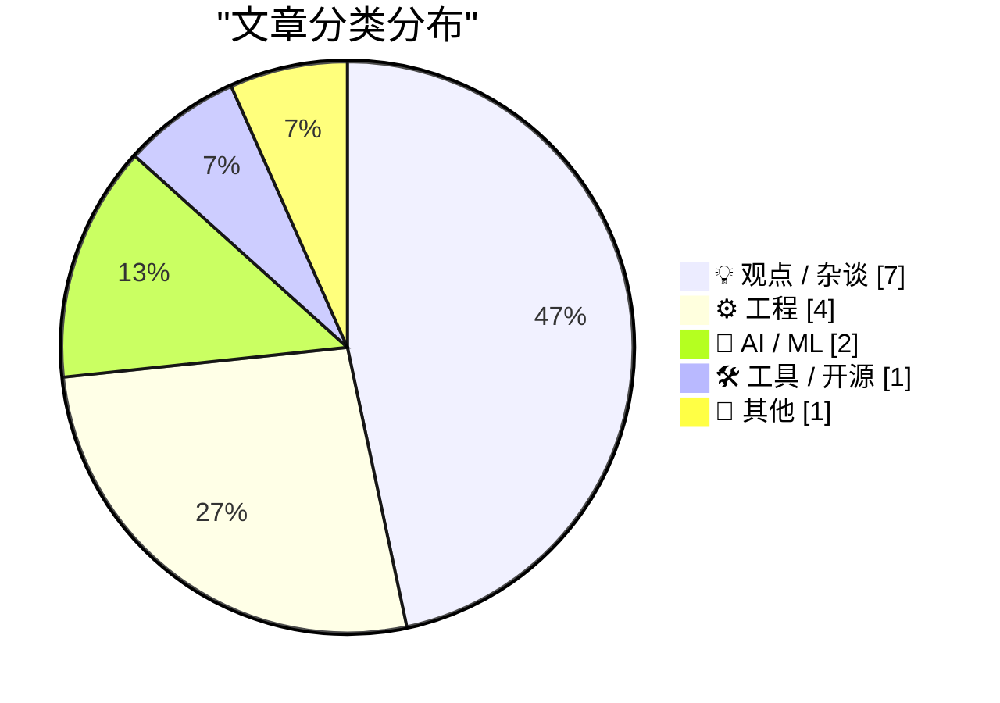
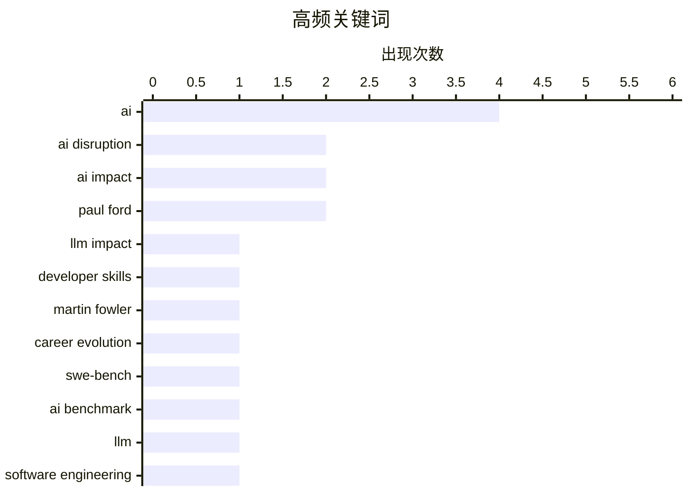

> 来自 Karpathy 推荐的 92 个顶级技术博客，AI 精选 Top 15

## 📝 今日看点

Today's tech headlines underscore the pervasive and disruptive arrival of artificial intelligence, fundamentally reshaping the industry. AI is rapidly impacting professional software development skills and prompting a re-evaluation of long-held engineering practices, with independent benchmarks showcasing significant model progress. This transformative shift is not only changing how we build but also sparking societal debate and redefining what constitutes value in an increasingly automated world.

---

## 🏆 今日必读

🥇 **Quoting Martin Fowler**

[Quoting Martin Fowler](https://simonwillison.net/2026/Feb/18/martin-fowler/#atom-everything) — simonwillison.net · 22 小时前 · 🤖 AI / ML

> Martin Fowler提出了关于大型语言模型（LLMs）如何影响专业软件开发技能的观点。他认为LLMs正在“吞噬专业技能”，导致对前端和后端专业开发人员的需求减少，因为驱动LLM的技能变得比平台细节更重要。Fowler质疑这种转变是会促使人们更广泛地认可“专家通才”的角色，还是LLMs编写大量代码的能力将简单地绕过现有的技术壁垒。

💡 **为什么值得读**: This article is worth reading for a concise, thought-provoking take from a renowned industry expert on the future of developer roles in the age of AI.

🏷️ LLM Impact, Developer Skills, Martin Fowler, Career Evolution

🥈 **SWE-bench February 2026 leaderboard update**

[SWE-bench February 2026 leaderboard update](https://simonwillison.net/2026/Feb/19/swe-bench/#atom-everything) — simonwillison.net · 10 小时前 · 🤖 AI / ML

> SWE-bench基准测试发布了2026年2月的最新排行榜，评估了当前一代的AI模型。此次更新的显著之处在于，这些结果是SWE-bench独立运行的完整测试，而非由模型开发实验室自行报告。最新的结果包括针对“仅限 Bash”基准的评估，为模型在这一特定领域的表现提供了中立的视角。独立的基准测试结果对于客观理解AI模型在代码生成和问题解决方面的性能至关重要。

💡 **为什么值得读**: Read this to get an objective, third-party view of the latest AI model performance on the SWE-bench coding benchmark, free from vendor bias.

🏷️ SWE-bench, AI Benchmark, LLM, Software Engineering

🥉 **The A.I. Disruption We’ve Been Waiting for Has Arrived**

[The A.I. Disruption We’ve Been Waiting for Has Arrived](https://simonwillison.net/2026/Feb/18/the-ai-disruption/#atom-everything) — simonwillison.net · 22 小时前 · 💡 观点 / 杂谈

> Paul Ford在《纽约时报》发表了一篇评论文章，宣告人们期待已久的AI颠覆已经到来。Simon Willison特别指出，Ford的文章中充满了值得引用的精彩片段，尤其提到了“十一月时刻”（可能与Inflection AI的进展有关）。这篇文章暗示了AI格局的重大转变，标志着AI的影响力正变得不可否认地具有颠覆性和变革性。

💡 **为什么值得读**: This article offers a compelling and quotable perspective on the current state of AI disruption from a respected voice, providing context for recent advancements.

🏷️ AI Disruption, AI Impact, Paul Ford, Technology Trends

---

## 📊 数据概览

| 扫描源 | 抓取文章 | 时间范围 | 精选 |
|:---:|:---:|:---:|:---:|
| 89/92 | 2503 篇 → 17 篇 | 24h | **15 篇** |

### 分类分布



### 高频关键词



<details>
<summary>📈 纯文本关键词图（终端友好）</summary>

```
ai               │ ████████████████████ 4
ai disruption    │ ██████████░░░░░░░░░░ 2
ai impact        │ ██████████░░░░░░░░░░ 2
paul ford        │ ██████████░░░░░░░░░░ 2
llm impact       │ █████░░░░░░░░░░░░░░░ 1
developer skills │ █████░░░░░░░░░░░░░░░ 1
martin fowler    │ █████░░░░░░░░░░░░░░░ 1
career evolution │ █████░░░░░░░░░░░░░░░ 1
swe-bench        │ █████░░░░░░░░░░░░░░░ 1
ai benchmark     │ █████░░░░░░░░░░░░░░░ 1
```

</details>

### 🏷️ 话题标签

**ai**(4) · **ai disruption**(2) · **ai impact**(2) · paul ford(2) · llm impact(1) · developer skills(1) · martin fowler(1) · career evolution(1) · swe-bench(1) · ai benchmark(1) · llm(1) · software engineering(1) · technology trends(1) · technology opinion(1) · type hints(1) · strong typing(1) · programming languages(1) · developer experience(1) · apple vision pro(1) · formula 1(1)

---

## 💡 观点 / 杂谈

### 1. The A.I. Disruption We’ve Been Waiting for Has Arrived

[The A.I. Disruption We’ve Been Waiting for Has Arrived](https://simonwillison.net/2026/Feb/18/the-ai-disruption/#atom-everything) — **simonwillison.net** · 22 小时前 · ⭐ 27/30

> Paul Ford在《纽约时报》发表了一篇评论文章，宣告人们期待已久的AI颠覆已经到来。Simon Willison特别指出，Ford的文章中充满了值得引用的精彩片段，尤其提到了“十一月时刻”（可能与Inflection AI的进展有关）。这篇文章暗示了AI格局的重大转变，标志着AI的影响力正变得不可否认地具有颠覆性和变革性。

🏷️ AI Disruption, AI Impact, Paul Ford, Technology Trends

---

### 2. Paul Ford: ‘The A.I. Disruption Has Arrived, and It Sure Is Fun’

[Paul Ford: ‘The A.I. Disruption Has Arrived, and It Sure Is Fun’](https://www.nytimes.com/2026/02/18/opinion/ai-software.html?unlocked_article_code=1.NFA.djaw.TBlAp8kE_N-i) — **daringfireball.net** · 17 小时前 · ⭐ 26/30

> Paul Ford在《纽约时报》的一篇评论文章中，反思了AI颠覆的到来，并表达了他对AI影响的复杂个人感受。Ford观察到一种社会两极分化，指出“我爱的人都讨厌这些东西，我讨厌的人都喜欢它”。尽管存在这种分歧，Ford承认自己对AI的进步“出奇地兴奋”，并将这种热情归因于最初吸引他进入科技领域的相同性格缺陷。

🏷️ AI Disruption, Paul Ford, AI Impact, Technology Opinion

---

### 3. One More Spitball Idea for Apple’s March 4 Media Event ‘Experience’: Immersive F1 on Vision Pro?

[One More Spitball Idea for Apple’s March 4 Media Event ‘Experience’: Immersive F1 on Vision Pro?](https://www.formula1.com/en/latest/article/official-grand-prix-start-times-for-2026-f1-season-confirmed.2UgPfArqH76tzlOYh21jSG) — **daringfireball.net** · 10 小时前 · ⭐ 25/30

> 一则推测性想法认为，苹果可能在其3月4日的媒体活动上演示Vision Pro上的沉浸式一级方程式（F1）赛事直播。苹果电视是F1在美国的独家广播合作伙伴，而2026年F1赛季将在活动后不久的3月8日开始。苹果此前已在VisionOS上尝试过沉浸式体育直播，包括湖人队的比赛，这表明其对该领域有战略兴趣。因此，在3月4日演示Vision Pro上的沉浸式F1将是展示该设备在直播体育娱乐方面能力的一个及时且有影响力的方式。

🏷️ Apple Vision Pro, Formula 1, Immersive Media, Apple Event

---

### 4. Is the Future “AWS for Everything”?

[Is the Future “AWS for Everything”?](https://www.construction-physics.com/p/is-the-future-aws-for-everything) — **construction-physics.com** · 2 小时前 · ⭐ 25/30

> 文章探讨了效率提升和产品成本降低在历史上依赖于重复性，即反复运行生产过程这一基本原则。作者的书籍提出，持续、重复地执行生产过程对于实现显著改进和随着时间推移降低产品成本至关重要。这一基本思想引发了关于该原则如何适用于各行各业，以及“万物皆AWS”模式（暗示标准化、可重复的服务）是否是未来效率的终极形态的疑问。

🏷️ AWS, platformization, industry trends, efficiency

---

### 5. A Few Rambling Observations on Care

[A Few Rambling Observations on Care](https://blog.jim-nielsen.com/2026/observations-on-care/) — **blog.jim-nielsen.com** · 20 小时前 · ⭐ 25/30

> 作者认为，在AI驱动的新世界中，“用心”（care）是比“品味”（taste）更重要的产品品质。尽管“品味”常被吹捧为新的至高技能，但作者更看重产品中的“用心”。文章探讨了“用心”是否可以衡量、规模化是否会扼杀“用心”，以及如果产品讨论仅限于数字，是否会失去“用心”等问题。作者暗示，“用心”似乎与量化的还原性本质是矛盾的，表明它是一种无形但至关重要的产品方面。

🏷️ AI, product design, craftsmanship, human values

---

### 6. Experimenting with sponsorship for my blog and newsletter

[Experimenting with sponsorship for my blog and newsletter](https://simonwillison.net/2026/Feb/19/sponsorship/#atom-everything) — **simonwillison.net** · 9 小时前 · ⭐ 24/30

> Simon Willison正在尝试为他的博客和时事通讯接受赞助，这与他长期以来的抵制态度有所不同。他此前一直避免赞助，以维护其作为独立声音的信誉，并防止损害其声誉。他的转变受到了Troy Hunt赞助模式的启发，该模式采用页面横幅中简单、不显眼的文本行，不使用JavaScript或cookies。Willison现在正采用类似的低影响赞助方式，旨在创收的同时保持其编辑独立性和用户体验。

🏷️ Sponsorship, Content Creation, Monetization, Blogging

---

### 7. AI is the Best Thing to Happen to Art

[AI is the Best Thing to Happen to Art](https://geohot.github.io//blog/jekyll/update/2026/02/19/ai-art.html) — **geohot.github.io** · 23 小时前 · ⭐ 24/30

> 这篇题为“AI 是艺术领域最棒的事情”的文章，开篇便提及了对 AI 艺术的常见批评，引用了一个 AI 生成音乐被认为是“糟粕”且歌词缺乏灵感的例子。尽管有这个负面轶事，但文章的总体主题，正如其标题所示，很可能会为 AI 对艺术世界的积极变革影响提出强有力的论证。它可能会探讨 AI 如何在各个方面增强创造力、可访问性或新的艺术表达形式，旨在反驳 AI 本质上会贬低艺术的说法。

🏷️ AI, art, music, creativity

---

## ⚙️ 工程

### 8. Typing without having to type

[Typing without having to type](https://simonwillison.net/2026/Feb/18/typing/#atom-everything) — **simonwillison.net** · 20 小时前 · ⭐ 25/30

> 资深程序员 Simon Willison 在职业生涯25年后，正在重新评估他对类型提示和强类型的长期偏好，尤其是在AI编码代理的背景下。他过去抵制显式类型，因为它会减慢代码迭代速度，尤其是在对他生产力至关重要的REPL环境中。然而，随着AI编码代理接管了“打字”工作，定义类型的开销大大减少。因此，显式类型带来的代码清晰度和可维护性等好处，在AI代劳后变得更具吸引力。

🏷️ Type Hints, Strong Typing, Programming Languages, Developer Experience

---

### 9. LadybirdBrowser/ladybird: Abandon Swift adoption

[LadybirdBrowser/ladybird: Abandon Swift adoption](https://simonwillison.net/2026/Feb/19/ladybird/#atom-everything) — **simonwillison.net** · 13 小时前 · ⭐ 24/30

> Ladybird浏览器项目已决定放弃其此前宣布的采用Swift作为内存安全语言的计划。该项目曾在2024年8月公开表示有意集成Swift以增强内存安全性。然而，根据特定提交（e87f889e31afbb5fa32c910603c7f5e781c97afd），该项目已撤销此决定。这标志着Ladybird浏览器技术路线图的重大变化，表明其内存安全策略已放弃Swift。

🏷️ Ladybird Browser, Swift, Programming Language, Open Source

---

### 10. AI is a NAND Maximiser

[AI is a NAND Maximiser](https://shkspr.mobi/blog/2026/02/ai-is-a-nand-maximiser/) — **shkspr.mobi** · 2 小时前 · ⭐ 23/30

> 文章强调了 AI 公司对计算机芯片，特别是 NAND 闪存的巨大需求，对更广泛的科技行业产生了显著影响。PC Gamer 报道称，这种需求正在造成灾难性后果，Phison 首席执行官提供了一个鲜明的例子。他估计，如果 NVIDIA Vera Rubin 出货数千万台，每台需要 20+TB SSD，这将消耗去年全球 NAND 产量的约 20%。AI 基础设施的这种大规模消耗正在造成严重的供应紧张，极大地扰乱了供应链并影响了其他行业的可用性。

🏷️ AI, hardware, supply chain, SSD

---

### 11. Stream of Consciousness Driven Development

[Stream of Consciousness Driven Development](https://buttondown.com/hillelwayne/archive/stream-of-consciousness-driven-development/) — **buttondown.com/hillelwayne** · 22 小时前 · ⭐ 22/30

> 本文介绍了“意识流驱动开发”（SCDD），这是一种用于记录和解决复杂技术问题的新方法，尤其适用于结对编程会话。作者在与客户共同编写规范时，遇到一个复杂问题，没有口头解释，而是开始在一个新的 Markdown 文件（例如 `NameOfProblem.md`）中打字。这个过程首先总结问题，然后详细描述，接着以自由的“意识流”方式概述潜在解决方案。这种方法允许即时捕捉涌现的思绪和想法，从而促进更清晰的沟通和问题解决。SCDD 似乎是一种有前景的、未经打磨的技术，通过将思维过程外化为书面形式，有效阐明和解决复杂的技术问题。

🏷️ development methodology, pair programming, software design

---

## 🤖 AI / ML

### 12. Quoting Martin Fowler

[Quoting Martin Fowler](https://simonwillison.net/2026/Feb/18/martin-fowler/#atom-everything) — **simonwillison.net** · 22 小时前 · ⭐ 29/30

> Martin Fowler提出了关于大型语言模型（LLMs）如何影响专业软件开发技能的观点。他认为LLMs正在“吞噬专业技能”，导致对前端和后端专业开发人员的需求减少，因为驱动LLM的技能变得比平台细节更重要。Fowler质疑这种转变是会促使人们更广泛地认可“专家通才”的角色，还是LLMs编写大量代码的能力将简单地绕过现有的技术壁垒。

🏷️ LLM Impact, Developer Skills, Martin Fowler, Career Evolution

---

### 13. SWE-bench February 2026 leaderboard update

[SWE-bench February 2026 leaderboard update](https://simonwillison.net/2026/Feb/19/swe-bench/#atom-everything) — **simonwillison.net** · 10 小时前 · ⭐ 28/30

> SWE-bench基准测试发布了2026年2月的最新排行榜，评估了当前一代的AI模型。此次更新的显著之处在于，这些结果是SWE-bench独立运行的完整测试，而非由模型开发实验室自行报告。最新的结果包括针对“仅限 Bash”基准的评估，为模型在这一特定领域的表现提供了中立的视角。独立的基准测试结果对于客观理解AI模型在代码生成和问题解决方面的性能至关重要。

🏷️ SWE-bench, AI Benchmark, LLM, Software Engineering

---

## 🛠 工具 / 开源

### 14. Frigate with Hailo for object detection on a Raspberry Pi

[Frigate with Hailo for object detection on a Raspberry Pi](https://www.jeffgeerling.com/blog/2026/frigate-with-hailo-for-object-detection-on-a-raspberry-pi/) — **jeffgeerling.com** · 18 小时前 · ⭐ 24/30

> 本文探讨了将 Frigate 安全摄像头系统从 Raspberry Pi CM4 和 Coral TPU 升级到 Raspberry Pi 5 结合 Hailo AI HAT+ 进行目标检测的可能性。作者目前的 Frigate 服务器使用 Coral TPU 来检测人、车和动物。Raspberry Pi 5 的 AI HAT+ 提供了内置的 Hailo-8L NPU，有望带来更好的性能。文章旨在详细介绍 Hailo-8L NPU 在 Pi 5 上的设置过程、配置以及与 Coral TPU 相比在 Frigate 目标检测任务中的性能提升。最终目标是评估 Hailo-8L NPU 是否能为本地 AI 驱动的安全摄像头系统提供更高效、更强大的解决方案。

🏷️ Frigate, Raspberry Pi, Object Detection, Hailo

---

## 📝 其他

### 15. Pluralistic: Six Years of Pluralistic (19 Feb 2026)

[Pluralistic: Six Years of Pluralistic (19 Feb 2026)](https://pluralistic.net/2026/02/19/now-we-are-six/) — **pluralistic.net** · 1 小时前 · ⭐ 23/30

> 这篇文章纪念了 Cory Doctorow 的“Pluralistic”博客成立六周年，回顾了其发展历程和当前内容。该文章是对博客长寿及其持续输出网络内容的元评论，并重点介绍了一系列近期链接和主题，包括“MBA 颅相学”、索尼 DRM 首席执行官的离职、“中西部解放广场”以及关于“反人马座和 AI”的讨论。文章还提供了作者即将和近期露面的更新，以及他最新和即将出版的书籍信息。这是一篇庆祝性和回顾性的文章，强调了“Pluralistic”六年来持续提供的信息流和批判性评论。

🏷️ Pluralistic, Daily Links, AI, DRM

---

*生成于 2026-02-19 15:13 | 扫描 89 源 → 获取 2503 篇 → 精选 15 篇*
*基于 [Hacker News Popularity Contest 2025](https://refactoringenglish.com/tools/hn-popularity/) RSS 源列表，由 [Andrej Karpathy](https://x.com/karpathy) 推荐*
*由「懂点儿AI」制作，欢迎关注同名微信公众号获取更多 AI 实用技巧 💡*
