> Curated from 92 top technical blogs recommended by Karpathy, AI-selected Top 14

## 📝 Today's Highlights

Today's tech news highlights the profound and multifaceted impact of artificial intelligence, from its escalating demand for critical hardware to its integration into edge devices and software development. This AI-driven disruption is not only reshaping productivity tools and engineering benchmarks but also prompting a reevaluation of essential human skills in an increasingly automated world. Meanwhile, the industry continues to explore the efficiency benefits and potential dominance of "everything-as-a-service" platforms, signaling a future of optimized, centralized tooling.

---

## 🏆 Must Read Today

🥇 **AI is a NAND Maximiser**

[AI is a NAND Maximiser](https://shkspr.mobi/blog/2026/02/ai-is-a-nand-maximiser/) — shkspr.mobi · 4h ago · ⚙️ Engineering

> The article highlights the severe impact of AI companies' demand for computer chips on the broader industry. Specifically, NVIDIA's Vera Rubin chips, each requiring 20+TB SSDs, could consume approximately 20% of last year's global NAND production capacity if tens of millions of units ship. This massive demand for NAND, a critical microchip component, is creating significant supply chain strain. The insatiable need for high-capacity storage components like NAND flash by the AI sector poses a substantial challenge to global chip availability for other industries.

💡 **Why read it**: It quantifies a critical, immediate impact of AI's hardware demands on global chip supply, specifically NAND production, affecting the entire tech industry.

🏷️ AI demand, NAND, SSD, chip shortage

🥈 **A Few Rambling Observations on Care**

[A Few Rambling Observations on Care](https://blog.jim-nielsen.com/2026/observations-on-care/) — blog.jim-nielsen.com · 22h ago · 💡 Opinion / Essays

> This article contrasts "taste" and "care" as paramount skills in the AI era, advocating for "care" in product development. It questions the measurability of care, whether scale inherently diminishes it, and if reducing product conversations solely to numerical metrics leads to its loss. The author suggests that "care" appears antithetical to the reductive nature of quantification. Ultimately, the piece implies that genuine product quality and user satisfaction might stem more from an unquantifiable sense of "care" than from measurable data or subjective "taste."

💡 **Why read it**: It offers a philosophical yet practical perspective on the qualitative aspects of product development, like 'care,' in an increasingly data-driven and AI-centric world.

🏷️ AI, Product Design, Care, Taste

🥉 **Frigate with Hailo for object detection on a Raspberry Pi**

[Frigate with Hailo for object detection on a Raspberry Pi](https://www.jeffgeerling.com/blog/2026/frigate-with-hailo-for-object-detection-on-a-raspberry-pi/) — jeffgeerling.com · 20h ago · ⚙️ Engineering

> The author explores upgrading their Frigate server for security camera object detection, currently running on a Raspberry Pi CM4 with a Coral TPU. Raspberry Pi now offers AI HAT+'s for the Raspberry Pi 5, featuring built-in NPUs like the Hailo-8L. The article likely details an experiment or setup guide for integrating Frigate with a Raspberry Pi 5 and a Hailo AI HAT+ to leverage its NPU for improved object detection performance. This setup promises a more integrated and potentially more efficient local object detection solution compared to previous configurations.

💡 **Why read it**: It provides practical, technical insights into upgrading a home security NVR system using a Raspberry Pi 5 and a Hailo AI HAT+ for enhanced, local object detection.

🏷️ Frigate, Raspberry Pi, Hailo, object detection

---

## 📊 Data Overview

| Sources Scanned | Articles Fetched | Time Window | Selected |
|:---:|:---:|:---:|:---:|
| 89/92 | 2503 -> 14 | 24h | **14** |

### Category Distribution

```mermaid
pie showData
    title "Category Distribution"
    "⚙️ Engineering" : 6
    "💡 Opinion / Essays" : 6
    "🤖 AI / ML" : 1
    "📝 Other" : 1
```



### Top Keywords


<details>
<summary>📈 Plain Text Keyword Chart (Terminal Friendly)</summary>

```
ai             │ ████████████████████ 2
ai demand      │ ██████████░░░░░░░░░░ 1
nand           │ ██████████░░░░░░░░░░ 1
ssd            │ ██████████░░░░░░░░░░ 1
chip shortage  │ ██████████░░░░░░░░░░ 1
product design │ ██████████░░░░░░░░░░ 1
care           │ ██████████░░░░░░░░░░ 1
taste          │ ██████████░░░░░░░░░░ 1
frigate        │ ██████████░░░░░░░░░░ 1
raspberry pi   │ ██████████░░░░░░░░░░ 1
```

</details>

### 🏷️ Topic Tags

**ai**(2) · **ai demand**(1) · **nand**(1) · ssd(1) · chip shortage(1) · product design(1) · care(1) · taste(1) · frigate(1) · raspberry pi(1) · hailo(1) · object detection(1) · aws(1) · cloud(1) · efficiency(1) · strategy(1) · ai disruption(1) · paul ford(1) · industry opinion(1) · technology impact(1)

---

## ⚙️ Engineering

### 1. AI is a NAND Maximiser

[AI is a NAND Maximiser](https://shkspr.mobi/blog/2026/02/ai-is-a-nand-maximiser/) — **shkspr.mobi** · 4h ago · ⭐ 27/30

> The article highlights the severe impact of AI companies' demand for computer chips on the broader industry. Specifically, NVIDIA's Vera Rubin chips, each requiring 20+TB SSDs, could consume approximately 20% of last year's global NAND production capacity if tens of millions of units ship. This massive demand for NAND, a critical microchip component, is creating significant supply chain strain. The insatiable need for high-capacity storage components like NAND flash by the AI sector poses a substantial challenge to global chip availability for other industries.

🏷️ AI demand, NAND, SSD, chip shortage

---

### 2. Frigate with Hailo for object detection on a Raspberry Pi

[Frigate with Hailo for object detection on a Raspberry Pi](https://www.jeffgeerling.com/blog/2026/frigate-with-hailo-for-object-detection-on-a-raspberry-pi/) — **jeffgeerling.com** · 20h ago · ⭐ 25/30

> The author explores upgrading their Frigate server for security camera object detection, currently running on a Raspberry Pi CM4 with a Coral TPU. Raspberry Pi now offers AI HAT+'s for the Raspberry Pi 5, featuring built-in NPUs like the Hailo-8L. The article likely details an experiment or setup guide for integrating Frigate with a Raspberry Pi 5 and a Hailo AI HAT+ to leverage its NPU for improved object detection performance. This setup promises a more integrated and potentially more efficient local object detection solution compared to previous configurations.

🏷️ Frigate, Raspberry Pi, Hailo, object detection

---

### 3. Typing without having to type

[Typing without having to type](https://simonwillison.net/2026/Feb/18/typing/#atom-everything) — **simonwillison.net** · 22h ago · ⭐ 23/30

> A programmer with over 25 years of experience is reconsidering his long-standing resistance to type hints and strong typing in programming. Previously, he avoided strong typing because it slowed down iteration, especially in REPL environments crucial for his productivity. However, with the advent of coding agents now performing the actual "typing" work, the benefits of explicitly defining types, such as improved code clarity and maintainability, have become significantly more attractive. The article concludes that AI coding agents fundamentally shift the cost-benefit analysis of strong typing, making it a more appealing practice for modern developers.

🏷️ type hints, strong typing, programming languages, developer productivity

---

### 4. Go Modules for Package Management Tooling

[Go Modules for Package Management Tooling](https://nesbitt.io/2026/02/19/go-modules-for-package-management-tooling.html) — **nesbitt.io** · 17h ago · ⭐ 22/30

> The article discusses the application of Go modules in building package management tooling, specifically referencing the `git-pkgs` project. It highlights that `git-pkgs` has been rebuilt using Go modules, drawing upon the author's prior experience with Ruby supply chain libraries. This indicates a strategic transition or re-implementation of package management logic into the Go ecosystem, leveraging its native module system for improved dependency management and project structure. The piece concludes that Go modules are being effectively employed to develop robust package management tools like `git-pkgs`, integrating established supply chain library concepts.

🏷️ Go, Modules, Package Management, Supply Chain

---

### 5. Exploring the signals the dialog manager uses for dismissing a dialog

[Exploring the signals the dialog manager uses for dismissing a dialog](https://devblogs.microsoft.com/oldnewthing/20260219-00/?p=112072) — **devblogs.microsoft.com/oldnewthing** · 2h ago · ⭐ 19/30

> This article from "The Old New Thing" blog explores the internal mechanisms and signals that the Windows dialog manager utilizes to dismiss a dialog box. It focuses on the underlying flow and specific triggers that lead to a dialog's closure, indicating a deep dive into Windows API behavior. The core topic is understanding the precise interaction between user input or system events and the dialog manager's dismissal logic. The main conclusion is to understand the intricate signal processing involved in dialog management for robust Windows application development.

🏷️ Windows, dialogs, UI, system programming

---

### 6. LadybirdBrowser/ladybird: Abandon Swift adoption

[LadybirdBrowser/ladybird: Abandon Swift adoption](https://simonwillison.net/2026/Feb/19/ladybird/#atom-everything) — **simonwillison.net** · 15h ago · ⭐ 18/30

> This article reports on the Ladybird browser project's decision to abandon its previously announced adoption of Swift as its memory-safe language. In August 2024, Ladybird had publicly stated its intention to integrate Swift for memory safety. However, a recent commit (e87f889e31afbb5fa32c910603c7f5e781c97afd) signifies a reversal of this plan, indicating a re-evaluation of their language strategy. The core problem addressed is the project's strategic choice of programming languages for ensuring memory safety in a browser. The main takeaway is that the Ladybird project has re-evaluated its language strategy, opting against Swift for its memory-safe components.

🏷️ Ladybird, browser, Swift, open source

---

## 💡 Opinion / Essays

### 7. A Few Rambling Observations on Care

[A Few Rambling Observations on Care](https://blog.jim-nielsen.com/2026/observations-on-care/) — **blog.jim-nielsen.com** · 22h ago · ⭐ 26/30

> This article contrasts "taste" and "care" as paramount skills in the AI era, advocating for "care" in product development. It questions the measurability of care, whether scale inherently diminishes it, and if reducing product conversations solely to numerical metrics leads to its loss. The author suggests that "care" appears antithetical to the reductive nature of quantification. Ultimately, the piece implies that genuine product quality and user satisfaction might stem more from an unquantifiable sense of "care" than from measurable data or subjective "taste."

🏷️ AI, Product Design, Care, Taste

---

### 8. Is the Future “AWS for Everything”?

[Is the Future “AWS for Everything”?](https://www.construction-physics.com/p/is-the-future-aws-for-everything) — **construction-physics.com** · 4h ago · ⭐ 25/30

> The article explores the idea that historical efficiency improvements and cost reductions in product manufacturing are fundamentally dependent on repetition and standardized production processes. It implicitly questions whether this principle, exemplified by the "AWS for Everything" model that thrives on standardization and economies of scale, is universally applicable across all industries. The author's underlying theme emphasizes how repetitive processes are key drivers for making products cheaper over time. The piece concludes by suggesting that the future of efficiency and cost reduction across diverse sectors hinges on the extent to which processes can be standardized and repeated, mirroring the "as-a-service" model.

🏷️ AWS, Cloud, Efficiency, Strategy

---

### 9. Paul Ford: ‘The A.I. Disruption Has Arrived, and It Sure Is Fun’

[Paul Ford: ‘The A.I. Disruption Has Arrived, and It Sure Is Fun’](https://www.nytimes.com/2026/02/18/opinion/ai-software.html?unlocked_article_code=1.NFA.djaw.TBlAp8kE_N-i) — **daringfireball.net** · 20h ago · ⭐ 24/30

> Paul Ford's op-ed presents a contrarian and "annoyingly excited" perspective on the ongoing AI disruption. He observes a polarized reaction to AI, noting that those he admires tend to dislike it, while those he dislikes embrace it. Despite this social dynamic, Ford's personal inclination towards technology, which he attributes to certain "personality flaws," leads him to find the current AI disruption enjoyable. The article ultimately offers a provocative and personal take on the AI revolution, highlighting the diverse emotional and intellectual responses it elicits.

🏷️ AI disruption, Paul Ford, industry opinion, technology impact

---

### 10. One More Spitball Idea for Apple’s March 4 Media Event ‘Experience’: Immersive F1 on Vision Pro?

[One More Spitball Idea for Apple’s March 4 Media Event ‘Experience’: Immersive F1 on Vision Pro?](https://www.formula1.com/en/latest/article/official-grand-prix-start-times-for-2026-f1-season-confirmed.2UgPfArqH76tzlOYh21jSG) — **daringfireball.net** · 12h ago · ⭐ 22/30

> The article speculates on a potential announcement for immersive Formula 1 broadcasting on Apple Vision Pro at Apple's upcoming March 4 media event. Given that the 2026 F1 season commences on March 8 in Australia and Apple TV is the exclusive U.S. broadcast partner for F1, a demo of live immersive F1 on Vision Pro would be strategically timed. This aligns with Apple's existing efforts in live immersive sports, such as limited Lakers games on VisionOS. An immersive F1 experience on Vision Pro at the event is presented as a plausible and impactful announcement, leveraging Apple's sports broadcasting rights and the Vision Pro's capabilities.

🏷️ Apple Vision Pro, F1, immersive experience, AR/VR

---

### 11. Experimenting with sponsorship for my blog and newsletter

[Experimenting with sponsorship for my blog and newsletter](https://simonwillison.net/2026/Feb/19/sponsorship/#atom-everything) — **simonwillison.net** · 11h ago · ⭐ 21/30

> Simon Willison, the author, is experimenting with accepting sponsorship for his blog and newsletter after years of resistance. His primary concern was preserving his credibility as an independent voice, but he was inspired by Troy Hunt's approach to sponsorship. Hunt's model involves a simple, unobtrusive text row in the page banner, implemented without JavaScript or cookies, which he first detailed in 2016. By adopting this minimalist and transparent sponsorship model, the author aims to generate revenue without compromising his editorial independence or the user experience.

🏷️ blog, sponsorship, monetization, content creation

---

### 12. Pluralistic: Six Years of Pluralistic (19 Feb 2026)

[Pluralistic: Six Years of Pluralistic (19 Feb 2026)](https://pluralistic.net/2026/02/19/now-we-are-six/) — **pluralistic.net** · 3h ago · ⭐ 21/30

> This article celebrates six years of the Pluralistic blog, highlighting its consistent output of web content since its inception. It covers a diverse range of topics, including "Delights to delectate," "Object permanence" (e.g., MBA phrenology, Sony's DRM CEO, AI), and updates on the author's upcoming/recent appearances and book releases. The blog emphasizes continuous writing and reader engagement as core to its longevity, showcasing a prolific independent publishing model. The main takeaway is the sustained commitment to producing diverse and engaging content over a significant six-year period.

🏷️ Pluralistic, Cory Doctorow, tech commentary, AI

---

## 🤖 AI / ML

### 13. SWE-bench February 2026 leaderboard update

[SWE-bench February 2026 leaderboard update](https://simonwillison.net/2026/Feb/19/swe-bench/#atom-everything) — **simonwillison.net** · 12h ago · ⭐ 22/30

> The article announces a significant update to the SWE-bench leaderboard for February 2026, a crucial benchmark for evaluating AI models in software engineering. The official leaderboard, which is typically updated infrequently, has received a full run against current generation models. This update is particularly notable because the results are independently generated, rather than being self-reported by the labs, specifically for their "Bash Only" benchmark. The updated SWE-bench leaderboard thus provides crucial, independently verified performance data for current AI models in software engineering tasks, offering a more objective view than self-reported metrics.

🏷️ SWE-bench, AI models, benchmarks, software engineering AI

---

## 📝 Other

### 14. Office Space released Feb. 19, 1999

[Office Space released Feb. 19, 1999](https://dfarq.homeip.net/office-space-released-feb-19-1999/?utm_source=rss&#038;utm_medium=rss&#038;utm_campaign=office-space-released-feb-19-1999) — **dfarq.homeip.net** · 5h ago · ⭐ 9/30

> This article commemorates the 25th anniversary of the classic black comedy film "Office Space," which debuted in theaters on February 19, 1999. It notes that the film was Mike Judge’s first live-action directorial effort, contrasting it with his earlier animated successes such as "Beavis and Butt-Head" and "King of the Hill." The article implicitly argues for the film's significance and lasting cultural impact on workplace satire. The main takeaway is the enduring legacy and importance of "Office Space" as a cultural touchstone and a key work in Mike Judge's career.

🏷️ Office Space, Movie, Anniversary, Culture

---

*Generated at 2026-02-19 17:20 | Scanned 89 sources -> 2503 articles -> selected 14*
*Based on the [Hacker News Popularity Contest 2025](https://refactoringenglish.com/tools/hn-popularity/) RSS source list recommended by [Andrej Karpathy](https://x.com/karpathy)*
*Produced by Dongdianr AI. Follow the same-name WeChat public account for more AI practical tips 💡*
