> Curated from 92 top technical blogs recommended by Karpathy, AI-selected Top 8

## 📝 Today's Highlights

Today's tech landscape is marked by rapid advancements in artificial intelligence and evolving digital experiences. New AI models like Gemini 3.1 Pro are setting competitive benchmarks in performance and cost, while engineers optimize complex AI systems with innovations like prompt caching. Concurrently, digital infrastructure is seeing shifts with federated protocols such as ActivityPub, and entertainment is being reimagined through collaborations like IMAX and Apple bringing live F1 races to theaters.

---

## 🏆 Must Read Today

🥇 **Gemini 3.1 Pro**

[Gemini 3.1 Pro](https://simonwillison.net/2026/Feb/19/gemini-31-pro/#atom-everything) — simonwillison.net · 21h ago · 🤖 AI / ML

> This article introduces Google's Gemini 3.1 Pro model, highlighting its competitive pricing and performance. The model is priced at $2/million input and $12/million output for under 200,000 tokens, or $4/$18 for 200,000 to 1,000,000 tokens. This makes it less than half the price of Claude Opus 4.6, despite achieving very similar benchmark scores. Additionally, Gemini 3.1 Pro boasts improved SVG animation performance compared to its predecessor, Gemini 3 Pro. The model offers a cost-effective alternative to high-end AI models with comparable capabilities.

💡 **Why read it**: It provides a concise comparison of a new AI model's performance and pricing against a leading competitor, offering valuable insights for AI developers and users.

🏷️ Gemini 3.1, LLM, Google AI, pricing

🥈 **Quoting Thariq Shihipar**

[Quoting Thariq Shihipar](https://simonwillison.net/2026/Feb/20/thariq-shihipar/#atom-everything) — simonwillison.net · 7h ago · ⚙️ Engineering

> This article discusses how prompt caching is crucial for the feasibility of long-running agentic AI products like Claude Code. Prompt caching enables the reuse of computation from previous roundtrips, significantly decreasing both latency and operational costs. Claude Code's entire system harness is built around this mechanism, with a high prompt cache hit rate directly contributing to cost reduction. This efficiency also allows for more generous rate limits on subscription plans, and alerts are actively run on prompt cache performance. Prompt caching is a critical technical strategy for optimizing performance and cost-effectiveness in complex, iterative AI applications.

💡 **Why read it**: It highlights a crucial, often overlooked technical detail—prompt caching—that underpins the economic viability and performance of advanced AI agentic products.

🏷️ prompt caching, AI agents, LLM optimization, latency

🥉 **ActivityPub**

[ActivityPub](https://nesbitt.io/2026/02/20/activitypub.html) — nesbitt.io · 15h ago · ⚙️ Engineering

> This article humorously describes ActivityPub as a federated protocol for announcing 'pub activities.' It states that the protocol was first standardized in 1714. Despite its purported ancient origins, it is still in use today across 46,000 active instances. The article presents ActivityPub as a remarkably long-lived and widely adopted federated protocol.

💡 **Why read it**: It presents a surprising and humorous historical detail about a widely used federated protocol, challenging common perceptions of technology timelines.

🏷️ ActivityPub, federated web, protocol, humor

---

## 📊 Data Overview

| Sources Scanned | Articles Fetched | Time Window | Selected |
|:---:|:---:|:---:|:---:|
| 89/92 | 2503 -> 8 | 24h | **8** |

### Category Distribution

```mermaid
pie showData
    title "Category Distribution"
    "⚙️ Engineering" : 3
    "📝 Other" : 3
    "🤖 AI / ML" : 1
    "💡 Opinion / Essays" : 1
```



### Top Keywords


<details>
<summary>📈 Plain Text Keyword Chart (Terminal Friendly)</summary>

```
gemini 3.1       │ ████████████████████ 1
llm              │ ████████████████████ 1
google ai        │ ████████████████████ 1
pricing          │ ████████████████████ 1
prompt caching   │ ████████████████████ 1
ai agents        │ ████████████████████ 1
llm optimization │ ████████████████████ 1
latency          │ ████████████████████ 1
activitypub      │ ████████████████████ 1
federated web    │ ████████████████████ 1
```

</details>

### 🏷️ Topic Tags

**gemini 3.1**(1) · **llm**(1) · **google ai**(1) · pricing(1) · prompt caching(1) · ai agents(1) · llm optimization(1) · latency(1) · activitypub(1) · federated web(1) · protocol(1) · humor(1) · vic-20(1) · retro computing(1) · twitter(1) · hardware(1) · corporate power(1) · social media(1) · privacy(1) · brazil(1)

---

## ⚙️ Engineering

### 1. Quoting Thariq Shihipar

[Quoting Thariq Shihipar](https://simonwillison.net/2026/Feb/20/thariq-shihipar/#atom-everything) — **simonwillison.net** · 7h ago · ⭐ 24/30

> This article discusses how prompt caching is crucial for the feasibility of long-running agentic AI products like Claude Code. Prompt caching enables the reuse of computation from previous roundtrips, significantly decreasing both latency and operational costs. Claude Code's entire system harness is built around this mechanism, with a high prompt cache hit rate directly contributing to cost reduction. This efficiency also allows for more generous rate limits on subscription plans, and alerts are actively run on prompt cache performance. Prompt caching is a critical technical strategy for optimizing performance and cost-effectiveness in complex, iterative AI applications.

🏷️ prompt caching, AI agents, LLM optimization, latency

---

### 2. ActivityPub

[ActivityPub](https://nesbitt.io/2026/02/20/activitypub.html) — **nesbitt.io** · 15h ago · ⭐ 18/30

> This article humorously describes ActivityPub as a federated protocol for announcing 'pub activities.' It states that the protocol was first standardized in 1714. Despite its purported ancient origins, it is still in use today across 46,000 active instances. The article presents ActivityPub as a remarkably long-lived and widely adopted federated protocol.

🏷️ ActivityPub, federated web, protocol, humor

---

### 3. On February 20, 2010 a VIC-20 tweeted

[On February 20, 2010 a VIC-20 tweeted](https://dfarq.homeip.net/on-february-20-2010-a-vic-20-tweeted/?utm_source=rss&#038;utm_medium=rss&#038;utm_campaign=on-february-20-2010-a-vic-20-tweeted) — **dfarq.homeip.net** · 3h ago · ⭐ 17/30

> This article recounts the unique event of the first tweet ever sent from a Commodore VIC-20 computer. On February 20, 2010, Syd Bolton, curator of the Canadian Personal Computer Museum, achieved this technical feat. The VIC-20, which was the best-selling computer of 1982, was used to interact with Twitter, a platform still highly relevant at the time. This event marked a novel intersection of vintage computing and then-modern social media. It showcased an unusual technical achievement by bridging decades of technological advancement.

🏷️ VIC-20, retro computing, Twitter, hardware

---

## 📝 Other

### 4. IMAX and Apple Collaborate to Screen F1 Races Live in Theaters

[IMAX and Apple Collaborate to Screen F1 Races Live in Theaters](https://www.motorsport.com/f1/news/f1-to-screen-live-in-imax-theatres-in-2026-as-apple-tv-unveils-new-us-viewing-experience/10798974/) — **daringfireball.net** · 15h ago · ⭐ 11/30

> This article reports on a new collaboration between IMAX and Apple TV to screen live F1 races in theaters. Starting in 2026, a select number of Formula 1 races will be shown live in IMAX locations across the United States. This initiative is part of Apple TV's multi-year deal to broadcast the F1 championship in the US. The goal is to deliver the energy of the sport through an enhanced fan viewing experience. This partnership creates a novel, immersive viewing experience for F1 fans by bringing live races to IMAX cinemas.

🏷️ IMAX, Apple TV, F1, entertainment

---

### 5. Book Review: Families And How To Survive Them by John Cleese and Robin Skynner ★★⯪☆☆

[Book Review: Families And How To Survive Them by John Cleese and Robin Skynner ★★⯪☆☆](https://shkspr.mobi/blog/2026/02/book-review-families-and-how-to-survive-them-by-john-cleese-and-robin-skynner/) — **shkspr.mobi** · 2h ago · ⭐ 11/30

> This article provides a review of the book "Families And How To Survive Them" by John Cleese and Robin Skynner, rating it 2.5 out of 5 stars. The book is presented as a Socratic dialogue on therapy between Skynner, the teacher, and Cleese, the pupil. While the conversational format with a skeptical interlocutor is initially charming, the review notes that it can become somewhat wearisome over time. The book offers a curious and mostly charming exploration of therapy through its unique conversational format. However, its specific style may not appeal to all readers.

🏷️ book review, therapy, John Cleese

---

### 6. Life Update: On medical leave

[Life Update: On medical leave](https://xeiaso.net/notes/2026/life-update-medical-leave/) — **xeiaso.net** · 15h ago · ⭐ 6/30

> This article serves as a brief personal announcement regarding the author's temporary absence. The author is taking some time off for medical reasons. This medical leave is expected to last until early April. The update informs readers of a temporary hiatus from regular activities due to health.

🏷️ personal, medical leave, life update

---

## 🤖 AI / ML

### 7. Gemini 3.1 Pro

[Gemini 3.1 Pro](https://simonwillison.net/2026/Feb/19/gemini-31-pro/#atom-everything) — **simonwillison.net** · 21h ago · ⭐ 25/30

> This article introduces Google's Gemini 3.1 Pro model, highlighting its competitive pricing and performance. The model is priced at $2/million input and $12/million output for under 200,000 tokens, or $4/$18 for 200,000 to 1,000,000 tokens. This makes it less than half the price of Claude Opus 4.6, despite achieving very similar benchmark scores. Additionally, Gemini 3.1 Pro boasts improved SVG animation performance compared to its predecessor, Gemini 3 Pro. The model offers a cost-effective alternative to high-end AI models with comparable capabilities.

🏷️ Gemini 3.1, LLM, Google AI, pricing

---

## 💡 Opinion / Essays

### 8. Pluralistic: A perforated corporate veil (20 Feb 2026)

[Pluralistic: A perforated corporate veil (20 Feb 2026)](https://pluralistic.net/2026/02/20/karioca-konzernrecht/) — **pluralistic.net** · 8m ago · ⭐ 16/30

> This article is a link aggregation post from Pluralistic, covering a diverse range of topics. It highlights 'A perforated corporate veil' as the Brazilian method for curbing corporate power, offering an international perspective on corporate governance. Other sections delve into 'Object permanence,' discussing how social media transformed US political parties into host organisms for third parties, and the concept of 'Citizens' as hired actors. The post also includes various other links and personal updates. Overall, it offers a curated collection of links and commentary on contemporary issues, including corporate power and social media's influence.

🏷️ corporate power, social media, privacy, Brazil

---

*Generated at 2026-02-20 15:01 | Scanned 89 sources -> 2503 articles -> selected 8*
*Based on the [Hacker News Popularity Contest 2025](https://refactoringenglish.com/tools/hn-popularity/) RSS source list recommended by [Andrej Karpathy](https://x.com/karpathy)*
*Produced by Dongdianr AI. Follow the same-name WeChat public account for more AI practical tips 💡*
