> Curated from 92 top technical blogs recommended by Karpathy, AI-selected Top 13

## 📝 Today's Highlights

Today's tech highlights showcase rapid advancements in artificial intelligence, with significant breakthroughs in local AI accessibility through collaborations like ggml.ai joining Hugging Face. We're also seeing impressive performance gains, exemplified by Taalas's ability to serve Llama 3.1 at 17,000 tokens per second, alongside the emergence of new agentic concepts like Andrej Karpathy's "Claws." However, the digital landscape remains challenging, as sophisticated cybersecurity threats persist with services like 'Starkiller' offering advanced phishing capabilities that bypass multi-factor authentication. This ongoing innovation in AI and the evolving threat landscape define key trends across the tech sector.

---

## 🏆 Must Read Today

🥇 **ggml.ai joins Hugging Face to ensure the long-term progress of Local AI**

[ggml.ai joins Hugging Face to ensure the long-term progress of Local AI](https://simonwillison.net/2026/Feb/20/ggmlai-joins-hugging-face/#atom-everything) — simonwillison.net · 21h ago · 🤖 AI / ML

> This article discusses the significant impact of Georgi Gerganov's ggml.ai, particularly llama.cpp, on enabling local LLM execution on consumer hardware and its recent acquisition by Hugging Face. Georgi Gerganov's llama.cpp, released in March 2023, revolutionized local AI by making LLMs runnable on consumer hardware. The acquisition by Hugging Face aims to ensure the long-term progress and sustainability of the local AI movement, integrating ggml's foundational work into a broader ecosystem. This move is expected to foster continued innovation and accessibility in local AI development. This strategic merger is crucial for the future of local AI, promising enhanced stability and accelerated development for technologies like llama.cpp.

💡 **Why read it**: It highlights a pivotal industry consolidation that will shape the future accessibility and development of local AI models on consumer hardware.

🏷️ ggml, Hugging Face, Local AI, Acquisition

🥈 **Taalas serves Llama 3.1 8B at 17,000 tokens/second**

[Taalas serves Llama 3.1 8B at 17,000 tokens/second](https://simonwillison.net/2026/Feb/20/taalas/#atom-everything) — simonwillison.net · 16h ago · 🤖 AI / ML

> This article introduces Taalas, a new Canadian hardware startup, and its breakthrough in serving the Llama 3.1 8B model at an unprecedented speed. Taalas announced its first product, a custom hardware implementation specifically designed for the Llama 3.1 8B model (released July 2024). This specialized hardware achieves a remarkable performance of 17,000 tokens/second, significantly outperforming conventional setups. The speed is so high that a demo video would appear instantaneous. Taalas's custom hardware represents a significant leap in local AI inference speed, potentially making high-performance LLMs more practical and accessible.

💡 **Why read it**: It showcases a significant advancement in custom hardware for AI inference, achieving an impressive 17,000 tokens/second with Llama 3.1 8B.

🏷️ Llama 3.1, LLM, Performance, Custom hardware

🥉 **‘Starkiller’ Phishing Service Proxies Real Login Pages, MFA**

[‘Starkiller’ Phishing Service Proxies Real Login Pages, MFA](https://krebsonsecurity.com/2026/02/starkiller-phishing-service-proxies-real-login-pages-mfa/) — krebsonsecurity.com · 19h ago · 🔒 Security

> The article exposes "Starkiller," a sophisticated phishing-as-a-service (PhaaS) offering that bypasses traditional phishing defenses by proxying real login pages and multi-factor authentication (MFA). Unlike static phishing sites, Starkiller uses cleverly disguised links to load legitimate websites and acts as a real-time relay between the victim and the authentic site. This method allows it to forward usernames, passwords, and even multi-factor authentication codes to attackers, making detection and takedown difficult. The service's dynamic nature helps it evade anti-abuse activists and security firms more effectively. Starkiller represents an advanced evolution in phishing techniques, posing a significant threat by effectively bypassing common security measures like MFA.

💡 **Why read it**: It details an advanced phishing-as-a-service, "Starkiller," that proxies real login pages and MFA, making it a potent and difficult-to-detect threat.

🏷️ Phishing, MFA bypass, Cybersecurity, Starkiller

---

## 📊 Data Overview

| Sources Scanned | Articles Fetched | Time Window | Selected |
|:---:|:---:|:---:|:---:|
| 89/92 | 2504 -> 13 | 24h | **13** |

### Category Distribution

```mermaid
pie showData
    title "Category Distribution"
    "🤖 AI / ML" : 5
    "📝 Other" : 4
    "⚙️ Engineering" : 3
    "🔒 Security" : 1
```



### Top Keywords


<details>
<summary>📈 Plain Text Keyword Chart (Terminal Friendly)</summary>

```
llm             │ ████████████████████ 3
local ai        │ █████████████░░░░░░░ 2
performance     │ █████████████░░░░░░░ 2
ggml            │ ███████░░░░░░░░░░░░░ 1
hugging face    │ ███████░░░░░░░░░░░░░ 1
acquisition     │ ███████░░░░░░░░░░░░░ 1
llama 3.1       │ ███████░░░░░░░░░░░░░ 1
custom hardware │ ███████░░░░░░░░░░░░░ 1
phishing        │ ███████░░░░░░░░░░░░░ 1
mfa bypass      │ ███████░░░░░░░░░░░░░ 1
```

</details>

### 🏷️ Topic Tags

**llm**(3) · **local ai**(2) · **performance**(2) · ggml(1) · hugging face(1) · acquisition(1) · llama 3.1(1) · custom hardware(1) · phishing(1) · mfa bypass(1) · cybersecurity(1) · starkiller(1) · anthropic(1) · ai safety(1) · openai(1) · gpt(1) · tokens/second(1) · open source(1) · project lifecycle(1) · sustainability(1)

---

## 🤖 AI / ML

### 1. ggml.ai joins Hugging Face to ensure the long-term progress of Local AI

[ggml.ai joins Hugging Face to ensure the long-term progress of Local AI](https://simonwillison.net/2026/Feb/20/ggmlai-joins-hugging-face/#atom-everything) — **simonwillison.net** · 21h ago · ⭐ 29/30

> This article discusses the significant impact of Georgi Gerganov's ggml.ai, particularly llama.cpp, on enabling local LLM execution on consumer hardware and its recent acquisition by Hugging Face. Georgi Gerganov's llama.cpp, released in March 2023, revolutionized local AI by making LLMs runnable on consumer hardware. The acquisition by Hugging Face aims to ensure the long-term progress and sustainability of the local AI movement, integrating ggml's foundational work into a broader ecosystem. This move is expected to foster continued innovation and accessibility in local AI development. This strategic merger is crucial for the future of local AI, promising enhanced stability and accelerated development for technologies like llama.cpp.

🏷️ ggml, Hugging Face, Local AI, Acquisition

---

### 2. Taalas serves Llama 3.1 8B at 17,000 tokens/second

[Taalas serves Llama 3.1 8B at 17,000 tokens/second](https://simonwillison.net/2026/Feb/20/taalas/#atom-everything) — **simonwillison.net** · 16h ago · ⭐ 28/30

> This article introduces Taalas, a new Canadian hardware startup, and its breakthrough in serving the Llama 3.1 8B model at an unprecedented speed. Taalas announced its first product, a custom hardware implementation specifically designed for the Llama 3.1 8B model (released July 2024). This specialized hardware achieves a remarkable performance of 17,000 tokens/second, significantly outperforming conventional setups. The speed is so high that a demo video would appear instantaneous. Taalas's custom hardware represents a significant leap in local AI inference speed, potentially making high-performance LLMs more practical and accessible.

🏷️ Llama 3.1, LLM, Performance, Custom hardware

---

### 3. Premium: The Hater's Guide to Anthropic

[Premium: The Hater's Guide to Anthropic](https://www.wheresyoured.at/premium-the-haters-guide-to-anthropic/) — **wheresyoured.at** · 20h ago · ⭐ 25/30

> This article critiques Anthropic, an AI company founded by former OpenAI researchers, focusing on its self-proclaimed dedication to "safety" and its perceived impact on the LLM landscape. Founded in May 2021 by Dario Amodei and other ex-OpenAI staff, Anthropic positioned itself around AI safety. The article suggests this focus, while ostensibly noble, has made the company "the single-most-annoying Large Language Model company." It implies a critical view of Anthropic's approach and its practical implications within the AI community. The article offers a critical perspective on Anthropic's "safety-first" philosophy, suggesting it has led to a contentious presence in the LLM industry.

🏷️ Anthropic, LLM, AI Safety, OpenAI

---

### 4. Quoting Thibault Sottiaux

[Quoting Thibault Sottiaux](https://simonwillison.net/2026/Feb/21/thibault-sottiaux/#atom-everything) — **simonwillison.net** · 13h ago · ⭐ 22/30

> The article highlights a performance improvement announcement for OpenAI's GPT-5.3-Codex-Spark model. Thibault Sottiaux from OpenAI announced that the GPT-5.3-Codex-Spark model has been made approximately 30% faster. This optimization now allows the model to serve at over 1200 tokens per second. The improvement directly impacts the efficiency and responsiveness of this specific LLM. OpenAI has significantly boosted the speed of its GPT-5.3-Codex-Spark model, achieving over 1200 tokens per second, enhancing its practical utility.

🏷️ GPT, LLM, Performance, Tokens/second

---

### 5. Andrej Karpathy talks about "Claws"

[Andrej Karpathy talks about "Claws"](https://simonwillison.net/2026/Feb/21/claws/#atom-everything) — **simonwillison.net** · 14h ago · ⭐ 21/30

> Andrej Karpathy discusses his interest in "Claws," a new concept building upon LLM agents, and his experience setting it up on a Mac Mini. Karpathy acquired a Mac Mini, noting its unexpected popularity, specifically to experiment with "Claws." He expresses some suspicion about running "OpenClaw" but is enthusiastic about the underlying concept. He posits that "Claws" represent a new layer on top of LLM agents, similar to how agents built upon LLMs, indicating a potential evolution in AI interaction and capability. Karpathy sees "Claws" as a promising new paradigm beyond LLM agents, signaling an emerging area of AI development worth exploring.

🏷️ Andrej Karpathy, Local AI, Mac Mini

---

## 📝 Other

### 6. Adding TILs, releases, museums, tools and research to my blog

[Adding TILs, releases, museums, tools and research to my blog](https://simonwillison.net/2026/Feb/20/beats/#atom-everything) — **simonwillison.net** · 15h ago · ⭐ 18/30

> Simon Willison describes a new "beats" feature implemented on his blog to integrate various external online activities. Willison introduced "beats," a new content type on his blog, to display five categories of external activity: TILs (Today I Learned), releases, museums, tools, and research. This feature aims to provide a consolidated view of his diverse online contributions, moving beyond traditional blog posts. A screenshot illustrates how these entries appear, showing "REL" (release) and other types from December 30, 2025. The "beats" feature enhances Willison's blog by providing a structured way to showcase a broader range of his online technical activities.

🏷️ Blogging, Content organization, Personal site

---

### 7. OpenBenches at FOSDEM

[OpenBenches at FOSDEM](https://shkspr.mobi/blog/2026/02/openbenches-at-fosdem/) — **shkspr.mobi** · 2h ago · ⭐ 17/30

> The article recounts a lightning talk given about the OpenBenches project at FOSDEM, including efforts to reconstruct a missing video section. A quick lightning talk on the OpenBenches project was presented at the recent FOSDEM conference. Due to a missing section in the official video, the presenter recreated the talk using their own audio recording and photos taken by zipkid. The Flowblade video editor was used for this reconstruction. Edward Betts was acknowledged for organizing the dev room and providing equipment. The OpenBenches project was presented at FOSDEM, and the talk was successfully recreated despite initial video issues, demonstrating community effort.

🏷️ FOSDEM, OpenBenches, Video editing

---

### 8. Reading List 02/21/26

[Reading List 02/21/26](https://www.construction-physics.com/p/reading-list-022126) — **construction-physics.com** · 1h ago · ⭐ 15/30

> This article serves as a weekly curated reading list, compiling news and links focused on developments in buildings, infrastructure, and industrial technology. It aggregates diverse content, including new construction techniques, material science advancements, policy changes, and economic trends, from various external sources. The list aims to provide a concise digest for professionals and enthusiasts to stay informed on the latest industry insights. Each entry typically includes a brief description or context for the linked article. The "Reading List" thus offers a structured overview of significant weekly developments across its target domains.

🏷️ Construction, Infrastructure, Industrial Technology, Reading List

---

### 9. Gabriel Knight 3: Blood of the Sacred, Blood of the Damned

[Gabriel Knight 3: Blood of the Sacred, Blood of the Damned](https://www.filfre.net/2026/02/gabriel-knight-3-blood-of-the-sacred-blood-of-the-damned/) — **filfre.net** · 21h ago · ⭐ 15/30

> This article offers a detailed historical retrospective on the development and reception of the 1999 adventure game "Gabriel Knight 3: Blood of the Sacred, Blood of the Damned," focusing on its creator Jane Jensen. It explores the game's ambitious early adoption of 3D graphics, which presented significant technical hurdles and marked a departure from the series' prior 2D art style. The narrative highlights the pressures on Sierra On-Line during the dot-com bubble and the game's mixed critical reception, particularly concerning its infamous "cat puzzle" and the challenges of its new 3D engine. Despite these obstacles, the article underscores Jane Jensen's vision for a complex, narrative-driven experience. "Gabriel Knight 3" ultimately represents a pivotal, albeit challenging, moment in adventure game history, showcasing the struggles of early 3D adoption and enduring creative vision.

🏷️ Gabriel Knight, Video Game, Game Development, Jane Jensen

---

## ⚙️ Engineering

### 10. Whale Fall

[Whale Fall](https://nesbitt.io/2026/02/21/whale-fall.html) — **nesbitt.io** · 15h ago · ⭐ 22/30

> The article explores the consequences and implications when a large open-source project reaches its end-of-life or "dies." The title "Whale Fall" metaphorically suggests a detailed examination of the decay, community impact, and potential for new life or lessons learned from the demise of a significant open-source project. It likely delves into how such projects cease development, the challenges faced by maintainers, and the ripple effects on dependent users and ecosystems. The article aims to analyze the multifaceted phenomenon of a large open-source project's demise, drawing parallels to a "whale fall" ecosystem.

🏷️ Open source, Project lifecycle, Sustainability

---

### 11. The unbearable weight of cruft

[The unbearable weight of cruft](https://www.joanwestenberg.com/the-unbearable-weight-of-cruft/) — **joanwestenberg.com** · 16h ago · ⭐ 21/30

> The article addresses the pervasive issue of "cruft" – unnecessary, outdated, or poorly designed elements – in systems, codebases, and processes. While the provided text is minimal, the title suggests an exploration of how accumulated cruft leads to increased complexity, reduced efficiency, and technical debt. It likely discusses the challenges of managing and mitigating cruft, its impact on productivity and innovation, and the psychological burden it places on developers and organizations. The "unbearable weight" implies a significant and detrimental effect. The article likely argues that unchecked cruft imposes a heavy and detrimental burden on technical systems and their maintainers, necessitating proactive management.

🏷️ Technical debt, Software quality, Cruft

---

### 12. Wrapping Code Comments

[Wrapping Code Comments](https://matklad.github.io/2026/02/21/wrapping-code-comments.html) — **matklad.github.io** · 15h ago · ⭐ 16/30

> The article addresses the complexities of wrapping code comments, particularly in Rust, to maintain readability and adhere to style guides like `rustfmt`. It highlights `rustfmt`'s default behavior of rewrapping comments at 100 characters, which can disrupt manually formatted lists or code examples within `//` comments. While `rustfmt` treats `///` and `//!` doc comments differently, its `format_code_in_doc_comments = true` option can still be problematic. The author discusses workarounds like using `//-` for comments that should not be wrapped, though this isn't natively supported by `rustfmt` and often requires editor-specific configurations via `rust-analyzer.checkOnSave.extraArgs`. Ultimately, effective comment wrapping necessitates understanding tool-specific behaviors and adopting conventions to balance automated formatting with manual readability needs.

🏷️ Code comments, Code style, Readability

---

## 🔒 Security

### 13. ‘Starkiller’ Phishing Service Proxies Real Login Pages, MFA

[‘Starkiller’ Phishing Service Proxies Real Login Pages, MFA](https://krebsonsecurity.com/2026/02/starkiller-phishing-service-proxies-real-login-pages-mfa/) — **krebsonsecurity.com** · 19h ago · ⭐ 28/30

> The article exposes "Starkiller," a sophisticated phishing-as-a-service (PhaaS) offering that bypasses traditional phishing defenses by proxying real login pages and multi-factor authentication (MFA). Unlike static phishing sites, Starkiller uses cleverly disguised links to load legitimate websites and acts as a real-time relay between the victim and the authentic site. This method allows it to forward usernames, passwords, and even multi-factor authentication codes to attackers, making detection and takedown difficult. The service's dynamic nature helps it evade anti-abuse activists and security firms more effectively. Starkiller represents an advanced evolution in phishing techniques, posing a significant threat by effectively bypassing common security measures like MFA.

🏷️ Phishing, MFA bypass, Cybersecurity, Starkiller

---

*Generated at 2026-02-21 15:02 | Scanned 89 sources -> 2504 articles -> selected 13*
*Based on the [Hacker News Popularity Contest 2025](https://refactoringenglish.com/tools/hn-popularity/) RSS source list recommended by [Andrej Karpathy](https://x.com/karpathy)*
*Produced by Dongdianr AI. Follow the same-name WeChat public account for more AI practical tips 💡*
