> Curated from 92 top technical blogs recommended by Karpathy, AI-selected Top 15

## 📝 Today's Highlights

Today's tech highlights reveal AI's dual impact on software engineering, making code generation cheaper and driving new patterns, while also facing scrutiny over its practical value and accountability for potential harms. This rapid evolution in development runs parallel to persistent and complex cybersecurity challenges. From the long detection times of data breaches to the need for reproducible builds and the rise of "Vulnerability as a Service," securing the digital world remains a critical and evolving concern.

---

## 🏆 Must Read Today

🥇 **Ladybird adopts Rust, with help from AI**

[Ladybird adopts Rust, with help from AI](https://simonwillison.net/2026/Feb/23/ladybird-adopts-rust/#atom-everything) — simonwillison.net · 20h ago · ⚙️ Engineering

> The Ladybird browser project decided to migrate its core language from Swift to Rust, citing Swift's insufficient platform support outside the Apple ecosystem. Andreas Kling initiated this transition by leveraging AI coding agents to assist in porting a critical library. This demonstrates a sophisticated application of AI for ambitious, critical coding projects. The case study highlights the practical utility of AI agents in facilitating significant language migrations and complex code transformations in open-source projects.

💡 **Why read it**: It offers a compelling case study on how AI coding agents can be effectively leveraged for critical, large-scale language migration projects in software development.

🏷️ Ladybird, Rust, AI agents, browser development

🥈 **Writing code is cheap now**

[Writing code is cheap now](https://simonwillison.net/guides/agentic-engineering-patterns/code-is-cheap/#atom-everything) — simonwillison.net · 22h ago · ⚙️ Engineering

> This article discusses the paradigm shift in software engineering where "writing code is cheap now" due to agentic engineering practices. Traditionally, producing a few hundred lines of clean, tested code took a developer a full day or more, shaping many engineering habits. Agentic engineering fundamentally challenges this by making code generation significantly less expensive. The main challenge for adopting agentic engineering is adapting to the consequences of this fundamental change in code production cost.

💡 **Why read it**: It provides a foundational perspective on how agentic engineering fundamentally alters the cost of code production, necessitating a re-evaluation of traditional engineering practices.

🏷️ AI code generation, development cost, agentic engineering

🥉 **Taking action against AI harms**

[Taking action against AI harms](https://anildash.com/2026/02/23/taking-action-ai-harms/) — anildash.com · 15h ago · 🤖 AI / ML

> The article addresses the critical issue of holding AI companies accountable for the harms their products inflict, particularly on children, stemming from irresponsible design choices. It acknowledges the institutional pressures and incentives driving these companies but shifts focus from merely identifying harms to discussing concrete actions for accountability. The author notes that many feel overwhelmed by engaging with legislative processes or political fights. The piece aims to explore practical strategies for individuals and groups to take action against AI harms, moving beyond just discussing the problem.

💡 **Why read it**: It shifts the conversation from merely identifying AI harms to exploring actionable strategies for holding companies accountable, which is crucial for responsible AI development.

🏷️ AI ethics, AI harms, Responsible AI, Children

---

## 📊 Data Overview

| Sources Scanned | Articles Fetched | Time Window | Selected |
|:---:|:---:|:---:|:---:|
| 88/92 | 2495 -> 26 | 24h | **15** |

### Category Distribution

```mermaid
pie showData
    title "Category Distribution"
    "⚙️ Engineering" : 7
    "🔒 Security" : 3
    "💡 Opinion / Essays" : 3
    "🤖 AI / ML" : 2
```



### Top Keywords


<details>
<summary>📈 Plain Text Keyword Chart (Terminal Friendly)</summary>

```
ai agents           │ ████████████████████ 2
agentic engineering │ ████████████████████ 2
security            │ ████████████████████ 2
coding agents       │ ████████████████████ 2
ladybird            │ ██████████░░░░░░░░░░ 1
rust                │ ██████████░░░░░░░░░░ 1
browser development │ ██████████░░░░░░░░░░ 1
ai code generation  │ ██████████░░░░░░░░░░ 1
development cost    │ ██████████░░░░░░░░░░ 1
ai ethics           │ ██████████░░░░░░░░░░ 1
```

</details>

### 🏷️ Topic Tags

**ai agents**(2) · **agentic engineering**(2) · **security**(2) · coding agents(2) · ladybird(1) · rust(1) · browser development(1) · ai code generation(1) · development cost(1) · ai ethics(1) · ai harms(1) · responsible ai(1) · children(1) · agentic swarm(1) · organizational design(1) · productivity(1) · data breaches(1) · cybercrime(1) · notification(1) · automated tests(1)

---

## ⚙️ Engineering

### 1. Ladybird adopts Rust, with help from AI

[Ladybird adopts Rust, with help from AI](https://simonwillison.net/2026/Feb/23/ladybird-adopts-rust/#atom-everything) — **simonwillison.net** · 20h ago · ⭐ 29/30

> The Ladybird browser project decided to migrate its core language from Swift to Rust, citing Swift's insufficient platform support outside the Apple ecosystem. Andreas Kling initiated this transition by leveraging AI coding agents to assist in porting a critical library. This demonstrates a sophisticated application of AI for ambitious, critical coding projects. The case study highlights the practical utility of AI agents in facilitating significant language migrations and complex code transformations in open-source projects.

🏷️ Ladybird, Rust, AI agents, browser development

---

### 2. Writing code is cheap now

[Writing code is cheap now](https://simonwillison.net/guides/agentic-engineering-patterns/code-is-cheap/#atom-everything) — **simonwillison.net** · 22h ago · ⭐ 29/30

> This article discusses the paradigm shift in software engineering where "writing code is cheap now" due to agentic engineering practices. Traditionally, producing a few hundred lines of clean, tested code took a developer a full day or more, shaping many engineering habits. Agentic engineering fundamentally challenges this by making code generation significantly less expensive. The main challenge for adopting agentic engineering is adapting to the consequences of this fundamental change in code production cost.

🏷️ AI code generation, development cost, agentic engineering

---

### 3. First run the tests

[First run the tests](https://simonwillison.net/guides/agentic-engineering-patterns/first-run-the-tests/#atom-everything) — **simonwillison.net** · 2h ago · ⭐ 26/30

> The article emphasizes that automated tests are no longer optional but vital when working with coding agents. Traditional excuses for not writing tests, such as being time-consuming or expensive to rewrite in evolving codebases, are invalidated because agents can generate and adapt them quickly. Tests are crucial for ensuring the correctness and quality of AI-generated code. Integrating automated testing as a primary step ("first run the tests") is essential for effective and reliable agentic engineering practices.

🏷️ coding agents, automated tests, testing practices

---

### 4. Writing about Agentic Engineering Patterns

[Writing about Agentic Engineering Patterns](https://simonwillison.net/2026/Feb/23/agentic-engineering-patterns/#atom-everything) — **simonwillison.net** · 21h ago · ⭐ 26/30

> The author has initiated a new project to document "Agentic Engineering Patterns," which are coding practices designed to optimize results from coding agent development. "Agentic Engineering" is defined as building software using coding agents like Claude Code and OpenAI Codex, characterized by their autonomous coding capabilities. The project aims to collect and share effective strategies for this new development paradigm. This initiative seeks to establish a structured guide for developers to navigate and maximize the benefits of working with AI-powered coding agents.

🏷️ Agentic Engineering, coding agents, design patterns

---

### 5. Adding OpenStreetMap login to Auth0

[Adding OpenStreetMap login to Auth0](https://shkspr.mobi/blog/2026/02/adding-openstreetmap-login-to-auth0/) — **shkspr.mobi** · 2h ago · ⭐ 23/30

> The article provides a practical guide on how to integrate OpenStreetMap (OSM) as an OAuth provider with Auth0 for user authentication. It specifically advises against creating a custom social connection in Auth0 for OSM. Instead, the correct method is to configure an "OpenID Connect" provider. The process involves registering a new app at `https://www.openstreetmap.org/oauth2/applications/` with a recognizable name and a specified redirect URL. Following these steps enables developers to correctly add OpenStreetMap as a login option via Auth0, streamlining authentication for users.

🏷️ Auth0, OAuth, OpenID Connect, OpenStreetMap

---

### 6. New Blog Post: Some Silly Z3 Scripts I Wrote

[New Blog Post: Some Silly Z3 Scripts I Wrote](https://buttondown.com/hillelwayne/archive/new-blog-post-some-silly-z3-scripts-i-wrote/) — **buttondown.com/hillelwayne** · 22h ago · ⭐ 22/30

> This article announces a new blog post by Hillel Wayne, titled "Some Silly Z3 Scripts I Wrote," which explores various unconventional applications of the Z3 SMT solver. The author shares examples of using Z3 for tasks beyond typical formal verification, showcasing its flexibility and problem-solving capabilities in creative ways. The post also notes the author's decision to discontinue gated Patreon content, making all future materials publicly accessible. The core takeaway is an invitation to explore practical, often humorous, applications of Z3 for diverse problem-solving.

🏷️ Z3, SMT solver, formal methods, scripts

---

### 7. The Pants-Shitting Saga of Resizing Windows on MacOS 26 Tahoe Continues

[The Pants-Shitting Saga of Resizing Windows on MacOS 26 Tahoe Continues](https://noheger.at/blog/2026/02/12/resizing-windows-on-macos-tahoe-the-saga-continues/) — **daringfireball.net** · 14h ago · ⭐ 20/30

> This article highlights a persistent and frustrating bug related to window resizing in macOS 26 Tahoe, specifically in version 26.3. Despite Apple's release notes for macOS 26.3 RC claiming the issue was resolved, the problem resurfaced in the actual shipping version of 26.3. The author, Norbert Heger, points out this regression, indicating a failure to fix a critical user experience flaw that was previously demonstrated and acknowledged. The core takeaway is Apple's apparent inability to consistently resolve a known window resizing bug in macOS 26.3, despite prior assurances.

🏷️ macOS bug, window resizing, OS issues

---

## 🔒 Security

### 8. Weekly Update 492

[Weekly Update 492](https://www.troyhunt.com/weekly-update-492/) — **troyhunt.com** · 14h ago · ⭐ 27/30

> The recurring theme of this week's update is the significant time gap between when data breaches occur and when individual victims are informed about them. The article notes that while it's tempting to blame the breached company, they are simultaneously grappling with a criminal intrusion and potential ransom demands. This complex situation often delays victim notification. The piece implicitly calls for a better understanding of the challenges faced by breached organizations and potentially improved mechanisms for timely victim notification.

🏷️ Data breaches, Security, Cybercrime, Notification

---

### 9. Reproducible Builds in Language Package Managers

[Reproducible Builds in Language Package Managers](https://nesbitt.io/2026/02/24/reproducible-builds-in-language-package-managers.html) — **nesbitt.io** · 5h ago · ⭐ 26/30

> The article addresses the challenge of verifying that a published software package was genuinely built from its claimed source code. This concept, known as "reproducible builds," is critical for supply chain security and trust in software distribution. It involves ensuring that anyone can independently compile the exact same binary output from the given source code and build instructions. Achieving reproducible builds in language package managers is essential for enhancing the integrity and trustworthiness of the software ecosystem.

🏷️ Reproducible builds, package managers, supply chain, security

---

### 10. Vulnerability as a Service

[Vulnerability as a Service](https://herman.bearblog.dev/vulnerability-as-a-service/) — **herman.bearblog.dev** · 3h ago · ⭐ 24/30

> The article briefly touches upon the concept of "Vulnerability as a Service," implicitly discussing the commodification of software vulnerabilities. While the provided text is minimal ("OpenClaw being dumb"), the title suggests a focus on how vulnerabilities are discovered, exploited, and potentially sold or offered as a service. This often involves automated tools or platforms. The piece likely aims to shed light on the evolving landscape of cybercrime where access to vulnerabilities is productized, potentially exemplified by issues with tools like "OpenClaw."

🏷️ Vulnerability, Cybersecurity, Threat model, OpenClaw

---

## 💡 Opinion / Essays

### 11. Thoughts on Farcaster

[Thoughts on Farcaster](https://www.joanwestenberg.com/thoughts-on-farcaster/) — **joanwestenberg.com** · 16h ago · ⭐ 23/30

> This article explores the author's personal re-evaluation of their continued engagement with Farcaster, a prominent decentralized social network. It questions Farcaster's long-term viability and appeal, particularly concerning its ability to retain users and foster meaningful interactions beyond initial hype. The author reflects on the platform's unique value proposition and whether it delivers a sufficiently compelling experience to justify ongoing participation. The main takeaway is a critical, personal assessment of Farcaster's current state and future potential from a user's perspective.

🏷️ Farcaster, decentralized social, web3, social network

---

### 12. Quoting Paul Ford

[Quoting Paul Ford](https://simonwillison.net/2026/Feb/23/paul-ford/#atom-everything) — **simonwillison.net** · 23h ago · ⭐ 21/30

> This article quotes Paul Ford discussing the concept of "vibe coding" and the public's reaction to new ideas, particularly in the context of being a public figure. Ford explains his belief that "vibe coding" represents a significant emerging trend that people should be prepared for, despite potential misunderstanding or negative reactions. He highlights the phenomenon where audiences, distributed to millions, often react with immediate criticism rather than quietly considering utility or warnings. The core takeaway is a reflection on the challenges of communicating novel or complex ideas to a broad audience and managing public perception.

🏷️ vibe coding, AI impact, future of coding

---

### 13. Time to Move On – The Reason Relationships End

[Time to Move On – The Reason Relationships End](https://steveblank.com/2026/02/24/time-to-move-on-the-reason-relationships-end/) — **steveblank.com** · 1h ago · ⭐ 21/30

> This article, originally published in Philanthropy.org, discusses the reasons why relationships, particularly professional ones within startups, come to an end. It references a previous post by the author about how "wake-up calls" in a startup environment can lead founding engineers to reevaluate their roles and potentially depart. The core theme explores the dynamics of change, re-evaluation, and the eventual conclusion of professional engagements when circumstances or personal priorities shift. The main takeaway is that significant events often trigger a re-assessment of commitments, leading to necessary transitions.

🏷️ Career, Startups, Engineers, Relationships

---

## 🤖 AI / ML

### 14. Taking action against AI harms

[Taking action against AI harms](https://anildash.com/2026/02/23/taking-action-ai-harms/) — **anildash.com** · 15h ago · ⭐ 28/30

> The article addresses the critical issue of holding AI companies accountable for the harms their products inflict, particularly on children, stemming from irresponsible design choices. It acknowledges the institutional pressures and incentives driving these companies but shifts focus from merely identifying harms to discussing concrete actions for accountability. The author notes that many feel overwhelmed by engaging with legislative processes or political fights. The piece aims to explore practical strategies for individuals and groups to take action against AI harms, moving beyond just discussing the problem.

🏷️ AI ethics, AI harms, Responsible AI, Children

---

### 15. Agentic swarms are an org-chart delusion

[Agentic swarms are an org-chart delusion](https://www.joanwestenberg.com/agentic-swarms-are-an-org-chart-delusion/) — **joanwestenberg.com** · 13h ago · ⭐ 27/30

> The article critiques the "agentic swarm" vision of productivity, arguing it's a deceptive and comfortingly familiar corporate hierarchy applied to AI. This vision proposes replacing the bottom layers of an existing corporate hierarchy with AI agents while keeping humans as supervisors. The author suggests this familiar structure should be an immediate "red flag." The article posits that viewing agentic swarms as merely an "org chart with robots" is a fundamental delusion that fails to leverage the true potential or address the unique challenges of AI integration.

🏷️ AI agents, agentic swarm, organizational design, productivity

---

*Generated at 2026-02-24 15:02 | Scanned 88 sources -> 2495 articles -> selected 15*
*Based on the [Hacker News Popularity Contest 2025](https://refactoringenglish.com/tools/hn-popularity/) RSS source list recommended by [Andrej Karpathy](https://x.com/karpathy)*
*Produced by Dongdianr AI. Follow the same-name WeChat public account for more AI practical tips 💡*
