## 📝 Today's Highlights
The tech world is navigating the rapid evolution of AI, with new practical applications like Claude Code's remote control feature sparking debate on optimal LLM interaction and the pervasive hype. This advancement simultaneously highlights critical security vulnerabilities, such as exposed Google API keys, and fuels concerns over privacy and the move towards closed-source development. Broader discussions are also emerging, questioning the economic and political implications of technology and challenging established industry norms.
---
## 🏆 Must Read Today
🥇 **Claude Code Remote Control**
[Claude Code Remote Control](https://simonwillison.net/2026/Feb/25/claude-code-remote-control/#atom-everything) — simonwillison.net · 21h ago · 🤖 AI / ML
> Claude Code has introduced a new "Remote Control" feature, enabling users to run a session on their local machine and interact with it via Claude Code's web, iOS, or desktop interfaces. This allows sending prompts to the local session, facilitating AI-assisted code execution and interaction. The feature is noted to be "janky" in its initial release, with some users encountering "Remote Control is not enabled for your account" errors. This new capability aims to bridge local development environments with Claude's AI assistance.
💡 **Why read it**: It introduces a significant new feature for AI-assisted coding, allowing remote interaction with local development environments via Claude Code.
🏷️ Claude Code, AI agent, Remote control, LLM interaction
🥈 **Greg Knauss: ‘Lose Myself’**
[Greg Knauss: ‘Lose Myself’](https://www.eod.com/blog/2026/02/lose-myself/) — daringfireball.net · 16h ago · 💡 Opinion / Essays
> This article argues that interacting with Large Language Models (LLMs) via natural language, while technically an abstraction, represents a fundamental, "quantum" shift rather than just another layer. It likens this change to the industrialization of food production, where a factory-made Ding Dong is qualitatively different from a handcrafted gâteau au chocolat. The core point is that this new level of abstraction profoundly alters the nature of interaction and the resulting output, moving beyond mere technical truth.
💡 **Why read it**: It offers a thought-provoking perspective on the transformative impact of LLMs, distinguishing their abstraction from mere technical layers to a fundamental shift in interaction.
🏷️ LLM abstraction, AI philosophy, Industrialization, Human-AI interaction
🥉 **Members Only: Your anonymity set has collapsed and you don't know it yet**
[Members Only: Your anonymity set has collapsed and you don't know it yet](https://www.joanwestenberg.com/members-only-your-anonymity-set-has-collapsed-and-you-dont-know-it-yet/) — joanwestenberg.com · 13h ago · 🔒 Security
> The content for this article was not provided in the prompt. Therefore, a summary cannot be generated.
💡 **Why read it**: The content for this article was not provided in the prompt. Therefore, a reason cannot be generated.
🏷️ Anonymity, Privacy, Data Security, Digital Identity
---
## 📊 Data Overview
| Sources Scanned | Articles Fetched | Time Window | Selected |
|:---:|:---:|:---:|:---:|
| 89/92 | 2506 -> 24 | 24h | **15** |
### Category Distribution

```mermaid
pie showData
    title "Category Distribution"
    "💡 Opinion / Essays" : 7
    "🔒 Security" : 3
    "⚙️ Engineering" : 3
    "🤖 AI / ML" : 2
```

### Top Keywords

<details>
<summary>📈 Plain Text Keyword Chart (Terminal Friendly)</summary>
```
privacy              │ ████████████████████ 2
regulation           │ ████████████████████ 2
claude code          │ ██████████░░░░░░░░░░ 1
ai agent             │ ██████████░░░░░░░░░░ 1
remote control       │ ██████████░░░░░░░░░░ 1
llm interaction      │ ██████████░░░░░░░░░░ 1
llm abstraction      │ ██████████░░░░░░░░░░ 1
ai philosophy        │ ██████████░░░░░░░░░░ 1
industrialization    │ ██████████░░░░░░░░░░ 1
human-ai interaction │ ██████████░░░░░░░░░░ 1
```
</details>
### 🏷️ Topic Tags
**privacy**(2) · **regulation**(2) · **claude code**(1) · ai agent(1) · remote control(1) · llm interaction(1) · llm abstraction(1) · ai philosophy(1) · industrialization(1) · human-ai interaction(1) · anonymity(1) · data security(1) · digital identity(1) · git(1) · postgres(1) · version control(1) · system design(1) · tech industry(1) · ethics(1) · trends(1)
---
## 💡 Opinion / Essays
### 1. Greg Knauss: ‘Lose Myself’
[Greg Knauss: ‘Lose Myself’](https://www.eod.com/blog/2026/02/lose-myself/) — **daringfireball.net** · 16h ago · ⭐ 26/30
> This article argues that interacting with Large Language Models (LLMs) via natural language, while technically an abstraction, represents a fundamental, "quantum" shift rather than just another layer. It likens this change to the industrialization of food production, where a factory-made Ding Dong is qualitatively different from a handcrafted gâteau au chocolat. The core point is that this new level of abstraction profoundly alters the nature of interaction and the resulting output, moving beyond mere technical truth.
🏷️ LLM abstraction, AI philosophy, Industrialization, Human-AI interaction
---
### 2. Talking through the tech reckoning
[Talking through the tech reckoning](https://anildash.com/2026/02/25/talking-through-the-tech-reckoning/) — **anildash.com** · 15h ago · ⭐ 26/30
> This article discusses the author's increased engagement in public conversations about the significant and high-stakes issues facing technology today. The goal is to introduce perspectives and ideas that are often overlooked by more traditional voices within the tech industry. The author mentions specific discussions, such as "Galaxy Brain," as examples of these efforts to broaden the dialogue around the ongoing "tech reckoning."
🏷️ Tech industry, ethics, trends, societal impact
---
### 3. Pluralistic: If you build it (and it works), Trump will come (and take it) (26 Feb 2026)
[Pluralistic: If you build it (and it works), Trump will come (and take it) (26 Feb 2026)](https://pluralistic.net/2026/02/26/hanged-for-a-sheep/) — **pluralistic.net** · 4h ago · ⭐ 25/30
> This Pluralistic post, titled "If you build it (and it works), Trump will come (and take it)," primarily argues that Trump's interest in Big Tech is for it to "win," rather than to ensure fair play. The article is a link aggregation, touching on various topics including legal battles like Harpercollins vs. libraries, intellectual property disputes such as Rothfuss and Firefly, and Apple's stance on encryption. The overarching theme suggests a critical view of power dynamics and corporate behavior in the tech and publishing industries.
🏷️ Big Tech, Tech Policy, Regulation, Political Economy
---
### 4. The Last Gasps of the Rent Seeking Class
[The Last Gasps of the Rent Seeking Class](https://geohot.github.io//blog/jekyll/update/2026/02/26/the-last-gasps-of-the-rent-seeking-class.html) — **geohot.github.io** · 23h ago · ⭐ 25/30
> This article, quoting Citrini Research, posits that the U.S. economy has spent the last fifty years constructing a massive "rent-extraction layer" by exploiting inherent human limitations. These limitations include finite time, dwindling patience, reliance on brand familiarity over diligence, and a willingness to accept suboptimal prices to avoid minor inconveniences like "more clicks." Trillions of dollars in enterprise value have been built upon the persistence of these human constraints. This suggests a system designed to profit from user friction and cognitive biases.
🏷️ Rent Seeking, Economy, Market Power, Business Models
---
### 5. This time is different
[This time is different](https://shkspr.mobi/blog/2026/02/this-time-is-different/) — **shkspr.mobi** · 2h ago · ⭐ 24/30
> This article expresses skepticism about current technological hype, particularly around Artificial Intelligence, by drawing parallels to a long list of past overhyped and ultimately failed or niche technologies. It enumerates examples such as 3D TV, AMP, Augmented Reality, Blockchain, Metaverse, NFTs, Quantum Computing, Quibi, and Stadia. The author observes that the same individuals who enthusiastically promoted these previous "bollocks" are now similarly fixated on AI, suggesting a pattern of irrational exuberance that often precedes disappointment.
🏷️ Tech Hype, Fads, Innovation Cycles, Critical Thinking
---
### 6. Code Red for Humanity?
[Code Red for Humanity?](https://garymarcus.substack.com/p/code-red-for-humanity) — **garymarcus.substack.com** · 20h ago · ⭐ 24/30
> The article briefly expresses concern regarding the Trump administration's actions, characterizing them as "playing with fire." It implies a critical assessment of the potential risks or negative consequences stemming from their policies or conduct. The core message suggests a warning about the severity of the situation. This short piece serves as a direct commentary on perceived dangers.
🏷️ Trump, Political Risk, AI Policy, Regulation
---
### 7. Terry Godier: ‘Phantom Obligation’
[Terry Godier: ‘Phantom Obligation’](https://www.terrygodier.com/phantom-obligation) — **daringfireball.net** · 15h ago · ⭐ 21/30
> The article highlights Terry Godier's concept of 'phantom obligation' experienced when returning to an RSS feed reader after a period of absence. This feeling is described as a sense of guilt, akin to walking into an empty room where one expects people to have been waiting, but realizing no one ever was. Godier explores the psychological aspect of digital consumption, where the expectation of new content creates a perceived duty to catch up, even when the interaction is asynchronous and impersonal. This reflection delves into the unique emotional landscape of managing digital information streams. The core takeaway is a thoughtful insight into the subtle psychological pressures associated with consuming digital content.
🏷️ RSS reader, UX design, Digital guilt, Phantom obligation
---
## 🔒 Security
### 8. Members Only: Your anonymity set has collapsed and you don't know it yet
[Members Only: Your anonymity set has collapsed and you don't know it yet](https://www.joanwestenberg.com/members-only-your-anonymity-set-has-collapsed-and-you-dont-know-it-yet/) — **joanwestenberg.com** · 13h ago · ⭐ 26/30
> The content for this article was not provided in the prompt. Therefore, a summary cannot be generated.
🏷️ Anonymity, Privacy, Data Security, Digital Identity
---
### 9. Google API Keys Weren't Secrets. But then Gemini Changed the Rules.
[Google API Keys Weren't Secrets. But then Gemini Changed the Rules.](https://simonwillison.net/2026/Feb/26/google-api-keys/#atom-everything) — **simonwillison.net** · 10h ago · ⭐ 24/30
> This article highlights a critical security vulnerability concerning Google API keys, revealing that Gemini and Google Maps (among other services) share the same API key infrastructure. Historically, Google Maps API keys were designed for public exposure, often embedded directly in web pages. However, the introduction of Gemini means these shared keys can now facilitate access to private files and incur billable API requests, fundamentally changing their security requirements. This creates a significant risk where publicly exposed keys for one service could compromise sensitive data or lead to unexpected costs for another.
🏷️ Google API, API Keys, Gemini, Security
---
### 10. Amerika runt binnenkort onze BTW
[Amerika runt binnenkort onze BTW](https://berthub.eu/articles/posts/btw-as-an-american-service/) — **berthub.eu** · 1h ago · ⭐ 24/30
> The article raises alarms about the increasing outsourcing of critical Dutch government IT infrastructure to American companies. It highlights that after the management of the DigiD platform was transferred to a US firm, the Dutch tax service (BTW) now plans to have its entire VAT platform managed by an American company. This trend signifies a significant shift of sensitive national data and operational control to foreign entities, despite initial intentions to keep such systems domestic. The author argues that this represents a concerning loss of national sovereignty and data control over essential public services.
🏷️ DigiD, outsourcing, privacy, Netherlands
---
## ⚙️ Engineering
### 11. Git in Postgres
[Git in Postgres](https://nesbitt.io/2026/02/26/git-in-postgres.html) — **nesbitt.io** · 5h ago · ⭐ 26/30
> This article poses a conceptual question: "Instead of using git as a database, what if you used a database as a git?" It suggests exploring the paradigm of leveraging a robust database system like PostgreSQL to implement version control functionalities. This approach would involve using PostgreSQL's transactional capabilities, indexing, and structured data storage to manage changes, history, and branching. This could potentially offer different advantages over traditional Git's file-based, content-addressable storage.
🏷️ Git, Postgres, Version Control, System Design
---
### 12. tldraw issue: Move tests to closed source repo
[tldraw issue: Move tests to closed source repo](https://simonwillison.net/2026/Feb/25/closed-tests/#atom-everything) — **simonwillison.net** · 17h ago · ⭐ 24/30
> This article discusses the concerning trend where comprehensive open-source test suites are proving sufficient to re-implement an entire library from scratch, potentially in a different programming language. This phenomenon poses significant "worrying implications" for open-source projects that rely on commercial business models for sustainability. The article cites tldraw, an outstanding collaborative drawing tool, as an example project grappling with the strategic decision to potentially move its test suite to a closed-source repository to protect its commercial viability.
🏷️ Open source, IP protection, Test suite, tldraw
---
### 13. The Talk Show: ‘Serious Opinionators’
[The Talk Show: ‘Serious Opinionators’](https://daringfireball.net/thetalkshow/2026/02/25/ep-441) — **daringfireball.net** · 16h ago · ⭐ 21/30
> This podcast episode features Adam Engst discussing specific UI changes in iOS 26 and Apple's version 26 operating systems. Key topics include the new Unified view within the Phone app and the Filter pop-up menu implemented in both the Phone and Messages applications. The discussion also includes a nostalgic shoutout to Balloon Help, indicating a focus on user interface design evolution and historical context. The episode provides detailed insights into Apple's latest UI decisions and their potential impact on user experience.
🏷️ iOS UI, Apple OS, UI changes, Phone app
---
## 🤖 AI / ML
### 14. Claude Code Remote Control
[Claude Code Remote Control](https://simonwillison.net/2026/Feb/25/claude-code-remote-control/#atom-everything) — **simonwillison.net** · 21h ago · ⭐ 26/30
> Claude Code has introduced a new "Remote Control" feature, enabling users to run a session on their local machine and interact with it via Claude Code's web, iOS, or desktop interfaces. This allows sending prompts to the local session, facilitating AI-assisted code execution and interaction. The feature is noted to be "janky" in its initial release, with some users encountering "Remote Control is not enabled for your account" errors. This new capability aims to bridge local development environments with Claude's AI assistance.
🏷️ Claude Code, AI agent, Remote control, LLM interaction
---
### 15. Quoting Benedict Evans
[Quoting Benedict Evans](https://simonwillison.net/2026/Feb/26/benedict-evans/#atom-everything) — **simonwillison.net** · 11h ago · ⭐ 21/30
> The article quotes Benedict Evans, who critiques OpenAI's current product-market fit, arguing that if users engage with AI models only a couple of times a week, the technology hasn't fundamentally changed their lives. Evans interprets OpenAI's acknowledgment of a 'capability gap' between model abilities and user adoption as an avoidance of admitting a lack of clear product-market fit. This suggests that despite advanced capabilities, AI models struggle with widespread, daily utility for the average user. The core takeaway is that the true impact and adoption of AI depend on solving the 'product-market fit' challenge, not just advancing raw capabilities.
🏷️ LLM adoption, AI utility, OpenAI, Benedict Evans
---
*Generated at 2026-02-26 15:02 | Scanned 89 sources -> 2506 articles -> selected 15*
*Based on the [Hacker News Popularity Contest 2025](https://refactoringenglish.com/tools/hn-popularity/) RSS source list recommended by [Andrej Karpathy](https://x.com/karpathy)*
*Produced by Dongdianr AI. Follow the same-name WeChat public account for more AI practical tips 💡*
