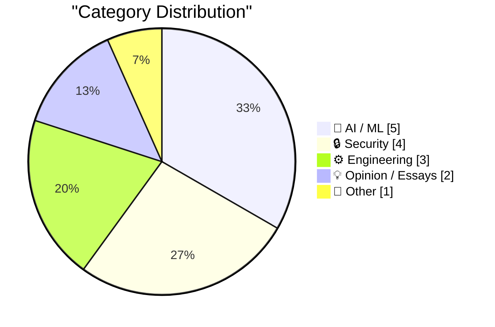
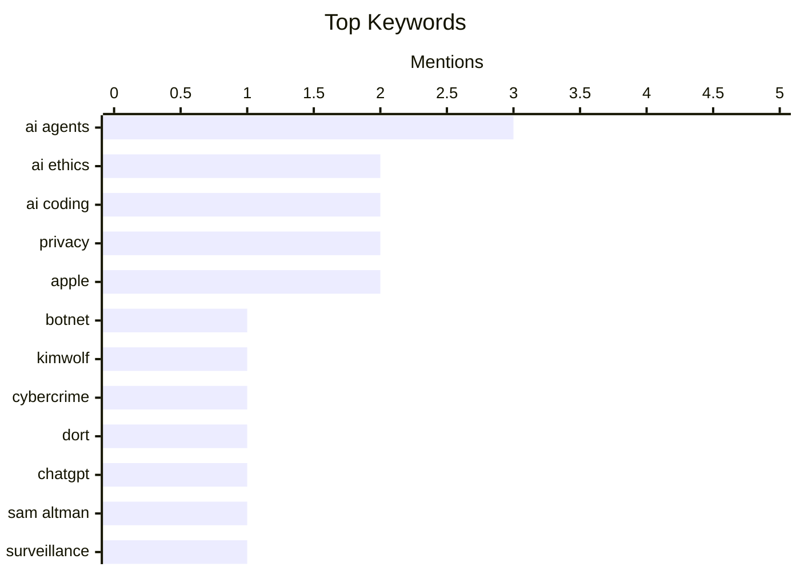

## 📝 Today's Highlights
Today's tech highlights reveal a dynamic and often contentious AI landscape, marked by growing user skepticism, intense ethical debates over military applications, and scrutiny of major players' financial models. Simultaneously, cybersecurity remains a pressing battleground, with investigations into major botnet operators ongoing and experts issuing urgent warnings against risky data encryption practices. The industry also faces controversial government demands on tech companies that could compromise user privacy and security.

---

## 🏆 Must Read Today

🥇 **Who is the Kimwolf Botmaster "Dort"?**

[Who is the Kimwolf Botmaster "Dort"?](https://krebsonsecurity.com/2026/02/who-is-the-kimwolf-botmaster-dort/) — krebsonsecurity.com · 14h ago · 🔒 Security

> This article investigates the identity of "Dort," the operator behind Kimwolf, the world's largest botnet, which emerged after a security researcher disclosed a critical vulnerability. "Dort" has retaliated against the researcher and the author with a barrage of distributed denial-of-service (DDoS), doxing, and email flooding attacks. These attacks escalated to the point of causing a SWAT team to be dispatched to the researcher's home. The post aims to uncover the real identity of this malicious actor. The article highlights the dangerous real-world consequences faced by security researchers who expose major vulnerabilities.

💡 **Why read it**: It exposes the dangerous real-world consequences faced by security researchers who uncover major vulnerabilities and the retaliatory tactics of malicious actors.

🏷️ Botnet, Kimwolf, cybercrime, Dort

🥈 **That's it, I'm cancelling my ChatGPT**

[That's it, I'm cancelling my ChatGPT](https://idiallo.com/byte-size/im-cancelling-my-chatgpt-openai-account?src=feed) — idiallo.com · 8h ago · 🤖 AI / ML

> The author is cancelling their ChatGPT subscription in response to Sam Altman's announcement about integrating ChatGPT with the Department of War (DoW) for use on classified networks. This move is perceived as an enabler for mass surveillance and the deployment of AI technology for weapons, building upon existing surveillance infrastructure. The author contrasts OpenAI's decision with Anthropic's CEO publicly refusing similar collaboration with the DoW. This ethical stance underscores a growing concern among users regarding AI companies' military involvement. The author views OpenAI's collaboration with the DoW as a critical ethical breach, facilitating mass surveillance and military applications, prompting their immediate cancellation of the service.

💡 **Why read it**: It highlights the ethical concerns and user backlash regarding AI companies' potential collaboration with military and intelligence agencies.

🏷️ ChatGPT, AI Ethics, Sam Altman, Surveillance

🥉 **A Cookie for Dario? — Anthropic and selling death**

[A Cookie for Dario? — Anthropic and selling death](https://anildash.com/2026/02/27/a-cookie-for-dario/) — anildash.com · 1d ago · 🤖 AI / ML

> Anthropic, the developer of the Claude LLM, is resisting calls from Secretary of Defense Pete Hegseth to modify its platform for military applications, specifically for what the author describes as "war crimes." Anthropic CEO Dario Amodei has publicly declined the request, despite the administration framing it as for "lawful purposes," a claim the author disputes given past governmental actions. This stance positions Anthropic in contrast to other AI companies potentially collaborating with defense entities. The article praises Anthropic's refusal to adapt its LLM for military use, despite government pressure, as a rare example of an AI company prioritizing ethical boundaries.

💡 **Why read it**: It provides a critical perspective on the ethical dilemmas faced by AI companies regarding military contracts and highlights Anthropic's stance against such collaborations.

🏷️ Anthropic, AI Ethics, LLM, Policy

---

## 📊 Data Overview

| Sources Scanned | Articles Fetched | Time Window | Selected |
|:---:|:---:|:---:|:---:|
| 89/92 | 2508 -> 40 | 48h | **15** |

### Category Distribution



### Top Keywords



<details>
<summary>📈 Plain Text Keyword Chart (Terminal Friendly)</summary>

```
ai agents  │ ████████████████████ 3
ai ethics  │ █████████████░░░░░░░ 2
ai coding  │ █████████████░░░░░░░ 2
privacy    │ █████████████░░░░░░░ 2
apple      │ █████████████░░░░░░░ 2
botnet     │ ███████░░░░░░░░░░░░░ 1
kimwolf    │ ███████░░░░░░░░░░░░░ 1
cybercrime │ ███████░░░░░░░░░░░░░ 1
dort       │ ███████░░░░░░░░░░░░░ 1
chatgpt    │ ███████░░░░░░░░░░░░░ 1
```

</details>

### 🏷️ Topic Tags

**ai agents**(3) · **ai ethics**(2) · **ai coding**(2) · privacy(2) · apple(2) · botnet(1) · kimwolf(1) · cybercrime(1) · dort(1) · chatgpt(1) · sam altman(1) · surveillance(1) · anthropic(1) · llm(1) · policy(1) · developer experience(1) · skepticism(1) · cognitive debt(1) · engineering patterns(1) · llms(1)

---

## 🤖 AI / ML

### 1. That's it, I'm cancelling my ChatGPT

[That's it, I'm cancelling my ChatGPT](https://idiallo.com/byte-size/im-cancelling-my-chatgpt-openai-account?src=feed) — **idiallo.com** · 8h ago · ⭐ 29/30

> The author is cancelling their ChatGPT subscription in response to Sam Altman's announcement about integrating ChatGPT with the Department of War (DoW) for use on classified networks. This move is perceived as an enabler for mass surveillance and the deployment of AI technology for weapons, building upon existing surveillance infrastructure. The author contrasts OpenAI's decision with Anthropic's CEO publicly refusing similar collaboration with the DoW. This ethical stance underscores a growing concern among users regarding AI companies' military involvement. The author views OpenAI's collaboration with the DoW as a critical ethical breach, facilitating mass surveillance and military applications, prompting their immediate cancellation of the service.

🏷️ ChatGPT, AI Ethics, Sam Altman, Surveillance

---

### 2. A Cookie for Dario? — Anthropic and selling death

[A Cookie for Dario? — Anthropic and selling death](https://anildash.com/2026/02/27/a-cookie-for-dario/) — **anildash.com** · 1d ago · ⭐ 29/30

> Anthropic, the developer of the Claude LLM, is resisting calls from Secretary of Defense Pete Hegseth to modify its platform for military applications, specifically for what the author describes as "war crimes." Anthropic CEO Dario Amodei has publicly declined the request, despite the administration framing it as for "lawful purposes," a claim the author disputes given past governmental actions. This stance positions Anthropic in contrast to other AI companies potentially collaborating with defense entities. The article praises Anthropic's refusal to adapt its LLM for military use, despite government pressure, as a rare example of an AI company prioritizing ethical boundaries.

🏷️ Anthropic, AI Ethics, LLM, Policy

---

### 3. An AI agent coding skeptic tries AI agent coding, in excessive detail

[An AI agent coding skeptic tries AI agent coding, in excessive detail](https://simonwillison.net/2026/Feb/27/ai-agent-coding-in-excessive-detail/#atom-everything) — **simonwillison.net** · 1d ago · ⭐ 28/30

> This article reviews Max Woolf's detailed account of an AI agent coding skeptic's journey, exploring the practical capabilities of coding agents. Woolf describes a sequence of coding agent projects, starting with simple YouTube metadata scrapers and progressively tackling more ambitious tasks. The post suggests that coding agents have significantly improved since November, indicating a notable shift in their practical utility for developers. This detailed exploration serves as a strong endorsement of the recent advancements in AI coding agents. The article demonstrates their growing capacity to handle complex development tasks effectively.

🏷️ AI agents, AI coding, developer experience, skepticism

---

### 4. Interactive explanations

[Interactive explanations](https://simonwillison.net/guides/agentic-engineering-patterns/interactive-explanations/#atom-everything) — **simonwillison.net** · 3h ago · ⭐ 27/30

> The article addresses the problem of "cognitive debt" incurred when developers lose track of how code generated by AI agents functions. This debt becomes problematic for complex tasks where understanding implementation details is crucial, beyond simple data fetching and JSON output. The author proposes interactive explanations as a key pattern in "Agentic Engineering" to mitigate this issue. This approach allows developers to probe and understand the agent's generated code, maintaining comprehension and control. Interactive explanations are presented as an essential strategy for managing cognitive debt in agentic engineering, ensuring developers maintain oversight of AI-generated code.

🏷️ AI agents, cognitive debt, engineering patterns, LLMs

---

### 5. An AI agent coding skeptic tries AI agent coding, in excessive detail

[An AI agent coding skeptic tries AI agent coding, in excessive detail](https://minimaxir.com/2026/02/ai-agent-coding/) — **minimaxir.com** · 1d ago · ⭐ 27/30

> Max Woolf, a self-proclaimed skeptic, details his extensive experience with AI agent coding to assess its current capabilities in this in-depth article. The post provides a practical account of using coding agents for various projects, starting with simple tasks and progressing to more complex development work. It suggests that AI coding agents have reached a significant level of proficiency, particularly since November, challenging previous skepticism. This comprehensive, hands-on demonstration indicates that AI coding agents have become surprisingly effective and capable of handling substantial development work.

🏷️ AI Agents, AI Coding, Skeptic, Evaluation

---

## 🔒 Security

### 6. Who is the Kimwolf Botmaster "Dort"?

[Who is the Kimwolf Botmaster "Dort"?](https://krebsonsecurity.com/2026/02/who-is-the-kimwolf-botmaster-dort/) — **krebsonsecurity.com** · 14h ago · ⭐ 30/30

> This article investigates the identity of "Dort," the operator behind Kimwolf, the world's largest botnet, which emerged after a security researcher disclosed a critical vulnerability. "Dort" has retaliated against the researcher and the author with a barrage of distributed denial-of-service (DDoS), doxing, and email flooding attacks. These attacks escalated to the point of causing a SWAT team to be dispatched to the researcher's home. The post aims to uncover the real identity of this malicious actor. The article highlights the dangerous real-world consequences faced by security researchers who expose major vulnerabilities.

🏷️ Botnet, Kimwolf, cybercrime, Dort

---

### 7. West Virginia's Anti-Apple CSAM Lawsuit Would Help Child Predators Walk Free

[West Virginia's Anti-Apple CSAM Lawsuit Would Help Child Predators Walk Free](https://www.techdirt.com/2026/02/25/west-virginias-anti-apple-csam-lawsuit-would-help-child-predators-walk-free/) — **daringfireball.net** · 1d ago · ⭐ 27/30

> West Virginia's lawsuit against Apple, which aims to compel the company to scan iCloud for CSAM, is argued to be counterproductive and harmful. Mike Masnick of Techdirt explains that if a court mandates Apple to scan iCloud, any evidence flagged would be considered obtained through a warrantless government search without probable cause. This would violate the Fourth Amendment's exclusionary rule, allowing defense attorneys to successfully demand the evidence be thrown out. Consequently, this legal outcome would inadvertently help child predators avoid conviction. The lawsuit, if successful, would undermine child abuse prosecutions by rendering crucial evidence inadmissible due to constitutional violations.

🏷️ CSAM, privacy, Apple, legal

---

### 8. Please, please, please stop using passkeys for encrypting user data

[Please, please, please stop using passkeys for encrypting user data](https://simonwillison.net/2026/Feb/27/passkeys/#atom-everything) — **simonwillison.net** · 1d ago · ⭐ 26/30

> The article strongly advises against using passkeys for encrypting user data due to the high risk of irreversible data loss. Tim Cappalli emphasizes that users frequently lose their passkeys and may not understand that their data, once encrypted with them, becomes permanently unrecoverable. He argues that passkeys should be limited strictly to authentication purposes, such as logging in, rather than serving as encryption keys. The identity industry is urged to cease promoting and implementing passkeys for data encryption to prevent widespread, unrecoverable user data loss. This highlights a critical security and usability flaw in the misuse of passkeys.

🏷️ Passkeys, encryption, data security, security warning

---

### 9. "How old are you?" Asked the OS

["How old are you?" Asked the OS](https://idiallo.com/byte-size/how-old-are-you-asked-the-os?src=feed) — **idiallo.com** · 51m ago · ⭐ 26/30

> A new California law, AB-1043, passed in October 2025, mandates operating systems to collect user age during account creation. The author raises critical questions about the practical enforceability of this law, particularly for offline systems like a Raspberry Pi. It explores scenarios such as incorrect age input, multi-user devices, and the challenges of universal application. The article highlights the difficulty in verifying age and applying the law consistently across diverse computing environments. Ultimately, the author suggests that the law's primary purpose might not be its practical enforcement, implying other underlying motivations or a lack of consideration for real-world implementation.

🏷️ Privacy, Regulation, Operating System, California Law

---

## ⚙️ Engineering

### 10. Open Source, SaaS, and the Silence After Unlimited Code Generation

[Open Source, SaaS, and the Silence After Unlimited Code Generation](https://worksonmymachine.ai/p/open-source-saas-and-the-silence) — **worksonmymachine.substack.com** · 11h ago · ⭐ 25/30

> The article briefly touches upon the potential impact of "unlimited code generation" on open-source and SaaS models. It highlights "The End of Feedback" as a significant consequence, implying that widespread automated code generation could diminish the traditional feedback loops essential for these development paradigms. The piece suggests that this shift could fundamentally alter how open-source projects and SaaS products evolve and receive community input.

🏷️ Open Source, SaaS, Code Generation, AI Impact

---

### 11. Upgrading my Open Source Pi Surveillance Server with Frigate

[Upgrading my Open Source Pi Surveillance Server with Frigate](https://www.jeffgeerling.com/blog/2026/upgrading-my-open-source-pi-surveillance-server-frigate/) — **jeffgeerling.com** · 1d ago · ⭐ 24/30

> The article details the process of upgrading an existing open-source Raspberry Pi-based surveillance server. In 2024, the author built a Pi Frigate NVR using Axzez's Interceptor 1U Case, which is installed in a 19" rack. This system utilizes a Coral TPU for 100% local, cloud-free object detection, ensuring privacy. The upgrade focuses on enhancing this established, self-hosted solution. The article serves as a practical guide for improving a privacy-focused surveillance setup built on open-source components and a Raspberry Pi.

🏷️ Raspberry Pi, Frigate, NVR, Coral TPU

---

### 12. Why Apple's move to video could endanger podcasting's greatest power

[Why Apple's move to video could endanger podcasting's greatest power](https://anildash.com/2026/02/28/apple-video-podcast-power/) — **anildash.com** · 1d ago · ⭐ 24/30

> Apple's new support for video podcasts threatens the open standard that has historically defined podcasting. Traditional podcasts rely on an open standard, ensuring independence from algorithms and privacy-invasive ads. Apple's new video podcast system deviates from this standard, compelling creators to host video clips with a select few companies. This shift is exacerbated by the acquisition of indie video infrastructure companies by private equity, further centralizing control. Apple's move risks undermining podcasting's core strengths—its openness and decentralized nature—by introducing a more controlled, potentially proprietary video ecosystem.

🏷️ Apple, Podcasting, Open Standards, Platform

---

## 💡 Opinion / Essays

### 13. Does OpenAI's new financing make sense?

[Does OpenAI's new financing make sense?](https://garymarcus.substack.com/p/does-openais-new-financing-make-sense) — **garymarcus.substack.com** · 1d ago · ⭐ 27/30

> The article questions the rationale and sustainability of OpenAI's recent financing rounds, expressing significant doubt about its viability. Gary Marcus, the author, indicates that he is not alone in his skepticism regarding the financial valuation and long-term implications of this financing. The piece likely delves into the economic models, market conditions, and operational costs that might make such a deal questionable. This critical perspective challenges the prevailing narrative around OpenAI's financial health. The author strongly suggests that OpenAI's latest financing deal is financially unsound and raises concerns about its long-term implications.

🏷️ OpenAI, financing, AI investment, business model

---

### 14. The whole thing was a scam

[The whole thing was a scam](https://garymarcus.substack.com/p/the-whole-thing-was-scam) — **garymarcus.substack.com** · 9h ago · ⭐ 25/30

> The article asserts that an unspecified event or situation was fundamentally fraudulent. It claims "The fix was in," indicating a predetermined and unfair outcome, specifically stating that "Dario never had a chance." This implies a deliberate manipulation of circumstances. The author concludes that the entire situation was a "scam," highlighting a strong conviction of deception.

🏷️ AI criticism, scam, industry ethics, Dario

---

## 📝 Other

### 15. Block Lays Off 4,000 (of 10,000) Employees

[Block Lays Off 4,000 (of 10,000) Employees](https://www.cnbc.com/2026/02/26/block-laying-off-about-4000-employees-nearly-half-of-its-workforce.html) — **daringfireball.net** · 1d ago · ⭐ 26/30

> Block, Inc. (formerly Square) announced a significant workforce reduction, laying off approximately 4,000 employees, nearly half of its total headcount. CEO Jack Dorsey stated the company is reducing from over 10,000 to just under 6,000 people. This drastic measure led to a substantial increase in Block's stock, which skyrocketed as much as 24% in extended trading. The article notes this trend of large tech layoffs, mentioning other companies like Pinterest, as a broader industry phenomenon. Block's decision to cut nearly half its workforce, while boosting its stock price, reflects a broader trend of tech companies undergoing significant restructuring and layoffs.

🏷️ Block, Layoffs, Fintech, Jack Dorsey

---

*Generated from 89 sources → 2508 articles → selected 15*
*Based on the [Hacker News Popularity Contest 2025](https://refactoringenglish.com/tools/hn-popularity/) RSS source list recommended by [Andrej Karpathy](https://x.com/karpathy)*
