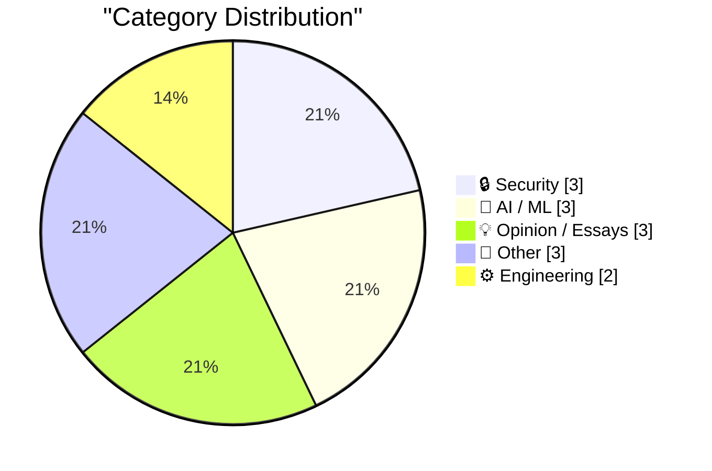
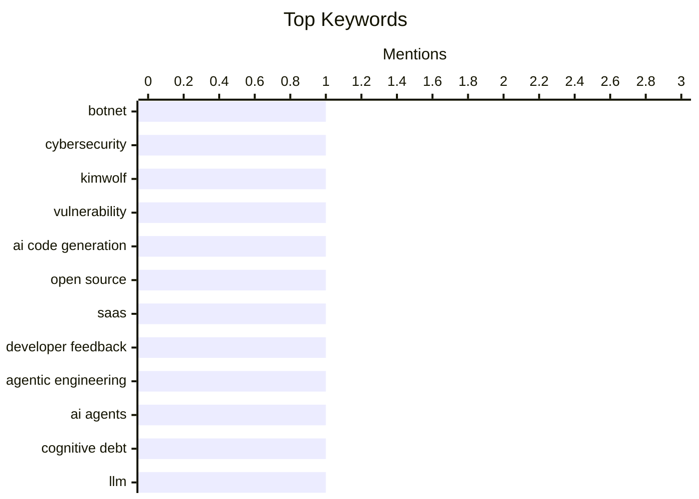

## 📝 Today's Highlights
Today's tech landscape is dominated by the transformative yet controversial role of AI, alongside a heightened focus on cybersecurity and data privacy. Artificial intelligence continues to push boundaries in code generation and agentic engineering, even as user skepticism grows and the challenge of detecting LLM-generated content becomes more critical. Concurrently, the security front is active with investigations into botmasters and new regulatory demands, such as California's age verification law for operating systems, underscoring ongoing data privacy concerns.

---

## 🏆 Must Read Today

🥇 **Who is the Kimwolf Botmaster "Dort"?**

[Who is the Kimwolf Botmaster "Dort"?](https://krebsonsecurity.com/2026/02/who-is-the-kimwolf-botmaster-dort/) — krebsonsecurity.com · 14h ago · 🔒 Security

> This article investigates the identity of "Dort," the operator behind Kimwolf, described as the world's largest and most disruptive botnet, assembled using a vulnerability disclosed in January 2026. "Dort" has orchestrated distributed denial-of-service (DDoS), doxing, and email flooding attacks. These attacks have specifically targeted the security researcher who disclosed the vulnerability and the author, even escalating to a SWATting incident at the researcher's home. The post aims to uncover the individual behind these malicious activities and the botnet's operations. It highlights the severe real-world consequences faced by security researchers and journalists targeted by sophisticated threat actors.

💡 **Why read it**: It's worth reading to understand the severe personal and professional risks faced by security researchers and journalists when exposing major cyber threats and their operators.

🏷️ Botnet, Cybersecurity, Kimwolf, Vulnerability

🥈 **Open Source, SaaS, and the Silence After Unlimited Code Generation**

[Open Source, SaaS, and the Silence After Unlimited Code Generation](https://worksonmymachine.ai/p/open-source-saas-and-the-silence) — worksonmymachine.substack.com · 11h ago · 🤖 AI / ML

> This article explores the potential impact of unlimited code generation capabilities, likely driven by AI, on the open-source software ecosystem and Software-as-a-Service (SaaS) business models. The phrase "The End of Feedback" suggests a disruption to traditional development cycles where user feedback drives improvements. It likely discusses how AI-generated code might reduce the need for human contribution and interaction, potentially altering the dynamics of open-source communities and the value proposition of SaaS offerings. The core argument seems to be that ubiquitous code generation could fundamentally change how software is developed, maintained, and monetized.

💡 **Why read it**: It's worth reading to consider the profound implications of AI-driven unlimited code generation on the future of open-source development, SaaS business models, and the traditional feedback loop in software engineering.

🏷️ AI code generation, open source, SaaS, developer feedback

🥉 **Interactive explanations**

[Interactive explanations](https://simonwillison.net/guides/agentic-engineering-patterns/interactive-explanations/#atom-everything) — simonwillison.net · 3h ago · 🤖 AI / ML

> This article, part of a guide on "Agentic Engineering Patterns," addresses the problem of "cognitive debt" incurred when developers lose track of how code generated by AI agents functions. While simple tasks like fetching data and outputting JSON might not require deep understanding, more complex agent-generated code can become opaque. The core argument is that interactive explanations are crucial for understanding and debugging agentic systems, allowing developers to trace logic and verify behavior. It advocates for design patterns that make the agent's reasoning and code generation process transparent and explorable. The main takeaway is that effective agentic engineering requires tools and methods to mitigate cognitive debt through clear, interactive insights into agent operations.

💡 **Why read it**: It's worth reading for insights into managing "cognitive debt" in agentic engineering and the importance of interactive explanations for understanding and debugging AI-generated code.

🏷️ Agentic Engineering, AI Agents, Cognitive Debt

---

## 📊 Data Overview

| Sources Scanned | Articles Fetched | Time Window | Selected |
|:---:|:---:|:---:|:---:|
| 89/92 | 2508 -> 14 | 24h | **14** |

### Category Distribution



### Top Keywords



<details>
<summary>📈 Plain Text Keyword Chart (Terminal Friendly)</summary>

```
botnet              │ ████████████████████ 1
cybersecurity       │ ████████████████████ 1
kimwolf             │ ████████████████████ 1
vulnerability       │ ████████████████████ 1
ai code generation  │ ████████████████████ 1
open source         │ ████████████████████ 1
saas                │ ████████████████████ 1
developer feedback  │ ████████████████████ 1
agentic engineering │ ████████████████████ 1
ai agents           │ ████████████████████ 1
```

</details>

### 🏷️ Topic Tags

**botnet**(1) · **cybersecurity**(1) · **kimwolf**(1) · vulnerability(1) · ai code generation(1) · open source(1) · saas(1) · developer feedback(1) · agentic engineering(1) · ai agents(1) · cognitive debt(1) · llm(1) · python(1) · github(1) · ai code(1) · privacy law(1) · os(1) · data collection(1) · ab-1043(1) · ai ethics(1)

---

## 🔒 Security

### 1. Who is the Kimwolf Botmaster "Dort"?

[Who is the Kimwolf Botmaster "Dort"?](https://krebsonsecurity.com/2026/02/who-is-the-kimwolf-botmaster-dort/) — **krebsonsecurity.com** · 14h ago · ⭐ 28/30

> This article investigates the identity of "Dort," the operator behind Kimwolf, described as the world's largest and most disruptive botnet, assembled using a vulnerability disclosed in January 2026. "Dort" has orchestrated distributed denial-of-service (DDoS), doxing, and email flooding attacks. These attacks have specifically targeted the security researcher who disclosed the vulnerability and the author, even escalating to a SWATting incident at the researcher's home. The post aims to uncover the individual behind these malicious activities and the botnet's operations. It highlights the severe real-world consequences faced by security researchers and journalists targeted by sophisticated threat actors.

🏷️ Botnet, Cybersecurity, Kimwolf, Vulnerability

---

### 2. "How old are you?" Asked the OS

["How old are you?" Asked the OS](https://idiallo.com/byte-size/how-old-are-you-asked-the-os?src=feed) — **idiallo.com** · 54m ago · ⭐ 25/30

> This article discusses California's new law, AB-1043, passed in October 2025, which mandates operating systems to collect user age during account creation. The author raises several critical questions regarding the law's practical enforceability, such as its applicability to offline systems like a home Raspberry Pi, consequences of providing incorrect age, and scenarios involving multiple users on a single device. The core argument is that the law appears unenforceable in its current form, suggesting its primary purpose might not be strict compliance but rather a symbolic or political statement. The main takeaway is that while the law aims to regulate age verification, its technical and practical implementation poses significant, unaddressed challenges.

🏷️ Privacy Law, OS, Data Collection, AB-1043

---

### 3. npm Data Subject Access Request

[npm Data Subject Access Request](https://nesbitt.io/2026/02/28/npm-data-subject-access-request.html) — **nesbitt.io** · 16h ago · ⭐ 23/30

> This article details the process and outcome of a GDPR Data Subject Access Request (DSAR) made to npm, the JavaScript package manager. The author likely describes the steps taken to submit the request, the timeline for npm's response, and the specific data provided by npm. It probably highlights the types of personal data npm collects and stores about its users, such as account information, package interaction data, or IP logs. The article serves as a practical example of exercising GDPR rights and evaluating a major service provider's compliance. The main takeaway is an illustration of how a company like npm handles GDPR DSARs and the scope of data they retain.

🏷️ GDPR, npm, Data Privacy, DSAR

---

## 🤖 AI / ML

### 4. Open Source, SaaS, and the Silence After Unlimited Code Generation

[Open Source, SaaS, and the Silence After Unlimited Code Generation](https://worksonmymachine.ai/p/open-source-saas-and-the-silence) — **worksonmymachine.substack.com** · 11h ago · ⭐ 27/30

> This article explores the potential impact of unlimited code generation capabilities, likely driven by AI, on the open-source software ecosystem and Software-as-a-Service (SaaS) business models. The phrase "The End of Feedback" suggests a disruption to traditional development cycles where user feedback drives improvements. It likely discusses how AI-generated code might reduce the need for human contribution and interaction, potentially altering the dynamics of open-source communities and the value proposition of SaaS offerings. The core argument seems to be that ubiquitous code generation could fundamentally change how software is developed, maintained, and monetized.

🏷️ AI code generation, open source, SaaS, developer feedback

---

### 5. Interactive explanations

[Interactive explanations](https://simonwillison.net/guides/agentic-engineering-patterns/interactive-explanations/#atom-everything) — **simonwillison.net** · 3h ago · ⭐ 26/30

> This article, part of a guide on "Agentic Engineering Patterns," addresses the problem of "cognitive debt" incurred when developers lose track of how code generated by AI agents functions. While simple tasks like fetching data and outputting JSON might not require deep understanding, more complex agent-generated code can become opaque. The core argument is that interactive explanations are crucial for understanding and debugging agentic systems, allowing developers to trace logic and verify behavior. It advocates for design patterns that make the agent's reasoning and code generation process transparent and explorable. The main takeaway is that effective agentic engineering requires tools and methods to mitigate cognitive debt through clear, interactive insights into agent operations.

🏷️ Agentic Engineering, AI Agents, Cognitive Debt

---

### 6. LLM Use in the Python Source Code

[LLM Use in the Python Source Code](https://blog.miguelgrinberg.com/post/llm-use-in-the-python-source-code) — **miguelgrinberg.com** · 11h ago · ⭐ 26/30

> This article discusses a social media trick to identify GitHub repositories using LLM-generated code, specifically from Claude Code, by blocking the `claude` user on GitHub. Blocking this user causes a banner to appear on repositories with `claude` commits, signaling AI agent participation. The author expresses surprise at finding `claude` commits within the CPython repository, implying that even core projects like Python's interpreter are beginning to incorporate AI-assisted code. This highlights the increasing integration of LLMs into mainstream software development, raising questions about code provenance and quality. The main takeaway is that LLM-generated code is already permeating foundational open-source projects, challenging traditional notions of human authorship.

🏷️ LLM, Python, GitHub, AI code

---

## 💡 Opinion / Essays

### 7. That's it, I'm cancelling my ChatGPT

[That's it, I'm cancelling my ChatGPT](https://idiallo.com/byte-size/im-cancelling-my-chatgpt-openai-account?src=feed) — **idiallo.com** · 8h ago · ⭐ 24/30

> The author announces the cancellation of their ChatGPT subscription in response to Sam Altman's tweet about OpenAI's collaboration with the "Department of War" (DoW) to deploy ChatGPT on classified networks. The author views this partnership as an enabler for mass surveillance and potential weapons deployment, building on existing infrastructure. This decision is contextualized by Anthropic's CEO publicly refusing similar collaborations with the DoW, highlighting a divergence in ethical stances among AI companies. The article expresses a strong ethical objection to the militarization and surveillance potential of advanced AI. The main takeaway is a personal protest against OpenAI's perceived shift towards military applications, emphasizing the ethical responsibilities of AI developers.

🏷️ AI Ethics, ChatGPT, Surveillance, Military AI

---

### 8. The whole thing was a scam

[The whole thing was a scam](https://garymarcus.substack.com/p/the-whole-thing-was-scam) — **garymarcus.substack.com** · 10h ago · ⭐ 23/30

> This article, likely from AI critic Gary Marcus, strongly implies that a particular event or narrative within the AI industry was deceptive or rigged. The phrase "The fix was in, and Dario never had a chance" suggests a predetermined outcome or an unfair situation, possibly related to a competition, a product launch, or a public debate involving a figure named Dario. Given Marcus's typical focus, the "scam" likely pertains to exaggerated AI capabilities, misleading benchmarks, or unethical practices within AI development or promotion. The core argument is that a significant aspect of the AI landscape, or a specific incident, lacked genuine merit and was orchestrated for a particular agenda. The main takeaway is a cautionary warning against uncritical acceptance of AI industry claims, suggesting a need for greater scrutiny.

🏷️ AI Criticism, Gary Marcus, AI Hype

---

### 9. Trump's Enormous Gamble on Regime Change in Iran

[Trump's Enormous Gamble on Regime Change in Iran](https://www.theatlantic.com/ideas/2026/02/trumps-iran-regime-change-attack-gamble/686190/) — **daringfireball.net** · 10h ago · ⭐ 12/30

> This article critically examines the strategic complexities and historical precedents of regime change efforts, specifically focusing on Trump's approach to Iran. It draws a parallel to the 2003 Iraq War, quoting U.S. Ambassador Barbara Bodine's observation that reconstruction had '500 ways to do it wrong and two or three ways to do it right,' implying a high probability of failure. The piece critiques the 'enormous gamble' of pursuing regime change in Iran, suggesting a similar lack of understanding of potential pitfalls and consequences. The main takeaway is that attempts at regime change, particularly in complex geopolitical contexts, are fraught with immense risks and historical precedents of failure.

🏷️ Geopolitics, Iran, Foreign Policy

---

## 📝 Other

### 10. 30 months to 3MWh - some more home battery stats

[30 months to 3MWh - some more home battery stats](https://shkspr.mobi/blog/2026/02/30-months-to-3mwh-some-more-home-battery-stats/) — **shkspr.mobi** · 14h ago · ⭐ 17/30

> This article details the long-term performance and energy savings of a home solar battery system. A Moixa 4.8kWh Solar Battery, installed in August 2023, has accumulated approximately 3 MegaWatt hours of savings over 30 months. The system efficiently absorbs solar energy and discharges it as needed, demonstrating consistent operation with its fan whirring and Ethernet lights flickering. The author provides an estimate of the significant monetary savings achieved through this setup. The data indicates that a home battery system offers substantial energy independence and financial benefits over an extended period.

🏷️ Home Battery, Solar Panels, Energy Stats

---

### 11. Reading List 02/28/26

[Reading List 02/28/26](https://www.construction-physics.com/p/reading-list-022826) — **construction-physics.com** · 12h ago · ⭐ 14/30

> This article presents a curated reading list covering diverse topics relevant to construction, technology, and urban development. Key subjects include an analysis of LA permitting costs, the effectiveness of trickle-down housing policies, Panasonic's decision to cease TV manufacturing, the operational aspects of robotaxi remote operators, and recent progress in geothermal energy. Each item points to deeper discussions on these specific issues, offering insights into current trends and challenges. The compilation serves as a concise overview of significant developments across these interconnected fields.

🏷️ robotaxi, geothermal, industry news

---

### 12. Pluralistic: California can stop Larry Ellison from buying Warners (28 Feb 2026)

[Pluralistic: California can stop Larry Ellison from buying Warners (28 Feb 2026)](https://pluralistic.net/2026/02/28/golden-mean/) — **pluralistic.net** · 15h ago · ⭐ 12/30

> This article is a collection of links and commentary, prominently featuring California's potential role in blocking a major corporate acquisition. The lead item suggests California possesses the 'right states' rights' to intervene in Larry Ellison's potential acquisition of Warners, implying significant regulatory or antitrust power. Other diverse topics include 'Object permanence,' referencing works by Octavia Butler and Freeman Dyson on 'The Information,' discussions on privacy ('Privacy isn't property'), and various cultural/technological observations like 'Cardboard Cthulhu' and 'Chinese map fuzzing.' The article highlights the potential for state-level regulatory power in corporate mergers and presents a wide array of thought-provoking links on technology, culture, and policy.

🏷️ Link Roundup, California, Corporate Law

---

## ⚙️ Engineering

### 13. The Most Important Micros

[The Most Important Micros](https://www.abortretry.fail/p/the-most-important-micros) — **abortretry.fail** · 8h ago · ⭐ 23/30

> This article likely discusses the significance of "micros" – potentially referring to microservices, micro-optimizations, or micro-interactions – not just for their direct functionality but for what they represent conceptually or strategically. The phrase "That is, for what they represent" suggests a focus on underlying principles, architectural philosophies, or cultural shifts in software development. It might argue that the adoption of microservices, for instance, signifies a move towards modularity, independent teams, and scalable architectures, rather than just a technical implementation detail. The core argument is that these "micros" are crucial because they embody broader trends or values in software development and organizational structure. The main takeaway is an exploration of the deeper meaning and impact of seemingly small technical or organizational units.

🏷️ microprocessors, computer architecture, embedded systems

---

### 14. Working with file extensions in bash scripts

[Working with file extensions in bash scripts](https://www.johndcook.com/blog/2026/02/28/file-extensions-bash/) — **johndcook.com** · 8h ago · ⭐ 20/30

> This article addresses the common task of manipulating file extensions within bash scripts, a task often perceived as cryptic due to bash's terse syntax. The author, who prefers Python for scripting, acknowledges that bash can be uniquely efficient for specific problems. It likely provides practical bash commands and techniques for extracting, changing, or removing file extensions, such as using parameter expansion features like `basename`, `dirname`, `##*`, and `%%.*`. The article aims to demystify these operations, making them accessible even for those less familiar with shell scripting. The main takeaway is a set of concise and effective bash patterns for handling file extensions, demonstrating bash's power for specific file system tasks.

🏷️ Bash Scripting, Shell Scripting, File Extensions

---

*Generated from 89 sources → 2508 articles → selected 14*
*Based on the [Hacker News Popularity Contest 2025](https://refactoringenglish.com/tools/hn-popularity/) RSS source list recommended by [Andrej Karpathy](https://x.com/karpathy)*
