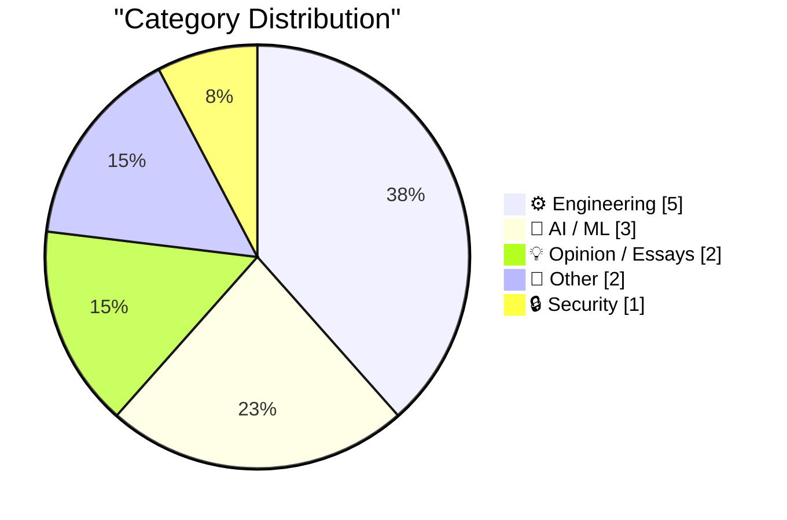
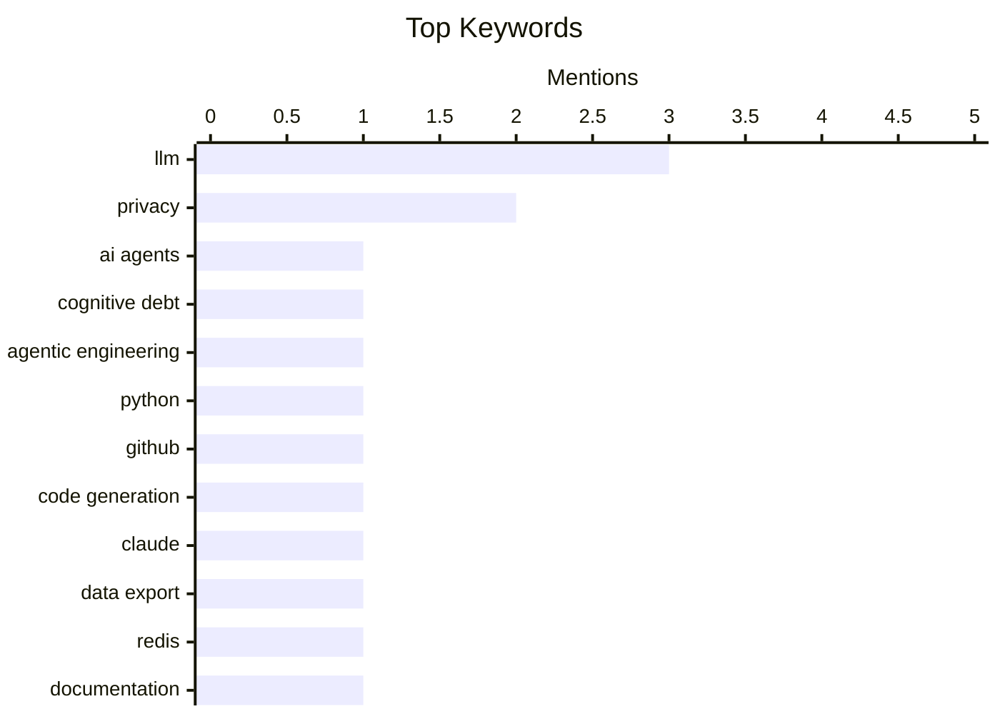

# 📰 AI Daily Digest — 2026-03-01

> Curated from 92 top technical blogs recommended by Karpathy, AI-selected Top 13

## 📝 Today's Highlights

Today's tech highlights underscore the dual challenge of harnessing AI's power while ensuring robust system foundations. Discussions center on the practical application of Large Language Models in coding, their explainability, and user experiences, including frustrations. Simultaneously, the importance of solid engineering practices is emphasized, from efficient Redis and microservice patterns to rigorous downstream testing and essential scripting for system reliability. This reflects an industry striving for both advanced AI integration and unwavering system integrity.

---

## 🏆 Must Read Today

🥇 **Interactive explanations**

[Interactive explanations](https://simonwillison.net/guides/agentic-engineering-patterns/interactive-explanations/#atom-everything) — simonwillison.net · 15h ago · 🤖 AI / ML

> Interactive explanations

🏷️ AI Agents, Cognitive Debt, Agentic Engineering

🥈 **LLM Use in the Python Source Code**

[LLM Use in the Python Source Code](https://blog.miguelgrinberg.com/post/llm-use-in-the-python-source-code) — miguelgrinberg.com · 23h ago · 🤖 AI / ML

> LLM Use in the Python Source Code

🏷️ LLM, Python, GitHub, Code Generation

🥉 **Quoting claude.com/import-memory**

[Quoting claude.com/import-memory](https://simonwillison.net/2026/Mar/1/claude-import-memory/#atom-everything) — simonwillison.net · 3h ago · 🤖 AI / ML

> Quoting claude.com/import-memory

🏷️ Claude, Data Export, LLM, Privacy

---

## 📊 Data Overview

| Sources Scanned | Articles Fetched | Time Window | Selected |
|:---:|:---:|:---:|:---:|
| 88/92 | 2483 -> 13 | 24h | **13** |

### Category Distribution



### Top Keywords



<details>
<summary>📈 Plain Text Keyword Chart (Terminal Friendly)</summary>

```
llm                 │ ████████████████████ 3
privacy             │ █████████████░░░░░░░ 2
ai agents           │ ███████░░░░░░░░░░░░░ 1
cognitive debt      │ ███████░░░░░░░░░░░░░ 1
agentic engineering │ ███████░░░░░░░░░░░░░ 1
python              │ ███████░░░░░░░░░░░░░ 1
github              │ ███████░░░░░░░░░░░░░ 1
code generation     │ ███████░░░░░░░░░░░░░ 1
claude              │ ███████░░░░░░░░░░░░░ 1
data export         │ ███████░░░░░░░░░░░░░ 1
```

</details>

### 🏷️ Topic Tags

**llm**(3) · **privacy**(2) · **ai agents**(1) · cognitive debt(1) · agentic engineering(1) · python(1) · github(1) · code generation(1) · claude(1) · data export(1) · redis(1) · documentation(1) · coding agents(1) · chatgpt(1) · ai ethics(1) · military ai(1) · surveillance(1) · downstream testing(1) · library maintainers(1) · dependencies(1)

---

## ⚙️ Engineering

### 1. Redis patterns for coding

[Redis patterns for coding](http://antirez.com/news/161) — **antirez.com** · 5h ago · ⭐ 24/30

> Redis patterns for coding

🏷️ Redis, Documentation, LLM, Coding Agents

---

### 2. Downstream Testing

[Downstream Testing](https://nesbitt.io/2026/03/01/downstream-testing.html) — **nesbitt.io** · 15h ago · ⭐ 23/30

> Downstream Testing

🏷️ Downstream Testing, Library Maintainers, Dependencies

---

### 3. The Most Important Micros

[The Most Important Micros](https://www.abortretry.fail/p/the-most-important-micros) — **abortretry.fail** · 20h ago · ⭐ 21/30

> The Most Important Micros

🏷️ Microservices, Architecture, System Design

---

### 4. Working with file extensions in bash scripts

[Working with file extensions in bash scripts](https://www.johndcook.com/blog/2026/02/28/file-extensions-bash/) — **johndcook.com** · 20h ago · ⭐ 19/30

> Working with file extensions in bash scripts

🏷️ Bash, Shell Scripting, File Extensions

---

### 5. Notes on Lagrange Interpolating Polynomials

[Notes on Lagrange Interpolating Polynomials](https://eli.thegreenplace.net/2026/notes-on-lagrange-interpolating-polynomials/) — **eli.thegreenplace.net** · 12h ago · ⭐ 19/30

> Notes on Lagrange Interpolating Polynomials

🏷️ Lagrange Interpolation, Polynomials, Numerical Methods

---

## 🤖 AI / ML

### 6. Interactive explanations

[Interactive explanations](https://simonwillison.net/guides/agentic-engineering-patterns/interactive-explanations/#atom-everything) — **simonwillison.net** · 15h ago · ⭐ 26/30

> Interactive explanations

🏷️ AI Agents, Cognitive Debt, Agentic Engineering

---

### 7. LLM Use in the Python Source Code

[LLM Use in the Python Source Code](https://blog.miguelgrinberg.com/post/llm-use-in-the-python-source-code) — **miguelgrinberg.com** · 23h ago · ⭐ 26/30

> LLM Use in the Python Source Code

🏷️ LLM, Python, GitHub, Code Generation

---

### 8. Quoting claude.com/import-memory

[Quoting claude.com/import-memory](https://simonwillison.net/2026/Mar/1/claude-import-memory/#atom-everything) — **simonwillison.net** · 3h ago · ⭐ 24/30

> Quoting claude.com/import-memory

🏷️ Claude, Data Export, LLM, Privacy

---

## 💡 Opinion / Essays

### 9. That's it, I'm cancelling my ChatGPT

[That's it, I'm cancelling my ChatGPT](https://idiallo.com/byte-size/im-cancelling-my-chatgpt-openai-account?src=feed) — **idiallo.com** · 21h ago · ⭐ 24/30

> That's it, I'm cancelling my ChatGPT

🏷️ ChatGPT, AI Ethics, Military AI, Surveillance

---

### 10. The whole thing was a scam

[The whole thing was a scam](https://garymarcus.substack.com/p/the-whole-thing-was-scam) — **garymarcus.substack.com** · 22h ago · ⭐ 18/30

> This article critiques a situation or event, asserting that the entire process was fundamentally flawed or fraudulent from its inception. It argues that the outcome was predetermined, implying a lack of genuine competition or fairness. Specifically, it highlights that a participant named "Dario" was unfairly disadvantaged, indicating that "the fix was in." The piece concludes that the entire endeavor was a deliberate manipulation, rendering any pretense of legitimacy false.

🏷️ AI Hype, Scam, Critique

---

## 📝 Other

### 11. Trump’s Enormous Gamble on Regime Change in Iran

[Trump’s Enormous Gamble on Regime Change in Iran](https://www.theatlantic.com/ideas/2026/02/trumps-iran-regime-change-attack-gamble/686190/?gift=aQyUJR7AIw1mJWdQ6Ed6yOWB4bfod1kQqCyz2RXbHaY) — **daringfireball.net** · 22h ago · ⭐ 12/30

> This article discusses the Trump administration's high-stakes approach to Iran, particularly its implied pursuit of regime change, framing it as an enormous gamble. Drawing a parallel to the 2003 Iraq war, it references U.S. Ambassador Barbara Bodine's observation that reconstruction had "500 ways to do it wrong and two or three ways to do it right," and that they went through all 500. This historical context suggests that regime change operations are complex and often lead to unforeseen difficulties and instability. The piece implicitly warns that Trump's strategy risks repeating past mistakes by underestimating the profound challenges of such interventions. Ultimately, it argues that the pursuit of regime change in Iran is a potentially disastrous foreign policy gamble, echoing the difficulties faced in previous interventions.

🏷️ Geopolitics, Iran, Foreign Policy

---

### 12. Book Review: Under Fire - Black Britain in Wartime by Stephen Bourne ★★★★☆

[Book Review: Under Fire - Black Britain in Wartime by Stephen Bourne ★★★★☆](https://shkspr.mobi/blog/2026/03/book-review-under-fire-black-britain-in-wartime-by-stephen-bourne/) — **shkspr.mobi** · 2h ago · ⭐ 12/30

> This article reviews Stephen Bourne's book, "Under Fire - Black Britain in Wartime," which challenges the persistent myth that Black people only recently became present in the UK. The review highlights how the book counters historical inaccuracies by providing evidence of a long-standing Black presence, citing examples like Black Tudors and Victorian actors. It specifically delves into the overlooked experiences of Black Britons during the Second World War, implicitly contrasting these narratives with historical accounts often influenced by "US cultural hegemony." The book serves as an important corrective, illuminating the significant and often neglected contributions and challenges faced by Black Britons during wartime. It concludes that the book is crucial for understanding a more complete and accurate history of Black people in Britain.

🏷️ Book Review, Black History, Britain, World War II

---

## 🔒 Security

### 13. &ldquo;How old are you?&rdquo; Asked the OS

[&ldquo;How old are you?&rdquo; Asked the OS](https://idiallo.com/byte-size/how-old-are-you-asked-the-os?src=feed) — **idiallo.com** · 13h ago · ⭐ 21/30

> &ldquo;How old are you?&rdquo; Asked the OS

🏷️ Privacy, Regulation, Operating System, Data Collection

---

*Generated at 2026-03-01 15:02 | Scanned 88 sources -> 2483 articles -> selected 13*
*Based on the [Hacker News Popularity Contest 2025](https://refactoringenglish.com/tools/hn-popularity/) RSS source list recommended by [Andrej Karpathy](https://x.com/karpathy)*
*Produced by Dongdianr AI. Follow the same-name WeChat public account for more AI practical tips 💡*
