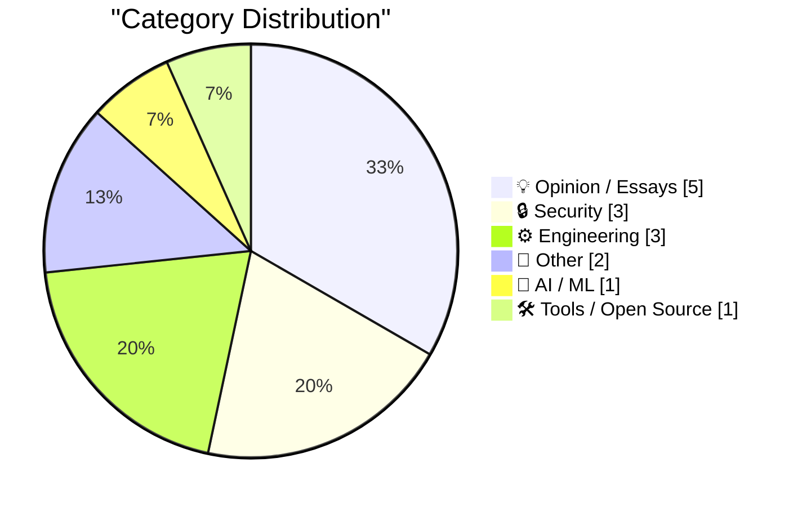
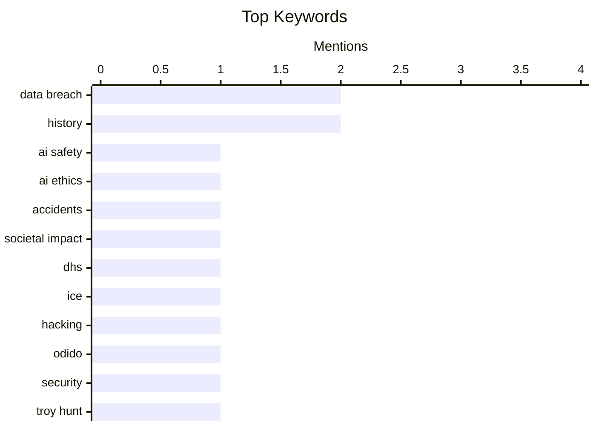

## 📝 Today's Highlights
The tech world is intensely focused on artificial intelligence, grappling with critical questions about AI's potential for accidental harm while also facing a growing aversion to the proliferation of low-quality AI-generated content. This dynamic environment sees "Expert Beginners" and "Lone Wolves" emerging as key innovators in the LLM era. Concurrently, cybersecurity remains a paramount concern, highlighted by significant data breaches impacting government contracts and major service providers. The complex challenges of transitive trust within software supply chains further underscore the ongoing battle against digital threats.
---
## 🏆 Must Read Today
🥇 **Is AI already killing people by accident?**
[Is AI already killing people by accident?](https://garymarcus.substack.com/p/is-ai-already-killing-people-by-accident) — garymarcus.substack.com · 20h ago · 🤖 AI / ML
> This article raises the critical question of whether AI systems are already causing accidental deaths, prompted by a recent incident in Iran where nearly 150 schoolchildren were killed by a mistargeting. It speculates on the potential role of advanced AI in military applications, suggesting that errors in autonomous targeting or decision-making could lead to such tragedies. The author, Gary Marcus, emphasizes the urgent need for scrutiny into the safety and ethical implications of AI's increasing integration into critical systems. The main conclusion is a call for immediate investigation and transparency regarding AI's involvement in real-world accidents, especially those with significant human cost.
💡 **Why read it**: It prompts critical thinking about the immediate, potentially life-threatening risks of AI integration into sensitive systems like military targeting.
🏷️ AI safety, AI ethics, accidents, societal impact
🥈 **"Why hack the DHS? I can think of a couple Pretti Good reasons!"**
["Why hack the DHS? I can think of a couple Pretti Good reasons!"](https://micahflee.com/why-hack-the-dhs-i-can-think-of-a-couple-pretti-good-reasons/) — micahflee.com · 17h ago · 🔒 Security
> This article reports on DDoSecrets' publication of data related to ICE contracts, which was obtained through a hack of the DHS's Office of Industry Partnership. The hacker group, identifying as the "Department of Peace," released a statement justifying their actions by criticizing the DHS's perceived role in "killing." This incident highlights the growing trend of hacktivism targeting government agencies to expose controversial operations or perceived injustices. The core message underscores that such data breaches are often politically motivated, aiming to reveal information and challenge government policies.
💡 **Why read it**: It provides insight into hacktivism, data breaches targeting government entities like DHS, and the motivations behind such actions.
🏷️ DHS, ICE, Hacking, Data Breach
🥉 **Weekly Update 493**
[Weekly Update 493](https://www.troyhunt.com/weekly-update-493/) — troyhunt.com · 7h ago · 🔒 Security
> This weekly update primarily details the Odido data breach, which involved multiple leaks occurring over several days. The author recorded the update after the second data dump, with a third and final dump following shortly thereafter. The incident exposed sensitive customer data, underscoring the persistent threat of large-scale data breaches affecting telecommunications providers. The article serves as a timely reminder of the critical importance of robust cybersecurity measures and rapid incident response for companies handling personal information.
💡 **Why read it**: It offers a real-world case study of a significant, multi-stage data breach (Odido) and its implications for data security.
🏷️ Data Breach, Odido, Security, Troy Hunt
---
## 📊 Data Overview
| Sources Scanned | Articles Fetched | Time Window | Selected |
|:---:|:---:|:---:|:---:|
| 88/92 | 2499 -> 15 | 24h | **15** |
### Category Distribution

### Top Keywords

<details>
<summary>📈 Plain Text Keyword Chart (Terminal Friendly)</summary>
```
data breach     │ ████████████████████ 2
history         │ ████████████████████ 2
ai safety       │ ██████████░░░░░░░░░░ 1
ai ethics       │ ██████████░░░░░░░░░░ 1
accidents       │ ██████████░░░░░░░░░░ 1
societal impact │ ██████████░░░░░░░░░░ 1
dhs             │ ██████████░░░░░░░░░░ 1
ice             │ ██████████░░░░░░░░░░ 1
hacking         │ ██████████░░░░░░░░░░ 1
odido           │ ██████████░░░░░░░░░░ 1
```
</details>
### 🏷️ Topic Tags
**data breach**(2) · **history**(2) · **ai safety**(1) · ai ethics(1) · accidents(1) · societal impact(1) · dhs(1) · ice(1) · hacking(1) · odido(1) · security(1) · troy hunt(1) · supply chain(1) · trust(1) · dependencies(1) · open source(1) · rust(1) · compiler(1) · performance(1) · llm era(1)
---
## 💡 Opinion / Essays
### 1. Expert Beginners and Lone Wolves will dominate this early LLM era
[Expert Beginners and Lone Wolves will dominate this early LLM era](https://www.jeffgeerling.com/blog/2026/expert-beginners-and-lone-wolves-dominate-llm-era/) — **jeffgeerling.com** · 17h ago · ⭐ 24/30
> The article posits that "Expert Beginners" and "Lone Wolves" are uniquely positioned to dominate the early era of Large Language Models (LLMs). An "Expert Beginner" possesses deep domain knowledge but is new to LLMs, while a "Lone Wolf" operates independently, unconstrained by corporate bureaucracy. The author draws a parallel to his blog's 2009 migration from a static site generator to Drupal, noting the agility required in evolving tech landscapes. The core argument is that flexibility, deep problem understanding, and a willingness to experiment without rigid corporate structures are key advantages in the rapidly evolving LLM space.
🏷️ LLM era, expert beginners, lone wolves, AI careers
---
### 2. Pluralistic: No one wants to read your AI slop (02 Mar 2026)
[Pluralistic: No one wants to read your AI slop (02 Mar 2026)](https://pluralistic.net/2026/03/02/nonconsensual-slopping/) — **pluralistic.net** · 5h ago · ⭐ 24/30
> This article, part of Cory Doctorow's "Pluralistic" series, strongly criticizes the proliferation of AI-generated content, labeling it "AI slop." The author argues that such content is generally unwanted and suggests that if one must produce it, it should be done privately. The piece reflects a broader concern about the degradation of online content quality due to automated generation and the ethical implications of non-consensual "slopping." The main takeaway is a clear stance against the public dissemination of low-quality, AI-generated text, advocating for human-authored content.
🏷️ AI slop, AI content, quality, ethics
---
### 3. Why we feel an aversion towards LLM articles
[Why we feel an aversion towards LLM articles](https://idiallo.com/blog/why-we-hate-llm-articles?src=feed) — **idiallo.com** · 3h ago · ⭐ 23/30
> The author reflects on their personal struggle to maintain a consistent blogging schedule, aiming for 180 articles in a year but only managing four in 2024. This experience leads to an exploration of why many, including the author, feel an aversion towards articles discussing Large Language Models (LLMs). The article implicitly suggests that the sheer volume and often repetitive nature of LLM-related content contribute to this widespread fatigue. The core problem identified is the oversaturation of the topic, making it challenging to find novel or genuinely insightful discussions amidst the noise.
🏷️ LLM articles, content fatigue, blogging
---
### 4. Book Notes: “Blood In The Machine” by Brian Merchant
[Book Notes: “Blood In The Machine” by Brian Merchant](https://blog.jim-nielsen.com/2026/book-notes-blood-in-the-machine/) — **blog.jim-nielsen.com** · 20h ago · ⭐ 19/30
> This article presents book notes from Brian Merchant's "Blood In The Machine," focusing on the historical Luddite movement. A key insight highlighted is a historian's perspective that Luddites opposed machines not inherently, but due to their specific application and detrimental impact on workers. This challenges the common misconception of Luddites as simply anti-technology. The notes draw parallels between historical reactions to industrialization and contemporary concerns about technology's societal effects, particularly in the context of AI's rapid advancement.
🏷️ Luddites, Big Tech, History, Social Impact
---
### 5. The Talk Show: ‘Bad Dates’
[The Talk Show: ‘Bad Dates’](https://daringfireball.net/thetalkshow/2026/02/28/ep-442) — **daringfireball.net** · 23h ago · ⭐ 17/30
> This podcast episode features Jason Snell discussing the 2025 Six Colors Apple Report Card, MacOS 26 Tahoe, and Apple Creator Studio. The discussion also covers expectations and hopes for upcoming Apple product announcements. The hosts delve into current Apple developments and speculate on future releases, providing insights for enthusiasts. The episode offers a comprehensive overview of recent Apple news and future product anticipations.
🏷️ Apple, MacOS, product announcements, podcast
---
## 🔒 Security
### 6. "Why hack the DHS? I can think of a couple Pretti Good reasons!"
["Why hack the DHS? I can think of a couple Pretti Good reasons!"](https://micahflee.com/why-hack-the-dhs-i-can-think-of-a-couple-pretti-good-reasons/) — **micahflee.com** · 17h ago · ⭐ 26/30
> This article reports on DDoSecrets' publication of data related to ICE contracts, which was obtained through a hack of the DHS's Office of Industry Partnership. The hacker group, identifying as the "Department of Peace," released a statement justifying their actions by criticizing the DHS's perceived role in "killing." This incident highlights the growing trend of hacktivism targeting government agencies to expose controversial operations or perceived injustices. The core message underscores that such data breaches are often politically motivated, aiming to reveal information and challenge government policies.
🏷️ DHS, ICE, Hacking, Data Breach
---
### 7. Weekly Update 493
[Weekly Update 493](https://www.troyhunt.com/weekly-update-493/) — **troyhunt.com** · 7h ago · ⭐ 26/30
> This weekly update primarily details the Odido data breach, which involved multiple leaks occurring over several days. The author recorded the update after the second data dump, with a third and final dump following shortly thereafter. The incident exposed sensitive customer data, underscoring the persistent threat of large-scale data breaches affecting telecommunications providers. The article serves as a timely reminder of the critical importance of robust cybersecurity measures and rapid incident response for companies handling personal information.
🏷️ Data Breach, Odido, Security, Troy Hunt
---
### 8. Transitive Trust
[Transitive Trust](https://nesbitt.io/2026/03/02/transitive-trust.html) — **nesbitt.io** · 5h ago · ⭐ 25/30
> The article explores the complex concept of transitive trust within software supply chains, questioning the extent to which trust propagates beyond immediate maintainers. It highlights that trusting your direct maintainers implicitly means trusting their maintainers, and so forth, creating a layered web of dependencies. This chain of trust introduces significant security vulnerabilities if any link in the supply chain is compromised or untrustworthy. The core problem is effectively managing and verifying trust across multiple, indirect dependencies in modern software development ecosystems.
🏷️ Supply Chain, Trust, Dependencies, Open Source
---
## ⚙️ Engineering
### 9. February sponsors-only newsletter
[February sponsors-only newsletter](https://simonwillison.net/2026/Mar/2/february-newsletter/#atom-everything) — **simonwillison.net** · 8m ago · ⭐ 24/30
> This article announces the release of Simon Willison's February sponsors-only monthly newsletter, which is accessible to current and new sponsors. The newsletter covers several key topics, including further developments on OpenClaw and Claws, and the initiation of a "not-quite-a-book" project focused on Agentic Engineering. It also mentions updates related to StrongDM, Showboat, and Rodney, alongside a note on Kākāpō breeding season. The newsletter serves as an exclusive update for his supporters, detailing ongoing projects and interests in the tech and open-source space.
🏷️ Rust, compiler, performance
---
### 10. Adding "Log In With Mastodon" to Auth0
[Adding "Log In With Mastodon" to Auth0](https://shkspr.mobi/blog/2026/03/adding-log-in-with-mastodon-to-auth0/) — **shkspr.mobi** · 2h ago · ⭐ 21/30
> The article details the process of integrating "Log In With Mastodon" functionality into Auth0, despite Mastodon not being a natively supported social login provider. The author utilizes Auth0 for the OpenBenches website to streamline user account and password management. Since standard options like Facebook, Twitter, and Discord are available but Mastodon is not, the article outlines a custom implementation. The core technical approach involves leveraging Auth0's extensibility features, likely custom social connections, to add Mastodon as an authentication option.
🏷️ Auth0, Mastodon, social login, authentication
---
### 11. Shell variable ~-
[Shell variable ~-](https://www.johndcook.com/blog/2026/03/01/tilde-dash/) — **johndcook.com** · 20h ago · ⭐ 15/30
> The article introduces a lesser-known but handy bash shell shortcut, `~-`, for navigating directories. While `cd -` is commonly used to return to the previous working directory, `~-` serves as a shortcut for the `$OLDPWD` shell variable. This variable explicitly stores the path to the previous directory, offering an alternative and direct way to reference it. The `~-` shortcut provides a direct and efficient way to access the previous working directory's path in bash, enhancing command-line productivity.
🏷️ bash, shell, command line, shortcuts
---
## 📝 Other
### 12. AMD Am386 released March 2, 1991
[AMD Am386 released March 2, 1991](https://dfarq.homeip.net/amd-am386-released-march-2-1991/?utm_source=rss&#038;utm_medium=rss&#038;utm_campaign=amd-am386-released-march-2-1991) — **dfarq.homeip.net** · 3h ago · ⭐ 11/30
> This article addresses the misconception that AMD was poor at cloning Intel CPUs, specifically regarding the Am386 release timeline. The common belief that AMD was slow to clone Intel CPUs is often based on Intel releasing its 386 CPU in 1985, while AMD's Am386 clone didn't appear until March 2, 1991. This six-year gap is often cited as evidence of AMD's struggles in the early CPU market. The article highlights a historical perspective on AMD's CPU development, challenging a popular misconception about their early cloning capabilities by focusing on the specific release dates of the Intel 386 and AMD Am386.
🏷️ AMD, Am386, CPU, History
---
### 13. The Unbound Scepter
[The Unbound Scepter](https://xeiaso.net/blog/2026/seroquel-xanax-trip-report/) — **xeiaso.net** · 15h ago · ⭐ 6/30
> This article is a personal account of a vivid dream experienced post-surgery due to medication. The author describes a dream, which they characterize as "on-the-nose," resulting from a "post-surgery medication stack." The content is a brief, personal narrative, not a technical discussion or analysis. The article serves as a personal anecdote highlighting the powerful and sometimes surreal effects of medication on dreams.
🏷️ personal, anecdote, dream
---
## 🤖 AI / ML
### 14. Is AI already killing people by accident?
[Is AI already killing people by accident?](https://garymarcus.substack.com/p/is-ai-already-killing-people-by-accident) — **garymarcus.substack.com** · 20h ago · ⭐ 30/30
> This article raises the critical question of whether AI systems are already causing accidental deaths, prompted by a recent incident in Iran where nearly 150 schoolchildren were killed by a mistargeting. It speculates on the potential role of advanced AI in military applications, suggesting that errors in autonomous targeting or decision-making could lead to such tragedies. The author, Gary Marcus, emphasizes the urgent need for scrutiny into the safety and ethical implications of AI's increasing integration into critical systems. The main conclusion is a call for immediate investigation and transparency regarding AI's involvement in real-world accidents, especially those with significant human cost.
🏷️ AI safety, AI ethics, accidents, societal impact
---
## 🛠 Tools / Open Source
### 15. Sentry
[Sentry](https://sentry.io/resources/ios-workshop-jan-2026/?utm_source=daringfireball&amp;utm_medium=paid-display&amp;utm_campaign=general-fy27q1-evergreen&amp;utm_content=static-ad-mobilerss-trysentry) — **daringfireball.net** · 23h ago · ⭐ 15/30
> This article promotes a Sentry workshop focused on improving iOS app stability and performance through effective crash reporting, tracing, and logging. The "Crash Reporting, Tracing, and Logs for iOS in Sentry" workshop teaches how to connect slowdowns, crashes, and user experience issues. It covers setting up Sentry to surface high-priority mobile issues without alert fatigue, using Logs and Breadcrumbs to reconstruct crash events, and identifying performance bottlenecks. The workshop provides practical skills for iOS developers to proactively monitor, diagnose, and resolve critical issues in their applications using Sentry.
🏷️ Sentry, iOS, crash reporting, tracing
---
*Generated at 2026-03-02 15:01 | Scanned 88 sources -> 2499 articles -> selected 15*
*Based on the [Hacker News Popularity Contest 2025](https://refactoringenglish.com/tools/hn-popularity/) RSS source list recommended by [Andrej Karpathy](https://x.com/karpathy)*
*Produced by Dongdianr AI. Follow the same-name WeChat public account for more AI practical tips 💡*
