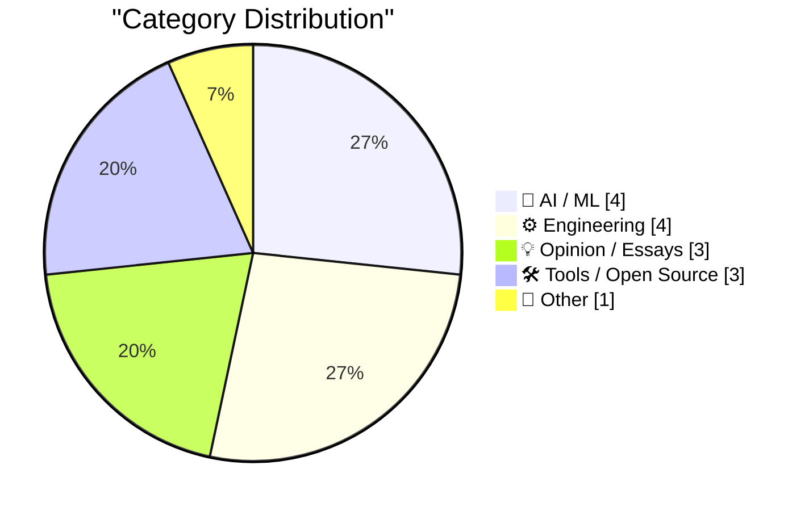
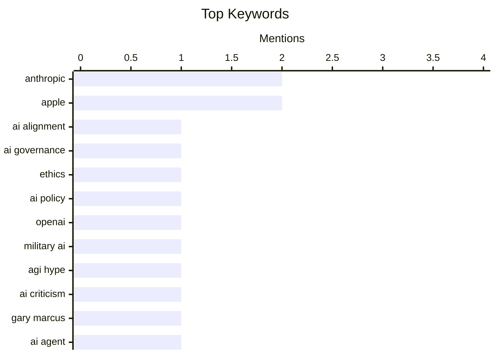

## 📝 Today's Highlights
Today's tech news is dominated by the dynamic AI landscape, highlighting geopolitical concerns over powerful AI development and the ongoing debate around AGI alarmism. Governments are actively shaping AI adoption, while engineers tackle challenges from ensuring AI correctness to imbuing LLMs with personality and deploying practical AI agents for development tasks. Separately, the broader engineering community continues to explore new optimization tools and critically examine a culture that often prioritizes complexity.
---
## 🏆 Must Read Today
🥇 **‘Anthropic and Alignment’**
[‘Anthropic and Alignment’](https://stratechery.com/2026/anthropic-and-alignment/) — daringfireball.net · 20h ago · 🤖 AI / ML
> This article discusses the geopolitical implications of powerful AI development, particularly concerning companies like Anthropic and their "alignment" efforts. It draws an analogy to nuclear weapons, arguing that if a private company developed such a capability and tried to dictate terms to a sovereign power like the U.S. military, that power would be incentivized to neutralize the company. The core argument is that international law and control over critical capabilities are ultimately functions of power, not just ethical alignment. The takeaway is that the development of extremely powerful AI by private entities raises fundamental questions about national sovereignty and control, echoing historical precedents with weapons of mass destruction.
💡 **Why read it**: It offers a thought-provoking geopolitical perspective on AI development, comparing it to nuclear weapons and highlighting the tension between private innovation and national security.
🏷️ AI alignment, Anthropic, AI governance, ethics
🥈 **WSJ: ‘Trump Administration Shuns Anthropic, Embraces OpenAI in Clash Over Guardrails’**
[WSJ: ‘Trump Administration Shuns Anthropic, Embraces OpenAI in Clash Over Guardrails’](https://www.wsj.com/tech/ai/trump-will-end-government-use-of-anthropics-ai-models-ff3550d9) — daringfireball.net · 21h ago · 🤖 AI / ML
> The article reports on the Trump administration's decision to cease government use of Anthropic's AI models, favoring OpenAI, due to a dispute over usage guardrails. Anthropic refused the Pentagon's demand to allow its models for all lawful-use cases, citing "red lines" against domestic mass surveillance and autonomous weapons. Anthropic CEO Dario Amodei stated they could not "in good conscience accede to their request" by the Friday afternoon deadline. This decision highlights a growing tension between AI developers' ethical stances and government demands for broad access to advanced AI capabilities. The main takeaway is the emerging conflict between AI companies' self-imposed ethical restrictions and national security interests, leading to significant policy shifts.
💡 **Why read it**: It provides a concrete example of the clash between AI companies' ethical principles and government demands for AI usage, illustrating real-world policy implications.
🏷️ AI policy, Anthropic, OpenAI, military AI
🥉 **How AGI-is-nigh doomers own-goaled humanity**
[How AGI-is-nigh doomers own-goaled humanity](https://garymarcus.substack.com/p/how-agi-is-nigh-doomers-own-goaled) — garymarcus.substack.com · 15h ago · 💡 Opinion / Essays
> This article critiques the "AGI-is-nigh doomers" perspective, arguing that their alarmist rhetoric, while potentially well-intentioned, has been detrimental. The author suggests that an "uncritical acceptance of hype" surrounding AGI has led to counterproductive outcomes. This includes diverting focus from current, tangible AI problems and potentially fueling calls for excessive regulation that could stifle beneficial AI development. The core argument is that exaggerated fears about imminent AGI have inadvertently harmed the discourse and progress in AI, rather than helping humanity. The main conclusion is that overstating the proximity and danger of AGI has been a strategic misstep, hindering a more balanced and productive approach to AI development and governance.
💡 **Why read it**: It offers a critical perspective on the "AGI doomer" narrative, challenging the prevailing discourse and its potential negative consequences for AI development.
🏷️ AGI hype, AI criticism, Gary Marcus
---
## 📊 Data Overview
| Sources Scanned | Articles Fetched | Time Window | Selected |
|:---:|:---:|:---:|:---:|
| 89/92 | 2510 -> 24 | 24h | **15** |
### Category Distribution

### Top Keywords

<details>
<summary>📈 Plain Text Keyword Chart (Terminal Friendly)</summary>
```
anthropic     │ ████████████████████ 2
apple         │ ████████████████████ 2
ai alignment  │ ██████████░░░░░░░░░░ 1
ai governance │ ██████████░░░░░░░░░░ 1
ethics        │ ██████████░░░░░░░░░░ 1
ai policy     │ ██████████░░░░░░░░░░ 1
openai        │ ██████████░░░░░░░░░░ 1
military ai   │ ██████████░░░░░░░░░░ 1
agi hype      │ ██████████░░░░░░░░░░ 1
ai criticism  │ ██████████░░░░░░░░░░ 1
```
</details>
### 🏷️ Topic Tags
**anthropic**(2) · **apple**(2) · **ai alignment**(1) · ai governance(1) · ethics(1) · ai policy(1) · openai(1) · military ai(1) · agi hype(1) · ai criticism(1) · gary marcus(1) · ai agent(1) · authentication(1) · developer tool(1) · code generation(1) · google(1) · serpapi(1) · lawsuit(1) · internet ownership(1) · gif(1)
---
## 🤖 AI / ML
### 1. ‘Anthropic and Alignment’
[‘Anthropic and Alignment’](https://stratechery.com/2026/anthropic-and-alignment/) — **daringfireball.net** · 20h ago · ⭐ 28/30
> This article discusses the geopolitical implications of powerful AI development, particularly concerning companies like Anthropic and their "alignment" efforts. It draws an analogy to nuclear weapons, arguing that if a private company developed such a capability and tried to dictate terms to a sovereign power like the U.S. military, that power would be incentivized to neutralize the company. The core argument is that international law and control over critical capabilities are ultimately functions of power, not just ethical alignment. The takeaway is that the development of extremely powerful AI by private entities raises fundamental questions about national sovereignty and control, echoing historical precedents with weapons of mass destruction.
🏷️ AI alignment, Anthropic, AI governance, ethics
---
### 2. WSJ: ‘Trump Administration Shuns Anthropic, Embraces OpenAI in Clash Over Guardrails’
[WSJ: ‘Trump Administration Shuns Anthropic, Embraces OpenAI in Clash Over Guardrails’](https://www.wsj.com/tech/ai/trump-will-end-government-use-of-anthropics-ai-models-ff3550d9) — **daringfireball.net** · 21h ago · ⭐ 27/30
> The article reports on the Trump administration's decision to cease government use of Anthropic's AI models, favoring OpenAI, due to a dispute over usage guardrails. Anthropic refused the Pentagon's demand to allow its models for all lawful-use cases, citing "red lines" against domestic mass surveillance and autonomous weapons. Anthropic CEO Dario Amodei stated they could not "in good conscience accede to their request" by the Friday afternoon deadline. This decision highlights a growing tension between AI developers' ethical stances and government demands for broad access to advanced AI capabilities. The main takeaway is the emerging conflict between AI companies' self-imposed ethical restrictions and national security interests, leading to significant policy shifts.
🏷️ AI policy, Anthropic, OpenAI, military AI
---
### 3. Giving LLMs a personality is just good engineering
[Giving LLMs a personality is just good engineering](https://seangoedecke.com/giving-llms-a-personality/) — **seangoedecke.com** · 15h ago · ⭐ 24/30
> This article argues that imbuing Large Language Models (LLMs) with personality is a beneficial engineering practice, contrary to skeptics who advocate for LLMs to remain purely tool-like. The author contends that a well-defined personality can make LLMs more predictable, easier to interact with, and more reliable for specific tasks. By establishing clear behavioral patterns, a "personality" acts as a form of prompt engineering, guiding the model's responses and reducing ambiguity. This approach helps manage user expectations and prevents "AI sycophancy" by making the AI's role and limitations clearer through its consistent persona. The main takeaway is that personality in LLMs can enhance usability and control, making them more effective tools.
🏷️ LLM, AI engineering, personality, UX
---
### 4. An AI Odyssey, Part 1: Correctness Conundrum
[An AI Odyssey, Part 1: Correctness Conundrum](https://www.johndcook.com/blog/2026/03/02/an-ai-odyssey-part-1-correctness-conundrum/) — **johndcook.com** · 12h ago · ⭐ 24/30
> This article addresses the "correctness conundrum" in agentic AI systems, particularly in critical applications like financial management. While acknowledging that agentic AI can significantly boost productivity, the author emphasizes that these tools do not guarantee correctness. The core problem is the inherent lack of absolute reliability in current AI, making it risky to fully delegate management of critical assets without human oversight. The article warns that users must exercise extreme caution and implement robust verification mechanisms when deploying AI in high-stakes scenarios. The main takeaway is that despite productivity gains, the fundamental challenge of ensuring AI correctness necessitates careful human supervision for critical tasks.
🏷️ AI agents, correctness, reliability, financial AI
---
## ⚙️ Engineering
### 5. GIF optimization tool using WebAssembly and Gifsicle
[GIF optimization tool using WebAssembly and Gifsicle](https://simonwillison.net/guides/agentic-engineering-patterns/gif-optimization/#atom-everything) — **simonwillison.net** · 22h ago · ⭐ 24/30
> This article describes the development of a GIF optimization tool leveraging WebAssembly and Gifsicle to reduce file sizes for animated GIF demos. The author, who frequently uses GIFs recorded with LICEcap in online writing, addresses the problem of large GIF file sizes impacting web performance. The technical approach involves compiling the `gifsicle` command-line tool to WebAssembly, allowing it to run efficiently directly in the browser. This enables client-side optimization, improving user experience by reducing bandwidth usage and load times for visual content. The project demonstrates a practical application of WebAssembly for image processing tasks.
🏷️ GIF, WebAssembly, optimization, Gifsicle
---
### 6. Package Management is Naming All the Way Down
[Package Management is Naming All the Way Down](https://nesbitt.io/2026/03/03/package-management-is-naming-all-the-way-down.html) — **nesbitt.io** · 5h ago · ⭐ 23/30
> This article humorously and insightfully posits that package management, a notoriously complex area in computer science, is fundamentally a problem of naming. Building on the adage that there are "two hard problems in computer science: cache invalidation, naming things, and off-by-one errors," the author suggests package managers encounter numerous naming challenges. These include unique identifiers, versioning schemes, dependency resolution, and namespace conflicts across different ecosystems. The core argument is that the difficulty in package management stems from the intricate and often conflicting requirements for naming and identifying software components consistently and unambiguously. The main takeaway is that effective package management hinges on robust and well-thought-out naming conventions and systems.
🏷️ Package Management, Dependencies, Software Engineering
---
### 7. Unsung Heroes: Flickr’s URLs Scheme
[Unsung Heroes: Flickr’s URLs Scheme](https://unsung.aresluna.org/unsung-heroes-flickrs-urls-scheme/) — **daringfireball.net** · 16h ago · ⭐ 22/30
> The article praises Flickr's URL scheme from the late 2000s as a pioneering example of user-friendly and well-structured web addresses. Flickr's URLs, like `flickr.com/photos/mwichary/favorites` or `flickr.com/photos/mwichary/54896695834/in/set-72177720330077904`, were notable for their clean structure, avoiding redundant "www." and providing clear, human-readable paths for user profiles, sets, and individual photos. This design choice significantly enhanced navigability and shareability without relying on complex query parameters. They demonstrated how URLs could function as an intuitive user interface, reflecting site hierarchy and content relationships. Flickr's URL design set a high standard for web address usability, influencing how many perceived and designed web navigation.
🏷️ URL design, web architecture, Flickr, UI/UX
---
### 8. ChangeTheHeaders
[ChangeTheHeaders](https://underpassapp.com/news/2025/3/4.html) — **daringfireball.net** · 17h ago · ⭐ 20/30
> The author describes a frustrating issue where dragging images from Safari often results in WebP format, which is incompatible with their publishing workflow requiring PNG or JPEG. This problem arises because web servers often serve WebP images when the browser indicates support via `Accept` headers, even if other formats are available. The author's workflow for Daring Fireball requires PNG or JPEG, making the automatic WebP conversion problematic. The issue is intermittent, suggesting server-side content negotiation or browser behavior variations. The article highlights a practical challenge in web content negotiation, where browser and server interactions can lead to undesired file formats for specific user workflows.
🏷️ WebP, Safari, image formats, browser behavior
---
## 💡 Opinion / Essays
### 9. How AGI-is-nigh doomers own-goaled humanity
[How AGI-is-nigh doomers own-goaled humanity](https://garymarcus.substack.com/p/how-agi-is-nigh-doomers-own-goaled) — **garymarcus.substack.com** · 15h ago · ⭐ 27/30
> This article critiques the "AGI-is-nigh doomers" perspective, arguing that their alarmist rhetoric, while potentially well-intentioned, has been detrimental. The author suggests that an "uncritical acceptance of hype" surrounding AGI has led to counterproductive outcomes. This includes diverting focus from current, tangible AI problems and potentially fueling calls for excessive regulation that could stifle beneficial AI development. The core argument is that exaggerated fears about imminent AGI have inadvertently harmed the discourse and progress in AI, rather than helping humanity. The main conclusion is that overstating the proximity and danger of AGI has been a strategic misstep, hindering a more balanced and productive approach to AI development and governance.
🏷️ AGI hype, AI criticism, Gary Marcus
---
### 10. Nobody Gets Promoted for Simplicity
[Nobody Gets Promoted for Simplicity](https://terriblesoftware.org/2026/03/03/nobody-gets-promoted-for-simplicity/) — **terriblesoftware.org** · 2h ago · ⭐ 23/30
> This article critiques the prevailing culture in software engineering that inadvertently rewards complexity over simplicity in career progression. The author argues that complexity is often favored in interviews, design reviews, and promotion processes, leading engineers to create overly intricate solutions. This systemic bias discourages the development of simpler, more maintainable, and often more robust systems. The article suggests that organizations should actively re-evaluate their reward structures and evaluation criteria to explicitly value and promote engineers who champion elegant, simple solutions. The main takeaway is that fostering a culture that rewards simplicity is essential for building better software and improving engineering efficiency.
🏷️ Simplicity, software design, career progression
---
### 11. Betting Against Substack
[Betting Against Substack](https://feed.tedium.co/link/15204/17288375/betting-against-substack) — **tedium.co** · 10h ago · ⭐ 20/30
> The author explains why they previously declined to use Substack, primarily due to its design limitations and lack of flexibility. The core issue revolves around Substack's restrictive design environment, which prevents users from implementing custom design elements or having granular control over their publication's aesthetics and functionality. The article implies that Substack's platform prioritizes simplicity and standardization over user customization, which can be a significant drawback for creators with specific branding or technical requirements. Substack's design limitations can be a deal-breaker for creators seeking more control and customization over their online presence, despite its popularity.
🏷️ Substack, Platform Design, Creator Economy
---
## 🛠 Tools / Open Source
### 12. [Sponsor] npx workos: An AI Agent That Writes Auth Directly Into Your Codebase
[[Sponsor] npx workos: An AI Agent That Writes Auth Directly Into Your Codebase](https://workos.com/docs/authkit/cli-installer?utm_source=tldrdev&amp;utm_medium=newsletter&amp;utm_campaign=q12026) — **daringfireball.net** · 14h ago · ⭐ 26/30
> This article introduces `npx workos`, an AI agent designed to automate the integration of authentication into existing codebases. Powered by Claude, the agent analyzes a project, identifies its framework, and then writes a complete, tailored authentication integration directly into the code. Unlike a template generator, it understands the specific stack and context of the codebase. A key feature is its ability to self-correct: it typechecks and builds the integration, feeding any errors back to itself for automated fixes. This tool aims to significantly streamline the development process by handling complex auth setup.
🏷️ AI agent, authentication, developer tool, code generation
---
### 13. Apple Introduces New iPad Air With M4
[Apple Introduces New iPad Air With M4](https://www.apple.com/newsroom/2026/03/apple-introduces-the-new-ipad-air-powered-by-m4/) — **daringfireball.net** · 21h ago · ⭐ 22/30
> Apple announced a new iPad Air model, now powered by the M4 chip, offering a significant performance upgrade at the same starting price. The M4 chip provides a faster CPU and GPU, making the new iPad Air more capable for tasks like editing and gaming. It is also positioned as a powerful device for AI, featuring a faster Neural Engine, higher memory bandwidth, and 50% more unified system memory than the previous generation. Performance benchmarks indicate the M4 iPad Air is up to 30% faster than the M3 iPad Air and up to 2.3x faster than the M1 iPad Air. The M4-powered iPad Air delivers substantial performance improvements, particularly for AI workloads, making it a more powerful and future-proof device.
🏷️ iPad Air, M4 chip, Apple, AI hardware
---
### 14. Apple Introduces the iPhone 17e
[Apple Introduces the iPhone 17e](https://www.apple.com/newsroom/2026/03/apple-introduces-iphone-17e/) — **daringfireball.net** · 23h ago · ⭐ 22/30
> Apple introduced the iPhone 17e, a new, more affordable addition to the iPhone 17 lineup, emphasizing performance and advanced features. The iPhone 17e is powered by the latest-generation A19 chip, ensuring exceptional performance across various tasks. It integrates Apple's new C1X cellular modem, which is up to 2x faster than the C1 modem found in the iPhone 16e. The device also features a 48MP Fusion camera capable of capturing next-generation portraits and 4K Dolby Vision video. The iPhone 17e offers a compelling balance of high performance, advanced camera technology, and faster connectivity at a more accessible price point within the iPhone 17 series.
🏷️ iPhone 17e, A19 chip, Apple, mobile hardware
---
## 📝 Other
### 15. SerpApi Filed Motion to Dismiss Google’s Lawsuit
[SerpApi Filed Motion to Dismiss Google’s Lawsuit](https://serpapi.com/blog/google-v-serpapi-motion-to-dismiss-why-were-in-the-right/) — **daringfireball.net** · 18h ago · ⭐ 26/30
> SerpApi's CEO, Julien Khaleghy, announces the filing of a motion to dismiss Google's lawsuit against their company, asserting that "no one owns the internet." The lawsuit, initiated by Google, is perceived by SerpApi as an attempt to control access to public web data and stifle innovation. SerpApi argues that their business model, which provides structured search engine results, is lawful and essential for researchers and innovators. The motion to dismiss, filed on February 20, 2026, aims to protect SerpApi's operations and the broader principle of open access to public web information. This legal battle highlights ongoing tensions between tech giants and services that leverage public data.
🏷️ Google, SerpApi, lawsuit, internet ownership
---
*Generated at 2026-03-03 15:02 | Scanned 89 sources -> 2510 articles -> selected 15*
*Based on the [Hacker News Popularity Contest 2025](https://refactoringenglish.com/tools/hn-popularity/) RSS source list recommended by [Andrej Karpathy](https://x.com/karpathy)*
*Produced by Dongdianr AI. Follow the same-name WeChat public account for more AI practical tips 💡*
