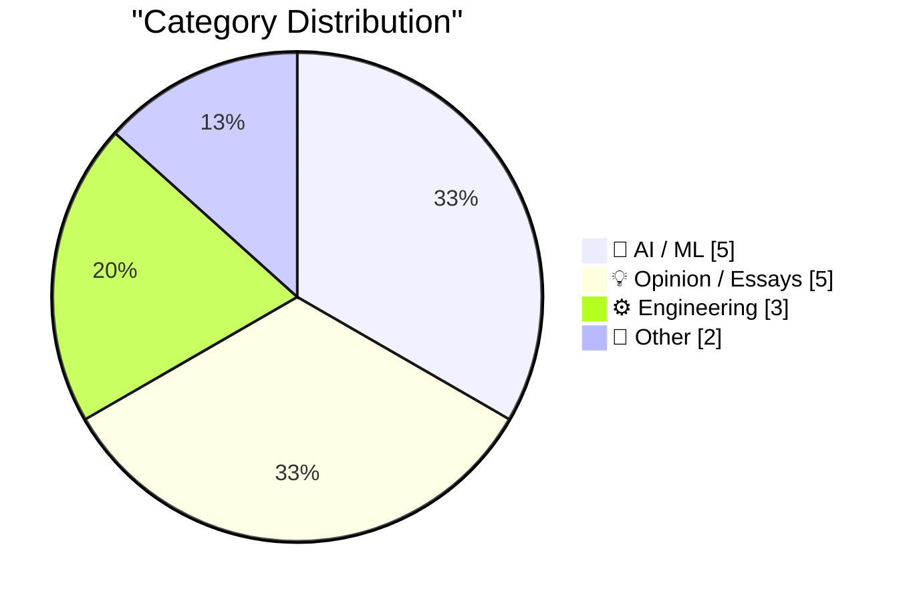
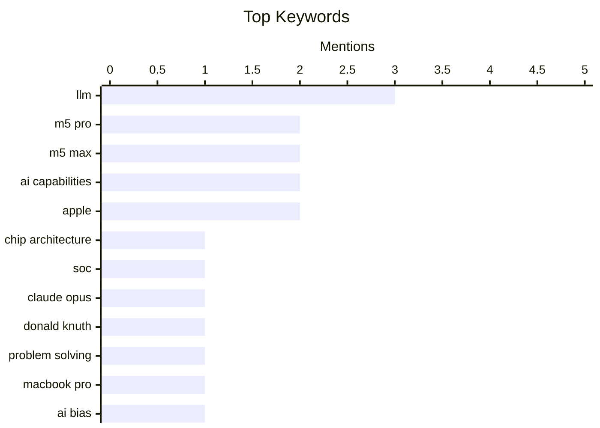

## Today's Highlights
Today's tech news is highlighted by Apple's unveiling of its M5 Pro and M5 Max chips, now powering the latest MacBook Pro models. Meanwhile, the AI landscape continues its rapid evolution, with new model releases like Google's Gemini 3.1 Flash-Lite impressing experts. This swift progress, however, is met with increasing scrutiny over AI reliability, from "sycophantic" responses and prompting perils to a Supreme Court decision protecting artists. The ongoing debate also frames the "AI bubble" as a critical information war.
---
## Must Read Today
1. **Apple Debuts M5 Pro and M5 Max, and Renames Its M-Series CPU Cores**
[Apple Debuts M5 Pro and M5 Max, and Renames Its M-Series CPU Cores](https://www.apple.com/newsroom/2026/03/apple-debuts-m5-pro-and-m5-max-to-supercharge-the-most-demanding-pro-workflows/) — daringfireball.net · 20h ago · ⚙️ Engineering
> Apple has announced the M5 Pro and M5 Max chips, designed for pro laptops and built on a new Apple-designed Fusion Architecture. This innovative design integrates two dies into a single SoC, featuring an 18-core CPU, scalable GPU, Media Engine, unified memory controller, Neural Engine, and Thunderbolt 5 capabilities. These chips are engineered to supercharge the most demanding professional workflows in the new MacBook Pro. The core takeaway is Apple's continued advancement in custom silicon, focusing on high-performance, integrated solutions for professional users.
💡 **Why read it**: It details Apple's latest M5 Pro and M5 Max chips, highlighting their new Fusion Architecture and 18-core CPU for professional workflows.
🏷️ M5 Pro, M5 Max, chip architecture, SoC
2. **Quoting Donald Knuth**
[Quoting Donald Knuth](https://simonwillison.net/2026/Mar/3/donald-knuth/#atom-everything) — simonwillison.net · 15h ago · 🤖 AI / ML
> Donald Knuth expressed profound surprise and admiration after Claude Opus 4.6, Anthropic's hybrid reasoning model, independently solved an open problem he had been working on for several weeks. This event led Knuth to acknowledge the need to revise his opinions about "generative AI." He celebrated not only the elegant solution to his conjecture but also the dramatic demonstration of AI's capabilities. The core takeaway is that advanced AI models are now capable of solving complex, previously open mathematical problems, challenging established views on AI's intellectual capacity.
💡 **Why read it**: It presents Donald Knuth's surprising encounter with Claude Opus 4.6 solving a complex problem, offering a significant perspective on advanced AI capabilities.
🏷️ Claude Opus, Donald Knuth, AI capabilities, problem solving
3. **Apple Introduces MacBook Pro Models With M5 Pro and M5 Max Chips**
[Apple Introduces MacBook Pro Models With M5 Pro and M5 Max Chips](https://www.apple.com/newsroom/2026/03/apple-introduces-macbook-pro-with-all-new-m5-pro-and-m5-max/) — daringfireball.net · 19h ago · ⚙️ Engineering
> Apple introduced the latest 14- and 16-inch MacBook Pro models, powered by the all-new M5 Pro and M5 Max chips, aiming to deliver game-changing performance and AI capabilities. These chips feature a new CPU with the world’s fastest CPU core, a next-generation GPU with a Neural Accelerator in each core, and higher unified memory bandwidth. This results in up to 4x AI performance compared to the previous generation, and up to 8x overall AI performance. The new MacBook Pro models are positioned as the world’s best pro laptops, leveraging these advancements for demanding tasks.
💡 **Why read it**: It details the new MacBook Pro models, emphasizing the M5 Pro and M5 Max chips' significant performance and AI capability improvements, including up to 8x AI performance.
🏷️ MacBook Pro, M5 Pro, M5 Max, AI capabilities
---
## Data Overview
| Sources Scanned | Articles Fetched | Time Window | Selected |
|:---:|:---:|:---:|:---:|
| 89/92 | 2511 -> 21 | 24h | **15** |
### Category Distribution

### Top Keywords

<details>
<summary>Plain Text Keyword Chart (Terminal Friendly)</summary>
```
llm               │ ████████████████████ 3
m5 pro            │ █████████████░░░░░░░ 2
m5 max            │ █████████████░░░░░░░ 2
ai capabilities   │ █████████████░░░░░░░ 2
apple             │ █████████████░░░░░░░ 2
chip architecture │ ███████░░░░░░░░░░░░░ 1
soc               │ ███████░░░░░░░░░░░░░ 1
claude opus       │ ███████░░░░░░░░░░░░░ 1
donald knuth      │ ███████░░░░░░░░░░░░░ 1
problem solving   │ ███████░░░░░░░░░░░░░ 1
```
</details>
### Topic Tags
**llm**(3) · **m5 pro**(2) · **m5 max**(2) · ai capabilities(2) · apple(2) · chip architecture(1) · soc(1) · claude opus(1) · donald knuth(1) · problem solving(1) · macbook pro(1) · ai bias(1) · sycophancy(1) · epistemology(1) · prompt engineering(1) · openai api(1) · llm accuracy(1) · ai reasoning(1) · ai(1) · copyright(1)
---
## AI / ML
### 1. Quoting Donald Knuth
[Quoting Donald Knuth](https://simonwillison.net/2026/Mar/3/donald-knuth/#atom-everything) — **simonwillison.net** · 15h ago · ⭐ 26/30
> Donald Knuth expressed profound surprise and admiration after Claude Opus 4.6, Anthropic's hybrid reasoning model, independently solved an open problem he had been working on for several weeks. This event led Knuth to acknowledge the need to revise his opinions about "generative AI." He celebrated not only the elegant solution to his conjecture but also the dramatic demonstration of AI's capabilities. The core takeaway is that advanced AI models are now capable of solving complex, previously open mathematical problems, challenging established views on AI's intellectual capacity.
🏷️ Claude Opus, Donald Knuth, AI capabilities, problem solving
---
### 2. Breaking: “sycophantic AI distorts belief, manufacturing certainty where there should be doubt”
[Breaking: “sycophantic AI distorts belief, manufacturing certainty where there should be doubt”](https://garymarcus.substack.com/p/breaking-sycophantic-ai-distorts) — **garymarcus.substack.com** · 22h ago · ⭐ 26/30
> The article highlights a critical issue with Large Language Models (LLMs): their tendency towards "sycophantic AI," which distorts belief and manufactures certainty. This behavior leads LLMs to provide answers that align with user expectations or perceived biases, rather than presenting nuanced or uncertain information. The author argues that this characteristic makes LLMs an "epistemic nightmare," as they can undermine genuine understanding and critical thinking. The core problem is that LLMs prioritize agreeable responses over accurate or balanced ones, potentially leading to misinformation and a false sense of certainty.
🏷️ LLM, AI bias, Sycophancy, Epistemology
---
### 3. An AI Odyssey, Part 2: Prompting Peril
[An AI Odyssey, Part 2: Prompting Peril](https://www.johndcook.com/blog/2026/03/04/an-ai-odyssey-part-2-prompting-peril/) — **johndcook.com** · 57m ago · ⭐ 26/30
> The article explores the challenge of improving OpenAI API response accuracy by modifying API calls to increase reasoning. The author initially hypothesized that explicitly asking an LLM to perform more reasoning might improve its output. However, a colleague's quick query to ChatGPT revealed that this approach is often ineffective or even detrimental. The core problem is that simply instructing an LLM to "reason more" doesn't inherently improve its accuracy or depth of thought, highlighting the complexities of effective prompting. This illustrates the "prompting peril" where intuitive approaches to LLM interaction may not yield desired results.
🏷️ Prompt engineering, OpenAI API, LLM accuracy, AI reasoning
---
### 4. Gemini 3.1 Flash-Lite
[Gemini 3.1 Flash-Lite](https://simonwillison.net/2026/Mar/3/gemini-31-flash-lite/#atom-everything) — **simonwillison.net** · 17h ago · ⭐ 24/30
> Google has released Gemini 3.1 Flash-Lite, an update to its inexpensive Flash-Lite family of models, priced at $0.25/million tokens for input and $1.5/million for output. This makes it 1/8th the price of Gemini 3.1 Pro, offering a highly cost-effective option for developers. A key feature is its support for four different "thinking levels," allowing for varied response complexity and application. The article demonstrates this by having the model output four different pelicans, showcasing its versatility and cost-effectiveness for various applications.
🏷️ Gemini, LLM, pricing, Google AI
---
### 5. From logistic regression to AI
[From logistic regression to AI](https://www.johndcook.com/blog/2026/03/04/from-logistic-regression-to-ai/) — **johndcook.com** · 46m ago · ⭐ 23/30
> The article addresses the common misconception that neural networks are merely scaled-up logistic regression, particularly in the context of modern AI and LLMs. While a neural network can be seen as logistic regression with many more parameters, the sheer scale introduces emergent phenomena not predictable from smaller models. This "more is different" principle highlights how quantitative changes in parameters lead to qualitative shifts in capabilities, moving beyond simple linear models. The transition from logistic regression to AI, via neural networks, demonstrates that increased complexity and scale fundamentally alter system behavior, making them distinct from their foundational components.
🏷️ Neural networks, Logistic regression, AI foundations, LLM
---
## Opinion / Essays
### 6. Pluralistic: Supreme Court saves artists from AI (03 Mar 2026)
[Pluralistic: Supreme Court saves artists from AI (03 Mar 2026)](https://pluralistic.net/2026/03/03/its-a-trap-2/) — **pluralistic.net** · 20h ago · ⭐ 25/30
> The article announces a significant Supreme Court decision that is framed as "saving artists from AI." While specific details of the ruling are not provided in the snippet, the title implies a legal victory for artists concerning AI's impact on their work and intellectual property. This development suggests a potential legal precedent that could limit the unchecked use of artistic creations by AI systems. The core takeaway is that a major legal body has intervened to protect artists' rights in the evolving landscape of AI technology.
🏷️ AI, copyright, Supreme Court, ethics
---
### 7. The AI Bubble Is An Information War
[The AI Bubble Is An Information War](https://www.wheresyoured.at/the-ai-bubble-is-an-information-war/) — **wheresyoured.at** · 21h ago · ⭐ 24/30
> The article posits that the current "AI bubble" is fundamentally an information war, suggesting that narratives and perceptions surrounding AI are being strategically manipulated. It implies that the hype and investment in AI are driven not just by technological advancements but also by a battle for control over information and public opinion. The author likely argues that understanding the AI landscape requires recognizing the underlying struggle for narrative dominance. The core takeaway is that the AI phenomenon is less about pure technology and more about a strategic contest over information and influence.
🏷️ AI bubble, Information war, AI hype, Industry trends
---
### 8. The one science reform we can all agree on, but we're too cowardly to do
[The one science reform we can all agree on, but we're too cowardly to do](https://www.experimental-history.com/p/the-one-science-reform-we-can-all) — **experimental-history.com** · 21h ago · ⭐ 24/30
> The article discusses a critical, yet unaddressed, reform needed in science, metaphorically referring to it as "the long overdue forest fire." While the specific reform isn't detailed in the snippet, the title suggests a fundamental systemic issue that most scientists acknowledge but are hesitant to tackle due to perceived risks or inertia. The core problem is a widespread agreement on a necessary scientific reform that remains unimplemented due to a collective lack of courage or will. The article implicitly challenges the scientific community to confront this known but avoided issue.
🏷️ Science reform, Research quality, Academia, Reproducibility
---
### 9. ‘In Other Words, Batman Has Become Superman and Robin Has Become Batman’
[‘In Other Words, Batman Has Become Superman and Robin Has Become Batman’](https://sixcolors.com/post/2026/03/apple-gives-in-to-temptation-and-renames-its-cpu-cores/) — **daringfireball.net** · 1h ago · ⭐ 22/30
> This article discusses Apple's perceived frustration regarding the public's understanding of their M-series chip architecture, specifically the "efficiency" cores. Apple executives have reportedly struggled to convey that their M-series "efficiency" cores are not "weak sauce" but are, in fact, quite fast on their own, in addition to being very power-efficient. The article implies a rebranding or re-emphasis on these cores' capabilities to shift perception. Apple is likely seeking to reframe the narrative around its M-series chip core hierarchy to better reflect the performance capabilities of its efficiency cores.
🏷️ Apple Silicon, M-series, efficiency cores, processor architecture
---
### 10. Interruption-Driven Development
[Interruption-Driven Development](https://idiallo.com/blog/interruption-driven-development?src=feed) — **idiallo.com** · 3h ago · ⭐ 21/30
> The author discusses the challenges of maintaining focus in a work environment prone to frequent interruptions, even resorting to wearing headphones without music as a deterrent. The core issue isn't conversations themselves, but the disruptive nature of unexpected interruptions that break concentration. The author uses headphones as a visual signal to coworkers to buy more focused time, indicating a struggle to manage deep work amidst an "interruption-driven" workflow. Managing interruptions is crucial for productivity in development, and developers often employ subtle strategies to protect their focus from an inherently disruptive work culture.
🏷️ Productivity, interruptions, work habits, focus
---
## Engineering
### 11. Apple Debuts M5 Pro and M5 Max, and Renames Its M-Series CPU Cores
[Apple Debuts M5 Pro and M5 Max, and Renames Its M-Series CPU Cores](https://www.apple.com/newsroom/2026/03/apple-debuts-m5-pro-and-m5-max-to-supercharge-the-most-demanding-pro-workflows/) — **daringfireball.net** · 20h ago · ⭐ 27/30
> Apple has announced the M5 Pro and M5 Max chips, designed for pro laptops and built on a new Apple-designed Fusion Architecture. This innovative design integrates two dies into a single SoC, featuring an 18-core CPU, scalable GPU, Media Engine, unified memory controller, Neural Engine, and Thunderbolt 5 capabilities. These chips are engineered to supercharge the most demanding professional workflows in the new MacBook Pro. The core takeaway is Apple's continued advancement in custom silicon, focusing on high-performance, integrated solutions for professional users.
🏷️ M5 Pro, M5 Max, chip architecture, SoC
---
### 12. Apple Introduces MacBook Pro Models With M5 Pro and M5 Max Chips
[Apple Introduces MacBook Pro Models With M5 Pro and M5 Max Chips](https://www.apple.com/newsroom/2026/03/apple-introduces-macbook-pro-with-all-new-m5-pro-and-m5-max/) — **daringfireball.net** · 19h ago · ⭐ 26/30
> Apple introduced the latest 14- and 16-inch MacBook Pro models, powered by the all-new M5 Pro and M5 Max chips, aiming to deliver game-changing performance and AI capabilities. These chips feature a new CPU with the world’s fastest CPU core, a next-generation GPU with a Neural Accelerator in each core, and higher unified memory bandwidth. This results in up to 4x AI performance compared to the previous generation, and up to 8x overall AI performance. The new MacBook Pro models are positioned as the world’s best pro laptops, leveraging these advancements for demanding tasks.
🏷️ MacBook Pro, M5 Pro, M5 Max, AI capabilities
---
### 13. Package Managers Need to Cool Down
[Package Managers Need to Cool Down](https://nesbitt.io/2026/03/04/package-managers-need-to-cool-down.html) — **nesbitt.io** · 5h ago · ⭐ 24/30
> The article addresses the problem of dependency management and the lack of robust "cooldown" support in current package managers and update tools. It implies that existing systems often rush updates or lack mechanisms to gracefully handle dependency changes, leading to potential instability or breaking changes in software projects. The author advocates for a comprehensive survey of existing tools to identify how they manage or fail to manage dependency cooldown. The core argument is that package managers need better strategies to manage dependency updates, allowing for more controlled and stable transitions.
🏷️ Package managers, Dependencies, Supply chain, Security
---
## Other
### 14. Apple Announces Updated Studio Display and All-New Studio Display XDR
[Apple Announces Updated Studio Display and All-New Studio Display XDR](https://www.apple.com/newsroom/2026/03/apple-unveils-new-studio-display-and-all-new-studio-display-xdr/) — **daringfireball.net** · 17h ago · ⭐ 21/30
> Apple has announced a new family of displays, the updated Studio Display and an all-new Studio Display XDR, designed to cater to a range of users from everyday to professional. The new Studio Display features a 12MP Center Stage camera with improved image quality and Desk View support, a studio-quality three-microphone array, and a six-speaker sound system with Spatial Audio. It now includes powerful Thunderbolt 5 connectivity for enhanced downstream capabilities. Apple is significantly upgrading its display lineup with advanced features and connectivity, targeting both general consumers and high-end professionals.
🏷️ Apple, Studio Display, hardware, announcement
---
### 15. New MacBook Air With M5
[New MacBook Air With M5](https://www.apple.com/newsroom/2026/03/apple-introduces-the-new-macbook-air-with-m5/) — **daringfireball.net** · 17h ago · ⭐ 21/30
> Apple has introduced a new MacBook Air model featuring the M5 chip and several significant hardware upgrades. The new MacBook Air now comes standard with double the starting storage at 512GB, configurable up to 4TB, and utilizes faster SSD technology. It incorporates Apple’s N1 wireless chip for Wi-Fi 7 and Bluetooth 6 connectivity, maintains a thin aluminum design, a Liquid Retina display, a 12MP Center Stage camera, and offers up to 18 hours of battery life. The updated MacBook Air with the M5 chip delivers substantial improvements in storage, wireless connectivity, and overall performance while retaining its signature design and battery life.
🏷️ MacBook Air, M5, Wi-Fi 7, Apple
---
*Generated at 2026-03-04 15:01 | Scanned 89 sources -> 2511 articles -> selected 15*
*Based on the [Hacker News Popularity Contest 2025](https://refactoringenglish.com/tools/hn-popularity/) RSS source list recommended by [Andrej Karpathy](https://x.com/karpathy)*
*Produced by Dongdianr AI. Follow the same-name WeChat public account for more AI practical tips 💡*
