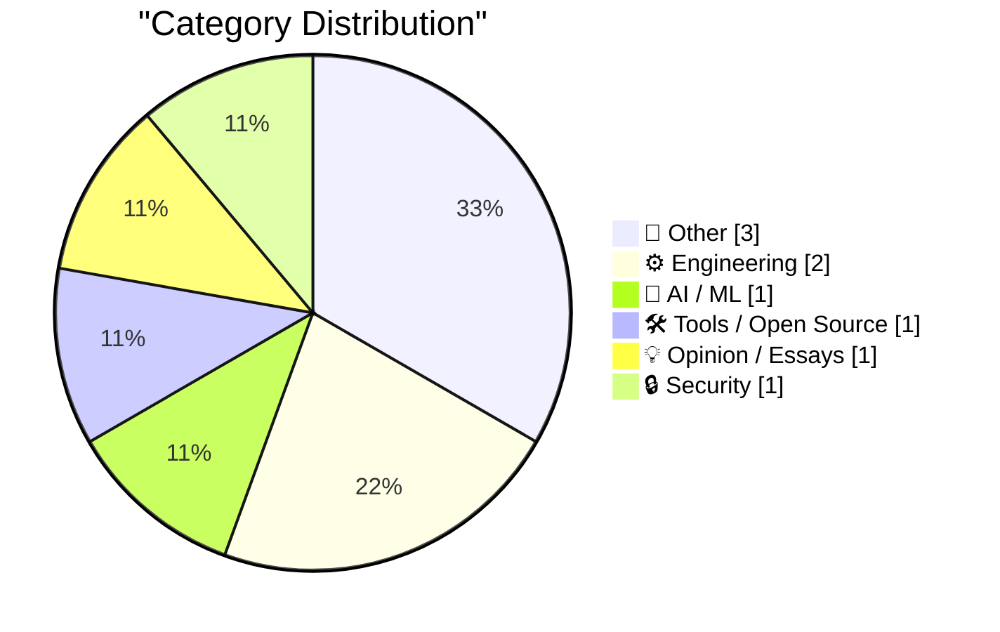
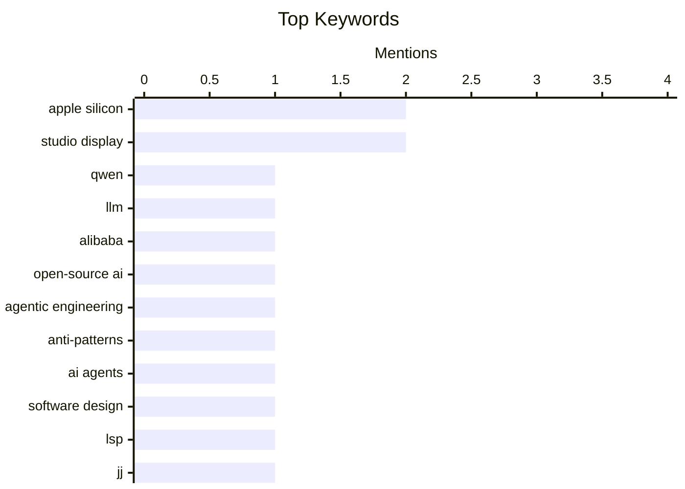

## Today's Highlights
AI innovation continues to surge with Alibaba's release of the Qwen 3.5 family of open-weight models, prompting new discussions on best practices and anti-patterns in the rapidly evolving field of agentic engineering. Concurrently, Apple's hardware landscape is a key focus, introducing the new MacBook Neo aimed at consumers and detailing important compatibility considerations for its latest Studio Displays. These developments underscore a dynamic period for both cutting-edge AI research and consumer technology.
---
## Must Read Today
1. **Something is afoot in the land of Qwen**
[Something is afoot in the land of Qwen](https://simonwillison.net/2026/Mar/4/qwen/#atom-everything) — simonwillison.net · 23h ago · 🤖 AI / ML
> The article discusses the recent release of Alibaba's Qwen 3.5 family of open-weight models, noting their remarkable capabilities. However, it highlights significant high-profile departures from the Qwen team within the past 24 hours, initiated by a tweet from Junyang Lin. This situation raises concerns about the future stability and continuity of the project despite the models' technical achievements. The author expresses hope that the 3.5 family does not mark a "swan song" for the team. This development suggests potential instability for a key player in the open-source AI landscape.
💡 **Why read it**: It provides timely insight into the status and potential future of a significant open-weight AI model family (Qwen 3.5) amidst recent team changes.
🏷️ Qwen, LLM, Alibaba, Open-source AI
2. **Anti-patterns: things to avoid**
[Anti-patterns: things to avoid](https://simonwillison.net/guides/agentic-engineering-patterns/anti-patterns/#atom-everything) — simonwillison.net · 21h ago · ⚙️ Engineering
> This article identifies common anti-patterns prevalent in the emerging field of agentic engineering. A primary anti-pattern highlighted is "Inflicting unreviewed code on collaborators," specifically filing pull requests without prior self-review. This practice leads to significant frustration and inefficiency within collaborative development workflows. The guide emphasizes the critical importance of developers thoroughly reviewing their own code before submitting it for team evaluation. Adhering to this principle is crucial for improving code quality and streamlining the overall code review process.
💡 **Why read it**: It offers practical advice on avoiding common pitfalls and improving collaboration and code quality in agentic engineering development.
🏷️ Agentic Engineering, Anti-patterns, AI agents, Software Design
3. **JJ LSP Follow Up**
[JJ LSP Follow Up](https://matklad.github.io/2026/03/05/jj-lsp-followup.html) — matklad.github.io · 15h ago · 🛠 Tools / Open Source
> This article is a follow-up on the "Majit LSP" concept, proposing the implementation of a Magit-style user experience for the `jj` version control system. The technical approach leverages the Language Server Protocol (LSP) to provide an integrated and familiar interface within LSP-compatible editors. The goal is to significantly enhance the usability and interaction with `jj` by adapting a proven UX paradigm from Magit. This integration aims to streamline common `jj` operations and improve developer workflow.
💡 **Why read it**: It explores a novel technical approach to improve the user experience of the `jj` version control system by integrating it with LSP using a Magit-style interface.
🏷️ LSP, jj, Magit, Developer Tools
---
## Data Overview
| Sources Scanned | Articles Fetched | Time Window | Selected |
|:---:|:---:|:---:|:---:|
| 89/92 | 2511 -> 9 | 24h | **9** |
### Category Distribution

### Top Keywords

<details>
<summary>Plain Text Keyword Chart (Terminal Friendly)</summary>
```
apple silicon       │ ████████████████████ 2
studio display      │ ████████████████████ 2
qwen                │ ██████████░░░░░░░░░░ 1
llm                 │ ██████████░░░░░░░░░░ 1
alibaba             │ ██████████░░░░░░░░░░ 1
open-source ai      │ ██████████░░░░░░░░░░ 1
agentic engineering │ ██████████░░░░░░░░░░ 1
anti-patterns       │ ██████████░░░░░░░░░░ 1
ai agents           │ ██████████░░░░░░░░░░ 1
software design     │ ██████████░░░░░░░░░░ 1
```
</details>
### Topic Tags
**apple silicon**(2) · **studio display**(2) · **qwen**(1) · llm(1) · alibaba(1) · open-source ai(1) · agentic engineering(1) · anti-patterns(1) · ai agents(1) · software design(1) · lsp(1) · jj(1) · magit(1) · developer tools(1) · package manager(1) · configuration files(1) · npmrc(1) · build tools(1) · macbook neo(1) · product review(1)
---
## Other
### 1. Compatibility Notes on the New Studio Displays
[Compatibility Notes on the New Studio Displays](https://www.macrumors.com/2026/03/03/apple-studio-display-no-intel-mac-support/) — **daringfireball.net** · 22h ago · ⭐ 22/30
> The article details crucial compatibility limitations for Apple's new Studio Display and Studio Display XDR, as reported by Juli Clover at MacRumors. Neither display is compatible with Intel-based Macs, indicating a shift towards Apple Silicon exclusivity. Furthermore, Macs with any M1 chip, or the base M2 or M3, are only able to drive the Studio Display XDR at 60 Hz. To achieve the full 120 Hz refresh rate on the Studio Display XDR, users require a Pro or better M2/M3, or any M4 or M5 chip. These specific hardware requirements highlight the displays' reliance on newer Apple Silicon for optimal performance.
🏷️ Studio Display, Compatibility, Apple Silicon, Intel Mac
---
### 2. Studio Display vs. Studio Display XDR
[Studio Display vs. Studio Display XDR](https://www.apple.com/displays/) — **daringfireball.net** · 20h ago · ⭐ 15/30
> The article notes the availability of a dedicated "Displays" page on Apple's website, which offers a direct, spec-by-spec comparison between the regular Studio Display and the Studio Display XDR models. This resource allows potential buyers to easily evaluate the technical differences and features of each display. The comparison page streamlines the decision-making process by presenting key specifications side-by-side. This new resource simplifies the process of understanding the distinctions between Apple's professional display offerings.
🏷️ Studio Display, Apple, Display Comparison, XDR
---
### 3. Book Review: Katabasis by R. F. Kuang ★★★★⯪
[Book Review: Katabasis by R. F. Kuang ★★★★⯪](https://shkspr.mobi/blog/2026/03/book-review-katabasis-by-r-f-kuang/) — **shkspr.mobi** · 2h ago · ⭐ 11/30
> This article reviews R. F. Kuang's book "Katabasis," highlighting it as a surprisingly humorous work from an author known for more serious themes. The plot centers on a university student who must descend into hell to retrieve a deceased advisor in order to graduate. The reviewer praises the book's brilliance, suggesting it draws from the author's own "psychotrauma" from university experiences, similar to her previous work, "Babel." The review rates the book highly with ★★★★⯪, indicating a strong recommendation for its unique blend of humor and fantasy.
🏷️ Book Review, Katabasis, R.F. Kuang, Fantasy
---
## Engineering
### 4. Anti-patterns: things to avoid
[Anti-patterns: things to avoid](https://simonwillison.net/guides/agentic-engineering-patterns/anti-patterns/#atom-everything) — **simonwillison.net** · 21h ago · ⭐ 25/30
> This article identifies common anti-patterns prevalent in the emerging field of agentic engineering. A primary anti-pattern highlighted is "Inflicting unreviewed code on collaborators," specifically filing pull requests without prior self-review. This practice leads to significant frustration and inefficiency within collaborative development workflows. The guide emphasizes the critical importance of developers thoroughly reviewing their own code before submitting it for team evaluation. Adhering to this principle is crucial for improving code quality and streamlining the overall code review process.
🏷️ Agentic Engineering, Anti-patterns, AI agents, Software Design
---
### 5. Package Manager Magic Files
[Package Manager Magic Files](https://nesbitt.io/2026/03/05/package-manager-magic-files.html) — **nesbitt.io** · 5h ago · ⭐ 23/30
> This article serves as a guide to various "magic files" used by different package managers, which are essential for configuring and managing project dependencies. It lists specific examples such as `.npmrc` for npm, `MANIFEST.in` for Python packaging, `Directory.Packages.props` for .NET, and `.pnpmfile.cjs` for pnpm. Understanding these files is crucial for developers to correctly define package behavior, dependencies, and build processes across diverse ecosystems. The article aims to demystify these configuration files and clarify their respective roles in software development.
🏷️ Package Manager, Configuration Files, npmrc, Build Tools
---
## AI / ML
### 6. Something is afoot in the land of Qwen
[Something is afoot in the land of Qwen](https://simonwillison.net/2026/Mar/4/qwen/#atom-everything) — **simonwillison.net** · 23h ago · ⭐ 27/30
> The article discusses the recent release of Alibaba's Qwen 3.5 family of open-weight models, noting their remarkable capabilities. However, it highlights significant high-profile departures from the Qwen team within the past 24 hours, initiated by a tweet from Junyang Lin. This situation raises concerns about the future stability and continuity of the project despite the models' technical achievements. The author expresses hope that the 3.5 family does not mark a "swan song" for the team. This development suggests potential instability for a key player in the open-source AI landscape.
🏷️ Qwen, LLM, Alibaba, Open-source AI
---
## Tools / Open Source
### 7. JJ LSP Follow Up
[JJ LSP Follow Up](https://matklad.github.io/2026/03/05/jj-lsp-followup.html) — **matklad.github.io** · 15h ago · ⭐ 25/30
> This article is a follow-up on the "Majit LSP" concept, proposing the implementation of a Magit-style user experience for the `jj` version control system. The technical approach leverages the Language Server Protocol (LSP) to provide an integrated and familiar interface within LSP-compatible editors. The goal is to significantly enhance the usability and interaction with `jj` by adapting a proven UX paradigm from Magit. This integration aims to streamline common `jj` operations and improve developer workflow.
🏷️ LSP, jj, Magit, Developer Tools
---
## Opinion / Essays
### 8. ★ Thoughts and Observations on the MacBook Neo
[★ Thoughts and Observations on the MacBook Neo](https://daringfireball.net/2026/03/599_not_a_piece_of_junk_macbook_neo) — **daringfireball.net** · 18h ago · ⭐ 22/30
> The article introduces the MacBook Neo as Apple's first major new Mac aimed at the consumer market in the Apple Silicon era. It posits that this new model is strategically designed to make a significant dent in the Mac's share of the overall PC market. The MacBook Neo represents a concerted effort by Apple to target a broader consumer base with its latest silicon technology. This release is anticipated to make a substantial impact on Apple's presence and competitiveness in the personal computing landscape.
🏷️ MacBook Neo, Apple Silicon, Product Review, Mac
---
## Security
### 9. Remembering the Michelangelo virus
[Remembering the Michelangelo virus](https://dfarq.homeip.net/remembering-michelangelo/?utm_source=rss&#038;utm_medium=rss&#038;utm_campaign=remembering-michelangelo) — **dfarq.homeip.net** · 3h ago · ⭐ 12/30
> The article reminisces about the Michelangelo virus, a notable piece of malware that emerged on March 6, 1992. This virus was specifically programmed to overwrite the first 100 sectors of a hard drive upon its activation date. While not as destructive as a full drive format, this action rendered the affected data inaccessible and effectively unusable for the average user. The Michelangelo virus served as a significant early example of data-wiping malware and its substantial impact on personal computing during that era.
🏷️ Michelangelo Virus, Computer Virus, Malware, History
---
*Generated at 2026-03-05 15:02 | Scanned 89 sources -> 2511 articles -> selected 9*
*Based on the [Hacker News Popularity Contest 2025](https://refactoringenglish.com/tools/hn-popularity/) RSS source list recommended by [Andrej Karpathy](https://x.com/karpathy)*
*Produced by Dongdianr AI. Follow the same-name WeChat public account for more AI practical tips 💡*
