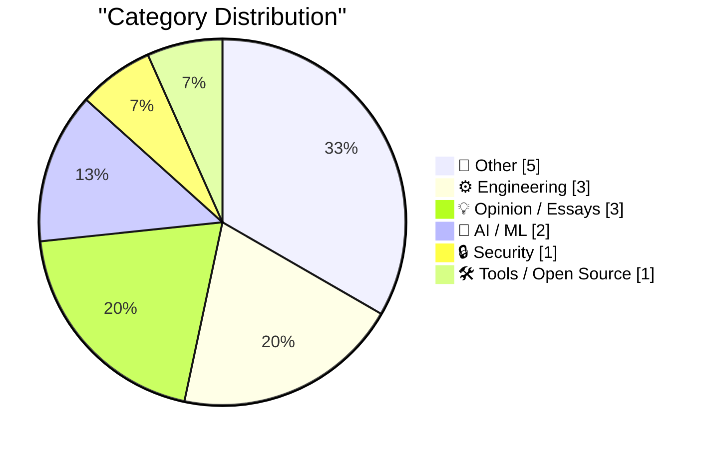
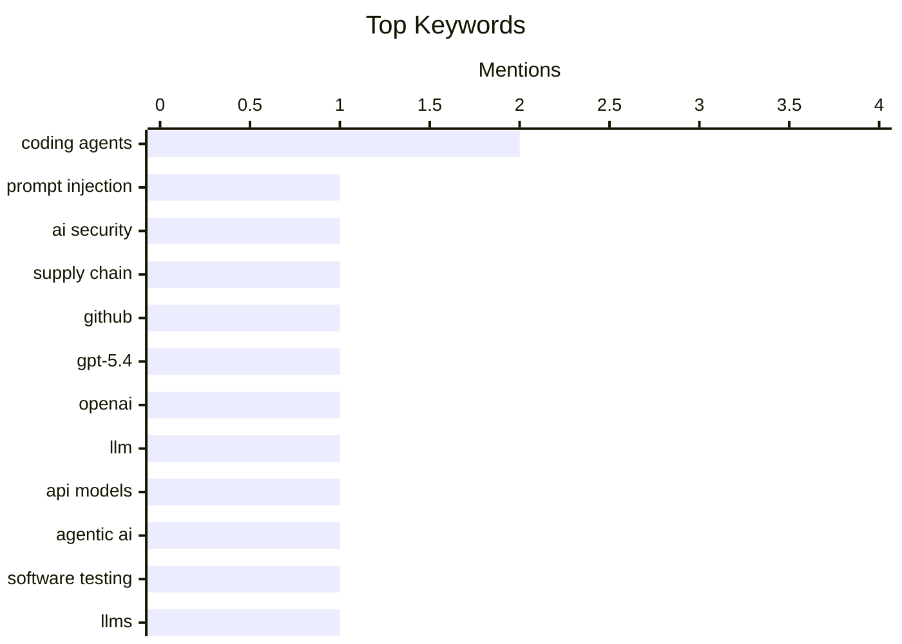

## Today's Highlights
The tech world is abuzz with the release of new GPT-5.4 models and the increasing integration of AI coding agents into engineering workflows, from testing to potential clean-room implementations. However, this rapid advancement is tempered by significant warnings, urging caution against relying on generative AI for critical tasks like taxes or life-saving decisions. Security remains a top concern, with sophisticated prompt injection attacks highlighting new vulnerabilities in AI-driven systems. These developments collectively underscore a complex future, prompting engineers to question their long-term job security amidst AI's evolving capabilities and the ethical challenges it presents.
---
## Must Read Today
1. **Clinejection — Compromising Cline's Production Releases just by Prompting an Issue Triager**
[Clinejection — Compromising Cline's Production Releases just by Prompting an Issue Triager](https://simonwillison.net/2026/Mar/6/clinejection/#atom-everything) — simonwillison.net · 12h ago · 🔒 Security
> This article details a sophisticated prompt injection attack chain against the Cline GitHub repository, leading to compromised production releases. The attack initiated with a malicious prompt embedded in a GitHub issue title, targeting Cline's AI-powered issue triage system. This system utilized the `anthropics/claude-code-action@v1` action, configured with Claude Code, which then executed the injected commands. The incident demonstrates how AI agents integrated into critical CI/CD pipelines can be exploited. It highlights severe security vulnerabilities introduced by prompt injection when AI agents have elevated permissions.
💡 **Why read it**: It details a real-world prompt injection attack that compromised a production system, offering critical insights into AI security risks.
🏷️ Prompt injection, AI security, Supply chain, GitHub
2. **Introducing GPT‑5.4**
[Introducing GPT‑5.4](https://simonwillison.net/2026/Mar/5/introducing-gpt54/#atom-everything) — simonwillison.net · 15h ago · 🤖 AI / ML
> OpenAI has announced the release of two new API models: `gpt-5.4` and `gpt-5.4-pro`. These models are also available through ChatGPT and the Codex CLI, expanding their accessibility. Key features include an August 31st, 2025 knowledge cutoff and an impressive 1 million token context window. Pricing information for these new models, alongside previous versions, is available on `llm-prices.com`. This release signifies a substantial advancement in large language model capabilities, particularly in terms of context handling and up-to-date information.
💡 **Why read it**: It provides key specifications and availability details for OpenAI's latest flagship LLM models, GPT-5.4 and GPT-5.4-pro.
🏷️ GPT-5.4, OpenAI, LLM, API models
3. **Agentic manual testing**
[Agentic manual testing](https://simonwillison.net/guides/agentic-engineering-patterns/agentic-manual-testing/#atom-everything) — simonwillison.net · 9h ago · ⚙️ Engineering
> The article emphasizes that a crucial characteristic of effective coding agents is their ability to execute the code they generate, not merely produce it. This execution capability significantly enhances their utility compared to LLMs that only output code without verification. The author stresses that code generated by an LLM should never be assumed functional until it has been executed and confirmed. This process allows agents to validate their own output, ensuring reliability. Integrating execution and verification is fundamental for coding agents to be truly useful and trustworthy in development workflows.
💡 **Why read it**: It explains a core principle of effective agentic engineering: the necessity for coding agents to execute and verify their own generated code.
🏷️ Agentic AI, Coding agents, Software testing, LLMs
---
## Data Overview
| Sources Scanned | Articles Fetched | Time Window | Selected |
|:---:|:---:|:---:|:---:|
| 89/92 | 2512 -> 15 | 24h | **15** |
### Category Distribution

### Top Keywords

<details>
<summary>Plain Text Keyword Chart (Terminal Friendly)</summary>
```
coding agents    │ ████████████████████ 2
prompt injection │ ██████████░░░░░░░░░░ 1
ai security      │ ██████████░░░░░░░░░░ 1
supply chain     │ ██████████░░░░░░░░░░ 1
github           │ ██████████░░░░░░░░░░ 1
gpt-5.4          │ ██████████░░░░░░░░░░ 1
openai           │ ██████████░░░░░░░░░░ 1
llm              │ ██████████░░░░░░░░░░ 1
api models       │ ██████████░░░░░░░░░░ 1
agentic ai       │ ██████████░░░░░░░░░░ 1
```
</details>
### Topic Tags
**coding agents**(2) · **prompt injection**(1) · **ai security**(1) · supply chain(1) · github(1) · gpt-5.4(1) · openai(1) · llm(1) · api models(1) · agentic ai(1) · software testing(1) · llms(1) · open source(1) · licensing(1) · clean room(1) · generative ai(1) · ai safety(1) · ai limitations(1) · trustworthiness(1) · software engineer(1)
---
## Other
### 1. A History of Operation Breakthrough
[A History of Operation Breakthrough](https://www.construction-physics.com/p/a-history-of-operation-breakthrough) — **construction-physics.com** · 1h ago · ⭐ 13/30
> This article examines the historical challenge of high and rising housing costs, often attributed to traditional, site-based construction methods, and the recurring idea that industrialized, factory-based production could offer a solution. It likely delves into "Operation Breakthrough," a significant U.S. government initiative from the late 1960s aimed at fostering mass production of housing. The initiative sought to overcome fragmented building codes, labor resistance, and financing issues to scale factory-built homes. The article would detail the program's ambitious goals, the technical approaches explored by participating consortia, and the ultimate outcomes and lessons learned regarding the feasibility and challenges of industrializing housing construction.
🏷️ housing, construction, industrialization, production methods
---
### 2. Pluralistic: Blowtorching the frog (05 Mar 2026) executive-dysfunction
[Pluralistic: Blowtorching the frog (05 Mar 2026) executive-dysfunction](https://pluralistic.net/2026/03/05/executive-dysfunction/) — **pluralistic.net** · 19h ago · ⭐ 12/30
> This "Pluralistic" post serves as a curated daily digest, presenting a collection of diverse links and commentary under a thematic title like "Blowtorching the frog" and "executive-dysfunction." It covers a wide range of topics, including social commentary (e.g., Bill Cosby, Rodney King, American authoritarianism), educational debates (Algebra II vs. Statistics for Citizenship), technology hacks (Hack your Sodastream), and critical observations on digital platforms ("There were always enshittifiers"). The post also lists upcoming and recent appearances by the author. The article functions as a broad-ranging intellectual aggregator, offering critical perspectives on current events, technology, and societal trends through a series of linked discussions.
🏷️ Link digest, Commentary, Executive dysfunction
---
### 3. Advice for staying in the hospital for a week
[Advice for staying in the hospital for a week](https://xeiaso.net/blog/2026/hospital-advice/) — **xeiaso.net** · 15h ago · ⭐ 10/30
> The article offers practical advice for individuals facing an extended hospital stay, drawing from the author's personal experience of a week in a clinical environment. It provides "hard-won wisdom" on navigating the challenges of fluorescent lights and beeping machines, likely covering aspects such as managing discomfort, interacting effectively with medical staff, and maintaining personal well-being. The advice aims to help patients cope with the hospital setting, potentially including tips for comfort, communication, and self-advocacy. Ultimately, the article seeks to equip readers with actionable strategies to make a hospital stay more tolerable and manageable.
🏷️ Hospital stay, Personal advice, Health
---
### 4. Lijstduwer, Felipe Rodriquez Award, BNR, NRC, btw en meer
[Lijstduwer, Felipe Rodriquez Award, BNR, NRC, btw en meer](https://berthub.eu/articles/posts/lijstduwer-fra-award-bnr-nrc-btw-meer/) — **berthub.eu** · 1h ago · ⭐ 10/30
> This article serves as a personal update from the author, covering a variety of recent activities and engagements. The author announces involvement in politics as a 'lijstduwer,' receiving the prestigious Felipe Rodriquez Award, and participating in two significant media broadcasts (BNR and NRC). Additionally, the post discusses the intriguing prospect of Dutch VAT ('btw') potentially moving to America. The article concludes by providing links to various other interesting articles, functioning as a multi-faceted personal update highlighting the author's recent engagements across political, professional, and media spheres, alongside commentary on current events.
🏷️ personal blog, politics, award, Netherlands
---
### 5. Blue Monday by New Order released, 1983
[Blue Monday by New Order released, 1983](https://dfarq.homeip.net/blue-monday-by-new-order-released-1983/?utm_source=rss&#038;utm_medium=rss&#038;utm_campaign=blue-monday-by-new-order-released-1983) — **dfarq.homeip.net** · 3h ago · ⭐ 6/30
> This article commemorates the release of New Order's iconic song "Blue Monday" on March 7, 1983, highlighting its enduring status as one of the greatest New Wave songs of all time. A key technical detail discussed is its highly unusual and innovative record sleeve, which was designed to resemble a floppy disk. This unique packaging included cutouts that allowed the record itself to show through, making it a distinctive and memorable design choice. The article celebrates both the song's musical significance and its groundbreaking, instantly recognizable packaging design from 1983.
🏷️ music history, New Order, Blue Monday, 1983
---
## Engineering
### 6. Agentic manual testing
[Agentic manual testing](https://simonwillison.net/guides/agentic-engineering-patterns/agentic-manual-testing/#atom-everything) — **simonwillison.net** · 9h ago · ⭐ 26/30
> The article emphasizes that a crucial characteristic of effective coding agents is their ability to execute the code they generate, not merely produce it. This execution capability significantly enhances their utility compared to LLMs that only output code without verification. The author stresses that code generated by an LLM should never be assumed functional until it has been executed and confirmed. This process allows agents to validate their own output, ensuring reliability. Integrating execution and verification is fundamental for coding agents to be truly useful and trustworthy in development workflows.
🏷️ Agentic AI, Coding agents, Software testing, LLMs
---
### 7. Can coding agents relicense open source through a “clean room” implementation of code?
[Can coding agents relicense open source through a “clean room” implementation of code?](https://simonwillison.net/2026/Mar/5/chardet/#atom-everything) — **simonwillison.net** · 22h ago · ⭐ 26/30
> This article explores the complex question of whether coding agents can create "clean room" implementations of open-source code, potentially circumventing licensing. Coding agents have demonstrated an extraordinary ability to build such implementations, akin to Compaq's 1982 IBM BIOS clone, where one team reverse-engineered a specification for another to implement. The concern is that agents could analyze existing open-source code, generate a functional specification, and then write new code based solely on that specification. This raises profound legal and ethical questions regarding copyright, licensing, and the definition of derivative works in the context of AI-generated code.
🏷️ Coding agents, Open source, Licensing, Clean room
---
### 8. .gitlocal
[.gitlocal](https://nesbitt.io/2026/03/06/gitlocal.html) — **nesbitt.io** · 5h ago · ⭐ 22/30
> The article addresses a common Git workflow problem: the lack of a native mechanism for individual files to ignore themselves locally. Current solutions, like `.gitignore`, affect all users, or require manual `git update-index --assume-unchanged` commands. The author proposes a `.gitlocal` file, analogous to `.gitignore`, but specifically designed for local, per-user file exclusions. This would allow developers to ignore specific files, such as local configuration or temporary build artifacts, without polluting the shared repository. Implementing `.gitlocal` would standardize and streamline the management of user-specific file exclusions in Git repositories.
🏷️ Git, version control, ignore files, developer experience
---
## Opinion / Essays
### 9. I don't know if my job will still exist in ten years
[I don't know if my job will still exist in ten years](https://seangoedecke.com/will-my-job-still-exist/) — **seangoedecke.com** · 15h ago · ⭐ 24/30
> The author expresses significant uncertainty about the long-term viability of the software engineering profession within the next decade. While 2021 saw a robust and growing demand for software engineers, the author perceives a dramatic shift by 2026. This sentiment suggests that the industry is undergoing profound changes, potentially driven by advancements in AI and automation, which could reshape or reduce the need for traditional software development roles. The article reflects a widespread anxiety among professionals about adapting to an evolving technological landscape. It underscores the need for software engineers to re-evaluate their career trajectories and skill sets.
🏷️ Software engineer, AI impact, Career future, Job market
---
### 10. Boy I was wrong about the Fediverse
[Boy I was wrong about the Fediverse](https://matduggan.com/boy-i-was-wrong-about-the-fediverse/) — **matduggan.com** · 2h ago · ⭐ 24/30
> The author initially held a skeptical view of the Fediverse, not identifying as an "online community first" person and preferring real-life connections. Their past engagement with the internet was primarily for staying in touch with people met offline, rather than participating in celebrity-focused social media or striving for online virality. The title implies a significant change in perspective, suggesting the author has since discovered unexpected value or appeal in the Fediverse. This article likely details the author's journey from initial dismissal to an eventual appreciation for the decentralized social network. It offers insights into how the Fediverse can attract users who are typically wary of traditional online communities.
🏷️ Fediverse, decentralized social, online community, Mastodon
---
### 11. Steve Jobs in 2007, on Apple’s Pursuit of PC Market Share: ‘We Just Can’t Ship Junk’
[Steve Jobs in 2007, on Apple’s Pursuit of PC Market Share: ‘We Just Can’t Ship Junk’](https://www.youtube.com/watch?v=U37Ds3RvyoM) — **daringfireball.net** · 19h ago · ⭐ 17/30
> This article recounts Steve Jobs's philosophy on Apple's strategy for gaining PC market share in 2007, prioritizing quality above all else. During an August 2007 Mac event that introduced new iMacs, iLife '08, and iWork '08 (including Numbers 1.0), Jobs, alongside Tim Cook and Phil Schiller, addressed a question about Apple's market share goals. He famously stated, "We just can't ship junk," emphasizing Apple's unwavering commitment to product excellence and user experience. This statement underscored Apple's foundational philosophy of building superior products as the primary driver for long-term success and market growth, rather than chasing market share with lower-quality offerings.
🏷️ Steve Jobs, Apple, Product quality, History
---
## AI / ML
### 12. Introducing GPT‑5.4
[Introducing GPT‑5.4](https://simonwillison.net/2026/Mar/5/introducing-gpt54/#atom-everything) — **simonwillison.net** · 15h ago · ⭐ 28/30
> OpenAI has announced the release of two new API models: `gpt-5.4` and `gpt-5.4-pro`. These models are also available through ChatGPT and the Codex CLI, expanding their accessibility. Key features include an August 31st, 2025 knowledge cutoff and an impressive 1 million token context window. Pricing information for these new models, alongside previous versions, is available on `llm-prices.com`. This release signifies a substantial advancement in large language model capabilities, particularly in terms of context handling and up-to-date information.
🏷️ GPT-5.4, OpenAI, LLM, API models
---
### 13. Don’t trust Generative AI to do your taxes — and don’t trust it with people’s lives
[Don’t trust Generative AI to do your taxes — and don’t trust it with people’s lives](https://garymarcus.substack.com/p/dont-trust-generative-ai-to-do-your) — **garymarcus.substack.com** · 21h ago · ⭐ 26/30
> The article issues a strong warning against relying on Generative AI for critical tasks such as tax preparation or life-or-death decisions. This caution stems from the fundamental design of AI chatbots, which are engineered to produce plausible-sounding text rather than strictly factual or accurate information. Their inherent probabilistic nature makes them prone to hallucinations and factual inaccuracies, rendering them unreliable for tasks demanding precision, legal compliance, or high-stakes outcomes. Users are advised to exercise extreme skepticism when deploying Generative AI in domains where accuracy and reliability are paramount.
🏷️ Generative AI, AI safety, AI limitations, Trustworthiness
---
## Security
### 14. Clinejection — Compromising Cline's Production Releases just by Prompting an Issue Triager
[Clinejection — Compromising Cline's Production Releases just by Prompting an Issue Triager](https://simonwillison.net/2026/Mar/6/clinejection/#atom-everything) — **simonwillison.net** · 12h ago · ⭐ 28/30
> This article details a sophisticated prompt injection attack chain against the Cline GitHub repository, leading to compromised production releases. The attack initiated with a malicious prompt embedded in a GitHub issue title, targeting Cline's AI-powered issue triage system. This system utilized the `anthropics/claude-code-action@v1` action, configured with Claude Code, which then executed the injected commands. The incident demonstrates how AI agents integrated into critical CI/CD pipelines can be exploited. It highlights severe security vulnerabilities introduced by prompt injection when AI agents have elevated permissions.
🏷️ Prompt injection, AI security, Supply chain, GitHub
---
## Tools / Open Source
### 15. Firmware Update for the Treedix TRX5-0816 Cable Tester
[Firmware Update for the Treedix TRX5-0816 Cable Tester](https://shkspr.mobi/blog/2026/03/firmware-update-for-the-treedix-trx5-0816-cable-tester/) — **shkspr.mobi** · 2h ago · ⭐ 17/30
> The author sought a firmware update for their Treedix USB Cable Tester (TRX5-0816) to resolve minor bugs identified in a previous review. Despite the need for updates, many Chinese manufacturers, including Treedix, do not publish them on their official websites. Instead, the manufacturer supplied the author with a direct link to a Google Drive containing the firmware and installation instructions. This experience highlights the often-unconventional and challenging process of obtaining software support for niche hardware. It underscores the reliance on direct communication and non-standard distribution channels for such updates.
🏷️ USB cable tester, Firmware update, Hardware, Treedix
---
*Generated at 2026-03-06 15:02 | Scanned 89 sources -> 2512 articles -> selected 15*
*Based on the [Hacker News Popularity Contest 2025](https://refactoringenglish.com/tools/hn-popularity/) RSS source list recommended by [Andrej Karpathy](https://x.com/karpathy)*
*Produced by Dongdianr AI. Follow the same-name WeChat public account for more AI practical tips 💡*
