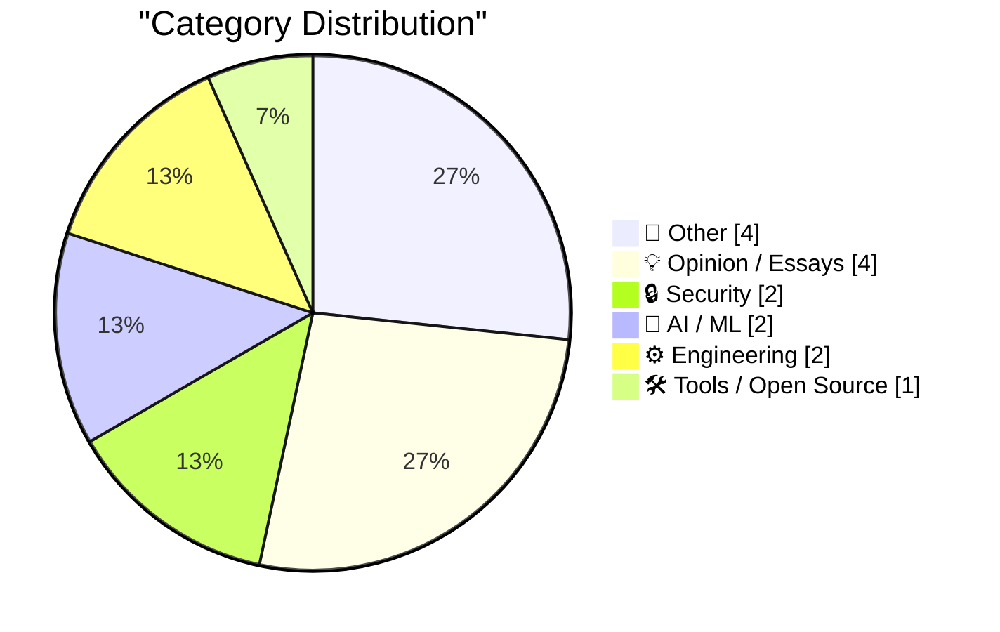
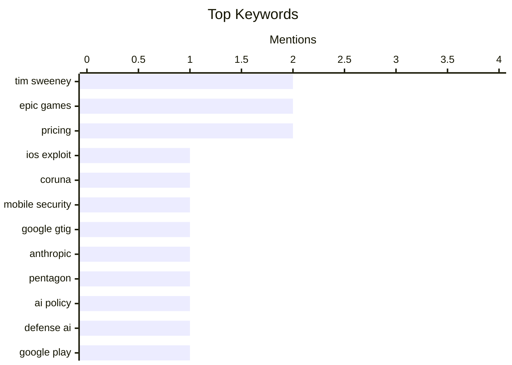

## Today's Highlights
Today's tech highlights reveal a landscape shaped by evolving digital threats, the expanding influence of AI, and ongoing battles for platform control. New sophisticated iOS exploit kits like "Coruna" underscore the persistent cybersecurity challenges facing users. Meanwhile, AI's strategic importance is growing, with companies like Anthropic engaging with defense sectors. This comes amidst continued tensions over app store policies and platform dominance, as seen in the complex relationship between Epic Games and Google.
---
## Must Read Today
1. **Google’s Threat Intelligence Group on Coruna a Powerful iOS Exploit Kit of Mysterious Origin**
[Google’s Threat Intelligence Group on Coruna a Powerful iOS Exploit Kit of Mysterious Origin](https://cloud.google.com/blog/topics/threat-intelligence/coruna-powerful-ios-exploit-kit) — daringfireball.net · 18h ago · 🔒 Security
> Google Threat Intelligence Group (GTIG) has identified "Coruna," a new and powerful exploit kit targeting Apple iPhone models. This kit affects iOS versions from 13.0 (September 2019) up to 17.2.1 (December 2023). Coruna contains five full iOS exploit chains and a total of 23 exploits, demonstrating its comprehensive collection of vulnerabilities. The core technical value lies in its broad coverage of recent iOS versions. This discovery underscores the persistent and sophisticated threat posed by advanced exploit kits to a wide range of iOS devices.
💡 **Why read it**: It provides critical information on a newly discovered, powerful iOS exploit kit ("Coruna") affecting a broad range of iOS versions, which is crucial for cybersecurity awareness.
🏷️ iOS exploit, Coruna, mobile security, Google GTIG
2. **Anthropic and the Pentagon**
[Anthropic and the Pentagon](https://simonwillison.net/2026/Mar/6/anthropic-and-the-pentagon/#atom-everything) — simonwillison.net · 21h ago · 🤖 AI / ML
> This article discusses the implications of AI companies like Anthropic and OpenAI contracting with the Pentagon, drawing insights from Bruce Schneier and Nathan E. Sanders. It highlights the increasing commodification of top-tier AI models, where performance differences are minimal, making differentiation difficult. The piece likely explores the ethical, security, and strategic implications of these partnerships, given the sensitive nature of military applications. The commoditization of advanced AI models raises significant questions about their deployment in defense contexts and their broader societal impact.
💡 **Why read it**: It offers a thoughtful and grounded analysis of the ethical and strategic implications of major AI companies like Anthropic partnering with the Pentagon.
🏷️ Anthropic, Pentagon, AI policy, defense AI
3. **Tim Sweeney Signed Away His Right to Criticize Google’s Play Store Until 2032**
[Tim Sweeney Signed Away His Right to Criticize Google’s Play Store Until 2032](https://www.theverge.com/news/889595/tim-sweeney-signed-away-his-right-to-criticize-google-until-2032) — daringfireball.net · 21h ago · 📝 Other
> Tim Sweeney, CEO of Epic Games, has signed a binding term sheet with Google that significantly restricts his ability to criticize the Google Play Store. Effective March 3rd, Sweeney signed away Epic's rights to sue and disparage Google over app distribution practices, fees, and treatment of games/apps. Crucially, he also forfeited his personal right to advocate for any further changes to Google's app store policies until 2032. This settlement effectively silences a prominent critic of Google's app store policies for nearly a decade.
💡 **Why read it**: It reveals a significant legal development where a key critic of Google's app store policies, Tim Sweeney, has been legally muzzled until 2032.
🏷️ Tim Sweeney, Google Play, Epic Games, settlement
---
## Data Overview
| Sources Scanned | Articles Fetched | Time Window | Selected |
|:---:|:---:|:---:|:---:|
| 87/92 | 2463 -> 17 | 24h | **15** |
### Category Distribution

### Top Keywords

<details>
<summary>Plain Text Keyword Chart (Terminal Friendly)</summary>
```
tim sweeney     │ ████████████████████ 2
epic games      │ ████████████████████ 2
pricing         │ ████████████████████ 2
ios exploit     │ ██████████░░░░░░░░░░ 1
coruna          │ ██████████░░░░░░░░░░ 1
mobile security │ ██████████░░░░░░░░░░ 1
google gtig     │ ██████████░░░░░░░░░░ 1
anthropic       │ ██████████░░░░░░░░░░ 1
pentagon        │ ██████████░░░░░░░░░░ 1
ai policy       │ ██████████░░░░░░░░░░ 1
```
</details>
### Topic Tags
**tim sweeney**(2) · **epic games**(2) · **pricing**(2) · ios exploit(1) · coruna(1) · mobile security(1) · google gtig(1) · anthropic(1) · pentagon(1) · ai policy(1) · defense ai(1) · google play(1) · settlement(1) · google antitrust(1) · apple antitrust(1) · email server(1) · self-hosting(1) · system administration(1) · infrastructure(1) · legacy code(1)
---
## Other
### 1. Tim Sweeney Signed Away His Right to Criticize Google’s Play Store Until 2032
[Tim Sweeney Signed Away His Right to Criticize Google’s Play Store Until 2032](https://www.theverge.com/news/889595/tim-sweeney-signed-away-his-right-to-criticize-google-until-2032) — **daringfireball.net** · 21h ago · ⭐ 27/30
> Tim Sweeney, CEO of Epic Games, has signed a binding term sheet with Google that significantly restricts his ability to criticize the Google Play Store. Effective March 3rd, Sweeney signed away Epic's rights to sue and disparage Google over app distribution practices, fees, and treatment of games/apps. Crucially, he also forfeited his personal right to advocate for any further changes to Google's app store policies until 2032. This settlement effectively silences a prominent critic of Google's app store policies for nearly a decade.
🏷️ Tim Sweeney, Google Play, Epic Games, settlement
---
### 2. How cosplaying Ancient Rome led to the scientific revolution
[How cosplaying Ancient Rome led to the scientific revolution](https://www.dwarkesh.com/p/ada-palmer) — **dwarkesh.com** · 21h ago · ⭐ 15/30
> The article explores the surprising link between Renaissance-era emulation of Ancient Rome and the subsequent Scientific Revolution. Renaissance figures, initially "cosplaying" or mimicking Roman culture, inadvertently fostered a critical, empirical mindset. This imitation led to a deeper engagement with classical texts and methods, prompting scholars to not just copy but also scrutinize and improve upon ancient knowledge. The process of trying to perfectly recreate or understand Roman practices inadvertently developed the intellectual tools necessary for scientific inquiry. The Renaissance's deep immersion in classical antiquity, initially an act of imitation, unexpectedly laid the groundwork for modern scientific thought by cultivating critical analysis and empirical observation.
🏷️ Scientific revolution, Ancient Rome, History, Renaissance
---
### 3. The Mystery of Rennes-le-Château, Part 1: The Priest’s Treasure
[The Mystery of Rennes-le-Château, Part 1: The Priest’s Treasure](https://www.filfre.net/2026/03/the-mystery-of-rennes-le-chateau-part-1-the-priests-treasure/) — **filfre.net** · 22h ago · ⭐ 13/30
> This article is the first part of a series chronicling the real and pseudo-history behind the mystery of Rennes-le-Château, specifically as it relates to the game Gabriel Knight 3: Blood of the Sacred, Blood of the Damned. It delves into the legend of a priest's treasure in Rennes-le-Château, a narrative often embellished with fantastical elements. The article suggests that the allure of such mysteries thrives on the creation of "enormous hope" and the feeling of being an "initiate," regardless of factual basis. It explores how these narratives become self-sustaining, offering a sense of discovery without requiring tangible evidence. The series aims to dissect how historical events and speculative narratives intertwine to create enduring mysteries, particularly those that inspire works like Gabriel Knight 3.
🏷️ Game history, Mystery, Gabriel Knight, Rennes-le-Château
---
### 4. The MacBook Neo’s Price, Looking to the Past and Future
[The MacBook Neo’s Price, Looking to the Past and Future](https://x.com/ethan_is_online/status/2029331836137291941?s=42) — **daringfireball.net** · 23h ago · ⭐ 10/30
> This article analyzes the historical and projected pricing trends of Apple's cheapest MacBooks relative to inflation and other consumer goods. Ethan W. Anderson's analysis projects that the most expensive McDonald's burger could surpass the price of the cheapest laptop by 2081. Historically, the original 1984 Macintosh cost $2,495 (approximately $7,800 today), while $599 in today's money would have been only about $190 in 1984. This highlights a significant shift in the relative affordability of Apple's entry-level computers over time. The article suggests that while Apple's entry-level pricing has become relatively more accessible compared to its past, future economic trends could lead to unusual inversions in consumer good costs.
🏷️ MacBook, pricing, consumer trends, comparison
---
## Opinion / Essays
### 5. The Verge Interviews Tim Sweeney After Victory in ‘Epic v. Google’
[The Verge Interviews Tim Sweeney After Victory in ‘Epic v. Google’](https://www.theverge.com/23996474/epic-tim-sweeney-interview-win-google-antitrust-lawsuit-district-court) — **daringfireball.net** · 20h ago · ⭐ 26/30
> In an interview with The Verge, Tim Sweeney discusses the distinct differences between Epic Games' antitrust cases against Apple and Google following Epic's victory against Google. Sweeney characterized Apple's antitrust trickery as "ice," internal to the company, involving their store, payments, and forcing uniform terms on developers, OEMs, and carriers. In contrast, he described Google's approach as "fire," involving external actions like paying off game developers to achieve its objectives with Android. Sweeney highlights these distinct strategies employed by Apple and Google in maintaining their app store dominance. Google's tactics were portrayed as more outwardly manipulative compared to Apple's internal controls.
🏷️ Epic Games, Google antitrust, Apple antitrust, Tim Sweeney
---
### 6. The Ghost in the Funnel
[The Ghost in the Funnel](https://worksonmymachine.ai/p/the-ghost-in-the-funnel) — **worksonmymachine.substack.com** · 26m ago · ⭐ 23/30
> This article explores the concept that "Your Free Tier is Someone Else's Twenty-Minute Side Project." It suggests that free tiers of services are often utilized by individuals for quick, low-commitment side projects rather than serious, long-term engagements that convert to paid plans. This implies a mismatch between the intended purpose of free tiers (lead generation) and their actual usage patterns. Businesses offering free tiers should recognize that a significant portion of their free users may not be viable conversion targets, impacting their sales funnel strategy.
🏷️ Free tier, SaaS, Business model, Developer economics
---
### 7. ‘The Window Chrome of Our Discontent’
[‘The Window Chrome of Our Discontent’](https://pxlnv.com/blog/window-chrome-of-our-discontent/) — **daringfireball.net** · 18h ago · ⭐ 19/30
> Nick Heer critiques Apple's design trend of minimizing window chrome and toolbar icons to emphasize content, using Pages (from 2009 through today) as an example. Heer contends that this design philosophy, aimed at reducing distraction, actually hinders usability by making interface elements less visible and harder to discern. He argues that removing visual cues between interface and document does not benefit the user. Apple's pursuit of minimalist window chrome, while intended to focus on content, often results in a less intuitive and potentially more frustrating user experience.
🏷️ Apple design, UI/UX, window chrome, design philosophy
---
### 8. Another Steve Jobs Quote on Lower-Priced Macs
[Another Steve Jobs Quote on Lower-Priced Macs](https://technologizer.com/2008/10/22/the-case-for-a-mac-netbook/index.html) — **daringfireball.net** · 23h ago · ⭐ 17/30
> This article revisits Steve Jobs's 2008 stance on Apple's unwillingness to produce a low-cost computer, specifically a "netbook-like Mac." Jobs stated Apple wouldn't make a $500 computer because they "don’t know how to make a $500 computer that’s not a piece of junk," emphasizing Apple's DNA against shipping low-quality products. Harry McCracken's contemporary commentary highlighted the ongoing debate about Apple's potential entry into the small, cheap computer market despite Jobs's firm position. Apple's historical commitment to premium quality over market share in the low-end segment was a defining characteristic under Jobs's leadership.
🏷️ Steve Jobs, Apple, product strategy, pricing
---
## Security
### 9. Google’s Threat Intelligence Group on Coruna a Powerful iOS Exploit Kit of Mysterious Origin
[Google’s Threat Intelligence Group on Coruna a Powerful iOS Exploit Kit of Mysterious Origin](https://cloud.google.com/blog/topics/threat-intelligence/coruna-powerful-ios-exploit-kit) — **daringfireball.net** · 18h ago · ⭐ 29/30
> Google Threat Intelligence Group (GTIG) has identified "Coruna," a new and powerful exploit kit targeting Apple iPhone models. This kit affects iOS versions from 13.0 (September 2019) up to 17.2.1 (December 2023). Coruna contains five full iOS exploit chains and a total of 23 exploits, demonstrating its comprehensive collection of vulnerabilities. The core technical value lies in its broad coverage of recent iOS versions. This discovery underscores the persistent and sophisticated threat posed by advanced exploit kits to a wide range of iOS devices.
🏷️ iOS exploit, Coruna, mobile security, Google GTIG
---
### 10. Book Review: The Electronic Criminals by Robert Farr (1975) ★★★⯪☆
[Book Review: The Electronic Criminals by Robert Farr (1975) ★★★⯪☆](https://shkspr.mobi/blog/2026/03/book-review-the-electronic-criminals-by-robert-farr-1975/) — **shkspr.mobi** · 2h ago · ⭐ 20/30
> This is a review of Robert Farr's 1975 book, "The Electronic Criminals," exploring early cybersecurity threats. The book, written as computing entered the mainstream, details nascent cybercrimes like fraud over Telex, ransomware involving physical tapes, stealing passwords, and mainframe hacking. While starting strong, the reviewer notes it eventually runs out of steam due to the limited scope of cybercrime in 1975. The book offers a fascinating, albeit historically limited, glimpse into the foundational concerns of cybersecurity from nearly fifty years ago.
🏷️ Cybersecurity history, Computer crime, Ransomware, Mainframe hacking
---
## AI / ML
### 11. Anthropic and the Pentagon
[Anthropic and the Pentagon](https://simonwillison.net/2026/Mar/6/anthropic-and-the-pentagon/#atom-everything) — **simonwillison.net** · 21h ago · ⭐ 27/30
> This article discusses the implications of AI companies like Anthropic and OpenAI contracting with the Pentagon, drawing insights from Bruce Schneier and Nathan E. Sanders. It highlights the increasing commodification of top-tier AI models, where performance differences are minimal, making differentiation difficult. The piece likely explores the ethical, security, and strategic implications of these partnerships, given the sensitive nature of military applications. The commoditization of advanced AI models raises significant questions about their deployment in defense contexts and their broader societal impact.
🏷️ Anthropic, Pentagon, AI policy, defense AI
---
### 12. Reading List 03/07/2026
[Reading List 03/07/2026](https://www.construction-physics.com/p/reading-list-03072026) — **construction-physics.com** · 1h ago · ⭐ 22/30
> This is a curated reading list covering various topics in technology, energy, and business. The list includes articles on data centers disconnecting from the grid, new solar PV efficiency records, and repairs for the Strategic Petroleum Reserve. It also covers Ford’s EV missteps and the new startup from a former OpenAI CTO. The compilation offers a snapshot of diverse, current developments across critical sectors like energy, automotive, and artificial intelligence.
🏷️ Reading list, AI startup, Data centers, Tech news
---
## Engineering
### 13. How to Host your Own Email Server
[How to Host your Own Email Server](https://blog.miguelgrinberg.com/post/how-to-host-your-own-email-server) — **miguelgrinberg.com** · 22h ago · ⭐ 24/30
> The author faced the challenge of sending account-related emails for a new platform, noting the common advice to use paid services like Mailgun or SendGrid, despite the internet's perception of self-hosting email as difficult. This article details the process of hosting one's own email server, likely covering setup, configuration, and best practices to ensure deliverability and security. It aims to provide a viable alternative to relying on third-party email services. Self-hosting an email server is presented as a challenging but feasible option, offering more control and avoiding additional dependencies.
🏷️ Email server, Self-hosting, System administration, Infrastructure
---
### 14. Quoting Ally Piechowski
[Quoting Ally Piechowski](https://simonwillison.net/2026/Mar/6/ally-piechowski/#atom-everything) — **simonwillison.net** · 17h ago · ⭐ 23/30
> This article quotes Ally Piechowski on effective questions for auditing legacy Rails codebases and assessing engineering leadership. For developers, suggested questions include "What’s the one area you’re afraid to touch?", "When’s the last time you deployed on a Friday?", and "What broke in production in the last 90 days that wasn’t caught by tests?". For CTOs/EMs, questions like "What feature has been blocked for over a year?" and "Do you have real-time error visibility?" are recommended. These targeted questions provide deep insights into codebase health, team confidence, and leadership effectiveness in a technical organization.
🏷️ legacy code, code audit, production issues, developer experience
---
## Tools / Open Source
### 15. Announcing New Working Groups
[Announcing New Working Groups](https://nesbitt.io/2026/03/07/announcing-new-working-groups.html) — **nesbitt.io** · 5h ago · ⭐ 19/30
> The Open Source Foundations Consortium (OSFC) is establishing seven new working groups to address critical areas within open source development. These groups include "Open Source AI," "Supply Chain Security," "Sustainable Funding Models," "Open Hardware," "Open Data," "Ethical AI in Open Source," and "Community Health & Governance." This expansion reflects a commitment to fostering collaboration and innovation across diverse open source domains. The initiative seeks to drive progress and address emerging challenges in the open source ecosystem through focused, collaborative efforts.
🏷️ Open source, Working groups, Consortium, Governance
---
*Generated at 2026-03-07 15:01 | Scanned 87 sources -> 2463 articles -> selected 15*
*Based on the [Hacker News Popularity Contest 2025](https://refactoringenglish.com/tools/hn-popularity/) RSS source list recommended by [Andrej Karpathy](https://x.com/karpathy)*
*Produced by Dongdianr AI. Follow the same-name WeChat public account for more AI practical tips 💡*
