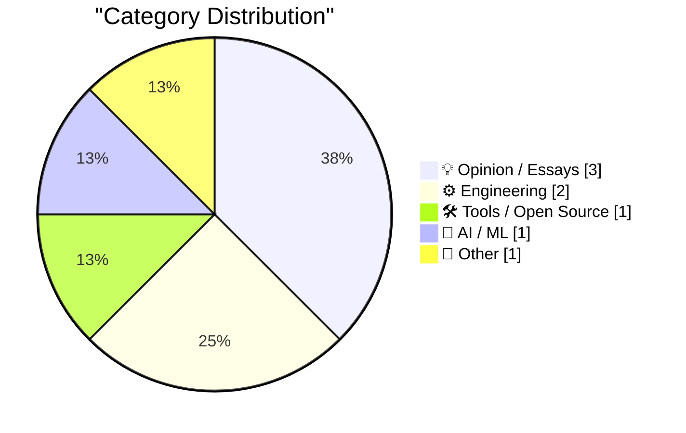
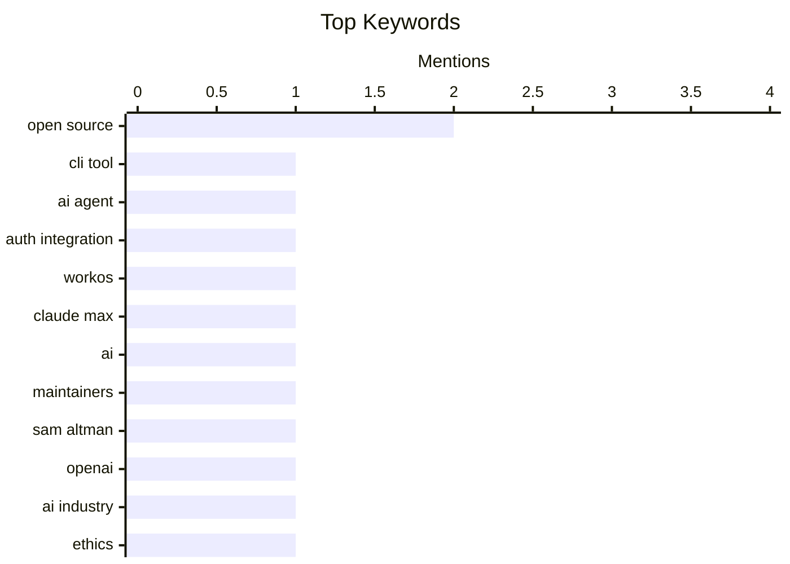

## Today's Highlights
Today's tech highlights reveal a strong focus on refining software development and business strategies. Discussions range from automating authentication and distinguishing package managers to designing minimalist paywalls and understanding the true value of SaaS free tiers. Meanwhile, the AI sector sees major companies supporting open-source projects, even as prominent figures face scrutiny over their leadership. These trends underscore a push for efficiency, sustainable business models, and ethical considerations within the tech community.
---
## Must Read Today
1. **‘npx workos’**
[‘npx workos’](https://workos.com/docs/authkit/cli-installer?utm_source=tldrdev&amp;utm_medium=newsletter&amp;utm_campaign=q12026) — daringfireball.net · 15h ago · 🛠 Tools / Open Source
> The article introduces `npx workos`, a CLI tool designed to automate authentication integration into existing codebases. This tool leverages an AI agent, powered by Claude, to read a project, detect its framework, and directly write a complete auth integration. Unlike a template generator, it understands the specific stack and customizes the integration accordingly. The WorkOS agent further refines the integration by type-checking, building, and iteratively fixing any errors it encounters. This offers a highly automated and intelligent solution for integrating authentication, adapting to specific project needs.
💡 **Why read it**: It introduces an innovative AI-powered CLI tool that automates complex authentication integrations by understanding and directly modifying existing codebases.
🏷️ CLI tool, AI agent, Auth integration, WorkOS
2. **Codex for Open Source**
[Codex for Open Source](https://simonwillison.net/2026/Mar/7/codex-for-open-source/#atom-everything) — simonwillison.net · 19h ago · 🤖 AI / ML
> The article discusses initiatives by major AI companies to support open-source project maintainers with free access to their advanced AI development tools. Following Anthropic's offer of six months of free Claude Max for maintainers of popular open-source projects (5,000+ stars or 1M+ NPM downloads), OpenAI has launched a comparable program. OpenAI's offer provides six months of ChatGPT Pro, which includes Codex, matching the $200/month value of Claude Max. Both major AI providers are now offering significant free access to their advanced AI coding tools for qualifying open-source maintainers.
💡 **Why read it**: It highlights a significant trend of major AI companies, OpenAI and Anthropic, providing free access to their advanced AI coding tools for open-source maintainers.
🏷️ Claude Max, Open Source, AI, Maintainers
3. **BREAKING: Sam Altman’s greed and dishonesty are finally catching up to him**
[BREAKING: Sam Altman’s greed and dishonesty are finally catching up to him](https://garymarcus.substack.com/p/breaking-sam-altmans-greed-and-dishonesty) — garymarcus.substack.com · 19h ago · 💡 Opinion / Essays
> This article is a brief, opinionated statement criticizing Sam Altman. It contains no detailed arguments, technical approaches, or findings, consisting solely of the phrase "It’s about time." The piece serves as a concise expression of strong disapproval towards Sam Altman. The author believes that Sam Altman is facing consequences for perceived greed and dishonesty.
💡 **Why read it**: It reflects a critical sentiment towards Sam Altman, albeit without providing specific details or evidence within the provided text.
🏷️ Sam Altman, OpenAI, AI industry, Ethics
---
## Data Overview
| Sources Scanned | Articles Fetched | Time Window | Selected |
|:---:|:---:|:---:|:---:|
| 89/92 | 2514 -> 8 | 24h | **8** |
### Category Distribution

### Top Keywords

<details>
<summary>Plain Text Keyword Chart (Terminal Friendly)</summary>
```
open source      │ ████████████████████ 2
cli tool         │ ██████████░░░░░░░░░░ 1
ai agent         │ ██████████░░░░░░░░░░ 1
auth integration │ ██████████░░░░░░░░░░ 1
workos           │ ██████████░░░░░░░░░░ 1
claude max       │ ██████████░░░░░░░░░░ 1
ai               │ ██████████░░░░░░░░░░ 1
maintainers      │ ██████████░░░░░░░░░░ 1
sam altman       │ ██████████░░░░░░░░░░ 1
openai           │ ██████████░░░░░░░░░░ 1
```
</details>
### Topic Tags
**open source**(2) · **cli tool**(1) · **ai agent**(1) · auth integration(1) · workos(1) · claude max(1) · ai(1) · maintainers(1) · sam altman(1) · openai(1) · ai industry(1) · ethics(1) · free tier(1) · product strategy(1) · monetization(1) · package manager(1) · developer tools(1) · software design(1) · paywalls(1) · creator economy(1)
---
## Opinion / Essays
### 1. BREAKING: Sam Altman’s greed and dishonesty are finally catching up to him
[BREAKING: Sam Altman’s greed and dishonesty are finally catching up to him](https://garymarcus.substack.com/p/breaking-sam-altmans-greed-and-dishonesty) — **garymarcus.substack.com** · 19h ago · ⭐ 21/30
> This article is a brief, opinionated statement criticizing Sam Altman. It contains no detailed arguments, technical approaches, or findings, consisting solely of the phrase "It’s about time." The piece serves as a concise expression of strong disapproval towards Sam Altman. The author believes that Sam Altman is facing consequences for perceived greed and dishonesty.
🏷️ Sam Altman, OpenAI, AI industry, Ethics
---
### 2. The Ghost in the Funnel
[The Ghost in the Funnel](https://worksonmymachine.ai/p/the-ghost-in-the-funnel) — **worksonmymachine.substack.com** · 23h ago · ⭐ 20/30
> The article explores the challenge of understanding the true value and impact of free tiers in SaaS products. Its title, "Your Free Tier is Someone Else's Twenty-Minute Side Project," suggests that free tiers are often used for quick, non-committal experimentation rather than serious evaluation leading to conversion. This implies a difficulty in converting free users who are merely exploring or utilizing the product for minimal, short-term tasks. Free tiers might attract users who are not serious conversion candidates, highlighting a potential misalignment between free user engagement and business goals.
🏷️ Free tier, Product strategy, Monetization
---
### 3. Pluralistic: The web is bearable with RSS (07 Mar 2026)
[Pluralistic: The web is bearable with RSS (07 Mar 2026)](https://pluralistic.net/2026/03/07/reader-mode/) — **pluralistic.net** · 19h ago · ⭐ 13/30
> The article argues for improving the user experience of browsing the web amidst its current challenges. It asserts that the web becomes "bearable" through the effective use of RSS feeds and "Reader Mode." These technologies are highlighted for their ability to filter out noise, ads, and distracting elements, allowing users to focus on core content. The piece advocates for a more controlled and content-centric consumption of online information. RSS and Reader Mode are presented as essential tools for a more manageable and enjoyable web browsing experience, enabling users to reclaim control over their content consumption.
🏷️ RSS, Web usability, Reader Mode
---
## Engineering
### 4. If It Quacks Like a Package Manager
[If It Quacks Like a Package Manager](https://nesbitt.io/2026/03/08/if-it-quacks-like-a-package-manager.html) — **nesbitt.io** · 4h ago · ⭐ 19/30
> The article addresses the distinction between tools that superficially resemble package managers and those that fully function as such. The tagline "Some tools waddle like package managers without learning to swim" implies that certain tools might handle dependency management or software distribution but lack the comprehensive features, robustness, or ecosystem integration expected of a true package manager. It suggests a critique of tools that might be mislabeled or misunderstood in their capabilities. Not all tools that perform package-like functions possess the full capabilities and characteristics of a complete package manager.
🏷️ Package manager, Developer tools, Software design
---
### 5. Paywalls For Minimalists
[Paywalls For Minimalists](https://feed.tedium.co/link/15204/17295750/minimal-paywall-setup-idea) — **tedium.co** · 41m ago · ⭐ 19/30
> The article explores the concept of designing a simple, effective, and mostly open-source paywall solution for creators. It aims to identify the minimal viable approach for creators to implement a paywall, emphasizing open-source components to reduce reliance on large platforms. This suggests exploring lightweight technical solutions and integration strategies that prioritize ease of setup and creator control. Developing a minimalist, open-source paywall could empower creators by offering an alternative to dominant platforms and simplifying monetization.
🏷️ Paywalls, Open Source, Creator economy
---
## Tools / Open Source
### 6. ‘npx workos’
[‘npx workos’](https://workos.com/docs/authkit/cli-installer?utm_source=tldrdev&amp;utm_medium=newsletter&amp;utm_campaign=q12026) — **daringfireball.net** · 15h ago · ⭐ 25/30
> The article introduces `npx workos`, a CLI tool designed to automate authentication integration into existing codebases. This tool leverages an AI agent, powered by Claude, to read a project, detect its framework, and directly write a complete auth integration. Unlike a template generator, it understands the specific stack and customizes the integration accordingly. The WorkOS agent further refines the integration by type-checking, building, and iteratively fixing any errors it encounters. This offers a highly automated and intelligent solution for integrating authentication, adapting to specific project needs.
🏷️ CLI tool, AI agent, Auth integration, WorkOS
---
## AI / ML
### 7. Codex for Open Source
[Codex for Open Source](https://simonwillison.net/2026/Mar/7/codex-for-open-source/#atom-everything) — **simonwillison.net** · 19h ago · ⭐ 24/30
> The article discusses initiatives by major AI companies to support open-source project maintainers with free access to their advanced AI development tools. Following Anthropic's offer of six months of free Claude Max for maintainers of popular open-source projects (5,000+ stars or 1M+ NPM downloads), OpenAI has launched a comparable program. OpenAI's offer provides six months of ChatGPT Pro, which includes Codex, matching the $200/month value of Claude Max. Both major AI providers are now offering significant free access to their advanced AI coding tools for qualifying open-source maintainers.
🏷️ Claude Max, Open Source, AI, Maintainers
---
## Other
### 8. What's the source of Einstein's "citizen of the world" quip?
[What's the source of Einstein's "citizen of the world" quip?](https://shkspr.mobi/blog/2026/03/whats-the-source-of-einsteins-citizen-of-the-world-quip/) — **shkspr.mobi** · 1h ago · ⭐ 11/30
> The article focuses on tracing the origin and context of a famous Albert Einstein quote about nationality and scientific success. The author investigates the source of Einstein's quote: "If my theory of relativity is proven successful, Germany will claim me as a German and France will declare that I am a citizen of the world. Should my theory prove untrue, France will say that I am a German…" This involves archival research to verify the quote's authenticity and historical context. The article provides the verified source and full context of Einstein's witty observation on how national identity is often tied to success.
🏷️ Einstein, Quote, History, Archives
---
*Generated at 2026-03-08 14:01 | Scanned 89 sources -> 2514 articles -> selected 8*
*Based on the [Hacker News Popularity Contest 2025](https://refactoringenglish.com/tools/hn-popularity/) RSS source list recommended by [Andrej Karpathy](https://x.com/karpathy)*
*Produced by Dongdianr AI. Follow the same-name WeChat public account for more AI practical tips 💡*
