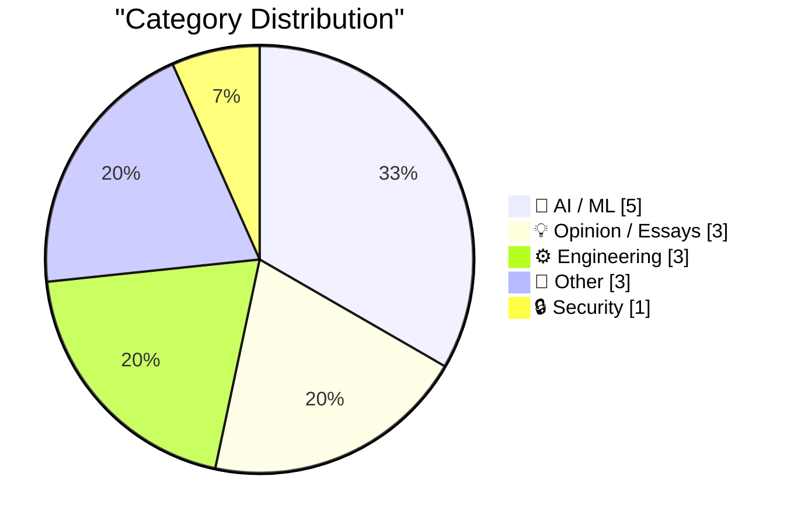
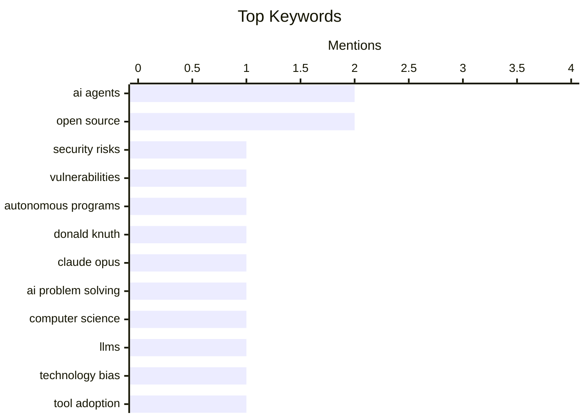

## Today's Highlights
Artificial intelligence continues to reshape the tech world, demonstrating remarkable problem-solving prowess while simultaneously sparking critical debates. The rise of AI coding agents, for instance, is challenging traditional notions of open source licensing and ethical software reimplementations. Concurrently, these powerful AI assistants are introducing significant new security vulnerabilities, forcing a reevaluation of cybersecurity strategies. This rapid technological advancement underscores a growing sense of caution and a call for deeper scrutiny into AI's far-reaching implications.
---
## Must Read Today
1. **How AI Assistants are Moving the Security Goalposts**
[How AI Assistants are Moving the Security Goalposts](https://krebsonsecurity.com/2026/03/how-ai-assistants-are-moving-the-security-goalposts/) — krebsonsecurity.com · 14h ago · 🔒 Security
> AI-based assistants or "agents" pose significant new security challenges by blurring traditional boundaries between data/code and trusted insiders/threats. These autonomous programs, with access to user computers, files, and online services, can automate virtually any task, creating new attack vectors. Their growing popularity among developers and IT workers necessitates a rapid shift in organizational security priorities. The core takeaway is that these powerful tools fundamentally alter the threat landscape, requiring a re-evaluation of security paradigms.
💡 **Why read it**: This article is worth reading for understanding the evolving security threats and challenges introduced by autonomous AI agents in enterprise environments.
🏷️ AI agents, security risks, vulnerabilities, autonomous programs
2. **Donald Knuth on Claude Opus Solving a Computer Science Problem**
[Donald Knuth on Claude Opus Solving a Computer Science Problem](https://www-cs-faculty.stanford.edu/~knuth/papers/claude-cycles.pdf) — daringfireball.net · 20h ago · 🤖 AI / ML
> Donald Knuth, a renowned computer scientist, expresses shock and joy that Anthropic's Claude Opus 4.6, released three weeks prior, solved an open problem he had been working on for several weeks. This event significantly revised his opinions on "generative AI," highlighting its unexpected problem-solving capabilities. The model's success demonstrates a dramatic advance in AI's ability to tackle complex, previously unsolved computer science conjectures. Knuth's experience underscores the rapid progress of AI and its potential to contribute to fundamental research.
💡 **Why read it**: This article is worth reading to witness a legendary computer scientist's personal account of an AI model, Claude Opus 4.6, solving a complex, previously open computer science problem.
🏷️ Donald Knuth, Claude Opus, AI problem solving, computer science
3. **Perhaps not Boring Technology after all**
[Perhaps not Boring Technology after all](https://simonwillison.net/2026/Mar/9/not-so-boring/#atom-everything) — simonwillison.net · 29m ago · 🤖 AI / ML
> A common concern regarding LLMs for programming is their potential to bias technology choices towards tools well-represented in training data, hindering the adoption of new, better alternatives. While this was evident a couple of years ago with Python or JavaScript outperforming less-used languages, recent advancements suggest a shift. Modern models, like those discussed in "Novice to Ninja," are becoming more adept at handling a wider range of technologies, including less common ones. This indicates that LLMs might not exclusively favor "boring" or widely documented technologies, potentially fostering innovation rather than stifling it.
💡 **Why read it**: This article is worth reading for its insightful perspective on how advanced LLMs might overcome the bias towards popular technologies, potentially encouraging innovation rather than stifling it.
🏷️ LLMs, technology bias, tool adoption, training data
---
## Data Overview
| Sources Scanned | Articles Fetched | Time Window | Selected |
|:---:|:---:|:---:|:---:|
| 78/92 | 2367 -> 16 | 24h | **15** |
### Category Distribution

### Top Keywords

<details>
<summary>Plain Text Keyword Chart (Terminal Friendly)</summary>
```
ai agents           │ ████████████████████ 2
open source         │ ████████████████████ 2
security risks      │ ██████████░░░░░░░░░░ 1
vulnerabilities     │ ██████████░░░░░░░░░░ 1
autonomous programs │ ██████████░░░░░░░░░░ 1
donald knuth        │ ██████████░░░░░░░░░░ 1
claude opus         │ ██████████░░░░░░░░░░ 1
ai problem solving  │ ██████████░░░░░░░░░░ 1
computer science    │ ██████████░░░░░░░░░░ 1
llms                │ ██████████░░░░░░░░░░ 1
```
</details>
### Topic Tags
**ai agents**(2) · **open source**(2) · **security risks**(1) · vulnerabilities(1) · autonomous programs(1) · donald knuth(1) · claude opus(1) · ai problem solving(1) · computer science(1) · llms(1) · technology bias(1) · tool adoption(1) · training data(1) · relicensing(1) · legal issues(1) · ai reimplementations(1) · software development(1) · gnu(1) · ai ethics(1) · commercial ai(1)
---
## AI / ML
### 1. Donald Knuth on Claude Opus Solving a Computer Science Problem
[Donald Knuth on Claude Opus Solving a Computer Science Problem](https://www-cs-faculty.stanford.edu/~knuth/papers/claude-cycles.pdf) — **daringfireball.net** · 20h ago · ⭐ 28/30
> Donald Knuth, a renowned computer scientist, expresses shock and joy that Anthropic's Claude Opus 4.6, released three weeks prior, solved an open problem he had been working on for several weeks. This event significantly revised his opinions on "generative AI," highlighting its unexpected problem-solving capabilities. The model's success demonstrates a dramatic advance in AI's ability to tackle complex, previously unsolved computer science conjectures. Knuth's experience underscores the rapid progress of AI and its potential to contribute to fundamental research.
🏷️ Donald Knuth, Claude Opus, AI problem solving, computer science
---
### 2. Perhaps not Boring Technology after all
[Perhaps not Boring Technology after all](https://simonwillison.net/2026/Mar/9/not-so-boring/#atom-everything) — **simonwillison.net** · 29m ago · ⭐ 26/30
> A common concern regarding LLMs for programming is their potential to bias technology choices towards tools well-represented in training data, hindering the adoption of new, better alternatives. While this was evident a couple of years ago with Python or JavaScript outperforming less-used languages, recent advancements suggest a shift. Modern models, like those discussed in "Novice to Ninja," are becoming more adept at handling a wider range of technologies, including less common ones. This indicates that LLMs might not exclusively favor "boring" or widely documented technologies, potentially fostering innovation rather than stifling it.
🏷️ LLMs, technology bias, tool adoption, training data
---
### 3. Can Coding Agents Relicense Open Source Through a ‘Clean Room’ Implementation of Code?
[Can Coding Agents Relicense Open Source Through a ‘Clean Room’ Implementation of Code?](https://simonwillison.net/2026/Mar/5/chardet/) — **daringfireball.net** · 20h ago · ⭐ 26/30
> The article discusses the ethical and legal complexities surrounding AI coding agents potentially relicensing open-source code through "clean room" implementations, exemplified by the `chardet` Python library. `chardet`, originally LGPL-licensed since 2006, recently released version 7.0.0 under the MIT license, claiming a "clean room" rewrite. This raises significant questions about whether AI-generated code, even if not directly copied, can circumvent original license terms if it replicates functionality. The core issue is whether AI-assisted rewrites constitute a truly independent creation or a derivative work, impacting open-source licensing integrity.
🏷️ AI agents, open source, relicensing, legal issues
---
### 4. GNU and the AI reimplementations
[GNU and the AI reimplementations](http://antirez.com/news/162) — **antirez.com** · 21h ago · ⭐ 26/30
> The article draws a parallel between current protests against AI-driven software reimplementations and the GNU project's efforts in the 1980s and 90s to rewrite proprietary Unix components. Many people protesting AI reimplementations today were involved in or witnessed the GNU movement, which aimed to create free software alternatives by reimplementing existing functionalities. This historical context suggests that the concept of reimplementing software, even if controversial, is not new and has been a fundamental part of the free software movement. The author implies that the current debate around AI reimplementations echoes past discussions about software freedom and ownership.
🏷️ AI reimplementations, open source, software development, GNU
---
### 5. There are no heroes in commercial AI
[There are no heroes in commercial AI](https://garymarcus.substack.com/p/there-are-no-heroes-in-commercial) — **garymarcus.substack.com** · 17h ago · ⭐ 26/30
> The article argues that there are no true "heroes" in commercial AI, asserting that figures like Dario Amodei (Anthropic) and Sam Altman (OpenAI) are fundamentally similar despite perceived differences. It critiques the narrative that some commercial AI leaders are more ethical or safety-conscious than others. The core argument is that the pursuit of commercial success and power within the AI industry inherently compromises any claims of moral superiority. Ultimately, the piece suggests that the commercial AI landscape is driven by similar motivations across its major players, regardless of their public personas.
🏷️ AI ethics, Commercial AI, Sam Altman, Dario Amodei
---
## Opinion / Essays
### 6. The Noble Path
[The Noble Path](https://www.joanwestenberg.com/the-noble-path/) — **joanwestenberg.com** · 14h ago · ⭐ 23/30
> The article observes a pervasive trend where every tool, script, or hack, no matter how small or personal, is now being pushed towards becoming a startup or a SaaS product. This phenomenon reflects a broader cultural shift where the "indie hacker" ethos often leads to the immediate commercialization of any useful creation. The author laments the pressure to monetize every piece of software, transforming simple solutions into business ventures. The core takeaway is that the drive for entrepreneurship is turning every technical creation into a potential product, often at the expense of its original, simpler purpose.
🏷️ Indie hacker, SaaS, Startups, Productization
---
### 7. Why Am I Paranoid, You Say?
[Why Am I Paranoid, You Say?](https://idiallo.com/blog/why-am-i-paranoid?src=feed) — **idiallo.com** · 2h ago · ⭐ 20/30
> The author expresses a deep-seated paranoia regarding modern technology, despite acknowledging its incredible advancements like realistic video game graphics and instant global communication. This paranoia manifests in actions like consistently declining terms of service on devices, which puzzles their family. The core problem is the pervasive data collection and lack of control users have over their personal information and digital experiences. The article implies that the convenience and features of modern tech come at the cost of privacy and autonomy, justifying a cautious approach.
🏷️ privacy, paranoia, technology impact, data collection
---
### 8. Quoting Joseph Weizenbaum
[Quoting Joseph Weizenbaum](https://simonwillison.net/2026/Mar/8/joseph-weizenbaum/#atom-everything) — **simonwillison.net** · 23h ago · ⭐ 15/30
> Quoting Joseph Weizenbaum
🏷️ Weizenbaum, AI psychology, delusion
---
## Engineering
### 9. How much certainty is worthwhile?
[How much certainty is worthwhile?](https://www.johndcook.com/blog/2026/03/08/how-much-certainty-is-worthwhile/) — **johndcook.com** · 19h ago · ⭐ 17/30
> The article discusses the iterative process of achieving accuracy in technical work, specifically referencing a composition table for trigonometric and inverse trigonometric functions. The author initially published a version with errors, which were subsequently corrected, and then extended the work to hyperbolic counterparts. This illustrates that initial imperfections are common, and the pursuit of "certainty" or complete accuracy is an ongoing process of refinement and correction. The core takeaway is that while striving for accuracy is important, recognizing and correcting errors is a natural and necessary part of technical development.
🏷️ Mathematics, Certainty, Error correction
---
### 10. IBM PC/XT Model 5160
[IBM PC/XT Model 5160](https://dfarq.homeip.net/ibm-pc-xt-model-5160/?utm_source=rss&#038;utm_medium=rss&#038;utm_campaign=ibm-pc-xt-model-5160) — **dfarq.homeip.net** · 3h ago · ⭐ 17/30
> On March 8, 1983, IBM released the PC/XT (Model 5160), an "eXtended Technology" follow-up to its successful IBM PC. This new model offered significantly greater expandability compared to its predecessor. Key features included a standard 10MB hard drive, a first for IBM PCs, and eight expansion slots, increasing from the original PC's five. The PC/XT also came with 128KB of RAM, expandable to 640KB, and ran on an Intel 8088 processor at 4.77 MHz. Its introduction marked a significant step in personal computing, providing more storage and customization options for users.
🏷️ IBM PC/XT, Computer history, Hardware
---
### 11. Vibe Coding Trip Report: Making a sponsor panel
[Vibe Coding Trip Report: Making a sponsor panel](https://xeiaso.net/blog/2026/vibe-coding-sponsor-panel/) — **xeiaso.net** · 14h ago · ⭐ 16/30
> Vibe Coding Trip Report: Making a sponsor panel
🏷️ vibe coding, personal project, development workflow
---
## Other
### 12. Book Review: There Is No Antimemetics Division by qntm ★★★★★
[Book Review: There Is No Antimemetics Division by qntm ★★★★★](https://shkspr.mobi/blog/2026/03/book-review-there-is-no-antimemetics-division-by-qntm/) — **shkspr.mobi** · 1h ago · ⭐ 9/30
> Book Review: There Is No Antimemetics Division by qntm ★★★★★
🏷️ book review, science fiction, antimemetics
---
### 13. Two of My Favorite Things Together at Last: Pies and Subdomains
[Two of My Favorite Things Together at Last: Pies and Subdomains](https://blog.jim-nielsen.com/2026/pies-and-subdomains/) — **blog.jim-nielsen.com** · 19h ago · ⭐ 9/30
> Two of My Favorite Things Together at Last: Pies and Subdomains
🏷️ Pies, Baking, Personal, Subdomains
---
### 14. Steve Lemay Hits Apple’s Leadership Page
[Steve Lemay Hits Apple’s Leadership Page](https://www.apple.com/leadership/steve-lemay/) — **daringfireball.net** · 22h ago · ⭐ 8/30
> Steve Lemay Hits Apple’s Leadership Page
🏷️ Apple, leadership, corporate news
---
## Security
### 15. How AI Assistants are Moving the Security Goalposts
[How AI Assistants are Moving the Security Goalposts](https://krebsonsecurity.com/2026/03/how-ai-assistants-are-moving-the-security-goalposts/) — **krebsonsecurity.com** · 14h ago · ⭐ 29/30
> AI-based assistants or "agents" pose significant new security challenges by blurring traditional boundaries between data/code and trusted insiders/threats. These autonomous programs, with access to user computers, files, and online services, can automate virtually any task, creating new attack vectors. Their growing popularity among developers and IT workers necessitates a rapid shift in organizational security priorities. The core takeaway is that these powerful tools fundamentally alter the threat landscape, requiring a re-evaluation of security paradigms.
🏷️ AI agents, security risks, vulnerabilities, autonomous programs
---
*Generated at 2026-03-09 14:07 | Scanned 78 sources -> 2367 articles -> selected 15*
*Based on the [Hacker News Popularity Contest 2025](https://refactoringenglish.com/tools/hn-popularity/) RSS source list recommended by [Andrej Karpathy](https://x.com/karpathy)*
*Produced by Dongdianr AI. Follow the same-name WeChat public account for more AI practical tips 💡*
