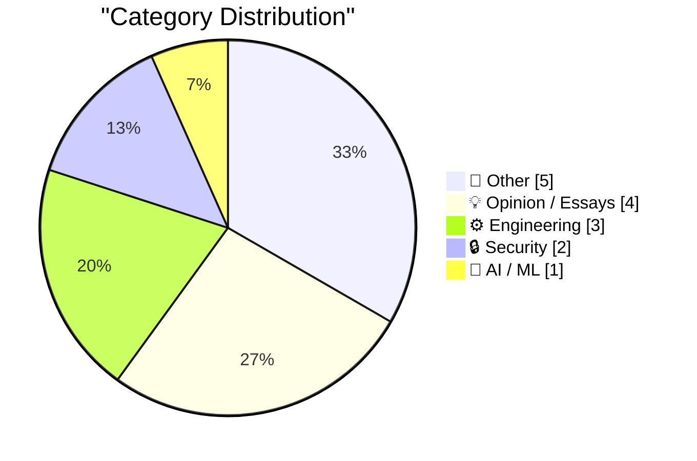
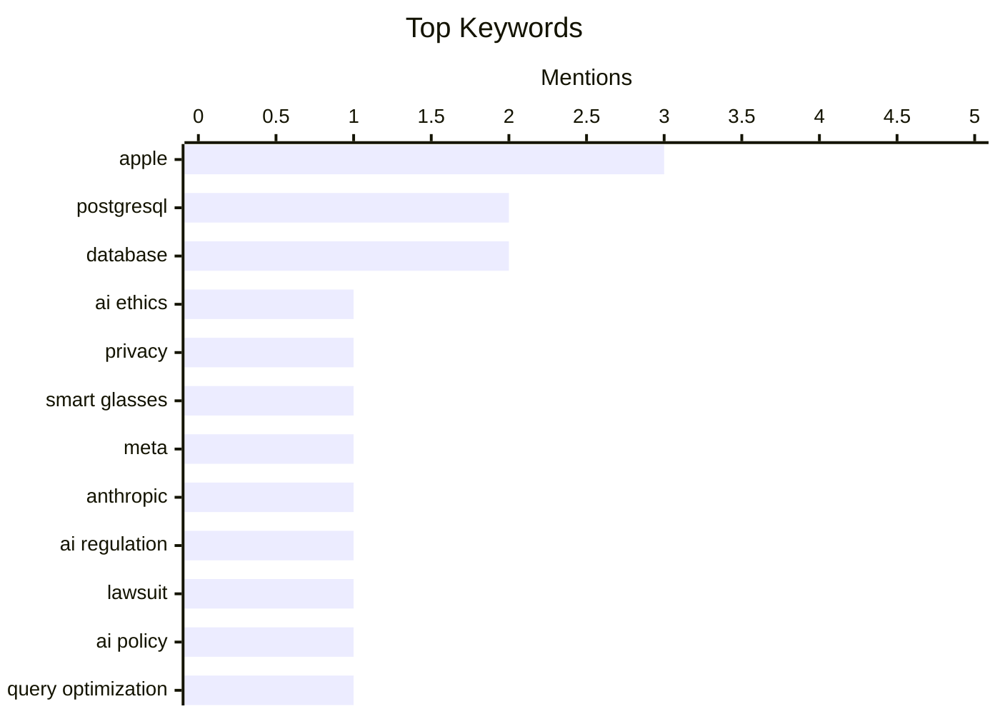

## Today's Highlights
Today's tech landscape is dominated by the rapid expansion of AI, which brings both powerful automation for unstructured data and urgent ethical questions regarding privacy and government regulation. This surge in AI development is juxtaposed with a strong emphasis on foundational engineering best practices, focusing on efficient data management and streamlined development workflows. From optimizing database queries to advocating for simpler solutions, the industry navigates both cutting-edge innovation and practical operational excellence.
---
## Must Read Today
1. **Low-Wage Contractors in Kenya See What Users See While Using Meta’s AI Smart Glasses**
[Low-Wage Contractors in Kenya See What Users See While Using Meta’s AI Smart Glasses](https://www.svd.se/a/K8nrV4/metas-ai-smart-glasses-and-data-privacy-concerns-workers-say-we-see-everything) — daringfireball.net · 23h ago · 🔒 Security
> Low-Wage Contractors in Kenya See What Users See While Using Meta’s AI Smart Glasses
🏷️ AI ethics, privacy, smart glasses, Meta
2. **Anthropic sues US government, with good reason**
[Anthropic sues US government, with good reason](https://garymarcus.substack.com/p/anthropic-sues-us-government-with) — garymarcus.substack.com · 21h ago · 🤖 AI / ML
> Anthropic sues US government, with good reason
🏷️ Anthropic, AI regulation, lawsuit, AI policy
3. **Production query plans without production data**
[Production query plans without production data](https://simonwillison.net/2026/Mar/9/production-query-plans-without-production-data/#atom-everything) — simonwillison.net · 23h ago · ⚙️ Engineering
> Production query plans without production data
🏷️ PostgreSQL, query optimization, database, performance
---
## Data Overview
| Sources Scanned | Articles Fetched | Time Window | Selected |
|:---:|:---:|:---:|:---:|
| 78/92 | 2369 -> 15 | 24h | **15** |
### Category Distribution

### Top Keywords

<details>
<summary>Plain Text Keyword Chart (Terminal Friendly)</summary>
```
apple         │ ████████████████████ 3
postgresql    │ █████████████░░░░░░░ 2
database      │ █████████████░░░░░░░ 2
ai ethics     │ ███████░░░░░░░░░░░░░ 1
privacy       │ ███████░░░░░░░░░░░░░ 1
smart glasses │ ███████░░░░░░░░░░░░░ 1
meta          │ ███████░░░░░░░░░░░░░ 1
anthropic     │ ███████░░░░░░░░░░░░░ 1
ai regulation │ ███████░░░░░░░░░░░░░ 1
lawsuit       │ ███████░░░░░░░░░░░░░ 1
```
</details>
### Topic Tags
**apple**(3) · **postgresql**(2) · **database**(2) · ai ethics(1) · privacy(1) · smart glasses(1) · meta(1) · anthropic(1) · ai regulation(1) · lawsuit(1) · ai policy(1) · query optimization(1) · performance(1) · data breaches(1) · hibp(1) · security(1) · cybercrime(1) · deployment(1) · system design(1) · tech policy(1)
---
## Other
### 1. ★ The iPhone 17e
[★ The iPhone 17e](https://daringfireball.net/2026/03/the_iphone_17e) — **daringfireball.net** · 16h ago · ⭐ 15/30
> ★ The iPhone 17e
🏷️ iPhone, Apple, consumer tech, speculation
---
### 2. [Sponsor] Finalist
[[Sponsor] Finalist](https://www.finalist.works/finalist-36/) — **daringfireball.net** · 15h ago · ⭐ 14/30
> The article introduces Finalist, an iOS/macOS day planner designed to consolidate calendars, reminders, and health data to prevent tasks from being overlooked. The latest version adds key features such as subtasks, calendar bookmarks, HealthKit integration into the journal, and a Lock Screen-triggerable spoken daily briefing. It aims to complement existing productivity setups by filling functional gaps. Finalist offers a comprehensive, integrated solution for daily planning and data management on Apple platforms, available with a free trial and lifetime license.
🏷️ iOS app, macOS app, productivity, planner
---
### 3. Trig composition table
[Trig composition table](https://www.johndcook.com/blog/2026/03/09/trig-composition-table/) — **johndcook.com** · 15h ago · ⭐ 14/30
> This post references a trigonometric composition table, detailing the structure and potential expansion of such a mathematical tool. It notes that a larger 6x6 table could be created by incorporating secant, cosecant, cotangent, and their inverses, as demonstrated by Baker. A key observation is that rows 4, 5, and 6 of the table represent the reciprocals of rows 1, 2, and 3. The article serves as a brief but insightful reference to the systematic organization and reciprocal relationships within trigonometric compositions.
🏷️ trigonometry, math, functions, reference
---
### 4. MacBook Neo Wallpapers Now Available for All Macs in MacOS Tahoe
[MacBook Neo Wallpapers Now Available for All Macs in MacOS Tahoe](https://www.macrumors.com/2026/03/09/macos-tahoe-26-4-beta-4-neo-wallpapers/) — **daringfireball.net** · 18h ago · ⭐ 10/30
> This article announces the availability of new 'MacBook Neo' wallpapers for all Macs running macOS Tahoe, specifically in macOS Tahoe 26.4 Beta 4. MacRumors reports these wallpapers feature bubble-style lines with colorful gradients, offered in Mac Purple, Mac Blue, Mac Pink, and Mac Yellow. Notably, the design and colors are arranged to visually spell out the word 'Mac.' The author expresses immediate intent to upgrade to Tahoe to access these new aesthetic features.
🏷️ macOS, wallpapers, Apple, aesthetics
---
### 5. Update to the Ghost theme that powers this site
[Update to the Ghost theme that powers this site](https://matduggan.com/update-to-the-ghost-theme-that-powers-this-site/) — **matduggan.com** · 4h ago · ⭐ 5/30
> The author details recent modifications made to the open-source Ghost theme that powers their website, available on GitLab. Key updates include improved support for image captions, enhancing the presentation of visual content. Additionally, a new Mastodon feature was integrated, allowing posts from the site to be attributed back to the author's Mastodon username. These updates aim to refine content display and improve social media integration for the Ghost platform.
🏷️ Ghost theme, Website update, Mastodon, Open source
---
## Opinion / Essays
### 6. Pluralistic: Billionaires are a danger to themselves and (especially) us (09 Mar 2026)
[Pluralistic: Billionaires are a danger to themselves and (especially) us (09 Mar 2026)](https://pluralistic.net/2026/03/09/autocrats-of-trade-2/) — **pluralistic.net** · 21h ago · ⭐ 22/30
> Pluralistic: Billionaires are a danger to themselves and (especially) us (09 Mar 2026)
🏷️ tech policy, ethics, digital rights, DRM
---
### 7. Unstructured Data and the Joy of having Something Else think for you
[Unstructured Data and the Joy of having Something Else think for you](https://shkspr.mobi/blog/2026/03/unstructured-data-and-the-joy-of-having-something-else-think-for-you/) — **shkspr.mobi** · 1h ago · ⭐ 21/30
> Unstructured Data and the Joy of having Something Else think for you
🏷️ AI usage, ChatGPT, user behavior, LLM
---
### 8. I don’t know what is Apple’s endgame for the Fn/Globe key, and I’m not sure Apple knows either
[I don’t know what is Apple’s endgame for the Fn/Globe key, and I’m not sure Apple knows either](https://aresluna.org/fn) — **aresluna.org** · 21h ago · ⭐ 18/30
> I don’t know what is Apple’s endgame for the Fn/Globe key, and I’m not sure Apple knows either
🏷️ Apple, Fn key, Globe key, UX design
---
### 9. When the dotcom bubble burst
[When the dotcom bubble burst](https://dfarq.homeip.net/when-the-dotcom-bubble-burst/?utm_source=rss&#038;utm_medium=rss&#038;utm_campaign=when-the-dotcom-bubble-burst) — **dfarq.homeip.net** · 3h ago · ⭐ 13/30
> The article discusses the precise timing of the dotcom bubble's peak and subsequent burst, a significant event in economic history. It identifies March 10, 2000, as the day the tech-heavy NASDAQ index reached its zenith at 5,048.62 points. Following this peak, the bubble burst, leading to a substantial decline in stock values. The post emphasizes the importance of pinpointing this exact date as a critical turning point for the dotcom era.
🏷️ Dotcom bubble, NASDAQ, Tech history, Market crash
---
## Engineering
### 10. Production query plans without production data
[Production query plans without production data](https://simonwillison.net/2026/Mar/9/production-query-plans-without-production-data/#atom-everything) — **simonwillison.net** · 23h ago · ⭐ 24/30
> Production query plans without production data
🏷️ PostgreSQL, query optimization, database, performance
---
### 11. Just Use Postgres
[Just Use Postgres](https://nesbitt.io/2026/03/10/just-use-postgres.html) — **nesbitt.io** · 4h ago · ⭐ 23/30
> Just Use Postgres
🏷️ PostgreSQL, deployment, system design, database
---
### 12. Rebasing in Magit
[Rebasing in Magit](https://entropicthoughts.com/rebasing-in-magit) — **entropicthoughts.com** · 15h ago · ⭐ 18/30
> Rebasing in Magit
🏷️ Magit, Git, Rebasing, Emacs
---
## Security
### 13. Low-Wage Contractors in Kenya See What Users See While Using Meta’s AI Smart Glasses
[Low-Wage Contractors in Kenya See What Users See While Using Meta’s AI Smart Glasses](https://www.svd.se/a/K8nrV4/metas-ai-smart-glasses-and-data-privacy-concerns-workers-say-we-see-everything) — **daringfireball.net** · 23h ago · ⭐ 27/30
> Low-Wage Contractors in Kenya See What Users See While Using Meta’s AI Smart Glasses
🏷️ AI ethics, privacy, smart glasses, Meta
---
### 14. Weekly Update 494
[Weekly Update 494](https://www.troyhunt.com/weekly-update-494/) — **troyhunt.com** · 12h ago · ⭐ 24/30
> Weekly Update 494
🏷️ Data breaches, HIBP, Security, Cybercrime
---
## AI / ML
### 15. Anthropic sues US government, with good reason
[Anthropic sues US government, with good reason](https://garymarcus.substack.com/p/anthropic-sues-us-government-with) — **garymarcus.substack.com** · 21h ago · ⭐ 27/30
> Anthropic sues US government, with good reason
🏷️ Anthropic, AI regulation, lawsuit, AI policy
---
*Generated at 2026-03-10 14:07 | Scanned 78 sources -> 2369 articles -> selected 15*
*Based on the [Hacker News Popularity Contest 2025](https://refactoringenglish.com/tools/hn-popularity/) RSS source list recommended by [Andrej Karpathy](https://x.com/karpathy)*
*Produced by Dongdianr AI. Follow the same-name WeChat public account for more AI practical tips 💡*
