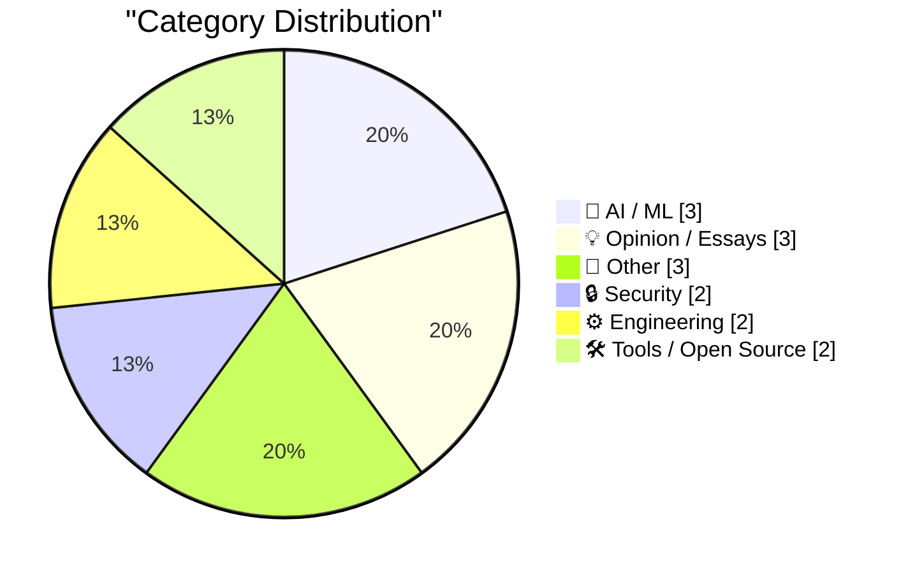
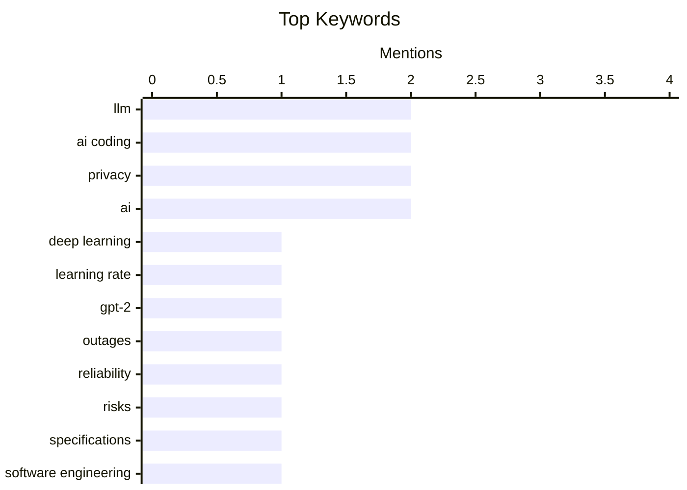

## Today's Highlights
Today's tech news is dominated by the evolving landscape of artificial intelligence, as developers push to optimize LLMs while simultaneously confronting their limitations, such as "hallucinations" and difficulty with nuanced specifications. The practical integration of AI tools is also under scrutiny, with reports of system outages linked to AI-assisted coding raising questions about quality and reliability. Concurrently, security and privacy remain critical, highlighted by extensive vulnerability patching and growing concerns over surveillance advertising and the ethical sourcing of AI training data from smart devices.
---
## Must Read Today
1. **Writing an LLM from scratch, part 32e -- Interventions: the learning rate**
[Writing an LLM from scratch, part 32e -- Interventions: the learning rate](https://www.gilesthomas.com/2026/03/llm-from-scratch-32e-interventions-learning-rate) — gilesthomas.com · 14h ago · 🤖 AI / ML
> This article details an ongoing effort to improve the test loss for a from-scratch GPT-2 small base model, trained on code, by experimenting with learning rate interventions. The author is following Sebastian Raschka's book "Build a Large Language Model (from Scratch)" and focusing on the optimizer's configuration. The current code snippet shows the `AdamW` optimizer being initialized with a learning rate of `0.0001`. The goal is to systematically adjust and analyze the impact of different learning rate strategies on model performance to reduce test loss.
💡 **Why read it**: It provides practical insights into debugging and optimizing LLM training from scratch, specifically focusing on the critical role of the learning rate.
🏷️ LLM, deep learning, learning rate, GPT-2
2. **“A spate of outages, including incidents tied to the use of AI coding tools”, right on schedule**
[“A spate of outages, including incidents tied to the use of AI coding tools”, right on schedule](https://garymarcus.substack.com/p/a-spate-of-outages-including-incidents) — garymarcus.substack.com · 22h ago · 🤖 AI / ML
> This article highlights a recent increase in system outages, specifically noting incidents tied to the use of AI coding tools. Author Gary Marcus suggests these occurrences were predictable, implying concerns about the reliability and potential "high blast radius" of AI-generated code. This brief commentary underscores the anticipated negative consequences of integrating AI into critical software development. It serves as a warning about the inherent risks and potential for widespread failures when relying on AI for code generation.
💡 **Why read it**: It raises timely concerns about the reliability and potential risks associated with the increasing adoption of AI coding tools in production environments.
🏷️ AI coding, outages, reliability, risks
3. **LLMs are bad at vibing specifications**
[LLMs are bad at vibing specifications](https://buttondown.com/hillelwayne/archive/llms-are-bad-at-vibing-specifications/) — buttondown.com/hillelwayne · 20h ago · 💡 Opinion / Essays
> This article revisits the author's previous stance on AI as a "specification force multiplier" for TLA+ users, now arguing that LLMs struggle with "vibing specifications." While LLMs can generate code from precise, formal specifications, they often fail to grasp the implicit intent or "vibe" behind less formal or incomplete requirements. This limitation means LLMs are less effective when specifications lack the explicit detail required for formal methods like TLA+. The core takeaway is that LLMs excel with explicit, structured inputs but falter with ambiguous or unstated requirements.
💡 **Why read it**: It offers a nuanced perspective on LLM capabilities, distinguishing between their ability to handle formal specifications and their limitations with informal or "vibed" requirements.
🏷️ LLM, specifications, software engineering, limitations
---
## Data Overview
| Sources Scanned | Articles Fetched | Time Window | Selected |
|:---:|:---:|:---:|:---:|
| 78/92 | 2369 -> 16 | 24h | **15** |
### Category Distribution

### Top Keywords

<details>
<summary>Plain Text Keyword Chart (Terminal Friendly)</summary>
```
llm           │ ████████████████████ 2
ai coding     │ ████████████████████ 2
privacy       │ ████████████████████ 2
ai            │ ████████████████████ 2
deep learning │ ██████████░░░░░░░░░░ 1
learning rate │ ██████████░░░░░░░░░░ 1
gpt-2         │ ██████████░░░░░░░░░░ 1
outages       │ ██████████░░░░░░░░░░ 1
reliability   │ ██████████░░░░░░░░░░ 1
risks         │ ██████████░░░░░░░░░░ 1
```
</details>
### Topic Tags
**llm**(2) · **ai coding**(2) · **privacy**(2) · ai(2) · deep learning(1) · learning rate(1) · gpt-2(1) · outages(1) · reliability(1) · risks(1) · specifications(1) · software engineering(1) · limitations(1) · microsoft(1) · patch tuesday(1) · vulnerabilities(1) · security updates(1) · ad-tech(1) · surveillance(1) · ethics(1)
---
## AI / ML
### 1. Writing an LLM from scratch, part 32e -- Interventions: the learning rate
[Writing an LLM from scratch, part 32e -- Interventions: the learning rate](https://www.gilesthomas.com/2026/03/llm-from-scratch-32e-interventions-learning-rate) — **gilesthomas.com** · 14h ago · ⭐ 27/30
> This article details an ongoing effort to improve the test loss for a from-scratch GPT-2 small base model, trained on code, by experimenting with learning rate interventions. The author is following Sebastian Raschka's book "Build a Large Language Model (from Scratch)" and focusing on the optimizer's configuration. The current code snippet shows the `AdamW` optimizer being initialized with a learning rate of `0.0001`. The goal is to systematically adjust and analyze the impact of different learning rate strategies on model performance to reduce test loss.
🏷️ LLM, deep learning, learning rate, GPT-2
---
### 2. “A spate of outages, including incidents tied to the use of AI coding tools”, right on schedule
[“A spate of outages, including incidents tied to the use of AI coding tools”, right on schedule](https://garymarcus.substack.com/p/a-spate-of-outages-including-incidents) — **garymarcus.substack.com** · 22h ago · ⭐ 26/30
> This article highlights a recent increase in system outages, specifically noting incidents tied to the use of AI coding tools. Author Gary Marcus suggests these occurrences were predictable, implying concerns about the reliability and potential "high blast radius" of AI-generated code. This brief commentary underscores the anticipated negative consequences of integrating AI into critical software development. It serves as a warning about the inherent risks and potential for widespread failures when relying on AI for code generation.
🏷️ AI coding, outages, reliability, risks
---
### 3. I'm Not Lying, I'm Hallucinating
[I'm Not Lying, I'm Hallucinating](https://idiallo.com/byte-size/im-not-lying-im-hallucinating?src=feed) — **idiallo.com** · 17h ago · ⭐ 24/30
> This article explores Andrej Karpathy's popularization of terms like "vibe coding" and "hallucination" in the context of AI and programming. "Vibe coding" describes programming without deep engagement, while "hallucination," though existing since the 1970s for text summarization failures, has gained new prominence with LLMs. The piece highlights how LLM "hallucinations" represent a failure to accurately reflect source material or generate factually correct information, distinct from intentional deception. Understanding this distinction is crucial for correctly interpreting LLM outputs and their limitations.
🏷️ AI, hallucination, vibe coding, LLMs
---
## Opinion / Essays
### 4. LLMs are bad at vibing specifications
[LLMs are bad at vibing specifications](https://buttondown.com/hillelwayne/archive/llms-are-bad-at-vibing-specifications/) — **buttondown.com/hillelwayne** · 20h ago · ⭐ 26/30
> This article revisits the author's previous stance on AI as a "specification force multiplier" for TLA+ users, now arguing that LLMs struggle with "vibing specifications." While LLMs can generate code from precise, formal specifications, they often fail to grasp the implicit intent or "vibe" behind less formal or incomplete requirements. This limitation means LLMs are less effective when specifications lack the explicit detail required for formal methods like TLA+. The core takeaway is that LLMs excel with explicit, structured inputs but falter with ambiguous or unstated requirements.
🏷️ LLM, specifications, software engineering, limitations
---
### 5. Pluralistic: Ad-tech is fascist tech (10 Mar 2026)
[Pluralistic: Ad-tech is fascist tech (10 Mar 2026)](https://pluralistic.net/2026/03/10/ice-tech/) — **pluralistic.net** · 22h ago · ⭐ 25/30
> This article argues that "ad-tech is fascist tech," asserting that surveillance advertising is fundamentally just surveillance. It critiques the pervasive data collection practices of the advertising technology industry, linking them to broader issues of control and privacy erosion. The piece suggests that the mechanisms used for targeted advertising can be readily repurposed for more oppressive surveillance by governments or corporations. The core takeaway is that the infrastructure built for ad delivery inherently poses significant risks to individual liberty and privacy.
🏷️ ad-tech, surveillance, privacy, ethics
---
### 6. ★ The MacBook Neo
[★ The MacBook Neo](https://daringfireball.net/2026/03/the_macbook_neo) — **daringfireball.net** · 15h ago · ⭐ 17/30
> This article presents a highly speculative and poetic vision for a future Apple product, tentatively named "The MacBook Neo." The author expresses a wish for this hypothetical device to have such a long and impactful lifespan that its futuristic name eventually becomes outdated. It serves as a brief, evocative thought piece rather than a technical analysis. The article does not offer any concrete technical details, design choices, or specific arguments about the device's features or market impact.
🏷️ MacBook, Apple, hardware, speculation
---
## Other
### 7. sinh( arccosh(x) )
[sinh( arccosh(x) )](https://www.johndcook.com/blog/2026/03/10/sinh-arccosh/) — **johndcook.com** · 22h ago · ⭐ 17/30
> This article explores the simplification of complex mathematical expressions involving hyperbolic trigonometric functions applied to their inverse counterparts, specifically focusing on `sinh(arccosh(x))`. The author notes that this topic, part of a broader series, proved more intricate than initially expected, requiring deeper investigation. Mistakes identified in a previous post further emphasized the complexity and the need for careful analysis. The ongoing exploration highlights the nuances involved in correctly simplifying these mathematical forms.
🏷️ mathematics, trigonometry, hyperbolic functions
---
### 8. Amiga 600: The Amiga no one wanted
[Amiga 600: The Amiga no one wanted](https://dfarq.homeip.net/amiga-600-the-amiga-no-one-wanted/?utm_source=rss&#038;utm_medium=rss&#038;utm_campaign=amiga-600-the-amiga-no-one-wanted) — **dfarq.homeip.net** · 3h ago · ⭐ 15/30
> The article discusses the Amiga 600, a late-model computer that was initially unpopular and symbolized the decline of Commodore's product line. During its original release, it was largely unwanted due to perceived shortcomings compared to other Amiga models. However, the Amiga 600 has since gained significant appreciation among modern retro computing enthusiasts. Its small size and unique form factor make it a desirable choice for collectors and hobbyists today.
🏷️ Amiga, retro computing, computer history
---
### 9. Game Review: It Takes Two ★★★★★
[Game Review: It Takes Two ★★★★★](https://shkspr.mobi/blog/2026/03/game-review-it-takes-two/) — **shkspr.mobi** · 1h ago · ⭐ 14/30
> This article is a five-star review of the co-operative video game "It Takes Two," highlighting its unique narrative and engaging gameplay. The game's premise involves a couple on the brink of divorce who are magically transformed into dolls, forcing them to collaborate through a fantastical world to save their marriage. The author, aiming to play more co-op games with their wife, found the experience highly positive. The review praises the game for its innovative approach to co-operative play and its compelling story.
🏷️ game review, It Takes Two, video game
---
## Security
### 10. Microsoft Patch Tuesday, March 2026 Edition
[Microsoft Patch Tuesday, March 2026 Edition](https://krebsonsecurity.com/2026/03/microsoft-patch-tuesday-march-2026-edition/) — **krebsonsecurity.com** · 13h ago · ⭐ 25/30
> Microsoft Corp. today pushed security updates to fix at least 77 vulnerabilities in its Windows operating systems and other software during the March 2026 Patch Tuesday. There are no pressing "zero-day" flaws this month, a contrast to February's five zero-day threats. However, some patches still deserve more rapid attention from organizations using Windows due to their potential impact. The updates address a broad range of issues across Microsoft's product ecosystem, emphasizing ongoing security maintenance.
🏷️ Microsoft, Patch Tuesday, vulnerabilities, security updates
---
### 11. Where did you think the training data was coming from?
[Where did you think the training data was coming from?](https://idiallo.com/blog/where-did-the-training-data-come-from-meta-ai-rayban-glasses?src=feed) — **idiallo.com** · 2h ago · ⭐ 24/30
> This article discusses the privacy implications of Meta's smart glasses, which feed data directly to Facebook servers, and the broader issue of ubiquitous surveillance. The author expresses cynicism, noting that the public's surprise about data collection from AI glasses is misplaced given the constant surveillance by devices like laptop cameras. It highlights the pervasive nature of data collection and the often-overlooked privacy risks associated with everyday technology. The piece urges greater awareness that personal data is constantly being collected by devices we use daily.
🏷️ AI, privacy, data collection, smart glasses
---
## Engineering
### 12. AI should help us produce better code
[AI should help us produce better code](https://simonwillison.net/guides/agentic-engineering-patterns/better-code/#atom-everything) — **simonwillison.net** · 15h ago · ⭐ 24/30
> This article addresses developer concerns that outsourcing code to AI tools might reduce quality, potentially leading to "bad code" churned out quickly. It argues that if adopting coding agents demonstrably lowers the quality of produced code and features, this problem must be directly confronted. The core premise is that AI should be leveraged to produce *better* code, not just faster code, by identifying and addressing specific quality degradation points. The article advocates for an approach where AI tools enhance, rather than compromise, code quality.
🏷️ AI coding, code quality, agentic engineering
---
### 13. The Server Older than my Kids!
[The Server Older than my Kids!](https://idiallo.com/byte-size/my-server-is-older-than-my-kids?src=feed) — **idiallo.com** · 12h ago · ⭐ 19/30
> The author recounts a past incident where their blog's two-server infrastructure, consisting of a PHP engine for logic/DB and another for static files, failed under a traffic surge from Hacker News and Reddit. Despite the popular page having only 17 assets, the main server required constant CPU monitoring and frequent restarts. This experience highlighted the critical need for robust server scalability and traffic management. The challenging event ultimately provided significant learning opportunities regarding web infrastructure resilience.
🏷️ servers, scaling, web hosting, infrastructure
---
## Tools / Open Source
### 14. git-pkgs/actions
[git-pkgs/actions](https://nesbitt.io/2026/03/11/git-pkgs-actions.html) — **nesbitt.io** · 4h ago · ⭐ 22/30
> This article provides instructions on how to integrate `git-pkgs` into GitHub Actions workflows. It details the necessary steps, configuration, and commands to leverage `git-pkgs` functionalities within a CI/CD pipeline. The focus is on practical application, enabling automated package management or deployment processes using `git-pkgs` within the GitHub Actions ecosystem. This integration streamlines development workflows by automating package-related tasks directly within the version control system.
🏷️ GitHub Actions, CI/CD, git-pkgs, workflow
---
### 15. Simplifying expressions in SymPy
[Simplifying expressions in SymPy](https://www.johndcook.com/blog/2026/03/10/simplifying-expressions-in-sympy/) — **johndcook.com** · 21h ago · ⭐ 20/30
> This article explores the simplification of mathematical expressions using SymPy, a Python library, drawing a parallel to a previous post about Mathematica. It aims to demonstrate how SymPy handles complex expressions, such as `Sinh[ArcCosh[x]]`, and verify entries from mathematical tables. The post provides a Python-centric approach to symbolic computation and expression simplification. This is useful for users seeking to perform advanced mathematical operations programmatically.
🏷️ SymPy, Python, symbolic math, library
---
*Generated at 2026-03-11 14:06 | Scanned 78 sources -> 2369 articles -> selected 15*
*Based on the [Hacker News Popularity Contest 2025](https://refactoringenglish.com/tools/hn-popularity/) RSS source list recommended by [Andrej Karpathy](https://x.com/karpathy)*
*Produced by Dongdianr AI. Follow the same-name WeChat public account for more AI practical tips 💡*
