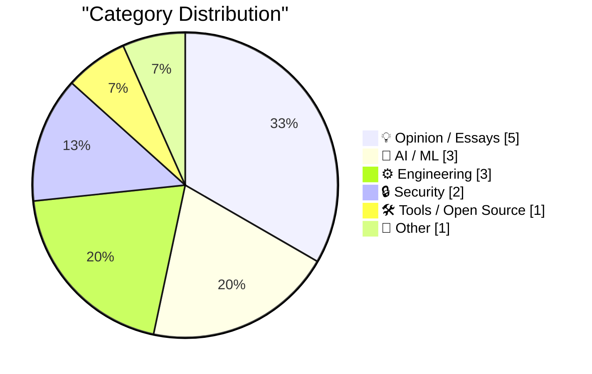
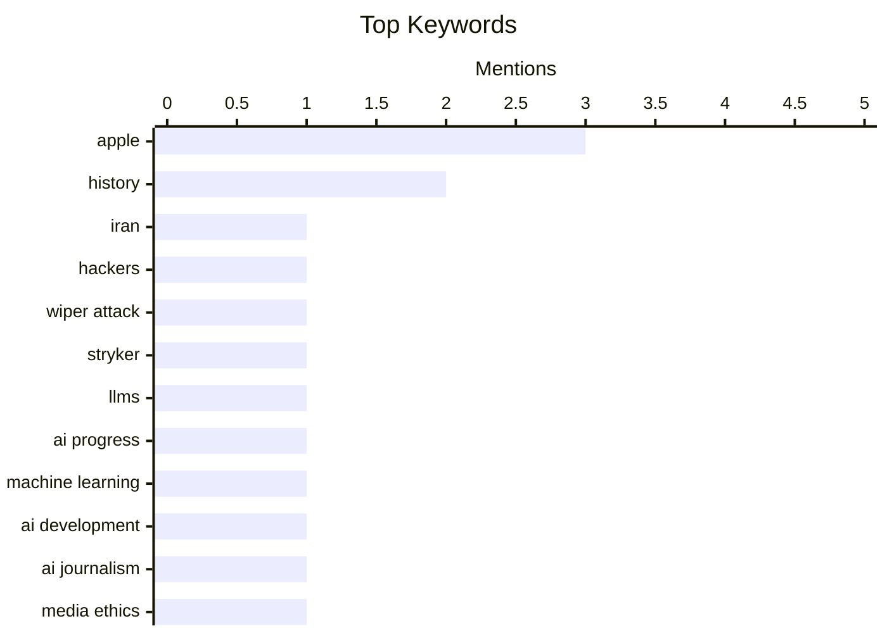

## Today's Highlights
Cybersecurity threats are escalating, with state-backed groups launching destructive wiper attacks and new advisories highlighting software supply chain risks. Simultaneously, the AI industry faces critical questions regarding the actual progress of Large Language Models and the ethical implications of their pervasive use, from automated journalism to content generation. Despite these advanced challenges, a focus on core software engineering practices, like database management and version control, remains crucial for developers.
---
## Must Read Today
1. **Iran-Backed Hackers Claim Wiper Attack on Medtech Firm Stryker**
[Iran-Backed Hackers Claim Wiper Attack on Medtech Firm Stryker](https://krebsonsecurity.com/2026/03/iran-backed-hackers-claim-wiper-attack-on-medtech-firm-stryker/) — krebsonsecurity.com · 21h ago · 🔒 Security
> An Iran-linked hacktivist group is claiming responsibility for a data-wiping attack against Stryker, a global medical technology company based in Michigan. The attack reportedly led to Stryker sending home over 5,000 workers in its largest hub outside the U.S. in Ireland. Additionally, Stryker's main U.S. headquarters reported a "building emergency" via voicemail. This incident highlights the significant operational disruption and security risks posed by state-sponsored or affiliated cyberattacks on critical infrastructure sectors like medtech.
💡 **Why read it**: It provides a timely alert on a claimed state-sponsored cyberattack targeting a major medical technology firm, illustrating the immediate operational impact of such incidents.
🏷️ Iran, hackers, wiper attack, Stryker
2. **Are LLMs not getting better?**
[Are LLMs not getting better?](https://entropicthoughts.com/no-swe-bench-improvement) — entropicthoughts.com · 15h ago · 🤖 AI / ML
> This article questions whether Large Language Models (LLMs) are still demonstrating significant improvement, specifically referencing their performance on the SWE-bench benchmark. The title and URL suggest a finding that LLM progress on this particular benchmark might be stagnating. The discussion likely challenges the perception of continuous rapid advancement in LLM capabilities for complex software engineering tasks. It concludes that LLM improvement, at least on specific technical benchmarks like SWE-bench, may be plateauing.
💡 **Why read it**: It critically examines the current progress of Large Language Models, particularly their performance on the SWE-bench benchmark, which is crucial for understanding their real-world capabilities in software engineering tasks.
🏷️ LLMs, AI Progress, Machine Learning, AI Development
3. **Pluralistic: AI "journalists" prove that media bosses don't give a shit (11 Mar 2026)**
[Pluralistic: AI "journalists" prove that media bosses don't give a shit (11 Mar 2026)](https://pluralistic.net/2026/03/11/modal-dialog-a-palooza/) — pluralistic.net · 18h ago · 🤖 AI / ML
> The article asserts that the deployment of AI "journalists" by media organizations fundamentally demonstrates a disregard by media bosses for journalistic quality and ethics. It critiques the implications of AI-generated content in journalism, suggesting that media companies prioritize cost-cutting over human journalistic integrity. This approach, according to the author, leads to a decline in content standards and undermines the value of human reporting. The author concludes that the use of AI in journalism is a clear indicator of media management's indifference to the craft and its impact on public discourse.
💡 **Why read it**: It offers a sharp critique of the ethical and quality implications of deploying AI in journalism, highlighting concerns about media accountability and the future of human reporting.
🏷️ AI journalism, media ethics, Cory Doctorow, AI impact
---
## Data Overview
| Sources Scanned | Articles Fetched | Time Window | Selected |
|:---:|:---:|:---:|:---:|
| 78/92 | 2369 -> 20 | 24h | **15** |
### Category Distribution

### Top Keywords

<details>
<summary>Plain Text Keyword Chart (Terminal Friendly)</summary>
```
apple            │ ████████████████████ 3
history          │ █████████████░░░░░░░ 2
iran             │ ███████░░░░░░░░░░░░░ 1
hackers          │ ███████░░░░░░░░░░░░░ 1
wiper attack     │ ███████░░░░░░░░░░░░░ 1
stryker          │ ███████░░░░░░░░░░░░░ 1
llms             │ ███████░░░░░░░░░░░░░ 1
ai progress      │ ███████░░░░░░░░░░░░░ 1
machine learning │ ███████░░░░░░░░░░░░░ 1
ai development   │ ███████░░░░░░░░░░░░░ 1
```
</details>
### Topic Tags
**apple**(3) · **history**(2) · **iran**(1) · hackers(1) · wiper attack(1) · stryker(1) · llms(1) · ai progress(1) · machine learning(1) · ai development(1) · ai journalism(1) · media ethics(1) · cory doctorow(1) · ai impact(1) · package managers(1) · security(1) · enisa(1) · cybersecurity(1) · sqlalchemy(1) · python(1)
---
## Opinion / Essays
### 1. The Department of War is making a huge mistake
[The Department of War is making a huge mistake](https://www.dwarkesh.com/p/dow-anthropic) — **dwarkesh.com** · 19h ago · ⭐ 22/30
> The article, prefaced as "the highest stakes negotiations in history," suggests a critical error by the "Department of War," likely referring to a major defense entity. Given the URL's reference to "dow-anthropic," the article likely argues against a specific strategic decision or policy involving AI company Anthropic. The title implies a significant misjudgment with potentially severe consequences for national or global security. It concludes that the Department of War's current approach or decision, possibly concerning its engagement with AI entities, is fundamentally flawed and could lead to detrimental outcomes.
🏷️ Geopolitics, National Security, Strategy, Policy
---
### 2. Quoting John Carmack
[Quoting John Carmack](https://simonwillison.net/2026/Mar/11/john-carmack/#atom-everything) — **simonwillison.net** · 23h ago · ⭐ 21/30
> This article highlights a key quote from John Carmack regarding the common pitfall of over-architecting for future requirements in software development. Carmack's June 2021 tweet states, "It is hard for less experienced developers to appreciate how rarely architecting for future requirements / applications turns out net-positive." This emphasizes the importance of pragmatic, iterative design over speculative future-proofing. The article uses Carmack's insight to advise developers, especially less experienced ones, against excessive upfront design for uncertain future needs, advocating for a more agile and responsive approach.
🏷️ John Carmack, software architecture, future requirements, engineering wisdom
---
### 3. Members Only: We desperately need a Reality Literacy
[Members Only: We desperately need a Reality Literacy](https://www.joanwestenberg.com/we-desperately-need-a-reality-literacy/) — **joanwestenberg.com** · 15h ago · ⭐ 21/30
> Members Only: We desperately need a Reality Literacy
🏷️ Reality Literacy, Misinformation, Critical Thinking, Society
---
### 4. Halide Cofounder Sebastiaan de With Joined Apple’s Design Team in January
[Halide Cofounder Sebastiaan de With Joined Apple’s Design Team in January](https://9to5mac.com/2026/01/28/halide-cofounder-sebastiaan-de-with-joins-apples-design-team/) — **daringfireball.net** · 15h ago · ⭐ 18/30
> Halide Cofounder Sebastiaan de With Joined Apple’s Design Team in January
🏷️ Apple, Halide, design team, Sebastiaan de With
---
### 5. Another One From the Archive: ‘Web Kit’ vs. ‘WebKit’
[Another One From the Archive: ‘Web Kit’ vs. ‘WebKit’](https://daringfireball.net/2006/05/web_kit_vs_webkit) — **daringfireball.net** · 13h ago · ⭐ 17/30
> Another One From the Archive: ‘Web Kit’ vs. ‘WebKit’
🏷️ WebKit, Apple, openness, history
---
## AI / ML
### 6. Are LLMs not getting better?
[Are LLMs not getting better?](https://entropicthoughts.com/no-swe-bench-improvement) — **entropicthoughts.com** · 15h ago · ⭐ 29/30
> This article questions whether Large Language Models (LLMs) are still demonstrating significant improvement, specifically referencing their performance on the SWE-bench benchmark. The title and URL suggest a finding that LLM progress on this particular benchmark might be stagnating. The discussion likely challenges the perception of continuous rapid advancement in LLM capabilities for complex software engineering tasks. It concludes that LLM improvement, at least on specific technical benchmarks like SWE-bench, may be plateauing.
🏷️ LLMs, AI Progress, Machine Learning, AI Development
---
### 7. Pluralistic: AI "journalists" prove that media bosses don't give a shit (11 Mar 2026)
[Pluralistic: AI "journalists" prove that media bosses don't give a shit (11 Mar 2026)](https://pluralistic.net/2026/03/11/modal-dialog-a-palooza/) — **pluralistic.net** · 18h ago · ⭐ 27/30
> The article asserts that the deployment of AI "journalists" by media organizations fundamentally demonstrates a disregard by media bosses for journalistic quality and ethics. It critiques the implications of AI-generated content in journalism, suggesting that media companies prioritize cost-cutting over human journalistic integrity. This approach, according to the author, leads to a decline in content standards and undermines the value of human reporting. The author concludes that the use of AI in journalism is a clear indicator of media management's indifference to the craft and its impact on public discourse.
🏷️ AI journalism, media ethics, Cory Doctorow, AI impact
---
### 8. How much of HN is AI?
[How much of HN is AI?](https://lcamtuf.substack.com/p/how-much-of-hn-is-ai) — **lcamtuf.substack.com** · 12h ago · ⭐ 25/30
> The author investigates the prevalence of AI-generated content or AI users on Hacker News (HN), a significant aggregator of geek news. The author describes a "complicated relationship" with HN, acknowledging its importance for traffic while noting its "toxic commenters," which might motivate the inquiry into AI's presence. This investigation aims to quantify or qualitatively assess the extent to which AI influences discussions and content on Hacker News. The article seeks to shed light on potential manipulation or changes in the community's dynamics due to AI.
🏷️ Hacker News, AI, Content Analysis, Tech Trends
---
## Engineering
### 9. Introduction to SQLAlchemy 2 In Practice
[Introduction to SQLAlchemy 2 In Practice](https://blog.miguelgrinberg.com/post/introduction-to-sqlalchemy-2-in-practice) — **miguelgrinberg.com** · 4h ago · ⭐ 26/30
> This article serves as an introduction to SQLAlchemy version 2, which remains the current version of Python's most popular database library and Object-Relational Mapper (ORM). It is based on the author's 2023 book, "SQLAlchemy 2 In Practice," offering an in-depth look at the library. Following a tradition, the author is publishing the book's content for free on his blog. This post provides an accessible entry point to understanding and utilizing SQLAlchemy 2, offering practical insights for Python developers working with databases.
🏷️ SQLAlchemy, Python, ORM, Database
---
### 10. Sorting algorithms
[Sorting algorithms](https://simonwillison.net/2026/Mar/11/sorting-algorithms/#atom-everything) — **simonwillison.net** · 15h ago · ⭐ 23/30
> This article presents animated explanations of various sorting algorithms, which were built using Claude Artifacts. The author created these demonstrations on a phone, including Python's Timsort algorithm, and added a feature to run all animations concurrently. The full sequence of prompts used with Claude for generating these explanations is also provided. This resource offers an interactive and visual method for learning and comparing different sorting algorithms, leveraging AI tools for content generation.
🏷️ sorting algorithms, Claude Artifacts, animation, computer science
---
### 11. The 1989 proposal that led to the World Wide Web
[The 1989 proposal that led to the World Wide Web](https://dfarq.homeip.net/the-1989-proposal-that-led-to-the-world-wide-web/?utm_source=rss&#038;utm_medium=rss&#038;utm_campaign=the-1989-proposal-that-led-to-the-world-wide-web) — **dfarq.homeip.net** · 3h ago · ⭐ 21/30
> The 1989 proposal that led to the World Wide Web
🏷️ World Wide Web, Tim Berners-Lee, CERN, History
---
## Security
### 12. Iran-Backed Hackers Claim Wiper Attack on Medtech Firm Stryker
[Iran-Backed Hackers Claim Wiper Attack on Medtech Firm Stryker](https://krebsonsecurity.com/2026/03/iran-backed-hackers-claim-wiper-attack-on-medtech-firm-stryker/) — **krebsonsecurity.com** · 21h ago · ⭐ 29/30
> An Iran-linked hacktivist group is claiming responsibility for a data-wiping attack against Stryker, a global medical technology company based in Michigan. The attack reportedly led to Stryker sending home over 5,000 workers in its largest hub outside the U.S. in Ireland. Additionally, Stryker's main U.S. headquarters reported a "building emergency" via voicemail. This incident highlights the significant operational disruption and security risks posed by state-sponsored or affiliated cyberattacks on critical infrastructure sectors like medtech.
🏷️ Iran, hackers, wiper attack, Stryker
---
### 13. Reviewing ENISA’s Package Manager Advisory
[Reviewing ENISA’s Package Manager Advisory](https://nesbitt.io/2026/03/12/reviewing-enisas-package-manager-advisory.html) — **nesbitt.io** · 4h ago · ⭐ 26/30
> This article reviews and provides notes on the European Union Agency for Cybersecurity (ENISA)'s Technical Advisory for Secure Use of Package Managers. It likely dissects ENISA's recommendations for enhancing the security of software package managers, evaluating their practical applicability and comprehensiveness. The review aims to distill key takeaways and implications for development and deployment practices. The article helps readers understand best practices for securing their software supply chain through robust package manager use.
🏷️ Package Managers, Security, ENISA, Cybersecurity
---
## Tools / Open Source
### 14. Git Checkout, Reset and Restore
[Git Checkout, Reset and Restore](https://susam.net/git-checkout-reset-restore.html) — **susam.net** · 14h ago · ⭐ 24/30
> This article clarifies the usage of `git checkout`, `git reset`, and the newer `git restore` commands for managing the working tree and index in Git. The author notes that `git restore` has been available since Git 2.23 (released in 2019) but is often overlooked. The post maps older command usages to the new `git restore` command, providing a practical reference for modern Git workflows. It serves as a guide to understanding the distinctions and appropriate applications of these Git commands, particularly for users adopting `git restore`.
🏷️ Git, Version Control, git restore, Commands
---
## Other
### 15. Apple Has Changed Several Key Cap Labels From Words to Glyphs on Its Latest MacBook Keyboards
[Apple Has Changed Several Key Cap Labels From Words to Glyphs on Its Latest MacBook Keyboards](https://x.com/ClassicII_MrMac/status/2028869838870069447) — **daringfireball.net** · 15h ago · ⭐ 17/30
> Apple Has Changed Several Key Cap Labels From Words to Glyphs on Its Latest MacBook Keyboards
🏷️ Apple, MacBook, keyboard design, glyphs
---
*Generated at 2026-03-12 14:07 | Scanned 78 sources -> 2369 articles -> selected 15*
*Based on the [Hacker News Popularity Contest 2025](https://refactoringenglish.com/tools/hn-popularity/) RSS source list recommended by [Andrej Karpathy](https://x.com/karpathy)*
*Produced by Dongdianr AI. Follow the same-name WeChat public account for more AI practical tips 💡*
