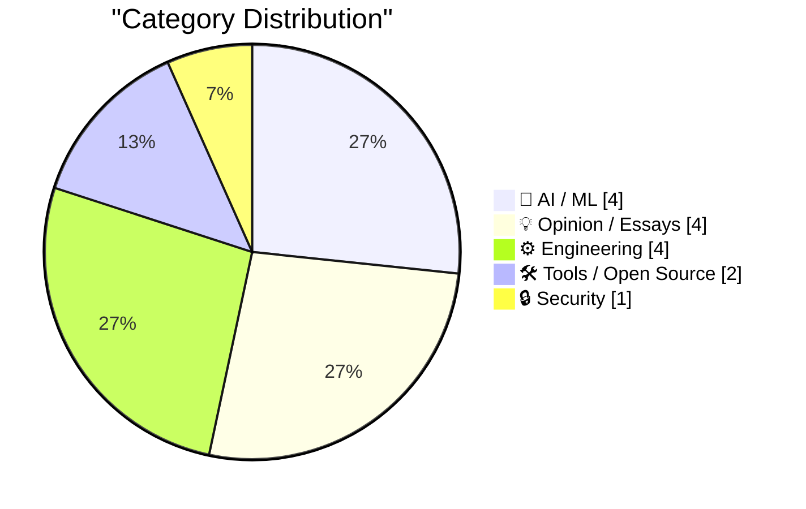
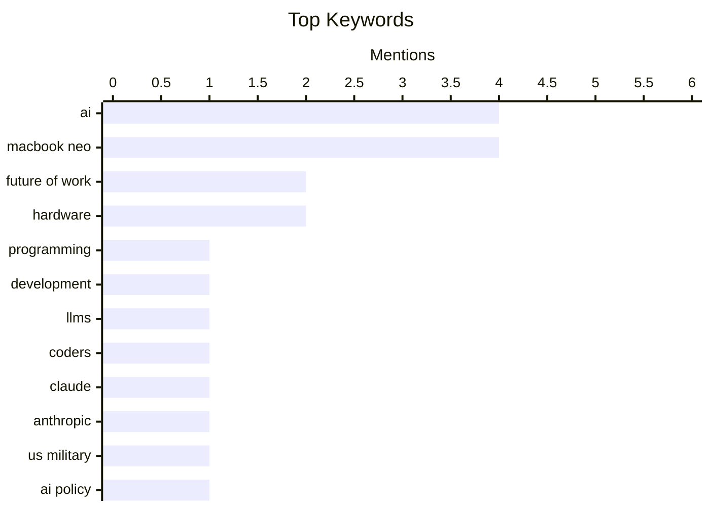

## Today's Highlights
AI is rapidly reshaping the software development landscape, prompting a re-evaluation of the programmer's role and exposing underlying inefficiencies in current coding practices. This transformation is paralleled by significant advancements in hardware-software integration, from enhanced device repairability and new security indicators to software gaining awareness of its physical environment. Amidst these changes, the broader implications of AI are drawing critical attention, with discussions surfacing around its potential security risks and societal "psychoses." The tech world is navigating a dynamic era driven by both advanced automation and foundational engineering excellence.
---
## Must Read Today
1. **Coding After Coders: The End of Computer Programming as We Know It**
[Coding After Coders: The End of Computer Programming as We Know It](https://simonwillison.net/2026/Mar/12/coding-after-coders/#atom-everything) — simonwillison.net · 18h ago · 🤖 AI / ML
> This article discusses the profound impact of AI-assisted development on the future of computer programming, suggesting a fundamental shift in the field. It is an extensive piece by Clive Thompson for the New York Times Magazine, based on interviews with over 70 software developers from major companies like Google, Amazon, Microsoft, and Apple, alongside other industry figures. The piece explores how AI is reshaping the role and nature of coding, moving beyond traditional paradigms. The article concludes that AI is ushering in a significant paradigm shift in the software development landscape.
💡 **Why read it**: It offers a comprehensive, expert-backed perspective on how AI is fundamentally changing the field of software development, drawing on extensive industry interviews.
🏷️ AI, programming, future of work, development
2. **What do coders do after AI?**
[What do coders do after AI?](https://anildash.com/2026/03/13/coders-after-ai/) — anildash.com · 14h ago · 🤖 AI / ML
> This article addresses the pressing question of the role of coders in an era of rapidly advancing AI, particularly Large Language Models (LLMs). Anil Dash discusses how LLMs are evolving into "entire software factories," drastically altering the economics and power dynamics of software creation. This shift has already led to the displacement of a significant number of tech workers, as LLMs automate more aspects of coding. The piece highlights the urgent need to understand the new landscape for software developers as AI continues its rapid evolution.
💡 **Why read it**: It provides a critical perspective on the economic and power shifts in software creation driven by LLMs and their impact on tech workers.
🏷️ AI, LLMs, Coders, Future of Work
3. **Is the US military actually afraid of Claude? A new theory of why Anthropic was labeled a supply chain risk.**
[Is the US military actually afraid of Claude? A new theory of why Anthropic was labeled a supply chain risk.](https://garymarcus.substack.com/p/is-the-us-military-actually-afraid) — garymarcus.substack.com · 17h ago · 🤖 AI / ML
> The article investigates the perplexing decision by the Pentagon to label Anthropic, developers of the Claude AI, as a supply chain risk. It aims to unpack and theorize the underlying reasons for this designation, questioning whether the US military's concern is genuinely about the AI's capabilities or other strategic factors. The author proposes a "new theory" to explain this unusual classification. The piece seeks to provide clarity on the strategic implications and potential motivations behind the Pentagon's assessment of a leading AI developer.
💡 **Why read it**: It offers an intriguing analysis of the geopolitical and strategic considerations surrounding advanced AI development and its perception by military entities.
🏷️ Claude, Anthropic, US Military, AI Policy
---
## Data Overview
| Sources Scanned | Articles Fetched | Time Window | Selected |
|:---:|:---:|:---:|:---:|
| 78/92 | 2372 -> 20 | 24h | **15** |
### Category Distribution

### Top Keywords

<details>
<summary>Plain Text Keyword Chart (Terminal Friendly)</summary>
```
ai             │ ████████████████████ 4
macbook neo    │ ████████████████████ 4
future of work │ ██████████░░░░░░░░░░ 2
hardware       │ ██████████░░░░░░░░░░ 2
programming    │ █████░░░░░░░░░░░░░░░ 1
development    │ █████░░░░░░░░░░░░░░░ 1
llms           │ █████░░░░░░░░░░░░░░░ 1
coders         │ █████░░░░░░░░░░░░░░░ 1
claude         │ █████░░░░░░░░░░░░░░░ 1
anthropic      │ █████░░░░░░░░░░░░░░░ 1
```
</details>
### Topic Tags
**ai**(4) · **macbook neo**(4) · **future of work**(2) · hardware(2) · programming(1) · development(1) · llms(1) · coders(1) · claude(1) · anthropic(1) · us military(1) · ai policy(1) · developers(1) · career(1) · industry trends(1) · security(1) · camera(1) · teardown(1) · repairability(1) · modular design(1)
---
## AI / ML
### 1. Coding After Coders: The End of Computer Programming as We Know It
[Coding After Coders: The End of Computer Programming as We Know It](https://simonwillison.net/2026/Mar/12/coding-after-coders/#atom-everything) — **simonwillison.net** · 18h ago · ⭐ 30/30
> This article discusses the profound impact of AI-assisted development on the future of computer programming, suggesting a fundamental shift in the field. It is an extensive piece by Clive Thompson for the New York Times Magazine, based on interviews with over 70 software developers from major companies like Google, Amazon, Microsoft, and Apple, alongside other industry figures. The piece explores how AI is reshaping the role and nature of coding, moving beyond traditional paradigms. The article concludes that AI is ushering in a significant paradigm shift in the software development landscape.
🏷️ AI, programming, future of work, development
---
### 2. What do coders do after AI?
[What do coders do after AI?](https://anildash.com/2026/03/13/coders-after-ai/) — **anildash.com** · 14h ago · ⭐ 29/30
> This article addresses the pressing question of the role of coders in an era of rapidly advancing AI, particularly Large Language Models (LLMs). Anil Dash discusses how LLMs are evolving into "entire software factories," drastically altering the economics and power dynamics of software creation. This shift has already led to the displacement of a significant number of tech workers, as LLMs automate more aspects of coding. The piece highlights the urgent need to understand the new landscape for software developers as AI continues its rapid evolution.
🏷️ AI, LLMs, Coders, Future of Work
---
### 3. Is the US military actually afraid of Claude? A new theory of why Anthropic was labeled a supply chain risk.
[Is the US military actually afraid of Claude? A new theory of why Anthropic was labeled a supply chain risk.](https://garymarcus.substack.com/p/is-the-us-military-actually-afraid) — **garymarcus.substack.com** · 17h ago · ⭐ 27/30
> The article investigates the perplexing decision by the Pentagon to label Anthropic, developers of the Claude AI, as a supply chain risk. It aims to unpack and theorize the underlying reasons for this designation, questioning whether the US military's concern is genuinely about the AI's capabilities or other strategic factors. The author proposes a "new theory" to explain this unusual classification. The piece seeks to provide clarity on the strategic implications and potential motivations behind the Pentagon's assessment of a leading AI developer.
🏷️ Claude, Anthropic, US Military, AI Policy
---
### 4. Pluralistic: Three more AI psychoses (12 Mar 2026)
[Pluralistic: Three more AI psychoses (12 Mar 2026)](https://pluralistic.net/2026/03/12/normal-technology/) — **pluralistic.net** · 11h ago · ⭐ 24/30
> The article discusses "three more AI psychoses," implying a critical examination of common misconceptions or irrational fears surrounding artificial intelligence. While the specific "psychoses" are not detailed in the provided snippet, the context suggests a debunking or critical analysis of exaggerated claims or anxieties related to AI. The author, Cory Doctorow, often focuses on the societal and ethical implications of technology, aiming to provide a grounded perspective. The piece aims to encourage a calmer, more rational understanding of AI amidst hype or fear.
🏷️ AI, Psychoses, Commentary, Trends
---
## Opinion / Essays
### 5. Quoting Les Orchard
[Quoting Les Orchard](https://simonwillison.net/2026/Mar/12/les-orchard/#atom-everything) — **simonwillison.net** · 21h ago · ⭐ 26/30
> The article highlights Les Orchard's observation that AI-assisted coding is exposing a pre-existing, but less visible, divide among developers. Orchard posits that before AI, both "craft-lovers" and "make-it-go people" performed similar daily tasks like writing code by hand, using the same editors, languages, and pull request workflows. AI is now forcing these two camps apart, making their differing motivations and approaches more apparent. AI is acting as a catalyst, revealing and widening a fundamental philosophical split within the developer community regarding the nature of their work.
🏷️ AI, developers, career, industry trends
---
### 6. MALUS - Clean Room as a Service
[MALUS - Clean Room as a Service](https://simonwillison.net/2026/Mar/12/malus/#atom-everything) — **simonwillison.net** · 17h ago · ⭐ 23/30
> MALUS - Clean Room as a Service
🏷️ open source, licensing, satire, IP
---
### 7. Can the MacBook Neo replace my M4 Air?
[Can the MacBook Neo replace my M4 Air?](https://www.jeffgeerling.com/blog/2026/macbook-neo-replace-m4-air/) — **jeffgeerling.com** · 20h ago · ⭐ 22/30
> Can the MacBook Neo replace my M4 Air?
🏷️ MacBook Neo, hardware, Apple, laptop
---
### 8. Microsoft’s 1986 IPO
[Microsoft’s 1986 IPO](https://dfarq.homeip.net/microsofts-1986-ipo/?utm_source=rss&#038;utm_medium=rss&#038;utm_campaign=microsofts-1986-ipo) — **dfarq.homeip.net** · 3h ago · ⭐ 21/30
> Microsoft’s 1986 IPO
🏷️ Microsoft, IPO, Tech History, Financial World
---
## Engineering
### 9. MacBook Neo Teardown
[MacBook Neo Teardown](https://www.youtube.com/watch?v=5k7Lv7f-5CQ) — **daringfireball.net** · 19h ago · ⭐ 25/30
> The article presents a YouTube teardown of the MacBook Neo, revealing its surprising repairability and modular design. Tech Re-Nu's teardown demonstrated a full disassembly in "less than 10 minutes," a remarkable feat for an Apple laptop. The design features no sticky tape or tricky adhesives, uses modular parts, and minimal components, indicating a "super straightforward, elegant design." The article suggests that the Neo's lower cost contributes to its simpler and more repairable construction. The MacBook Neo represents a significant departure for Apple, prioritizing repairability and modularity, making it an exceptionally user-friendly device for maintenance.
🏷️ MacBook Neo, teardown, repairability, modular design
---
### 10. Software Proprioception
[Software Proprioception](https://unsung.aresluna.org/software-proprioception/) — **daringfireball.net** · 22h ago · ⭐ 25/30
> The article introduces the concept of "software proprioception," where software is aware of its hardware's dimensions and features. Marcin Wichary suggests that software can leverage this awareness to create more intuitive user experiences, proposing a "point to, don't describe" rule. This approach, similar to an arrow pointing directly at an element, reduces cognitive effort compared to reading and understanding textual descriptions. Software proprioception enables more direct and efficient user interaction by allowing software to intelligently adapt to and guide users based on its physical environment.
🏷️ software design, UX, hardware awareness, proprioception
---
### 11. Shopify/liquid: Performance: 53% faster parse+render, 61% fewer allocations
[Shopify/liquid: Performance: 53% faster parse+render, 61% fewer allocations](https://simonwillison.net/2026/Mar/13/liquid/#atom-everything) — **simonwillison.net** · 10h ago · ⭐ 24/30
> The Shopify/liquid template engine, originally inspired by Django in 2005, faced performance bottlenecks. Shopify CEO Tobias Lütke implemented dozens of micro-optimizations, resulting in a 53% faster parse and render time and 61% fewer memory allocations. These improvements were achieved using a variant of `kaiser-profiler` for detailed performance analysis, demonstrating the impact of deep profiling. Significant performance gains were achieved in Liquid through targeted micro-optimizations, showcasing the effectiveness of dedicated effort on a mature codebase.
🏷️ Liquid, performance, Ruby, template engine
---
### 12. Btw: Software, turnkey, beheerd, as a service
[Btw: Software, turnkey, beheerd, as a service](https://berthub.eu/articles/posts/software-turnkey-as-a-service/) — **berthub.eu** · 2h ago · ⭐ 24/30
> Btw: Software, turnkey, beheerd, as a service
🏷️ Government IT, Outsourcing, Netherlands, Software Procurement
---
## Tools / Open Source
### 13. Forge
[Forge](https://nesbitt.io/2026/03/13/forge.html) — **nesbitt.io** · 4h ago · ⭐ 25/30
> Managing multiple code hosting platforms (GitHub, GitLab, Gitea, Forgejo, Bitbucket) often requires using different command-line interfaces or tools. "Forge" is introduced as a unified Command Line Interface (CLI) designed to streamline interactions across these diverse platforms. This single tool aims to provide a consistent interface for common development tasks, regardless of the underlying service. Forge simplifies developer workflows by offering a consolidated CLI experience for major code hosting services.
🏷️ CLI, Git, GitHub, Developer Tools
---
### 14. Accents
[Accents](https://mahdi.jp/apps/accents) — **daringfireball.net** · 13h ago · ⭐ 19/30
> Accents
🏷️ macOS, customization, developer tool, MacBook Neo
---
## Security
### 15. Apple’s Platform Security Guide Adds a Brief Note on the MacBook Neo’s On-Screen Camera Indicator
[Apple’s Platform Security Guide Adds a Brief Note on the MacBook Neo’s On-Screen Camera Indicator](https://support.apple.com/guide/security/mac-on-screen-camera-indicator-light-sec75a2d237d/1/web/1) — **daringfireball.net** · 14h ago · ⭐ 26/30
> Apple has updated its Platform Security Guide to include a note on the MacBook Neo's on-screen camera indicator, but without detailed technical explanations. The MacBook Neo utilizes a combination of system software and dedicated A18 Pro silicon to ensure that the on-screen camera indicator light visibly activates whenever the camera is engaged. This architecture is designed to prevent any untrusted software, even with root or kernel privileges in macOS, from activating the camera surreptitiously. While the note confirms a robust hardware-software security integration for the camera, it lacks specific technical details on its implementation.
🏷️ MacBook Neo, security, camera, hardware
---
*Generated at 2026-03-13 14:07 | Scanned 78 sources -> 2372 articles -> selected 15*
*Based on the [Hacker News Popularity Contest 2025](https://refactoringenglish.com/tools/hn-popularity/) RSS source list recommended by [Andrej Karpathy](https://x.com/karpathy)*
*Produced by Dongdianr AI. Follow the same-name WeChat public account for more AI practical tips 💡*
