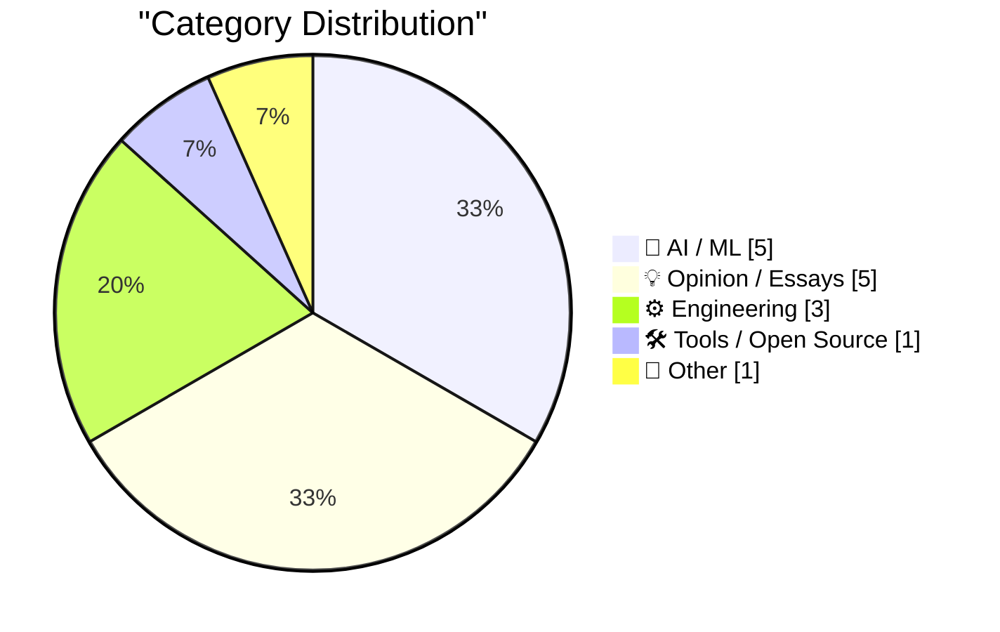
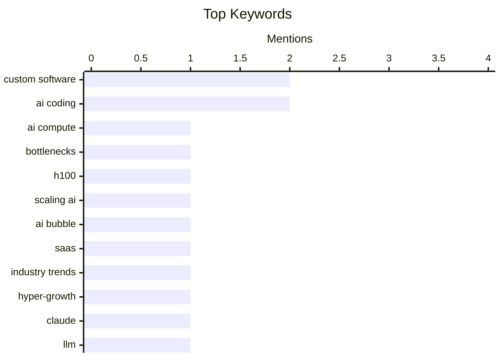

## Today's Highlights
Today's tech headlines reveal a dynamic AI landscape, marked by both significant progress and persistent challenges. Anthropic is pushing AI capabilities with 1M context windows, yet the industry grapples with major bottlenecks in scaling compute, from packaging to power. Performance concerns also led Meta to delay a new foundational AI model. This mixed reality sparks debate over the current AI bubble, even as programmers increasingly view AI-assisted coding as an evolutionary step in software development.
---
## Must Read Today
1. **Dylan Patel — Deep dive on the 3 big bottlenecks to scaling AI compute**
[Dylan Patel — Deep dive on the 3 big bottlenecks to scaling AI compute](https://www.dwarkesh.com/p/dylan-patel) — dwarkesh.com · 22h ago · 🤖 AI / ML
> This article identifies the three major bottlenecks hindering the scaling of AI compute: packaging, power, and memory. It explains that packaging, particularly CoWoS, limits GPU production due to its complex 3D stacking and thermal challenges, while power delivery to the chip and the data center's overall power capacity are critical constraints. Memory, specifically HBM3, is another bottleneck due to its limited suppliers and high cost, with HBM3e offering a 50% bandwidth increase but facing similar supply issues. The article concludes that these interconnected hardware constraints, rather than just chip design, are the primary drivers of the current AI compute scarcity and high H100 value.
💡 **Why read it**: It provides a detailed, technical breakdown of the often-overlooked hardware bottlenecks (packaging, power, memory) that are currently limiting AI compute scaling and driving up GPU costs.
🏷️ AI Compute, Bottlenecks, H100, Scaling AI
2. **Premium: The Hater's Guide To The SaaSpocalypse**
[Premium: The Hater's Guide To The SaaSpocalypse](https://www.wheresyoured.at/hatersguide-saas/) — wheresyoured.at · 21h ago · 💡 Opinion / Essays
> The article posits that the current AI bubble is a direct consequence of the "Rot-Com Bubble," an era of unsustainable hyper-growth in SaaS characterized by a focus on growth at all costs. Many SaaS companies, fueled by cheap capital, built bloated products with low gross margins, leading to a "SaaSpocalypse" as interest rates rose. Generative AI initially appeared as a potential savior, promising efficiency and new revenue streams for these struggling companies. However, the author suggests AI might exacerbate existing issues by adding another layer of complexity and cost without addressing fundamental business model flaws. The core takeaway is that the AI boom is a symptom and potential accelerant of a broader correction in the software industry.
💡 **Why read it**: It offers a critical, contrarian perspective on the AI bubble, framing it within the context of a broader "SaaSpocalypse" driven by unsustainable hyper-growth in the software industry.
🏷️ AI Bubble, SaaS, Industry Trends, Hyper-growth
3. **1M context is now generally available for Opus 4.6 and Sonnet 4.6**
[1M context is now generally available for Opus 4.6 and Sonnet 4.6](https://simonwillison.net/2026/Mar/13/1m-context/#atom-everything) — simonwillison.net · 19h ago · 🤖 AI / ML
> Anthropic has made 1M context windows generally available for its Opus 4.6 and Sonnet 4.6 models. A key surprise is that standard pricing now applies across the entire 1M token window, eliminating the long-context premium typically charged by other providers like OpenAI and Gemini. This move significantly reduces the cost barrier for processing extremely long documents or conversations with these models. While other models like Gemini 3.1 Pro Preview (200k) and GPT-5.4 (272k) exist, they often come with higher costs for extended contexts. This development makes Anthropic's models particularly competitive for applications requiring extensive context without prohibitive pricing.
💡 **Why read it**: It announces a significant development in LLM capabilities and pricing, making 1M context windows generally available for Anthropic's Opus 4.6 and Sonnet 4.6 models without a long-context premium.
🏷️ Claude, LLM, context window, pricing
---
## Data Overview
| Sources Scanned | Articles Fetched | Time Window | Selected |
|:---:|:---:|:---:|:---:|
| 78/92 | 2373 -> 19 | 24h | **15** |
### Category Distribution

### Top Keywords

<details>
<summary>Plain Text Keyword Chart (Terminal Friendly)</summary>
```
custom software │ ████████████████████ 2
ai coding       │ ████████████████████ 2
ai compute      │ ██████████░░░░░░░░░░ 1
bottlenecks     │ ██████████░░░░░░░░░░ 1
h100            │ ██████████░░░░░░░░░░ 1
scaling ai      │ ██████████░░░░░░░░░░ 1
ai bubble       │ ██████████░░░░░░░░░░ 1
saas            │ ██████████░░░░░░░░░░ 1
industry trends │ ██████████░░░░░░░░░░ 1
hyper-growth    │ ██████████░░░░░░░░░░ 1
```
</details>
### Topic Tags
**custom software**(2) · **ai coding**(2) · **ai compute**(1) · bottlenecks(1) · h100(1) · scaling ai(1) · ai bubble(1) · saas(1) · industry trends(1) · hyper-growth(1) · claude(1) · llm(1) · context window(1) · pricing(1) · claude code(1) · rapid development(1) · meta(1) · ai model(1) · performance(1) · delay(1)
---
## AI / ML
### 1. Dylan Patel — Deep dive on the 3 big bottlenecks to scaling AI compute
[Dylan Patel — Deep dive on the 3 big bottlenecks to scaling AI compute](https://www.dwarkesh.com/p/dylan-patel) — **dwarkesh.com** · 22h ago · ⭐ 29/30
> This article identifies the three major bottlenecks hindering the scaling of AI compute: packaging, power, and memory. It explains that packaging, particularly CoWoS, limits GPU production due to its complex 3D stacking and thermal challenges, while power delivery to the chip and the data center's overall power capacity are critical constraints. Memory, specifically HBM3, is another bottleneck due to its limited suppliers and high cost, with HBM3e offering a 50% bandwidth increase but facing similar supply issues. The article concludes that these interconnected hardware constraints, rather than just chip design, are the primary drivers of the current AI compute scarcity and high H100 value.
🏷️ AI Compute, Bottlenecks, H100, Scaling AI
---
### 2. 1M context is now generally available for Opus 4.6 and Sonnet 4.6
[1M context is now generally available for Opus 4.6 and Sonnet 4.6](https://simonwillison.net/2026/Mar/13/1m-context/#atom-everything) — **simonwillison.net** · 19h ago · ⭐ 27/30
> Anthropic has made 1M context windows generally available for its Opus 4.6 and Sonnet 4.6 models. A key surprise is that standard pricing now applies across the entire 1M token window, eliminating the long-context premium typically charged by other providers like OpenAI and Gemini. This move significantly reduces the cost barrier for processing extremely long documents or conversations with these models. While other models like Gemini 3.1 Pro Preview (200k) and GPT-5.4 (272k) exist, they often come with higher costs for extended contexts. This development makes Anthropic's models particularly competitive for applications requiring extensive context without prohibitive pricing.
🏷️ Claude, LLM, context window, pricing
---
### 3. NYT: ‘Meta Delays Rollout of New AI Model After Performance Concerns’
[NYT: ‘Meta Delays Rollout of New AI Model After Performance Concerns’](https://www.nytimes.com/2026/03/12/technology/meta-avocado-ai-model-delayed.html?unlocked_article_code=1.S1A.vI_6.4j717gwtFem0) — **daringfireball.net** · 21h ago · ⭐ 26/30
> Meta has delayed the rollout of its new foundational AI model, code-named Avocado, due to performance concerns. Internal tests revealed that Avocado fell short of the capabilities of leading AI models from rivals such as Google, OpenAI, and Anthropic in key areas like reasoning, coding, and writing. While Avocado did outperform Meta’s previous AI model and Google’s Gemini 2.5, it did not meet the company's expectations to compete with top-tier models. This delay underscores the intense competition and high bar for performance in the rapidly evolving AI landscape.
🏷️ Meta, AI model, performance, delay
---
### 4. Claim Chowder: Anthropic CEO Dario Amodei on the Percentage of Code Being Generated by AI Today
[Claim Chowder: Anthropic CEO Dario Amodei on the Percentage of Code Being Generated by AI Today](https://www.businessinsider.com/anthropic-ceo-ai-90-percent-code-3-to-6-months-2025-3) — **daringfireball.net** · 21h ago · ⭐ 26/30
> This article revisits a prediction made a year ago by Dario Amodei, CEO of Anthropic, regarding AI's role in code generation. Amodei had stated that AI would be writing 90% of code within three to six months and "essentially all of the code" within 12 months. The article serves as a "claim chowder," highlighting that these aggressive timelines for AI-driven code autonomy have not materialized as predicted. It implicitly critiques the overoptimistic projections often made in the rapidly advancing AI field. The piece suggests a more tempered view on the immediate capabilities of AI to fully replace human software developers.
🏷️ AI coding, predictions, Anthropic, software development
---
### 5. Typesetting sheet music with AI
[Typesetting sheet music with AI](https://www.johndcook.com/blog/2026/03/13/typesetting-sheet-music-with-ai/) — **johndcook.com** · 22h ago · ⭐ 20/30
> The article discusses the surprising effectiveness of AI in generating Lilypond code for typesetting sheet music. Despite Lilypond being an obscure language with limited publicly available training data, AI models can produce good results. The author has successfully used AI to generate Lilypond code for music theory-related posts. This capability suggests AI's proficiency extends beyond widely available datasets, handling niche programming languages effectively. AI's ability to handle niche programming languages like Lilypond suggests a broader capability beyond widely available datasets.
🏷️ AI, Typesetting, Lilypond, Sheet Music
---
## Opinion / Essays
### 6. Premium: The Hater's Guide To The SaaSpocalypse
[Premium: The Hater's Guide To The SaaSpocalypse](https://www.wheresyoured.at/hatersguide-saas/) — **wheresyoured.at** · 21h ago · ⭐ 28/30
> The article posits that the current AI bubble is a direct consequence of the "Rot-Com Bubble," an era of unsustainable hyper-growth in SaaS characterized by a focus on growth at all costs. Many SaaS companies, fueled by cheap capital, built bloated products with low gross margins, leading to a "SaaSpocalypse" as interest rates rose. Generative AI initially appeared as a potential savior, promising efficiency and new revenue streams for these struggling companies. However, the author suggests AI might exacerbate existing issues by adding another layer of complexity and cost without addressing fundamental business model flaws. The core takeaway is that the AI boom is a symptom and potential accelerant of a broader correction in the software industry.
🏷️ AI Bubble, SaaS, Industry Trends, Hyper-growth
---
### 7. ‘Grief and the AI Split’
[‘Grief and the AI Split’](https://blog.lmorchard.com/2026/03/11/grief-and-the-ai-split/) — **daringfireball.net** · 23h ago · ⭐ 25/30
> The author, a programmer since 1982, reflects on AI-assisted coding as another evolutionary step in programming, similar to learning new languages, rather than a disruptive rupture. He views AI tools as a means to an end, enhancing his ability to make computers perform desired tasks. However, he acknowledges that while AI feels like a natural progression, the underlying landscape of software development and its societal implications are undergoing significant, unpredictable changes. The article expresses a nuanced perspective, embracing the utility of AI while recognizing the profound, uncertain shifts it introduces to the profession and the broader tech ecosystem.
🏷️ AI impact, developer roles, programming, AI-assisted coding
---
### 8. The Collective Superstitions of People Who Talk to Machines
[The Collective Superstitions of People Who Talk to Machines](https://worksonmymachine.ai/p/the-collective-superstitions-of-people) — **worksonmymachine.substack.com** · 26m ago · ⭐ 23/30
> The article explores the "collective superstitions" that arise among individuals who frequently interact with AI models, particularly in prompt engineering. It describes how users develop idiosyncratic techniques, rituals, and mental models for prompting, often based on anecdotal success rather than explicit documentation or scientific understanding. These "superstitions" include specific phrasing, formatting, or iterative approaches that users believe improve AI output, even if the underlying mechanisms are opaque. The author suggests that this phenomenon stems from the black-box nature of LLMs and the trial-and-error process of discovering effective prompts. The piece highlights the human tendency to find patterns and create heuristics in complex, unpredictable systems.
🏷️ Human-Machine Interaction, Superstitions, AI Perception, Programming Culture
---
### 9. Big tech engineers need big egos
[Big tech engineers need big egos](https://seangoedecke.com/big-tech-needs-big-egos/) — **seangoedecke.com** · 14h ago · ⭐ 22/30
> This article challenges the common belief that big egos have no place in tech, arguing that they are, in fact, essential for survival and success in large tech companies. The author contends that engineers in big tech environments face constant pressure, complex political landscapes, and the need to advocate for their ideas amidst numerous stakeholders. A healthy ego provides the resilience, confidence, and assertiveness required to navigate these challenges, push innovative solutions, and withstand criticism. While acknowledging the downsides of unchecked arrogance, the piece differentiates between destructive ego and the self-belief necessary to thrive in high-stakes, competitive corporate settings. The core argument is that a certain level of ego is a protective mechanism and a driver of impact in large organizations.
🏷️ ego, tech culture, software engineers, workplace
---
### 10. You Digg?
[You Digg?](https://idiallo.com/byte-size/digg-is-gone-again?src=feed) — **idiallo.com** · 5h ago · ⭐ 15/30
> The article reminisces about Digg, a precursor to Reddit, and its eventual downfall due to a controversial redesign. Digg was a prominent online community, but its V4 redesign alienated users by removing the 'bury' (downvote) button and ignoring community feedback. This decision highlights a recurring trend where social platforms remove the ability to downvote. The Digg V4 redesign, particularly the removal of the downvote feature and lack of community input, serves as a cautionary tale for platform development and user engagement.
🏷️ Digg, online community, internet history, social media
---
## Engineering
### 11. ‘Software Bonkers’
[‘Software Bonkers’](https://craigmod.com/essays/software_bonkers/) — **daringfireball.net** · 23h ago · ⭐ 27/30
> The article describes Craig Mod's frustration with off-the-shelf accounting software, which failed to meet his specific needs for handling multiple currencies, historical conversion rates, and diverse CSV imports. He decided to build his own custom accounting software using Claude Code, completing the project in about five days. The resulting application is described as blazing fast, entirely local, and capable of ingesting any CSV format. This custom solution provided superior functionality and user experience compared to commercial alternatives. The experience highlights the potential of AI-assisted coding to enable individuals to quickly develop tailored software solutions for niche problems.
🏷️ custom software, AI coding, Claude Code, rapid development
---
### 12. How Can Governments Pay Open Source Maintainers?
[How Can Governments Pay Open Source Maintainers?](https://shkspr.mobi/blog/2026/03/how-can-governments-pay-open-source-maintainers/) — **shkspr.mobi** · 1h ago · ⭐ 23/30
> The article addresses the complex problem of how governments can financially support open-source software (OSS) maintainers, despite heavily relying on and even publishing OSS themselves. It highlights the difficulties faced by the UK Government in establishing mechanisms to pay maintainers, citing issues like procurement rules, identifying deserving projects, and the challenge of valuing volunteer work. Traditional government procurement processes are ill-suited for the decentralized, often informal nature of OSS contributions. The author suggests that solutions might involve direct grants, funding foundations, or integrating maintenance costs into broader government IT budgets, but acknowledges the systemic hurdles. The core problem is bridging the gap between public sector reliance on OSS and the sustainable funding of its volunteer-driven ecosystem.
🏷️ Open Source, Funding, Government, Maintainers
---
### 13. Quoting Craig Mod
[Quoting Craig Mod](https://simonwillison.net/2026/Mar/13/craig-mod/#atom-everything) — **simonwillison.net** · 20h ago · ⭐ 15/30
> The article quotes Craig Mod on the inadequacy of off-the-shelf accounting software for his specific needs. Mod built his own accounting software in about five days, which is blazing fast and entirely local. This custom solution handles multiple currencies, pulls daily historical conversion rates, and can ingest any CSV data. Custom-built, lightweight software can significantly outperform commercial alternatives for specific, complex personal requirements.
🏷️ custom software, accounting, personal project
---
## Tools / Open Source
### 14. What’s Going On with FAIR Package Manager
[What’s Going On with FAIR Package Manager](https://nesbitt.io/2026/03/14/whats-going-on-with-fair-package-manager.html) — **nesbitt.io** · 4h ago · ⭐ 18/30
> The article briefly announces a significant strategic shift for the Federated FAIR project. The project is pivoting its underlying content management system from one platform to another. This change indicates a new technical direction for the Federated FAIR initiative. Specifically, Federated FAIR is transitioning from WordPress to TYPO3.
🏷️ Package Manager, FAIR, WordPress, TYPO3
---
## Other
### 15. Last-Run Syndication
[Last-Run Syndication](https://feed.tedium.co/link/15204/17299183/television-first-run-syndication-decline) — **tedium.co** · 12h ago · ⭐ 16/30
> The article addresses the decline of first-run syndication, a historically crucial business model in television. This model involved syndicating original content directly to TV stations looking to fill airtime. The article suggests this established model is losing its viability and 'steam.' A significant television business model, first-run syndication, is experiencing a decline.
🏷️ Television, Syndication, Business Model, Media
---
*Generated at 2026-03-14 14:07 | Scanned 78 sources -> 2373 articles -> selected 15*
*Based on the [Hacker News Popularity Contest 2025](https://refactoringenglish.com/tools/hn-popularity/) RSS source list recommended by [Andrej Karpathy](https://x.com/karpathy)*
*Produced by Dongdianr AI. Follow the same-name WeChat public account for more AI practical tips 💡*
