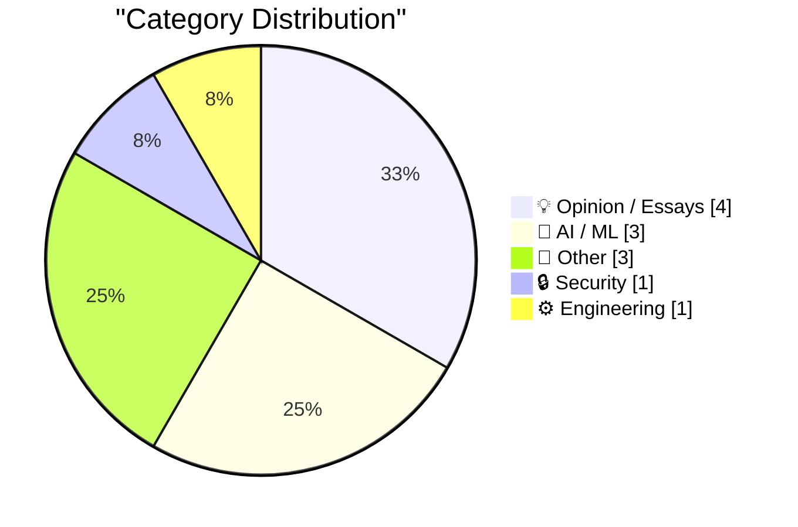
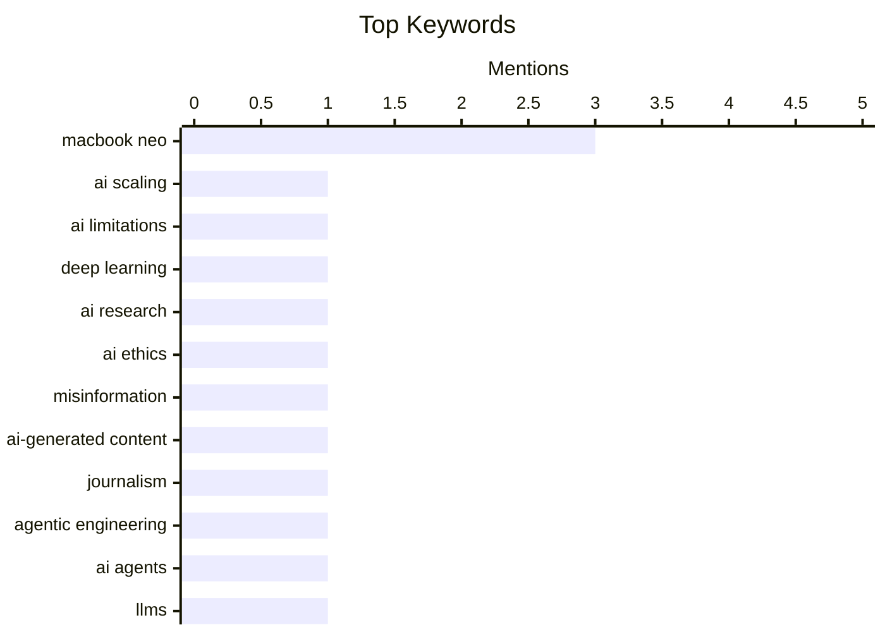

## Today's Highlights
The AI landscape is rapidly evolving, with new research challenging the 'scaling is all you need' mantra and agentic engineering gaining traction, even as the misuse of AI for fabricated content leads to serious professional consequences. In hardware, the innovative MacBook Neo is disrupting the market, prompting teardowns and leaving PC makers struggling to compete. This comes amidst a backdrop of persistent digital threats, highlighted by a sophisticated Apple account phishing scam.
---
## Must Read Today
1. **BREAKING: Expensive new evidence that scaling is not all you need**
[BREAKING: Expensive new evidence that scaling is not all you need](https://garymarcus.substack.com/p/breaking-expensive-new-evidence-that) — garymarcus.substack.com · 19h ago · 🤖 AI / ML
> BREAKING: Expensive new evidence that scaling is not all you need
🏷️ AI scaling, AI limitations, deep learning, AI research
2. **Ars Technica Fires Reporter Benj Edwards After He Published Story With AI-Fabricated Quotes**
[Ars Technica Fires Reporter Benj Edwards After He Published Story With AI-Fabricated Quotes](https://futurism.com/artificial-intelligence/ars-technica-fires-reporter-ai-quotes) — daringfireball.net · 20h ago · 🤖 AI / ML
> Ars Technica Fires Reporter Benj Edwards After He Published Story With AI-Fabricated Quotes
🏷️ AI ethics, misinformation, AI-generated content, journalism
3. **My fireside chat about agentic engineering at the Pragmatic Summit**
[My fireside chat about agentic engineering at the Pragmatic Summit](https://simonwillison.net/2026/Mar/14/pragmatic-summit/#atom-everything) — simonwillison.net · 19h ago · 🤖 AI / ML
> My fireside chat about agentic engineering at the Pragmatic Summit
🏷️ Agentic Engineering, AI agents, LLMs, software patterns
---
## Data Overview
| Sources Scanned | Articles Fetched | Time Window | Selected |
|:---:|:---:|:---:|:---:|
| 78/92 | 2374 -> 12 | 24h | **12** |
### Category Distribution

### Top Keywords

<details>
<summary>Plain Text Keyword Chart (Terminal Friendly)</summary>
```
macbook neo          │ ████████████████████ 3
ai scaling           │ ███████░░░░░░░░░░░░░ 1
ai limitations       │ ███████░░░░░░░░░░░░░ 1
deep learning        │ ███████░░░░░░░░░░░░░ 1
ai research          │ ███████░░░░░░░░░░░░░ 1
ai ethics            │ ███████░░░░░░░░░░░░░ 1
misinformation       │ ███████░░░░░░░░░░░░░ 1
ai-generated content │ ███████░░░░░░░░░░░░░ 1
journalism           │ ███████░░░░░░░░░░░░░ 1
agentic engineering  │ ███████░░░░░░░░░░░░░ 1
```
</details>
### Topic Tags
**macbook neo**(3) · **ai scaling**(1) · **ai limitations**(1) · deep learning(1) · ai research(1) · ai ethics(1) · misinformation(1) · ai-generated content(1) · journalism(1) · agentic engineering(1) · ai agents(1) · llms(1) · software patterns(1) · phishing(1) · apple security(1) · account scam(1) · lockdown mode(1) · ai spam(1) · github(1) · open source(1)
---
## Opinion / Essays
### 1. PC Makers Are Not Ready for the MacBook Neo
[PC Makers Are Not Ready for the MacBook Neo](https://www.theverge.com/report/894090/macbook-neo-pc-windows-laptop-competition-asus-footinmouth) — **daringfireball.net** · 18h ago · ⭐ 22/30
> PC Makers Are Not Ready for the MacBook Neo
🏷️ MacBook Neo, Apple strategy, PC market, industry analysis
---
### 2. Pluralistic: Corrupt anticorruption (14 Mar 2026)
[Pluralistic: Corrupt anticorruption (14 Mar 2026)](https://pluralistic.net/2026/03/14/ill-have-what-xis-having/) — **pluralistic.net** · 22h ago · ⭐ 22/30
> Pluralistic: Corrupt anticorruption (14 Mar 2026)
🏷️ tech policy, cryptography, labor, social commentary
---
### 3. Lil Finder Guy
[Lil Finder Guy](https://basicappleguy.com/basicappleblog/lil-finder-guy) — **daringfireball.net** · 21h ago · ⭐ 17/30
> Lil Finder Guy
🏷️ Apple marketing, MacBook Neo, TikTok, branding
---
### 4. Guided Meditation for Developers
[Guided Meditation for Developers](https://nesbitt.io/2026/03/15/guided-meditation-for-developers.html) — **nesbitt.io** · 4h ago · ⭐ 17/30
> This article introduces a unique 'guided meditation' practice specifically designed for developers to find peace amidst the complexities of software dependency trees. It frames the process as a mental exercise to manage the stress and chaos often associated with package management and transitive dependencies. The practice aims to apply mindfulness techniques to understand and accept the intricate relationships within a project's dependencies. The main takeaway is to foster a calmer, more accepting mindset towards the inherent challenges of modern software development environments.
🏷️ Meditation, Developer well-being, Mental health
---
## AI / ML
### 5. BREAKING: Expensive new evidence that scaling is not all you need
[BREAKING: Expensive new evidence that scaling is not all you need](https://garymarcus.substack.com/p/breaking-expensive-new-evidence-that) — **garymarcus.substack.com** · 19h ago · ⭐ 28/30
> BREAKING: Expensive new evidence that scaling is not all you need
🏷️ AI scaling, AI limitations, deep learning, AI research
---
### 6. Ars Technica Fires Reporter Benj Edwards After He Published Story With AI-Fabricated Quotes
[Ars Technica Fires Reporter Benj Edwards After He Published Story With AI-Fabricated Quotes](https://futurism.com/artificial-intelligence/ars-technica-fires-reporter-ai-quotes) — **daringfireball.net** · 20h ago · ⭐ 27/30
> Ars Technica Fires Reporter Benj Edwards After He Published Story With AI-Fabricated Quotes
🏷️ AI ethics, misinformation, AI-generated content, journalism
---
### 7. My fireside chat about agentic engineering at the Pragmatic Summit
[My fireside chat about agentic engineering at the Pragmatic Summit](https://simonwillison.net/2026/Mar/14/pragmatic-summit/#atom-everything) — **simonwillison.net** · 19h ago · ⭐ 26/30
> My fireside chat about agentic engineering at the Pragmatic Summit
🏷️ Agentic Engineering, AI agents, LLMs, software patterns
---
## Other
### 8. iFixit’s MacBook Neo Teardown
[iFixit’s MacBook Neo Teardown](https://www.ifixit.com/News/116152/macbook-neo-is-the-most-repairable-macbook-in-14-years) — **daringfireball.net** · 16h ago · ⭐ 23/30
> iFixit’s MacBook Neo Teardown
🏷️ MacBook Neo, repairability, iFixit, Apple hardware
---
### 9. Book Review: Robots in Space - The Secret Lives of Our Planetary Explorers by Dr Ezzy Pearson ★★★⯪☆
[Book Review: Robots in Space - The Secret Lives of Our Planetary Explorers by Dr Ezzy Pearson ★★★⯪☆](https://shkspr.mobi/blog/2026/03/book-review-robots-in-space-the-secret-lives-of-our-planetary-explorers-by-dr-ezzy-pearson/) — **shkspr.mobi** · 1h ago · ⭐ 17/30
> Book Review: Robots in Space - The Secret Lives of Our Planetary Explorers by Dr Ezzy Pearson ★★★⯪☆
🏷️ space robotics, planetary exploration, history, book review
---
### 10. BertVote Gemeenteraadsverkiezingen 2026
[BertVote Gemeenteraadsverkiezingen 2026](https://berthub.eu/articles/posts/bert-vote-gemeenteraad-2026/) — **berthub.eu** · 2h ago · ⭐ 6/30
> This article discusses the upcoming Dutch municipal elections ('Gemeenteraadsverkiezingen') scheduled for March 18, 2026, and the author's personal involvement. The author explains they cannot revive the previous 'NerdVote' campaign, which involved a carefully selected advisory group, because they are personally running as a 'lijstduwer' for Progressief Pijnacker-Nootdorp (a local GroenLinks-PvdA coalition). Despite this, the author expresses strong enthusiasm for specific candidates across the country, whom they know personally. The article serves as a personal endorsement platform for the author's preferred candidates in the 2026 municipal elections, distinct from the previous 'NerdVote' initiative.
🏷️ Dutch elections, Local politics
---
## Security
### 11. Matt Mullenweg Documents a Dastardly Clever Apple Account Phishing Scam
[Matt Mullenweg Documents a Dastardly Clever Apple Account Phishing Scam](https://ma.tt/2026/03/gone-almost-phishin/) — **daringfireball.net** · 13h ago · ⭐ 26/30
> Matt Mullenweg Documents a Dastardly Clever Apple Account Phishing Scam
🏷️ phishing, Apple security, account scam, Lockdown Mode
---
## Engineering
### 12. Quoting Jannis Leidel
[Quoting Jannis Leidel](https://simonwillison.net/2026/Mar/14/jannis-leidel/#atom-everything) — **simonwillison.net** · 19h ago · ⭐ 24/30
> Quoting Jannis Leidel
🏷️ AI spam, GitHub, open source, project maintenance
---
*Generated at 2026-03-15 14:07 | Scanned 78 sources -> 2374 articles -> selected 12*
*Based on the [Hacker News Popularity Contest 2025](https://refactoringenglish.com/tools/hn-popularity/) RSS source list recommended by [Andrej Karpathy](https://x.com/karpathy)*
*Produced by Dongdianr AI. Follow the same-name WeChat public account for more AI practical tips 💡*
