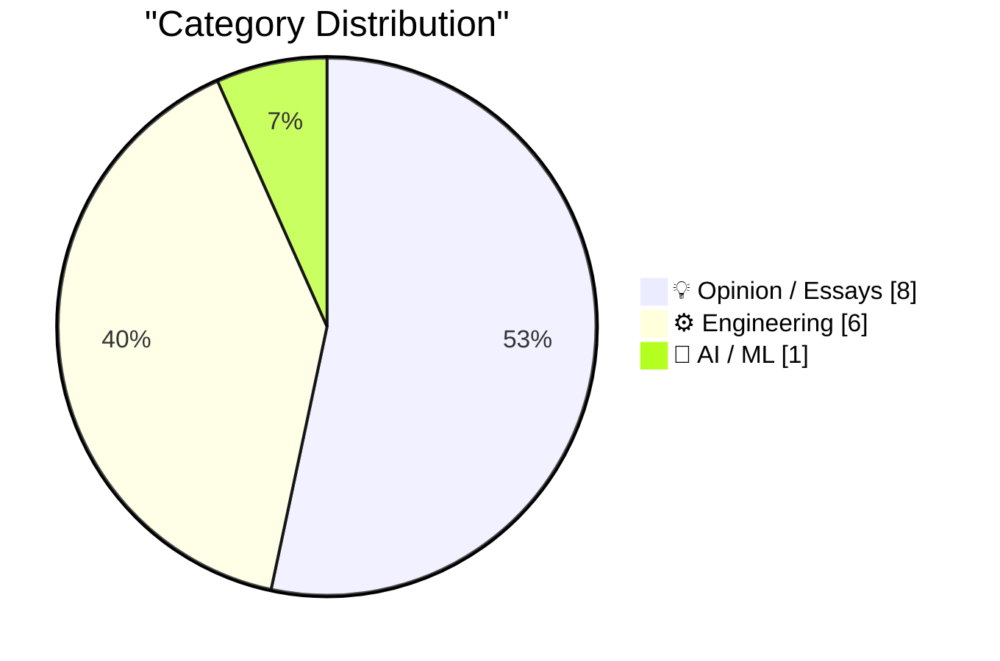
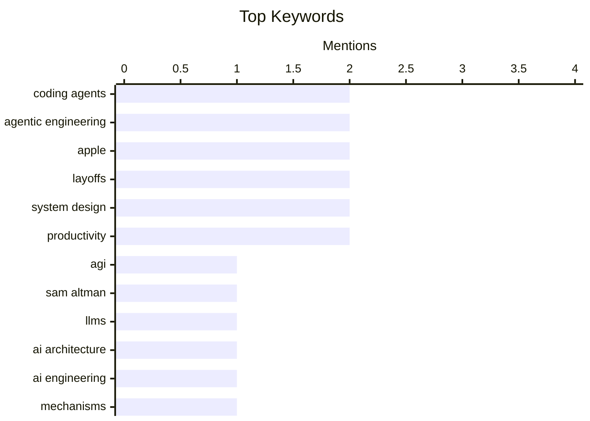

## Today's Highlights
Today's tech discussions highlight a pivotal moment in AI, with industry leaders acknowledging the need for fundamental breakthroughs beyond mere scaling to achieve Artificial General Intelligence. This ambition is tempered by the practical reality of "agentic engineering" leveraging coding agents, alongside significant economic implications. Major tech companies are grappling with mounting AI costs leading to layoffs, while others strategically opt out of the intense spending race. These shifts underscore AI's profound impact on both innovation and the workforce, often becoming a convenient explanation for broader economic adjustments.
---
## Must Read Today
1. **BREAKING: Sam Altman concedes that we need major breakthroughs beyond mere scaling to get to AGI**
[BREAKING: Sam Altman concedes that we need major breakthroughs beyond mere scaling to get to AGI](https://garymarcus.substack.com/p/breaking-sam-altman-concedes-that) — garymarcus.substack.com · 12h ago · 🤖 AI / ML
> The article highlights Sam Altman's recent concession that achieving Artificial General Intelligence (AGI) will require fundamental breakthroughs beyond simply scaling current large language models (LLMs). Gary Marcus argues that the current LLM paradigm is insufficient for true AGI, which necessitates new architectures and cognitive capabilities. He emphasizes the limitations of LLMs in areas like reasoning, planning, and understanding causality, advocating for a shift towards hybrid AI systems integrating symbolic and neural approaches. The main takeaway is that the AI community must prioritize foundational research into novel architectural paradigms rather than solely focusing on increasing model size and data.
💡 **Why read it**: It offers a critical perspective on the current state of AI development, emphasizing the urgent need for architectural innovation beyond scaling to achieve AGI.
🏷️ AGI, Sam Altman, LLMs, AI architecture
2. **How coding agents work**
[How coding agents work](https://simonwillison.net/guides/agentic-engineering-patterns/how-coding-agents-work/#atom-everything) — simonwillison.net · 5m ago · ⚙️ Engineering
> This article explains that a coding agent functions as a "harness" for a Large Language Model (LLM), extending its capabilities through invisible prompts and callable tools. These agents operate by breaking down complex tasks into smaller, manageable steps, often involving a "plan, execute, reflect" loop. They utilize tools like code interpreters, file system access, and web search to interact with their environment and achieve objectives. The core mechanism involves the LLM generating code, executing it, and then using the output or errors to refine its next steps, effectively creating an iterative problem-solving process.
💡 **Why read it**: It provides a clear, technical breakdown of the underlying mechanisms and patterns that enable coding agents to function, which is crucial for effective agentic engineering.
🏷️ Coding agents, Agentic engineering, AI engineering, Mechanisms
3. **What is agentic engineering?**
[What is agentic engineering?](https://simonwillison.net/guides/agentic-engineering-patterns/what-is-agentic-engineering/#atom-everything) — simonwillison.net · 15h ago · ⚙️ Engineering
> Agentic engineering is defined as the practice of developing software with the assistance of coding agents, which are agents capable of both writing and executing code. Popular examples include Claude Code and OpenAI Codex. These agents act as a "harness" for LLMs, extending their capabilities with additional tools and invisible prompts. The field focuses on designing systems where LLMs can autonomously perform complex tasks by interacting with their environment, generating code, executing it, and iterating based on feedback.
💡 **Why read it**: It offers a foundational definition of agentic engineering and coding agents, clarifying a rapidly evolving concept in AI development.
🏷️ Agentic engineering, Definition, AI development, Coding agents
---
## Data Overview
| Sources Scanned | Articles Fetched | Time Window | Selected |
|:---:|:---:|:---:|:---:|
| 77/92 | 2347 -> 18 | 24h | **15** |
### Category Distribution

### Top Keywords

<details>
<summary>Plain Text Keyword Chart (Terminal Friendly)</summary>
```
coding agents       │ ████████████████████ 2
agentic engineering │ ████████████████████ 2
apple               │ ████████████████████ 2
layoffs             │ ████████████████████ 2
system design       │ ████████████████████ 2
productivity        │ ████████████████████ 2
agi                 │ ██████████░░░░░░░░░░ 1
sam altman          │ ██████████░░░░░░░░░░ 1
llms                │ ██████████░░░░░░░░░░ 1
ai architecture     │ ██████████░░░░░░░░░░ 1
```
</details>
### Topic Tags
**coding agents**(2) · **agentic engineering**(2) · **apple**(2) · layoffs(2) · system design(2) · productivity(2) · agi(1) · sam altman(1) · llms(1) · ai architecture(1) · ai engineering(1) · mechanisms(1) · definition(1) · ai development(1) · ai strategy(1) · spending(1) · corporate finance(1) · meta(1) · ai costs(1) · infrastructure(1)
---
## Opinion / Essays
### 1. Horace Dediu on Apple Sitting Out the AI Spending Race
[Horace Dediu on Apple Sitting Out the AI Spending Race](https://asymco.com/2026/03/10/the-most-brilliant-move-in-corporate-history/) — **daringfireball.net** · 22h ago · ⭐ 25/30
> Horace Dediu highlights Apple's unique position of largely sitting out the massive AI infrastructure spending race, contrasting it with competitors like Amazon ($200B), Google ($185B), Microsoft ($114B), and Meta ($135B) who collectively plan to spend $650 billion this year. Historically, Apple was a major capex spender for manufacturing, but its current AI strategy appears to diverge significantly from its peers. Dediu suggests this could be "The Most Brilliant Move in Corporate History," implying Apple might be leveraging existing infrastructure, focusing on on-device AI, or waiting for more mature, cost-effective solutions. The article posits that Apple's approach could be a strategic advantage by avoiding the immense capital expenditures currently burdening other tech giants.
🏷️ Apple, AI strategy, Spending, Corporate finance
---
### 2. Reuters: ‘Meta Planning Sweeping Layoffs as AI Costs Mount’
[Reuters: ‘Meta Planning Sweeping Layoffs as AI Costs Mount’](https://www.reuters.com/business/world-at-work/meta-planning-sweeping-layoffs-ai-costs-mount-2026-03-14/) — **daringfireball.net** · 22h ago · ⭐ 24/30
> Reuters reports that Meta is planning sweeping layoffs, potentially affecting 20% or more of the company, as it seeks to offset mounting artificial intelligence infrastructure costs. These cuts are also intended to prepare for greater efficiency brought about by AI-assisted workers. While no specific date or final magnitude has been set, top executives have signaled these plans. The move underscores the significant financial burden associated with large-scale AI investments and the strategic shift towards an AI-augmented workforce.
🏷️ Meta, Layoffs, AI costs, Infrastructure
---
### 3. Blaming AI for Layoffs: ‘It Plays Better’
[Blaming AI for Layoffs: ‘It Plays Better’](https://www.resume.org/the-great-turnover-9-in-10-companies-plan-to-hire-in-2026-yet-6-in-10-will-have-layoffs-2/) — **daringfireball.net** · 21h ago · ⭐ 23/30
> A Resume.org survey of 1,000 U.S. hiring managers reveals that 59% admit to emphasizing AI when explaining hiring freezes or layoffs. This tactic is employed because it "plays better with stakeholders" than citing financial constraints. The article highlights a potential trend where companies are strategically framing workforce reductions as AI-driven efficiency gains, rather than purely economic necessity. This suggests a PR strategy leveraging the narrative of technological advancement to soften the impact of layoffs.
🏷️ AI, Layoffs, Corporate strategy, Perception
---
### 4. The optimized self and the life that got away
[The optimized self and the life that got away](https://www.joanwestenberg.com/the-optimized-self-and-the-life-that-got-away/) — **joanwestenberg.com** · 15h ago · ⭐ 19/30
> This article explores the concept of the "optimized self" and its potential pitfalls, suggesting that an relentless pursuit of self-improvement can lead to a sense of a "life that got away." It critiques the modern obsession with productivity hacks, biohacking, and constant self-optimization, arguing that this focus can detract from genuine human experience and connection. The author implies that by constantly striving for an ideal, optimized version of oneself, individuals risk losing touch with their authentic selves and the spontaneous joys of life. The core message is a cautionary tale against the relentless pressure to optimize every aspect of existence, advocating for a more balanced and accepting approach to life.
🏷️ Self-optimization, Productivity, Work-life balance
---
### 5. Finalist 3.6
[Finalist 3.6](https://www.finalist.works/finalist-36/) — **daringfireball.net** · 20h ago · ⭐ 15/30
> This article introduces Finalist 3.6, an ambitious digital planner app for iPhone, iPad, and Mac, designed to help users complete tasks rather than just organize them. Developed by indie developer Slaven Radic, Finalist integrates with existing calendars, reminders, and health data (with permission) to provide a comprehensive planning experience. It aims to be a modern digital equivalent of traditional paper planners, focusing on task completion. Finalist 3.6 offers a novel approach to productivity, emphasizing finishing tasks by consolidating relevant personal data into a single, intuitive planner interface.
🏷️ Finalist app, Planner, Productivity, iOS
---
### 6. ‘This Is Not the Computer for You’
[‘This Is Not the Computer for You’](https://samhenri.gold/blog/20260312-this-is-not-the-computer-for-you/?ref=birchtree.me) — **daringfireball.net** · 20h ago · ⭐ 14/30
> The article explores the unconventional path of technological obsession and learning, arguing that users don't start with the 'right' tools but rather push available hardware to its limits. It posits that true understanding of computing costs and capabilities comes from struggling with underpowered or unsuitable machines, forcing users to discover the machine's boundaries and what it truly 'costs' to compute. This process reveals a 'map of the territory' through breaking or revealing hidden aspects of the hardware. Genuine technological mastery and insight often emerge from an iterative process of pushing available, often inadequate, tools beyond their intended limits, rather than starting with optimal equipment.
🏷️ Tools, Obsession, Philosophy, Creativity
---
### 7. Pluralistic: Tools vs uses (16 Mar 2026)
[Pluralistic: Tools vs uses (16 Mar 2026)](https://pluralistic.net/2026/03/16/whittle-a-webserver/) — **pluralistic.net** · 13m ago · ⭐ 14/30
> This article, part of Cory Doctorow's 'Pluralistic' series, presents a collection of links and thoughts, with a central theme of 'Tools vs uses.' The 'Tools vs uses' section likely discusses the distinction between a technology's intended purpose and its actual application, potentially touching on issues like digital rights or control. Other linked topics include Amazon's labor practices, Bruce's ETECH speech, and the 'Car Hacker's Handbook,' suggesting a focus on technology, power dynamics, and user agency. The post serves as a curated digest of current events and ideas, encouraging readers to critically examine the relationship between technological tools and their societal implications, particularly regarding control and labor.
🏷️ Digest, Links, Commentary, Diverse topics
---
### 8. CHM Live: Apple at 50
[CHM Live: Apple at 50](https://www.youtube.com/live/eCSNJgI2LFI) — **daringfireball.net** · 15h ago · ⭐ 13/30
> This article highlights a live event hosted by David Pogue, celebrating Apple's 50th anniversary, featuring notable figures from the company's history. The event included special guests such as Chris Espinosa (one of Apple's earliest employees), former CEO John Sculley, and Avie Tevanian (former Senior VP of Software Engineering), offering insights into Apple's five-decade journey. The host, David Pogue, is praised for his performance. The 'CHM Live: Apple at 50' event provides a valuable historical perspective on Apple's evolution through the eyes of key individuals who shaped its trajectory.
🏷️ Apple, History, Event, Review
---
## Engineering
### 9. How coding agents work
[How coding agents work](https://simonwillison.net/guides/agentic-engineering-patterns/how-coding-agents-work/#atom-everything) — **simonwillison.net** · 5m ago · ⭐ 26/30
> This article explains that a coding agent functions as a "harness" for a Large Language Model (LLM), extending its capabilities through invisible prompts and callable tools. These agents operate by breaking down complex tasks into smaller, manageable steps, often involving a "plan, execute, reflect" loop. They utilize tools like code interpreters, file system access, and web search to interact with their environment and achieve objectives. The core mechanism involves the LLM generating code, executing it, and then using the output or errors to refine its next steps, effectively creating an iterative problem-solving process.
🏷️ Coding agents, Agentic engineering, AI engineering, Mechanisms
---
### 10. What is agentic engineering?
[What is agentic engineering?](https://simonwillison.net/guides/agentic-engineering-patterns/what-is-agentic-engineering/#atom-everything) — **simonwillison.net** · 15h ago · ⭐ 25/30
> Agentic engineering is defined as the practice of developing software with the assistance of coding agents, which are agents capable of both writing and executing code. Popular examples include Claude Code and OpenAI Codex. These agents act as a "harness" for LLMs, extending their capabilities with additional tools and invisible prompts. The field focuses on designing systems where LLMs can autonomously perform complex tasks by interacting with their environment, generating code, executing it, and iterating based on feedback.
🏷️ Agentic engineering, Definition, AI development, Coding agents
---
### 11. Food, Software, and Trade-offs
[Food, Software, and Trade-offs](https://blog.jim-nielsen.com/2026/food-software-and-trade-offs/) — **blog.jim-nielsen.com** · 19h ago · ⭐ 23/30
> The article uses a food analogy from Greg Knauss to illustrate the trade-offs inherent in software development, comparing factory-made Ding Dongs to artisanal gâteaux and raw ingredients. It argues that different levels of "care, personalization, and intimacy" define the nature of both food and software. This analogy suggests that highly standardized, mass-produced software prioritizes efficiency and broad accessibility, while custom-crafted solutions offer unique value and tailored experiences. The core idea is that every design choice in software, from off-the-shelf components to bespoke systems, involves a deliberate balance between cost, quality, flexibility, and the user's specific needs.
🏷️ Software design, Trade-offs, Engineering principles
---
### 12. Why I Love FreeBSD
[Why I Love FreeBSD](https://it-notes.dragas.net/2026/03/16/why-i-love-freebsd/) — **it-notes.dragas.net** · 5h ago · ⭐ 22/30
> The author reflects on their over twenty-year relationship with FreeBSD, starting from their first encounter in 2002, and how it profoundly shaped their approach to system design and operation. They highlight FreeBSD's enduring philosophy, stability, and community as key reasons for their continued affection. The article praises FreeBSD's robust architecture, clear documentation, and the control it offers users, contrasting it with more opinionated or rapidly changing operating systems. The core takeaway is FreeBSD's consistent reliability and principled design foster a deep appreciation among its long-term users.
🏷️ FreeBSD, Operating system, System design, Unix-like
---
### 13. Shower Thought: Git Teleportation
[Shower Thought: Git Teleportation](https://idiallo.com/byte-size/git-teleportation?src=feed) — **idiallo.com** · 13h ago · ⭐ 18/30
> The article introduces a "shower thought" analogy comparing Git's functionality to sci-fi teleportation, specifically the concept of disassembling and reassembling atoms. It questions whether Git's `checkout` or `reset` operations are more akin to destroying the current state and recreating a past one, or if they represent a more nuanced "teleportation" of the codebase. The analogy explores the philosophical implications of Git's ability to instantly switch between different historical states of a project, prompting reflection on the underlying mechanisms and mental models developers use. The core idea is to playfully examine how Git manages project history and state changes through the lens of a sci-fi concept.
🏷️ Git, Version control, Analogy, System design
---
### 14. Some updates to ActivityBot
[Some updates to ActivityBot](https://shkspr.mobi/blog/2026/03/some-updates-to-activitybot/) — **shkspr.mobi** · 1h ago · ⭐ 18/30
> This article discusses recent updates to ActivityBot, a lightweight PHP-based ActivityPub server designed for building Mastodon bots. ActivityBot is a single PHP file, less than 80KB, capable of running an entire ActivityPub server. Examples like @openbenches@bot.openbenches.org, @colours@colours.bots.edent.tel, and @solar@solar.bots.edent.tel demonstrate its functionality in providing automated Mastodon updates. ActivityBot offers a simple, efficient, and accessible solution for developers to create and deploy Mastodon bots using minimal resources.
🏷️ ActivityPub, Mastodon, PHP, Bot
---
## AI / ML
### 15. BREAKING: Sam Altman concedes that we need major breakthroughs beyond mere scaling to get to AGI
[BREAKING: Sam Altman concedes that we need major breakthroughs beyond mere scaling to get to AGI](https://garymarcus.substack.com/p/breaking-sam-altman-concedes-that) — **garymarcus.substack.com** · 12h ago · ⭐ 28/30
> The article highlights Sam Altman's recent concession that achieving Artificial General Intelligence (AGI) will require fundamental breakthroughs beyond simply scaling current large language models (LLMs). Gary Marcus argues that the current LLM paradigm is insufficient for true AGI, which necessitates new architectures and cognitive capabilities. He emphasizes the limitations of LLMs in areas like reasoning, planning, and understanding causality, advocating for a shift towards hybrid AI systems integrating symbolic and neural approaches. The main takeaway is that the AI community must prioritize foundational research into novel architectural paradigms rather than solely focusing on increasing model size and data.
🏷️ AGI, Sam Altman, LLMs, AI architecture
---
*Generated at 2026-03-16 14:07 | Scanned 77 sources -> 2347 articles -> selected 15*
*Based on the [Hacker News Popularity Contest 2025](https://refactoringenglish.com/tools/hn-popularity/) RSS source list recommended by [Andrej Karpathy](https://x.com/karpathy)*
*Produced by Dongdianr AI. Follow the same-name WeChat public account for more AI practical tips 💡*
