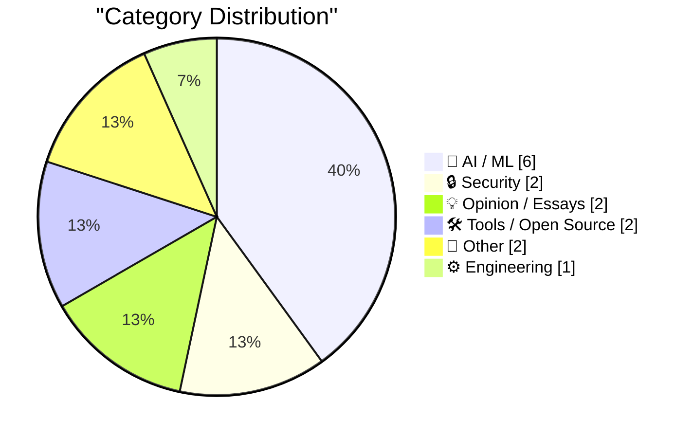
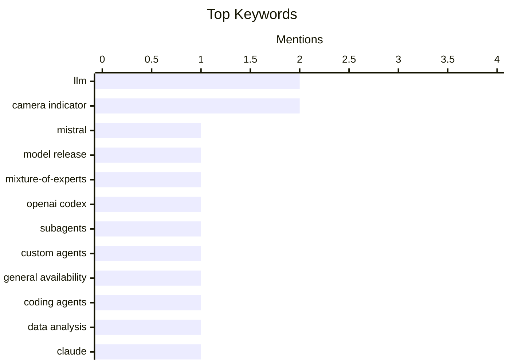

## Today's Highlights
Today's tech highlights are dominated by significant advancements in AI, with new large language models like Mistral Small 4 being released and sophisticated subagent architectures becoming generally available for more complex tasks. These AI agents are rapidly finding practical applications, from data analysis to tackling grand challenges, while critical research into AI safety and alignment continues. Beyond AI, other key developments include a focus on secure hardware design and the evolving landscape of developer tools.
---
## Must Read Today
1. **Introducing Mistral Small 4**
[Introducing Mistral Small 4](https://simonwillison.net/2026/Mar/16/mistral-small-4/#atom-everything) — simonwillison.net · 14h ago · 🤖 AI / ML
> Mistral has released Mistral Small 4, a new Apache 2 licensed large language model. This 119B parameter Mixture-of-Experts (MoE) model, with 6B active parameters, unifies the capabilities of their flagship models: Magistral for reasoning, Pixtral for multimodal tasks, and Devstral for agentic coding. The model is designed to be a single, versatile solution for a wide range of AI applications. This release signifies a strategic move towards consolidating specialized AI functionalities into a more general-purpose model.
💡 **Why read it**: It introduces a significant new open-source large language model with unified capabilities and a clear technical specification.
🏷️ Mistral, LLM, model release, Mixture-of-Experts
2. **Use subagents and custom agents in Codex**
[Use subagents and custom agents in Codex](https://simonwillison.net/2026/Mar/16/codex-subagents/#atom-everything) — simonwillison.net · 15h ago · 🤖 AI / ML
> OpenAI Codex has made subagents generally available, allowing for more sophisticated and structured agentic workflows. These subagents are conceptually similar to Claude Code's implementation, offering default roles such as "explorer," "worker," and "default." While the specific distinction between "worker" and "default" remains somewhat ambiguous, it is implied to be task-specific based on provided examples like CSV processing. This feature enhances Codex's ability to manage complex tasks by delegating to specialized sub-components, improving overall task execution and modularity.
💡 **Why read it**: It details a new feature in OpenAI Codex that enables more sophisticated agentic programming by introducing subagents.
🏷️ OpenAI Codex, subagents, custom agents, general availability
3. **Coding agents for data analysis**
[Coding agents for data analysis](https://simonwillison.net/2026/Mar/16/coding-agents-for-data-analysis/#atom-everything) — simonwillison.net · 17h ago · 🤖 AI / ML
> This article presents a workshop handout from NICAR 2026, focusing on the application of coding agents for data analysis, specifically tailored for data journalists. The three-hour session demonstrates practical ways to utilize tools like Claude Code and OpenAI Codex. It covers essential data tasks such as exploration, analysis, and cleaning. The structured handout, complete with a table of contents, provides a comprehensive guide for applying AI coding agents to real-world data journalism challenges.
💡 **Why read it**: It offers a practical guide and resources for data journalists to utilize AI coding agents for data analysis and cleaning.
🏷️ Coding agents, data analysis, Claude, workshop
---
## Data Overview
| Sources Scanned | Articles Fetched | Time Window | Selected |
|:---:|:---:|:---:|:---:|
| 77/92 | 2351 -> 22 | 24h | **15** |
### Category Distribution

### Top Keywords

<details>
<summary>Plain Text Keyword Chart (Terminal Friendly)</summary>
```
llm                  │ ████████████████████ 2
camera indicator     │ ████████████████████ 2
mistral              │ ██████████░░░░░░░░░░ 1
model release        │ ██████████░░░░░░░░░░ 1
mixture-of-experts   │ ██████████░░░░░░░░░░ 1
openai codex         │ ██████████░░░░░░░░░░ 1
subagents            │ ██████████░░░░░░░░░░ 1
custom agents        │ ██████████░░░░░░░░░░ 1
general availability │ ██████████░░░░░░░░░░ 1
coding agents        │ ██████████░░░░░░░░░░ 1
```
</details>
### Topic Tags
**llm**(2) · **camera indicator**(2) · **mistral**(1) · model release(1) · mixture-of-experts(1) · openai codex(1) · subagents(1) · custom agents(1) · general availability(1) · coding agents(1) · data analysis(1) · claude(1) · workshop(1) · agents(1) · context limit(1) · engineering patterns(1) · apple(1) · security(1) · kernel exploit(1) · ai(1)
---
## AI / ML
### 1. Introducing Mistral Small 4
[Introducing Mistral Small 4](https://simonwillison.net/2026/Mar/16/mistral-small-4/#atom-everything) — **simonwillison.net** · 14h ago · ⭐ 26/30
> Mistral has released Mistral Small 4, a new Apache 2 licensed large language model. This 119B parameter Mixture-of-Experts (MoE) model, with 6B active parameters, unifies the capabilities of their flagship models: Magistral for reasoning, Pixtral for multimodal tasks, and Devstral for agentic coding. The model is designed to be a single, versatile solution for a wide range of AI applications. This release signifies a strategic move towards consolidating specialized AI functionalities into a more general-purpose model.
🏷️ Mistral, LLM, model release, Mixture-of-Experts
---
### 2. Use subagents and custom agents in Codex
[Use subagents and custom agents in Codex](https://simonwillison.net/2026/Mar/16/codex-subagents/#atom-everything) — **simonwillison.net** · 15h ago · ⭐ 25/30
> OpenAI Codex has made subagents generally available, allowing for more sophisticated and structured agentic workflows. These subagents are conceptually similar to Claude Code's implementation, offering default roles such as "explorer," "worker," and "default." While the specific distinction between "worker" and "default" remains somewhat ambiguous, it is implied to be task-specific based on provided examples like CSV processing. This feature enhances Codex's ability to manage complex tasks by delegating to specialized sub-components, improving overall task execution and modularity.
🏷️ OpenAI Codex, subagents, custom agents, general availability
---
### 3. Coding agents for data analysis
[Coding agents for data analysis](https://simonwillison.net/2026/Mar/16/coding-agents-for-data-analysis/#atom-everything) — **simonwillison.net** · 17h ago · ⭐ 25/30
> This article presents a workshop handout from NICAR 2026, focusing on the application of coding agents for data analysis, specifically tailored for data journalists. The three-hour session demonstrates practical ways to utilize tools like Claude Code and OpenAI Codex. It covers essential data tasks such as exploration, analysis, and cleaning. The structured handout, complete with a table of contents, provides a comprehensive guide for applying AI coding agents to real-world data journalism challenges.
🏷️ Coding agents, data analysis, Claude, workshop
---
### 4. Subagents
[Subagents](https://simonwillison.net/guides/agentic-engineering-patterns/subagents/#atom-everything) — **simonwillison.net** · 1h ago · ⭐ 24/30
> Large Language Models (LLMs) are fundamentally restricted by their context limit, which dictates how many tokens they can process in their working memory. Despite significant improvements in LLM capabilities, these limits have remained largely stagnant, typically topping out around 1,000,000 tokens. Subagents are introduced as a critical architectural pattern in agentic engineering to mitigate this constraint. By breaking down complex tasks into smaller, manageable sub-tasks handled by specialized subagents, this pattern helps overcome context window limitations and improves the quality of task execution.
🏷️ LLM, agents, context limit, engineering patterns
---
### 5. F Cancer
[F Cancer](https://garymarcus.substack.com/p/f-cancer) — **garymarcus.substack.com** · 18h ago · ⭐ 24/30
> This brief article posits that the true measure and ultimate test of Artificial Intelligence lies in its ability to address profound human challenges. It suggests that while AI has many applications, its real value will be demonstrated by its impact on critical domains, specifically mentioning the fight against cancer. This perspective emphasizes moving beyond trivial applications to focus on AI's potential in areas like medical research, diagnostics, and treatment. The core takeaway is that AI's success should be benchmarked against its capacity to solve significant global problems.
🏷️ AI, Healthcare, Cancer, AI Limitations
---
### 6. Quoting A member of Anthropic’s alignment-science team
[Quoting A member of Anthropic’s alignment-science team](https://simonwillison.net/2026/Mar/16/blackmail/#atom-everything) — **simonwillison.net** · 16h ago · ⭐ 23/30
> This article highlights the purpose and impact of "blackmail exercises" conducted by Anthropic's alignment-science team. These exercises are specifically designed to produce results that are "visceral enough" to effectively communicate the tangible risks of AI misalignment to policymakers. The primary goal is to make the abstract concept of misalignment risk salient and understandable for individuals who may not have previously considered its implications. Such demonstrations serve as a crucial tool for translating complex AI safety concerns into concrete, impactful scenarios for non-technical audiences.
🏷️ AI alignment, Anthropic, AI safety, agentic misalignment
---
## Security
### 7. ★ Apple Exclaves and the Secure Design of the MacBook Neo’s On-Screen Camera Indicator
[★ Apple Exclaves and the Secure Design of the MacBook Neo’s On-Screen Camera Indicator](https://daringfireball.net/2026/03/apple_enclaves_neo_camera_indicator) — **daringfireball.net** · 20h ago · ⭐ 24/30
> This article discusses the secure design of the on-screen camera indicator for Apple's MacBook Neo, focusing on user privacy and security. The design incorporates "Apple Exclaves," a hardware-enforced security mechanism. This ensures that the camera cannot be activated without the corresponding on-screen light appearing, even in the event of a kernel-level exploit. This robust implementation provides a strong guarantee against surreptitious camera usage, enhancing user trust and privacy on the device.
🏷️ Apple, Security, Camera Indicator, Kernel Exploit
---
### 8. Quoting Guilherme Rambo
[Quoting Guilherme Rambo](https://simonwillison.net/2026/Mar/16/guilherme-rambo/#atom-everything) — **simonwillison.net** · 17h ago · ⭐ 19/30
> This article quotes Guilherme Rambo regarding a specific security feature in the MacBook Neo: its software-based camera indicator light. This indicator runs in a secure enclave, a privileged environment separate from the kernel. This design ensures that even a kernel-level exploit cannot activate the camera without the light appearing on screen. The secure enclave directly 'blits the light,' making it almost as secure as a hardware indicator light.
🏷️ Secure enclave, MacBook Neo, camera indicator, hardware security
---
## Opinion / Essays
### 9. Your Startup Is Probably Dead On Arrival
[Your Startup Is Probably Dead On Arrival](https://steveblank.com/2026/03/17/your-startup-is-probably-dead-on-arrival/) — **steveblank.com** · 1h ago · ⭐ 24/30
> Many startups founded more than two years ago are at high risk of failure because their initial assumptions are no longer valid. The author advises founders to pause all current activities, including coding, building, recruiting, and fundraising. Instead, they should critically re-evaluate their fundamental assumptions in light of significant market and environmental changes. Failure to adapt and pivot based on these new realities will inevitably lead to the company's demise. Continuous reassessment and strategic adaptation are crucial for long-term viability.
🏷️ Startup, Entrepreneurship, Business Strategy, Market Changes
---
### 10. ‘The Last Quiet Thing’
[‘The Last Quiet Thing’](https://www.terrygodier.com/the-last-quiet-thing) — **daringfireball.net** · 20h ago · ⭐ 20/30
> This article points to Terry Godier's essay, 'The Last Quiet Thing,' which explores themes of design and attention in the modern world. The essay likely delves into how contemporary design often contributes to distraction and the loss of quiet spaces or experiences. It specifically mentions a Casio watch in the essay that not only shows the actual time but also has functional buttons, suggesting a focus on utility and simplicity over complex, attention-demanding features. The piece is presented as a 'crackerjack essay on design and attention.'
🏷️ Design, attention, essay, technology impact
---
## Tools / Open Source
### 11. [Sponsor] Mux — Video API for Developers
[[Sponsor] Mux — Video API for Developers](https://www.mux.com/?utm_campaign=fireball&amp;utm_source=DF) — **daringfireball.net** · 14h ago · ⭐ 22/30
> Mux offers a Video API designed for developers to easily integrate and scale video capabilities across various applications and AI workflows. The platform facilitates shipping and scaling video while also enabling the extraction of rich context and data, including transcripts, clips, and storyboards. This extracted data can then power advanced AI applications such as summarization, translation, content moderation, and tagging. Mux also stewards Video.js, the web's most popular open-source video player, with its v10 beta now available featuring a complete architectural rebuild.
🏷️ Mux, video API, AI workflows, developers
---
### 12. Esqueleto Tutorial
[Esqueleto Tutorial](https://entropicthoughts.com/esqueleto-tutorial) — **entropicthoughts.com** · 15h ago · ⭐ 22/30
> This article provides a tutorial for Esqueleto, a type-safe EDSL for SQL queries in Haskell. It demonstrates how to perform common database operations like selecting, inserting, updating, and deleting data, leveraging Esqueleto's composable query building and type safety. The tutorial covers basic queries, joins, aggregations, and subqueries, highlighting its integration with Persistent for schema definition. Esqueleto's design helps prevent common SQL injection vulnerabilities and runtime errors. Ultimately, it showcases Esqueleto as a robust solution for writing maintainable and secure SQL queries within Haskell applications.
🏷️ Esqueleto, Tutorial, Development, Framework
---
## Other
### 13. Samsung Discontinues Its Galaxy Z TriFold After Just Three Months
[Samsung Discontinues Its Galaxy Z TriFold After Just Three Months](https://www.theverge.com/tech/895879/samsung-galaxy-z-trifold-discontinued-stock-sold-out) — **daringfireball.net** · 14m ago · ⭐ 20/30
> Samsung is discontinuing its first three-panel foldable phone, the $2,899 Galaxy Z TriFold, less than three months after its US launch. Sales will first be wound down in Korea and then discontinued in the US once remaining inventory is cleared, according to an unnamed Samsung spokesperson cited by Bloomberg. This rapid discontinuation suggests a significant market or production issue for the device. The article implies that the product might have been over-engineered or failed to find a viable market.
🏷️ Samsung, foldable phone, Galaxy Z TriFold, discontinuation
---
### 14. Powers don’t clear fractions
[Powers don’t clear fractions](https://www.johndcook.com/blog/2026/03/17/powers-dont-clear-fractions/) — **johndcook.com** · 38m ago · ⭐ 18/30
> The article discusses a mathematical theorem stating that if a real number 'r' is not an integer and has a terminating decimal part, then 'r^k' will not be an integer for any positive integer 'k'. This addresses the common misconception that raising a number with a fractional part to a power might result in an integer. The author references a shorter-than-expected proof for this theorem from a source marked as [1]. The core finding is that terminating decimal fractions, when raised to any positive integer power, will always retain a non-zero fractional part.
🏷️ Number Theory, Fractions, Mathematical Proof
---
## Engineering
### 15. Weekly Update 495
[Weekly Update 495](https://www.troyhunt.com/weekly-update-495/) — **troyhunt.com** · 11h ago · ⭐ 24/30
> The article describes the significant evolution of infrastructure and querying mechanisms for a large-scale data service, exemplified by "Have I Been Pwned" (HIBP). Initially, the service relied on a simple website, a database, and over 150 million email addresses. Over time, its architecture has dramatically transformed to incorporate modern technologies such as serverless functions, edge computing, and new data storage constructs. This evolution also includes entirely different mechanisms for querying email addresses, reflecting the continuous adaptation required to handle scale and changing technological landscapes.
🏷️ serverless, edge computing, system architecture, data storage
---
*Generated at 2026-03-17 14:04 | Scanned 77 sources -> 2351 articles -> selected 15*
*Based on the [Hacker News Popularity Contest 2025](https://refactoringenglish.com/tools/hn-popularity/) RSS source list recommended by [Andrej Karpathy](https://x.com/karpathy)*
*Produced by Dongdianr AI. Follow the same-name WeChat public account for more AI practical tips 💡*
