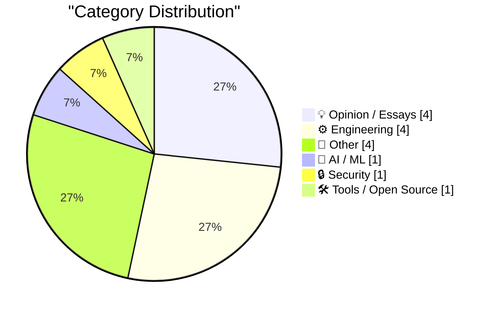
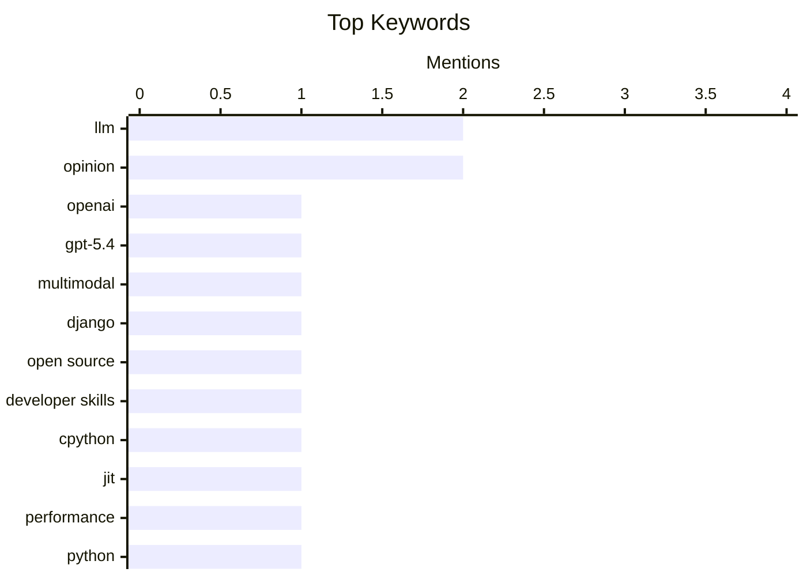

## Today's Highlights
Today's tech news highlights the rapid evolution of AI, with new efficient multimodal models emerging even as critical voices question the role of large language models in open-source development. Concurrently, core engineering efforts are driving significant performance gains in foundational languages like Python, while broader discussions tackle the inherent design challenges of modern systems, from surveillance capabilities to enforcing design guidelines. The digital frontier is also expanding, with new tools emerging for a decentralized "Small Web" and immersive 3D broadcasts pushing the boundaries of media consumption.
---
## Must Read Today
1. **GPT-5.4 mini and GPT-5.4 nano, which can describe 76,000 photos for $52**
[GPT-5.4 mini and GPT-5.4 nano, which can describe 76,000 photos for $52](https://simonwillison.net/2026/Mar/17/mini-and-nano/#atom-everything) — simonwillison.net · 18h ago · 🤖 AI / ML
> OpenAI has introduced new, more efficient multimodal AI models, GPT-5.4 mini and nano, joining the recently released GPT-5.4. Benchmarks indicate that the new 5.4-nano outperforms the previous GPT-5 mini at maximum reasoning effort. Furthermore, the new mini model is 2x faster than its predecessor. These models offer significant cost-effectiveness, with GPT-5.4 mini capable of describing 76,000 photos for just $52. This release demonstrates OpenAI's continued progress in delivering powerful and affordable AI capabilities for large-scale image description tasks.
💡 **Why read it**: It provides an early look at OpenAI's latest multimodal models, detailing their performance improvements and cost-efficiency for practical applications.
🏷️ OpenAI, GPT-5.4, LLM, multimodal
2. **Quoting Tim Schilling**
[Quoting Tim Schilling](https://simonwillison.net/2026/Mar/17/tim-schilling/#atom-everything) — simonwillison.net · 21h ago · 💡 Opinion / Essays
> Tim Schilling critiques the detrimental impact of using Large Language Models (LLMs) in open-source contributions, specifically within the Django community, when contributors lack genuine human understanding. He argues that if a contributor doesn't comprehend the ticket, solution, or PR feedback, their LLM use harms the project. Schilling emphasizes that open-source is a communal endeavor, and interacting with an LLM-generated "facade of a human" is demoralizing for reviewers. Over-reliance on LLMs without human comprehension undermines the collaborative and human-centric nature essential for open-source development.
💡 **Why read it**: It offers a critical perspective on the ethical and practical challenges of integrating LLMs into open-source collaboration, highlighting the importance of human understanding and community.
🏷️ LLM, Django, open source, developer skills
3. **Quoting Ken Jin**
[Quoting Ken Jin](https://simonwillison.net/2026/Mar/17/ken-jin/#atom-everything) — simonwillison.net · 16h ago · ⚙️ Engineering
> Ken Jin announced significant performance milestones for the CPython JIT (Just-In-Time) compiler project, achieving goals well ahead of schedule. The 3.15 alpha JIT is now approximately 11-12% faster on macOS AArch64 compared to the tail-calling interpreter. On x86_64 Linux, it demonstrates a 5-6% speed improvement over the standard interpreter. These performance targets were met over a year early for macOS AArch64 and a few months early for x86_64 Linux. The CPython JIT project is making strong progress, delivering notable performance gains on key platforms ahead of its initial timeline.
💡 **Why read it**: It provides concrete performance metrics and an optimistic update on the CPython JIT project, indicating future speed improvements for Python applications.
🏷️ CPython, JIT, performance, Python
---
## Data Overview
| Sources Scanned | Articles Fetched | Time Window | Selected |
|:---:|:---:|:---:|:---:|
| 78/92 | 2377 -> 15 | 24h | **15** |
### Category Distribution

### Top Keywords

<details>
<summary>Plain Text Keyword Chart (Terminal Friendly)</summary>
```
llm              │ ████████████████████ 2
opinion          │ ████████████████████ 2
openai           │ ██████████░░░░░░░░░░ 1
gpt-5.4          │ ██████████░░░░░░░░░░ 1
multimodal       │ ██████████░░░░░░░░░░ 1
django           │ ██████████░░░░░░░░░░ 1
open source      │ ██████████░░░░░░░░░░ 1
developer skills │ ██████████░░░░░░░░░░ 1
cpython          │ ██████████░░░░░░░░░░ 1
jit              │ ██████████░░░░░░░░░░ 1
```
</details>
### Topic Tags
**llm**(2) · **opinion**(2) · **openai**(1) · gpt-5.4(1) · multimodal(1) · django(1) · open source(1) · developer skills(1) · cpython(1) · jit(1) · performance(1) · python(1) · surveillance(1) · privacy(1) · communication(1) · data collection(1) · small web(1) · wander(1) · developer tool(1) · design guidelines(1)
---
## Opinion / Essays
### 1. Quoting Tim Schilling
[Quoting Tim Schilling](https://simonwillison.net/2026/Mar/17/tim-schilling/#atom-everything) — **simonwillison.net** · 21h ago · ⭐ 25/30
> Tim Schilling critiques the detrimental impact of using Large Language Models (LLMs) in open-source contributions, specifically within the Django community, when contributors lack genuine human understanding. He argues that if a contributor doesn't comprehend the ticket, solution, or PR feedback, their LLM use harms the project. Schilling emphasizes that open-source is a communal endeavor, and interacting with an LLM-generated "facade of a human" is demoralizing for reviewers. Over-reliance on LLMs without human comprehension undermines the collaborative and human-centric nature essential for open-source development.
🏷️ LLM, Django, open source, developer skills
---
### 2. Why Are We Still Doing This?
[Why Are We Still Doing This?](https://www.wheresyoured.at/why-are-we-still-doing-this/) — **wheresyoured.at** · 21h ago · ⭐ 21/30
> The article, primarily a call to action for a paid newsletter, implicitly questions the sustainability or common practices of content creation and monetization. The author promotes a premium newsletter for $70/year or $7/month, promising weekly content ranging from 5,000 to 185,000 words. The title "Why Are We Still Doing This?" suggests a critique of current content models or the extensive effort involved in producing such high-quality work. The piece serves as a direct appeal for reader support to sustain a specific model of in-depth, high-volume content creation, implicitly challenging the prevailing economics of online publishing.
🏷️ Industry Critique, Tech Culture, Opinion
---
### 3. Marc Andreessen is wrong about introspection
[Marc Andreessen is wrong about introspection](https://www.joanwestenberg.com/marc-andreessen-is-wrong-about-introspection/) — **joanwestenberg.com** · 7h ago · ⭐ 20/30
> The article critiques Marc Andreessen's views on introspection, arguing against his perspective. While the specific arguments of Andreessen are not detailed, the author states their newsletter is free but offers paid subscriptions for $2.50/month. These paid subscriptions provide extra posts, community access, and direct interaction with the author. This setup suggests a value proposition around deeper engagement and content, possibly contrasting with Andreessen's stance on self-reflection or personal development. The author positions their work and community as a counterpoint to Andreessen's ideas, emphasizing the value of deeper engagement and a different approach to personal or professional growth.
🏷️ Marc Andreessen, Introspection, Opinion, Tech Industry
---
### 4. ★ Squashing
[★ Squashing](https://daringfireball.net/2026/03/squashing) — **daringfireball.net** · 14h ago · ⭐ 13/30
> This article presents a strong critical commentary on a CNBC report, accusing its headline of being "journalistic malpractice." The author further asserts that the entirety of the report is even worse, implying significant factual inaccuracies or severe misrepresentation. The core problem addressed is the perceived low quality and ethical failings in financial journalism. The piece serves as a sharp critique of media standards and accuracy.
🏷️ Journalism, media, critique, CNBC
---
## Engineering
### 5. Quoting Ken Jin
[Quoting Ken Jin](https://simonwillison.net/2026/Mar/17/ken-jin/#atom-everything) — **simonwillison.net** · 16h ago · ⭐ 24/30
> Ken Jin announced significant performance milestones for the CPython JIT (Just-In-Time) compiler project, achieving goals well ahead of schedule. The 3.15 alpha JIT is now approximately 11-12% faster on macOS AArch64 compared to the tail-calling interpreter. On x86_64 Linux, it demonstrates a 5-6% speed improvement over the standard interpreter. These performance targets were met over a year early for macOS AArch64 and a few months early for x86_64 Linux. The CPython JIT project is making strong progress, delivering notable performance gains on key platforms ahead of its initial timeline.
🏷️ CPython, JIT, performance, Python
---
### 6. You Might Debate It — If You Could See It
[You Might Debate It — If You Could See It](https://blog.jim-nielsen.com/2026/opacity-of-generative-tools/) — **blog.jim-nielsen.com** · 19h ago · ⭐ 22/30
> The article discusses the challenge of establishing and enforcing design guidelines in an era where generative AI tools can obscure the origins and rationale behind design choices. The author presents hypothetical design guidelines, such as using expressive fonts, meaningful animations, and non-flat backgrounds. The core issue is that if designs are generated by AI, the underlying decisions and adherence to these guidelines become opaque. This opacity makes critical debate, understanding, or even enforcing thoughtful design principles difficult. The increasing use of generative AI in design risks hindering critical evaluation and the transparent application of design standards.
🏷️ Design Guidelines, UI/UX, Typography, Motion
---
### 7. Tighter bounds on alternating series remainder
[Tighter bounds on alternating series remainder](https://www.johndcook.com/blog/2026/03/17/alternating-series-remainder/) — **johndcook.com** · 11h ago · ⭐ 21/30
> The article delves into the alternating series test from calculus, specifically focusing on refining the bounds for the remainder when truncating such a series. The standard alternating series test states that the remainder is bounded by the first omitted term. The article implies exploring methods to derive tighter bounds than this basic rule, which is particularly useful in numerical computing for estimating error. Understanding and applying tighter bounds for alternating series remainders is a valuable technique for improving precision and error estimation in numerical computations.
🏷️ Calculus, numerical computing, mathematics, algorithms
---
### 8. Homelab downtime update: The fight for DNS supremacy
[Homelab downtime update: The fight for DNS supremacy](https://xeiaso.net/notes/2026/dns-fight/) — **xeiaso.net** · 14h ago · ⭐ 15/30
> This article provides a concise update regarding a homelab's operational status, specifically addressing a potential downtime event. The core topic revolves around an implied "fight for DNS supremacy," suggesting previous or ongoing challenges with DNS configuration or reliability within the homelab environment. The key finding is a positive outcome, confirming that the systems did not go offline as feared. This brief note serves as a status report on the homelab's stability.
🏷️ Homelab, DNS, downtime, networking
---
## Other
### 9. Fox Sports to Broadcast U.S.-Venezuela World Baseball Classic Final in Immersive 3D — But Not on Vision Pro
[Fox Sports to Broadcast U.S.-Venezuela World Baseball Classic Final in Immersive 3D — But Not on Vision Pro](https://x.com/mlbonfox/status/2033902946174271992?s=46) — **daringfireball.net** · 18h ago · ⭐ 21/30
> Fox Sports announced an immersive 3D broadcast of the World Baseball Classic Final, but notably excluded Apple Vision Pro users, instead targeting the Galaxy XR headset powered by Android XR. Fox Sports promoted the immersive experience via their Fox Sports XR app for the Galaxy XR headset. The author points out the discrepancy, noting that Fox Sports' native apps are available on iOS, Apple TV, and Apple Watch, but they lack a native VisionOS app. This decision highlights a potential fragmentation in the immersive content market, with major broadcasters choosing specific XR platforms over others.
🏷️ XR, Vision Pro, Android XR, Fox Sports
---
### 10. Pluralistic: William Gibson vs Margaret Thatcher (17 Mar 2026)
[Pluralistic: William Gibson vs Margaret Thatcher (17 Mar 2026)](https://pluralistic.net/2026/03/17/technopolitics/) — **pluralistic.net** · 22h ago · ⭐ 16/30
> This article serves as a curated daily digest from Cory Doctorow, presenting a collection of links and brief notes across various topics. It covers diverse subjects such as "William Gibson vs Margaret Thatcher: The Street Finds Its Own Alternatives For Things," "Prison for spamming," "Dotcom layoffs," "Ethernet action-figures," and "Alexa privacy Valdez." The post also includes updates on the author's upcoming and recent appearances, alongside book news. It functions as a concise overview of contemporary issues and interesting finds.
🏷️ Link aggregation, tech policy, society, current events
---
### 11. AOL history
[AOL history](https://dfarq.homeip.net/aol-history/?utm_source=rss&#038;utm_medium=rss&#038;utm_campaign=aol-history) — **dfarq.homeip.net** · 3h ago · ⭐ 14/30
> This article introduces the historical significance of America Online (AOL) as a pioneering online service. The core topic is AOL's journey to becoming the largest and most popular online platform despite not being the first. It highlights AOL's role as the initial gateway to the internet and modem technology for a generation of users. The article aims to explore how AOL achieved its widespread adoption and its lasting impact on early internet experiences.
🏷️ AOL, Tech History, Internet
---
### 12. Finding the right Bottom Hole paper
[Finding the right Bottom Hole paper](https://shkspr.mobi/blog/2026/03/finding-the-right-bottom-hole-paper/) — **shkspr.mobi** · 1h ago · ⭐ 7/30
> This article details an investigation into identifying a specific newspaper prop from the BBC Two series "Bottom." The core problem is pinpointing the exact "Bottom Hole paper" read by Captain Edrison Peavey Edward Elizabeth Hitler in the "Hole" episode, which aired on January 6, 1995. The approach involves a deep dive into the show's production details to uncover this specific prop. The article aims to satisfy a niche curiosity by precisely identifying the artifact.
🏷️ Comedy, BBC, Bottom, nostalgia
---
## AI / ML
### 13. GPT-5.4 mini and GPT-5.4 nano, which can describe 76,000 photos for $52
[GPT-5.4 mini and GPT-5.4 nano, which can describe 76,000 photos for $52](https://simonwillison.net/2026/Mar/17/mini-and-nano/#atom-everything) — **simonwillison.net** · 18h ago · ⭐ 28/30
> OpenAI has introduced new, more efficient multimodal AI models, GPT-5.4 mini and nano, joining the recently released GPT-5.4. Benchmarks indicate that the new 5.4-nano outperforms the previous GPT-5 mini at maximum reasoning effort. Furthermore, the new mini model is 2x faster than its predecessor. These models offer significant cost-effectiveness, with GPT-5.4 mini capable of describing 76,000 photos for just $52. This release demonstrates OpenAI's continued progress in delivering powerful and affordable AI capabilities for large-scale image description tasks.
🏷️ OpenAI, GPT-5.4, LLM, multimodal
---
## Security
### 14. Communication Is Surveillance by Design
[Communication Is Surveillance by Design](https://idiallo.com/blog/communication-is-surveillance-by-design?src=feed) — **idiallo.com** · 2h ago · ⭐ 24/30
> The article argues that modern communication systems are inherently designed with surveillance capabilities, using a scene from "The Bourne Supremacy" as an illustrative example. In the movie, the CIA attempts to trace Jason Bourne's call, demonstrating how communication infrastructure can be leveraged for location tracking. Bourne's ability to anticipate this highlights the inherent vulnerability of communication to monitoring. The author implies that this design principle extends beyond fictional scenarios to real-world systems. The fundamental architecture of contemporary communication platforms often prioritizes or enables surveillance, making privacy a constant challenge.
🏷️ Surveillance, privacy, communication, data collection
---
## Tools / Open Source
### 15. Wander the Small Web
[Wander the Small Web](https://susam.net/wander/) — **susam.net** · 14h ago · ⭐ 22/30
> The author introduces "Wander," a new tool designed to explore and grow a network of personal websites, aiming to foster the "small web." Wander is presented as a console for discovering personal sites, currently with a limited number of pages but with an explicit goal for expansion. The network is designed to grow through user participation, where individuals can set up their own Wander consoles and link to others, creating an interconnected web of independent sites. Wander offers a collaborative, decentralized approach to curating and navigating the small web, encouraging community-driven growth of personal online spaces.
🏷️ Small Web, Wander, Developer Tool
---
*Generated at 2026-03-18 14:07 | Scanned 78 sources -> 2377 articles -> selected 15*
*Based on the [Hacker News Popularity Contest 2025](https://refactoringenglish.com/tools/hn-popularity/) RSS source list recommended by [Andrej Karpathy](https://x.com/karpathy)*
*Produced by Dongdianr AI. Follow the same-name WeChat public account for more AI practical tips 💡*
