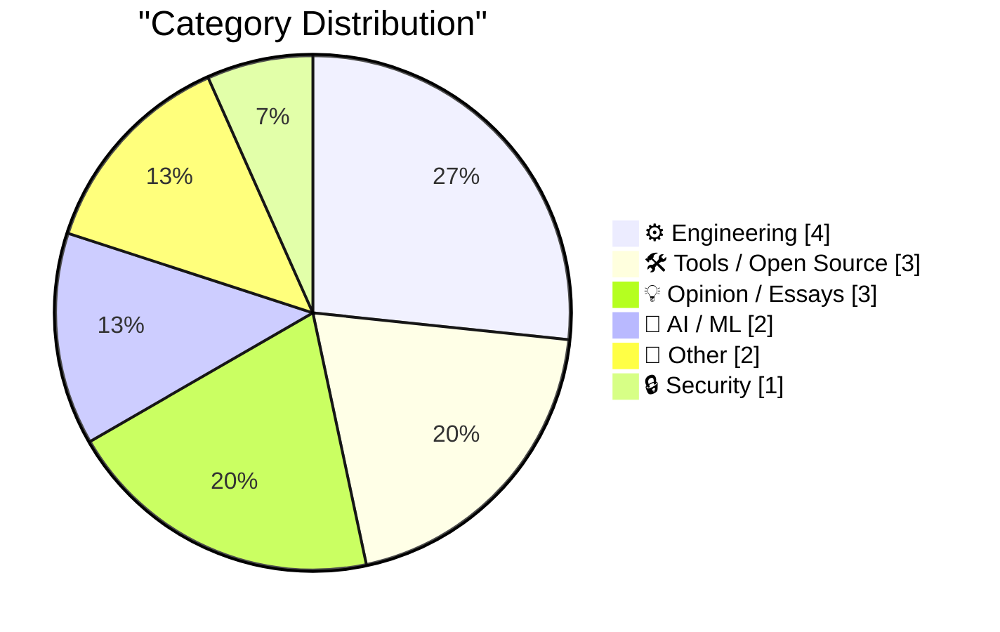
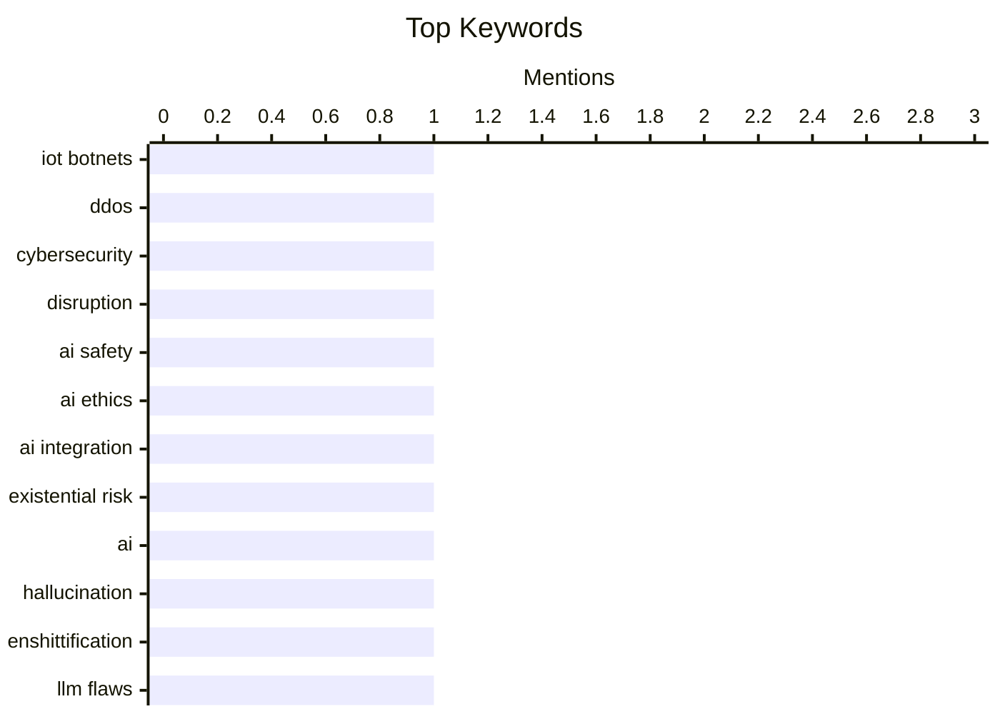

## Today's Highlights
Today's tech news highlights a nuanced view of artificial intelligence, with debates challenging AI alarmism alongside concerns about the "enshittification" of AI tools, even as major players like OpenAI expand their influence by acquiring key developer projects. Simultaneously, platform control and developer experience are in focus, as Google implements new Android sideloading restrictions and discussions emerge around web performance and essential development tooling. These shifts occur while federal agencies continue to combat significant security threats, successfully disrupting major IoT botnets responsible for widespread DDoS attacks.
---
## Must Read Today
1. **Feds Disrupt IoT Botnets Behind Huge DDoS Attacks**
[Feds Disrupt IoT Botnets Behind Huge DDoS Attacks](https://krebsonsecurity.com/2026/03/feds-disrupt-iot-botnets-behind-huge-ddos-attacks/) — krebsonsecurity.com · 13h ago · 🔒 Security
> Four highly disruptive IoT botnets—Aisuru, Kimwolf, JackSkid, and Mossad—were responsible for a series of record-smashing distributed denial-of-service (DDoS) attacks. The U.S. Justice Department, in collaboration with Canadian and German authorities, successfully dismantled the online infrastructure supporting these botnets. These operations targeted over three million hacked IoT devices, including routers and web cameras, which were used to launch massive DDoS attacks capable of knocking targets offline. This international law enforcement effort effectively disrupted significant cyber threats originating from compromised IoT devices. The main conclusion is that collaborative international action can effectively combat large-scale botnet operations.
💡 **Why read it**: It details a successful international law enforcement operation against major IoT botnets, highlighting the ongoing threat and collaborative efforts to combat large-scale DDoS attacks.
🏷️ IoT botnets, DDoS, cybersecurity, disruption
2. **Why Is Everyone Supposed to Die If Machines Can Think?**
[Why Is Everyone Supposed to Die If Machines Can Think?](https://idiallo.com/blog/everyone-is-supposed-to-die-when-machines-can-think?src=feed) — idiallo.com · 2h ago · 🤖 AI / ML
> The article challenges the alarmist narrative often presented by AI company spokespersons regarding AI's integration into the workplace and its potential existential threats. It argues that developers readily adopt AI into their workflows but prefer autonomy in how they use it, akin to individual preferences in development setups during pair programming. The author suggests that the focus should be on practical integration and individual developer agency rather than exaggerated fears. The real-world integration of AI in development is thus driven by individual utility and preference, not by a universal, dictated approach or existential threat. The main conclusion is that practical AI adoption is nuanced and user-driven, contrasting with industry hype.
💡 **Why read it**: It offers a grounded perspective on AI adoption in development, contrasting the industry's hype with the practical, individualistic ways developers integrate AI tools into their daily work.
🏷️ AI safety, AI ethics, AI integration, existential risk
3. **EnshittifAIcation**
[EnshittifAIcation](https://it-notes.dragas.net/2026/03/20/enshittifaication/) — it-notes.dragas.net · 3h ago · 🤖 AI / ML
> The article highlights the phenomenon of "EnshittifAIcation," where AI tools, despite their confident output, provide dangerously incorrect or nonsensical technical advice. It presents three specific examples from one week: an AI bot hallucinating VPN requirements, recommending Apache configurations for Nginx servers, and suggesting replacing 128 GB of RAM with a cloud VPS. These instances demonstrate AI's tendency to mistake confidence for competence, leading to potentially costly errors. The main conclusion is that relying on current AI for critical technical advice can be detrimental due to its propensity for confident but fundamentally flawed recommendations.
💡 **Why read it**: It provides concrete, recent examples of AI's "hallucinations" in technical contexts, serving as a cautionary tale against blindly trusting AI-generated solutions.
🏷️ AI, Hallucination, Enshittification, LLM Flaws
---
## Data Overview
| Sources Scanned | Articles Fetched | Time Window | Selected |
|:---:|:---:|:---:|:---:|
| 78/92 | 2378 -> 16 | 24h | **15** |
### Category Distribution

### Top Keywords

<details>
<summary>Plain Text Keyword Chart (Terminal Friendly)</summary>
```
iot botnets      │ ████████████████████ 1
ddos             │ ████████████████████ 1
cybersecurity    │ ████████████████████ 1
disruption       │ ████████████████████ 1
ai safety        │ ████████████████████ 1
ai ethics        │ ████████████████████ 1
ai integration   │ ████████████████████ 1
existential risk │ ████████████████████ 1
ai               │ ████████████████████ 1
hallucination    │ ████████████████████ 1
```
</details>
### Topic Tags
**iot botnets**(1) · **ddos**(1) · **cybersecurity**(1) · disruption(1) · ai safety(1) · ai ethics(1) · ai integration(1) · existential risk(1) · ai(1) · hallucination(1) · enshittification(1) · llm flaws(1) · openai(1) · astral(1) · python tools(1) · acquisition(1) · android(1) · sideloading(1) · app distribution(1) · google(1)
---
## Engineering
### 1. Google’s New Sideloading Restrictions for Android Include a 24-Hour Waiting Period
[Google’s New Sideloading Restrictions for Android Include a 24-Hour Waiting Period](https://www.androidauthority.com/google-android-sideloading-unverified-apps-new-rules-3650343/) — **daringfireball.net** · 19h ago · ⭐ 24/30
> Google is implementing new, high-friction sideloading restrictions for Android, significantly impacting users who install apps outside the Play Store. The new rules will introduce a 24-hour waiting period for installing unverified apps from developers. This change is part of Google's strategy to make sideloading a more difficult process, aiming to enhance security by discouraging installations from unknown sources. The main conclusion is that Google's new sideloading policy, including a 24-hour delay, will make installing apps outside the Play Store considerably more cumbersome for Android users.
🏷️ Android, sideloading, app distribution, Google
---
### 2. SQLAlchemy 2 In Practice - Chapter 1 - Database Setup
[SQLAlchemy 2 In Practice - Chapter 1 - Database Setup](https://blog.miguelgrinberg.com/post/sqlalchemy-2-in-practice---chapter-1---database-setup) — **miguelgrinberg.com** · 14h ago · ⭐ 24/30
> This article serves as the introductory chapter for a book on SQLAlchemy 2, focusing on setting up a database environment for practical learning. It aims to equip readers with the necessary system and database setup to run examples and exercises from the "SQLAlchemy 2 in Practice" book. The chapter is designed to be hands-on, providing foundational knowledge for working with relational databases in Python applications using SQLAlchemy 2. The main conclusion is that this first chapter provides the essential database setup instructions, enabling readers to follow along with the practical examples and exercises of the SQLAlchemy 2 in Practice book.
🏷️ SQLAlchemy, Python, Database, ORM
---
### 3. Hacker News Discussion on Shubham Bose’s ‘The 49MB Web Page’
[Hacker News Discussion on Shubham Bose’s ‘The 49MB Web Page’](https://news.ycombinator.com/item?id=47390945) — **daringfireball.net** · 20h ago · ⭐ 23/30
> The article discusses the detrimental impact of JavaScript on the web, arguing it transformed web pages from documents into embedded computer programs, leading to issues like excessively large web pages. The author contends that supporting scripting (JavaScript) in web browsers was a "terrible mistake." This decision is blamed for phenomena such as "49 MB web pages" and the rise of the "surveillance tracking industrial complex," which would not exist without scripting. The main conclusion is that the fundamental decision to enable JavaScript in browsers is seen as the root cause of many modern web problems, including bloat and privacy concerns.
🏷️ JavaScript, web performance, browser, web development
---
### 4. Package Manager Mirroring
[Package Manager Mirroring](https://nesbitt.io/2026/03/20/package-manager-mirroring.html) — **nesbitt.io** · 4h ago · ⭐ 22/30
> The article aims to document and explain various tools and underlying protocols for mirroring package managers. It provides an overview of every mirroring tool the author could find, along with the technical protocols that enable them. This suggests a comprehensive exploration of how different package managers (e.g., apt, yum, npm, pip) can be mirrored for local caching, offline use, or improved performance. The main conclusion is that the article serves as a valuable resource for understanding the landscape of package manager mirroring tools and their technical foundations.
🏷️ Package Manager, Mirroring, Protocols, DevOps
---
## Tools / Open Source
### 5. Thoughts on OpenAI acquiring Astral and uv/ruff/ty
[Thoughts on OpenAI acquiring Astral and uv/ruff/ty](https://simonwillison.net/2026/Mar/19/openai-acquiring-astral/#atom-everything) — **simonwillison.net** · 21h ago · ⭐ 24/30
> OpenAI has acquired Astral, the company behind significant open-source Python projects: uv, ruff, and ty. This acquisition means these increasingly "load-bearing" open-source tools for the Python ecosystem are now under OpenAI's ownership. uv is a fast Python package installer and resolver, ruff is an extremely fast Python linter, and ty is a type checker. This move raises questions about the future direction and community involvement for these critical projects. The main conclusion is that OpenAI's acquisition of Astral and its core Python tooling projects marks a significant shift for the Python open-source community, with implications for their development and governance.
🏷️ OpenAI, Astral, Python tools, acquisition
---
### 6. StopTheMadness Pro and StopTheScript Extensions for Safari
[StopTheMadness Pro and StopTheScript Extensions for Safari](https://mastodon.social/@lapcatsoftware/116252960395480568) — **daringfireball.net** · 16h ago · ⭐ 17/30
> Modern web browsing is often plagued by intrusive elements like autoplaying videos, sticky content, notification requests, and excessive JavaScript. Jeff Johnson's Safari extensions, StopTheMadness Pro and StopTheScript, address these issues. StopTheMadness Pro stops autoplaying videos, hides "Sign in with Google," sticky videos, and notification requests. For more extreme control, StopTheScript allows users to kill JavaScript entirely on selected websites, making pages like The Guardian more readable. The main conclusion is that these Safari extensions provide powerful tools for users to reclaim control over their browsing experience by blocking annoying and resource-intensive web elements.
🏷️ Safari, extensions, web browsing, privacy
---
### 7. ★ AppleScript: ‘Save MarsEdit Document to Text File’
[★ AppleScript: ‘Save MarsEdit Document to Text File’](https://daringfireball.net/2026/03/applescript_save_marsedit_document_to_text_file) — **daringfireball.net** · 21h ago · ⭐ 13/30
> This article introduces an AppleScript designed to address a workflow inefficiency by saving MarsEdit documents to a text file. The author emphasizes the importance of automating solutions for recurring workflow annoyances, noting the mystery of why this particular script wasn't shared sooner. The script aims to streamline the process of exporting content from MarsEdit. This AppleScript provides a practical solution for users needing to quickly save MarsEdit content in a plain text format.
🏷️ AppleScript, macOS, scripting, utility
---
## Opinion / Essays
### 8. I'm OK being left behind, thanks!
[I'm OK being left behind, thanks!](https://shkspr.mobi/blog/2026/03/im-ok-being-left-behind-thanks/) — **shkspr.mobi** · 1h ago · ⭐ 24/30
> The article addresses the pressure to adopt new, often unproven, technologies like cryptocurrencies due to the fear of "being left behind." The author recounts a past experience where they resisted adopting cryptocurrencies, preferring to wait until they were more useful, less volatile, easier to use, and reliable. This cautious stance was met with the "don't want to get left behind" argument, which the author finds bizarre. The main conclusion is that it advocates for a cautious approach to new technologies, prioritizing utility and reliability over the fear of missing out on early adoption.
🏷️ Cryptocurrency, Hype Cycle, Tech Adoption, Opinion
---
### 9. Members Only: How do we define our own flourishing?
[Members Only: How do we define our own flourishing?](https://www.joanwestenberg.com/members-only-how-do-we-define-our-own-flourishing/) — **joanwestenberg.com** · 13h ago · ⭐ 17/30
> This article introduces Nikolai Kardashev's framework for classifying civilizations based on their energy harnessing capabilities. The Soviet Astrophysicist proposed three types: Type I controls its home planet's energy budget, Type II controls a star's energy, and Type III controls a galaxy's energy. By Kardashev's measure, humanity is currently far from even achieving Type I status. This framework provides a grand-scale perspective on civilizational progress and energy mastery.
🏷️ Kardashev Scale, Civilization, Philosophy
---
### 10. The Day Mark Simonson Discovered Type Design
[The Day Mark Simonson Discovered Type Design](https://www.marksimonson.com/notebook/view/the-day-i-discovered-type-design/) — **daringfireball.net** · 18h ago · ⭐ 16/30
> This article recounts Mark Simonson's pivotal moment of discovering type design and his subsequent career aspiration. Simonson encountered a copy of U&lc magazine, published by ITC (International Typeface Corporation) and edited by the legendary Herb Lubalin, in a graphics classroom. The magazine's beautiful typography and design profoundly inspired him. This experience solidified his ambition to become a typeface designer.
🏷️ type design, typography, design history
---
## AI / ML
### 11. Why Is Everyone Supposed to Die If Machines Can Think?
[Why Is Everyone Supposed to Die If Machines Can Think?](https://idiallo.com/blog/everyone-is-supposed-to-die-when-machines-can-think?src=feed) — **idiallo.com** · 2h ago · ⭐ 26/30
> The article challenges the alarmist narrative often presented by AI company spokespersons regarding AI's integration into the workplace and its potential existential threats. It argues that developers readily adopt AI into their workflows but prefer autonomy in how they use it, akin to individual preferences in development setups during pair programming. The author suggests that the focus should be on practical integration and individual developer agency rather than exaggerated fears. The real-world integration of AI in development is thus driven by individual utility and preference, not by a universal, dictated approach or existential threat. The main conclusion is that practical AI adoption is nuanced and user-driven, contrasting with industry hype.
🏷️ AI safety, AI ethics, AI integration, existential risk
---
### 12. EnshittifAIcation
[EnshittifAIcation](https://it-notes.dragas.net/2026/03/20/enshittifaication/) — **it-notes.dragas.net** · 3h ago · ⭐ 26/30
> The article highlights the phenomenon of "EnshittifAIcation," where AI tools, despite their confident output, provide dangerously incorrect or nonsensical technical advice. It presents three specific examples from one week: an AI bot hallucinating VPN requirements, recommending Apache configurations for Nginx servers, and suggesting replacing 128 GB of RAM with a cloud VPS. These instances demonstrate AI's tendency to mistake confidence for competence, leading to potentially costly errors. The main conclusion is that relying on current AI for critical technical advice can be detrimental due to its propensity for confident but fundamentally flawed recommendations.
🏷️ AI, Hallucination, Enshittification, LLM Flaws
---
## Other
### 13. The first 3Dfx card: Orchid Righteous 3D
[The first 3Dfx card: Orchid Righteous 3D](https://dfarq.homeip.net/the-first-3dfx-card-orchid-righteous-3d/?utm_source=rss&#038;utm_medium=rss&#038;utm_campaign=the-first-3dfx-card-orchid-righteous-3d) — **dfarq.homeip.net** · 3h ago · ⭐ 16/30
> This article details the introduction of the Orchid Righteous 3D, the first consumer graphics card utilizing 3Dfx technology. Announced by Orchid Technologies on March 20, 1996, the card retailed for $299. It received FCC certification on July 24, 1996, and hit retail shelves on October 6, 1996, notably preceding Diamond Multimedia’s offering. The Orchid Righteous 3D marked a significant milestone as the pioneering 3Dfx-based consumer graphics accelerator.
🏷️ 3Dfx, Graphics Card, History
---
### 14. Actual Headline in the Actual New York Times: ‘Trump Jokes About Pearl Harbor in Meeting With Japan’s Leader’
[Actual Headline in the Actual New York Times: ‘Trump Jokes About Pearl Harbor in Meeting With Japan’s Leader’](https://www.nytimes.com/2026/03/19/us/politics/trump-japan-pearl-harbor-oval-office-takaichi.html?unlocked_article_code=1.UVA.zau0.UZ5WnBjtPHot) — **daringfireball.net** · 17h ago · ⭐ 8/30
> This article reports on a controversial remark made by former President Trump during a meeting with Japan's leader. Responding to a question about the lack of advance notice for a U.S.-Israeli assault on Iran, Trump stated, "We didn’t tell anybody about it because we wanted surprise." He then added, "Who knows better about surprise than Japan, OK? Why didn’t you tell me about Pearl Harbor, OK? Right?", eliciting laughter from attendees. The incident highlights a moment of diplomatic insensitivity and the use of historical events in a jocular context during high-level international discussions.
🏷️ politics, Trump, NYT
---
## Security
### 15. Feds Disrupt IoT Botnets Behind Huge DDoS Attacks
[Feds Disrupt IoT Botnets Behind Huge DDoS Attacks](https://krebsonsecurity.com/2026/03/feds-disrupt-iot-botnets-behind-huge-ddos-attacks/) — **krebsonsecurity.com** · 13h ago · ⭐ 27/30
> Four highly disruptive IoT botnets—Aisuru, Kimwolf, JackSkid, and Mossad—were responsible for a series of record-smashing distributed denial-of-service (DDoS) attacks. The U.S. Justice Department, in collaboration with Canadian and German authorities, successfully dismantled the online infrastructure supporting these botnets. These operations targeted over three million hacked IoT devices, including routers and web cameras, which were used to launch massive DDoS attacks capable of knocking targets offline. This international law enforcement effort effectively disrupted significant cyber threats originating from compromised IoT devices. The main conclusion is that collaborative international action can effectively combat large-scale botnet operations.
🏷️ IoT botnets, DDoS, cybersecurity, disruption
---
*Generated at 2026-03-20 14:07 | Scanned 78 sources -> 2378 articles -> selected 15*
*Based on the [Hacker News Popularity Contest 2025](https://refactoringenglish.com/tools/hn-popularity/) RSS source list recommended by [Andrej Karpathy](https://x.com/karpathy)*
*Produced by Dongdianr AI. Follow the same-name WeChat public account for more AI practical tips 💡*
