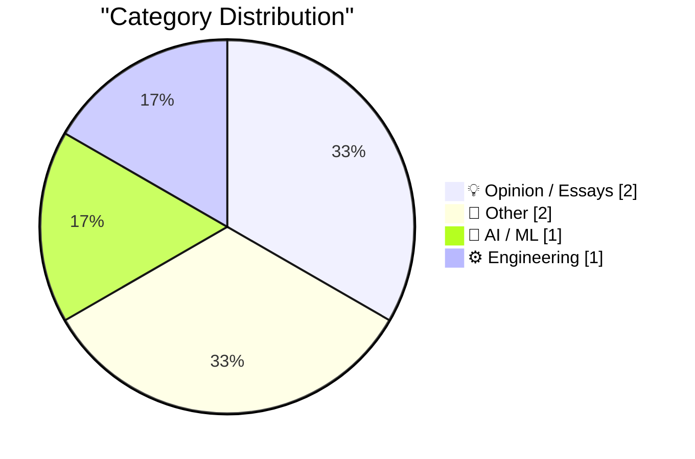
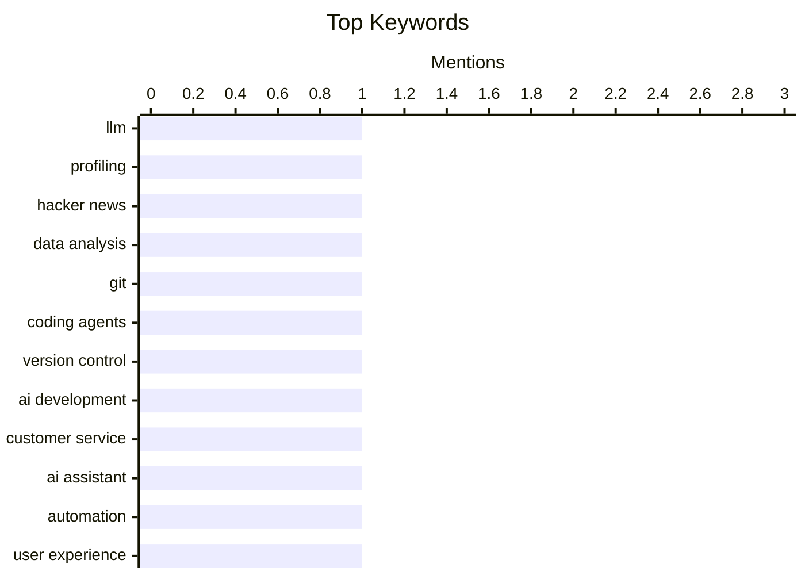

## Today's Highlights
Today's tech highlights reveal a dual focus on advanced automation and strategic product development. AI and machine learning are increasingly central, enabling everything from detailed user profiling to sophisticated agentic engineering with robust version control. Simultaneously, companies are scrutinizing their product strategies, emphasizing genuine customer value over internal priorities, as evidenced by major players planning ambitious market re-entries.
---
## Must Read Today
1. **Profiling Hacker News users based on their comments**
[Profiling Hacker News users based on their comments](https://simonwillison.net/2026/Mar/21/profiling-hacker-news-users/#atom-everything) — simonwillison.net · 14h ago · 🤖 AI / ML
> This article explores the concept of profiling Hacker News users by analyzing their comment history, framing it as a "mildly dystopian" experiment. It details how to easily obtain a user's last 1,000 comments using the Algolia Hacker News API, specifically by filtering comments tagged with `author_username`. The process involves querying the API for a specific user's comments sorted by date. This method provides a straightforward way to gather extensive data for user profiling experiments, highlighting the accessibility of public comment data.
💡 **Why read it**: It demonstrates a practical, albeit ethically ambiguous, application of public API data for user profiling, offering insights into data extraction techniques.
🏷️ LLM, profiling, Hacker News, data analysis
2. **Using Git with coding agents**
[Using Git with coding agents](https://simonwillison.net/guides/agentic-engineering-patterns/using-git-with-coding-agents/#atom-everything) — simonwillison.net · 15h ago · ⚙️ Engineering
> This article emphasizes Git's crucial role in agentic engineering, enabling robust version control for code developed by AI agents. Git allows recording code changes over time, investigating issues, and reversing mistakes, which is essential given that coding agents are fluent in both basic and advanced Git features. This fluency empowers developers to be more ambitious in their Git usage, offloading complex version control tasks to agents. Integrating Git with coding agents thus enhances development workflows by providing reliable change tracking and error recovery, leveraging agents' inherent Git capabilities.
💡 **Why read it**: It highlights how Git's capabilities are extended and leveraged in the context of AI-driven coding agents, offering a practical pattern for agentic engineering.
🏷️ Git, coding agents, version control, AI development
3. **Bored of eating your own dogfood? Try smelling your own farts!**
[Bored of eating your own dogfood? Try smelling your own farts!](https://shkspr.mobi/blog/2026/03/bored-of-eating-your-own-dogfood-try-smelling-your-own-farts/) — shkspr.mobi · 1h ago · 💡 Opinion / Essays
> The article critiques companies that prioritize self-serving digital solutions over genuine customer support, leading to frustrating user experiences. It illustrates this with an anecdote of a large company pushing website FAQs, online account management, and AI chat via WhatsApp, resulting in "higher than expected" call volumes. The author suggests this indicates a disconnect where internal metrics, such as reducing call center costs, overshadow actual customer needs. The piece advocates for a more critical, customer-centric approach to product and service development, moving beyond internal "dogfooding" to truly understand external user pain points.
💡 **Why read it**: It offers a humorous yet sharp critique of common corporate practices that prioritize internal efficiency over customer experience, urging a shift in perspective.
🏷️ customer service, AI assistant, automation, user experience
---
## Data Overview
| Sources Scanned | Articles Fetched | Time Window | Selected |
|:---:|:---:|:---:|:---:|
| 89/92 | 2526 -> 6 | 24h | **6** |
### Category Distribution

### Top Keywords

<details>
<summary>Plain Text Keyword Chart (Terminal Friendly)</summary>
```
llm              │ ████████████████████ 1
profiling        │ ████████████████████ 1
hacker news      │ ████████████████████ 1
data analysis    │ ████████████████████ 1
git              │ ████████████████████ 1
coding agents    │ ████████████████████ 1
version control  │ ████████████████████ 1
ai development   │ ████████████████████ 1
customer service │ ████████████████████ 1
ai assistant     │ ████████████████████ 1
```
</details>
### Topic Tags
**llm**(1) · **profiling**(1) · **hacker news**(1) · data analysis(1) · git(1) · coding agents(1) · version control(1) · ai development(1) · customer service(1) · ai assistant(1) · automation(1) · user experience(1) · amazon(1) · smartphone(1) · product strategy(1) · vintage computing(1) · hardware(1) · refurbishment(1) · energy policy(1) · green energy(1)
---
## Opinion / Essays
### 1. Bored of eating your own dogfood? Try smelling your own farts!
[Bored of eating your own dogfood? Try smelling your own farts!](https://shkspr.mobi/blog/2026/03/bored-of-eating-your-own-dogfood-try-smelling-your-own-farts/) — **shkspr.mobi** · 1h ago · ⭐ 21/30
> The article critiques companies that prioritize self-serving digital solutions over genuine customer support, leading to frustrating user experiences. It illustrates this with an anecdote of a large company pushing website FAQs, online account management, and AI chat via WhatsApp, resulting in "higher than expected" call volumes. The author suggests this indicates a disconnect where internal metrics, such as reducing call center costs, overshadow actual customer needs. The piece advocates for a more critical, customer-centric approach to product and service development, moving beyond internal "dogfooding" to truly understand external user pain points.
🏷️ customer service, AI assistant, automation, user experience
---
### 2. Waarom we nu WEL zuinig moeten doen, en door moeten met groene energie
[Waarom we nu WEL zuinig moeten doen, en door moeten met groene energie](https://berthub.eu/articles/posts/waarom-we-nu-wel-zuinig-moeten-doen-en-meer-groene-energie/) — **berthub.eu** · 4h ago · ⭐ 14/30
> This article argues for the necessity of energy conservation and continued investment in green energy, despite Dutch ministers downplaying shortages. It contrasts the International Energy Agency's call for conservation due to Middle East conflicts with the Dutch government's assertion of no local shortages, drawing a parallel to the "COVID stays in Brabant" sentiment. The author emphasizes that rising fuel prices already indicate impending shortages and that summer is an opportune time for smart energy use. The piece advocates for proactive energy conservation and accelerated green energy transition, stressing that global energy issues will inevitably impact local markets regardless of official reassurances.
🏷️ energy policy, green energy, geopolitics
---
## Other
### 3. Reuters: ‘Amazon Plans Smartphone Comeback More Than a Decade After Fire Phone Flop’
[Reuters: ‘Amazon Plans Smartphone Comeback More Than a Decade After Fire Phone Flop’](https://www.reuters.com/technology/amazon-plans-smartphone-comeback-more-than-decade-after-fire-phone-flop-2026-03-20/) — **daringfireball.net** · 13h ago · ⭐ 19/30
> Amazon is reportedly planning a new smartphone comeback, internally codenamed "Transformer," over a decade after the failure of its Fire Phone. Developed within its devices and services unit, the phone is envisioned as a "mobile personalization device" designed to sync with Alexa and serve as a constant conduit to Amazon's ecosystem. Its personalization features aim to streamline purchasing from Amazon.com and content consumption. This new venture signals Amazon's renewed ambition to integrate its services more deeply into users' daily lives through a dedicated mobile hardware platform.
🏷️ Amazon, smartphone, product strategy
---
### 4. Refurb weekend double header: Alpha Micro AM-1000E and AM-1200
[Refurb weekend double header: Alpha Micro AM-1000E and AM-1200](https://oldvcr.blogspot.com/feeds/7375694156480962258/comments/default) — **oldvcr.blogspot.com** · 10h ago · ⭐ 14/30
> This article details the refurbishment of two vintage Alpha Micro systems, an AM-1000E and an AM-1200, highlighting the author's affection for these obscure 1980s-1990s computers. Alpha Micro systems were sophisticated 68000-based multiuser machines used in various vertical markets, such as party supply stores and 9-1-1 emergency dispatch centers. The refurbishment process likely involved addressing common issues with aging hardware to restore functionality. This "double header" project underscores the enduring appeal and historical significance of Alpha Micro computers for vintage computing enthusiasts.
🏷️ vintage computing, hardware, refurbishment
---
## AI / ML
### 5. Profiling Hacker News users based on their comments
[Profiling Hacker News users based on their comments](https://simonwillison.net/2026/Mar/21/profiling-hacker-news-users/#atom-everything) — **simonwillison.net** · 14h ago · ⭐ 24/30
> This article explores the concept of profiling Hacker News users by analyzing their comment history, framing it as a "mildly dystopian" experiment. It details how to easily obtain a user's last 1,000 comments using the Algolia Hacker News API, specifically by filtering comments tagged with `author_username`. The process involves querying the API for a specific user's comments sorted by date. This method provides a straightforward way to gather extensive data for user profiling experiments, highlighting the accessibility of public comment data.
🏷️ LLM, profiling, Hacker News, data analysis
---
## Engineering
### 6. Using Git with coding agents
[Using Git with coding agents](https://simonwillison.net/guides/agentic-engineering-patterns/using-git-with-coding-agents/#atom-everything) — **simonwillison.net** · 15h ago · ⭐ 24/30
> This article emphasizes Git's crucial role in agentic engineering, enabling robust version control for code developed by AI agents. Git allows recording code changes over time, investigating issues, and reversing mistakes, which is essential given that coding agents are fluent in both basic and advanced Git features. This fluency empowers developers to be more ambitious in their Git usage, offloading complex version control tasks to agents. Integrating Git with coding agents thus enhances development workflows by providing reliable change tracking and error recovery, leveraging agents' inherent Git capabilities.
🏷️ Git, coding agents, version control, AI development
---
*Generated at 2026-03-22 14:01 | Scanned 89 sources -> 2526 articles -> selected 6*
*Based on the [Hacker News Popularity Contest 2025](https://refactoringenglish.com/tools/hn-popularity/) RSS source list recommended by [Andrej Karpathy](https://x.com/karpathy)*
*Produced by Dongdianr AI. Follow the same-name WeChat public account for more AI practical tips 💡*
