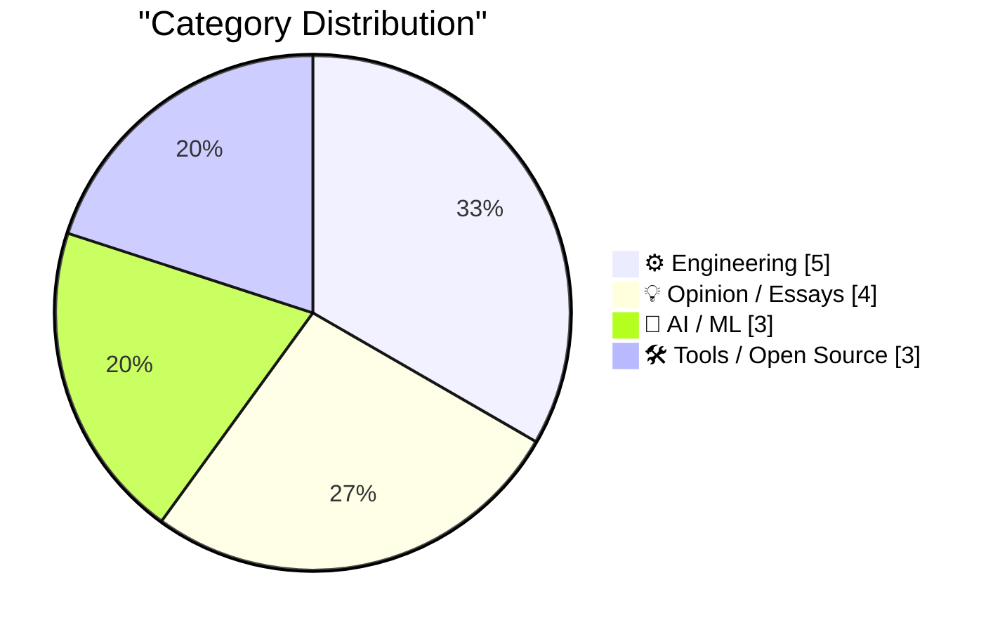
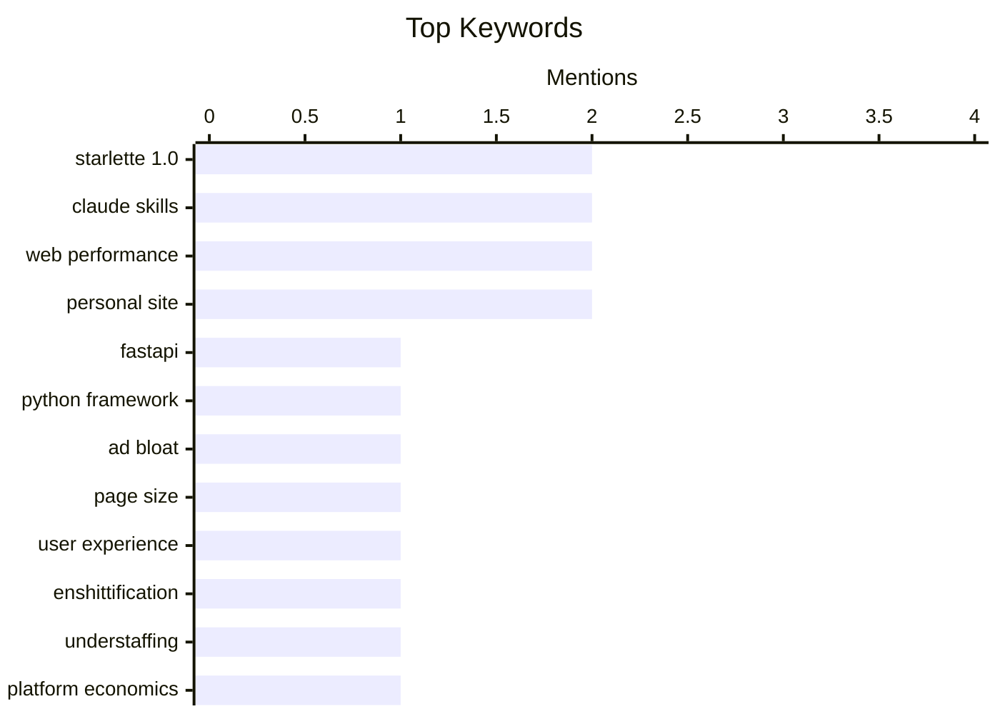

## Today's Highlights
Today's tech news showcases a vibrant landscape of new developer tools and AI/ML advancements, including the foundational Starlette 1.0 framework and innovative video APIs. Yet, this progress is met with sharp industry critiques, highlighting pressing issues like the pervasive problem of excessive web advertising and corporate strategies leading to "enshittification." These discussions prompt a re-evaluation of tech's impact, contrasting innovation with growing concerns over user experience and ethical practices.
---
## Must Read Today
1. **Experimenting with Starlette 1.0 with Claude skills**
[Experimenting with Starlette 1.0 with Claude skills](https://simonwillison.net/2026/Mar/22/starlette/#atom-everything) — simonwillison.net · 14h ago · 🤖 AI / ML
> This article announces the release of Starlette 1.0, highlighting its significance as a foundational Python web framework, despite often being overshadowed by FastAPI which it underpins. Starlette, initiated by Kim Christie in 2018, has achieved widespread usage, making its 1.0 release a major milestone. The author explores integrating Starlette 1.0 with Claude AI, suggesting experimentation with AI-driven development or interaction. This marks a significant step for a framework crucial to many modern Python web applications. The article underscores Starlette's quiet but pervasive influence in the Python ecosystem.
💡 **Why read it**: It highlights the importance of Starlette 1.0, a foundational Python web framework, and its potential integration with AI tools like Claude.
🏷️ Starlette 1.0, FastAPI, Claude skills, Python framework
2. **Half a Gigabyte of Ads**
[Half a Gigabyte of Ads](https://stuartbreckenridge.net/2026-03-19-pc-gamer-recommends-rss-readers-in-a-37mb-article/) — daringfireball.net · 21h ago · 💡 Opinion / Essays
> This article addresses the critical problem of excessive data consumption by web pages due to advertising. Stuart Breckenridge observed a PC Gamer webpage that, while initially 37MB, downloaded nearly half a gigabyte of new ads within just five minutes. The author condemns this practice as "irresponsible and unprofessional," advocating for browser-level intervention. It is proposed that web browsers should implement default page load caps, perhaps at 5 MB, and require explicit user consent for any additional content downloads. This measure aims to protect users from egregious data usage and improve web performance.
💡 **Why read it**: It exposes the critical problem of excessive data usage by web ads and proposes a browser-level solution for user protection.
🏷️ web performance, ad bloat, page size, user experience
3. **Pluralistic: Understaffing as a form of enshittification (23 Mar 2026)**
[Pluralistic: Understaffing as a form of enshittification (23 Mar 2026)](https://pluralistic.net/2026/03/22/nobodys-home/) — pluralistic.net · 8h ago · 💡 Opinion / Essays
> This article discusses understaffing as a deliberate corporate strategy leading to "enshittification," a term coined by Cory Doctorow. It argues that understaffing serves as a mechanism to shift value from workers, patients, and shoppers directly to investors. This process results in a degradation of service quality and overall user experience for the sake of increased profit margins. The piece frames understaffing as a systemic issue designed to benefit capital at the expense of human well-being and product/service integrity. The article also touches on related topics like AI's limitations and copyfight discipline.
💡 **Why read it**: It offers a critical perspective on corporate strategies like understaffing, linking them to the concept of "enshittification" and value transfer.
🏷️ enshittification, understaffing, platform economics, AI impact
---
## Data Overview
| Sources Scanned | Articles Fetched | Time Window | Selected |
|:---:|:---:|:---:|:---:|
| 89/92 | 2526 -> 19 | 24h | **15** |
### Category Distribution

### Top Keywords

<details>
<summary>Plain Text Keyword Chart (Terminal Friendly)</summary>
```
starlette 1.0    │ ████████████████████ 2
claude skills    │ ████████████████████ 2
web performance  │ ████████████████████ 2
personal site    │ ████████████████████ 2
fastapi          │ ██████████░░░░░░░░░░ 1
python framework │ ██████████░░░░░░░░░░ 1
ad bloat         │ ██████████░░░░░░░░░░ 1
page size        │ ██████████░░░░░░░░░░ 1
user experience  │ ██████████░░░░░░░░░░ 1
enshittification │ ██████████░░░░░░░░░░ 1
```
</details>
### Topic Tags
**starlette 1.0**(2) · **claude skills**(2) · **web performance**(2) · personal site(2) · fastapi(1) · python framework(1) · ad bloat(1) · page size(1) · user experience(1) · enshittification(1) · understaffing(1) · platform economics(1) · ai impact(1) · crdts(1) · version control(1) · merge visualizer(1) · distributed systems(1) · tech industry(1) · startup culture(1) · critique(1)
---
## Engineering
### 1. Hitachi Ltd, Part I
[Hitachi Ltd, Part I](https://www.abortretry.fail/p/hitachi-ltd-part-i) — **abortretry.fail** · 13h ago · ⭐ 19/30
> This article, titled "Hitachi Ltd, Part I," initiates an in-depth exploration into the history and operations of the Japanese conglomerate, Kabushikigaisha Hitachi Seisaku-sho. As the first installment, it likely covers the foundational aspects, early development, or initial business ventures that established Hitachi. The piece sets the stage for a comprehensive understanding of the company's evolution and its multifaceted contributions across various industries. It aims to provide readers with a foundational insight into one of the world's prominent technology and industrial giants. This article serves as an introduction to the extensive legacy of Hitachi Ltd.
🏷️ Hitachi, company history, Japanese tech
---
### 2. JavaScript Sandboxing Research
[JavaScript Sandboxing Research](https://simonwillison.net/2026/Mar/22/javascript-sandboxing-research/#atom-everything) — **simonwillison.net** · 18h ago · ⭐ 17/30
> This research explores effective methods for running untrusted JavaScript code in a secure sandbox environment, specifically investigating Node.js worker threads. Inspired by Aaron Harper's work on Node.js worker threads, Simon Willison initiated research into their suitability for sandboxing. Claude Code's contribution expanded this to a comparison of various JavaScript sandboxing techniques, including `vm.runInContext`, `vm.runInNewContext`, `vm.Script`, `Web Workers`, `Node.js Worker Threads`, and `Deno's isolate API`. The research aims to identify robust solutions for isolating execution. The research provides a valuable comparison of different JavaScript sandboxing approaches, highlighting their respective strengths and weaknesses for secure code execution.
🏷️ JavaScript, sandboxing, Node.js, worker threads
---
### 3. More Details Than You Probably Wanted to Know About Recent Updates to My Notes Site
[More Details Than You Probably Wanted to Know About Recent Updates to My Notes Site](https://blog.jim-nielsen.com/2026/notes-site-updates/) — **blog.jim-nielsen.com** · 19h ago · ⭐ 17/30
> The author details recent, seemingly minor updates to his personal notes site, emphasizing the importance of small design and architectural decisions. Updates include giving each post its own unique URL, implementing a new "related posts" feature based on shared tags, and adding a "back to top" link for improved navigation. He discusses using a custom `data-` attribute for the "back to top" link instead of a standard `href="#top"` for better control. The site's static generation process involves converting Markdown to HTML, then using `jsdom` to parse and manipulate the HTML for features like related posts. Even small, iterative improvements to a personal site involve numerous deliberate technical choices that collectively enhance user experience and site functionality.
🏷️ web development, personal site, static site
---
### 4. Beats now have notes
[Beats now have notes](https://simonwillison.net/2026/Mar/23/beats-now-have-notes/#atom-everything) — **simonwillison.net** · 11h ago · ⭐ 16/30
> Simon Willison enhanced his blog's "beats" feature, which aggregates content from external sources, by adding descriptive notes to provide context. Introduced last month, "beats" pull content from various external sources onto the homepage and archive pages, often outnumbering regular posts. Previously, these beats lacked explanation beyond a link, making them less informative. The update allows adding an optional "note" field to each beat, providing a brief description or context for the linked content. Adding descriptive notes significantly improves the utility and user experience of the "beats" feature by providing immediate context for aggregated external content.
🏷️ blog feature, content aggregation, personal site
---
### 5. PCGamer Article Performance Audit
[PCGamer Article Performance Audit](https://simonwillison.net/2026/Mar/22/pcgamer-audit/#atom-everything) — **simonwillison.net** · 15h ago · ⭐ 16/30
> This research documents a severe web performance issue on a PC Gamer article, which exhibited excessive page weight and resource consumption. Prompted by Stuart Breckenridge's observation of a 37MB PC Gamer article that continuously downloaded more data, Simon Willison conducted an audit. The audit revealed that the article, "PC Gamer Recommends RSS Readers," initially loaded over 37MB and subsequently downloaded hundreds more MBs due to auto-playing video ads. The audit involved using Chrome's developer tools to analyze network requests and identify the culprits for the bloat. The audit starkly illustrates how aggressive advertising, particularly auto-playing video, can lead to catastrophic web performance and a poor user experience, emphasizing the need for stricter content delivery practices.
🏷️ web performance, page load, audit, web bloat
---
## Opinion / Essays
### 6. Half a Gigabyte of Ads
[Half a Gigabyte of Ads](https://stuartbreckenridge.net/2026-03-19-pc-gamer-recommends-rss-readers-in-a-37mb-article/) — **daringfireball.net** · 21h ago · ⭐ 26/30
> This article addresses the critical problem of excessive data consumption by web pages due to advertising. Stuart Breckenridge observed a PC Gamer webpage that, while initially 37MB, downloaded nearly half a gigabyte of new ads within just five minutes. The author condemns this practice as "irresponsible and unprofessional," advocating for browser-level intervention. It is proposed that web browsers should implement default page load caps, perhaps at 5 MB, and require explicit user consent for any additional content downloads. This measure aims to protect users from egregious data usage and improve web performance.
🏷️ web performance, ad bloat, page size, user experience
---
### 7. Pluralistic: Understaffing as a form of enshittification (23 Mar 2026)
[Pluralistic: Understaffing as a form of enshittification (23 Mar 2026)](https://pluralistic.net/2026/03/22/nobodys-home/) — **pluralistic.net** · 8h ago · ⭐ 25/30
> This article discusses understaffing as a deliberate corporate strategy leading to "enshittification," a term coined by Cory Doctorow. It argues that understaffing serves as a mechanism to shift value from workers, patients, and shoppers directly to investors. This process results in a degradation of service quality and overall user experience for the sake of increased profit margins. The piece frames understaffing as a systemic issue designed to benefit capital at the expense of human well-being and product/service integrity. The article also touches on related topics like AI's limitations and copyfight discipline.
🏷️ enshittification, understaffing, platform economics, AI impact
---
### 8. Changing the World
[Changing the World](https://geohot.github.io//blog/jekyll/update/2026/03/23/changing-the-world.html) — **geohot.github.io** · 22h ago · ⭐ 24/30
> George Hotz (geohot) reflects on the common phrase "changing the world" and his cynical interpretation of its true meaning. He notes that he perceives the phrase differently from others, often seeing it as a euphemism for self-interest. Hotz references his 2017 song, where the line "Changing the world is just a euphemism, for how can I, get you, to give more stuff to me" encapsulates his view. The article suggests that this phrase is frequently used to mask underlying motivations of financial gain or personal benefit. It prompts readers to critically examine the intentions behind such grand statements.
🏷️ tech industry, startup culture, critique, geohot
---
### 9. "Collaboration" is bullshit.
["Collaboration" is bullshit.](https://www.joanwestenberg.com/collaboration-is-bullshit/) — **joanwestenberg.com** · 14h ago · ⭐ 18/30
> The article critically examines the modern corporate understanding and implementation of "collaboration," arguing it often hinders productivity and individual contribution. It suggests that true collaboration is rare and frequently confused with constant meetings, consensus-seeking, and a lack of clear individual ownership, leading to decision paralysis and diluted accountability. The author advocates for clear roles, individual responsibility, and focused work over performative group activities. Effective work often requires periods of deep, individual focus, and organizations should prioritize creating environments that support this rather than enforcing superficial "collaboration."
🏷️ collaboration, workplace culture, teamwork
---
## AI / ML
### 10. Experimenting with Starlette 1.0 with Claude skills
[Experimenting with Starlette 1.0 with Claude skills](https://simonwillison.net/2026/Mar/22/starlette/#atom-everything) — **simonwillison.net** · 14h ago · ⭐ 27/30
> This article announces the release of Starlette 1.0, highlighting its significance as a foundational Python web framework, despite often being overshadowed by FastAPI which it underpins. Starlette, initiated by Kim Christie in 2018, has achieved widespread usage, making its 1.0 release a major milestone. The author explores integrating Starlette 1.0 with Claude AI, suggesting experimentation with AI-driven development or interaction. This marks a significant step for a framework crucial to many modern Python web applications. The article underscores Starlette's quiet but pervasive influence in the Python ecosystem.
🏷️ Starlette 1.0, FastAPI, Claude skills, Python framework
---
### 11. Starlette 1.0 skill
[Starlette 1.0 skill](https://simonwillison.net/2026/Mar/23/starlette-1-skill/#atom-everything) — **simonwillison.net** · 13h ago · ⭐ 19/30
> This article points to ongoing research into a "Starlette 1.0 skill," building upon previous experimentation with Starlette 1.0 and Claude AI. The research, hosted on GitHub, likely explores how AI, specifically Claude, can develop or utilize specialized capabilities related to the newly released Starlette 1.0 framework. It suggests an investigation into practical applications or integrations where AI can interact with or enhance Starlette-based projects. This indicates a continued effort to explore the synergy between modern Python web frameworks and advanced AI tools. The article serves as a brief update on this specific research direction.
🏷️ Starlette 1.0, Claude skills, Python
---
### 12. Mux — Video API for Developers
[Mux — Video API for Developers](https://www.mux.com/?utm_campaign=fireball&amp;utm_source=DF) — **daringfireball.net** · 20h ago · ⭐ 19/30
> This article introduces Mux, a video API designed to simplify and scale video integration for developers across various applications, including websites, platforms, and AI workflows. Mux enables developers to extract rich context and data from video content, such as transcripts, clips, and storyboards, facilitating advanced functionalities like summarization, translation, and content moderation. Mux also plays a significant role in the open-source community by stewarding Video.js, the web's most popular video player, which is currently undergoing a complete architectural rebuild for its v10 beta. This highlights Mux's commitment to both robust video infrastructure and developer-centric tools.
🏷️ Video API, Mux, AI workflows, transcripts
---
## Tools / Open Source
### 13. Merge State Visualizer
[Merge State Visualizer](https://simonwillison.net/2026/Mar/22/manyana/#atom-everything) — **simonwillison.net** · 19h ago · ⭐ 24/30
> This article introduces the "Merge State Visualizer," a tool developed to illustrate Bram Cohen's vision for future version control using Conflict-free Replicated Data Types (CRDTs). The visualizer was generated by Claude AI from Cohen's 470 lines of Python code, demonstrating an AI-assisted approach to tool creation. It provides a practical implementation of CRDTs, which are designed to handle concurrent modifications without requiring complex merge operations. The tool aims to offer a clearer understanding and management of complex merge states in distributed version control systems. This showcases the potential of CRDTs for more coherent and conflict-resistant version control.
🏷️ CRDTs, version control, merge visualizer, distributed systems
---
### 14. Markdown Ate The World
[Markdown Ate The World](https://matduggan.com/markdown-ate-the-world/) — **matduggan.com** · 1h ago · ⭐ 24/30
> This article reflects on the pervasive adoption and impact of Markdown as a dominant writing format in the modern digital landscape. The author, who has a long history with word processors from WordPerfect onwards, observes Markdown's rise to ubiquity. The title suggests that Markdown's simplicity and versatility have allowed it to largely supersede more complex word processing paradigms. Its lightweight syntax and ease of conversion have made it an indispensable tool for content creation across various platforms. The article implicitly argues that Markdown's minimalist approach has profoundly influenced how text is written and consumed today.
🏷️ Markdown, text editing, developer tools, documentation
---
### 15. DNS Lookup
[DNS Lookup](https://simonwillison.net/2026/Mar/22/dns/#atom-everything) — **simonwillison.net** · 18h ago · ⭐ 19/30
> This article details the creation of a new "DNS Lookup" tool leveraging Cloudflare's public DNS services. The author discovered that Cloudflare's 1.1.1.1, 1.1.1.2 (malware blocking), and 1.1.1.3 (malware + adult content blocking) DNS resolvers expose a CORS-enabled JSON API. Utilizing this API, Claude Code was employed to build a user interface for running DNS queries against all three of these specific resolvers. The resulting tool provides a convenient way to perform DNS lookups and test different levels of content filtering offered by Cloudflare. This demonstrates a practical application of public APIs combined with AI-assisted development.
🏷️ DNS, Cloudflare API, developer tool, networking
---
*Generated at 2026-03-23 14:01 | Scanned 89 sources -> 2526 articles -> selected 15*
*Based on the [Hacker News Popularity Contest 2025](https://refactoringenglish.com/tools/hn-popularity/) RSS source list recommended by [Andrej Karpathy](https://x.com/karpathy)*
*Produced by Dongdianr AI. Follow the same-name WeChat public account for more AI practical tips 💡*
