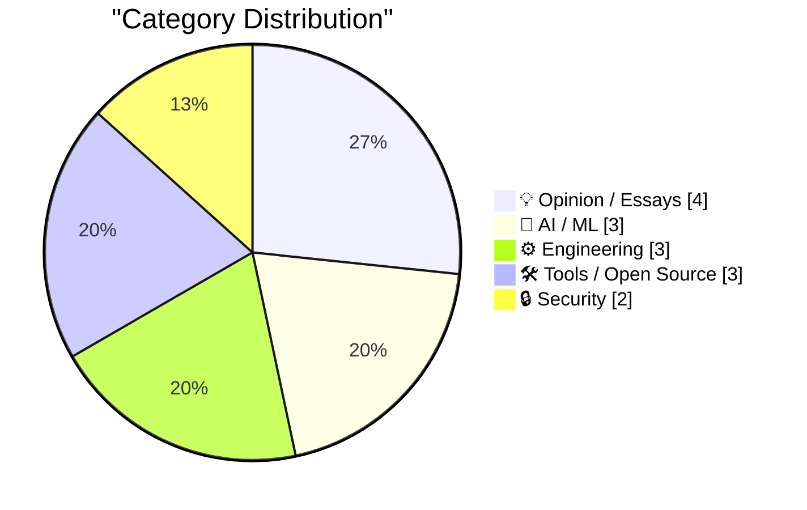
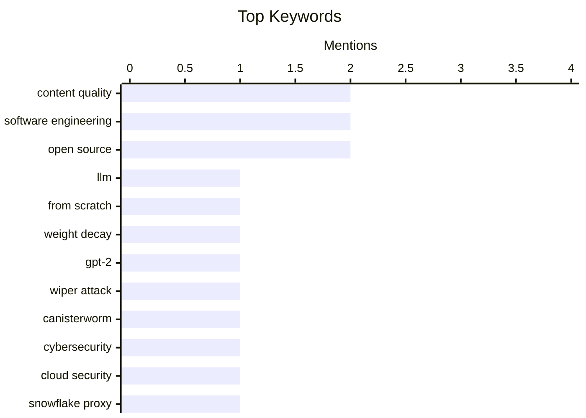

## Today's Highlights
Today's tech news highlights a dual focus on advancing AI and bolstering digital defenses. Significant progress is being made in optimizing large language models and exploring the potential of agentic AI, even as concerns grow over the quality of AI-generated content. Simultaneously, the cybersecurity front remains active, with reports of wiper attacks and the continued importance of tools like Snowflake proxies for internet freedom.
---
## Must Read Today
1. **Writing an LLM from scratch, part 32f -- Interventions: weight decay**
[Writing an LLM from scratch, part 32f -- Interventions: weight decay](https://www.gilesthomas.com/2026/03/llm-from-scratch-32f-interventions-weight-decay) — gilesthomas.com · 14h ago · 🤖 AI / ML
> The article details efforts to improve the test loss of a from-scratch GPT-2 small base model, trained on code, by implementing weight decay. It focuses on the specific optimizer configuration, `torch.optim.AdamW(model.parameters(), lr=0.001, weight_decay=0.01)`, following Sebastian Raschka's book "Build a Large Language Model (from Scratch)". The author explores the challenges of achieving optimal performance and the iterative process of fine-tuning hyperparameters. The core takeaway is the importance of hyperparameter tuning, like weight decay, for enhancing model stability and reducing test loss in LLM training.
💡 **Why read it**: It provides practical insights into the iterative process of hyperparameter tuning, specifically weight decay, for improving LLM training performance from scratch.
🏷️ LLM, From Scratch, Weight Decay, GPT-2
2. **‘CanisterWorm’ Springs Wiper Attack Targeting Iran**
[‘CanisterWorm’ Springs Wiper Attack Targeting Iran](https://krebsonsecurity.com/2026/03/canisterworm-springs-wiper-attack-targeting-iran/) — krebsonsecurity.com · 22h ago · 🔒 Security
> A financially motivated data theft and extortion group has launched a wiper attack named 'CanisterWorm' specifically targeting Iran. This worm propagates through poorly secured cloud services and is designed to wipe data on systems configured with Iran's time zone or Farsi as the default language. The attack highlights the increasing trend of cybercriminal groups leveraging geopolitical conflicts for their malicious activities. The primary objective appears to be data destruction and extortion, rather than traditional espionage.
💡 **Why read it**: It details a new, geopolitically-motivated wiper attack ('CanisterWorm') targeting Iran, showcasing how cybercriminals exploit global events and specific system configurations.
🏷️ Wiper attack, CanisterWorm, cybersecurity, cloud security
3. **Hosting a Snowflake Proxy**
[Hosting a Snowflake Proxy](https://matduggan.com/hosting-a-snowflake-proxy/) — matduggan.com · 2h ago · 🔒 Security
> The article discusses the ease and importance of hosting a Snowflake proxy to help users bypass internet censorship. Snowflake is a system that allows users in censored regions to access the internet by routing their traffic through volunteers' proxies. The author emphasizes that this is a simple yet impactful way to contribute to internet freedom. It highlights the low barrier to entry for individuals to support global internet access.
💡 **Why read it**: It offers a straightforward guide and motivation for individuals to contribute to internet freedom by hosting a Snowflake proxy, a simple yet impactful action.
🏷️ Snowflake Proxy, Internet Censorship, Tor, Privacy
---
## Data Overview
| Sources Scanned | Articles Fetched | Time Window | Selected |
|:---:|:---:|:---:|:---:|
| 89/92 | 2527 -> 22 | 24h | **15** |
### Category Distribution

### Top Keywords

<details>
<summary>Plain Text Keyword Chart (Terminal Friendly)</summary>
```
content quality      │ ████████████████████ 2
software engineering │ ████████████████████ 2
open source          │ ████████████████████ 2
llm                  │ ██████████░░░░░░░░░░ 1
from scratch         │ ██████████░░░░░░░░░░ 1
weight decay         │ ██████████░░░░░░░░░░ 1
gpt-2                │ ██████████░░░░░░░░░░ 1
wiper attack         │ ██████████░░░░░░░░░░ 1
canisterworm         │ ██████████░░░░░░░░░░ 1
cybersecurity        │ ██████████░░░░░░░░░░ 1
```
</details>
### Topic Tags
**content quality**(2) · **software engineering**(2) · **open source**(2) · llm(1) · from scratch(1) · weight decay(1) · gpt-2(1) · wiper attack(1) · canisterworm(1) · cybersecurity(1) · cloud security(1) · snowflake proxy(1) · internet censorship(1) · tor(1) · privacy(1) · agentic ai(1) · openclaw(1) · ai potential(1) · streaming experts(1) · moe models(1)
---
## Opinion / Essays
### 1. Quoting Neurotica
[Quoting Neurotica](https://simonwillison.net/2026/Mar/23/neurotica/#atom-everything) — **simonwillison.net** · 14h ago · ⭐ 24/30
> This article quotes Neurotica's definition of "slop" in the context of AI-generated content. Slop is defined as content that requires more human effort to consume than it took to produce. The quote specifically criticizes a coworker sending "raw Gemini output," arguing it disrespects the recipient's time. It highlights the emerging problem of low-effort, AI-generated content burdening human consumers. The core takeaway is a critical perspective on the responsible use of AI tools to avoid creating "slop."
🏷️ AI slop, LLM output, productivity, content quality
---
### 2. Quoting David Abram
[Quoting David Abram](https://simonwillison.net/2026/Mar/23/david-abram/#atom-everything) — **simonwillison.net** · 19h ago · ⭐ 24/30
> The article quotes David Abram, who argues that the most challenging aspects of a developer's job are not about typing code, but rather understanding systems, debugging, designing robust architectures, and making critical decisions. Abram asserts that Large Language Models (LLMs) cannot solve these complex, high-level problems, though they can assist with boilerplate code. This perspective emphasizes that true engineering value lies beyond mere code generation. The core takeaway is that LLMs augment, but do not replace, the critical thinking and problem-solving skills essential for software development.
🏷️ Software engineering, system design, debugging, craft
---
### 3. Pluralistic: Goodhart's Law vs "prediction markets" (24 Mar 2026)
[Pluralistic: Goodhart's Law vs "prediction markets" (24 Mar 2026)](https://pluralistic.net/2026/03/24/degenerated-gambling/) — **pluralistic.net** · 2h ago · ⭐ 24/30
> This article from Pluralistic discusses the application of Goodhart's Law to "prediction markets," framing it as "putting a gun to the metric's head." It implies that when a metric becomes a target for financial gain, it ceases to be a good metric. The piece also touches on various other topics including Apple's stance on interoperability, Yahoo's global reach, and patent trolls. The core argument is a critical examination of how financial incentives can distort the reliability and utility of predictive systems.
🏷️ Goodhart's Law, Prediction Markets, Interoperability, Patent Trolls
---
### 4. From the DF Archive, a Decade Ago: ‘The Industry Is Fucked Up’
[From the DF Archive, a Decade Ago: ‘The Industry Is Fucked Up’](https://daringfireball.net/linked/2015/07/09/ritchie-bad-ads) — **daringfireball.net** · 19h ago · ⭐ 21/30
> This article reflects on the persistent issue of increasingly poor and reader-hostile web advertising practices over the past decade. It references a 2015 post by Rene Ritchie, then at iMore, which detailed how the site was compelled to serve progressively worse ads. The author notes that little has changed in web advertising in ten years, highlighting the industry's stagnation. This historical context underscores how the failure to improve ad experiences contributed to the decline of quality online publications, exemplified by iMore, once a respected site, now being defunct. The piece concludes that the web advertising industry's practices have led to a degraded user experience and negatively impacted online content creators.
🏷️ Web advertising, user experience, content quality, industry trends
---
## AI / ML
### 5. Writing an LLM from scratch, part 32f -- Interventions: weight decay
[Writing an LLM from scratch, part 32f -- Interventions: weight decay](https://www.gilesthomas.com/2026/03/llm-from-scratch-32f-interventions-weight-decay) — **gilesthomas.com** · 14h ago · ⭐ 30/30
> The article details efforts to improve the test loss of a from-scratch GPT-2 small base model, trained on code, by implementing weight decay. It focuses on the specific optimizer configuration, `torch.optim.AdamW(model.parameters(), lr=0.001, weight_decay=0.01)`, following Sebastian Raschka's book "Build a Large Language Model (from Scratch)". The author explores the challenges of achieving optimal performance and the iterative process of fine-tuning hyperparameters. The core takeaway is the importance of hyperparameter tuning, like weight decay, for enhancing model stability and reducing test loss in LLM training.
🏷️ LLM, From Scratch, Weight Decay, GPT-2
---
### 6. Weekly Update 496
[Weekly Update 496](https://www.troyhunt.com/weekly-update-496/) — **troyhunt.com** · 9h ago · ⭐ 26/30
> This weekly update reflects on the nascent but promising potential of agentic AI, specifically referencing "OpenClaw." The author likens observing OpenClaw's early stages to watching the first plane take flight, acknowledging its current imperfections but highlighting its transformative potential. It suggests that despite being "rickety and stuck together with a lot of sticky tape," agentic AI is poised to fundamentally alter the world. The core message is an optimistic outlook on the future impact of evolving AI capabilities.
🏷️ agentic AI, OpenClaw, AI potential
---
### 7. Streaming experts
[Streaming experts](https://simonwillison.net/2026/Mar/24/streaming-experts/#atom-everything) — **simonwillison.net** · 8h ago · ⭐ 24/30
> The article discusses "streaming experts," a technique for running large Mixture-of-Experts (MoE) models on hardware with insufficient RAM by streaming necessary expert weights from SSD. Dan Woods' experiments are highlighted, showing a progression from running Qwen3.5-397B-A17B in 48GB of RAM to more advanced implementations. This method allows for the deployment of massive models, like those with hundreds of billions of parameters, on consumer-grade hardware. The key finding is the feasibility of overcoming RAM limitations for large MoE models through efficient data streaming.
🏷️ Streaming experts, MoE models, LLM inference, hardware optimization
---
## Engineering
### 8. WWDC 2026: June 8–12
[WWDC 2026: June 8–12](https://www.apple.com/newsroom/2026/03/apples-worldwide-developers-conference-returns-the-week-of-june-8/) — **daringfireball.net** · 19h ago · ⭐ 24/30
> Apple's Worldwide Developers Conference (WWDC) 2026 is scheduled for June 8–12, kicking off with the Keynote and Platforms State of the Union. The conference will be held online, featuring over 100 video sessions, interactive group labs, and direct appointments with Apple engineers and designers. Content will be accessible via the Apple Developer app, website, YouTube channel, and the Apple Developer bilibili channel in China. This annual event serves as a crucial platform for developers to explore Apple's latest announcements and technologies.
🏷️ WWDC, Apple, developer conference, iOS
---
### 9. The HTML Review: Issue 05
[The HTML Review: Issue 05](https://thehtml.review/05/) — **daringfireball.net** · 20h ago · ⭐ 20/30
> This article expresses appreciation for "The HTML Review: Issue 05" amidst the author's recent concerns over the state of web design. It implicitly highlights the current complexities and perceived shortcomings in contemporary web development practices. The review is praised as a refreshing counterpoint, showcasing examples of thoughtful and principled web design. The author draws a parallel to the conviction of artist-developers in native app development, suggesting a desire for similar dedication and craftsmanship within the web sphere. "The HTML Review" is positioned as an important resource for appreciating and promoting high-quality, fundamental web design principles.
🏷️ HTML Review, web design, front-end, native apps
---
### 10. Lines of code are useful
[Lines of code are useful](https://entropicthoughts.com/lines-of-code) — **entropicthoughts.com** · 15h ago · ⭐ 20/30
> This article addresses the often-misunderstood utility and significance of "lines of code" (LOC) as a metric in software development. It challenges the common dismissal of LOC as a meaningless indicator, arguing that it holds value when understood within proper context. The author likely discusses how LOC can serve as a proxy for project size, development effort, or complexity, especially when comparing similar projects or tracking changes over time. The piece provides nuanced perspectives on how LOC, while imperfect, can be a useful metric. It concludes that when interpreted correctly within specific contexts, lines of code can indeed offer valuable insights into a software project.
🏷️ Lines of Code, Code Metrics, Software Engineering
---
## Tools / Open Source
### 11. Wander 0.2.0
[Wander 0.2.0](https://susam.net/code/news/wander/0.2.0.html) — **susam.net** · 14h ago · ⭐ 23/30
> Wander 0.2.0 is the second release of a small, decentralized, self-hosted web console designed for exploring interesting websites recommended by a community of independent personal website owners. This version introduces several improvements over the initial 0.1.0 release, which was primarily used by the author. Wander aims to foster a community-driven web discovery experience, moving beyond centralized platforms. The update signifies a step towards broader adoption and enhanced functionality for this unique web exploration tool.
🏷️ Wander, Web Console, Decentralized, Open Source
---
### 12. [Sponsor] npx workos: From Auth Integration to Environment Management, Zero ClickOps
[[Sponsor] npx workos: From Auth Integration to Environment Management, Zero ClickOps](https://workos.com/docs/authkit/cli-installer?utm_source=daringfireball&amp;utm_medium=newsletter&amp;utm_campaign=q12026) — **daringfireball.net** · 13h ago · ⭐ 22/30
> This article introduces `npx workos@latest`, an AI agent powered by Claude, designed to automate authentication integration and environment management. The agent detects project frameworks and writes complete auth integrations without requiring immediate signup, creating environments and populating keys. Beyond initial setup, WorkOS Skills provide expert coding agents, `workos seed` defines environments as code, and `workos doctor` identifies and fixes misconfigurations. The platform aims to streamline developer workflows for auth and environment setup, minimizing manual "ClickOps" through intelligent automation. This suite of tools significantly reduces the complexity and time involved in setting up secure authentication and managing development environments.
🏷️ Auth integration, AI agent, developer tools, WorkOS
---
### 13. datasette-files 0.1a2
[datasette-files 0.1a2](https://simonwillison.net/2026/Mar/23/datasette-files/#atom-everything) — **simonwillison.net** · 14h ago · ⭐ 20/30
> This article announces the release of `datasette-files 0.1a2`, an interesting alpha version of a new Datasette plugin. This plugin adds the crucial ability to upload files directly into a Datasette instance, significantly expanding its data management capabilities. A key feature in this specific alpha release is the enhanced configuration of columns, now managed through a new mechanism. This development aims to integrate file management seamlessly within the Datasette ecosystem. The plugin's introduction allows users to centralize both data and associated files within their Datasette instances, streamlining workflows.
🏷️ Datasette, plugin, file upload, open source
---
## Security
### 14. ‘CanisterWorm’ Springs Wiper Attack Targeting Iran
[‘CanisterWorm’ Springs Wiper Attack Targeting Iran](https://krebsonsecurity.com/2026/03/canisterworm-springs-wiper-attack-targeting-iran/) — **krebsonsecurity.com** · 22h ago · ⭐ 28/30
> A financially motivated data theft and extortion group has launched a wiper attack named 'CanisterWorm' specifically targeting Iran. This worm propagates through poorly secured cloud services and is designed to wipe data on systems configured with Iran's time zone or Farsi as the default language. The attack highlights the increasing trend of cybercriminal groups leveraging geopolitical conflicts for their malicious activities. The primary objective appears to be data destruction and extortion, rather than traditional espionage.
🏷️ Wiper attack, CanisterWorm, cybersecurity, cloud security
---
### 15. Hosting a Snowflake Proxy
[Hosting a Snowflake Proxy](https://matduggan.com/hosting-a-snowflake-proxy/) — **matduggan.com** · 2h ago · ⭐ 26/30
> The article discusses the ease and importance of hosting a Snowflake proxy to help users bypass internet censorship. Snowflake is a system that allows users in censored regions to access the internet by routing their traffic through volunteers' proxies. The author emphasizes that this is a simple yet impactful way to contribute to internet freedom. It highlights the low barrier to entry for individuals to support global internet access.
🏷️ Snowflake Proxy, Internet Censorship, Tor, Privacy
---
*Generated at 2026-03-24 14:01 | Scanned 89 sources -> 2527 articles -> selected 15*
*Based on the [Hacker News Popularity Contest 2025](https://refactoringenglish.com/tools/hn-popularity/) RSS source list recommended by [Andrej Karpathy](https://x.com/karpathy)*
*Produced by Dongdianr AI. Follow the same-name WeChat public account for more AI practical tips 💡*
