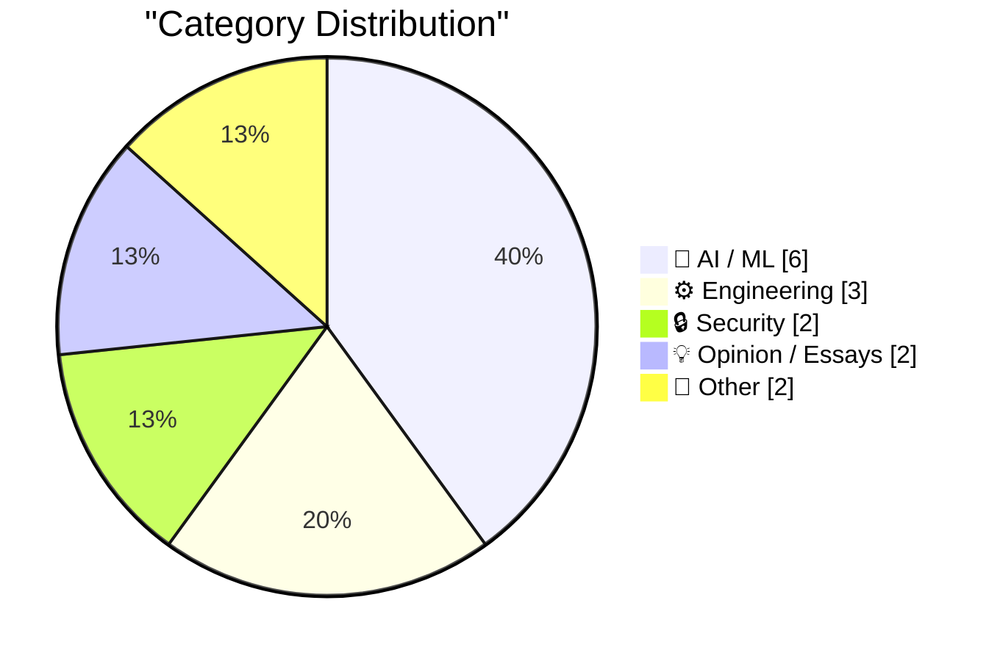
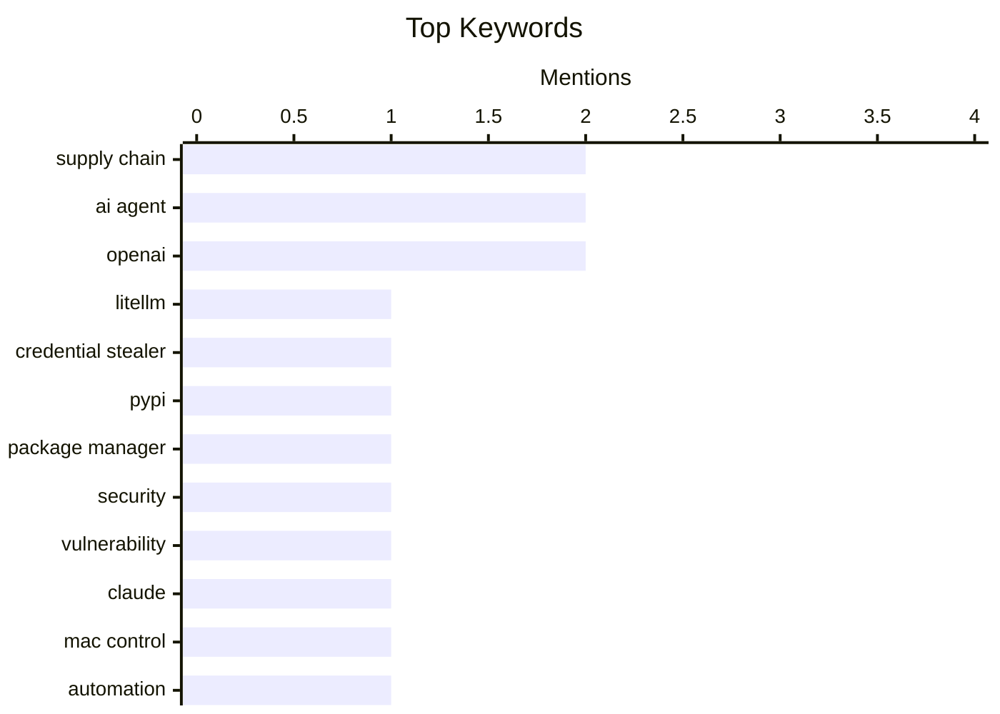

## Today's Highlights
Today's highlights reveal a growing tension in the tech landscape as security vulnerabilities, like the recent LiteLLM supply chain attack, raise alarms about the rapid adoption of software dependencies. Meanwhile, advancements in AI are pushing boundaries, with Claude's new features allowing it to autonomously control devices, sparking debates about the implications of such autonomy. As the industry evolves, skepticism about the transparency and capabilities of AI technologies continues to surface, emphasizing the need for cautious innovation.
---
## Must Read Today
1. **Malicious litellm_init.pth in litellm 1.82.8 — credential stealer**
[Malicious litellm_init.pth in litellm 1.82.8 — credential stealer](https://simonwillison.net/2026/Mar/24/malicious-litellm/#atom-everything) — simonwillison.net · 22h ago · 🔒 Security
> The LiteLLM v1.82.8 package on PyPI was compromised, embedding a credential stealer in a base64-encoded file named litellm_init.pth. This malicious code executes upon installation, even without importing the package, posing a significant security risk. The previous version, 1.82.7, also contained the exploit, albeit in a different location. Users are urged to avoid installing these versions to protect their credentials. The main takeaway is the importance of verifying package integrity before installation.
💡 **Why read it**: This article highlights a critical security vulnerability in a widely used package, emphasizing the need for caution in software dependencies.
🏷️ LiteLLM, Supply chain, Credential stealer, PyPI
2. **Package Managers Need to Cool Down**
[Package Managers Need to Cool Down](https://simonwillison.net/2026/Mar/24/package-managers-need-to-cool-down/#atom-everything) — simonwillison.net · 16h ago · 🔒 Security
> The recent LiteLLM supply chain attack raises concerns about the rapid adoption of updated dependencies in package managers. The author advocates for 'dependency cooldowns,' a practice where updates are only installed after a waiting period to assess their safety. This approach aims to mitigate risks associated with newly released packages that may contain vulnerabilities. The conclusion stresses the need for more cautious dependency management to enhance software security.
💡 **Why read it**: This article offers a timely perspective on improving software security practices in light of recent vulnerabilities.
🏷️ Package manager, Supply chain, Security, Vulnerability
3. **Claude Can Now Take Control of Your Mac**
[Claude Can Now Take Control of Your Mac](https://claude.com/blog/dispatch-and-computer-use) — daringfireball.net · 12h ago · 🤖 AI / ML
> Claude has introduced a feature allowing it to control your Mac to complete tasks autonomously. This capability enables Claude to interact with files, browsers, and development tools directly on the user's screen without any setup. Currently available in research preview for Claude Pro and Max subscribers, it works particularly well with the Dispatch tool for task assignments. The main takeaway is the significant advancement in AI capabilities for user assistance.
💡 **Why read it**: This article showcases an innovative AI feature that enhances productivity by automating computer tasks.
🏷️ Claude, AI agent, Mac control, Automation
---
## Data Overview
| Sources Scanned | Articles Fetched | Time Window | Selected |
|:---:|:---:|:---:|:---:|
| 89/92 | 2527 -> 20 | 24h | **15** |
### Category Distribution

### Top Keywords

<details>
<summary>Plain Text Keyword Chart (Terminal Friendly)</summary>
```
supply chain       │ ████████████████████ 2
ai agent           │ ████████████████████ 2
openai             │ ████████████████████ 2
litellm            │ ██████████░░░░░░░░░░ 1
credential stealer │ ██████████░░░░░░░░░░ 1
pypi               │ ██████████░░░░░░░░░░ 1
package manager    │ ██████████░░░░░░░░░░ 1
security           │ ██████████░░░░░░░░░░ 1
vulnerability      │ ██████████░░░░░░░░░░ 1
claude             │ ██████████░░░░░░░░░░ 1
```
</details>
### Topic Tags
**supply chain**(2) · **ai agent**(2) · **openai**(2) · litellm(1) · credential stealer(1) · pypi(1) · package manager(1) · security(1) · vulnerability(1) · claude(1) · mac control(1) · automation(1) · llm(1) · weight tying(1) · model(1) · claude code(1) · auto mode(1) · permissions(1) · superapp(1) · chatgpt(1)
---
## AI / ML
### 1. Claude Can Now Take Control of Your Mac
[Claude Can Now Take Control of Your Mac](https://claude.com/blog/dispatch-and-computer-use) — **daringfireball.net** · 12h ago · ⭐ 26/30
> Claude has introduced a feature allowing it to control your Mac to complete tasks autonomously. This capability enables Claude to interact with files, browsers, and development tools directly on the user's screen without any setup. Currently available in research preview for Claude Pro and Max subscribers, it works particularly well with the Dispatch tool for task assignments. The main takeaway is the significant advancement in AI capabilities for user assistance.
🏷️ Claude, AI agent, Mac control, Automation
---
### 2. Writing an LLM from scratch, part 32g -- Interventions: weight tying
[Writing an LLM from scratch, part 32g -- Interventions: weight tying](https://www.gilesthomas.com/2026/03/llm-from-scratch-32g-interventions-weight-tying) — **gilesthomas.com** · 18h ago · ⭐ 25/30
> This article discusses the concept of weight tying in large language models (LLMs), highlighting its potential to reduce parameter counts but also its tendency to degrade model performance. The author references Sebastian Raschka's insights, suggesting that weight tying is not commonly used in modern LLMs due to these drawbacks. The conclusion emphasizes the need for careful consideration of design choices in LLM development.
🏷️ LLM, weight tying, model
---
### 3. Auto mode for Claude Code
[Auto mode for Claude Code](https://simonwillison.net/2026/Mar/24/auto-mode-for-claude-code/#atom-everything) — **simonwillison.net** · 14h ago · ⭐ 24/30
> Claude Code has introduced an 'auto mode' that allows the AI to make permission decisions on behalf of the user, incorporating safeguards to monitor actions before execution. This feature aims to simplify user interactions while maintaining security. The implementation details suggest a focus on user safety and efficiency in automated coding tasks. The main takeaway is the balance between automation and user control in AI applications.
🏷️ Claude Code, Auto mode, AI agent, Permissions
---
### 4. WSJ: ‘OpenAI Plans Launch of Desktop “Superapp”’
[WSJ: ‘OpenAI Plans Launch of Desktop “Superapp”’](https://www.wsj.com/tech/openai-plans-launch-of-desktop-superapp-to-refocus-simplify-user-experience-9e19931d?st=25wiu1) — **daringfireball.net** · 13h ago · ⭐ 24/30
> OpenAI is planning to launch a desktop 'superapp' that will unify its ChatGPT, Codex, and browser functionalities to streamline user experience. This initiative is aimed at enhancing the product's appeal to both engineering and business customers. The transition will be overseen by Chief of Applications Fidji Simo, focusing on effective marketing strategies. The conclusion indicates a strategic shift towards simplifying user interactions with AI tools.
🏷️ OpenAI, Superapp, ChatGPT, Product strategy
---
### 5. The AI Industry Is Lying To You
[The AI Industry Is Lying To You](https://www.wheresyoured.at/the-ai-industry-is-lying-to-you/) — **wheresyoured.at** · 20h ago · ⭐ 24/30
> This article critiques the AI industry, suggesting that it often misrepresents its capabilities and impacts. The author argues that the promises made by AI companies do not align with the reality of their products and services. The conclusion calls for greater transparency and accountability in the AI sector to foster trust among users. The main takeaway is the need for critical evaluation of AI claims.
🏷️ AI, industry, reporting
---
### 6. OpenAI Is Closing Sora
[OpenAI Is Closing Sora](https://x.com/soraofficialapp/status/2036546752535470382) — **daringfireball.net** · 13h ago · ⭐ 23/30
> OpenAI has announced the closure of the Sora app, expressing gratitude to its users for their contributions. The company acknowledges that while the app was enjoyable for a short period, it ultimately did not meet long-term expectations. Details regarding the timeline for the app's closure and preservation of user work will be shared later. The main takeaway is the transient nature of some AI applications in the market.
🏷️ OpenAI, Sora app, Product closure, AI video
---
## Engineering
### 7. Following Google’s Lead With Pixel Phones, Samsung Announces AirDrop Support With Galaxy S26 Phones
[Following Google’s Lead With Pixel Phones, Samsung Announces AirDrop Support With Galaxy S26 Phones](https://news.samsung.com/us/samsung-airdrop-quick-share-galaxy-s26-series/) — **daringfireball.net** · 16h ago · ⭐ 22/30
> Samsung is introducing AirDrop support in its Galaxy S26 series, enabling easier content sharing between devices via Quick Share. This feature will roll out starting March 23, initially in Korea and later expanding to other regions. The introduction of AirDrop support aligns Samsung with competitive offerings in the smartphone market. The main takeaway is the enhancement of user connectivity features in Samsung's latest devices.
🏷️ Samsung, AirDrop, Quick Share, Mobile sharing
---
### 8. iOS 26.4
[iOS 26.4](https://www.macrumors.com/guide/ios-26-4-features/) — **daringfireball.net** · 13h ago · ⭐ 20/30
> The article discusses the new features and changes introduced in iOS 26.4, particularly focusing on the App Store's updated interface. Key changes include the merging of apps and purchase history, along with a dedicated section for app updates, which now requires two taps to access. Although the extra tap may initially seem inconvenient, it ultimately provides a more logical organization for users. The main takeaway is that while some changes may feel cumbersome at first, they can enhance usability in the long run.
🏷️ iOS, App Store, Mobile OS, Apple
---
### 9. Code as a Tool of Process
[Code as a Tool of Process](https://blog.jim-nielsen.com/2026/code-as-process/) — **blog.jim-nielsen.com** · 19h ago · ⭐ 17/30
> The article explores the concept of programming as an iterative process akin to writing, where continuous refinement leads to improvement. It emphasizes the value of 'sharpening' one's skills through the act of building and iterating on code. The main takeaway is that programming is not just about the final product but also about the learning journey involved in the process. This perspective encourages developers to embrace the iterative nature of coding.
🏷️ programming, process, writing
---
## Security
### 10. Malicious litellm_init.pth in litellm 1.82.8 — credential stealer
[Malicious litellm_init.pth in litellm 1.82.8 — credential stealer](https://simonwillison.net/2026/Mar/24/malicious-litellm/#atom-everything) — **simonwillison.net** · 22h ago · ⭐ 29/30
> The LiteLLM v1.82.8 package on PyPI was compromised, embedding a credential stealer in a base64-encoded file named litellm_init.pth. This malicious code executes upon installation, even without importing the package, posing a significant security risk. The previous version, 1.82.7, also contained the exploit, albeit in a different location. Users are urged to avoid installing these versions to protect their credentials. The main takeaway is the importance of verifying package integrity before installation.
🏷️ LiteLLM, Supply chain, Credential stealer, PyPI
---
### 11. Package Managers Need to Cool Down
[Package Managers Need to Cool Down](https://simonwillison.net/2026/Mar/24/package-managers-need-to-cool-down/#atom-everything) — **simonwillison.net** · 16h ago · ⭐ 26/30
> The recent LiteLLM supply chain attack raises concerns about the rapid adoption of updated dependencies in package managers. The author advocates for 'dependency cooldowns,' a practice where updates are only installed after a waiting period to assess their safety. This approach aims to mitigate risks associated with newly released packages that may contain vulnerabilities. The conclusion stresses the need for more cautious dependency management to enhance software security.
🏷️ Package manager, Supply chain, Security, Vulnerability
---
## Opinion / Essays
### 12. Quoting Christopher Mims
[Quoting Christopher Mims](https://simonwillison.net/2026/Mar/24/christopher-mims/#atom-everything) — **simonwillison.net** · 17h ago · ⭐ 22/30
> Christopher Mims expresses skepticism about the trend of granting AI total control over personal computers, suggesting it may be viewed as foolish in hindsight. His commentary reflects broader concerns regarding the implications of AI autonomy in everyday life. The conclusion emphasizes the need for cautious consideration of AI's role in personal decision-making. The main takeaway is the importance of maintaining human oversight in AI interactions.
🏷️ AI control, AI agents, Ethics, Skepticism
---
### 13. Choose Boring Technology and Innovative Practices
[Choose Boring Technology and Innovative Practices](https://buttondown.com/hillelwayne/archive/choose-boring-technology-and-innovative-practices/) — **buttondown.com/hillelwayne** · 23h ago · ⭐ 20/30
> The article critiques the adoption of innovative technologies by highlighting two main issues: the unpredictability of new tech and the long-term maintenance burden that comes with it. It argues that 'boring' technologies have well-known pitfalls, making them more reliable for sustained use. The conclusion emphasizes that choosing established technologies can lead to more manageable and predictable outcomes in projects. This perspective encourages a thoughtful approach to technology selection.
🏷️ technology, innovation, practices
---
## Other
### 14. Using FireWire on a Raspberry Pi
[Using FireWire on a Raspberry Pi](https://www.jeffgeerling.com/blog/2026/firewire-on-a-raspberry-pi/) — **jeffgeerling.com** · 22h ago · ⭐ 16/30
> The article discusses alternatives for using FireWire (IEEE 1394) equipment after Apple discontinued support in macOS 26 Tahoe. It details how to connect old FireWire devices, such as hard drives and DV cameras, to a Raspberry Pi, providing practical steps and considerations. The conclusion highlights the Raspberry Pi as a viable solution for repurposing legacy technology in modern setups. This exploration opens up possibilities for utilizing older equipment in new ways.
🏷️ FireWire, Raspberry Pi, Hardware, Legacy tech
---
### 15. From Mendeleev to Fourier
[From Mendeleev to Fourier](https://www.johndcook.com/blog/2026/03/24/from-mendeleev-to-fourier/) — **johndcook.com** · 23h ago · ⭐ 15/30
> The article examines a mathematical inequality discovered by Dmitri Mendeleev and its generalization by Andrey Markov, which relates to the behavior of real polynomials. It discusses how Bernstein's work shows that the bounds on the derivatives of trigonometric polynomials are less strict than those for real polynomials. The main takeaway is the evolution of mathematical understanding from Mendeleev's initial findings to Fourier's contributions, illustrating the progression of mathematical thought. This exploration highlights the interconnectedness of mathematical concepts.
🏷️ Mendeleev, Fourier, polynomial
---
*Generated at 2026-03-25 14:05 | Scanned 89 sources -> 2527 articles -> selected 15*
*Based on the [Hacker News Popularity Contest 2025](https://refactoringenglish.com/tools/hn-popularity/) RSS source list recommended by [Andrej Karpathy](https://x.com/karpathy)*
*Produced by Dongdianr AI. Follow the same-name WeChat public account for more AI practical tips 💡*
