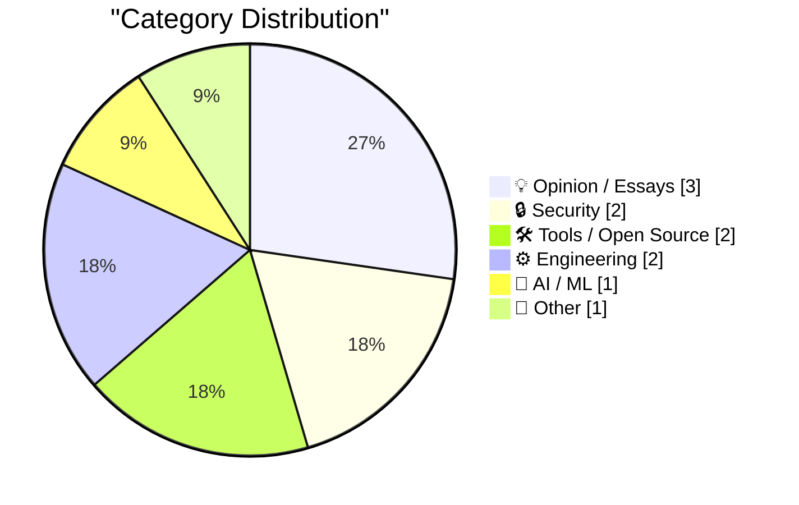
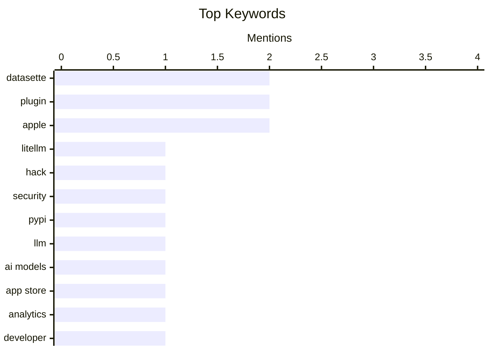

## Today's Highlights
Today's tech landscape is marked by the rapid evolution and inherent risks of AI, as new LLM tools emerge alongside critical security breaches like the LiteLLM hack. Developers are gaining enhanced capabilities through improved platform analytics and new integrations for databases and cloud storage. This comes amidst broader industry discussions questioning the pace of innovation, the value of simple engineering, and the strategic direction of major tech companies.
---
## Must Read Today
1. **LiteLLM Hack: Were You One of the 47,000?**
[LiteLLM Hack: Were You One of the 47,000?](https://simonwillison.net/2026/Mar/25/litellm-hack/#atom-everything) — simonwillison.net · 20h ago · 🔒 Security
> LiteLLM Hack: Were You One of the 47,000?
🏷️ LiteLLM, hack, security, PyPI
2. **datasette-llm 0.1a1**
[datasette-llm 0.1a1](https://simonwillison.net/2026/Mar/25/datasette-llm/#atom-everything) — simonwillison.net · 16h ago · 🤖 AI / ML
> datasette-llm 0.1a1
🏷️ Datasette, LLM, plugin, AI models
3. **Improved Analytics in App Store Connect**
[Improved Analytics in App Store Connect](https://developer.apple.com/news/?id=hh6v4b55) — daringfireball.net · 18h ago · 🛠 Tools / Open Source
> Improved Analytics in App Store Connect
🏷️ App Store, analytics, Apple, developer
---
## Data Overview
| Sources Scanned | Articles Fetched | Time Window | Selected |
|:---:|:---:|:---:|:---:|
| 89/92 | 2528 -> 11 | 24h | **11** |
### Category Distribution

### Top Keywords

<details>
<summary>Plain Text Keyword Chart (Terminal Friendly)</summary>
```
datasette │ ████████████████████ 2
plugin    │ ████████████████████ 2
apple     │ ████████████████████ 2
litellm   │ ██████████░░░░░░░░░░ 1
hack      │ ██████████░░░░░░░░░░ 1
security  │ ██████████░░░░░░░░░░ 1
pypi      │ ██████████░░░░░░░░░░ 1
llm       │ ██████████░░░░░░░░░░ 1
ai models │ ██████████░░░░░░░░░░ 1
app store │ ██████████░░░░░░░░░░ 1
```
</details>
### Topic Tags
**datasette**(2) · **plugin**(2) · **apple**(2) · litellm(1) · hack(1) · security(1) · pypi(1) · llm(1) · ai models(1) · app store(1) · analytics(1) · developer(1) · sqlalchemy(1) · python(1) · orm(1) · database(1) · s3(1) · file storage(1) · work-life balance(1) · tech trends(1)
---
## Opinion / Essays
### 1. Thoughts on slowing the fuck down
[Thoughts on slowing the fuck down](https://simonwillison.net/2026/Mar/25/thoughts-on-slowing-the-fuck-down/#atom-everything) — **simonwillison.net** · 16h ago · ⭐ 22/30
> Thoughts on slowing the fuck down
🏷️ Work-life balance, tech trends, opinion, burnout
---
### 2. Engineers do get promoted for writing simple code
[Engineers do get promoted for writing simple code](https://seangoedecke.com/simple-work-gets-rewarded/) — **seangoedecke.com** · 14h ago · ⭐ 22/30
> Engineers do get promoted for writing simple code
🏷️ Career, code quality, promotion, engineering
---
### 3. I Can't See Apple's Vision
[I Can't See Apple's Vision](https://matduggan.com/i-cant-see-apples-vision/) — **matduggan.com** · 2h ago · ⭐ 21/30
> I Can't See Apple's Vision
🏷️ Apple, corporate culture, management, vision
---
## Security
### 4. LiteLLM Hack: Were You One of the 47,000?
[LiteLLM Hack: Were You One of the 47,000?](https://simonwillison.net/2026/Mar/25/litellm-hack/#atom-everything) — **simonwillison.net** · 20h ago · ⭐ 28/30
> LiteLLM Hack: Were You One of the 47,000?
🏷️ LiteLLM, hack, security, PyPI
---
### 5. The Melissa virus of 1999
[The Melissa virus of 1999](https://dfarq.homeip.net/the-melissa-virus-of-1999/?utm_source=rss&#038;utm_medium=rss&#038;utm_campaign=the-melissa-virus-of-1999) — **dfarq.homeip.net** · 3h ago · ⭐ 13/30
> The Melissa virus of 1999
🏷️ Melissa virus, malware, history, cybersecurity
---
## Tools / Open Source
### 6. Improved Analytics in App Store Connect
[Improved Analytics in App Store Connect](https://developer.apple.com/news/?id=hh6v4b55) — **daringfireball.net** · 18h ago · ⭐ 24/30
> Improved Analytics in App Store Connect
🏷️ App Store, analytics, Apple, developer
---
### 7. datasette-files-s3 0.1a1
[datasette-files-s3 0.1a1](https://simonwillison.net/2026/Mar/25/datasette-files-s3/#atom-everything) — **simonwillison.net** · 16h ago · ⭐ 22/30
> datasette-files-s3 0.1a1
🏷️ Datasette, S3, plugin, file storage
---
## Engineering
### 8. SQLAlchemy 2 In Practice - Chapter 1 - Database Tables
[SQLAlchemy 2 In Practice - Chapter 1 - Database Tables](https://blog.miguelgrinberg.com/post/sqlalchemy-2-in-practice---chapter-1---database-tables) — **miguelgrinberg.com** · 1h ago · ⭐ 24/30
> SQLAlchemy 2 In Practice - Chapter 1 - Database Tables
🏷️ SQLAlchemy, Python, ORM, Database
---
### 9. Adding human.json to WordPress
[Adding human.json to WordPress](https://shkspr.mobi/blog/2026/03/adding-human-json-to-wordpress/) — **shkspr.mobi** · 1h ago · ⭐ 18/30
> Adding human.json to WordPress
🏷️ WordPress, FOAF, social graph, web
---
## AI / ML
### 10. datasette-llm 0.1a1
[datasette-llm 0.1a1](https://simonwillison.net/2026/Mar/25/datasette-llm/#atom-everything) — **simonwillison.net** · 16h ago · ⭐ 24/30
> datasette-llm 0.1a1
🏷️ Datasette, LLM, plugin, AI models
---
## Other
### 11. ‘A List of Chain Restaurants Whose Names Contain Unusual Structures’
[‘A List of Chain Restaurants Whose Names Contain Unusual Structures’](https://onefoottsunami.com/2026/03/18/a-list-of-chain-restaurants-whose-names-contain-unusual-structures/) — **daringfireball.net** · 18h ago · ⭐ 9/30
> This article details the author's unsuccessful attempt to identify a chain restaurant name with an "unusual structure" that was not already present on a friend's published list. Despite a diligent search, no suitable omissions were found. The closest candidate, "ShowBiz Pizza Place," was ultimately rejected as "Place" constitutes an unusual noun rather than an "unusual structure" according to the original list's specific criteria. This exercise implicitly validates the thoroughness and accuracy of the friend's initial compilation of restaurant names.
🏷️ Restaurants, humor, list
---
*Generated at 2026-03-26 14:01 | Scanned 89 sources -> 2528 articles -> selected 11*
*Based on the [Hacker News Popularity Contest 2025](https://refactoringenglish.com/tools/hn-popularity/) RSS source list recommended by [Andrej Karpathy](https://x.com/karpathy)*
*Produced by Dongdianr AI. Follow the same-name WeChat public account for more AI practical tips 💡*
