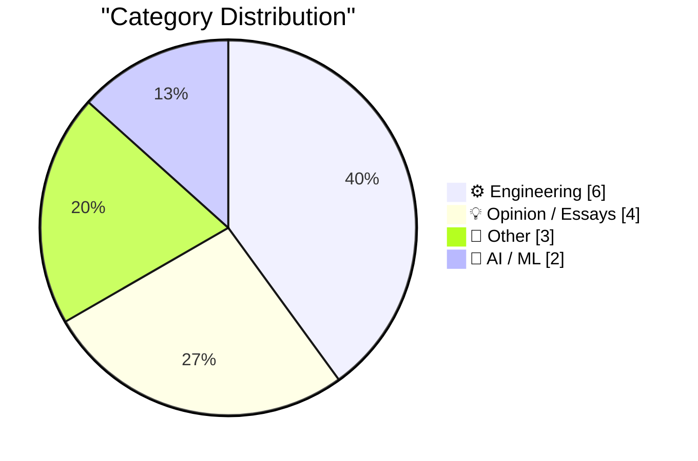
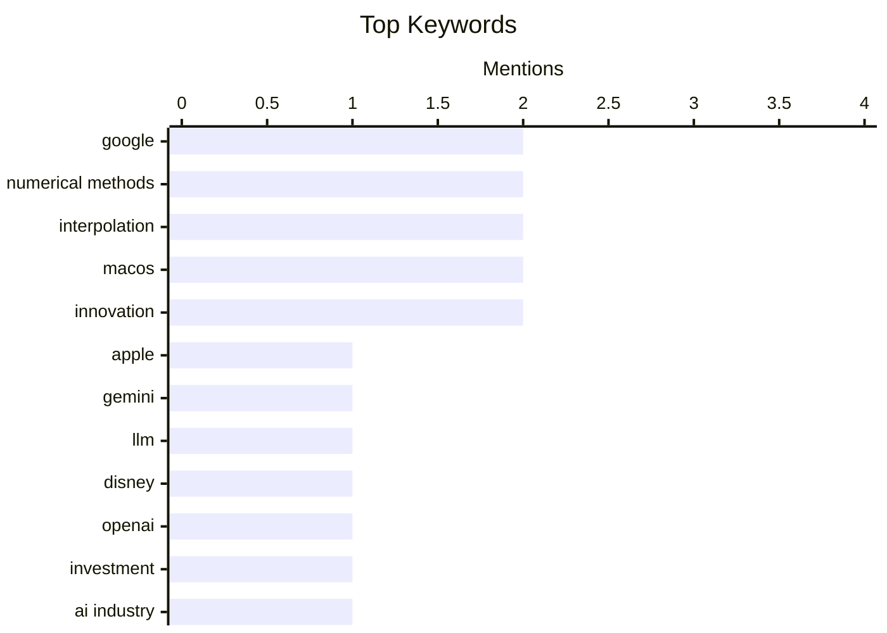

## Today's Highlights
The AI landscape is a major focus today, with Apple leveraging Google's Gemini model while Disney pulls back from OpenAI after Sora's struggles, highlighting both strategic partnerships and product volatility. Meanwhile, engineers are pushing boundaries, from complex mathematical computations to using AI for significant efficiency gains in development. This rapid evolution also brings challenges, including skepticism over industry benchmarks and the critical need for robust security against emerging threats.
---
## Must Read Today
1. **The Information: ‘Apple Can “Distill” Google’s Big Gemini Model’**
[The Information: ‘Apple Can “Distill” Google’s Big Gemini Model’](https://www.theinformation.com/newsletters/ai-agenda/apple-can-distill-googles-big-gemini-model?rc=jfy0lk) — daringfireball.net · 20h ago · 🤖 AI / ML
> This article reveals the extensive nature of Apple's agreement with Google regarding the Gemini AI model. Apple has complete access to the Gemini model within its own data center facilities, allowing it to go beyond simple fine-tuning. This access enables Apple to distill smaller, specialized models for specific tasks or on-device deployment. The deep integration grants Apple significant freedom to customize and tailor Google's foundational AI technology to its ecosystem. This suggests Apple is leveraging external AI capabilities while maintaining control over its implementation.
💡 **Why read it**: It provides crucial insight into Apple's strategy for integrating advanced AI by leveraging Google's Gemini model with significant customization capabilities.
🏷️ Apple, Google, Gemini, LLM
2. **Disney Drops Vaporware $1B Investment in OpenAI After Sora Got Axed**
[Disney Drops Vaporware $1B Investment in OpenAI After Sora Got Axed](https://variety.com/2026/digital/news/openai-shutting-down-sora-video-disney-1236698277/) — daringfireball.net · 18h ago · 🤖 AI / ML
> Disney has terminated its partnership with OpenAI, which included plans for a $1 billion stake and collaboration on video generation technology. This decision follows OpenAI's reported exit from the video generation business and the discontinuation of its Sora project. Disney stated it respects OpenAI's shift in priorities, acknowledging the rapid advancements in the nascent AI field. The dissolution of this high-profile partnership underscores the volatility and evolving strategic focus within the AI industry. It highlights how quickly large-scale investments and collaborations can change course.
💡 **Why read it**: It illustrates the dynamic and sometimes volatile nature of large-scale AI partnerships and investments, particularly in rapidly evolving fields like video generation.
🏷️ Disney, OpenAI, Investment, AI Industry
3. **Computing sine and cosine of complex arguments with only real functions**
[Computing sine and cosine of complex arguments with only real functions](https://www.johndcook.com/blog/2026/03/27/complex-argument/) — johndcook.com · 2h ago · ⚙️ Engineering
> This article addresses the challenge of computing sine and cosine for complex arguments (e.g., sin(3 + 4i)) using only mathematical libraries that support real numbers. It demonstrates how to leverage Euler's formula and trigonometric identities to decompose complex trigonometric functions. Specifically, sin(x + iy) can be expressed as sin(x)cosh(y) + i cos(x)sinh(y), and cos(x + iy) as cos(x)cosh(y) - i sin(x)sinh(y). This method allows users without specialized complex number libraries, such as Python's built-in `math` module without NumPy, to perform these calculations. It provides a practical workaround for environments with limited mathematical function support.
💡 **Why read it**: It offers a practical mathematical technique for calculating complex trigonometric functions using only real-number operations, useful for environments with limited library support.
🏷️ complex numbers, trigonometry, numerical methods, Python
---
## Data Overview
| Sources Scanned | Articles Fetched | Time Window | Selected |
|:---:|:---:|:---:|:---:|
| 88/92 | 2503 -> 24 | 24h | **15** |
### Category Distribution

### Top Keywords

<details>
<summary>Plain Text Keyword Chart (Terminal Friendly)</summary>
```
google            │ ████████████████████ 2
numerical methods │ ████████████████████ 2
interpolation     │ ████████████████████ 2
macos             │ ████████████████████ 2
innovation        │ ████████████████████ 2
apple             │ ██████████░░░░░░░░░░ 1
gemini            │ ██████████░░░░░░░░░░ 1
llm               │ ██████████░░░░░░░░░░ 1
disney            │ ██████████░░░░░░░░░░ 1
openai            │ ██████████░░░░░░░░░░ 1
```
</details>
### Topic Tags
**google**(2) · **numerical methods**(2) · **interpolation**(2) · macos(2) · innovation(2) · apple(1) · gemini(1) · llm(1) · disney(1) · openai(1) · investment(1) · ai industry(1) · complex numbers(1) · trigonometry(1) · python(1) · android(1) · benchmarks(1) · web performance(1) · lebesgue constants(1) · numerical analysis(1)
---
## Engineering
### 1. Computing sine and cosine of complex arguments with only real functions
[Computing sine and cosine of complex arguments with only real functions](https://www.johndcook.com/blog/2026/03/27/complex-argument/) — **johndcook.com** · 2h ago · ⭐ 25/30
> This article addresses the challenge of computing sine and cosine for complex arguments (e.g., sin(3 + 4i)) using only mathematical libraries that support real numbers. It demonstrates how to leverage Euler's formula and trigonometric identities to decompose complex trigonometric functions. Specifically, sin(x + iy) can be expressed as sin(x)cosh(y) + i cos(x)sinh(y), and cos(x + iy) as cos(x)cosh(y) - i sin(x)sinh(y). This method allows users without specialized complex number libraries, such as Python's built-in `math` module without NumPy, to perform these calculations. It provides a practical workaround for environments with limited mathematical function support.
🏷️ complex numbers, trigonometry, numerical methods, Python
---
### 2. Lebesgue constants
[Lebesgue constants](https://www.johndcook.com/blog/2026/03/26/lebesgue-constants/) — **johndcook.com** · 17h ago · ⭐ 24/30
> This article introduces Lebesgue constants in the context of interpolation error, building on a previous discussion. It explains that the bound on order `n` interpolation error has a form where `h` is the spacing between interpolation points and `δ` is the error in tabulated values. The constant `c` in this error bound depends on the function `f` being interpolated and the Lebesgue constant `Λ_n`. The Lebesgue constant quantifies how much the interpolation polynomial can amplify errors present in the data. Understanding this constant is crucial for assessing the stability and accuracy of interpolation methods.
🏷️ Lebesgue constants, interpolation, numerical analysis
---
### 3. Mr. Macintosh Explains Another Way to Block the Software Update Prompts for MacOS 26 Tahoe
[Mr. Macintosh Explains Another Way to Block the Software Update Prompts for MacOS 26 Tahoe](https://www.youtube.com/watch?v=uRg1pW8TSYk) — **daringfireball.net** · 23h ago · ⭐ 22/30
> This article presents an alternative method to block software update prompts for macOS 26 Tahoe, improving upon a previous technique that involved manual XML editing. The new method utilizes the free iMazing Profile Editor tool to create the necessary device management profile. This approach simplifies the process for users who wish to remain on macOS 15 Sequoia. It provides a more accessible and less intimidating way for users to manage their macOS update preferences without hand-editing Property List files. This is particularly useful for those put off by the original, more technical method.
🏷️ macOS, software update, system administration
---
### 4. We Rewrote JSONata with AI in a Day, Saved $500K/Year
[We Rewrote JSONata with AI in a Day, Saved $500K/Year](https://simonwillison.net/2026/Mar/27/vine-porting-jsonata/#atom-everything) — **simonwillison.net** · 13h ago · ⭐ 20/30
> This article describes a "vibe porting" case study where a custom Go implementation of the JSONata JSON expression language was developed with AI assistance. The project aimed to replace an existing JavaScript-based JSONata engine, which is similar to `jq` and often used with Node-RED. By leveraging AI to accelerate development, the team claims to have completed the rewrite in a single day. This rapid development led to an estimated annual saving of $500,000. The case study demonstrates AI's potential to significantly reduce development time and costs for reimplementing or porting existing software components.
🏷️ numerical methods, precision, interpolation, algorithms
---
### 5. MacOS 26.4 Adds ‘Slow Charger’ Indicator for MacBooks
[MacOS 26.4 Adds ‘Slow Charger’ Indicator for MacBooks](https://www.macrumors.com/2026/03/25/macos-tahoe-26-4-slow-charger-macbooks/) — **daringfireball.net** · 20h ago · ⭐ 19/30
> macOS Tahoe 26.4 introduces a new "Slow Charger" indicator to inform MacBook users when their charging setup is not delivering optimal power. This feature displays an orange "Slow Charger" label in the battery status menu and above the Battery Level graph in Battery settings, accompanied by an info button. Apple advises users to employ a power adapter and cable that delivers sufficient wattage for faster charging. This update aims to help users diagnose and resolve slow charging issues by providing clear visual feedback.
🏷️ macOS, MacBook, charging, OS feature
---
### 6. Apple Discontinues the Mac Pro With No Plans to Bring It Back
[Apple Discontinues the Mac Pro With No Plans to Bring It Back](https://9to5mac.com/2026/03/26/apple-discontinues-the-mac-pro/) — **daringfireball.net** · 13h ago · ⭐ 15/30
> Apple has officially discontinued the Mac Pro, removing it from its website and confirming to 9to5Mac that there are no plans for future Mac Pro hardware. The "buy" page for the Mac Pro now redirects to the general Mac homepage, with all references to the professional desktop removed. This marks the end of an era for Apple's high-end workstation, which has seen various iterations over the years. The discontinuation signifies a major shift in Apple's product strategy, potentially focusing more on integrated solutions or other professional-grade hardware.
🏷️ AMD K5, CPU architecture, microprocessor, hardware history
---
## Opinion / Essays
### 7. Google Brags About Android Web Browser Benchmark Scores on Unnamed Devices; Gullible Reporters Fall for It
[Google Brags About Android Web Browser Benchmark Scores on Unnamed Devices; Gullible Reporters Fall for It](https://blog.chromium.org/2026/03/android-sets-new-record-for-mobile-web.html) — **daringfireball.net** · 18h ago · ⭐ 24/30
> Google's Chromium Blog announced that Android is now the fastest mobile platform for web browsing, claiming new performance records. The company attributes this to deep vertical integration across hardware, the Android OS, and the Chrome engine on "the latest flagship Android devices." However, the article criticizes Google for not naming specific devices or providing transparent benchmark data, such as actual Speedometer 3.0 scores. This lack of concrete details makes the performance claims difficult to verify independently. The piece highlights the importance of transparency and specific data in technical benchmarks.
🏷️ Google, Android, Benchmarks, Web Performance
---
### 8. Katie Notopoulos Bids Farewell to Sora: ‘You Were Too Beautiful and Stupid for This World’
[Katie Notopoulos Bids Farewell to Sora: ‘You Were Too Beautiful and Stupid for This World’](https://www.businessinsider.com/sora-openai-chatgpt-sam-altman-ai-shutting-down-farewell-why-2026-3) — **daringfireball.net** · 20h ago · ⭐ 22/30
> This article reflects on the user experience and eventual decline in engagement with OpenAI's Sora video generation app. The author observed that the initial novelty of creating personal videos quickly wore off for most users, including herself, after about two weeks. The core problem identified was that while making videos of oneself was fun, watching videos made by strangers was not, hindering the potential for a social feature. This suggests a fundamental challenge in user retention for generative AI tools focused on personal content creation. The piece implies that sustained utility beyond initial novelty is crucial for such applications.
🏷️ Sora, AI video, user experience, novelty
---
### 9. My minute-by-minute response to the LiteLLM malware attack
[My minute-by-minute response to the LiteLLM malware attack](https://simonwillison.net/2026/Mar/26/response-to-the-litellm-malware-attack/#atom-everything) — **simonwillison.net** · 14h ago · ⭐ 19/30
> This article provides a minute-by-minute account of the response to a malware attack on the LiteLLM PyPI package. The author, Callum McMahon, utilized Claude AI transcripts to help confirm the vulnerability and guide his actions. Claude assisted in identifying the malicious code hidden within a `Doc` string and even helped locate the correct PyPI security contact address. This case study highlights the practical utility of AI tools in rapidly analyzing suspicious code and coordinating incident response during a cybersecurity event. It showcases AI as a valuable assistant in critical security situations.
🏷️ cathedral thinking, tech culture, innovation, strategy
---
### 10. How we get radicalized in America
[How we get radicalized in America](https://idiallo.com/byte-size/how-to-get-radicalized-in-america?src=feed) — **idiallo.com** · 14h ago · ⭐ 15/30
> The article argues that the American health insurance system is fundamentally flawed, incentivizing insurers to deny coverage when patients are most vulnerable. Insurers profit by collecting monthly premiums, and their business model encourages minimizing payouts for treatment, creating a direct conflict of interest. This system leads to significant financial hardship and frustration for individuals, even those with good jobs and insurance, who find their coverage inadequate. The inherent design of health insurance in America, where profit motives conflict with patient care, can lead to a sense of betrayal and "radicalization" against the system.
🏷️ healthcare, insurance, America
---
## Other
### 11. Quantization from the ground up
[Quantization from the ground up](https://simonwillison.net/2026/Mar/26/quantization-from-the-ground-up/#atom-everything) — **simonwillison.net** · 21h ago · ⭐ 21/30
> This article offers a highly informative and interactive explanation of quantization in Large Language Models (LLMs). Quantization is presented as a critical technique to reduce the memory footprint and computational cost of LLMs. It achieves this by representing model weights with fewer bits, for example, using 8-bit integers instead of 16-bit floats. The essay details the underlying principles and techniques of this compression method, including excellent visual explanations. It aims to demystify how LLMs can be made more efficient for deployment on resource-constrained devices.
🏷️ Bell Labs, tech history, innovation, amplifiers
---
### 12. How much precision can you squeeze out of a table?
[How much precision can you squeeze out of a table?](https://www.johndcook.com/blog/2026/03/26/table-precision/) — **johndcook.com** · 23h ago · ⭐ 15/30
> The article explores the mathematical challenge of accurately estimating values between tabulated data points, a process known as interpolation. While simple linear interpolation is a common starting point, the author discusses that more sophisticated methods are required to achieve higher precision. Techniques like polynomial interpolation, including methods based on Newton's divided differences or Lagrange polynomials, can yield significantly better accuracy. The choice of interpolation method depends critically on the underlying function's behavior and the desired level of precision. Achieving high precision from discrete data tables requires understanding and applying appropriate mathematical techniques beyond basic lookup.
---
### 13. Members Only: On Cathedral thinking
[Members Only: On Cathedral thinking](https://www.joanwestenberg.com/members-only-on-cathedral-thinking/) — **joanwestenberg.com** · 15h ago · ⭐ 15/30
> Article content not provided. Cannot generate a summary.
---
## AI / ML
### 14. The Information: ‘Apple Can “Distill” Google’s Big Gemini Model’
[The Information: ‘Apple Can “Distill” Google’s Big Gemini Model’](https://www.theinformation.com/newsletters/ai-agenda/apple-can-distill-googles-big-gemini-model?rc=jfy0lk) — **daringfireball.net** · 20h ago · ⭐ 27/30
> This article reveals the extensive nature of Apple's agreement with Google regarding the Gemini AI model. Apple has complete access to the Gemini model within its own data center facilities, allowing it to go beyond simple fine-tuning. This access enables Apple to distill smaller, specialized models for specific tasks or on-device deployment. The deep integration grants Apple significant freedom to customize and tailor Google's foundational AI technology to its ecosystem. This suggests Apple is leveraging external AI capabilities while maintaining control over its implementation.
🏷️ Apple, Google, Gemini, LLM
---
### 15. Disney Drops Vaporware $1B Investment in OpenAI After Sora Got Axed
[Disney Drops Vaporware $1B Investment in OpenAI After Sora Got Axed](https://variety.com/2026/digital/news/openai-shutting-down-sora-video-disney-1236698277/) — **daringfireball.net** · 18h ago · ⭐ 25/30
> Disney has terminated its partnership with OpenAI, which included plans for a $1 billion stake and collaboration on video generation technology. This decision follows OpenAI's reported exit from the video generation business and the discontinuation of its Sora project. Disney stated it respects OpenAI's shift in priorities, acknowledging the rapid advancements in the nascent AI field. The dissolution of this high-profile partnership underscores the volatility and evolving strategic focus within the AI industry. It highlights how quickly large-scale investments and collaborations can change course.
🏷️ Disney, OpenAI, Investment, AI Industry
---
*Generated at 2026-03-27 14:02 | Scanned 88 sources -> 2503 articles -> selected 15*
*Based on the [Hacker News Popularity Contest 2025](https://refactoringenglish.com/tools/hn-popularity/) RSS source list recommended by [Andrej Karpathy](https://x.com/karpathy)*
*Produced by Dongdianr AI. Follow the same-name WeChat public account for more AI practical tips 💡*
