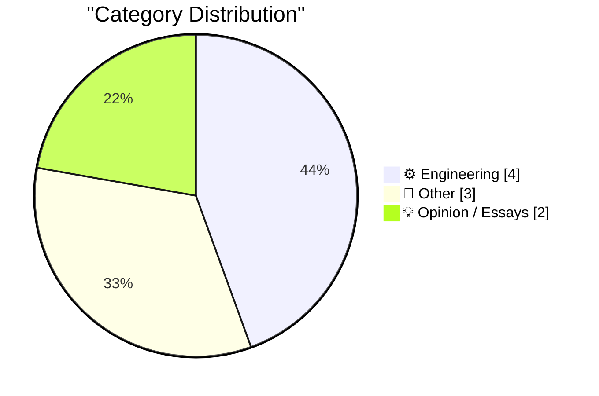
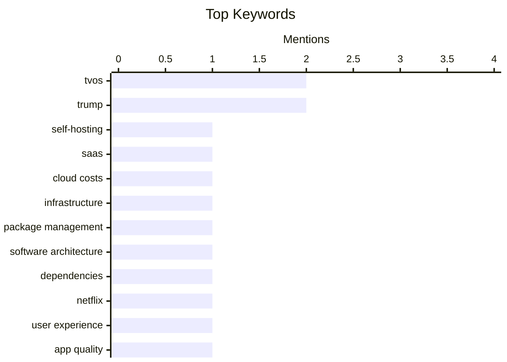

## Today's Highlights
Apple's ecosystem faces scrutiny today, with discussions highlighting the need for better tvOS video player standards and questions surrounding past hardware release timing. Concurrently, the broader software development world is re-evaluating foundational practices. Debates continue on the cost-effectiveness of self-hosting versus SaaS, the critical roles of software packages, and ongoing advancements in retro computing emulation.
---
## Must Read Today
1. **Self-Hosting: Still Worth It?**
[Self-Hosting: Still Worth It?](https://feed.tedium.co/link/15204/17308221/self-hosting-platform-tools-guide) — tedium.co · 22h ago · ⚙️ Engineering
> This article questions whether self-hosting remains a cost-effective alternative to SaaS, given the continuous increase in SaaS prices. Historically, self-hosting was often cheaper, but the current landscape involves evaluating the effort and potential hidden costs of maintaining self-hosted solutions against subscription fees. It implicitly compares the total cost of ownership for both models, considering factors beyond just initial setup. The article aims to determine if self-hosting still offers a viable defense against escalating SaaS expenses in today's market.
💡 **Why read it**: It provides a timely re-evaluation of the economic and practical viability of self-hosting in the current SaaS-dominated landscape.
🏷️ Self-hosting, SaaS, Cloud Costs, Infrastructure
2. **The Roles of Packages**
[The Roles of Packages](https://nesbitt.io/2026/03/29/the-roles-of-packages.html) — nesbitt.io · 4h ago · ⚙️ Engineering
> This article explores the various roles that software packages play within different package management systems. It applies Sajaniemi's roles of variables concept to packages, offering a systematic framework to understand their functions. This generalized analysis is intended to be applicable across "every kind of package manager," categorizing packages based on their purpose, such as dependencies, executables, or libraries. The work provides a theoretical foundation for classifying and understanding the diverse functions of packages in software development.
💡 **Why read it**: It introduces a novel conceptual framework for analyzing and categorizing the roles of packages across various package managers, offering a deeper understanding of software distribution.
🏷️ Package Management, Software Architecture, Dependencies
3. **Netflix Wrecked Their tvOS Video Player**
[Netflix Wrecked Their tvOS Video Player](https://www.pocket-lint.com/netflix-just-made-their-app-worse-and-theres-no-way-to-fix-it/) — daringfireball.net · 22h ago · 💡 Opinion / Essays
> Netflix's recent tvOS app update has introduced subtle but frustrating usability issues for Apple TV users, according to reports. Apple TV users on Reddit, including iamonreddit, noticed that the update made fast-forward and rewind functions significantly more difficult to use. This degradation of the user experience impacts core video playback controls, despite the app appearing largely similar on other platforms. The update ultimately made the Netflix app less user-friendly on the tvOS platform.
💡 **Why read it**: It highlights a specific instance of a major app (Netflix) degrading its user experience on a particular platform (tvOS) due to a poorly implemented update.
🏷️ Netflix, tvOS, User Experience, App Quality
---
## Data Overview
| Sources Scanned | Articles Fetched | Time Window | Selected |
|:---:|:---:|:---:|:---:|
| 78/92 | 2383 -> 9 | 24h | **9** |
### Category Distribution

### Top Keywords

<details>
<summary>Plain Text Keyword Chart (Terminal Friendly)</summary>
```
tvos                  │ ████████████████████ 2
trump                 │ ████████████████████ 2
self-hosting          │ ██████████░░░░░░░░░░ 1
saas                  │ ██████████░░░░░░░░░░ 1
cloud costs           │ ██████████░░░░░░░░░░ 1
infrastructure        │ ██████████░░░░░░░░░░ 1
package management    │ ██████████░░░░░░░░░░ 1
software architecture │ ██████████░░░░░░░░░░ 1
dependencies          │ ██████████░░░░░░░░░░ 1
netflix               │ ██████████░░░░░░░░░░ 1
```
</details>
### Topic Tags
**tvos**(2) · **trump**(2) · **self-hosting**(1) · saas(1) · cloud costs(1) · infrastructure(1) · package management(1) · software architecture(1) · dependencies(1) · netflix(1) · user experience(1) · app quality(1) · 6502(1) · emulation(1) · virtualization(1) · retro computing(1) · apple tv(1) · ux(1) · app standards(1) · apple history(1)
---
## Engineering
### 1. Self-Hosting: Still Worth It?
[Self-Hosting: Still Worth It?](https://feed.tedium.co/link/15204/17308221/self-hosting-platform-tools-guide) — **tedium.co** · 22h ago · ⭐ 24/30
> This article questions whether self-hosting remains a cost-effective alternative to SaaS, given the continuous increase in SaaS prices. Historically, self-hosting was often cheaper, but the current landscape involves evaluating the effort and potential hidden costs of maintaining self-hosted solutions against subscription fees. It implicitly compares the total cost of ownership for both models, considering factors beyond just initial setup. The article aims to determine if self-hosting still offers a viable defense against escalating SaaS expenses in today's market.
🏷️ Self-hosting, SaaS, Cloud Costs, Infrastructure
---
### 2. The Roles of Packages
[The Roles of Packages](https://nesbitt.io/2026/03/29/the-roles-of-packages.html) — **nesbitt.io** · 4h ago · ⭐ 23/30
> This article explores the various roles that software packages play within different package management systems. It applies Sajaniemi's roles of variables concept to packages, offering a systematic framework to understand their functions. This generalized analysis is intended to be applicable across "every kind of package manager," categorizing packages based on their purpose, such as dependencies, executables, or libraries. The work provides a theoretical foundation for classifying and understanding the diverse functions of packages in software development.
🏷️ Package Management, Software Architecture, Dependencies
---
### 3. 6o6 v1.1: Faster 6502-on-6502 virtualization for a C64/Apple II Apple-1 emulator
[6o6 v1.1: Faster 6502-on-6502 virtualization for a C64/Apple II Apple-1 emulator](https://oldvcr.blogspot.com/feeds/6057522559606247980/comments/default) — **oldvcr.blogspot.com** · 11h ago · ⭐ 21/30
> The article announces the release of 6o6 v1.1, an updated emulator focused on achieving faster 6502-on-6502 virtualization for C64/Apple II Apple-1 emulation. This update implies significant optimizations to the virtualization layer, enhancing the efficiency of running a 6502 CPU within another 6502 environment. The improvements aim to boost the speed and performance of emulating vintage systems like the Commodore 64 and Apple II. Ultimately, 6o6 v1.1 delivers substantial speed enhancements for retro-computing enthusiasts.
🏷️ 6502, Emulation, Virtualization, Retro Computing
---
### 4. Apple Should Set and Enforce Some Basic Standards for Custom Video Players on tvOS
[Apple Should Set and Enforce Some Basic Standards for Custom Video Players on tvOS](https://daringfireball.net/2024/03/quickly_toggling_closed_captions_on_apple_tv) — **daringfireball.net** · 14h ago · ⭐ 20/30
> This article argues that Apple should establish and enforce basic standards for custom video players on tvOS, prompted by poor user experiences like Netflix's. The author references previous complaints about Netflix's tvOS app, noting that fundamental features such as quickly toggling closed captions are often poorly implemented or hidden. Existing workarounds, like using the Control Center Apple TV remote on an iPhone or setting an Accessibility Shortcut for triple-clicking the Menu/Back button, highlight a lack of consistent design. Apple needs to intervene with stricter guidelines to ensure a consistent and high-quality user experience across all tvOS video applications.
🏷️ tvOS, Apple TV, UX, App Standards
---
## Other
### 5. ‘How Apple Became Apple: The Definitive Oral History of the Company’s Earliest Days’
[‘How Apple Became Apple: The Definitive Oral History of the Company’s Earliest Days’](https://www.fastcompany.com/91514404/apple-founding-50th-anniversary-apple-1-apple-ii-jobs-wozniak?mvgt=E5Loo3fO74zl) — **daringfireball.net** · 16h ago · ⭐ 20/30
> This article introduces a "spectacularly good" oral history by Harry McCracken for Fast Company, detailing Apple's earliest days and founding. The feature provides a comprehensive account of Apple's origin story, covering the Apple-1 and Apple II eras leading up to its 50th anniversary. It highlights the remarkable number of original key players still alive and contributing to the narrative, including Chris Espinosa, who was observed writing BASIC programs on an Apple-1. This oral history offers an invaluable, first-hand perspective on the foundational years of Apple, featuring insights from many original participants.
🏷️ Apple History, Oral History, Company Origins
---
### 6. Trump Is Putting His Signature on U.S. Currency
[Trump Is Putting His Signature on U.S. Currency](https://www.nytimes.com/2026/03/26/us/politics/trump-signature-us-dollars.html) — **daringfireball.net** · 22h ago · ⭐ 17/30
> The Treasury Department announced that President Trump's signature will appear on U.S. dollars later this year, marking an unprecedented change. Alan Rappeport, reporting for The New York Times, states that this decision honors the United States' 250th anniversary. Trump will become the first sitting U.S. president to have his signature on the greenback, appearing alongside other traditional elements on the paper currency. This move represents a significant departure from historical practice, where only the Treasury Secretary's signature typically appears.
🏷️ US Currency, Trump, Treasury
---
### 7. New York Post: ‘Trump Considers Renaming Strait of Hormuz’
[New York Post: ‘Trump Considers Renaming Strait of Hormuz’](https://nypost.com/2026/03/27/us-news/trump-considers-renaming-strait-of-hormuz-after-either-america-or-himself-once-he-evicts-iran/) — **daringfireball.net** · 23h ago · ⭐ 13/30
> The New York Post reports that President Trump is considering renaming the Strait of Hormuz, a highly controversial proposal. Trump is reportedly prioritizing taking control of the Strait due to frustration with allies' lack of help in opening the crucial waterway. The article states he plans to rename it "America" or after himself, "once he evicts Iran." The author notes the New York Post's journalistic standards, suggesting readers consider the source's credibility. President Trump is reportedly contemplating renaming the strategically vital Strait of Hormuz to "America" or after himself, following a potential military intervention to assert control.
🏷️ Trump, Strait of Hormuz, Geopolitics
---
## Opinion / Essays
### 8. Netflix Wrecked Their tvOS Video Player
[Netflix Wrecked Their tvOS Video Player](https://www.pocket-lint.com/netflix-just-made-their-app-worse-and-theres-no-way-to-fix-it/) — **daringfireball.net** · 22h ago · ⭐ 21/30
> Netflix's recent tvOS app update has introduced subtle but frustrating usability issues for Apple TV users, according to reports. Apple TV users on Reddit, including iamonreddit, noticed that the update made fast-forward and rewind functions significantly more difficult to use. This degradation of the user experience impacts core video playback controls, despite the app appearing largely similar on other platforms. The update ultimately made the Netflix app less user-friendly on the tvOS platform.
🏷️ Netflix, tvOS, User Experience, App Quality
---
### 9. The 2019 Intel Mac Pro’s Unfortunate Timing
[The 2019 Intel Mac Pro’s Unfortunate Timing](https://512pixels.net/2026/03/how-apple-could-have-saved-the-mac-pro/) — **daringfireball.net** · 14h ago · ⭐ 16/30
> This article discusses the unfortunate timing of the 2019 Intel Mac Pro's release, which occurred just before Apple's transition to Apple Silicon. Stephen Hackett at 512 Pixels reflects on how Apple could have avoided releasing "the best Intel Mac ever" less than a year before the M1 chip's debut. He suggests that if Apple had adhered to an earlier timeline, replacing the 2013 Mac Pro with an iMac "specifically targeted at large segments of the pro market" in 2017, the timing issue could have been mitigated. The 2019 Intel Mac Pro's release was poorly timed, becoming obsolete quickly due to the imminent and unannounced shift to Apple Silicon, representing a strategic miscalculation.
🏷️ Apple, Mac Pro, Product Strategy, Hardware Timing
---
*Generated at 2026-03-29 14:04 | Scanned 78 sources -> 2383 articles -> selected 9*
*Based on the [Hacker News Popularity Contest 2025](https://refactoringenglish.com/tools/hn-popularity/) RSS source list recommended by [Andrej Karpathy](https://x.com/karpathy)*
*Produced by Dongdianr AI. Follow the same-name WeChat public account for more AI practical tips 💡*
