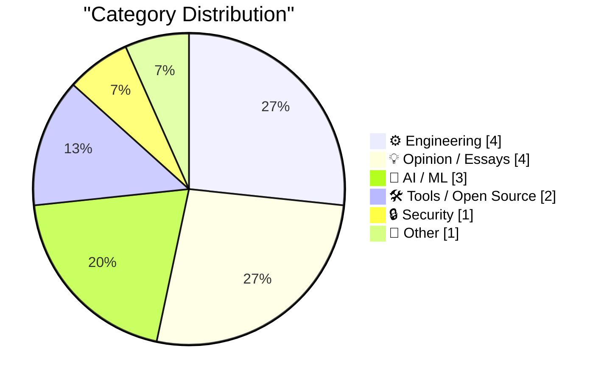
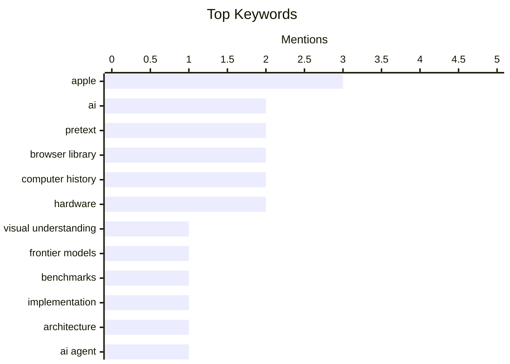

## Today's Highlights
Today's tech discussions delve into the true capabilities of AI, with experts challenging the visual understanding of frontier models and clarifying AI hardware terminology. Developers are also seeing a surge in specialized tools designed to streamline complex workflows, from integrating authentication and checking for Python vulnerabilities to enhancing code comparison. A focus on improving developer experience extends to better documentation engagement, aiming for more efficient and secure project development.
---
## Must Read Today
1. **The mirage of visual understanding in current frontier models**
[The mirage of visual understanding in current frontier models](https://garymarcus.substack.com/p/the-mirage-of-visual-understanding) — garymarcus.substack.com · 23h ago · 🤖 AI / ML
> Gary Marcus argues that current "frontier models" lack genuine visual understanding, often succeeding through statistical correlations rather than true comprehension. He highlights instances where models achieve "top rank on a standard chest X-ray question-answering benchmark without access to any images," indicating they exploit textual biases or memorized patterns. This suggests models can perform well on benchmarks by leveraging linguistic cues or dataset artifacts, rather than processing visual information. Such performance masks a fundamental inability to interpret visual data in a human-like way. The article concludes that these models present a "mirage" of visual understanding, underscoring the need for more robust evaluation methods that truly test visual reasoning.
💡 **Why read it**: It critically examines the limitations of current AI models, particularly in visual understanding, by exposing how they can 'succeed' on benchmarks without genuine comprehension.
🏷️ AI, Visual Understanding, Frontier Models, Benchmarks
2. **Pretext — Under the Hood**
[Pretext — Under the Hood](https://simonwillison.net/2026/Mar/29/pretext-explainer/#atom-everything) — simonwillison.net · 18h ago · ⚙️ Engineering
> This article introduces "Pretext — Under the Hood," a tool designed by Simon Willison to explain the technical implementation of the Pretext library. It serves as an explainer, likely detailing how Pretext calculates text height without DOM interaction, as described in the main Pretext article. The tool aims to demystify the underlying mechanisms and design choices of the library. The article provides a resource for developers seeking a deeper technical understanding of the Pretext library's internal workings.
💡 **Why read it**: It provides a technical deep-dive into the 'Pretext' library, explaining its internal mechanisms for calculating text height without DOM interaction.
🏷️ Pretext, implementation, browser library, architecture
3. **WorkOS**
[WorkOS](https://workos.com/docs/authkit/cli-installer?utm_source=daringfireball&amp;utm_medium=newsletter&amp;utm_campaign=q12026) — daringfireball.net · 17h ago · 🤖 AI / ML
> Integrating authentication into applications can be complex and time-consuming for developers. WorkOS offers a new CLI tool that leverages an AI agent, powered by Claude, to automate auth integration. This CLI reads a project, detects its framework, and writes a complete authentication integration directly into the codebase without requiring an initial signup. Beyond installation, "WorkOS Skills" enhance the agent's expertise, and `workos seed` allows defining environments as code. WorkOS aims to significantly simplify and accelerate the process of adding robust authentication to applications using AI-driven automation.
💡 **Why read it**: It introduces an innovative AI-powered CLI tool that automates complex authentication integrations, potentially saving developers significant time and effort.
🏷️ AI agent, code generation, authentication, Claude
---
## Data Overview
| Sources Scanned | Articles Fetched | Time Window | Selected |
|:---:|:---:|:---:|:---:|
| 78/92 | 2382 -> 15 | 24h | **15** |
### Category Distribution

### Top Keywords

<details>
<summary>Plain Text Keyword Chart (Terminal Friendly)</summary>
```
apple                │ ████████████████████ 3
ai                   │ █████████████░░░░░░░ 2
pretext              │ █████████████░░░░░░░ 2
browser library      │ █████████████░░░░░░░ 2
computer history     │ █████████████░░░░░░░ 2
hardware             │ █████████████░░░░░░░ 2
visual understanding │ ███████░░░░░░░░░░░░░ 1
frontier models      │ ███████░░░░░░░░░░░░░ 1
benchmarks           │ ███████░░░░░░░░░░░░░ 1
implementation       │ ███████░░░░░░░░░░░░░ 1
```
</details>
### Topic Tags
**apple**(3) · **ai**(2) · **pretext**(2) · browser library(2) · computer history(2) · hardware(2) · visual understanding(1) · frontier models(1) · benchmarks(1) · implementation(1) · architecture(1) · ai agent(1) · code generation(1) · authentication(1) · claude(1) · python(1) · vulnerability(1) · security(1) · osv.dev(1) · frontend(1)
---
## Engineering
### 1. Pretext — Under the Hood
[Pretext — Under the Hood](https://simonwillison.net/2026/Mar/29/pretext-explainer/#atom-everything) — **simonwillison.net** · 18h ago · ⭐ 26/30
> This article introduces "Pretext — Under the Hood," a tool designed by Simon Willison to explain the technical implementation of the Pretext library. It serves as an explainer, likely detailing how Pretext calculates text height without DOM interaction, as described in the main Pretext article. The tool aims to demystify the underlying mechanisms and design choices of the library. The article provides a resource for developers seeking a deeper technical understanding of the Pretext library's internal workings.
🏷️ Pretext, implementation, browser library, architecture
---
### 2. The rise and fall of IBM's 4 Pi aerospace computers: an illustrated history
[The rise and fall of IBM's 4 Pi aerospace computers: an illustrated history](http://www.righto.com/feeds/542341856603240438/comments/default) — **righto.com** · 21h ago · ⭐ 23/30
> The article details the history and significance of IBM's 4 Pi aerospace computers, particularly their role in critical space missions. On April 12, 1981, the Space Shuttle's inaugural flight was largely controlled by four IBM 4 Pi computers, with a fifth on standby for redundancy. These "Modular Multiprocessors" (Mo) were crucial for flight control. The article likely traces their development, architectural details, and eventual obsolescence, showcasing their impact on early space exploration technology. IBM's 4 Pi computers were foundational to the success of early space missions like the Space Shuttle, representing a significant chapter in aerospace computing history.
🏷️ IBM, Aerospace Computers, Space Shuttle, Computer History
---
### 3. How Do We Get Developers to Read the Docs
[How Do We Get Developers to Read the Docs](https://idiallo.com/blog/how-do-we-get-developers-to-read-the-docs?src=feed) — **idiallo.com** · 2h ago · ⭐ 22/30
> Developers often struggle to engage with or fully utilize documentation, even when it's well-written and comprehensive. The author recounts an experience with "perfect API" documentation that directly answered questions arising from code review, such as "Why do we make two calls to get the..." with "We are fetching two types of orders to support legacy subscribers...". This highlights that effective documentation anticipates developer questions and provides immediate, relevant context. The article implicitly argues for documentation that is integrated into the development workflow and directly addresses common pain points. The key to getting developers to read documentation lies in creating highly relevant, anticipatory, and easily accessible content that directly answers their immediate coding questions.
🏷️ documentation, developers, API, software engineering
---
### 4. What happened to Procomm Plus
[What happened to Procomm Plus](https://dfarq.homeip.net/what-happened-to-procomm-plus/?utm_source=rss&#038;utm_medium=rss&#038;utm_campaign=what-happened-to-procomm-plus) — **dfarq.homeip.net** · 3h ago · ⭐ 14/30
> This article explores the rise and eventual obsolescence of Procomm Plus, a dominant terminal emulator from the late 1980s and early 1990s. Procomm Plus, developed by Datastorm in Columbia, Mo., was the "ultimate" terminal emulator, widely used for connecting to bulletin board systems (BBSs) and early online services. Its decline was primarily due to the shift from dial-up modem connections to the internet and graphical web browsers, rendering traditional terminal emulation less relevant. Procomm Plus's fate illustrates how rapid technological shifts, specifically the rise of the internet, can quickly render even highly successful software products obsolete.
🏷️ Procomm Plus, Terminal Emulator, Software History, Vintage Software
---
## Opinion / Essays
### 5. The Talk Show: ‘You’re Going to Have the Niggles’
[The Talk Show: ‘You’re Going to Have the Niggles’](https://daringfireball.net/thetalkshow/2026/03/29/ep-444) — **daringfireball.net** · 17h ago · ⭐ 20/30
> This article is an announcement for a podcast episode discussing recent Apple product announcements. The episode features Christina Warren joining John Gruber to discuss Apple's "big month of product announcements," specifically focusing on the iPhone 17e and MacBook Neo. They also "pour one out for the Mac Pro," indicating a discussion about its status or future. The podcast offers an analysis and commentary on Apple's latest product releases and strategic directions.
🏷️ Apple, podcast, product announcements, iPhone
---
### 6. Notes on going solo: celebrating 6 years of Studio Self
[Notes on going solo: celebrating 6 years of Studio Self](https://www.joanwestenberg.com/notes-on-going-solo-celebrating-6-years-of-studio-self/) — **joanwestenberg.com** · 8h ago · ⭐ 17/30
> This article reflects on the author's six-year journey of running a successful solo-powered business, Studio Self, since roughly 2020. The author operates without employees, utilizing a home office, a laptop, and AI tools for scalability. This lean model allows for a "minor empire" built on individual effort and strategic technology adoption. It demonstrates that a highly effective and scalable business can be built and sustained by a single individual through smart technology adoption and a focused approach.
🏷️ Solopreneur, Solo Business, Career, Entrepreneurship
---
### 7. Version History: ‘The Macintosh’
[Version History: ‘The Macintosh’](https://www.theverge.com/podcast/903068/macintosh-1984-version-history) — **daringfireball.net** · 17h ago · ⭐ 16/30
> This article discusses the historical impact and foresight of the original Macintosh computer, despite its initial sales figures. The Macintosh was "right" about future computer usage, the need for simplicity, and the importance of deep care for both hardware and software design. It pioneered user-friendly interfaces and integrated design principles that became industry standards. The original Macintosh, though not an immediate commercial success, fundamentally changed the trajectory of personal computing by establishing key design and usability paradigms.
🏷️ Macintosh, computer history, Apple, hardware
---
### 8. The Verge: ‘Rank the Best Apple Products From the Last 50 Years’
[The Verge: ‘Rank the Best Apple Products From the Last 50 Years’](https://www.theverge.com/cs/tech/900477/apple-50-anniversary-rank-products) — **daringfireball.net** · 17h ago · ⭐ 10/30
> This article reacts to a poll by The Verge ranking the best Apple products from the last 50 years, specifically expressing strong disagreement with certain results. The author criticizes the poll's democratic nature, highlighting a specific grievance that the Extended Keyboard II is ranked as low as #47. This implies a perceived lack of appreciation for certain historically significant or well-designed Apple peripherals. The article serves as a commentary on subjective product rankings and the potential for user polls to undervalue products that were highly influential or well-regarded by enthusiasts.
🏷️ Apple, poll, products, opinion
---
## AI / ML
### 9. The mirage of visual understanding in current frontier models
[The mirage of visual understanding in current frontier models](https://garymarcus.substack.com/p/the-mirage-of-visual-understanding) — **garymarcus.substack.com** · 23h ago · ⭐ 27/30
> Gary Marcus argues that current "frontier models" lack genuine visual understanding, often succeeding through statistical correlations rather than true comprehension. He highlights instances where models achieve "top rank on a standard chest X-ray question-answering benchmark without access to any images," indicating they exploit textual biases or memorized patterns. This suggests models can perform well on benchmarks by leveraging linguistic cues or dataset artifacts, rather than processing visual information. Such performance masks a fundamental inability to interpret visual data in a human-like way. The article concludes that these models present a "mirage" of visual understanding, underscoring the need for more robust evaluation methods that truly test visual reasoning.
🏷️ AI, Visual Understanding, Frontier Models, Benchmarks
---
### 10. WorkOS
[WorkOS](https://workos.com/docs/authkit/cli-installer?utm_source=daringfireball&amp;utm_medium=newsletter&amp;utm_campaign=q12026) — **daringfireball.net** · 17h ago · ⭐ 26/30
> Integrating authentication into applications can be complex and time-consuming for developers. WorkOS offers a new CLI tool that leverages an AI agent, powered by Claude, to automate auth integration. This CLI reads a project, detects its framework, and writes a complete authentication integration directly into the codebase without requiring an initial signup. Beyond installation, "WorkOS Skills" enhance the agent's expertise, and `workos seed` allows defining environments as code. WorkOS aims to significantly simplify and accelerate the process of adding robust authentication to applications using AI-driven automation.
🏷️ AI agent, code generation, authentication, Claude
---
### 11. Small note about AI 'GPUs'
[Small note about AI 'GPUs'](https://xeiaso.net/notes/2026/ai-gpus-cant-process-graphics/) — **xeiaso.net** · 14h ago · ⭐ 21/30
> The common term "GPU" (Graphics Processing Unit) for AI accelerators can be misleading, as these specialized chips often lack traditional graphics processing capabilities. The article points out the irony that many "AI GPUs" are designed primarily for parallel computation tasks crucial for machine learning, such as matrix multiplications, rather than rendering graphics. While they share architectural roots with graphics cards, their modern design is optimized for AI workloads, often omitting or deprioritizing graphics-specific hardware. The term "AI GPU" is a misnomer, as these units are specialized accelerators for AI computation, not general-purpose graphics processors.
🏷️ AI, GPUs, hardware, deep learning
---
## Tools / Open Source
### 12. Pretext
[Pretext](https://simonwillison.net/2026/Mar/29/pretext/#atom-everything) — **simonwillison.net** · 17h ago · ⭐ 24/30
> Accurately calculating the height of line-wrapped text paragraphs in a browser typically requires rendering and measuring the DOM, which can be inefficient or problematic. Cheng Lou, a former React core developer and creator of `react-motion`, released "Pretext," an exciting new browser library. Pretext solves this by calculating text height *without touching the DOM*. This approach avoids the performance overhead and potential layout shifts associated with traditional DOM-based measurement methods. Pretext offers an innovative and efficient solution for text height calculation, improving performance and developer experience in web applications.
🏷️ Pretext, browser library, frontend, React
---
### 13. Git Diff Drivers
[Git Diff Drivers](https://nesbitt.io/2026/03/30/git-diff-drivers.html) — **nesbitt.io** · 4h ago · ⭐ 22/30
> Standard `git diff` can be insufficient for comparing complex or binary file types effectively. The article explores the capabilities of Git's diff drivers, which extend `git diff` beyond simple text comparisons. These drivers include built-in language-specific support, allowing for more intelligent diffing of code. Additionally, custom `textconv` filters enable Git to convert non-textual files (e.g., images, compiled binaries, archives) into a readable text representation before diffing, making changes visible. Git diff drivers provide powerful customization options to improve the readability and utility of diffs for a wide range of file types, enhancing developer productivity.
🏷️ Git, Diff Drivers, Version Control, Developer Tools
---
## Security
### 14. Python Vulnerability Lookup
[Python Vulnerability Lookup](https://simonwillison.net/2026/Mar/29/python-vulnerability-lookup/#atom-everything) — **simonwillison.net** · 19h ago · ⭐ 25/30
> Developers need an easy way to check their Python project dependencies for known security vulnerabilities. Simon Willison created an HTML tool for Python vulnerability lookup, built with Claude Code. This tool leverages the OSV.dev open source vulnerability database's open CORS JSON API. Users can paste `pyproject.toml` or `requirements.txt` files into the tool to quickly identify vulnerabilities in their project's dependencies. The article highlights a practical, browser-based tool that simplifies the process of scanning Python project dependencies for security issues using a public API.
🏷️ Python, vulnerability, security, OSV.dev
---
## Other
### 15. Gig Review: Vitamin String Quartet at The Barbican ★★★★★
[Gig Review: Vitamin String Quartet at The Barbican ★★★★★](https://shkspr.mobi/blog/2026/03/gig-review-vitamin-string-quartet-at-the-barbican/) — **shkspr.mobi** · 2h ago · ⭐ 9/30
> This is a five-star review of a Vitamin String Quartet concert at The Barbican, focusing on their unique musical concept. The Vitamin String Quartet is described as an "ever-changing line-up of musicians" known for their "excellent schtick" of playing modern songs in a classical style. They have produced over 300 albums, covering thousands of artists, and gained significant recognition, including soundtracking Bridgerton, with this specific concert featuring "The Music of Billie Eilish, Bridgerton, and Beyond." The review highly praises the Vitamin String Quartet's innovative approach to music, demonstrating their success in transforming contemporary hits into classical arrangements.
🏷️ music, concert, review, Barbican
---
*Generated at 2026-03-30 14:04 | Scanned 78 sources -> 2382 articles -> selected 15*
*Based on the [Hacker News Popularity Contest 2025](https://refactoringenglish.com/tools/hn-popularity/) RSS source list recommended by [Andrej Karpathy](https://x.com/karpathy)*
*Produced by Dongdianr AI. Follow the same-name WeChat public account for more AI practical tips 💡*
