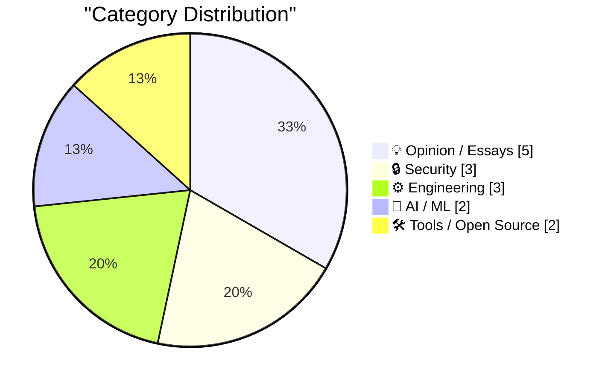
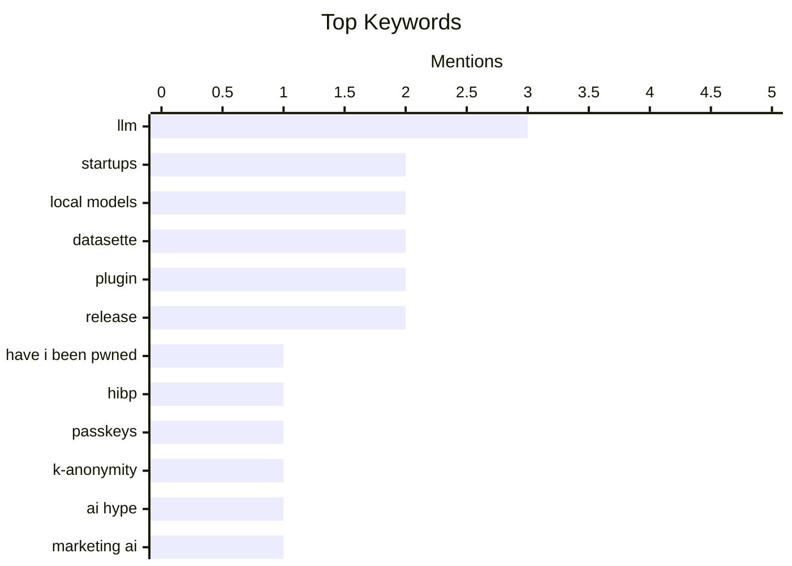

## Today's Highlights
Digital security is in a constant state of flux, with services bolstering defenses against an accelerating "renaissance era" of reverse engineering, often powered by AI. The AI landscape itself is marked by both innovative, niche model development and significant systemic fragility. This rapid evolution prompts a critical examination of tech culture, challenging exaggerated claims and exploring the profound impact platforms have on human language and information.
---
## Must Read Today
1. **HIBP Mega Update: Passkeys, k-Anonymity Searches, Massive Speed Enhancements and a Bulk Domain Verification API**
[HIBP Mega Update: Passkeys, k-Anonymity Searches, Massive Speed Enhancements and a Bulk Domain Verification API](https://www.troyhunt.com/passkeys-k-anonymity-searches-massive-speed-enhancements-bulk-domain-verification-api/) — troyhunt.com · 19h ago · 🔒 Security
> Have I Been Pwned (HIBP), a community service for breach notification, has received a significant update to enhance its security, privacy, and utility at scale. The update introduces Passkey support for improved account security and k-Anonymity searches for privacy-preserving password checks. It also features a new Bulk Domain Verification API, catering to large organizations needing to verify multiple domains efficiently. These enhancements support HIBP's daily operations, handling hundreds of thousands of website visitors, tens of millions of API queries, and hundreds of millions of password searches. The updates collectively strengthen HIBP's capabilities for both individual users and large enterprises.
💡 **Why read it**: It details significant security and privacy enhancements to a widely used breach notification service, including technical implementations like Passkeys and k-Anonymity.
🏷️ Have I Been Pwned, HIBP, passkeys, k-anonymity
2. **The World's First Bullshit**
[The World's First Bullshit](https://www.joanwestenberg.com/the-worlds-first-bullshit/) — joanwestenberg.com · 13h ago · 💡 Opinion / Essays
> The article critiques the prevalent trend of startups making exaggerated claims of "the world's first" AI-powered solutions, often lacking genuine substance. It highlights examples such as "AI CMO," "autonomous AI marketer," and "design agent 'with taste'," suggesting these titles are primarily marketing hype. The author implies a lack of critical thinking and a rush to brand existing concepts with AI buzzwords rather than demonstrating true innovation. This piece warns against the proliferation of unsubstantiated claims in the tech industry, particularly concerning AI. It urges for more skepticism and a focus on genuine innovation over marketing fluff.
💡 **Why read it**: It offers a critical perspective on the current wave of AI startup marketing, encouraging readers to question hyperbolic claims and seek genuine innovation.
🏷️ AI hype, startups, marketing AI, generative AI
3. **The Webs Digital Locks have Never had a Stronger Opponent**
[The Webs Digital Locks have Never had a Stronger Opponent](https://blog.pixelmelt.dev/the-webs-digital-locks/) — blog.pixelmelt.dev · 20h ago · 🔒 Security
> The article asserts that we are in a "renaissance era of reverse engineering," where Large Language Models (LLMs) pose an unprecedented challenge to digital security. LLMs are making it significantly easier to reverse engineer software and bypass digital locks, effectively putting "defenders on the back foot." The author implies that LLMs can automate or accelerate complex reverse engineering tasks, potentially democratizing these capabilities. This shift means current defensive strategies are increasingly inadequate against LLM-powered reverse engineering. The piece concludes that new approaches are urgently needed to cope with this evolving threat.
💡 **Why read it**: It highlights a critical emerging threat where LLMs are empowering reverse engineering, forcing a re-evaluation of digital security strategies.
🏷️ reverse engineering, LLMs, cybersecurity, digital locks
---
## Data Overview
| Sources Scanned | Articles Fetched | Time Window | Selected |
|:---:|:---:|:---:|:---:|
| 76/92 | 2345 -> 19 | 24h | **15** |
### Category Distribution

### Top Keywords

<details>
<summary>Plain Text Keyword Chart (Terminal Friendly)</summary>
```
llm               │ ████████████████████ 3
startups          │ █████████████░░░░░░░ 2
local models      │ █████████████░░░░░░░ 2
datasette         │ █████████████░░░░░░░ 2
plugin            │ █████████████░░░░░░░ 2
release           │ █████████████░░░░░░░ 2
have i been pwned │ ███████░░░░░░░░░░░░░ 1
hibp              │ ███████░░░░░░░░░░░░░ 1
passkeys          │ ███████░░░░░░░░░░░░░ 1
k-anonymity       │ ███████░░░░░░░░░░░░░ 1
```
</details>
### Topic Tags
**llm**(3) · **startups**(2) · **local models**(2) · datasette(2) · plugin(2) · release(2) · have i been pwned(1) · hibp(1) · passkeys(1) · k-anonymity(1) · ai hype(1) · marketing ai(1) · generative ai(1) · reverse engineering(1) · llms(1) · cybersecurity(1) · digital locks(1) · ethical ai(1) · british library(1) · ai(1)
---
## Opinion / Essays
### 1. The World's First Bullshit
[The World's First Bullshit](https://www.joanwestenberg.com/the-worlds-first-bullshit/) — **joanwestenberg.com** · 13h ago · ⭐ 27/30
> The article critiques the prevalent trend of startups making exaggerated claims of "the world's first" AI-powered solutions, often lacking genuine substance. It highlights examples such as "AI CMO," "autonomous AI marketer," and "design agent 'with taste'," suggesting these titles are primarily marketing hype. The author implies a lack of critical thinking and a rush to brand existing concepts with AI buzzwords rather than demonstrating true innovation. This piece warns against the proliferation of unsubstantiated claims in the tech industry, particularly concerning AI. It urges for more skepticism and a focus on genuine innovation over marketing fluff.
🏷️ AI hype, startups, marketing AI, generative AI
---
### 2. Making human languages irrelevant
[Making human languages irrelevant](https://rakhim.exotext.com/making-human-languages-irrelevant) — **rakhim.exotext.com** · 14h ago · ⭐ 24/30
> The article explores how large social media platforms and content providers might render human languages "irrelevant" within their digital spaces. The author notes instances where search engines prioritize foreign language results, such as Finnish Reddit threads, that are actually in English but can be translated with a simple URL parameter like `?tl=fi`. This suggests platforms are increasingly abstracting language barriers, potentially reducing the need for users to engage with content in its original language. As platforms integrate seamless translation and content localization, the specific human language of original content may become less significant for global communication within these digital ecosystems. This trend could fundamentally alter how users perceive and interact with multilingual content online.
🏷️ AI, language, communication, social media
---
### 3. “CEO said a thing!”
[“CEO said a thing!”](https://garymarcus.substack.com/p/ceo-said-a-thing) — **garymarcus.substack.com** · 19h ago · ⭐ 23/30
> The article critiques what it calls "lazy journalism," specifically the practice of uncritically reporting CEO statements without deeper analysis or context. It describes this journalistic approach as merely quoting a CEO's pronouncements, often without questioning motives, verifying claims, or exploring broader implications. This results in superficial reporting that lacks critical depth and serves more as corporate PR than genuine news. The piece advocates for more rigorous and analytical journalism that goes beyond simply relaying corporate announcements. It urges for a critical examination of power dynamics and underlying realities in media reporting.
🏷️ journalism, media critique, AI reporting, Gary Marcus
---
### 4. Solving Yesterday’s Problems Will Kill You
[Solving Yesterday’s Problems Will Kill You](https://steveblank.com/2026/03/31/solving-yesterdays-problems-will-kill-you/) — **steveblank.com** · 1h ago · ⭐ 20/30
> This article addresses the critical challenge for Portfolio Acquisition Executives and COCOMs in ensuring they prioritize and work on the *right* problems before committing resources. It highlights the need to move beyond solving past issues, which can be detrimental to future success. The upcoming 7th Annual Red Queen Conference (April 22-23, Silicon Valley) aims to tackle this by discussing, sharing, and prototyping "Innovation Targeting" concepts. The conference offers hands-on engagement with companies and ventures to help participants identify and focus on future-relevant challenges. The core takeaway is that continuous innovation and forward-looking problem identification are essential for organizational survival and growth.
🏷️ innovation, strategy, startups, problem-solving
---
### 5. ‘The Brand Age’
[‘The Brand Age’](https://paulgraham.com/brandage.html) — **daringfireball.net** · 21h ago · ⭐ 17/30
> The article discusses Paul Graham's essay "The Brand Age," which posits that a world defined solely by brand would be "weird, bad." The author, however, disagrees with Graham's conclusion, specifically in the context of the mechanical watch industry. While Graham might focus on high-end luxury Swiss brands, the author argues that the market for mechanical watches is currently vibrant and enjoyable, particularly due to independent brands like Baltic and Halios. The core takeaway is that the "Brand Age" isn't necessarily negative, especially when considering the dynamic and innovative landscape of independent creators challenging established luxury brands.
🏷️ Paul Graham, branding, market, opinion
---
## Security
### 6. HIBP Mega Update: Passkeys, k-Anonymity Searches, Massive Speed Enhancements and a Bulk Domain Verification API
[HIBP Mega Update: Passkeys, k-Anonymity Searches, Massive Speed Enhancements and a Bulk Domain Verification API](https://www.troyhunt.com/passkeys-k-anonymity-searches-massive-speed-enhancements-bulk-domain-verification-api/) — **troyhunt.com** · 19h ago · ⭐ 29/30
> Have I Been Pwned (HIBP), a community service for breach notification, has received a significant update to enhance its security, privacy, and utility at scale. The update introduces Passkey support for improved account security and k-Anonymity searches for privacy-preserving password checks. It also features a new Bulk Domain Verification API, catering to large organizations needing to verify multiple domains efficiently. These enhancements support HIBP's daily operations, handling hundreds of thousands of website visitors, tens of millions of API queries, and hundreds of millions of password searches. The updates collectively strengthen HIBP's capabilities for both individual users and large enterprises.
🏷️ Have I Been Pwned, HIBP, passkeys, k-anonymity
---
### 7. The Webs Digital Locks have Never had a Stronger Opponent
[The Webs Digital Locks have Never had a Stronger Opponent](https://blog.pixelmelt.dev/the-webs-digital-locks/) — **blog.pixelmelt.dev** · 20h ago · ⭐ 27/30
> The article asserts that we are in a "renaissance era of reverse engineering," where Large Language Models (LLMs) pose an unprecedented challenge to digital security. LLMs are making it significantly easier to reverse engineer software and bypass digital locks, effectively putting "defenders on the back foot." The author implies that LLMs can automate or accelerate complex reverse engineering tasks, potentially democratizing these capabilities. This shift means current defensive strategies are increasingly inadequate against LLM-powered reverse engineering. The piece concludes that new approaches are urgently needed to cope with this evolving threat.
🏷️ reverse engineering, LLMs, cybersecurity, digital locks
---
### 8. [Sponsor] Material Security
[[Sponsor] Material Security](https://material.security/lp-cloud-office-security?utm_source=third-party&amp;utm_medium=email&amp;utm_campaign=20260330-daringfireball) — **daringfireball.net** · 16h ago · ⭐ 18/30
> This article highlights the common "noise problem" faced by security teams, where manual tasks like phishing remediation, OAuth permission chasing, and file share auditing consume excessive headcount. Material Security offers a unified cloud workspace solution that integrates detection and response for email, files, and accounts into a single platform. It aims to augment native security gaps in Google and Microsoft environments without introducing typical enterprise bloat. By automating and centralizing these functions, Material Security enables security teams to scale their workspace efficiency rather than just their headcount. The main takeaway is that effective security solutions should reduce manual overhead and consolidate tools to improve operational efficiency.
🏷️ cloud security, workspace security, phishing, OAuth
---
## Engineering
### 9. Continuous, Continuous, Continuous
[Continuous, Continuous, Continuous](https://blog.jim-nielsen.com/2026/continuous-continuous-continuous/) — **blog.jim-nielsen.com** · 19h ago · ⭐ 22/30
> The article, referencing Jason Gorman, challenges the traditional phased approach to software development (design, coding, testing, release) in favor of a "continuous" mindset. It argues that breaking software development into discrete stages and assigning roles based on these stages creates inefficiencies and silos. Instead, a continuous approach, encompassing continuous design, coding, testing, and integration, fosters better collaboration and faster delivery. This methodology emphasizes constant feedback loops and iterative improvement throughout the entire lifecycle. Embracing a truly continuous approach across all aspects of software development is essential for modern teams to build and distribute software effectively and efficiently.
🏷️ continuous integration, continuous delivery, software craft, SDLC
---
### 10. Weekly Update 497
[Weekly Update 497](https://www.troyhunt.com/weekly-update-497/) — **troyhunt.com** · 13h ago · ⭐ 18/30
> The article briefly mentions ongoing progress with "OpenClaw," an agent-based system, focusing on optimizing the balance between human tasks and automated agent capabilities. The author notes that they are increasingly shifting workload from human operators to the OpenClaw agent. This indicates a focus on automation and efficiency gains in their operations by leveraging the agent's capabilities. The main conclusion is that they are successfully using OpenClaw to automate more tasks, finding a "sweet spot" where the agent handles a significant portion of the workload.
🏷️ weekly update, automation, agent, workload
---
### 11. Morse code tree
[Morse code tree](https://www.johndcook.com/blog/2026/03/31/morse-code-tree/) — **johndcook.com** · 1h ago · ⭐ 16/30
> The article introduces an interesting visual representation of a Morse code decoding decision tree, shared by Peter Vogel on X. The core problem addressed is the typically non-compact nature of decision trees, where branches often occupy separate horizontal levels. This specific Morse code tree is notable for its compact shape, which deviates from standard decision tree layouts. The image illustrates an efficient way to visualize the receive side of Morse code, guiding users through dots and dashes to decode characters. The main takeaway is that creative visual design can significantly improve the compactness and intuitability of complex decision trees.
🏷️ Morse code, decision tree, algorithm, visualization
---
## AI / ML
### 12. Mr. Chatterbox is a (weak) Victorian-era ethically trained model you can run on your own computer
[Mr. Chatterbox is a (weak) Victorian-era ethically trained model you can run on your own computer](https://simonwillison.net/2026/Mar/30/mr-chatterbox/#atom-everything) — **simonwillison.net** · 23h ago · ⭐ 24/30
> Trip Venturella released "Mr. Chatterbox," a unique language model trained exclusively on out-of-copyright Victorian-era texts, aiming for an "ethically trained" model. The model was trained from scratch on a corpus of over 28,000 British texts published between 1837 and 1899 from the British Library. This specific dataset choice is intended to imbue the model with Victorian-era ethics and avoid contemporary biases, resulting in a "weak" but distinct model. Mr. Chatterbox is designed to be runnable locally on personal computers. It demonstrates an alternative approach to AI training, focusing on historical data to explore ethical alignment and bias mitigation.
🏷️ LLM, ethical AI, local models, British Library
---
### 13. Quoting Georgi Gerganov
[Quoting Georgi Gerganov](https://simonwillison.net/2026/Mar/30/georgi-gerganov/#atom-everything) — **simonwillison.net** · 16h ago · ⭐ 23/30
> Georgi Gerganov highlights the significant challenges and inherent fragility in the current ecosystem of local language models, particularly concerning their deployment and reliability. He points out that issues often stem from the "harness," model chat templates, prompt construction, and even pure inference bugs. The long chain of components, developed by different parties, makes the system fragile and difficult to debug from user input to final result. This complexity underscores the immaturity of local LLM infrastructure. The article emphasizes that reliable deployment requires better integration and robustness across diverse components.
🏷️ LLM, local models, prompting, chat templates
---
## Tools / Open Source
### 14. datasette-llm 0.1a3
[datasette-llm 0.1a3](https://simonwillison.net/2026/Mar/30/datasette-llm/#atom-everything) — **simonwillison.net** · 18h ago · ⭐ 21/30
> This is a release announcement for `datasette-llm` version 0.1a3, focusing on enhanced configuration for available Large Language Models (LLMs). The update introduces the ability to configure "which LLMs are available for which purpose," allowing users to restrict the list of models usable with specific plugins. This addresses issue #3, providing more granular control over LLM integration within Datasette. The new version improves flexibility and control for Datasette users by enabling purpose-specific LLM configurations. This allows for more tailored and secure use of LLMs in different contexts.
🏷️ Datasette, LLM, plugin, release
---
### 15. datasette-files 0.1a3
[datasette-files 0.1a3](https://simonwillison.net/2026/Mar/30/datasette-files/#atom-everything) — **simonwillison.net** · 14h ago · ⭐ 20/30
> This is a release announcement for `datasette-files` version 0.1a3, driven by integration needs with other plugins like `datasette-extract`. The new release introduces `owners_can_edit` and `owners_can_delete` configuration options, alongside the `files-edit` permission. These additions provide more granular access control for file management within Datasette. The enhancements support its seamless integration into other tools and plugins. `datasette-files 0.1a3` thus improves file management capabilities within Datasette by adding crucial access control options, facilitating broader plugin integration.
🏷️ Datasette, plugin, release, data exploration
---
*Generated at 2026-03-31 14:04 | Scanned 76 sources -> 2345 articles -> selected 15*
*Based on the [Hacker News Popularity Contest 2025](https://refactoringenglish.com/tools/hn-popularity/) RSS source list recommended by [Andrej Karpathy](https://x.com/karpathy)*
*Produced by Dongdianr AI. Follow the same-name WeChat public account for more AI practical tips 💡*
