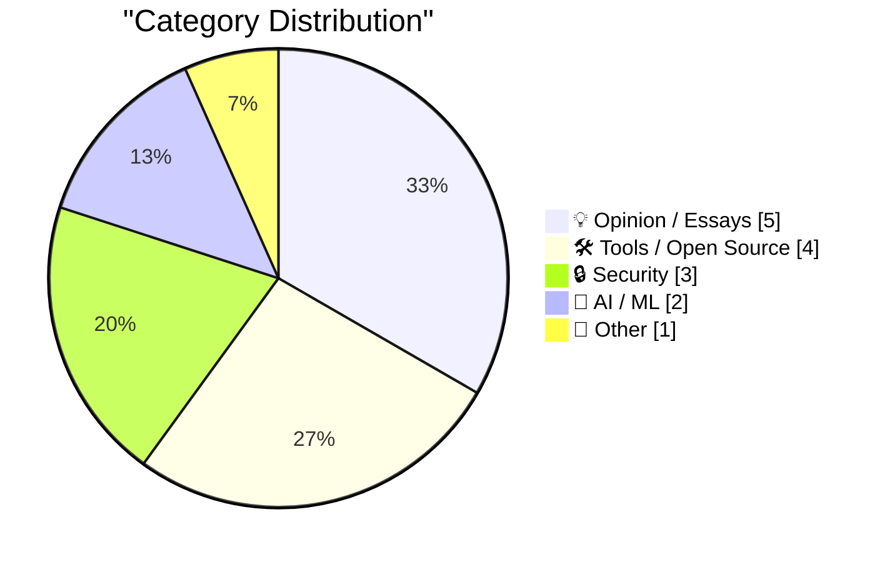
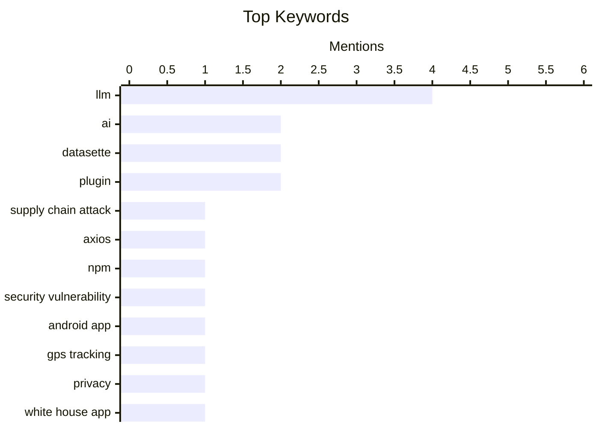

## Today's Highlights
Today's tech landscape is marked by escalating cybersecurity threats, with a new focus on software supply chain vulnerabilities and the long-term implications of quantum computing. Concurrently, artificial intelligence is rapidly maturing, moving beyond strategy to practical operational applications in areas like military conflicts, while major AI companies define new leadership roles and products. These developments underscore a broader shift in technology, from the economic value of hardware to the evolving nature of AI tools.
---
## Must Read Today
1. **Supply Chain Attack on Axios Pulls Malicious Dependency from npm**
[Supply Chain Attack on Axios Pulls Malicious Dependency from npm](https://simonwillison.net/2026/Mar/31/supply-chain-attack-on-axios/#atom-everything) — simonwillison.net · 14h ago · 🔒 Security
> Supply Chain Attack on Axios Pulls Malicious Dependency from npm
🏷️ Supply chain attack, Axios, npm, security vulnerability
2. **Technical Analysis of the Android Version of the White House’s New App**
[Technical Analysis of the Android Version of the White House’s New App](https://blog.thereallo.dev/blog/decompiling-the-white-house-app) — daringfireball.net · 22h ago · 🔒 Security
> Technical Analysis of the Android Version of the White House’s New App
🏷️ Android app, GPS tracking, privacy, White House app
3. **Quantum Y2K**
[Quantum Y2K](https://www.johndcook.com/blog/2026/03/31/quantum-y2k/) — johndcook.com · 23h ago · 🔒 Security
> Quantum Y2K
🏷️ Quantum computing, Cryptography, Post-quantum, Financial systems
---
## Data Overview
| Sources Scanned | Articles Fetched | Time Window | Selected |
|:---:|:---:|:---:|:---:|
| 76/92 | 2347 -> 31 | 24h | **15** |
### Category Distribution

### Top Keywords

<details>
<summary>Plain Text Keyword Chart (Terminal Friendly)</summary>
```
llm                    │ ████████████████████ 4
ai                     │ ██████████░░░░░░░░░░ 2
datasette              │ ██████████░░░░░░░░░░ 2
plugin                 │ ██████████░░░░░░░░░░ 2
supply chain attack    │ █████░░░░░░░░░░░░░░░ 1
axios                  │ █████░░░░░░░░░░░░░░░ 1
npm                    │ █████░░░░░░░░░░░░░░░ 1
security vulnerability │ █████░░░░░░░░░░░░░░░ 1
android app            │ █████░░░░░░░░░░░░░░░ 1
gps tracking           │ █████░░░░░░░░░░░░░░░ 1
```
</details>
### Topic Tags
**llm**(4) · **ai**(2) · **datasette**(2) · plugin(2) · supply chain attack(1) · axios(1) · npm(1) · security vulnerability(1) · android app(1) · gps tracking(1) · privacy(1) · white house app(1) · quantum computing(1) · cryptography(1) · post-quantum(1) · financial systems(1) · tool calling(1) · json mode(1) · testing(1) · military ai(1)
---
## Opinion / Essays
### 1. Quoting Soohoon Choi
[Quoting Soohoon Choi](https://simonwillison.net/2026/Apr/1/soohoon-choi/#atom-everything) — **simonwillison.net** · 11h ago · ⭐ 23/30
> Quoting Soohoon Choi
🏷️ AI, code generation, economic incentives, software development
---
### 2. Appointees to Trump’s Council of Advisors on Science and Technology
[Appointees to Trump’s Council of Advisors on Science and Technology](https://www.whitehouse.gov/releases/2026/03/president-trump-announces-appointments-to-presidents-council-of-advisors-on-science-and-technology/) — **daringfireball.net** · 22h ago · ⭐ 23/30
> Appointees to Trump’s Council of Advisors on Science and Technology
🏷️ Trump, tech advisors, science policy, industry leaders
---
### 3. What is Copilot exactly?
[What is Copilot exactly?](https://idiallo.com/blog/what-is-copilot-exactly?src=feed) — **idiallo.com** · 2h ago · ⭐ 23/30
> What is Copilot exactly?
🏷️ Copilot, AI assistant, developer productivity, personal experience
---
### 4. Infinite midwit
[Infinite midwit](https://www.experimental-history.com/p/infinite-midwit) — **experimental-history.com** · 21h ago · ⭐ 21/30
> This article explores the concept of the "infinite midwit," an individual intelligent enough to grasp complex ideas but not fully understand their nuances or limitations, leading to overconfidence and flawed conclusions. It discusses how this phenomenon manifests in various fields, often resulting in individuals confidently advocating for simplistic solutions or misinterpreting advanced concepts. The author suggests that the "infinite midwit" is a common intellectual trap, particularly in areas requiring deep expertise and critical thinking. The main takeaway is that true understanding often involves recognizing the limits of one's knowledge and the inherent complexity of reality.
🏷️ midwit, expertise, strategy, intellectual trends
---
### 5. Wayne’s World
[Wayne’s World](https://feed.tedium.co/link/15204/17311236/ronald-g-wayne-apple-interview) — **tedium.co** · 12h ago · ⭐ 20/30
> This article features an interview with Ronald G. Wayne, the often-forgotten third co-founder of Apple, as the company approaches its 50th anniversary. Wayne, who sold his 10% stake in Apple for $800 just 12 days after its founding in 1976, discusses his life and career, emphasizing that Apple was merely a "footnote" in his broader experiences. He reflects on his decision to leave, driven by a desire to avoid financial risk and potential liability, and his subsequent ventures. The interview provides a unique perspective on Apple's early days from someone who chose a different path.
🏷️ Apple, Ronald Wayne, Tech history, Founders
---
## Tools / Open Source
### 6. llm-echo 0.3
[llm-echo 0.3](https://simonwillison.net/2026/Mar/31/llm-echo-2/#atom-everything) — **simonwillison.net** · 22h ago · ⭐ 24/30
> llm-echo 0.3
🏷️ LLM, tool calling, JSON mode, testing
---
### 7. datasette-llm 0.1a5
[datasette-llm 0.1a5](https://simonwillison.net/2026/Apr/1/datasette-llm/#atom-everything) — **simonwillison.net** · 10h ago · ⭐ 20/30
> This release note announces `datasette-llm 0.1a5`, focusing on enhanced tracking capabilities for LLM interactions within Datasette. The key technical improvement is that the `llm_prompt_context()` plugin hook wrapper mechanism now tracks prompts executed within a chain, including tool call loops, in addition to one-off prompts. This feature, addressed in `#5`, allows for more comprehensive monitoring and debugging of complex LLM workflows. The update aims to provide better visibility into how LLMs are interacting with tools and generating responses over multiple steps.
🏷️ Datasette, LLM, plugin, prompt tracking
---
### 8. datasette-llm 0.1a4
[datasette-llm 0.1a4](https://simonwillison.net/2026/Mar/31/datasette-llm/#atom-everything) — **simonwillison.net** · 16h ago · ⭐ 20/30
> This release note introduces `datasette-llm 0.1a4`, highlighting a new feature for managing API keys for different LLM models. Users can now configure distinct API keys for models based on their specific purpose, such as dedicating an API key for `gpt-5.4-mini` specifically for enrichment tasks. This enhancement improves security and cost management by allowing granular control over API access for various LLM operations within Datasette. The update provides greater flexibility in deploying and managing diverse LLM models.
🏷️ Datasette, LLM, plugin, API keys
---
### 9. llm 0.30
[llm 0.30](https://simonwillison.net/2026/Mar/31/llm/#atom-everything) — **simonwillison.net** · 17h ago · ⭐ 20/30
> This release note announces `llm 0.30`, focusing on an enhancement to its plugin hook system for model registration. The `register_models()` plugin hook now accepts an optional `model_aliases` parameter, which lists all models, async models, and aliases already registered by other plugins. This allows plugins using `@hookimpl(trylast=True)` to inspect and potentially override or modify the model registration process based on previously registered entries. The update provides more advanced control and flexibility for plugin developers in managing LLM model availability.
🏷️ LLM, plugin hook, model registration, release
---
## Security
### 10. Supply Chain Attack on Axios Pulls Malicious Dependency from npm
[Supply Chain Attack on Axios Pulls Malicious Dependency from npm](https://simonwillison.net/2026/Mar/31/supply-chain-attack-on-axios/#atom-everything) — **simonwillison.net** · 14h ago · ⭐ 28/30
> Supply Chain Attack on Axios Pulls Malicious Dependency from npm
🏷️ Supply chain attack, Axios, npm, security vulnerability
---
### 11. Technical Analysis of the Android Version of the White House’s New App
[Technical Analysis of the Android Version of the White House’s New App](https://blog.thereallo.dev/blog/decompiling-the-white-house-app) — **daringfireball.net** · 22h ago · ⭐ 27/30
> Technical Analysis of the Android Version of the White House’s New App
🏷️ Android app, GPS tracking, privacy, White House app
---
### 12. Quantum Y2K
[Quantum Y2K](https://www.johndcook.com/blog/2026/03/31/quantum-y2k/) — **johndcook.com** · 23h ago · ⭐ 25/30
> Quantum Y2K
🏷️ Quantum computing, Cryptography, Post-quantum, Financial systems
---
## AI / ML
### 13. In the Iran war, it looks like AI helped with operations, not strategy
[In the Iran war, it looks like AI helped with operations, not strategy](https://garymarcus.substack.com/p/in-the-iran-war-it-looks-like-ai) — **garymarcus.substack.com** · 12h ago · ⭐ 24/30
> In the Iran war, it looks like AI helped with operations, not strategy
🏷️ AI, Military AI, Geopolitics, Operations
---
### 14. Business Insider Profiles Fidji Simo, OpenAI’s ‘CEO of Applications’
[Business Insider Profiles Fidji Simo, OpenAI’s ‘CEO of Applications’](https://www.businessinsider.com/fidji-simo-openai-product-research-profitability-profile-2026-3) — **daringfireball.net** · 15h ago · ⭐ 21/30
> Business Insider Profiles Fidji Simo, OpenAI’s ‘CEO of Applications’
🏷️ OpenAI, leadership, Fidji Simo, applications
---
## Other
### 15. RAM Is the New Bearer Bond
[RAM Is the New Bearer Bond](https://www.theatlantic.com/technology/2026/03/laptop-electronics-ram-ai-tax/686628/) — **daringfireball.net** · 16h ago · ⭐ 23/30
> RAM Is the New Bearer Bond
🏷️ RAM, hardware, market trends, supply chain
---
*Generated at 2026-04-01 14:04 | Scanned 76 sources -> 2347 articles -> selected 15*
*Based on the [Hacker News Popularity Contest 2025](https://refactoringenglish.com/tools/hn-popularity/) RSS source list recommended by [Andrej Karpathy](https://x.com/karpathy)*
*Produced by Dongdianr AI. Follow the same-name WeChat public account for more AI practical tips 💡*
