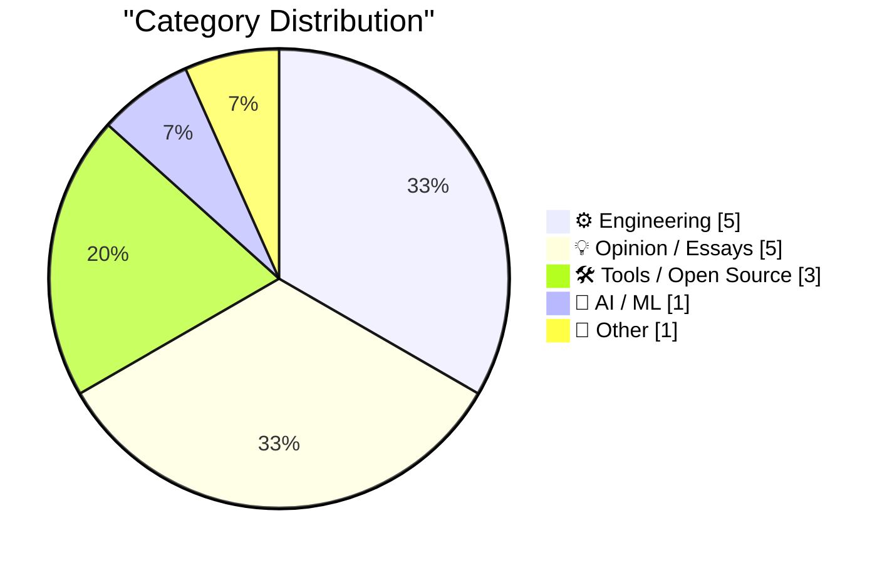
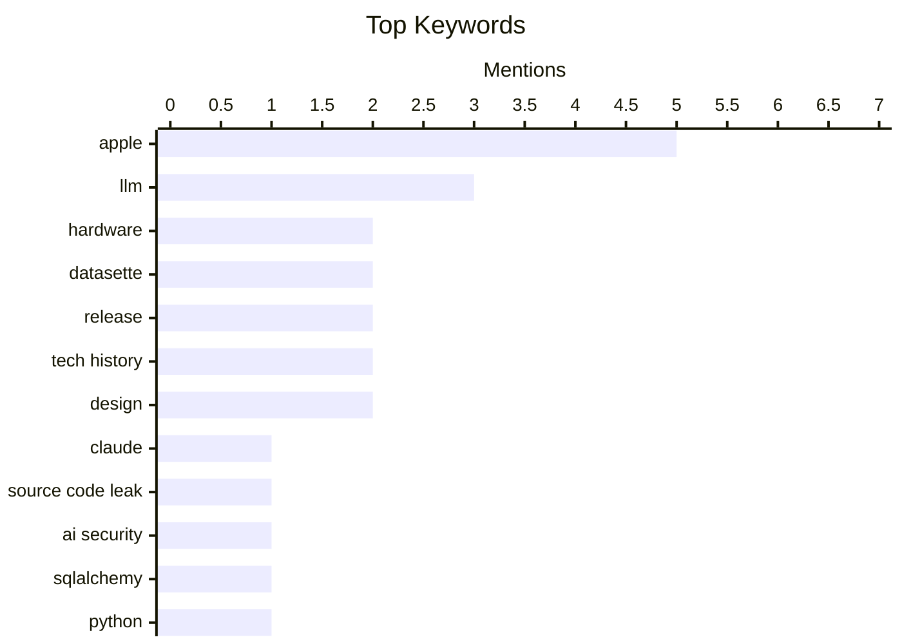

## Today's Highlights
Today's tech news is abuzz with the evolving role of AI, from the positive implications of source code leaks to its deeper integration into data tools and its potential impact on the job market. Concurrently, the hardware industry faces headwinds as rising DRAM prices threaten the hobbyist Single Board Computer sector, even as companies like Apple continue to innovate with new devices such as the AirPods Max 2. These trends highlight the constant interplay between information, technological progress, and market dynamics shaping our digital future.
---
## Must Read Today
1. **Pluralistic: It's extremely good that Claude's source-code leaked (02 Apr 2026)**
[Pluralistic: It's extremely good that Claude's source-code leaked (02 Apr 2026)](https://pluralistic.net/2026/04/02/limited-monopoly/) — pluralistic.net · 3h ago · 🤖 AI / ML
> This article argues that the leak of Claude's source code is a positive development, challenging the conventional view that such leaks are detrimental. It posits that open access to foundational AI models, even through unauthorized means, fosters competition and innovation by enabling smaller entities to build upon and improve proprietary technologies. This perspective critiques the "limited monopoly" model, suggesting it often stifles progress by concentrating power and knowledge. The author concludes that democratizing technology through such leaks ultimately serves the public good by accelerating AI development.
💡 **Why read it**: This article offers a controversial yet thought-provoking perspective on intellectual property and open-source principles in the context of AI development.
🏷️ Claude, Source Code Leak, LLM, AI Security
2. **SQLAlchemy 2 In Practice - Chapter 3 - One-To-Many Relationships**
[SQLAlchemy 2 In Practice - Chapter 3 - One-To-Many Relationships](https://blog.miguelgrinberg.com/post/sqlalchemy-2-in-practice---chapter-3---one-to-many-relationships) — miguelgrinberg.com · 3h ago · 🛠 Tools / Open Source
> This article, Chapter 3 of the "SQLAlchemy 2 in Practice" book, focuses on implementing one-to-many relationships within SQLAlchemy 2. It guides readers on defining and interacting with related data models, specifically using a `products` table as an example. The chapter likely covers essential steps such as defining foreign keys, utilizing the `relationship()` attribute for object-relational mapping, and performing CRUD operations on related objects. This practical guide is crucial for developers building applications with relational databases using SQLAlchemy.
💡 **Why read it**: It provides a practical, chapter-based guide for implementing one-to-many relationships using SQLAlchemy 2, which is crucial for database application development.
🏷️ SQLAlchemy, Python, ORM, Databases
3. **DRAM pricing is killing the hobbyist SBC market**
[DRAM pricing is killing the hobbyist SBC market](https://www.jeffgeerling.com/blog/2026/dram-pricing-is-killing-the-hobbyist-sbc-market/) — jeffgeerling.com · 17h ago · ⚙️ Engineering
> This article highlights how escalating DRAM pricing is severely impacting the hobbyist Single Board Computer (SBC) market. Raspberry Pi announced further price increases for all Pis with LPDDR4 RAM, including a new 'right-sized' 3GB Pi 4 for $83.75. Notably, the 16GB Pi 5 now costs $299.99, a significant jump. These rising costs are making high-end SBCs less accessible for hobbyists, pushing the market towards more expensive, professional applications. The author suggests this trend is making it increasingly difficult for enthusiasts to afford powerful SBCs for personal projects.
💡 **Why read it**: This article provides critical insight into the economic challenges facing the hobbyist SBC market due to DRAM price increases, directly impacting popular devices like the Raspberry Pi.
🏷️ Raspberry Pi, DRAM, pricing, hardware
---
## Data Overview
| Sources Scanned | Articles Fetched | Time Window | Selected |
|:---:|:---:|:---:|:---:|
| 77/92 | 2372 -> 24 | 24h | **15** |
### Category Distribution

### Top Keywords

<details>
<summary>Plain Text Keyword Chart (Terminal Friendly)</summary>
```
apple            │ ████████████████████ 5
llm              │ ████████████░░░░░░░░ 3
hardware         │ ████████░░░░░░░░░░░░ 2
datasette        │ ████████░░░░░░░░░░░░ 2
release          │ ████████░░░░░░░░░░░░ 2
tech history     │ ████████░░░░░░░░░░░░ 2
design           │ ████████░░░░░░░░░░░░ 2
claude           │ ████░░░░░░░░░░░░░░░░ 1
source code leak │ ████░░░░░░░░░░░░░░░░ 1
ai security      │ ████░░░░░░░░░░░░░░░░ 1
```
</details>
### Topic Tags
**apple**(5) · **llm**(3) · **hardware**(2) · datasette(2) · release(2) · tech history(2) · design(2) · claude(1) · source code leak(1) · ai security(1) · sqlalchemy(1) · python(1) · orm(1) · databases(1) · raspberry pi(1) · dram(1) · pricing(1) · ai(1) · employment(1) · future of work(1)
---
## Engineering
### 1. DRAM pricing is killing the hobbyist SBC market
[DRAM pricing is killing the hobbyist SBC market](https://www.jeffgeerling.com/blog/2026/dram-pricing-is-killing-the-hobbyist-sbc-market/) — **jeffgeerling.com** · 17h ago · ⭐ 25/30
> This article highlights how escalating DRAM pricing is severely impacting the hobbyist Single Board Computer (SBC) market. Raspberry Pi announced further price increases for all Pis with LPDDR4 RAM, including a new 'right-sized' 3GB Pi 4 for $83.75. Notably, the 16GB Pi 5 now costs $299.99, a significant jump. These rising costs are making high-end SBCs less accessible for hobbyists, pushing the market towards more expensive, professional applications. The author suggests this trend is making it increasingly difficult for enthusiasts to afford powerful SBCs for personal projects.
🏷️ Raspberry Pi, DRAM, pricing, hardware
---
### 2. Inside Apple’s AirPods Max 2 and the H2 Chip Upgrade
[Inside Apple’s AirPods Max 2 and the H2 Chip Upgrade](https://www.techradar.com/audio/earbuds-airpods/only-limited-by-the-physics-inside-apples-airpods-max-2-and-the-h2-chip-upgrade) — **daringfireball.net** · 19h ago · ⭐ 24/30
> This article delves into the technical advancements of Apple's AirPods Max 2, focusing on the H2 chip upgrade and its impact on performance. Apple claims a 1.5x improvement in active noise cancellation (ANC) without any physical component changes, achieved through computational audio and the H2 chip's processing power. Apple VP of Platform Architecture Tim Millet and Director of Audio Product Marketing Eric Treski explain how software and chip design are pushing the limits of audio performance. This demonstrates Apple's strategy of leveraging silicon and advanced algorithms to enhance existing hardware capabilities.
🏷️ AirPods Max 2, H2 Chip, Apple Hardware, Audio Technology
---
### 3. Information and Technological Evolution
[Information and Technological Evolution](https://www.construction-physics.com/p/information-and-technological-evolution) — **construction-physics.com** · 1h ago · ⭐ 23/30
> This article explores the fundamental role of information in driving technological progress and evolution. It critiques the existing literature on technology for its uneven coverage and analytical depth regarding this topic. The author likely delves into how the flow, accumulation, and processing of information underpin and accelerate advancements across various technological domains. The piece aims to provide a more coherent framework for understanding the mechanisms behind technological evolution through an information-centric lens.
🏷️ Technological progress, Evolution, Technology, Literature
---
### 4. Ben Cohen of the WSJ Tours Apple’s Archive of Prototype Hardware
[Ben Cohen of the WSJ Tours Apple’s Archive of Prototype Hardware](https://www.youtube.com/watch?v=74qPQt_5DdM) — **daringfireball.net** · 17h ago · ⭐ 19/30
> This article describes a 7-minute video tour by Ben Cohen of the WSJ through Apple's extensive archive of prototype hardware. The exclusive tour showcases numerous never-before-seen Apple prototypes, offering a rare glimpse into the company's design and development history. It highlights the evolution of various Apple products, from early concepts to near-final versions, demonstrating the iterative design process. The video provides unique insights into the physical artifacts that shaped Apple's iconic devices over time.
🏷️ Apple, prototypes, hardware, archive
---
### 5. Time is a User-Interface
[Time is a User-Interface](https://www.joanwestenberg.com/tim/) — **joanwestenberg.com** · 13h ago · ⭐ 19/30
> This article posits that time itself functions as a fundamental user interface, influencing how we design and interact with technology. It argues that our perception and management of time dictate the structure of digital experiences, from asynchronous communication to real-time collaboration tools. The author suggests that understanding time as a UI element can lead to more intuitive and human-centric software design, emphasizing the importance of temporal considerations in user experience. This perspective encourages designers to explicitly account for the temporal dimension in their work.
🏷️ User Interface, Time, Design, UX
---
## Opinion / Essays
### 6. On employment, don’t panic – yet.
[On employment, don’t panic – yet.](https://garymarcus.substack.com/p/on-employment-dont-panic-yet) — **garymarcus.substack.com** · 18h ago · ⭐ 25/30
> This article discusses the potential impact of AI on employment, advising against immediate panic regarding job displacement. It suggests that while AI will undoubtedly bring significant changes to the job market, these shifts are unlikely to manifest abruptly. The author implies a more gradual transition, allowing time for adaptation rather than an immediate, widespread disruption. The core message is to acknowledge future trends but to avoid overreacting to current anxieties about AI's effect on employment.
🏷️ AI, Employment, Future of Work, Gary Marcus
---
### 7. Chris Espinosa, Employee #8, Profiled in The New York Times
[Chris Espinosa, Employee #8, Profiled in The New York Times](https://www.nytimes.com/2026/04/01/technology/apple-employee-50-years.html?unlocked_article_code=1.X1A.QEzX.u6cPCOjBE3mT) — **daringfireball.net** · 13h ago · ⭐ 20/30
> This article profiles Chris Espinosa, Apple's eighth employee, who has achieved the remarkable milestone of 50 years at the company. Espinosa recounts surviving numerous layoffs, with his manager humorously noting that his severance package would be prohibitively expensive. Despite lacking a college degree and having worked solely for Apple, he chose to remain, reflecting on his journey from the company's inception. His story offers a unique, long-term perspective on Apple's history and evolving corporate culture.
🏷️ Apple, tech history, career, profile
---
### 8. The Talk Show: ‘Apple at 50’
[The Talk Show: ‘Apple at 50’](https://daringfireball.net/thetalkshow/2026/04/01/ep-445) — **daringfireball.net** · 14h ago · ⭐ 19/30
> This article announces "The Talk Show" episode 445, titled "Apple at 50," featuring John Siracusa to commemorate Apple's 50th anniversary. The episode likely delves into Apple's half-century history, key milestones, and profound technological impact, with Siracusa offering his renowned insights and analysis. The podcast is sponsored by Sentry, Notion, and Factor, indicating its appeal to a tech-savvy audience. It serves as a comprehensive retrospective celebrating one of the world's most influential technology companies.
🏷️ Apple, anniversary, podcast, tech history
---
### 9. Ryan D’Agostino Profiles Tim Cook for Esquire on Apple’s 50th
[Ryan D’Agostino Profiles Tim Cook for Esquire on Apple’s 50th](https://www.esquire.com/news-politics/a70886045/apple-50th-anniversary/) — **daringfireball.net** · 18h ago · ⭐ 18/30
> This article profiles Tim Cook for Esquire on Apple's 50th anniversary, focusing on his leadership and personal reflections, particularly around Steve Jobs's passing. It highlights Cook's experience of being with Jobs on his death day and the unexpected shock he felt despite Jobs's long illness and initial refusal of conventional medicine. The piece delves into Cook's emotional journey and the immense responsibility of leading Apple after its iconic founder. It provides insight into the human element of corporate leadership during a critical transition period.
🏷️ Tim Cook, Apple, Company History, Leadership
---
### 10. Say the Thing You Want
[Say the Thing You Want](https://terriblesoftware.org/2026/04/01/say-the-thing-you-want/) — **terriblesoftware.org** · 22h ago · ⭐ 17/30
> This article advocates for direct and explicit communication in professional settings, particularly when expressing desires or needs at work. It argues that silence or indirect communication is counterproductive and does not serve one's interests, often leading to unmet expectations or missed opportunities. The core message emphasizes that articulating one's goals, preferences, or requirements clearly is essential for personal and professional advancement. It encourages individuals to overcome hesitation and actively voice their intentions to achieve desired outcomes.
🏷️ Career Advice, Workplace Communication, Professional Development
---
## Tools / Open Source
### 11. SQLAlchemy 2 In Practice - Chapter 3 - One-To-Many Relationships
[SQLAlchemy 2 In Practice - Chapter 3 - One-To-Many Relationships](https://blog.miguelgrinberg.com/post/sqlalchemy-2-in-practice---chapter-3---one-to-many-relationships) — **miguelgrinberg.com** · 3h ago · ⭐ 27/30
> This article, Chapter 3 of the "SQLAlchemy 2 in Practice" book, focuses on implementing one-to-many relationships within SQLAlchemy 2. It guides readers on defining and interacting with related data models, specifically using a `products` table as an example. The chapter likely covers essential steps such as defining foreign keys, utilizing the `relationship()` attribute for object-relational mapping, and performing CRUD operations on related objects. This practical guide is crucial for developers building applications with relational databases using SQLAlchemy.
🏷️ SQLAlchemy, Python, ORM, Databases
---
### 12. datasette-llm 0.1a6
[datasette-llm 0.1a6](https://simonwillison.net/2026/Apr/1/datasette-llm-2/#atom-everything) — **simonwillison.net** · 15h ago · ⭐ 21/30
> This article announces the release of `datasette-llm 0.1a6`, an alpha version of the Datasette plugin for integrating Large Language Models. A key update simplifies configuration: a model ID set as a default model is now automatically added to the allowed models list, addressing GitHub issue #6. The release also features improved documentation, specifically for the `llm.mode()` method. These changes enhance usability and streamline the setup process for developers integrating LLMs with Datasette.
🏷️ Datasette, LLM, release, open source
---
### 13. datasette-enrichments-llm 0.2a1
[datasette-enrichments-llm 0.2a1](https://simonwillison.net/2026/Apr/1/datasette-enrichments-llm-2/#atom-everything) — **simonwillison.net** · 16h ago · ⭐ 21/30
> This article announces the release of `datasette-enrichments-llm 0.2a1`, an alpha version of the Datasette plugin for LLM-powered data enrichments. The primary update is that the `actor` who triggers an enrichment is now passed to the `llm.mode(... actor=actor)` method, addressing GitHub issue #3. This enhancement allows for better tracking and contextualization of enrichment operations within Datasette. The release is tagged under "enrichments" and "llm," indicating its focus on integrating LLM capabilities for data processing.
🏷️ Datasette, LLM, enrichment, release
---
## AI / ML
### 14. Pluralistic: It's extremely good that Claude's source-code leaked (02 Apr 2026)
[Pluralistic: It's extremely good that Claude's source-code leaked (02 Apr 2026)](https://pluralistic.net/2026/04/02/limited-monopoly/) — **pluralistic.net** · 3h ago · ⭐ 28/30
> This article argues that the leak of Claude's source code is a positive development, challenging the conventional view that such leaks are detrimental. It posits that open access to foundational AI models, even through unauthorized means, fosters competition and innovation by enabling smaller entities to build upon and improve proprietary technologies. This perspective critiques the "limited monopoly" model, suggesting it often stifles progress by concentrating power and knowledge. The author concludes that democratizing technology through such leaks ultimately serves the public good by accelerating AI development.
🏷️ Claude, Source Code Leak, LLM, AI Security
---
## Other
### 15. More on Apple’s Fun ‘Rewind’ Video
[More on Apple’s Fun ‘Rewind’ Video](https://hachyderm.io/@lexfri/116331181693278195) — **daringfireball.net** · 17h ago · ⭐ 16/30
> This article discusses hidden details within Apple's "Rewind" video, revealing clever homages to the company's history. Lex Friedman points out that reversing the video plays the "Think Different" ad music, pitched up, a subtle nod to Apple's iconic campaign. Additionally, Craig Hockenberry identified and "fixed" a design inconsistency in the "◀︎◀︎ REW" button, where "REW" was rendered in bitmapped Chicago 12" while "◀︎◀︎" was modern, correcting it to a consistent retro style. These details highlight Apple's attention to historical design and branding.
🏷️ Apple, video, marketing, design
---
*Generated at 2026-04-02 14:04 | Scanned 77 sources -> 2372 articles -> selected 15*
*Based on the [Hacker News Popularity Contest 2025](https://refactoringenglish.com/tools/hn-popularity/) RSS source list recommended by [Andrej Karpathy](https://x.com/karpathy)*
*Produced by Dongdianr AI. Follow the same-name WeChat public account for more AI practical tips 💡*
