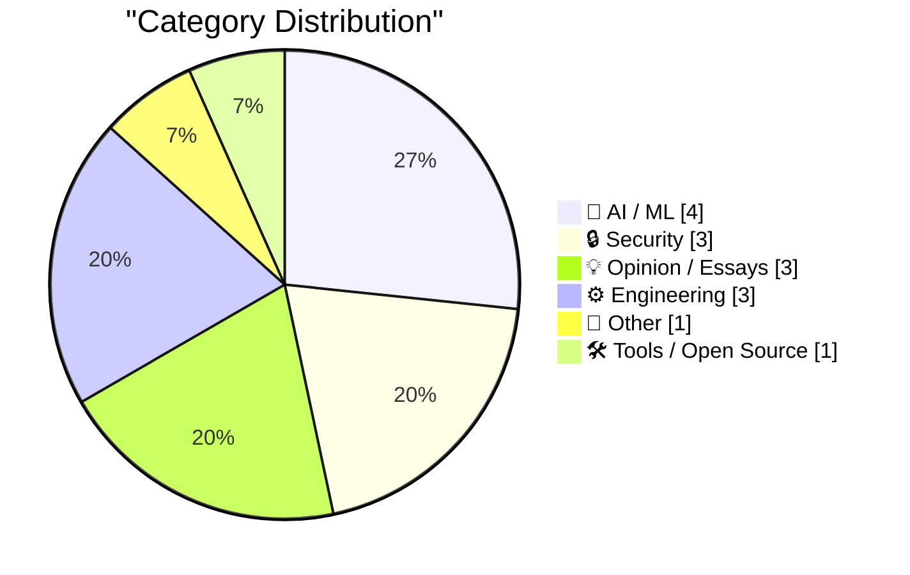
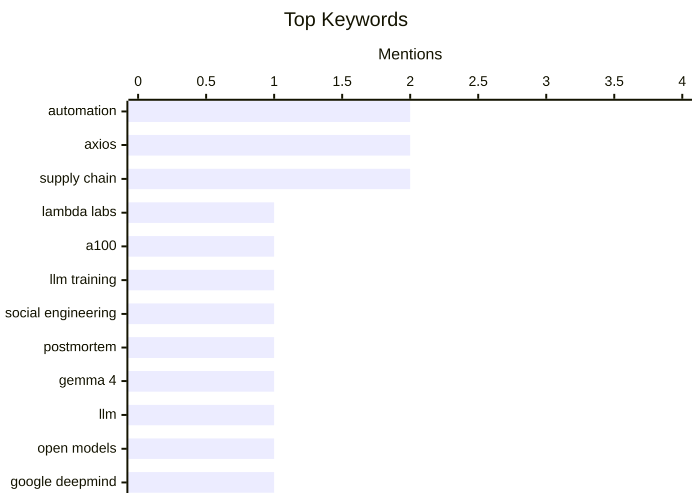

## Today's Highlights
Today's tech highlights feature significant strides in AI alongside critical cybersecurity warnings. Google DeepMind launched Gemma 4, a new suite of open-source, vision-capable AI models, fueling ongoing discussions about agentic engineering and the future of superintelligence. However, the popular npm package Axios fell victim to a sophisticated supply chain attack targeting its maintainer, underscoring the persistent threat of social engineering in software ecosystems. This comes as developers also face practical challenges in securing powerful compute resources for advanced LLM training.
---
## Must Read Today
1. **Automating starting Lambda Labs instances**
[Automating starting Lambda Labs instances](https://www.gilesthomas.com/2026/04/automating-starting-lambda-instances) — gilesthomas.com · 14h ago · 🤖 AI / ML
> The author faced difficulty acquiring an 8x A100 instance on Lambda Labs for an LLM training run due to high demand. To address this, they developed `lambda-manager`, an agentic coding solution with `list-instance-types`, `start-instance`, and `stop-instance` commands. This tool automates the process of finding and launching desired instances. The solution aims to simplify access to scarce GPU resources for AI/ML development by continuously polling for availability.
💡 **Why read it**: It provides a practical, open-source solution (`lambda-manager`) for automating the acquisition of high-demand GPU instances on Lambda Labs, which is valuable for ML practitioners.
🏷️ Lambda Labs, A100, LLM training, Automation
2. **The Axios supply chain attack used individually targeted social engineering**
[The Axios supply chain attack used individually targeted social engineering](https://simonwillison.net/2026/Apr/3/supply-chain-social-engineering/#atom-everything) — simonwillison.net · 9m ago · 🔒 Security
> The Axios team published a postmortem detailing a sophisticated supply chain attack that injected malware into their npm package. The attack involved individually targeted social engineering against one of their maintainers, enabling the attacker to publish malicious versions of the `axios` package. This incident highlights the vulnerability of open-source projects to targeted social engineering and the necessity for robust security measures beyond code review. The postmortem emphasizes the human element as a critical attack vector in software supply chains.
💡 **Why read it**: It offers crucial insights into the sophisticated social engineering tactics used in a major supply chain attack on a popular npm package, emphasizing human-centric vulnerabilities.
🏷️ Axios, supply chain, social engineering, postmortem
3. **Gemma 4: Byte for byte, the most capable open models**
[Gemma 4: Byte for byte, the most capable open models](https://simonwillison.net/2026/Apr/2/gemma-4/#atom-everything) — simonwillison.net · 19h ago · 🤖 AI / ML
> Google DeepMind released Gemma 4, a new suite of four vision-capable, Apache 2.0 licensed reasoning LLMs, available in 2B, 4B, 31B, and a 26B-A4B Mixture-of-Experts. Google emphasizes their "unprecedented level of intelligence-per-parameter," showcasing a trend towards creating highly efficient small models. This release provides further evidence that developing useful, compact models is a key research area in AI. The models aim to offer high capability within smaller footprints, making them more accessible.
💡 **Why read it**: It announces the release of Gemma 4, highlighting Google DeepMind's focus on highly efficient, smaller open-source LLMs with "unprecedented intelligence-per-parameter," which is significant for accessible AI development.
🏷️ Gemma 4, LLM, open models, Google DeepMind
---
## Data Overview
| Sources Scanned | Articles Fetched | Time Window | Selected |
|:---:|:---:|:---:|:---:|
| 77/92 | 2378 -> 25 | 24h | **15** |
### Category Distribution

### Top Keywords

<details>
<summary>Plain Text Keyword Chart (Terminal Friendly)</summary>
```
automation         │ ████████████████████ 2
axios              │ ████████████████████ 2
supply chain       │ ████████████████████ 2
lambda labs        │ ██████████░░░░░░░░░░ 1
a100               │ ██████████░░░░░░░░░░ 1
llm training       │ ██████████░░░░░░░░░░ 1
social engineering │ ██████████░░░░░░░░░░ 1
postmortem         │ ██████████░░░░░░░░░░ 1
gemma 4            │ ██████████░░░░░░░░░░ 1
llm                │ ██████████░░░░░░░░░░ 1
```
</details>
### Topic Tags
**automation**(2) · **axios**(2) · **supply chain**(2) · lambda labs(1) · a100(1) · llm training(1) · social engineering(1) · postmortem(1) · gemma 4(1) · llm(1) · open models(1) · google deepmind(1) · npm(1) · compromise(1) · zipbombs(1) · bot mitigation(1) · server security(1) · web attacks(1) · superintelligence(1) · ai safety(1)
---
## AI / ML
### 1. Automating starting Lambda Labs instances
[Automating starting Lambda Labs instances](https://www.gilesthomas.com/2026/04/automating-starting-lambda-instances) — **gilesthomas.com** · 14h ago · ⭐ 27/30
> The author faced difficulty acquiring an 8x A100 instance on Lambda Labs for an LLM training run due to high demand. To address this, they developed `lambda-manager`, an agentic coding solution with `list-instance-types`, `start-instance`, and `stop-instance` commands. This tool automates the process of finding and launching desired instances. The solution aims to simplify access to scarce GPU resources for AI/ML development by continuously polling for availability.
🏷️ Lambda Labs, A100, LLM training, Automation
---
### 2. Gemma 4: Byte for byte, the most capable open models
[Gemma 4: Byte for byte, the most capable open models](https://simonwillison.net/2026/Apr/2/gemma-4/#atom-everything) — **simonwillison.net** · 19h ago · ⭐ 26/30
> Google DeepMind released Gemma 4, a new suite of four vision-capable, Apache 2.0 licensed reasoning LLMs, available in 2B, 4B, 31B, and a 26B-A4B Mixture-of-Experts. Google emphasizes their "unprecedented level of intelligence-per-parameter," showcasing a trend towards creating highly efficient small models. This release provides further evidence that developing useful, compact models is a key research area in AI. The models aim to offer high capability within smaller footprints, making them more accessible.
🏷️ Gemma 4, LLM, open models, Google DeepMind
---
### 3. Book Review: Superintelligence - Paths, Dangers, Strategies by Nick Bostrom ★★★★⯪
[Book Review: Superintelligence - Paths, Dangers, Strategies by Nick Bostrom ★★★★⯪](https://shkspr.mobi/blog/2026/04/book-review-superintelligence-paths-dangers-strategies-by-nick-bostrom/) — **shkspr.mobi** · 2h ago · ⭐ 24/30
> This review highlights Nick Bostrom's 2014 book "Superintelligence - Paths, Dangers, Strategies" as a prescient work that outlines the potential problems and necessary safeguards for true Artificial Intelligence, distinct from current LLMs. The book opens with "The Unfinished Fable of the Sparrows," illustrating the risks of creating powerful AI without proper control. It argues for proactive measures to be established before the advent of genuine superintelligence. The reviewer rates it 4.5 stars, emphasizing its enduring relevance.
🏷️ Superintelligence, AI safety, Nick Bostrom, LLMs
---
### 4. Highlights from my conversation about agentic engineering on Lenny's Podcast
[Highlights from my conversation about agentic engineering on Lenny's Podcast](https://simonwillison.net/2026/Apr/2/lennys-podcast/#atom-everything) — **simonwillison.net** · 17h ago · ⭐ 23/30
> Simon Willison was a guest on Lenny Rachitsky's podcast, discussing "An AI state of the union: We've passed the inflection point, dark factories are coming, and automation timelines." The conversation likely covered the current state of AI, the concept of "agentic engineering," and predictions regarding future automation and its societal impact. The podcast is available on YouTube, Spotify, and Apple Podcasts. This episode offers insights into advanced AI automation and its potential future implications.
🏷️ agentic engineering, AI, automation, podcast
---
## Security
### 5. The Axios supply chain attack used individually targeted social engineering
[The Axios supply chain attack used individually targeted social engineering](https://simonwillison.net/2026/Apr/3/supply-chain-social-engineering/#atom-everything) — **simonwillison.net** · 9m ago · ⭐ 26/30
> The Axios team published a postmortem detailing a sophisticated supply chain attack that injected malware into their npm package. The attack involved individually targeted social engineering against one of their maintainers, enabling the attacker to publish malicious versions of the `axios` package. This incident highlights the vulnerability of open-source projects to targeted social engineering and the necessity for robust security measures beyond code review. The postmortem emphasizes the human element as a critical attack vector in software supply chains.
🏷️ Axios, supply chain, social engineering, postmortem
---
### 6. Axios, Super Popular NPM Package, Was Compromised in Attack on the Module’s Maintainer
[Axios, Super Popular NPM Package, Was Compromised in Attack on the Module’s Maintainer](https://www.stepsecurity.io/blog/axios-compromised-on-npm-malicious-versions-drop-remote-access-trojan) — **daringfireball.net** · 19h ago · ⭐ 26/30
> The popular npm package `axios` was compromised, leading to the release of malicious versions `axios@1.14.1` and `axios@0.30.4` that inject a fake dependency, `plain-crypto-js@4.2.1`. This malicious dependency's postinstall script deploys a cross-platform remote access trojan (RAT) by contacting a live command-and-control server. The attack is particularly dangerous because the malicious code is not within `axios` itself but through an injected dependency, making detection harder. Users who installed these versions are advised to assume their systems are compromised and take immediate action.
🏷️ Axios, NPM, supply chain, compromise
---
### 7. Zipbombs are not as effective as they used to be
[Zipbombs are not as effective as they used to be](https://idiallo.com/blog/zip-bombs-are-not-as-effective-as-they-used-to-be?src=feed) — **idiallo.com** · 2h ago · ⭐ 24/30
> The author previously used zipbombs as an effective mitigation strategy against rogue bots targeting their DigitalOcean droplet blog for 10 years. However, this strategy has recently become less effective, indicating a shift in bot sophistication or detection mechanisms. The article implies that modern bot attacks are circumventing this older defense technique. This suggests a need for updated server security approaches against evolving bot threats, as traditional methods may no longer suffice.
🏷️ Zipbombs, Bot mitigation, Server security, Web attacks
---
## Opinion / Essays
### 8. The two wildest stories today in tech
[The two wildest stories today in tech](https://garymarcus.substack.com/p/the-two-wildest-stories-today-in) — **garymarcus.substack.com** · 11h ago · ⭐ 24/30
> The article's snippet indicates a discussion about "shifting goal posts and new efforts at redefining the narrative" within the tech industry. Without further content, specific stories or arguments cannot be elaborated. The title suggests a critical perspective on how tech narratives are shaped and potentially manipulated. It likely aims to expose inconsistencies or biases in current technological discourse.
🏷️ AI criticism, Tech narrative, AI hype, Gary Marcus
---
### 9. OpenAI, Supposedly Tightening Its Focus on Its Core Products, Buys Tech-Industry Talk Show TBPN
[OpenAI, Supposedly Tightening Its Focus on Its Core Products, Buys Tech-Industry Talk Show TBPN](https://www.wsj.com/cmo-today/openai-buys-tech-industry-talk-show-tbpn-484c01c5?st=RUVFWn) — **daringfireball.net** · 19h ago · ⭐ 22/30
> OpenAI, despite reportedly tightening its focus on core products, has acquired the tech-industry talk show TBPN. According to a memo from Fidji Simo, OpenAI's CEO of applications, the acquisition aims to encourage constructive conversation around AI's impact and help TBPN grow. TBPN will report to Chris Lehane, OpenAI’s chief global affairs officer, and will also assist with company communications and marketing beyond the show itself. This move suggests OpenAI is investing in media and public relations to shape narratives around AI. OpenAI's acquisition of TBPN indicates a strategic shift towards direct communication and influence in the public discourse surrounding AI, leveraging media for marketing and narrative control.
🏷️ OpenAI, acquisition, AI industry, TBPN
---
### 10. David Pogue: ‘Apple and Me’
[David Pogue: ‘Apple and Me’](https://pogueman.substack.com/p/apple-and-me-the-first-50-years?triedRedirect=true) — **daringfireball.net** · 23h ago · ⭐ 21/30
> David Pogue reflects on his long-standing relationship with Apple, particularly recalling a memorable event during the original iPhone launch in 2007. Pogue describes filming a parody music video of "My Way" with a thousand people lined up for the iPhone in New York City. This video became the most-watched on YouTube for six hours after its upload. The article, part of his new Substack blog, likely delves into his experiences as a tech journalist covering Apple over decades. Pogue's anecdote illustrates the immense cultural impact of Apple products like the iPhone and his unique approach to tech journalism.
🏷️ David Pogue, iPhone, Apple, Journalism
---
## Engineering
### 11. Em Dashes: Back In Style?
[Em Dashes: Back In Style?](https://feed.tedium.co/link/15204/17312777/emdash-cloudflare-wordpress-competitor) — **tedium.co** · 10h ago · ⭐ 24/30
> Cloudflare is making a new attempt to attract developers, which could help preserve older WordPress sites from falling offline. The article suggests that Cloudflare's initiatives might offer a viable alternative or support system for websites built on legacy platforms like WordPress. This move aims to broaden Cloudflare's developer ecosystem and provide solutions for maintaining existing web infrastructure. It implies a strategic effort by Cloudflare to expand its market reach and utility for a diverse range of web projects.
🏷️ Cloudflare, WordPress, Web Infrastructure, Developer Relations
---
### 12. Programming (with AI agents) as theory building
[Programming (with AI agents) as theory building](https://seangoedecke.com/programming-with-ai-agents-as-theory-building/) — **seangoedecke.com** · 14h ago · ⭐ 22/30
> This article re-examines Peter Naur's 1985 concept of "Programming as Theory Building" in the context of modern AI agents. Naur argued that the primary output of software engineers is the "theory of how the program works" (knowledge in the engineer's mind), with the software itself being a byproduct. The author extends this by suggesting that AI agents, when used for programming, also build a "theory" of the program, residing within the agent's internal state (e.g., its prompt, context window, or internal representations). This implies that the AI agent's "theory" is the valuable artifact, not just the generated code. Understanding AI agents as theory builders shifts the focus from merely code generation to managing and evolving the agent's internal knowledge and understanding of the problem space.
🏷️ programming, AI agents, theory building, software engineering
---
### 13. The Blandness of Systematic Rules vs. The Delight of Localized Sensitivity
[The Blandness of Systematic Rules vs. The Delight of Localized Sensitivity](https://blog.jim-nielsen.com/2026/systemic-vs-localized/) — **blog.jim-nielsen.com** · 19h ago · ⭐ 20/30
> The article contrasts the perceived blandness of systematic design rules with the delight found in localized, sensitive design choices, using an old ClarisWorks dialog as an example. Marcin Wichary highlights a 1997 ClarisWorks dialog that intelligently adapts its text, displaying "This copy of This copy of Clarisworks has not been registered yet" when the user repeatedly dismisses the registration prompt. This localized sensitivity, where the UI "remembers" and responds contextually, creates a more engaging and human-like interaction compared to rigid, systematic rules that might always show the same generic message. The author argues that such nuanced design choices foster a sense of delight and personality. Effective design often benefits from localized sensitivity and contextual awareness, which can create more delightful and memorable user experiences than strict adherence to systematic, generic rules.
🏷️ UI/UX, Design Principles, Systematic Rules, Localized Sensitivity
---
## Other
### 14. Artemis II, Apollo 8, and Apollo 13
[Artemis II, Apollo 8, and Apollo 13](https://www.johndcook.com/blog/2026/04/02/artemis-apollo/) — **johndcook.com** · 23h ago · ⭐ 23/30
> The Artemis II mission launched, aiming to orbit the moon in preparation for a future lunar landing, similar to Apollo 8 in 1968. Like Apollo 13, Artemis II will swing around the moon rather than entering lunar orbit, a deliberate choice for this preparatory mission. This mission tests systems and procedures for human deep-space travel, serving as a crucial precursor to a moon landing. It draws parallels between historical and contemporary space exploration strategies, highlighting continuity in mission planning.
🏷️ Artemis II, Apollo missions, Space exploration, Moon mission
---
## Tools / Open Source
### 15. llm-gemini 0.30
[llm-gemini 0.30](https://simonwillison.net/2026/Apr/2/llm-gemini/#atom-everything) — **simonwillison.net** · 19h ago · ⭐ 20/30
> Simon Willison announced the release of `llm-gemini 0.30`, an update to his `llm` tool plugin for interacting with Google's Gemini models. This release introduces support for new models: `gemini-3.1-flash-lite-preview`, `gemma-4-26b-a4b-it`, and `gemma-4-31b-it`. The update expands the capabilities of the `llm` command-line tool, allowing users to easily access and experiment with these latest Google AI models. Further details on Gemma 4 are available in a linked article. `llm-gemini 0.30` enhances the `llm` ecosystem by integrating cutting-edge Gemini and Gemma 4 models, providing developers with immediate access to new AI capabilities.
🏷️ llm-gemini, Gemini, Gemma, LLM tool
---
*Generated at 2026-04-03 14:04 | Scanned 77 sources -> 2378 articles -> selected 15*
*Based on the [Hacker News Popularity Contest 2025](https://refactoringenglish.com/tools/hn-popularity/) RSS source list recommended by [Andrej Karpathy](https://x.com/karpathy)*
*Produced by Dongdianr AI. Follow the same-name WeChat public account for more AI practical tips 💡*
