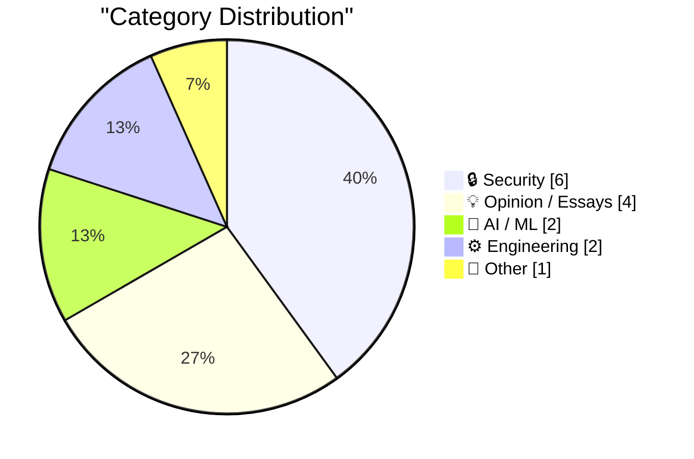
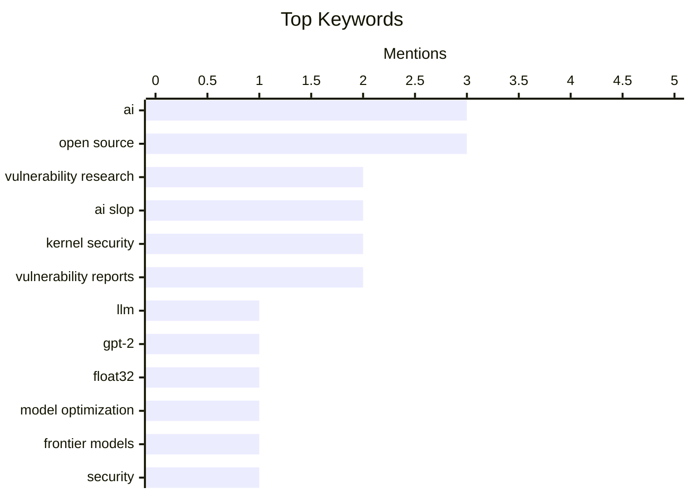

## Today's Highlights
Today's tech landscape is dominated by the ongoing evolution of artificial intelligence and pressing cybersecurity concerns. Deep dives into LLM architecture and the cognitive impact of AI coding agents highlight its rapid development, while discussions question its market resilience and role in creative writing. Concurrently, the cybersecurity community grapples with the future of vulnerability research and intricate attack vectors, such as JavaScript escaping CSPs. This dual focus underscores a period of both significant innovation and heightened vigilance across the digital realm.
---
## Must Read Today
1. **Writing an LLM from scratch, part 32h -- Interventions: full fat float32**
[Writing an LLM from scratch, part 32h -- Interventions: full fat float32](https://www.gilesthomas.com/2026/04/llm-from-scratch-32h-interventions-full-fat-float32) — gilesthomas.com · 14h ago · 🤖 AI / ML
> Writing an LLM from scratch, part 32h -- Interventions: full fat float32
🏷️ LLM, GPT-2, float32, model optimization
2. **Vulnerability Research Is Cooked**
[Vulnerability Research Is Cooked](https://simonwillison.net/2026/Apr/3/vulnerability-research-is-cooked/#atom-everything) — simonwillison.net · 14h ago · 🔒 Security
> Vulnerability Research Is Cooked
🏷️ Vulnerability Research, AI, Frontier Models, Security
3. **Premium: AI Isn't Too Big To Fail**
[Premium: AI Isn't Too Big To Fail](https://www.wheresyoured.at/premium-ai-isnt-too-big-to-fail/) — wheresyoured.at · 16h ago · 💡 Opinion / Essays
> Premium: AI Isn't Too Big To Fail
🏷️ AI bubble, investment, data center, market analysis
---
## Data Overview
| Sources Scanned | Articles Fetched | Time Window | Selected |
|:---:|:---:|:---:|:---:|
| 78/92 | 2388 -> 17 | 24h | **15** |
### Category Distribution

### Top Keywords

<details>
<summary>Plain Text Keyword Chart (Terminal Friendly)</summary>
```
ai                     │ ████████████████████ 3
open source            │ ████████████████████ 3
vulnerability research │ █████████████░░░░░░░ 2
ai slop                │ █████████████░░░░░░░ 2
kernel security        │ █████████████░░░░░░░ 2
vulnerability reports  │ █████████████░░░░░░░ 2
llm                    │ ███████░░░░░░░░░░░░░ 1
gpt-2                  │ ███████░░░░░░░░░░░░░ 1
float32                │ ███████░░░░░░░░░░░░░ 1
model optimization     │ ███████░░░░░░░░░░░░░ 1
```
</details>
### Topic Tags
**ai**(3) · **open source**(3) · **vulnerability research**(2) · ai slop(2) · kernel security(2) · vulnerability reports(2) · llm(1) · gpt-2(1) · float32(1) · model optimization(1) · frontier models(1) · security(1) · ai bubble(1) · investment(1) · data center(1) · market analysis(1) · security reports(1) · ai quality(1) · csp(1) · iframe(1)
---
## Security
### 1. Vulnerability Research Is Cooked
[Vulnerability Research Is Cooked](https://simonwillison.net/2026/Apr/3/vulnerability-research-is-cooked/#atom-everything) — **simonwillison.net** · 14h ago · ⭐ 28/30
> Vulnerability Research Is Cooked
🏷️ Vulnerability Research, AI, Frontier Models, Security
---
### 2. Quoting Daniel Stenberg
[Quoting Daniel Stenberg](https://simonwillison.net/2026/Apr/3/daniel-stenberg/#atom-everything) — **simonwillison.net** · 16h ago · ⭐ 27/30
> Quoting Daniel Stenberg
🏷️ Open Source, AI, Security Reports, Vulnerability Research
---
### 3. Quoting Greg Kroah-Hartman
[Quoting Greg Kroah-Hartman](https://simonwillison.net/2026/Apr/3/greg-kroah-hartman/#atom-everything) — **simonwillison.net** · 16h ago · ⭐ 27/30
> Quoting Greg Kroah-Hartman
🏷️ AI Slop, Kernel Security, Vulnerability Reports, AI Quality
---
### 4. Can JavaScript Escape a CSP Meta Tag Inside an Iframe?
[Can JavaScript Escape a CSP Meta Tag Inside an Iframe?](https://simonwillison.net/2026/Apr/3/test-csp-iframe-escape/#atom-everything) — **simonwillison.net** · 21h ago · ⭐ 25/30
> Can JavaScript Escape a CSP Meta Tag Inside an Iframe?
🏷️ CSP, Iframe, JavaScript, Web Security
---
### 5. Quoting Willy Tarreau
[Quoting Willy Tarreau](https://simonwillison.net/2026/Apr/3/willy-tarreau/#atom-everything) — **simonwillison.net** · 16h ago · ⭐ 24/30
> Quoting Willy Tarreau
🏷️ Kernel Security, AI Slop, Vulnerability Reports, Open Source
---
### 6. Apple Releases iOS 18 Security Updates for iOS 26 Holdouts
[Apple Releases iOS 18 Security Updates for iOS 26 Holdouts](https://sixcolors.com/post/2026/04/apple-releases-ios-18-security-updates-for-ios-26-holdouts/) — **daringfireball.net** · 18h ago · ⭐ 24/30
> Apple initially faced criticism for withholding iOS 18 security updates from iPhones capable of running iOS 26, potentially leaving users who preferred not to upgrade vulnerable. Previously, iOS 18 security updates were exclusively for devices unable to run iOS 26. However, as of April 1, Apple has begun pushing iOS 18.7.7 to all devices running iOS 18, including those compatible with iOS 26. This policy change ensures that users can receive critical security patches without being forced to upgrade to the latest operating system. Apple has thus addressed the security gap for users opting to remain on iOS 18, providing essential updates independently of an OS upgrade.
🏷️ iOS Security, Apple, Security Updates, Policy
---
## Opinion / Essays
### 7. Premium: AI Isn't Too Big To Fail
[Premium: AI Isn't Too Big To Fail](https://www.wheresyoured.at/premium-ai-isnt-too-big-to-fail/) — **wheresyoured.at** · 16h ago · ⭐ 28/30
> Premium: AI Isn't Too Big To Fail
🏷️ AI bubble, investment, data center, market analysis
---
### 8. The AI writing witchhunt is pointless.
[The AI writing witchhunt is pointless.](https://www.joanwestenberg.com/the-ai-writing-witchhunt-is-pointless/) — **joanwestenberg.com** · 2h ago · ⭐ 25/30
> The AI writing witchhunt is pointless.
🏷️ AI writing, ethics, authorship, AI debate
---
### 9. Pluralistic: EU ready to cave to Trump on tech (04 Apr 2026)
[Pluralistic: EU ready to cave to Trump on tech (04 Apr 2026)](https://pluralistic.net/2026/04/04/digital-subjugation/) — **pluralistic.net** · 6h ago · ⭐ 24/30
> The article critically suggests that the European Union is poised to concede to potential demands from a Trump administration regarding tech policy, particularly concerning tariffs. It highlights a perceived vulnerability of the EU to external pressures, framing it as a potential 'digital subjugation.' The brief entry points to broader issues like 'the trouble with tariffs' and other critical observations on current events. The main takeaway is a pessimistic view on the EU's ability to maintain its digital sovereignty against US geopolitical influence.
🏷️ EU Tech Policy, Trump, Tech Regulation, International Relations
---
### 10. What does Open Source mean?
[What does Open Source mean?](https://nesbitt.io/2026/04/04/what-does-open-source-mean.html) — **nesbitt.io** · 4h ago · ⭐ 21/30
> The article's title and subtitle, 'A stack of incompatible expectations,' introduce the core problem of diverse and often conflicting understandings surrounding the term 'Open Source.' Without further content, the piece implies that the definition and implications of open source software are subject to varied interpretations. It suggests that stakeholders often approach open source with different assumptions and requirements. The main conclusion is that the concept of Open Source lacks a universally agreed-upon interpretation, leading to potential misunderstandings.
🏷️ Open source, expectations, FOSS
---
## AI / ML
### 11. Writing an LLM from scratch, part 32h -- Interventions: full fat float32
[Writing an LLM from scratch, part 32h -- Interventions: full fat float32](https://www.gilesthomas.com/2026/04/llm-from-scratch-32h-interventions-full-fat-float32) — **gilesthomas.com** · 14h ago · ⭐ 29/30
> Writing an LLM from scratch, part 32h -- Interventions: full fat float32
🏷️ LLM, GPT-2, float32, model optimization
---
### 12. The cognitive impact of coding agents
[The cognitive impact of coding agents](https://simonwillison.net/2026/Apr/3/cognitive-cost/#atom-everything) — **simonwillison.net** · 14h ago · ⭐ 24/30
> The cognitive impact of coding agents
🏷️ Coding Agents, AI, Cognitive Impact, Developer Productivity
---
## Engineering
### 13. Quoting Kyle Daigle
[Quoting Kyle Daigle](https://simonwillison.net/2026/Apr/4/kyle-daigle/#atom-everything) — **simonwillison.net** · 11h ago · ⭐ 24/30
> Quoting Kyle Daigle
🏷️ GitHub, Commits, GitHub Actions, Platform Growth
---
### 14. Welcome to RSS Club!
[Welcome to RSS Club!](https://shkspr.mobi/blog/2026/04/welcome-to-rss-club/) — **shkspr.mobi** · 2h ago · ⭐ 19/30
> The article introduces 'RSS Club,' a novel concept for a secret social network that leverages RSS/Atom feeds for exclusive content distribution. Posts within RSS Club are intentionally designed to be visible only to RSS/Atom subscribers, creating a private channel. These posts are explicitly hidden from web search engines, not shared to platforms like Mastodon, and not syndicated elsewhere. The author's approach demonstrates an innovative use of RSS/Atom feeds to establish a private, unsearchable content distribution channel, fostering a unique 'club' experience for subscribers.
🏷️ RSS, Atom, content delivery, web technology
---
## Other
### 15. Roman moon, Greek moon
[Roman moon, Greek moon](https://www.johndcook.com/blog/2026/04/03/roman-moon-greek-moon/) — **johndcook.com** · 21h ago · ⭐ 14/30
> The article clarifies the etymology and interchangeable usage of the terms 'perilune' and 'periselene' in celestial mechanics, prompted by their use in describing the Artemis II mission. 'Perilune' refers to the point of closest approach to the moon, which for Artemis II occurs on the side opposite Earth. Both 'perilune' and 'periselene' are synonymous, with 'lune' deriving from Latin (Roman) and 'selene' from Greek, both meaning moon. The article concludes by explaining that these terms are used interchangeably based on their distinct linguistic origins, providing clarity for lunar orbital terminology.
🏷️ Perilune, Periselene, Artemis II, etymology
---
*Generated at 2026-04-04 14:04 | Scanned 78 sources -> 2388 articles -> selected 15*
*Based on the [Hacker News Popularity Contest 2025](https://refactoringenglish.com/tools/hn-popularity/) RSS source list recommended by [Andrej Karpathy](https://x.com/karpathy)*
*Produced by Dongdianr AI. Follow the same-name WeChat public account for more AI practical tips 💡*
