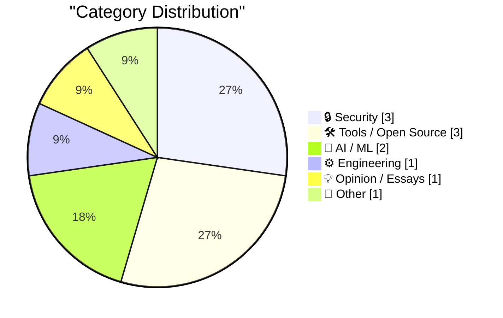
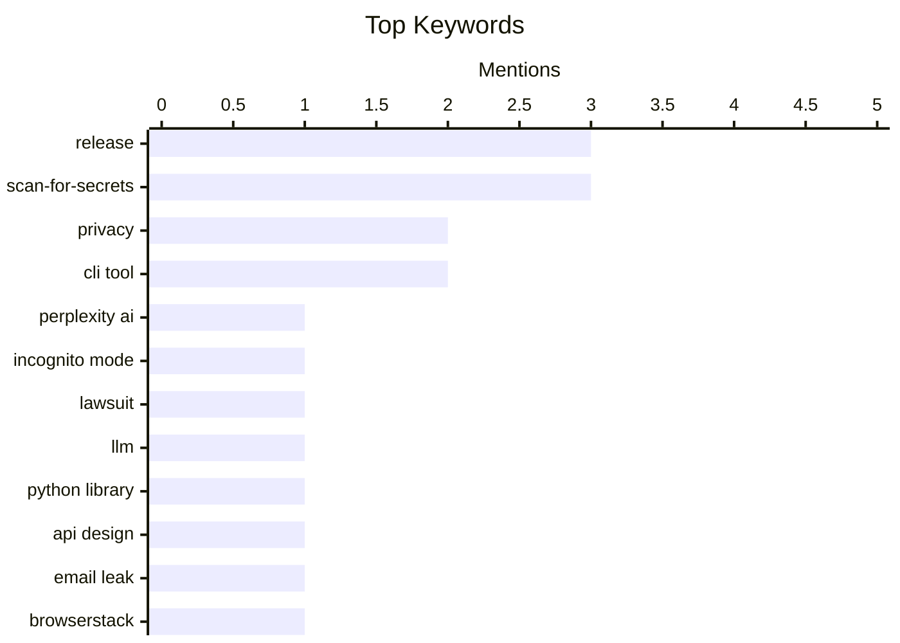

## Today's Highlights
The tech world is currently grappling with significant challenges in AI privacy and data security, highlighted by a class-action lawsuit against Perplexity AI for alleged deceptive "Incognito Mode" practices and a reported email leak from BrowserStack. In response, developers are actively building and refining essential tools, such as new versions of `scan-for-secrets` to prevent sensitive data exposure and major refactors of AI libraries like Simon Willison's `llm` for improved functionality. This dual emphasis on robust security tooling and advanced AI development reflects the industry's commitment to both innovation and safeguarding user data.
---
## Must Read Today
1. **Class Action Lawsuit Says Perplexity’s ‘Incognito Mode’ Is a ‘Sham’**
[Class Action Lawsuit Says Perplexity’s ‘Incognito Mode’ Is a ‘Sham’](https://arstechnica.com/tech-policy/2026/04/perplexitys-incognito-mode-is-a-sham-lawsuit-says/) — daringfireball.net · 13h ago · 🔒 Security
> A class-action lawsuit alleges that Perplexity AI's "Incognito Mode" is deceptive, claiming it fails to protect user privacy. The lawsuit, based on developer tool findings, states that initial prompts and follow-up questions are always shared. For non-subscribed users, initial prompts are allegedly shared via a URL accessible by third parties like Meta and Google. Disturbingly, the complaint also claims chats are shared with other entities, undermining the promise of privacy.
💡 **Why read it**: This article is worth reading for anyone concerned about AI service privacy, as it highlights potential misrepresentation of 'incognito' features and the sharing of user data with third parties.
🏷️ Perplexity AI, privacy, incognito mode, lawsuit
2. **research-llm-apis 2026-04-04**
[research-llm-apis 2026-04-04](https://simonwillison.net/2026/Apr/5/research-llm-apis/#atom-everything) — simonwillison.net · 13h ago · 🤖 AI / ML
> Simon Willison is undertaking a major refactor of his `llm` Python library and CLI tool, as detailed in `research-llm-apis 2026-04-04`. The `llm` library provides an abstraction layer for hundreds of LLMs from various vendors through its plugin system. This change addresses the challenge of new features introduced by vendors over the past year, which the current abstraction layer struggles to fully support. The refactor aims to create a more adaptable and comprehensive abstraction for evolving LLM API capabilities.
💡 **Why read it**: It offers insight into the complexities of maintaining a universal abstraction layer for rapidly evolving LLM APIs and the design considerations for future-proofing such tools.
🏷️ LLM, Python library, API design, release
3. **Someone at BrowserStack is Leaking Users' Email Address**
[Someone at BrowserStack is Leaking Users' Email Address](https://shkspr.mobi/blog/2026/04/someone-at-browserstack-is-leaking-users-email-address/) — shkspr.mobi · 2h ago · 🔒 Security
> The author discovered a potential email address leak from BrowserStack after receiving spam to a unique email address specifically generated for their BrowserStack Open Source program signup. This incident indicates that BrowserStack, or a third party they shared data with, has compromised user email addresses. The author's practice of using unique email addresses for each service allowed for immediate identification of the source of the leak. This highlights a significant security concern regarding user data handling.
💡 **Why read it**: This article is worth reading as a practical demonstration of how unique email addresses can expose data breaches and as a warning about potential security vulnerabilities at BrowserStack.
🏷️ email leak, BrowserStack, privacy, security flaw
---
## Data Overview
| Sources Scanned | Articles Fetched | Time Window | Selected |
|:---:|:---:|:---:|:---:|
| 77/92 | 2363 -> 11 | 24h | **11** |
### Category Distribution

### Top Keywords

<details>
<summary>Plain Text Keyword Chart (Terminal Friendly)</summary>
```
release          │ ████████████████████ 3
scan-for-secrets │ ████████████████████ 3
privacy          │ █████████████░░░░░░░ 2
cli tool         │ █████████████░░░░░░░ 2
perplexity ai    │ ███████░░░░░░░░░░░░░ 1
incognito mode   │ ███████░░░░░░░░░░░░░ 1
lawsuit          │ ███████░░░░░░░░░░░░░ 1
llm              │ ███████░░░░░░░░░░░░░ 1
python library   │ ███████░░░░░░░░░░░░░ 1
api design       │ ███████░░░░░░░░░░░░░ 1
```
</details>
### Topic Tags
**release**(3) · **scan-for-secrets**(3) · **privacy**(2) · cli tool(2) · perplexity ai(1) · incognito mode(1) · lawsuit(1) · llm(1) · python library(1) · api design(1) · email leak(1) · browserstack(1) · security flaw(1) · kalman filter(1) · bayesian statistics(1) · estimation(1) · statistics(1) · security(1) · initial release(1) · secrets detection(1)
---
## Security
### 1. Class Action Lawsuit Says Perplexity’s ‘Incognito Mode’ Is a ‘Sham’
[Class Action Lawsuit Says Perplexity’s ‘Incognito Mode’ Is a ‘Sham’](https://arstechnica.com/tech-policy/2026/04/perplexitys-incognito-mode-is-a-sham-lawsuit-says/) — **daringfireball.net** · 13h ago · ⭐ 26/30
> A class-action lawsuit alleges that Perplexity AI's "Incognito Mode" is deceptive, claiming it fails to protect user privacy. The lawsuit, based on developer tool findings, states that initial prompts and follow-up questions are always shared. For non-subscribed users, initial prompts are allegedly shared via a URL accessible by third parties like Meta and Google. Disturbingly, the complaint also claims chats are shared with other entities, undermining the promise of privacy.
🏷️ Perplexity AI, privacy, incognito mode, lawsuit
---
### 2. Someone at BrowserStack is Leaking Users' Email Address
[Someone at BrowserStack is Leaking Users' Email Address](https://shkspr.mobi/blog/2026/04/someone-at-browserstack-is-leaking-users-email-address/) — **shkspr.mobi** · 2h ago · ⭐ 24/30
> The author discovered a potential email address leak from BrowserStack after receiving spam to a unique email address specifically generated for their BrowserStack Open Source program signup. This incident indicates that BrowserStack, or a third party they shared data with, has compromised user email addresses. The author's practice of using unique email addresses for each service allowed for immediate identification of the source of the leak. This highlights a significant security concern regarding user data handling.
🏷️ email leak, BrowserStack, privacy, security flaw
---
### 3. Material Security
[Material Security](https://material.security/lp-cloud-office-security?utm_source=third-party&amp;utm_medium=email&amp;utm_campaign=20260330-daringfireball) — **daringfireball.net** · 13h ago · ⭐ 17/30
> Material Security aims to solve the 'noise problem' faced by security teams by unifying cloud workspace security across email, files, and accounts. The platform automates manual tasks such as phishing remediation, managing risky OAuth permissions, and auditing file shares, which typically consume significant security personnel time. It augments the native security gaps in Google and Microsoft cloud environments, providing comprehensive detection and response without the usual enterprise friction. This integrated approach enhances overall cloud office security posture.
🏷️ cloud security, phishing, OAuth, enterprise security
---
## Tools / Open Source
### 4. scan-for-secrets 0.2
[scan-for-secrets 0.2](https://simonwillison.net/2026/Apr/5/scan-for-secrets/#atom-everything) — **simonwillison.net** · 9h ago · ⭐ 21/30
> The `scan-for-secrets 0.2` release introduces significant usability and performance improvements to the CLI tool for identifying secrets. The tool now streams results as they are found, which is particularly beneficial for scanning large directories by avoiding long waits. Users can specify multiple directories to scan using the `-d/--directory` option multiple times. Additionally, a new `-f/--file` option allows for scanning one or more individual files directly.
🏷️ scan-for-secrets, CLI tool, security, release
---
### 5. scan-for-secrets 0.1
[scan-for-secrets 0.1](https://simonwillison.net/2026/Apr/5/scan-for-secrets-3/#atom-everything) — **simonwillison.net** · 10h ago · ⭐ 21/30
> Simon Willison developed `scan-for-secrets 0.1`, a new Python scanning tool, to address concerns about inadvertently exposing API keys or other secrets in detailed log files. Specifically, the tool helps provide reassurance when publishing transcripts from local Claude Code sessions, which often contain extensive logs. By scanning these files, `scan-for-secrets` aims to prevent the accidental revelation of sensitive credentials. It offers a proactive measure against common security oversights in development workflows.
🏷️ scan-for-secrets, initial release, CLI tool, secrets detection
---
### 6. scan-for-secrets 0.1.1
[scan-for-secrets 0.1.1](https://simonwillison.net/2026/Apr/5/scan-for-secrets-2/#atom-everything) — **simonwillison.net** · 10h ago · ⭐ 18/30
> The `scan-for-secrets 0.1.1` release focuses on refining the tool's secret detection capabilities and documentation. This update specifically adds comprehensive documentation detailing the various escaping schemes that the tool scans for. Furthermore, the unnecessary `repr` escaping scheme was removed, as its functionality was already effectively covered by the `json` escaping scheme. This streamlines the tool's internal logic and improves its overall efficiency in identifying sensitive data.
🏷️ scan-for-secrets, patch, release, documentation
---
## AI / ML
### 7. research-llm-apis 2026-04-04
[research-llm-apis 2026-04-04](https://simonwillison.net/2026/Apr/5/research-llm-apis/#atom-everything) — **simonwillison.net** · 13h ago · ⭐ 25/30
> Simon Willison is undertaking a major refactor of his `llm` Python library and CLI tool, as detailed in `research-llm-apis 2026-04-04`. The `llm` library provides an abstraction layer for hundreds of LLMs from various vendors through its plugin system. This change addresses the challenge of new features introduced by vendors over the past year, which the current abstraction layer struggles to fully support. The refactor aims to create a more adaptable and comprehensive abstraction for evolving LLM API capabilities.
🏷️ LLM, Python library, API design, release
---
### 8. Kalman and Bayes average grades
[Kalman and Bayes average grades](https://www.johndcook.com/blog/2026/04/04/kalman-bayes/) — **johndcook.com** · 23h ago · ⭐ 22/30
> This post simplifies the problem of updating an average grade, presenting it as a special case of both Bayesian statistics and Kalman filtering. It demonstrates how to calculate a new average `m_new` given an existing average `m_old` from `n` tests and a new test score `x_new`. The article shows that both advanced statistical methods yield the intuitive formula: `m_new = (n * m_old + x_new) / (n + 1)`. This illustrates the fundamental connection between these seemingly complex statistical techniques and a common averaging problem.
🏷️ Kalman filter, Bayesian statistics, Estimation, Statistics
---
## Engineering
### 9. iOS 26 Feels Faster Than iOS 18
[iOS 26 Feels Faster Than iOS 18](https://daringfireball.net/linked/2026/04/03/ios-18-update-for-holdouts) — **daringfireball.net** · 13h ago · ⭐ 19/30
> After spending two days using an iPhone 16 Pro running iOS 18.7.7, the author observed a distinct performance improvement in iOS 26 compared to iOS 18. The noticeable speed increase is attributed to Apple's optimization of system-level animations, particularly evident when swiping up to return to the Home Screen. While this improvement was noted during the iOS 26 beta cycle, its significance became clear through a direct, prolonged comparison. The newer OS offers a more fluid and responsive user experience.
🏷️ iOS, performance, UI/UX, animations
---
## Opinion / Essays
### 10. It's not that deep
[It's not that deep](https://idiallo.com/blog/its-not-that-deep?src=feed) — **idiallo.com** · 6h ago · ⭐ 16/30
> The author reflects on a personal evolution from impulsively pursuing every inspiring idea to adopting a more deliberate and selective approach, influenced by familial responsibilities. While still experiencing creative 'flare,' they now prioritize depth and impact over sheer volume of projects. This shift involves a conscious decision to invest time and energy only into ideas that resonate deeply and promise substantial value. The article explores the balance between creative drive and practical life commitments.
🏷️ motivation, creativity, personal reflection, career
---
## Other
### 11. Sponsorship Openings for Daring Fireball
[Sponsorship Openings for Daring Fireball](https://daringfireball.net/feeds/sponsors/) — **daringfireball.net** · 13h ago · ⭐ 12/30
> This article announces new sponsorship opportunities for Daring Fireball, a popular blog. Initially, the next available slot was not until late July, but due to schedule adjustments, a new opening has become available for next week. Following this immediate opening, the subsequent slot remains the week of July 27. Daring Fireball is seeking sponsors with products or services that appeal to its audience, which is characterized by an obsession with high quality and good design. Interested parties are encouraged to act quickly, especially for the upcoming week's opening.
🏷️ sponsorship, advertising, blog
---
*Generated at 2026-04-05 14:04 | Scanned 77 sources -> 2363 articles -> selected 11*
*Based on the [Hacker News Popularity Contest 2025](https://refactoringenglish.com/tools/hn-popularity/) RSS source list recommended by [Andrej Karpathy](https://x.com/karpathy)*
*Produced by Dongdianr AI. Follow the same-name WeChat public account for more AI practical tips 💡*
