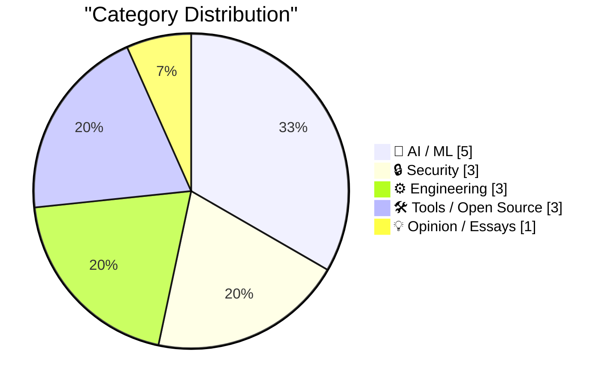
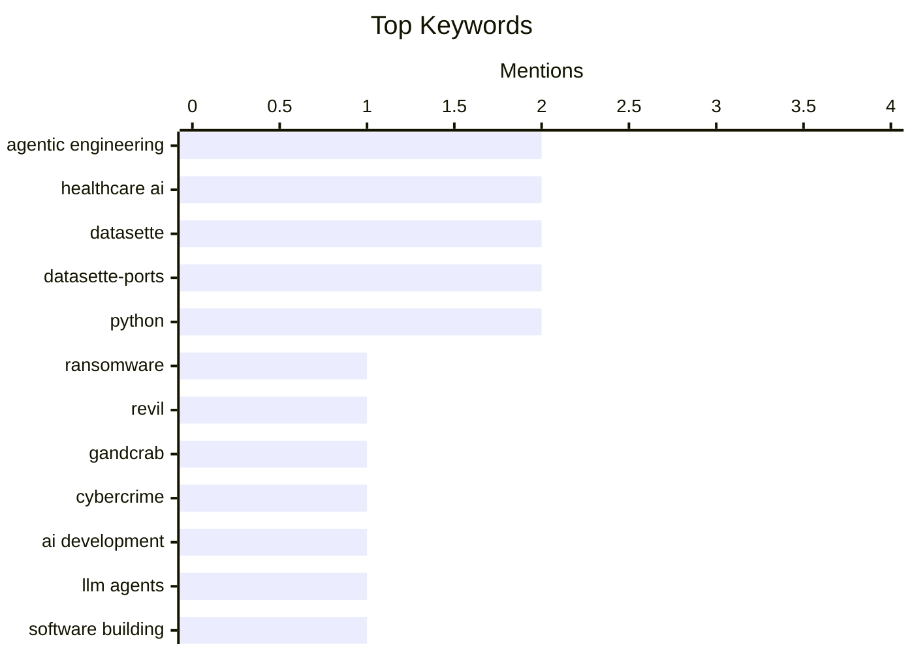

## Today's Highlights
AI continues to rapidly transform development, enabling projects in months that once took years and becoming more accessible on edge devices. However, this rapid advancement brings critical challenges, from ensuring the quality of AI-generated code to navigating complex compliance requirements like HIPAA. Concurrently, the digital landscape faces ongoing threats, with authorities actively pursuing major ransomware leaders and growing concerns over employer surveillance and data privacy. Amidst these innovations and threats, fundamental software engineering practices remain crucial for robust systems.
---
## Must Read Today
1. **Germany Doxes “UNKN,” Head of RU Ransomware Gangs REvil, GandCrab**
[Germany Doxes “UNKN,” Head of RU Ransomware Gangs REvil, GandCrab](https://krebsonsecurity.com/2026/04/germany-doxes-unkn-head-of-ru-ransomware-gangs-revil-gandcrab/) — krebsonsecurity.com · 11h ago · 🔒 Security
> The article reports on the identification of "UNKN," the elusive leader behind the Russian ransomware groups GandCrab and REvil. German authorities named 31-year-old Russian Daniil Maksimovich Shchukin as the head of both gangs. He is implicated in at least 130 acts of computer sabotage and extortion against German victims between 2019 and 2021. This identification marks a significant breakthrough in international law enforcement's efforts against major cybercrime organizations.
💡 **Why read it**: It details a significant law enforcement success in identifying a key figure behind two major ransomware operations, REvil and GandCrab.
🏷️ Ransomware, REvil, GandCrab, cybercrime
2. **Eight years of wanting, three months of building with AI**
[Eight years of wanting, three months of building with AI](https://simonwillison.net/2026/Apr/5/building-with-ai/#atom-everything) — simonwillison.net · 14h ago · 🤖 AI / ML
> This article highlights Lalit Maganti's experience of conceptualizing a project for eight years and then rapidly building `syntaqlite` in just three months using AI. `syntaqlite` is described as "high-fidelity devtools that SQ," showcasing the power of agentic engineering. The piece is lauded as an excellent example of how AI tools can dramatically accelerate the development of complex, long-envisioned software projects. It demonstrates AI's potential to bridge the gap between ideation and implementation efficiently.
💡 **Why read it**: It offers an insightful case study on how AI-driven agentic engineering can transform long-term project ideas into rapid development and deployment.
🏷️ Agentic engineering, AI development, LLM agents, software building
3. **The back story behind the first “$1.8 Billion” dollar “AI Company”**
[The back story behind the first “$1.8 Billion” dollar “AI Company”](https://garymarcus.substack.com/p/the-back-story-behind-the-first-18) — garymarcus.substack.com · 21h ago · 🤖 AI / ML
> The article investigates the true narrative behind Medvi, a company frequently cited as the first "$1.8 Billion" AI company. It suggests that AI was not the sole or primary driver of Medvi's substantial valuation, implying other significant factors were at play. The piece aims to provide a more nuanced understanding of the company's origins and success. Ultimately, it challenges the simplistic narrative that AI alone propelled Medvi to its high valuation, encouraging readers to look beyond the hype.
💡 **Why read it**: It provides a critical perspective on AI company valuations, suggesting that factors beyond AI itself often drive perceived success.
🏷️ AI valuation, AI hype, tech business, critical analysis
---
## Data Overview
| Sources Scanned | Articles Fetched | Time Window | Selected |
|:---:|:---:|:---:|:---:|
| 76/92 | 2348 -> 19 | 24h | **15** |
### Category Distribution

### Top Keywords

<details>
<summary>Plain Text Keyword Chart (Terminal Friendly)</summary>
```
agentic engineering │ ████████████████████ 2
healthcare ai       │ ████████████████████ 2
datasette           │ ████████████████████ 2
datasette-ports     │ ████████████████████ 2
python              │ ████████████████████ 2
ransomware          │ ██████████░░░░░░░░░░ 1
revil               │ ██████████░░░░░░░░░░ 1
gandcrab            │ ██████████░░░░░░░░░░ 1
cybercrime          │ ██████████░░░░░░░░░░ 1
ai development      │ ██████████░░░░░░░░░░ 1
```
</details>
### Topic Tags
**agentic engineering**(2) · **healthcare ai**(2) · **datasette**(2) · datasette-ports(2) · python(2) · ransomware(1) · revil(1) · gandcrab(1) · cybercrime(1) · ai development(1) · llm agents(1) · software building(1) · ai valuation(1) · ai hype(1) · tech business(1) · critical analysis(1) · ai coding(1) · debugging(1) · code understanding(1) · developer experience(1)
---
## AI / ML
### 1. Eight years of wanting, three months of building with AI
[Eight years of wanting, three months of building with AI](https://simonwillison.net/2026/Apr/5/building-with-ai/#atom-everything) — **simonwillison.net** · 14h ago · ⭐ 27/30
> This article highlights Lalit Maganti's experience of conceptualizing a project for eight years and then rapidly building `syntaqlite` in just three months using AI. `syntaqlite` is described as "high-fidelity devtools that SQ," showcasing the power of agentic engineering. The piece is lauded as an excellent example of how AI tools can dramatically accelerate the development of complex, long-envisioned software projects. It demonstrates AI's potential to bridge the gap between ideation and implementation efficiently.
🏷️ Agentic engineering, AI development, LLM agents, software building
---
### 2. The back story behind the first “$1.8 Billion” dollar “AI Company”
[The back story behind the first “$1.8 Billion” dollar “AI Company”](https://garymarcus.substack.com/p/the-back-story-behind-the-first-18) — **garymarcus.substack.com** · 21h ago · ⭐ 27/30
> The article investigates the true narrative behind Medvi, a company frequently cited as the first "$1.8 Billion" AI company. It suggests that AI was not the sole or primary driver of Medvi's substantial valuation, implying other significant factors were at play. The piece aims to provide a more nuanced understanding of the company's origins and success. Ultimately, it challenges the simplistic narrative that AI alone propelled Medvi to its high valuation, encouraging readers to look beyond the hype.
🏷️ AI valuation, AI hype, tech business, critical analysis
---
### 3. AI Did It in 12 Minutes. It Took Me 10 Hours to Fix It
[AI Did It in 12 Minutes. It Took Me 10 Hours to Fix It](https://idiallo.com/blog/it-took-me-10-hours-to-fix-ai-code?src=feed) — **idiallo.com** · 1h ago · ⭐ 26/30
> The author, a seasoned developer, recounts an experience where AI generated project code in 12 minutes, but he subsequently spent 10 hours fixing it. This extensive debugging and refactoring were driven by his commitment to understanding and adapting code rather than blind copy-pasting. The anecdote highlights a significant gap between AI's rapid code generation and the human effort required for quality assurance, comprehension, and integration. It concludes that while AI accelerates initial output, it often introduces substantial hidden costs in terms of debugging and ensuring code quality.
🏷️ AI coding, debugging, code understanding, developer experience
---
### 4. Google AI Edge Gallery
[Google AI Edge Gallery](https://simonwillison.net/2026/Apr/6/google-ai-edge-gallery/#atom-everything) — **simonwillison.net** · 8h ago · ⭐ 23/30
> The article reviews Google's "AI Edge Gallery" app, which enables users to run Gemma 4 and Gemma 3 models directly on an iPhone. Despite its "terrible name," the app performs "really well," allowing the E2B model (a 2.54GB download) to run fast and provide genuinely useful local inference. The app also supports additional features such as asking questions about images and audio transcription. This development represents a significant step towards powerful, on-device AI capabilities, making advanced models accessible and performant on consumer hardware.
🏷️ Google AI, Gemma, Edge AI, On-device ML
---
### 5. Quoting Chengpeng Mou
[Quoting Chengpeng Mou](https://simonwillison.net/2026/Apr/5/chengpeng-mou/#atom-everything) — **simonwillison.net** · 16h ago · ⭐ 22/30
> The article quotes Chengpeng Mou's anonymized U.S. ChatGPT data, revealing significant insights into healthcare-related queries. The data indicates approximately 2 million weekly messages on health insurance and 600,000 weekly messages classified as healthcare from individuals in "hospital deserts" (over 30 minutes drive to a hospital). Crucially, 7 out of 10 messages occur outside traditional clinic hours. This data underscores ChatGPT's substantial role as a widely accessed resource for health-related information, particularly for underserved populations and outside conventional healthcare operating times.
🏷️ ChatGPT, healthcare AI, data analysis, hospital deserts
---
## Security
### 6. Germany Doxes “UNKN,” Head of RU Ransomware Gangs REvil, GandCrab
[Germany Doxes “UNKN,” Head of RU Ransomware Gangs REvil, GandCrab](https://krebsonsecurity.com/2026/04/germany-doxes-unkn-head-of-ru-ransomware-gangs-revil-gandcrab/) — **krebsonsecurity.com** · 11h ago · ⭐ 28/30
> The article reports on the identification of "UNKN," the elusive leader behind the Russian ransomware groups GandCrab and REvil. German authorities named 31-year-old Russian Daniil Maksimovich Shchukin as the head of both gangs. He is implicated in at least 130 acts of computer sabotage and extortion against German victims between 2019 and 2021. This identification marks a significant breakthrough in international law enforcement's efforts against major cybercrime organizations.
🏷️ Ransomware, REvil, GandCrab, cybercrime
---
### 7. HIPAA compliant AI
[HIPAA compliant AI](https://www.johndcook.com/blog/2026/04/05/hipaa-compliant-ai/) — **johndcook.com** · 14h ago · ⭐ 26/30
> The article addresses the critical challenge of using AI while maintaining HIPAA compliance for protected health information (PHI). It strongly recommends running AI locally on one's own hardware to avoid transferring PHI to remote cloud-hosted services like ChatGPT or Claude. While HIPAA-compliant cloud options exist, they are characterized as both restrictive and expensive, even for enterprise solutions. The conclusion emphasizes that local, on-premise AI deployment is the most secure and compliant method for handling sensitive health data, minimizing third-party risks.
🏷️ HIPAA, AI compliance, data privacy, healthcare AI
---
### 8. scan-for-secrets 0.3
[scan-for-secrets 0.3](https://simonwillison.net/2026/Apr/6/scan-for-secrets/#atom-everything) — **simonwillison.net** · 11h ago · ⭐ 19/30
> This article announces the release of `scan-for-secrets` version 0.3, a tool designed for identifying and redacting sensitive information. The key new feature is the `-r/--redact` option, which interactively prompts for confirmation before replacing every matched secret with "REDACTED," while correctly handling escaping rules. Additionally, the release introduces a new Python function, `redact_file(file_path: str | Path, secrets: list[str], replacement: str = "REDACTED") -> int`, for programmatic redaction. Version 0.3 significantly enhances the tool's utility by adding both interactive and automated redaction capabilities.
🏷️ Secrets scanning, security tool, code analysis, redaction
---
## Engineering
### 9. Stamp It! All Programs Must Report Their Version
[Stamp It! All Programs Must Report Their Version](https://michael.stapelberg.ch/posts/2026-04-05-stamp-it-all-programs-must-report-their-version/) — **michael.stapelberg.ch** · 23h ago · ⭐ 26/30
> The article advocates for a universal software engineering practice: all programs should explicitly report their version information. It argues that this practice is crucial for effective debugging, auditing, and maintaining complex software systems. Explicit versioning enables quick identification of the exact code running in production, aiding reproducibility and understanding the state of deployed software, especially in environments like those using Nix derivations. The piece concludes that mandatory version reporting is a fundamental best practice for robust software development and operations.
🏷️ versioning, software engineering, build systems, reproducibility
---
### 10. The Cathedral and the Catacombs
[The Cathedral and the Catacombs](https://nesbitt.io/2026/04/06/the-cathedral-and-the-catacombs.html) — **nesbitt.io** · 4h ago · ⭐ 21/30
> The article introduces and explores the metaphor of "The Cathedral and the Catacombs," likely in the context of software architecture or organizational structures. The author indicates an intention to stretch this metaphor "deep into the floor," suggesting an in-depth and nuanced analysis. While the full content is not provided, the title and snippet imply a discussion contrasting different development or operational philosophies. It promises an insightful exploration of how these contrasting approaches manifest in real-world systems.
🏷️ software architecture, development models, tech culture
---
### 11. I Tried Vibing an RSS Reader and My Dreams Did Not Come True
[I Tried Vibing an RSS Reader and My Dreams Did Not Come True](https://blog.jim-nielsen.com/2026/vibe-dreams-didnt-come-true/) — **blog.jim-nielsen.com** · 19h ago · ⭐ 20/30
> Inspired by Simon Willison's success with "vibe coding" a macOS presentation app, the author attempted to "vibe code" his own dream RSS reader. While Reeder already exists as his ideal RSS app, he aimed to create a simpler version, focusing on just a list of unread articles. However, this intuitive development approach did not lead to a compelling or necessary new product. The author concludes that "vibe coding" didn't yield the desired outcome for this project, especially given the robustness of existing solutions like Reeder.
🏷️ RSS reader, personal project, vibe coding, software development
---
## Tools / Open Source
### 12. Syntaqlite Playground
[Syntaqlite Playground](https://simonwillison.net/2026/Apr/5/syntaqlite/#atom-everything) — **simonwillison.net** · 18h ago · ⭐ 20/30
> This article introduces the Syntaqlite Playground, an interactive environment for Lalit Maganti's `syntaqlite` tool. `syntaqlite` is currently gaining attention on Hacker News, accompanied by a deep dive into its development process titled "Eight years of wanting, three months of building with AI." This background piece details how artificial intelligence was leveraged in the tool's creation. The playground likely allows users to experiment with `syntaqlite`'s capabilities firsthand. The article serves as an announcement and a gateway to explore both the tool and its innovative AI-assisted development.
🏷️ Syntaqlite, AI tool, Hacker News, agentic engineering
---
### 13. datasette-ports 0.2
[datasette-ports 0.2](https://simonwillison.net/2026/Apr/6/datasette-ports-2/#atom-everything) — **simonwillison.net** · 10h ago · ⭐ 18/30
> This article announces the release of `datasette-ports` version 0.2, a utility related to managing Datasette instances. The primary enhancement in this version is that `datasette-ports` no longer requires a full Datasette installation to run, allowing users to execute it directly via `uvx datasette-ports`. Despite this, installing it as a Datasette plugin continues to provide the integrated `datasette ports` command. This update improves the tool's flexibility and standalone usability by decoupling its core functionality from a direct Datasette dependency.
🏷️ Datasette, datasette-ports, Python, data tool
---
### 14. datasette-ports 0.1
[datasette-ports 0.1](https://simonwillison.net/2026/Apr/6/datasette-ports/#atom-everything) — **simonwillison.net** · 13h ago · ⭐ 15/30
> This article introduces the initial release of `datasette-ports` version 0.1, a new utility developed using a "README-driven development" approach. The tool is designed to address a specific problem, likely related to managing multiple Datasette instances, various databases, or in-development plugins spread across different environments. The development methodology prioritized starting with a clear README to define the project's scope and intended functionality. Version 0.1 marks the debut of `datasette-ports`, aiming to solve a niche problem for Datasette users while showcasing the effectiveness of its development approach.
🏷️ Datasette, datasette-ports, Python, README-driven
---
## Opinion / Essays
### 15. Pluralistic: Your boss wants to use surveillance data to cut your wages (06 Apr 2026)
[Pluralistic: Your boss wants to use surveillance data to cut your wages (06 Apr 2026)](https://pluralistic.net/2026/04/06/empiricism-washing/) — **pluralistic.net** · 4h ago · ⭐ 24/30
> The article discusses the concerning trend of employers leveraging workplace surveillance data to potentially reduce employee wages. It emphasizes that "Tech rights are labor rights," highlighting the intersection of technology, privacy, and workers' economic well-being. The piece suggests a form of "empiricism-washing," where data is used to justify wage cuts. It warns against the misuse of workplace surveillance data as a tool for economic exploitation, framing it as a critical issue for labor rights in the digital age.
🏷️ workplace surveillance, data ethics, labor rights, tech policy
---
*Generated at 2026-04-06 14:04 | Scanned 76 sources -> 2348 articles -> selected 15*
*Based on the [Hacker News Popularity Contest 2025](https://refactoringenglish.com/tools/hn-popularity/) RSS source list recommended by [Andrej Karpathy](https://x.com/karpathy)*
*Produced by Dongdianr AI. Follow the same-name WeChat public account for more AI practical tips 💡*
