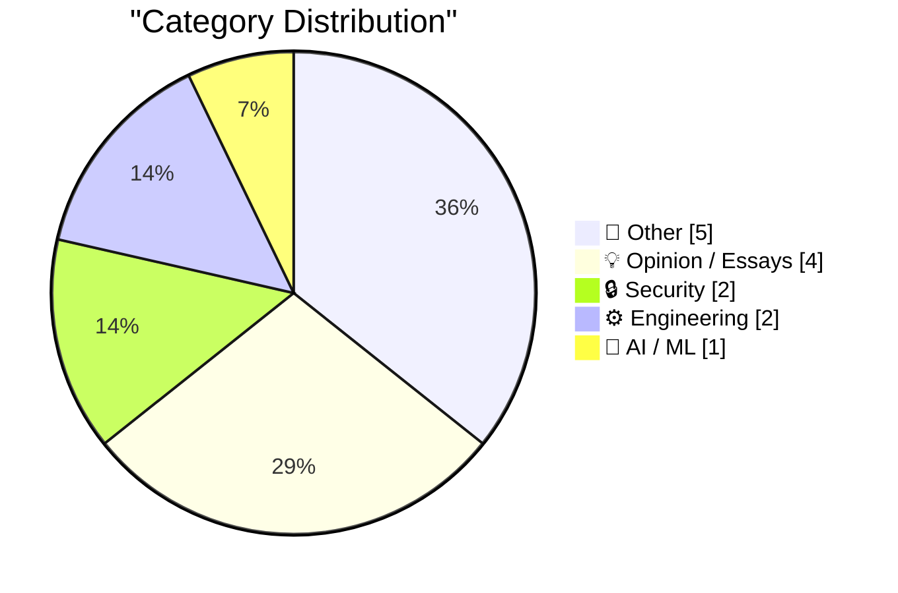
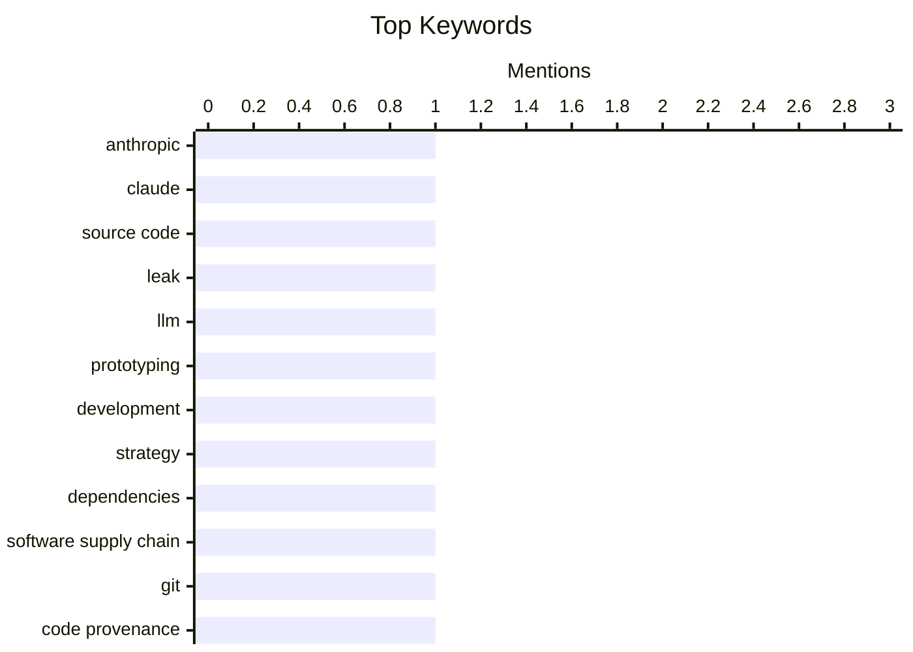

## Today's Highlights
Today's tech headlines reveal a heightened focus on security, as major players like Anthropic grapple with accidental source code leaks and personal data exposure. The AI sector continues its rapid evolution, balancing innovative prototyping methods with growing ethical concerns surrounding its leadership. Beyond AI, the engineering world confronts persistent challenges in software dependency tracing and fundamental computing principles, while broader discussions touch on work culture and business transparency.
---
## Must Read Today
1. **Anthropic Accidentally Leaked the Entire Claude Code CLI Source Code**
[Anthropic Accidentally Leaked the Entire Claude Code CLI Source Code](https://arstechnica.com/ai/2026/03/entire-claude-code-cli-source-code-leaks-thanks-to-exposed-map-file/) — daringfireball.net · 18h ago · 🔒 Security
> Anthropic accidentally leaked the entire Claude Code CLI source code through an exposed map file in a recent npm package update. Version 2.1.88 of the Claude Code npm package included a source map file, granting access to nearly 2,000 TypeScript files and over 512,000 lines of code. Security researcher Chaofan Shou first publicly identified this vulnerability on X, providing an archive of the files. This incident underscores a significant security oversight in software package distribution. It highlights the critical importance of careful asset management in software releases to prevent sensitive information exposure.
💡 **Why read it**: It details a major security incident involving a prominent AI company, illustrating the risks of improper software packaging and the importance of supply chain security.
🏷️ Anthropic, Claude, Source Code, Leak
2. **Prototyping with LLMs**
[Prototyping with LLMs](https://blog.jim-nielsen.com/2026/prototyping-with-llm/) — blog.jim-nielsen.com · 19h ago · 🤖 AI / ML
> The article draws an analogy from a biblical passage (Luke 14:28-30) to emphasize the importance of prototyping and planning before undertaking a project. It suggests that Large Language Models (LLMs) can serve as valuable tools in the prototyping phase. LLMs can help in estimating costs, identifying potential challenges, and refining project scope, much like the builder who first calculates the cost of a tower. Effective prototyping, potentially enhanced by LLMs, is crucial for successful project completion and avoiding wasted resources. This approach ensures projects are well-conceived and executable from the outset.
💡 **Why read it**: It offers a unique, philosophical perspective on using LLMs for prototyping, framing it with a timeless analogy about planning and foresight.
🏷️ LLM, Prototyping, Development, Strategy
3. **Who Built This?**
[Who Built This?](https://nesbitt.io/2026/04/07/who-built-this.html) — nesbitt.io · 4h ago · ⚙️ Engineering
> The article addresses the challenge of tracing a software dependency back to its original source commit. It likely explores methods or tools for navigating complex dependency trees to pinpoint the specific commit that introduced a particular piece of code or change. This process is crucial for understanding code provenance, facilitating debugging, and conducting thorough security audits. By identifying the exact origin, developers can better manage risks and maintain code integrity. Understanding the origin of dependencies down to the commit level is essential for robust software development and maintenance practices.
💡 **Why read it**: It addresses a fundamental problem in software engineering regarding dependency management and the critical need for code provenance.
🏷️ Dependencies, Software Supply Chain, Git, Code Provenance
---
## Data Overview
| Sources Scanned | Articles Fetched | Time Window | Selected |
|:---:|:---:|:---:|:---:|
| 76/92 | 2348 -> 14 | 24h | **14** |
### Category Distribution

### Top Keywords

<details>
<summary>Plain Text Keyword Chart (Terminal Friendly)</summary>
```
anthropic             │ ████████████████████ 1
claude                │ ████████████████████ 1
source code           │ ████████████████████ 1
leak                  │ ████████████████████ 1
llm                   │ ████████████████████ 1
prototyping           │ ████████████████████ 1
development           │ ████████████████████ 1
strategy              │ ████████████████████ 1
dependencies          │ ████████████████████ 1
software supply chain │ ████████████████████ 1
```
</details>
### Topic Tags
**anthropic**(1) · **claude**(1) · **source code**(1) · leak(1) · llm(1) · prototyping(1) · development(1) · strategy(1) · dependencies(1) · software supply chain(1) · git(1) · code provenance(1) · toffoli gates(1) · landauer's principle(1) · quantum computing(1) · data leak(1) · privacy(1) · wordpress vip(1) · apollo.io(1) · work culture(1)
---
## Other
### 1. [Sponsor] Zed, a Font Superfamily
[[Sponsor] Zed, a Font Superfamily](https://www.typotheque.com/blog/zed-a-sans-for-the-needs-of-21century/?utm_source=df) — **daringfireball.net** · 18h ago · ⭐ 18/30
> The article introduces Zed, a new type system developed with a primary focus on maximizing readability for the widest possible range of readers. Zed was designed from scratch, prioritizing functional needs over traditional aesthetic conventions, and comes in two optical versions: Text and Display, with four variable fonts. Empirical testing at a French ophthalmology hospital demonstrated that Zed Text significantly outperformed Helvetica in reading speed across all visually impaired patient groups. This research-backed design makes Zed a significant advancement in typeface development. Zed represents a novel approach to typeface design, emphasizing scientific readability and accessibility over traditional aesthetic conventions.
🏷️ Font, Accessibility, Typography, Readability
---
### 2. Pluralistic: Switzerland's Goldilocks fiber (07 Apr 2026)
[Pluralistic: Switzerland's Goldilocks fiber (07 Apr 2026)](https://pluralistic.net/2026/04/07/swisscom/) — **pluralistic.net** · 6h ago · ⭐ 17/30
> The article discusses 'Switzerland's Goldilocks fiber,' likely referring to an optimal or well-balanced approach to public provision of fiber optic internet infrastructure. It frames public provision as a 'layered question,' suggesting a nuanced discussion about the role of government or public entities in infrastructure development. This approach potentially balances cost-effectiveness, widespread access, and high-quality service. The article implies that Switzerland's model for fiber deployment offers valuable insights into effective public-private partnerships or government involvement in critical infrastructure. It highlights the complexities and successes of national-level infrastructure projects.
🏷️ Fiber, Public Provision, Policy, Link aggregation
---
### 3. Little Finder Guy Stars in Nine New Videos on TikTok and YouTube
[Little Finder Guy Stars in Nine New Videos on TikTok and YouTube](https://www.macrumors.com/2026/04/02/little-finder-guy-tiktok-youtube/) — **daringfireball.net** · 21h ago · ⭐ 10/30
> Apple has released nine new "Little Finder Guy" videos this week, expanding its marketing presence on TikTok and YouTube. On TikTok, these video thumbnails are strategically arranged to form a mosaic of the character on Apple's official page. Additionally, John Gruber has indicated he is actively working to secure Little Finder Guy as a guest for The Talk Show Live From WWDC in June. This initiative highlights Apple's continued use of its iconic macOS character in modern digital marketing. The campaign aims to engage audiences across popular social media platforms.
🏷️ Apple, Marketing, TikTok, Finder Guy
---
### 4. Hayes compatible modem: What it means
[Hayes compatible modem: What it means](https://dfarq.homeip.net/hayes-compatible-modem-what-it-means/?utm_source=rss&#038;utm_medium=rss&#038;utm_campaign=hayes-compatible-modem-what-it-means) — **dfarq.homeip.net** · 3h ago · ⭐ 9/30
> This article clarifies the meaning of a "Hayes compatible modem," a term frequently encountered in legacy software. It explains that Hayes refers to a de facto standard for modem communication, established by the defunct manufacturer Hayes Microcomputer Products. This standard defined a specific command set, primarily using 'AT' commands, which allowed software to control modem functions like dialing, hanging up, and configuring parameters. Understanding Hayes compatibility is essential for comprehending the historical interaction between software and telecommunications hardware.
🏷️ Modem, Hayes, Standard, History
---
### 5. Readership maths skills
[Readership maths skills](https://entropicthoughts.com/readership-math-skills) — **entropicthoughts.com** · 16h ago · ⭐ 3/30
> The article title "Readership maths skills" suggests a discussion about the mathematical proficiency of an audience. However, the provided content for this article is completely empty, containing no text whatsoever. Consequently, it is impossible to generate a summary covering its core problem, key arguments, technical approach, or main conclusion. The snippet offers no information to analyze or synthesize.
🏷️ JSON, Example, Prompt
---
## Opinion / Essays
### 6. Actually, people love to work hard
[Actually, people love to work hard](https://anildash.com/2026/04/06/people-love-to-work-hard/) — **anildash.com** · 14h ago · ⭐ 22/30
> The article challenges the pervasive media trope that employees, particularly in traditional companies, are unwilling to work hard. The author argues that this narrative is a 'pernicious lie' perpetuated by executives and media outlets without supporting evidence, often for agenda-driven reasons. It contends that people inherently enjoy meaningful work and the satisfaction derived from effort and contribution. The article suggests that when given the right conditions, purpose, and respect, employees are often eager to engage deeply in their work. It advocates for a re-evaluation of the narrative around employee motivation, asserting that people are often eager to work hard when given the right conditions and purpose.
🏷️ Work culture, Motivation, Employees, Management
---
### 7. Sam Altman, unconstrained by the truth
[Sam Altman, unconstrained by the truth](https://garymarcus.substack.com/p/sam-altman-unconstrained-by-the-truth) — **garymarcus.substack.com** · 21h ago · ⭐ 21/30
> The article discusses concerns regarding Sam Altman's truthfulness, citing new reporting from The New Yorker. The New Yorker's investigation reportedly vindicates earlier concerns raised by the author, suggesting a pattern of behavior where Altman may not be fully transparent or accurate in his public statements. This reinforces criticisms about Sam Altman's credibility, drawing on recent journalistic investigations. The piece implies a need for greater scrutiny of statements made by prominent figures in the rapidly evolving AI industry. It underscores the importance of accountability and transparency from leaders in influential technological fields.
🏷️ Sam Altman, OpenAI, Ethics, AI Industry
---
### 8. Weekly Update 498
[Weekly Update 498](https://www.troyhunt.com/weekly-update-498/) — **troyhunt.com** · 12h ago · ⭐ 11/30
> The author spent considerable time dealing with overdue invoices, specifically from a customer whose payments were stacking back over six months. Despite standard payment terms, this unnamed customer failed to remit payments for an extended period, leading to significant administrative effort for the author. This situation highlights the common and frustrating challenge of chasing overdue payments, even for established businesses. It underscores the financial and time burdens that late payments impose on service providers. The article serves as a relatable insight into the practical difficulties of running a business.
🏷️ Business, Invoices, Operations, Update
---
### 9. The Hacker News tarpit
[The Hacker News tarpit](https://www.joanwestenberg.com/the-hacker-news-tarpit/) — **joanwestenberg.com** · 14h ago · ⭐ 9/30
> The provided text is a subscription pitch for the author's newsletter, offering additional posts, no sponsored calls to action, community access, and direct interaction for $2.50/month. It explicitly states that the newsletter is free to read but offers these premium features for paid subscribers. The actual content discussing "The Hacker News tarpit" is not present in the provided snippet. Therefore, no technical summary of the article's core problem, arguments, or conclusions can be generated.
🏷️ Hacker News, Newsletter, Community, Subscription
---
## Security
### 10. Anthropic Accidentally Leaked the Entire Claude Code CLI Source Code
[Anthropic Accidentally Leaked the Entire Claude Code CLI Source Code](https://arstechnica.com/ai/2026/03/entire-claude-code-cli-source-code-leaks-thanks-to-exposed-map-file/) — **daringfireball.net** · 18h ago · ⭐ 26/30
> Anthropic accidentally leaked the entire Claude Code CLI source code through an exposed map file in a recent npm package update. Version 2.1.88 of the Claude Code npm package included a source map file, granting access to nearly 2,000 TypeScript files and over 512,000 lines of code. Security researcher Chaofan Shou first publicly identified this vulnerability on X, providing an archive of the files. This incident underscores a significant security oversight in software package distribution. It highlights the critical importance of careful asset management in software releases to prevent sensitive information exposure.
🏷️ Anthropic, Claude, Source Code, Leak
---
### 11. Did WordPress VIP leak my phone number?
[Did WordPress VIP leak my phone number?](https://shkspr.mobi/blog/2026/04/did-wordpress-vip-leak-my-phone-number/) — **shkspr.mobi** · 2h ago · ⭐ 22/30
> The author's personal phone number was obtained by Apollo.io, which claimed the data originated from Parsely, Inc (wpvip.com), a customer of WordPress VIP. Apollo.io stated that Parsely, Inc. shared the phone number as part of their 'customer contributor network.' This incident suggests a potential data sharing agreement or leak stemming from an entity associated with WordPress VIP. The situation raises significant concerns about data privacy, the handling of personal information by large platforms like WordPress VIP, and their third-party data sharing practices. It highlights the opaque nature of data brokers and the potential for unexpected data dissemination.
🏷️ Data Leak, Privacy, WordPress VIP, Apollo.io
---
## Engineering
### 12. Who Built This?
[Who Built This?](https://nesbitt.io/2026/04/07/who-built-this.html) — **nesbitt.io** · 4h ago · ⭐ 25/30
> The article addresses the challenge of tracing a software dependency back to its original source commit. It likely explores methods or tools for navigating complex dependency trees to pinpoint the specific commit that introduced a particular piece of code or change. This process is crucial for understanding code provenance, facilitating debugging, and conducting thorough security audits. By identifying the exact origin, developers can better manage risks and maintain code integrity. Understanding the origin of dependencies down to the commit level is essential for robust software development and maintenance practices.
🏷️ Dependencies, Software Supply Chain, Git, Code Provenance
---
### 13. Toffoli gates are all you need
[Toffoli gates are all you need](https://www.johndcook.com/blog/2026/04/06/tofolli-gates/) — **johndcook.com** · 13h ago · ⭐ 23/30
> The article discusses Landauer’s principle, which establishes a theoretical lower bound on the energy required to erase one bit of information. This principle states that E ≥ log(2) kB T, where kB is the Boltzmann constant and T is the ambient temperature in Kelvin. The title suggests a focus on Toffoli gates, which are universal reversible logic gates. Toffoli gates are significant because reversible computing minimizes information erasure, allowing computations to theoretically approach Landauer's energy limit. This makes them fundamental in the pursuit of highly energy-efficient computation. Toffoli gates are therefore crucial for understanding the physical limits of computation and designing future energy-efficient systems.
🏷️ Toffoli Gates, Landauer's Principle, Quantum Computing
---
## AI / ML
### 14. Prototyping with LLMs
[Prototyping with LLMs](https://blog.jim-nielsen.com/2026/prototyping-with-llm/) — **blog.jim-nielsen.com** · 19h ago · ⭐ 26/30
> The article draws an analogy from a biblical passage (Luke 14:28-30) to emphasize the importance of prototyping and planning before undertaking a project. It suggests that Large Language Models (LLMs) can serve as valuable tools in the prototyping phase. LLMs can help in estimating costs, identifying potential challenges, and refining project scope, much like the builder who first calculates the cost of a tower. Effective prototyping, potentially enhanced by LLMs, is crucial for successful project completion and avoiding wasted resources. This approach ensures projects are well-conceived and executable from the outset.
🏷️ LLM, Prototyping, Development, Strategy
---
*Generated at 2026-04-07 14:04 | Scanned 76 sources -> 2348 articles -> selected 14*
*Based on the [Hacker News Popularity Contest 2025](https://refactoringenglish.com/tools/hn-popularity/) RSS source list recommended by [Andrej Karpathy](https://x.com/karpathy)*
*Produced by Dongdianr AI. Follow the same-name WeChat public account for more AI practical tips 💡*
