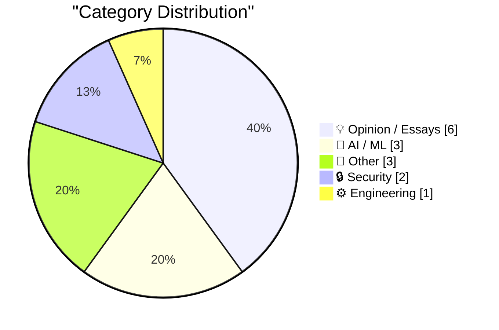
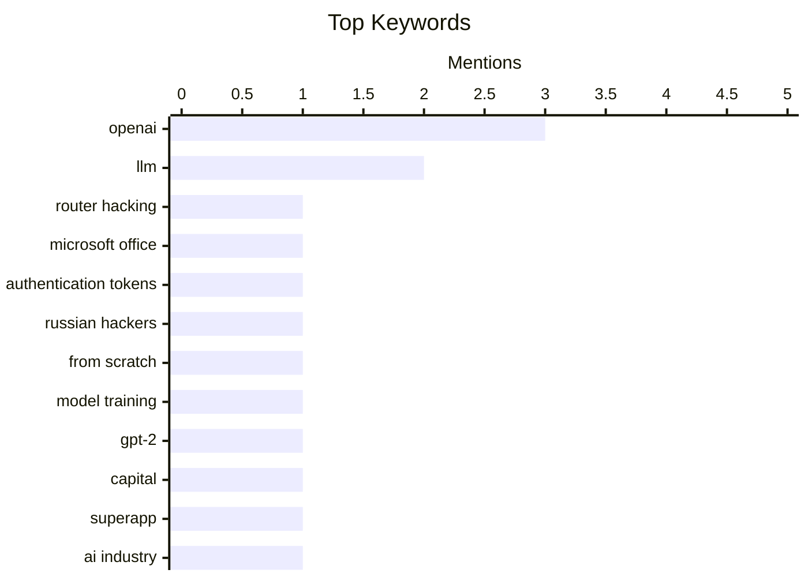

## Today's Highlights
The AI sector is experiencing a surge of activity, with OpenAI securing a massive $122 billion in capital for ambitious "superapp" plans and its CEO comparing AGI's potential societal impact to a pandemic. This rapid advancement is simultaneously driving critical focus on AI security, as new vulnerabilities for AI agents are identified and Anthropic restricts access to advanced models for safety research. Meanwhile, traditional cybersecurity threats persist, highlighted by Russian military intelligence exploiting router flaws to steal sensitive user tokens.
---
## Must Read Today
1. **Russia Hacked Routers to Steal Microsoft Office Tokens**
[Russia Hacked Routers to Steal Microsoft Office Tokens](https://krebsonsecurity.com/2026/04/russia-hacked-routers-to-steal-microsoft-office-tokens/) — krebsonsecurity.com · 21h ago · 🔒 Security
> Russian military intelligence units are exploiting known vulnerabilities in older Internet routers to mass harvest authentication tokens from Microsoft Office users. This sophisticated spying campaign allowed state-backed hackers to silently siphon tokens from users on over 18,000 networks. Crucially, the operation achieved its objective without deploying any malicious software or code on target systems. This highlights a stealthy, infrastructure-level cyber espionage tactic targeting widely used enterprise software.
💡 **Why read it**: It details a significant state-sponsored cyberattack method that exploits common infrastructure to compromise enterprise accounts without traditional malware.
🏷️ Router Hacking, Microsoft Office, Authentication Tokens, Russian Hackers
2. **Writing an LLM from scratch, part 32i -- Interventions: what is in the noise?**
[Writing an LLM from scratch, part 32i -- Interventions: what is in the noise?](https://www.gilesthomas.com/2026/04/llm-from-scratch-32i-interventions-what-is-in-the-noise) — gilesthomas.com · 17h ago · 🤖 AI / ML
> This article is part of a series detailing the process of building a Large Language Model (LLM) from scratch, specifically focusing on 'Interventions: what is in the noise?'. The author previously trained a 163M-parameter GPT-2-style model on a local RTX 3090, using code based on Sebastian Raschka's book. This installment likely delves into analyzing the less understood or 'noisy' aspects of the model's internal representations or outputs. It aims to explore these phenomena, possibly through targeted interventions to understand their impact on model behavior. This continues a practical, hands-on exploration of LLM development, moving beyond basic training to deeper analysis of model intricacies.
💡 **Why read it**: It offers practical insights into the advanced stages of building and understanding large language models, specifically focusing on internal analysis techniques.
🏷️ LLM, from scratch, model training, GPT-2
3. **★ OpenAI Announces $122 Billion Additional ‘Committed Capital’, and Announces Their ‘Superapp’ Plan for the Future**
[★ OpenAI Announces $122 Billion Additional ‘Committed Capital’, and Announces Their ‘Superapp’ Plan for the Future](https://daringfireball.net/2026/04/openai_future) — daringfireball.net · 15h ago · 💡 Opinion / Essays
> OpenAI has announced an additional $122 billion in committed capital and unveiled plans for a future 'Superapp.' The article expresses skepticism regarding the justification for OpenAI's perceived trillion-dollar valuation, despite this massive capital injection and ambitious product strategy. The author questions the feasibility and strategic rationale behind their 'Superapp' vision. This critical perspective suggests that significant financial backing and grand plans do not automatically validate OpenAI's long-term valuation or strategic direction.
💡 **Why read it**: It provides a critical perspective on OpenAI's financial valuation and future product strategy, questioning the feasibility of their ambitious plans.
🏷️ OpenAI, Capital, Superapp, AI Industry
---
## Data Overview
| Sources Scanned | Articles Fetched | Time Window | Selected |
|:---:|:---:|:---:|:---:|
| 78/92 | 2390 -> 17 | 24h | **15** |
### Category Distribution

### Top Keywords

<details>
<summary>Plain Text Keyword Chart (Terminal Friendly)</summary>
```
openai                │ ████████████████████ 3
llm                   │ █████████████░░░░░░░ 2
router hacking        │ ███████░░░░░░░░░░░░░ 1
microsoft office      │ ███████░░░░░░░░░░░░░ 1
authentication tokens │ ███████░░░░░░░░░░░░░ 1
russian hackers       │ ███████░░░░░░░░░░░░░ 1
from scratch          │ ███████░░░░░░░░░░░░░ 1
model training        │ ███████░░░░░░░░░░░░░ 1
gpt-2                 │ ███████░░░░░░░░░░░░░ 1
capital               │ ███████░░░░░░░░░░░░░ 1
```
</details>
### Topic Tags
**openai**(3) · **llm**(2) · **router hacking**(1) · microsoft office(1) · authentication tokens(1) · russian hackers(1) · from scratch(1) · model training(1) · gpt-2(1) · capital(1) · superapp(1) · ai industry(1) · ai agents(1) · package security(1) · vulnerabilities(1) · supply chain(1) · sam altman(1) · agi(1) · ai impact(1) · glm-5.1(1)
---
## Opinion / Essays
### 1. ★ OpenAI Announces $122 Billion Additional ‘Committed Capital’, and Announces Their ‘Superapp’ Plan for the Future
[★ OpenAI Announces $122 Billion Additional ‘Committed Capital’, and Announces Their ‘Superapp’ Plan for the Future](https://daringfireball.net/2026/04/openai_future) — **daringfireball.net** · 15h ago · ⭐ 26/30
> OpenAI has announced an additional $122 billion in committed capital and unveiled plans for a future 'Superapp.' The article expresses skepticism regarding the justification for OpenAI's perceived trillion-dollar valuation, despite this massive capital injection and ambitious product strategy. The author questions the feasibility and strategic rationale behind their 'Superapp' vision. This critical perspective suggests that significant financial backing and grand plans do not automatically validate OpenAI's long-term valuation or strategic direction.
🏷️ OpenAI, Capital, Superapp, AI Industry
---
### 2. Sam Altman, in a Video Released by OpenAI, Apparently Thinks AGI Is Going to Hit Society Like a Once-a-Century Pandemic
[Sam Altman, in a Video Released by OpenAI, Apparently Thinks AGI Is Going to Hit Society Like a Once-a-Century Pandemic](https://x.com/OpenAINewsroom/status/2041618671236469200?s=20) — **daringfireball.net** · 15h ago · ⭐ 24/30
> Sam Altman of OpenAI recently compared the societal impact of Artificial General Intelligence (AGI) to a once-a-century pandemic in a video. The author expresses skepticism and concern, finding this comparison terrifying rather than reassuring. The article also criticizes Altman's claim that OpenAI employees predicted COVID weeks ahead of the general public, likening it to Donald Trump's repeated false claims about 9/11. This piece challenges OpenAI's public messaging around AGI's societal impact and questions the credibility of its leadership's past claims.
🏷️ Sam Altman, AGI, OpenAI, AI Impact
---
### 3. Om Malik and Ben Thompson on OpenAI Buying TBPN
[Om Malik and Ben Thompson on OpenAI Buying TBPN](https://om.co/2026/04/02/openai-masters-of-agitprop-2-0/) — **daringfireball.net** · 21h ago · ⭐ 22/30
> The article discusses the implications of OpenAI's acquisition of TBPN, drawing parallels to historical propaganda and strategic communication. Om Malik quotes Vladimir Lenin on the role of newspapers as collective propagandists, agitators, and organizers, implying OpenAI's acquisition serves a similar strategic communication purpose. OpenAI's CEO of Applications, Fidji Simo, states their standard communications playbook doesn't apply, reinforcing the idea of a unique, impactful technological shift. The acquisition is framed as a strategic move by OpenAI to control narrative and influence, rather than a typical corporate expansion.
🏷️ OpenAI, Acquisition, Media, Tech Strategy
---
### 4. Pluralistic: Process knowledge (08 Apr 2026)
[Pluralistic: Process knowledge (08 Apr 2026)](https://pluralistic.net/2026/04/08/process-knowledge-vs-bosses/) — **pluralistic.net** · 24m ago · ⭐ 19/30
> This article, titled "Process knowledge," appears to be a collection of links and short thoughts centered around the value of practical, hands-on knowledge. The snippet "Process knowledge: We also serve who stand and wash" suggests an emphasis on the importance of understanding the practical steps and nuances of work, potentially contrasting with theoretical or managerial perspectives. Other sections, such as "Object permanence: Chicken Little; 'Anya's Ghost'; Ad-tech's algorithmic cruelty," hint at broader societal or technological critiques. The article likely advocates for the recognition and value of practical, 'process' knowledge across various contexts, from labor to technology critique.
🏷️ Ad-tech, algorithmic cruelty, privacy, commentary
---
### 5. Michael Nielsen – How science actually progresses
[Michael Nielsen – How science actually progresses](https://www.dwarkesh.com/p/michael-nielsen) — **dwarkesh.com** · 22h ago · ⭐ 18/30
> This article explores the often-misunderstood process of scientific progress, challenging romanticized narratives of scientific discovery. Michael Nielsen argues that major scientific breakthroughs, exemplified by figures like Einstein, Newton, and Darwin, are not singular "aha!" moments but rather the culmination of extensive, often messy, and collaborative work. He emphasizes the importance of deep engagement with problems, the role of community, and the iterative nature of scientific development over isolated genius, involving numerous failed experiments and incremental insights. True scientific progress is a complex, iterative, and often non-linear process driven by persistent effort and community interaction, rather than sudden, individual epiphanies.
🏷️ Science, history, progress, research
---
### 6. Pork & Puppetry
[Pork & Puppetry](https://feed.tedium.co/link/15204/17315642/pork-johnson-gimp-parody-interview) — **tedium.co** · 10h ago · ⭐ 17/30
> This article delves into the inspiration and creation of the "Pork Johnson" GIMP parody interview, a semi-viral video within FOSS circles. The creator and puppeteer, Pork Johnson, explains that the parody was motivated by a desire to satirize the often-serious and sometimes overly critical nature of open-source communities, specifically targeting the GIMP image editor's interface debates. The video uses puppetry and humor to highlight the absurdity of some FOSS discussions, aiming to entertain while subtly critiquing community dynamics. The "Pork Johnson" GIMP parody serves as a humorous yet insightful commentary on the culture and debates within the Free and Open Source Software (FOSS) community.
🏷️ GIMP, FOSS, viral, puppetry
---
## AI / ML
### 7. Writing an LLM from scratch, part 32i -- Interventions: what is in the noise?
[Writing an LLM from scratch, part 32i -- Interventions: what is in the noise?](https://www.gilesthomas.com/2026/04/llm-from-scratch-32i-interventions-what-is-in-the-noise) — **gilesthomas.com** · 17h ago · ⭐ 29/30
> This article is part of a series detailing the process of building a Large Language Model (LLM) from scratch, specifically focusing on 'Interventions: what is in the noise?'. The author previously trained a 163M-parameter GPT-2-style model on a local RTX 3090, using code based on Sebastian Raschka's book. This installment likely delves into analyzing the less understood or 'noisy' aspects of the model's internal representations or outputs. It aims to explore these phenomena, possibly through targeted interventions to understand their impact on model behavior. This continues a practical, hands-on exploration of LLM development, moving beyond basic training to deeper analysis of model intricacies.
🏷️ LLM, from scratch, model training, GPT-2
---
### 8. GLM-5.1: Towards Long-Horizon Tasks
[GLM-5.1: Towards Long-Horizon Tasks](https://simonwillison.net/2026/Apr/7/glm-51/#atom-everything) — **simonwillison.net** · 16h ago · ⭐ 23/30
> Chinese AI lab Z.ai has released GLM-5.1, a new large language model specifically aimed at tackling long-horizon tasks. GLM-5.1 is a massive 754B parameter model, weighing 1.51TB on Hugging Face, and is released under an MIT license. It shares the same size and underlying paper as its predecessor, GLM-5, and is accessible via OpenRouter. This release signifies continued progress in developing extremely large, open-access models designed to tackle more intricate and extended AI challenges.
🏷️ LLM, GLM-5.1, Large Language Model, Open Source
---
### 9. Anthropic's Project Glasswing - restricting Claude Mythos to security researchers - sounds necessary to me
[Anthropic's Project Glasswing - restricting Claude Mythos to security researchers - sounds necessary to me](https://simonwillison.net/2026/Apr/7/project-glasswing/#atom-everything) — **simonwillison.net** · 17h ago · ⭐ 22/30
> Anthropic has launched Project Glasswing, a program that restricts access to its new Claude Mythos model to a limited set of preview partners and security researchers. Claude Mythos is described as a general-purpose model, similar in capability to Claude Opus 4.6, but Anthropic claims it possesses advanced cybersecurity research abilities. The restricted release, accompanied by a system card PDF, is a precautionary measure to allow controlled evaluation of its powerful and potentially risky capabilities. This controlled deployment strategy reflects a growing industry concern about the safe and responsible release of highly capable AI models, especially those with cybersecurity implications.
🏷️ Claude Mythos, Anthropic, AI Safety, Responsible AI
---
## Other
### 10. The Data Drop: Every iPhone
[The Data Drop: Every iPhone](https://sheets.works/data-viz/every-iphone) — **daringfireball.net** · 21h ago · ⭐ 15/30
> This article highlights an exceptional data visualization project by Sheets.works, detailing every iPhone model released. Sheets.works, a consulting firm specializing in Google Sheets, created a "lovely" and comprehensive data visualization that meticulously tracks specifications and release information for every iPhone model. The visualization demonstrates the power and flexibility of Google Sheets as a tool for complex data presentation, showcasing its capability beyond basic spreadsheet functions. The "Every iPhone" visualization is a prime example of high-quality data presentation achieved using Google Sheets, proving its advanced capabilities for detailed technical data.
🏷️ Data Visualization, iPhone, Google Sheets, Design
---
### 11. Flighty Airports Meltdown Map
[Flighty Airports Meltdown Map](https://flighty.com/airports) — **daringfireball.net** · 21h ago · ⭐ 12/30
> This article introduces Flighty's live data map for major airport delay times across North America. Flighty provides real-time updates on airport delays, offering a "nice 'TV Mode'" for easy viewing on larger screens, in addition to its integration within the Flighty app. The map aggregates live data to present a clear overview of current travel disruptions, enabling users to quickly assess the status of major North American airports. Flighty's Airports Meltdown Map offers a valuable, real-time resource for tracking North American airport delays, accessible both via web and app.
🏷️ Airport Delays, Flighty, Live Data, Travel App
---
### 12. Solar Eclipse From the Far Side of the Moon
[Solar Eclipse From the Far Side of the Moon](https://kottke.org/26/04/solar-eclipse-far-side-of-the-moon) — **daringfireball.net** · 15h ago · ⭐ 10/30
> This article features a breathtaking astronomical photograph from the Artemis II mission, capturing the Moon eclipsing the Sun. The image, taken from the far side of the Moon by Artemis II, depicts a unique perspective of a solar eclipse, where the Moon itself is seen passing in front of the Sun. Kottke describes it as "one of the most breathtaking astronomical photos I’ve ever seen," highlighting its rarity and visual impact. NASA's Flickr account is cited as the source for more such imagery. The Artemis II mission has delivered an extraordinary and rare photograph of a solar eclipse from the Moon's far side, offering a stunning new astronomical perspective.
🏷️ Solar Eclipse, Moon, Artemis II, Astronomy
---
## Security
### 13. Russia Hacked Routers to Steal Microsoft Office Tokens
[Russia Hacked Routers to Steal Microsoft Office Tokens](https://krebsonsecurity.com/2026/04/russia-hacked-routers-to-steal-microsoft-office-tokens/) — **krebsonsecurity.com** · 21h ago · ⭐ 29/30
> Russian military intelligence units are exploiting known vulnerabilities in older Internet routers to mass harvest authentication tokens from Microsoft Office users. This sophisticated spying campaign allowed state-backed hackers to silently siphon tokens from users on over 18,000 networks. Crucially, the operation achieved its objective without deploying any malicious software or code on target systems. This highlights a stealthy, infrastructure-level cyber espionage tactic targeting widely used enterprise software.
🏷️ Router Hacking, Microsoft Office, Authentication Tokens, Russian Hackers
---
### 14. Package Security Problems for AI Agents
[Package Security Problems for AI Agents](https://nesbitt.io/2026/04/08/package-security-problems-for-ai-agents.html) — **nesbitt.io** · 4h ago · ⭐ 26/30
> This article addresses the inherent security vulnerabilities arising from the extensive reliance of AI agents on numerous software packages. It emphasizes that AI agents are built upon a deep stack of dependencies ('packages all the way down'), which significantly broadens their attack surface. Consequently, a vulnerability in any underlying package can compromise the entire AI agent's security. The increasing complexity and interconnectedness of AI agent ecosystems therefore necessitate a robust focus on supply chain security for all included components.
🏷️ AI agents, package security, vulnerabilities, supply chain
---
## Engineering
### 15. SQLite WAL Mode Across Docker Containers Sharing a Volume
[SQLite WAL Mode Across Docker Containers Sharing a Volume](https://simonwillison.net/2026/Apr/7/sqlite-wal-docker-containers/#atom-everything) — **simonwillison.net** · 22h ago · ⭐ 21/30
> This article investigates the reliability of SQLite's WAL (Write-Ahead Logging) mode when multiple Docker containers share the same volume. Inspired by a Hacker News discussion, the research confirmed that SQLite WAL mode functions correctly without issues. This holds true even when two separate SQLite processes in different Docker containers access the same database file on a shared volume. Docker's robust handling of shared memory and file locking mechanisms ensures data integrity and consistent operation. This research provides practical assurance that SQLite WAL mode can be reliably used in multi-container Docker environments with shared storage.
🏷️ SQLite, Docker, WAL Mode, Database
---
*Generated at 2026-04-08 14:04 | Scanned 78 sources -> 2390 articles -> selected 15*
*Based on the [Hacker News Popularity Contest 2025](https://refactoringenglish.com/tools/hn-popularity/) RSS source list recommended by [Andrej Karpathy](https://x.com/karpathy)*
*Produced by Dongdianr AI. Follow the same-name WeChat public account for more AI practical tips 💡*
