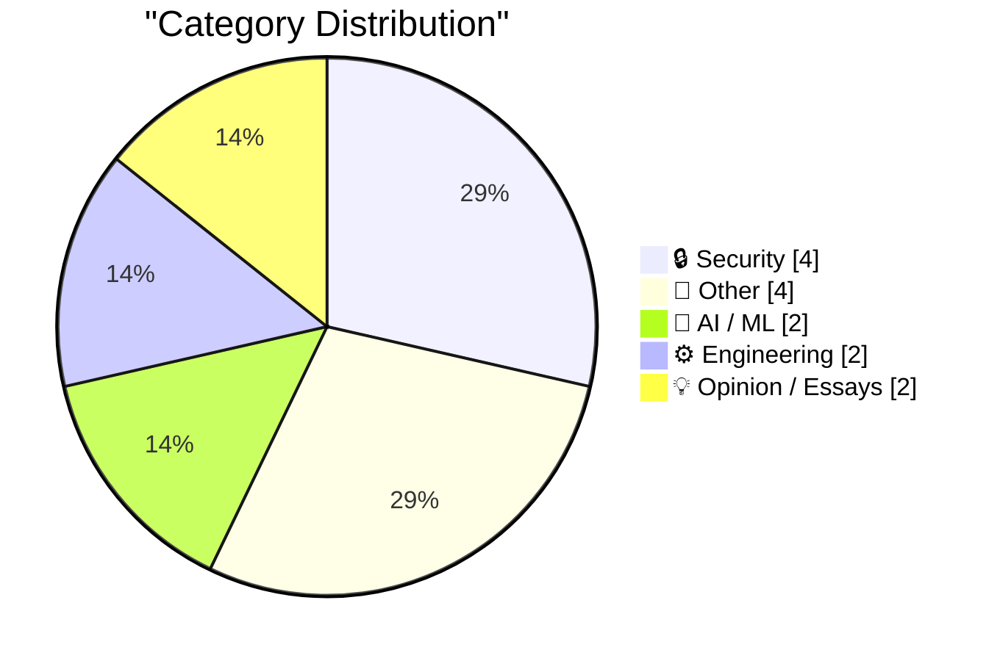
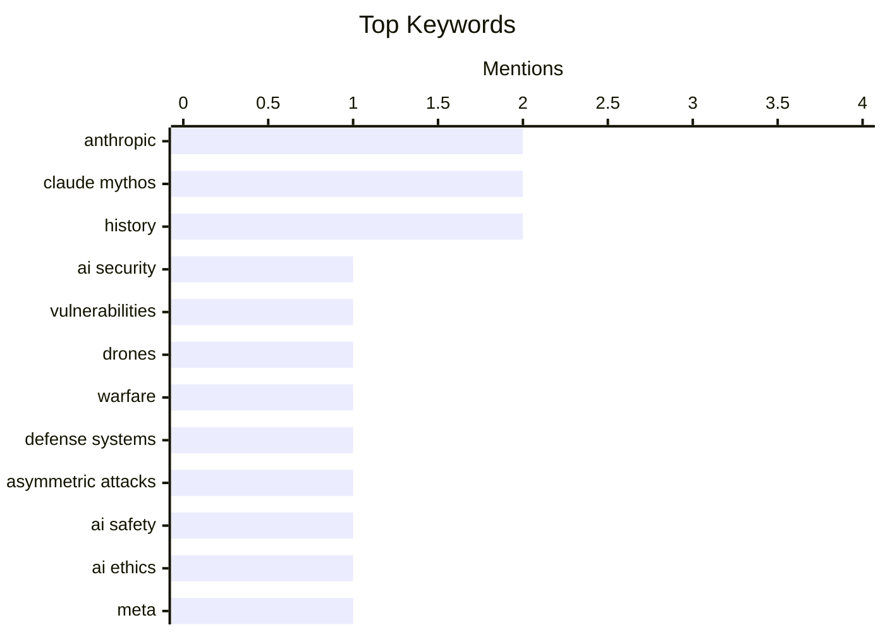

## Today's Highlights
Today's tech highlights are dominated by the dual nature of advanced AI, as Anthropic's powerful Claude Mythos model demonstrates such potent vulnerability exploitation that it won't see public release. This breakthrough intensifies the focus on AI safety and the critical need for robust security defenses for AI agents. Concurrently, the broader security landscape is evolving rapidly, with the proliferation of drones reshaping modern conflicts and underscoring a world of increasingly pervasive threats.
---
## Must Read Today
1. **Anthropic’s New Claude Mythos Is So Good at Finding and Exploiting Vulnerabilities That They’re Not Releasing It to the Public**
[Anthropic’s New Claude Mythos Is So Good at Finding and Exploiting Vulnerabilities That They’re Not Releasing It to the Public](https://red.anthropic.com/2026/mythos-preview/) — daringfireball.net · 22h ago · 🔒 Security
> Anthropic has announced Claude Mythos Preview, a new general-purpose language model demonstrating exceptional capabilities in computer security tasks. This model is strikingly effective at finding and exploiting vulnerabilities, prompting Anthropic to launch Project Glasswing. Project Glasswing aims to leverage Mythos Preview to secure critical software globally and prepare the industry for advanced cyber threats. The model's potent security capabilities highlight the dual-use challenge of advanced AI, necessitating careful deployment strategies. This initiative underscores the urgent need for the industry to adapt to evolving cyberattack methodologies.
💡 **Why read it**: This article is worth reading to understand the cutting-edge capabilities of new AI models like Claude Mythos in cybersecurity and the proactive measures being taken by developers to address their potential risks and benefits.
🏷️ Anthropic, Claude Mythos, AI security, vulnerabilities
2. **Nowhere Is Safe**
[Nowhere Is Safe](https://steveblank.com/2026/04/09/nowhere-is-safe/) — steveblank.com · 1h ago · 🔒 Security
> The proliferation of drones in modern conflicts, exemplified by Ukraine and the war with Iran, has rendered the surface of the earth a highly contested space. The U.S. has found that traditional air superiority and missile defense systems, such as THAAD and Patriot batteries, are inadequate against asymmetric attacks. These systems, designed to counter tens or hundreds of aircraft and missiles, are overwhelmed by thousands of drones. This shift necessitates a re-evaluation of defense strategies to address the scale and nature of drone warfare. The core problem is the vulnerability of conventional defenses to massed, low-cost drone attacks.
💡 **Why read it**: This article is worth reading for its critical analysis of how drone warfare is fundamentally changing military strategy and rendering traditional air defense systems obsolete.
🏷️ drones, warfare, defense systems, asymmetric attacks
3. **What should we take from Anthropic’s (possibly) terrifying new report on Mythos?**
[What should we take from Anthropic’s (possibly) terrifying new report on Mythos?](https://garymarcus.substack.com/p/what-should-we-take-from-anthropics) — garymarcus.substack.com · 20h ago · 🤖 AI / ML
> This article discusses the implications of Anthropic's new report on their Mythos AI model, particularly its "possibly terrifying" capabilities. It aims to provide starting points for sober thinking about the report's findings, acknowledging a lack of extensive public facts. The core problem is interpreting the potential societal and security impacts of advanced AI like Mythos, especially given its reported prowess in areas like vulnerability exploitation. The author encourages a cautious and thoughtful approach to understanding and responding to such powerful AI developments. The main takeaway is the need for careful consideration of AI's dual-use nature.
💡 **Why read it**: This article is worth reading for its critical perspective on interpreting the implications of powerful AI models like Anthropic's Mythos, prompting thoughtful consideration beyond initial announcements.
🏷️ Anthropic, Claude Mythos, AI safety, AI ethics
---
## Data Overview
| Sources Scanned | Articles Fetched | Time Window | Selected |
|:---:|:---:|:---:|:---:|
| 76/92 | 2351 -> 14 | 24h | **14** |
### Category Distribution

### Top Keywords

<details>
<summary>Plain Text Keyword Chart (Terminal Friendly)</summary>
```
anthropic          │ ████████████████████ 2
claude mythos      │ ████████████████████ 2
history            │ ████████████████████ 2
ai security        │ ██████████░░░░░░░░░░ 1
vulnerabilities    │ ██████████░░░░░░░░░░ 1
drones             │ ██████████░░░░░░░░░░ 1
warfare            │ ██████████░░░░░░░░░░ 1
defense systems    │ ██████████░░░░░░░░░░ 1
asymmetric attacks │ ██████████░░░░░░░░░░ 1
ai safety          │ ██████████░░░░░░░░░░ 1
```
</details>
### Topic Tags
**anthropic**(2) · **claude mythos**(2) · **history**(2) · ai security(1) · vulnerabilities(1) · drones(1) · warfare(1) · defense systems(1) · asymmetric attacks(1) · ai safety(1) · ai ethics(1) · meta(1) · muse spark(1) · ai model(1) · llm(1) · ai agents(1) · package security(1) · sandboxes(1) · lockfiles(1) · artemis(1)
---
## Security
### 1. Anthropic’s New Claude Mythos Is So Good at Finding and Exploiting Vulnerabilities That They’re Not Releasing It to the Public
[Anthropic’s New Claude Mythos Is So Good at Finding and Exploiting Vulnerabilities That They’re Not Releasing It to the Public](https://red.anthropic.com/2026/mythos-preview/) — **daringfireball.net** · 22h ago · ⭐ 28/30
> Anthropic has announced Claude Mythos Preview, a new general-purpose language model demonstrating exceptional capabilities in computer security tasks. This model is strikingly effective at finding and exploiting vulnerabilities, prompting Anthropic to launch Project Glasswing. Project Glasswing aims to leverage Mythos Preview to secure critical software globally and prepare the industry for advanced cyber threats. The model's potent security capabilities highlight the dual-use challenge of advanced AI, necessitating careful deployment strategies. This initiative underscores the urgent need for the industry to adapt to evolving cyberattack methodologies.
🏷️ Anthropic, Claude Mythos, AI security, vulnerabilities
---
### 2. Nowhere Is Safe
[Nowhere Is Safe](https://steveblank.com/2026/04/09/nowhere-is-safe/) — **steveblank.com** · 1h ago · ⭐ 27/30
> The proliferation of drones in modern conflicts, exemplified by Ukraine and the war with Iran, has rendered the surface of the earth a highly contested space. The U.S. has found that traditional air superiority and missile defense systems, such as THAAD and Patriot batteries, are inadequate against asymmetric attacks. These systems, designed to counter tens or hundreds of aircraft and missiles, are overwhelmed by thousands of drones. This shift necessitates a re-evaluation of defense strategies to address the scale and nature of drone warfare. The core problem is the vulnerability of conventional defenses to massed, low-cost drone attacks.
🏷️ drones, warfare, defense systems, asymmetric attacks
---
### 3. Package Security Defenses for AI Agents
[Package Security Defenses for AI Agents](https://nesbitt.io/2026/04/09/package-security-defenses-for-ai-agents.html) — **nesbitt.io** · 4h ago · ⭐ 23/30
> This article addresses the critical problem of securing AI agents, specifically focusing on defenses related to package security. It proposes implementing several technical measures to mitigate risks, including the use of lockfiles to ensure deterministic dependencies and prevent supply chain attacks. Sandboxes are recommended to isolate AI agent execution environments, limiting potential damage from malicious packages. Additionally, cooldown timers are suggested as a mechanism to control the frequency of package installations or updates, providing a window for security review. These defenses aim to enhance the integrity and safety of AI agent operations.
🏷️ AI agents, package security, sandboxes, lockfiles
---
### 4. Pluralistic: Cindy Cohn's "Privacy's Defender" (09 Apr 2026)
[Pluralistic: Cindy Cohn's "Privacy's Defender" (09 Apr 2026)](https://pluralistic.net/2026/04/09/bernstein-2/) — **pluralistic.net** · 3h ago · ⭐ 18/30
> This article highlights "Cindy Cohn's 'Privacy's Defender'," a piece chronicling the comprehensive history of digital rights. The core topic is the evolution and ongoing struggle for privacy in the digital age, as championed by figures like Cindy Cohn. It traces the trajectory of digital rights from their inception to the present day, covering key legal battles, technological shifts, and advocacy efforts. The article serves as a resource for understanding the foundational principles and contemporary challenges in protecting individual privacy online. The main takeaway emphasizes the continuous and vital work required to defend digital liberties.
🏷️ Digital rights, privacy, history
---
## Other
### 5. Root prime gap
[Root prime gap](https://www.johndcook.com/blog/2026/04/08/andrica/) — **johndcook.com** · 13h ago · ⭐ 15/30
> The article introduces Andrica's conjecture, which posits that the square roots of consecutive prime numbers are always less than 1 apart (√pn+1 − √pn < 1). This conjecture has been extensively verified empirically for primes up to 2 × 10^19. If proven true, it would offer significant insights into the distribution of prime numbers. The article highlights an unproven mathematical conjecture that holds true for an extremely large range of tested values. This suggests a consistent pattern in prime number spacing, despite the lack of a formal proof.
🏷️ Prime numbers, mathematics, number theory
---
### 6. Helium Is Hard to Replace
[Helium Is Hard to Replace](https://www.construction-physics.com/p/helium-is-hard-to-replace) — **construction-physics.com** · 2h ago · ⭐ 15/30
> This article underscores the critical and difficult-to-replace nature of helium, particularly in the context of global supply chain vulnerabilities. Geopolitical events, such as the war in Iran and the closure of the Strait of Hormuz, can significantly disrupt the supply of essential commodities. The title itself emphasizes helium's indispensability across various applications, implying its unique properties are hard to replicate. The core takeaway is that helium is a strategic resource whose supply chain is highly susceptible to global disruptions, necessitating careful management and consideration.
🏷️ Helium, supply chain, geopolitics
---
### 7. Osborne Computer liquidated April 9, 1986
[Osborne Computer liquidated April 9, 1986](https://dfarq.homeip.net/osborne-computer-liquidated-april-9-1986/?utm_source=rss&#038;utm_medium=rss&#038;utm_campaign=osborne-computer-liquidated-april-9-1986) — **dfarq.homeip.net** · 3h ago · ⭐ 15/30
> The article commemorates the liquidation of Osborne Computer Corporation on April 9, 1986, marking the end of a pioneer in portable computing. Osborne Computer was known for its early CP/M machines and innovative portable designs, but faced three years of financial hardship. Its demise is generally attributed to issues related to its founder. This historical account serves as a case study of an early tech innovator's rapid rise and fall. The main conclusion is that even groundbreaking companies can succumb to financial mismanagement and leadership challenges.
🏷️ Osborne Computer, portable computing, liquidation, history
---
### 8. Book Review: Small Comfort by Ia Genberg ★★☆☆☆
[Book Review: Small Comfort by Ia Genberg ★★☆☆☆](https://shkspr.mobi/blog/2026/04/book-review-small-comfort-by-ia-genberg/) — **shkspr.mobi** · 2h ago · ⭐ 10/30
> This article reviews Ia Genberg's book "Small Comfort," with the reviewer expressing a largely unconvinced impression and awarding it ★★☆☆☆. The reviewer appreciated the concept of interrelated stories told in different styles, drawing parallels to the film "Lola RenntRun Lola Run" with its themes of cash, morally ambiguous characters, and philosophical discussions on economic salvation. However, the execution, described as slamming together the naïve and the cynical, ultimately failed to resonate. The main conclusion is that despite an interesting premise and structural ambition, the book did not fully succeed in its narrative delivery.
🏷️ Book review, novel, literature
---
## AI / ML
### 9. What should we take from Anthropic’s (possibly) terrifying new report on Mythos?
[What should we take from Anthropic’s (possibly) terrifying new report on Mythos?](https://garymarcus.substack.com/p/what-should-we-take-from-anthropics) — **garymarcus.substack.com** · 20h ago · ⭐ 26/30
> This article discusses the implications of Anthropic's new report on their Mythos AI model, particularly its "possibly terrifying" capabilities. It aims to provide starting points for sober thinking about the report's findings, acknowledging a lack of extensive public facts. The core problem is interpreting the potential societal and security impacts of advanced AI like Mythos, especially given its reported prowess in areas like vulnerability exploitation. The author encourages a cautious and thoughtful approach to understanding and responding to such powerful AI developments. The main takeaway is the need for careful consideration of AI's dual-use nature.
🏷️ Anthropic, Claude Mythos, AI safety, AI ethics
---
### 10. Meta's new model is Muse Spark, and meta.ai chat has some interesting tools
[Meta's new model is Muse Spark, and meta.ai chat has some interesting tools](https://simonwillison.net/2026/Apr/8/muse-spark/#atom-everything) — **simonwillison.net** · 14h ago · ⭐ 24/30
> Meta has introduced Muse Spark, their first new model release since Llama 4 approximately one year ago. Muse Spark is a hosted model, not open weights, and its API is currently available as a private preview to select users. The model can be accessed and tested on meta.ai, requiring a Facebook or Instagram login. Meta has also provided self-reported benchmarks for Muse Spark, indicating its performance. This release signifies Meta's continued investment in advanced AI models and their integration into consumer-facing platforms.
🏷️ Meta, Muse Spark, AI model, LLM
---
## Engineering
### 11. A Three- and a Four- Body Problem
[A Three- and a Four- Body Problem](https://www.johndcook.com/blog/2026/04/08/artemis-1-apollo-12/) — **johndcook.com** · 14h ago · ⭐ 20/30
> This article delves into the complex orbital mechanics of space missions, specifically comparing the Artemis I and Artemis II missions. The core topic is the "three- and four-body problem" as applied to spacecraft trajectories. It highlights that the unmanned Artemis I mission had a significantly more interesting and unusual 25-day orbit compared to the planned 10-day Artemis II mission. The extended duration and unique path of Artemis I allowed for a deeper exploration of complex gravitational interactions. This analysis provides insights into advanced trajectory design for future space exploration.
🏷️ Artemis, orbital mechanics, space exploration
---
### 12. Rapport digitale autonomie binnen de energie-intensieve industrie voor Energy Innovation NL
[Rapport digitale autonomie binnen de energie-intensieve industrie voor Energy Innovation NL](https://berthub.eu/articles/posts/rapport-digitale-afhankelijkheden-energy-innovation-nl/) — **berthub.eu** · 9h ago · ⭐ 19/30
> This article announces the publication of a report titled "Digital autonomy within the energy-intensive industry," commissioned by Energy Innovation NL (formerly Topsector Energie). The core problem addressed is the increasing digital dependencies within the energy-intensive sector and the need for greater digital autonomy. The author conducted interviews with a broad selection of relevant companies in collaboration with Energy Innovation NL to gather insights. The report aims to provide a comprehensive overview of the challenges and opportunities for enhancing digital independence in this critical industry. The main takeaway is the importance of strategic initiatives to secure digital sovereignty for energy-intensive industries.
🏷️ digital autonomy, energy industry, industrial tech, report
---
## Opinion / Essays
### 13. Quoting Giles Turnbull
[Quoting Giles Turnbull](https://simonwillison.net/2026/Apr/8/giles-turnbull/#atom-everything) — **simonwillison.net** · 22h ago · ⭐ 19/30
> This article presents a critical observation from Giles Turnbull regarding the public's perception and acceptance of AI tools. The core topic is the inherent hypocrisy in how individuals view AI's impact on different professions. Turnbull notes that "everyone likes using AI tools to try doing someone else’s profession," suggesting an enthusiasm for AI as a personal augmentation or exploration tool. However, this enthusiasm wanes significantly "when someone else uses it for their profession," highlighting a strong resistance or discomfort when AI threatens one's own professional domain. This dichotomy underscores a key ethical challenge in AI adoption and societal integration.
🏷️ AI impact, profession, human-AI
---
### 14. You can absolutely have an RSS dependent website in 2026
[You can absolutely have an RSS dependent website in 2026](https://matduggan.com/you-can-absolutely-have-an-rss-dependent-website-in-2026/) — **matduggan.com** · 3h ago · ⭐ 18/30
> This article argues for the continued viability and utility of RSS as a primary content distribution method for websites in 2026. The core problem it addresses is the common misconception that RSS is an outdated or insufficient technology for modern web publishing. The author asserts that, despite not offering an email newsletter, an RSS-dependent website can effectively serve its audience. This approach emphasizes user control over content consumption and avoids the complexities and privacy concerns associated with email marketing. The main takeaway is that RSS remains a robust and perfectly acceptable solution for content syndication.
🏷️ RSS, web standards, content distribution, website
---
*Generated at 2026-04-09 14:04 | Scanned 76 sources -> 2351 articles -> selected 14*
*Based on the [Hacker News Popularity Contest 2025](https://refactoringenglish.com/tools/hn-popularity/) RSS source list recommended by [Andrej Karpathy](https://x.com/karpathy)*
*Produced by Dongdianr AI. Follow the same-name WeChat public account for more AI practical tips 💡*
