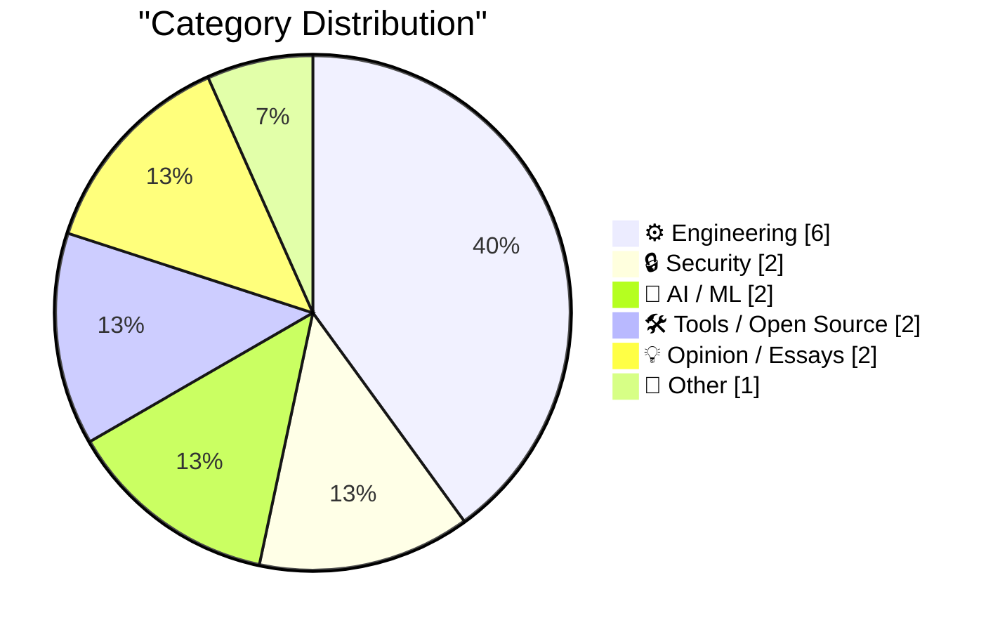
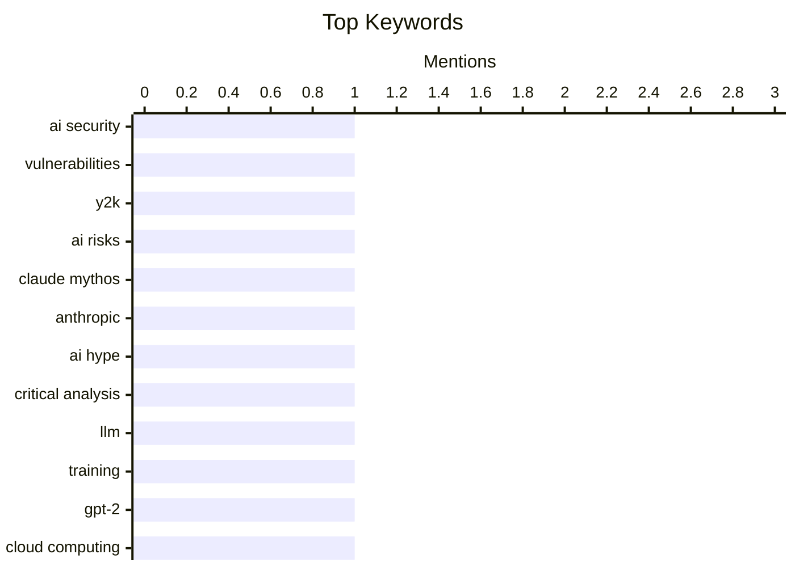

## Today's Highlights
The tech world grapples with the dual nature of AI, navigating both overhyped announcements and the serious "Y2K 2.0" security reckoning it brings. Developers continue to face practical challenges, from mysterious macOS crashes after 49 days to optimizing complex build processes and managing package registries. Underlying these trends are ongoing concerns about software ethics and user privacy, highlighted by vendors modifying system files without consent.
---
## Must Read Today
1. **Y2K 2.0: The AI security reckoning**
[Y2K 2.0: The AI security reckoning](https://anildash.com/2026/04/10/y2k-2.0-ai-security/) — anildash.com · 14h ago · 🔒 Security
> The article addresses a rapid increase in software security vulnerabilities, now becoming routine, posing a significant threat. This surge is attributed to Large Language Models (LLMs) rapidly improving their code writing capabilities, which consequently enhances their ability to analyze code for security weaknesses. This dual-edged sword means AI can both create and find exploits at an unprecedented rate. The current trend suggests an impending "AI security reckoning" akin to Y2K, demanding urgent attention to these evolving threats.
💡 **Why read it**: It highlights the critical and rapidly escalating security risks posed by AI's dual capacity to generate and exploit code, urging proactive measures.
🏷️ AI Security, Vulnerabilities, Y2K, AI Risks
2. **Three reasons to think that the Claude Mythos announcement from Anthropic was overblown**
[Three reasons to think that the Claude Mythos announcement from Anthropic was overblown](https://garymarcus.substack.com/p/three-reasons-to-think-that-the-claude) — garymarcus.substack.com · 18h ago · 🤖 AI / ML
> The article critically assesses Anthropic's "Claude Mythos" announcement, suggesting its capabilities might be overblown. While specific technical details are not provided in the snippet, the author implies that the claims lack substantial novelty or practical impact. The piece likely presents arguments questioning the true advancements of the announced Claude features. It concludes that there is no immediate need for panic, implying the announcement's significance is exaggerated.
💡 **Why read it**: It offers a skeptical perspective on a prominent AI announcement, encouraging critical evaluation of new LLM claims.
🏷️ Claude Mythos, Anthropic, AI hype, critical analysis
3. **Writing an LLM from scratch, part 32j -- Interventions: trying to train a better model in the cloud**
[Writing an LLM from scratch, part 32j -- Interventions: trying to train a better model in the cloud](https://www.gilesthomas.com/2026/04/llm-from-scratch-32j-interventions-trying-to-train-a-better-model-in-the-cloud) — gilesthomas.com · 18h ago · 🤖 AI / ML
> The author is attempting to improve the performance of a 163M-parameter GPT-2-style model previously trained locally. Since early February, various "interventions" have been applied to the model, which was initially trained from scratch on an RTX 3090. The original model achieved a loss of 3.944, using code based on Sebastian Raschka's "Build a Large Language Model (from Scratch)" book. Current efforts involve training in the cloud to explore methods for achieving a better model. This ongoing project details the practical challenges and iterative process of fine-tuning and improving a custom-built LLM.
💡 **Why read it**: It provides a practical, detailed account of an individual's journey in training and optimizing a custom LLM, including specific hardware and software references.
🏷️ LLM, training, GPT-2, cloud computing
---
## Data Overview
| Sources Scanned | Articles Fetched | Time Window | Selected |
|:---:|:---:|:---:|:---:|
| 78/92 | 2391 -> 18 | 24h | **15** |
### Category Distribution

### Top Keywords

<details>
<summary>Plain Text Keyword Chart (Terminal Friendly)</summary>
```
ai security       │ ████████████████████ 1
vulnerabilities   │ ████████████████████ 1
y2k               │ ████████████████████ 1
ai risks          │ ████████████████████ 1
claude mythos     │ ████████████████████ 1
anthropic         │ ████████████████████ 1
ai hype           │ ████████████████████ 1
critical analysis │ ████████████████████ 1
llm               │ ████████████████████ 1
training          │ ████████████████████ 1
```
</details>
### Topic Tags
**ai security**(1) · **vulnerabilities**(1) · **y2k**(1) · ai risks(1) · claude mythos(1) · anthropic(1) · ai hype(1) · critical analysis(1) · llm(1) · training(1) · gpt-2(1) · cloud computing(1) · webassembly(1) · go(1) · toolkit(1) · open source(1) · adobe(1) · privacy(1) · hosts file(1) · creative cloud(1)
---
## Engineering
### 1. MacOS Seemingly Crashes After 49 Days of Uptime — a ‘Feature’ Perhaps Exclusive to Tahoe
[MacOS Seemingly Crashes After 49 Days of Uptime — a ‘Feature’ Perhaps Exclusive to Tahoe](https://sixcolors.com/link/2026/04/macs-crash-after-49-days-of-uptime/) — **daringfireball.net** · 15h ago · ⭐ 25/30
> Macs running macOS experience a system freeze after precisely 49 days, 17 hours, 2 minutes, and 47 seconds of continuous uptime. Software developer Photon discovered this major bug, caused by a 32-bit unsigned integer overflow in Apple’s XNU kernel. This overflow specifically freezes the internal TCP timestamp clock, rendering most network services (except ICMP ping) non-functional. This critical kernel bug effectively imposes a hidden uptime expiration date on macOS systems. A reboot is necessitated to restore full functionality.
🏷️ macOS, bug, uptime, integer overflow
---
### 2. SQLAlchemy 2 In Practice - Chapter 4 - Many-To-Many Relationships
[SQLAlchemy 2 In Practice - Chapter 4 - Many-To-Many Relationships](https://blog.miguelgrinberg.com/post/sqlalchemy-2-in-practice---chapter-4---many-to-many-relationships) — **miguelgrinberg.com** · 23h ago · ⭐ 24/30
> This chapter, "SQLAlchemy 2 In Practice - Chapter 4," focuses on understanding and implementing many-to-many relationships within SQLAlchemy 2. As part of the "SQLAlchemy 2 in Practice" book, it delves into the intricacies of defining and managing these relationships. The chapter likely provides practical examples and best practices for setting up complex relationships involving an intermediary association table. It serves as a practical guide for developers to effectively model and interact with many-to-many data structures using SQLAlchemy 2.
🏷️ SQLAlchemy 2, Many-to-Many, Database, ORM
---
### 3. Package Registries and Pagination
[Package Registries and Pagination](https://nesbitt.io/2026/04/10/package-registries-and-pagination.html) — **nesbitt.io** · 4h ago · ⭐ 23/30
> The article addresses the challenge of managing and efficiently retrieving large amounts of metadata from package registries, especially with many versions. It highlights the issue with an example: 100MB of metadata for 10,451 versions. This scale necessitates effective pagination strategies to avoid overwhelming clients or servers with massive data transfers. The piece likely discusses how package registries implement or should implement pagination to handle such extensive datasets. Proper pagination is crucial for the scalability and performance of package registries, enabling efficient access to metadata without resource exhaustion.
🏷️ Package Registry, Pagination, Metadata, Performance
---
### 4. Fewer Computers, Fewer Problems: Going Local With Builds & Deployments
[Fewer Computers, Fewer Problems: Going Local With Builds & Deployments](https://blog.jim-nielsen.com/2026/fewer-computers-fewer-problems/) — **blog.jim-nielsen.com** · 19h ago · ⭐ 21/30
> The author expresses frustration with the complexities and "devops'ing" required for remote builds and deployments using services like Netlify. While acknowledging the convenience of `git push` deployments for small personal sites, the author notes dissatisfaction with ensuring builds work consistently on remote Linux environments. This often leads to extra time spent debugging environment differences between local machines and cloud services. The author contemplates returning to local builds and direct deployments from their own computer. The article advocates for a simpler, local-first approach to builds and deployments to reduce "devops" overhead and environment-related debugging.
🏷️ Local Builds, Deployment, Developer Workflow, CI/CD
---
### 5. Random hexagon fractal
[Random hexagon fractal](https://www.johndcook.com/blog/2026/04/09/random-hexagon-fractal/) — **johndcook.com** · 20h ago · ⭐ 19/30
> This article describes a geometric process for generating a random fractal within a hexagon. The method begins by selecting an arbitrary point 'c' inside a hexagon. In each subsequent iteration, a random side of the hexagon is chosen, and a new triangle is formed using that side and the current point 'c'. The point 'c' is then updated to become the centroid of this newly formed triangle, iteratively refining the fractal pattern.
🏷️ fractal, hexagon, random algorithm, computational geometry
---
### 6. [RSS Club] Why do you use RSS rather than Atom?
[[RSS Club] Why do you use RSS rather than Atom?](https://shkspr.mobi/blog/2026/04/rss-club-why-do-you-use-rss-rather-than-atom/) — **shkspr.mobi** · 2h ago · ⭐ 17/30
> This article, exclusive to feed subscribers, discusses the naming convention of "RSS Club" and the broader context of XML-based distributed feeds. The author reveals an ongoing experiment with local-only and privacy-conscious view tracking for their content. This tracking allows them to monitor clicks from sources like Hacker News or Google, and they have also implemented a metric for the total number of story views.
🏷️ RSS, Atom, web feeds, syndication
---
## Security
### 7. Y2K 2.0: The AI security reckoning
[Y2K 2.0: The AI security reckoning](https://anildash.com/2026/04/10/y2k-2.0-ai-security/) — **anildash.com** · 14h ago · ⭐ 29/30
> The article addresses a rapid increase in software security vulnerabilities, now becoming routine, posing a significant threat. This surge is attributed to Large Language Models (LLMs) rapidly improving their code writing capabilities, which consequently enhances their ability to analyze code for security weaknesses. This dual-edged sword means AI can both create and find exploits at an unprecedented rate. The current trend suggests an impending "AI security reckoning" akin to Y2K, demanding urgent attention to these evolving threats.
🏷️ AI Security, Vulnerabilities, Y2K, AI Risks
---
### 8. Adobe Diddles With Your /etc/hosts File
[Adobe Diddles With Your /etc/hosts File](https://old.reddit.com/r/webdev/comments/1sb6hzk/adobe_wrote_to_my_hosts_file_ive_never_had_an_app/oe1ap9h/) — **daringfireball.net** · 17h ago · ⭐ 26/30
> Adobe is reportedly modifying users' `/etc/hosts` files without explicit consent, raising privacy and security concerns. According to "thenickdude" on Reddit, Adobe uses this to detect Creative Cloud installations when a user visits adobe.com. They add a DNS entry redirecting `detect-ccd.creativecloud.adobe.com` to `127.0.0.1`. If the hosts file entry is present, the browser's attempt to load `https://detect-ccd.creativecloud.adobe.com/cc.png` fails, indicating Creative Cloud is installed. This practice allows Adobe to track installations via a stealthy and potentially intrusive method, bypassing standard browser-based detection.
🏷️ Adobe, privacy, hosts file, Creative Cloud
---
## AI / ML
### 9. Three reasons to think that the Claude Mythos announcement from Anthropic was overblown
[Three reasons to think that the Claude Mythos announcement from Anthropic was overblown](https://garymarcus.substack.com/p/three-reasons-to-think-that-the-claude) — **garymarcus.substack.com** · 18h ago · ⭐ 27/30
> The article critically assesses Anthropic's "Claude Mythos" announcement, suggesting its capabilities might be overblown. While specific technical details are not provided in the snippet, the author implies that the claims lack substantial novelty or practical impact. The piece likely presents arguments questioning the true advancements of the announced Claude features. It concludes that there is no immediate need for panic, implying the announcement's significance is exaggerated.
🏷️ Claude Mythos, Anthropic, AI hype, critical analysis
---
### 10. Writing an LLM from scratch, part 32j -- Interventions: trying to train a better model in the cloud
[Writing an LLM from scratch, part 32j -- Interventions: trying to train a better model in the cloud](https://www.gilesthomas.com/2026/04/llm-from-scratch-32j-interventions-trying-to-train-a-better-model-in-the-cloud) — **gilesthomas.com** · 18h ago · ⭐ 27/30
> The author is attempting to improve the performance of a 163M-parameter GPT-2-style model previously trained locally. Since early February, various "interventions" have been applied to the model, which was initially trained from scratch on an RTX 3090. The original model achieved a loss of 3.944, using code based on Sebastian Raschka's "Build a Large Language Model (from Scratch)" book. Current efforts involve training in the cloud to explore methods for achieving a better model. This ongoing project details the practical challenges and iterative process of fine-tuning and improving a custom-built LLM.
🏷️ LLM, training, GPT-2, cloud computing
---
## Tools / Open Source
### 11. watgo - a WebAssembly Toolkit for Go
[watgo - a WebAssembly Toolkit for Go](https://eli.thegreenplace.net/2026/watgo-a-webassembly-toolkit-for-go/) — **eli.thegreenplace.net** · 11h ago · ⭐ 27/30
> The article announces "watgo," a new WebAssembly Toolkit for Go, addressing the need for a pure Go-based Wasm development solution. This project provides Wasm tooling in pure, zero-dependency Go, analogous to existing tools like `wabt` (C++) or `wasm-tools` (Rust). `watgo` aims to simplify WebAssembly integration and development within the Go ecosystem. It offers Go developers a native and independent solution for working with WebAssembly.
🏷️ WebAssembly, Go, Toolkit, Open Source
---
### 12. GitHub Repo Size
[GitHub Repo Size](https://simonwillison.net/2026/Apr/9/github-repo-size/#atom-everything) — **simonwillison.net** · 16h ago · ⭐ 24/30
> GitHub's UI does not display repository sizes, making it difficult for users to quickly ascertain this information. Simon Willison created a tool, "GitHub Repo Size," that leverages the CORS-friendly GitHub API to retrieve repository sizes. Users can paste a repository URL, and the tool queries the API to display the size, such as `simonw/datasette` being 8.1MB. The tool provides a simple and effective solution for users to quickly check the size of any GitHub repository using publicly available API data.
🏷️ GitHub, repo size, developer tool, API
---
## Opinion / Essays
### 13. Pluralistic: Canny Valley and Creative Commons (10 Apr 2026)
[Pluralistic: Canny Valley and Creative Commons (10 Apr 2026)](https://pluralistic.net/2026/04/10/canny-valley/) — **pluralistic.net** · 4h ago · ⭐ 19/30
> This article is a link aggregation post from Cory Doctorow's Pluralistic blog, covering a wide range of topics. It touches upon "Canny Valley" and Creative Commons, alongside political commentary on "Bidenomics," Al Franken's budget, and Bernie Sanders. Other links discuss art as money laundering, the UK government's stance on copyright trolls, and pharmaceutical issues. The post serves as a daily digest of Doctorow's interests and current events.
🏷️ Creative Commons, copyright, digital rights, link digest
---
### 14. Why I quit "The Strive"
[Why I quit "The Strive"](https://www.joanwestenberg.com/why-i-quit-the-strive/) — **joanwestenberg.com** · 12h ago · ⭐ 14/30
> This article discusses the author's decision to quit "The Strive" and outlines their new subscription model for their newsletter. While the core newsletter remains free, a paid subscription tier is introduced at $2.50/month. This premium tier offers additional monthly posts, an absence of sponsored calls to action, community access, and direct communication with the author.
🏷️ Newsletter, Subscription, Creator Economy, Personal Reflection
---
## Other
### 15. The Great Pyramid of Giza and the Speed of Light
[The Great Pyramid of Giza and the Speed of Light](https://www.johndcook.com/blog/2026/04/09/pyramid-speed-of-light/) — **johndcook.com** · 20h ago · ⭐ 16/30
> This article investigates a claim from a social media post on X regarding a numerical coincidence between the latitude of the Great Pyramid of Giza and the speed of light. The author confirms that the speed of light in vacuum is precisely 299,792,458 meters per second. Remarkably, the latitude of the Great Pyramid of Giza is found to be 29.9792458° N, demonstrating an exact numerical match when expressed in decimal degrees.
🏷️ Pyramid of Giza, speed of light, coincidence, debunking
---
*Generated at 2026-04-10 14:04 | Scanned 78 sources -> 2391 articles -> selected 15*
*Based on the [Hacker News Popularity Contest 2025](https://refactoringenglish.com/tools/hn-popularity/) RSS source list recommended by [Andrej Karpathy](https://x.com/karpathy)*
*Produced by Dongdianr AI. Follow the same-name WeChat public account for more AI practical tips 💡*
