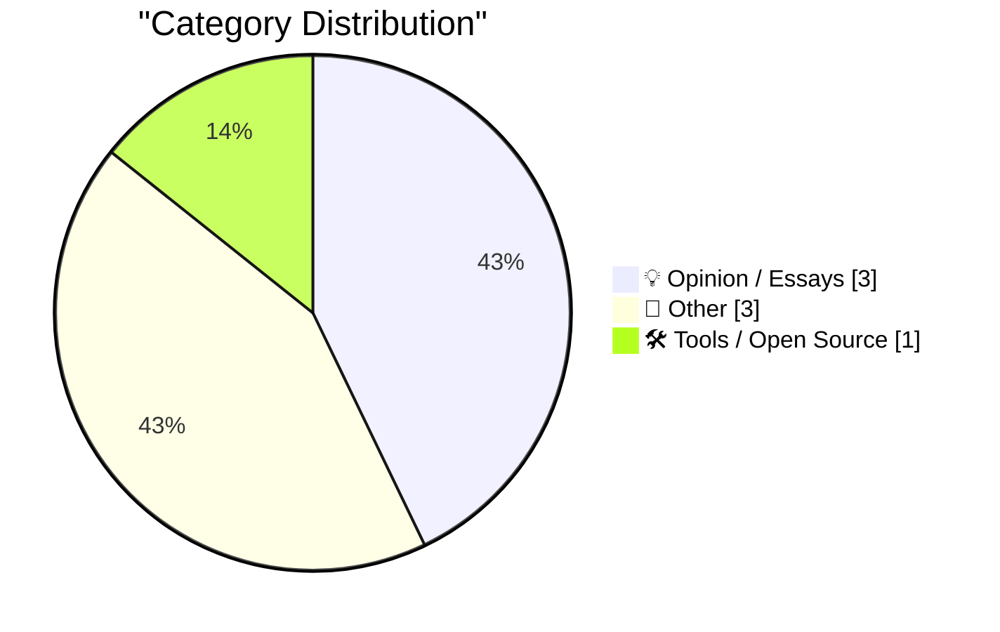
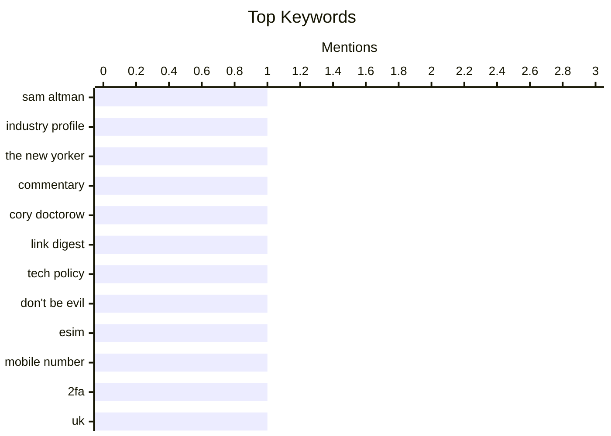

## Today's Highlights
Today's highlights reveal a keen focus on human connection and the evolving role of technology. Discussions delve into the nuanced dynamics of friendship, from appreciating individuals in their lifetime to understanding why friends might withhold their best ideas. Concurrently, the tech landscape offers practical solutions like cost-effective eSIM use, alongside broader reflections on digital ethics and the cultural preservation of technology, as seen in new museums.
---
## Must Read Today
1. **★ Let Us Learn to Show Our Friendship for a Man When He Is Alive and Not After He Is Dead**
[★ Let Us Learn to Show Our Friendship for a Man When He Is Alive and Not After He Is Dead](https://daringfireball.net/2026/04/when_he_is_alive_and_not_after_he_is_dead) — daringfireball.net · 16h ago · 💡 Opinion / Essays
> This article offers a meta-commentary on the public perception and appreciation of individuals, prompted by Ronan Farrow and Andrew Marantz’s profile of Sam Altman in The New Yorker. It implicitly critiques the tendency to fully acknowledge or celebrate someone's contributions only after a significant event or posthumously. The piece suggests a broader reflection on the timing of our appreciation for public figures and their work. The core message advocates for recognizing and valuing people during their active lives rather than waiting for historical retrospection.
💡 **Why read it**: It offers a thought-provoking commentary on how public figures are appreciated, using a high-profile profile of Sam Altman as a specific example.
🏷️ Sam Altman, industry profile, The New Yorker, commentary
2. **Pluralistic: Don't Be Evil (11 Apr 2026)**
[Pluralistic: Don't Be Evil (11 Apr 2026)](https://pluralistic.net/2026/04/11/obvious-terrible-ideas/) — pluralistic.net · 29m ago · 💡 Opinion / Essays
> This article is a curated link aggregation from Cory Doctorow's Pluralistic blog, centered around the theme "Don't Be Evil." It compiles diverse topics, including a commentary that "Evil genius is just a lack of shame," and various links under "Object permanence" such as "FBI x Trotsky," "Jakob Nielsen x headlines," and "EFF v DOGE." The post also lists upcoming and recent appearances, along with updates on his books. It serves as a digest of current events, tech news, and socio-political commentary through Doctorow's critical lens.
💡 **Why read it**: It provides a curated collection of links and commentary from Cory Doctorow, offering diverse perspectives on current events, technology, and societal issues.
🏷️ Cory Doctorow, link digest, tech policy, Don't Be Evil
3. **Cheapest way to keep a UK mobile number using an eSIM**
[Cheapest way to keep a UK mobile number using an eSIM](https://shkspr.mobi/blog/2026/04/cheapest-way-to-keep-a-uk-mobile-number-using-an-esim/) — shkspr.mobi · 2h ago · 🛠 Tools / Open Source
> The article addresses the practical problem of cost-effectively retaining an old UK mobile number for SMS-based 2FA without using physical SIM cards. The author seeks the cheapest eSIM option that allows for long-term number retention, ideally for a couple of years. It implies a comparison of various UK mobile providers to identify the most economical solution for this specific use case. The goal is to find a convenient and affordable way to keep the number active solely for receiving authentication messages.
💡 **Why read it**: It provides practical advice and potential solutions for individuals looking to retain a UK mobile number cheaply using eSIMs, especially for 2FA.
🏷️ eSIM, mobile number, 2FA, UK
---
## Data Overview
| Sources Scanned | Articles Fetched | Time Window | Selected |
|:---:|:---:|:---:|:---:|
| 76/92 | 2347 -> 7 | 24h | **7** |
### Category Distribution

### Top Keywords

<details>
<summary>Plain Text Keyword Chart (Terminal Friendly)</summary>
```
sam altman       │ ████████████████████ 1
industry profile │ ████████████████████ 1
the new yorker   │ ████████████████████ 1
commentary       │ ████████████████████ 1
cory doctorow    │ ████████████████████ 1
link digest      │ ████████████████████ 1
tech policy      │ ████████████████████ 1
don't be evil    │ ████████████████████ 1
esim             │ ████████████████████ 1
mobile number    │ ████████████████████ 1
```
</details>
### Topic Tags
**sam altman**(1) · **industry profile**(1) · **the new yorker**(1) · commentary(1) · cory doctorow(1) · link digest(1) · tech policy(1) · don't be evil(1) · esim(1) · mobile number(1) · 2fa(1) · uk(1) · mathematics(1) · number theory(1) · fractions(1) · decimal forms(1) · reading list(1) · construction(1) · intel(1) · industry news(1)
---
## Opinion / Essays
### 1. ★ Let Us Learn to Show Our Friendship for a Man When He Is Alive and Not After He Is Dead
[★ Let Us Learn to Show Our Friendship for a Man When He Is Alive and Not After He Is Dead](https://daringfireball.net/2026/04/when_he_is_alive_and_not_after_he_is_dead) — **daringfireball.net** · 16h ago · ⭐ 24/30
> This article offers a meta-commentary on the public perception and appreciation of individuals, prompted by Ronan Farrow and Andrew Marantz’s profile of Sam Altman in The New Yorker. It implicitly critiques the tendency to fully acknowledge or celebrate someone's contributions only after a significant event or posthumously. The piece suggests a broader reflection on the timing of our appreciation for public figures and their work. The core message advocates for recognizing and valuing people during their active lives rather than waiting for historical retrospection.
🏷️ Sam Altman, industry profile, The New Yorker, commentary
---
### 2. Pluralistic: Don't Be Evil (11 Apr 2026)
[Pluralistic: Don't Be Evil (11 Apr 2026)](https://pluralistic.net/2026/04/11/obvious-terrible-ideas/) — **pluralistic.net** · 29m ago · ⭐ 19/30
> This article is a curated link aggregation from Cory Doctorow's Pluralistic blog, centered around the theme "Don't Be Evil." It compiles diverse topics, including a commentary that "Evil genius is just a lack of shame," and various links under "Object permanence" such as "FBI x Trotsky," "Jakob Nielsen x headlines," and "EFF v DOGE." The post also lists upcoming and recent appearances, along with updates on his books. It serves as a digest of current events, tech news, and socio-political commentary through Doctorow's critical lens.
🏷️ Cory Doctorow, link digest, tech policy, Don't Be Evil
---
### 3. Your friends are hiding their best ideas from you
[Your friends are hiding their best ideas from you](https://idiallo.com/blog/your-friends-are-hiding-their-ideas?src=feed) — **idiallo.com** · 13h ago · ⭐ 12/30
> The article explores the phenomenon of individuals, particularly friends, withholding their best ideas, illustrated through a personal anecdote from a college JavaScript class. The author recounts how their group built the "best website in class" for a fake restaurant, "Coral Reef," utilizing Photoshop skills for logo integration. This successful collaborative effort led to a profound realization for the author about the power of shared creativity. The experience implicitly argues for the benefits of open collaboration and sharing ideas, suggesting that visible effort and teamwork can unlock unexpected insights and success.
🏷️ college project, JavaScript, personal reflection, website
---
## Other
### 4. Distribution of digits in fractions
[Distribution of digits in fractions](https://www.johndcook.com/blog/2026/04/10/fraction-digits/) — **johndcook.com** · 23h ago · ⭐ 19/30
> This article delves into a less commonly explored mathematical property concerning the distribution of digits in the decimal representation of fractions. It highlights that even fundamental areas of mathematics hold surprising depths, specifically focusing on patterns "off the beaten path." The post aims to demonstrate a particular aspect of how digits are distributed when representing fractions, likely involving specific conditions such as "Let p > 5." It promises to reveal an insight not widely known, even to career mathematicians.
🏷️ mathematics, number theory, fractions, decimal forms
---
### 5. Reading List 04/11/2026
[Reading List 04/11/2026](https://www.construction-physics.com/p/reading-list-04112026) — **construction-physics.com** · 2h ago · ⭐ 19/30
> This article presents a curated reading list covering diverse topics relevant to construction, infrastructure, and current events. Key subjects highlighted include the geopolitical status of the Strait of Hormuz, an analysis of the cost-benefit of building codes, Intel's involvement in Terafab (likely a semiconductor manufacturing initiative), and the concept of "sponge cities" for urban water management. The list serves as a concise overview of significant news and analytical pieces. It aims to inform readers about important developments across these interconnected fields.
🏷️ reading list, construction, Intel, industry news
---
### 6. Ed Bindels’s Apple Museum in Utrecht, Netherlands
[Ed Bindels’s Apple Museum in Utrecht, Netherlands](https://applemuseum.nl/) — **daringfireball.net** · 21h ago · ⭐ 14/30
> This article introduces and praises a new Apple Museum established by Ed Bindels in Utrecht, Netherlands, located about 30-40 minutes south of Amsterdam. It describes the museum as "astonishing," highlighting its impressive collection and presentation. A specific visual highlight mentioned is "The rainbow wall of iMacs," which is deemed "incredible." The piece serves as an enthusiastic recommendation for this new cultural attraction. It suggests the museum is a significant and visually stunning destination for Apple enthusiasts.
🏷️ Apple, museum, tech history, Utrecht
---
## Tools / Open Source
### 7. Cheapest way to keep a UK mobile number using an eSIM
[Cheapest way to keep a UK mobile number using an eSIM](https://shkspr.mobi/blog/2026/04/cheapest-way-to-keep-a-uk-mobile-number-using-an-esim/) — **shkspr.mobi** · 2h ago · ⭐ 19/30
> The article addresses the practical problem of cost-effectively retaining an old UK mobile number for SMS-based 2FA without using physical SIM cards. The author seeks the cheapest eSIM option that allows for long-term number retention, ideally for a couple of years. It implies a comparison of various UK mobile providers to identify the most economical solution for this specific use case. The goal is to find a convenient and affordable way to keep the number active solely for receiving authentication messages.
🏷️ eSIM, mobile number, 2FA, UK
---
*Generated at 2026-04-11 14:04 | Scanned 76 sources -> 2347 articles -> selected 7*
*Based on the [Hacker News Popularity Contest 2025](https://refactoringenglish.com/tools/hn-popularity/) RSS source list recommended by [Andrej Karpathy](https://x.com/karpathy)*
*Produced by Dongdianr AI. Follow the same-name WeChat public account for more AI practical tips 💡*
