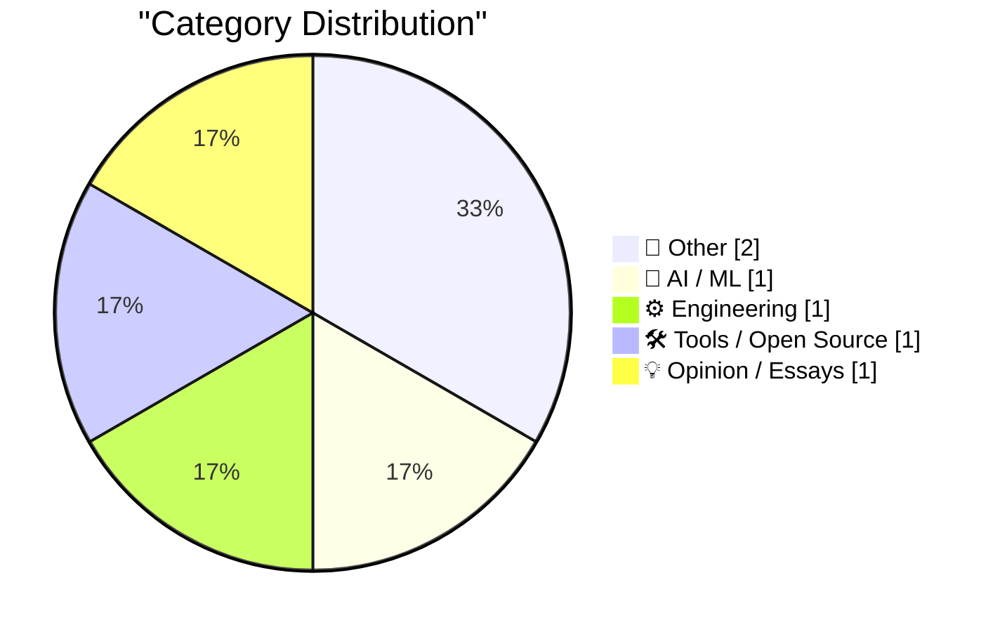
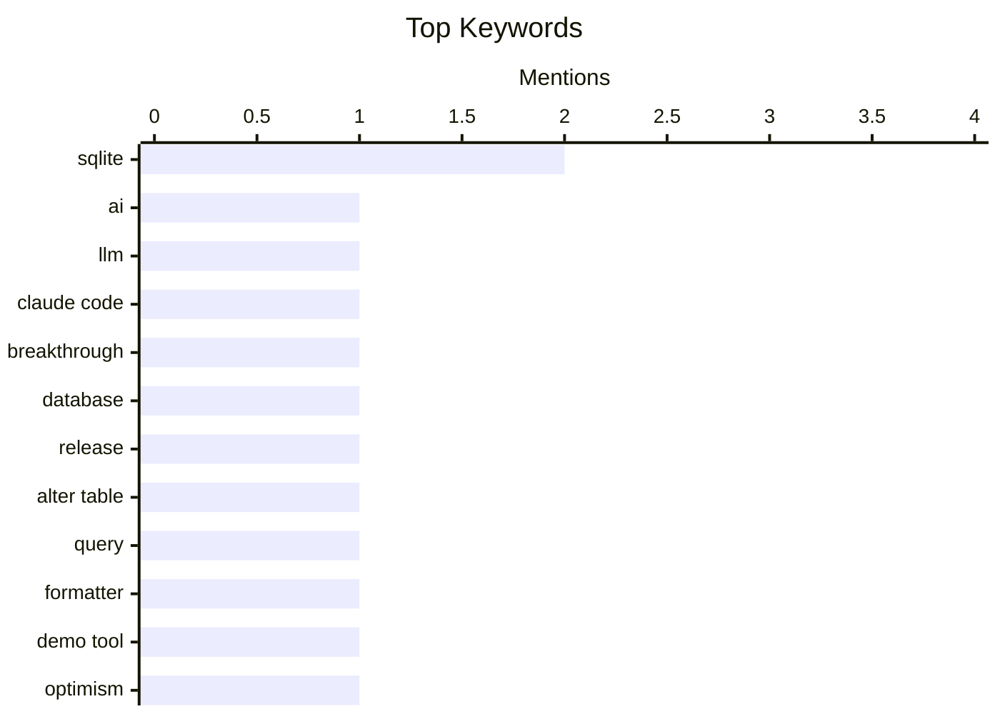

## Today's Highlights
Today's tech highlights feature significant advancements in artificial intelligence, with new capabilities like Claude Code's "tool use" pushing the boundaries of what AI can achieve. Concurrently, the world of software engineering sees robust progress, marked by a major update to SQLite and the introduction of new tools designed to enhance developer productivity and data management. These developments underscore a dual focus on innovative AI applications and the continuous refinement of foundational software infrastructure.
---
## Must Read Today
1. **The biggest advance in AI since the LLM**
[The biggest advance in AI since the LLM](https://garymarcus.substack.com/p/the-biggest-advance-in-ai-since-the) — garymarcus.substack.com · 21h ago · 🤖 AI / ML
> This article discusses Claude Code's new "tool use" capabilities as a significant advancement in AI, potentially surpassing previous LLM developments. Claude Code can now autonomously select and use external tools, such as a Python interpreter or web search, to solve complex problems by breaking down tasks and executing code. This contrasts with prior LLMs that required explicit prompting for tool use, demonstrating a more integrated and autonomous problem-solving approach, including self-correction based on error messages. This new capability represents a paradigm shift towards more general-purpose AI. It enables LLMs to perform complex, multi-step tasks with greater independence and reliability.
💡 **Why read it**: It highlights a significant new capability in AI (Claude Code's autonomous tool use) that could change how LLMs interact with the world and solve problems.
🏷️ AI, LLM, Claude Code, breakthrough
2. **SQLite 3.53.0**
[SQLite 3.53.0](https://simonwillison.net/2026/Apr/11/sqlite/#atom-everything) — simonwillison.net · 18h ago · ⚙️ Engineering
> This article announces the release of SQLite 3.53.0, a significant update following the withdrawal of 3.52.0, bringing numerous user-facing and internal improvements. Notable enhancements include the ability for `ALTER TABLE` to add and remove `NOT NULL` and `CHECK` constraints, a new `sqlite3_result_subtype()` API for custom result formatting, and the introduction of `sqlite3_stmt_explain()` for programmatic query plan analysis. The release also features a new Query Result Formatter library, which can render results as HTML, Markdown, or CSV, and is compiled to WebAssembly for browser use. SQLite 3.53.0 significantly improves database schema manipulation, query result formatting, and programmatic introspection, enhancing its utility for developers.
💡 **Why read it**: It details important new features and improvements in SQLite 3.53.0, particularly for schema alteration and query result handling, which are valuable for developers.
🏷️ SQLite, database, release, ALTER TABLE
3. **SQLite Query Result Formatter Demo**
[SQLite Query Result Formatter Demo](https://simonwillison.net/2026/Apr/11/sqlite-qrf/#atom-everything) — simonwillison.net · 18h ago · 🛠 Tools / Open Source
> This article introduces a demo tool for the new Query Result Formatter library, which is part of SQLite 3.53.0, allowing users to experiment with various SQL result table rendering options. The "SQLite Query Result Formatter Demo" is a playground UI that showcases the library's capabilities, which include rendering query results as HTML, Markdown, or CSV. The underlying library is compiled to WebAssembly, enabling it to run efficiently directly in a web browser. This tool provides a practical way to visualize and understand the new formatting features. The demo offers an accessible way to explore and utilize SQLite 3.53.0's new Query Result Formatter, demonstrating its flexibility in presenting SQL query outputs.
💡 **Why read it**: It provides a practical, interactive tool to explore the new SQLite 3.53.0 Query Result Formatter, making it easier to understand its capabilities.
🏷️ SQLite, query, formatter, demo tool
---
## Data Overview
| Sources Scanned | Articles Fetched | Time Window | Selected |
|:---:|:---:|:---:|:---:|
| 77/92 | 2377 -> 6 | 24h | **6** |
### Category Distribution

### Top Keywords

<details>
<summary>Plain Text Keyword Chart (Terminal Friendly)</summary>
```
sqlite       │ ████████████████████ 2
ai           │ ██████████░░░░░░░░░░ 1
llm          │ ██████████░░░░░░░░░░ 1
claude code  │ ██████████░░░░░░░░░░ 1
breakthrough │ ██████████░░░░░░░░░░ 1
database     │ ██████████░░░░░░░░░░ 1
release      │ ██████████░░░░░░░░░░ 1
alter table  │ ██████████░░░░░░░░░░ 1
query        │ ██████████░░░░░░░░░░ 1
formatter    │ ██████████░░░░░░░░░░ 1
```
</details>
### Topic Tags
**sqlite**(2) · **ai**(1) · **llm**(1) · claude code(1) · breakthrough(1) · database(1) · release(1) · alter table(1) · query(1) · formatter(1) · demo tool(1) · optimism(1) · personality(1) · career(1) · reflection(1) · easter(1) · calendar(1) · history(1) · culture(1) · graphic design(1)
---
## Other
### 1. The gap between Eastern and Western Easter
[The gap between Eastern and Western Easter](https://www.johndcook.com/blog/2026/04/12/orthodox-western-easter/) — **johndcook.com** · 1h ago · ⭐ 13/30
> This article explains why Eastern and Western Christian churches celebrate Easter on different dates, often with a week or more apart. The discrepancy arises because Western churches use the Gregorian calendar and a different method for calculating the vernal equinox and the Paschal full moon, while Eastern Orthodox churches adhere to the Julian calendar and a different set of rules established by the First Council of Nicaea. Eastern Easter is always on the first Sunday after the first full moon in Spring, but crucially, it must also fall after the Jewish Passover. The dates can be up to five weeks apart, and Eastern Easter is always later than or on the same day as Western Easter. The difference in Easter dates is due to distinct calendar systems (Julian vs. Gregorian) and varying interpretations of the Paschal calculation rules, particularly regarding the vernal equinox and Passover.
🏷️ Easter, calendar, history, culture
---
### 2. Pan American Luggage Labels
[Pan American Luggage Labels](https://ellafreire.com/collections/pan-american-luggage-labels) — **daringfireball.net** · 21h ago · ⭐ 9/30
> This article highlights a collection of recreated vintage Pan American luggage tags by artist Ella Freire, appreciating their graphic design and aesthetic appeal. The article praises the "achingly gorgeous art pieces" for their sublime use of colors, typography, and shapes, which evoke a sense of nostalgia and classic design. It focuses on the visual and artistic qualities of these recreations, celebrating them as examples of excellent graphic design. No technical details are provided beyond the artistic elements. Ella Freire's recreated vintage Pan Am luggage labels are celebrated as exceptional examples of graphic design, showcasing timeless aesthetic principles.
🏷️ graphic design, vintage, art, Pan Am
---
## AI / ML
### 3. The biggest advance in AI since the LLM
[The biggest advance in AI since the LLM](https://garymarcus.substack.com/p/the-biggest-advance-in-ai-since-the) — **garymarcus.substack.com** · 21h ago · ⭐ 27/30
> This article discusses Claude Code's new "tool use" capabilities as a significant advancement in AI, potentially surpassing previous LLM developments. Claude Code can now autonomously select and use external tools, such as a Python interpreter or web search, to solve complex problems by breaking down tasks and executing code. This contrasts with prior LLMs that required explicit prompting for tool use, demonstrating a more integrated and autonomous problem-solving approach, including self-correction based on error messages. This new capability represents a paradigm shift towards more general-purpose AI. It enables LLMs to perform complex, multi-step tasks with greater independence and reliability.
🏷️ AI, LLM, Claude Code, breakthrough
---
## Engineering
### 4. SQLite 3.53.0
[SQLite 3.53.0](https://simonwillison.net/2026/Apr/11/sqlite/#atom-everything) — **simonwillison.net** · 18h ago · ⭐ 24/30
> This article announces the release of SQLite 3.53.0, a significant update following the withdrawal of 3.52.0, bringing numerous user-facing and internal improvements. Notable enhancements include the ability for `ALTER TABLE` to add and remove `NOT NULL` and `CHECK` constraints, a new `sqlite3_result_subtype()` API for custom result formatting, and the introduction of `sqlite3_stmt_explain()` for programmatic query plan analysis. The release also features a new Query Result Formatter library, which can render results as HTML, Markdown, or CSV, and is compiled to WebAssembly for browser use. SQLite 3.53.0 significantly improves database schema manipulation, query result formatting, and programmatic introspection, enhancing its utility for developers.
🏷️ SQLite, database, release, ALTER TABLE
---
## Tools / Open Source
### 5. SQLite Query Result Formatter Demo
[SQLite Query Result Formatter Demo](https://simonwillison.net/2026/Apr/11/sqlite-qrf/#atom-everything) — **simonwillison.net** · 18h ago · ⭐ 20/30
> This article introduces a demo tool for the new Query Result Formatter library, which is part of SQLite 3.53.0, allowing users to experiment with various SQL result table rendering options. The "SQLite Query Result Formatter Demo" is a playground UI that showcases the library's capabilities, which include rendering query results as HTML, Markdown, or CSV. The underlying library is compiled to WebAssembly, enabling it to run efficiently directly in a web browser. This tool provides a practical way to visualize and understand the new formatting features. The demo offers an accessible way to explore and utilize SQLite 3.53.0's new Query Result Formatter, demonstrating its flexibility in presenting SQL query outputs.
🏷️ SQLite, query, formatter, demo tool
---
## Opinion / Essays
### 6. Optimism is not a personality flaw
[Optimism is not a personality flaw](https://www.joanwestenberg.com/optimism-is-not-a-personality-flaw/) — **joanwestenberg.com** · 12h ago · ⭐ 15/30
> This article is a personal reflection on the nature of optimism, arguing against the perception that it is a naive or flawed trait. The author suggests that optimism is often misunderstood and unfairly judged, particularly in professional or intellectual contexts where cynicism might be seen as more sophisticated. It implies that maintaining an optimistic outlook can be a deliberate choice and a source of resilience, rather than a lack of realism. The article doesn't present technical arguments but rather a philosophical stance. Optimism should be recognized as a valuable and valid perspective, not a weakness, and can contribute positively to one's approach to life and work.
🏷️ optimism, personality, career, reflection
---
*Generated at 2026-04-12 14:03 | Scanned 77 sources -> 2377 articles -> selected 6*
*Based on the [Hacker News Popularity Contest 2025](https://refactoringenglish.com/tools/hn-popularity/) RSS source list recommended by [Andrej Karpathy](https://x.com/karpathy)*
*Produced by Dongdianr AI. Follow the same-name WeChat public account for more AI practical tips 💡*
