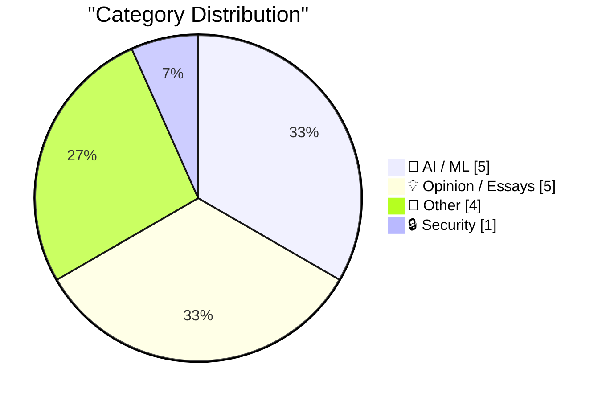
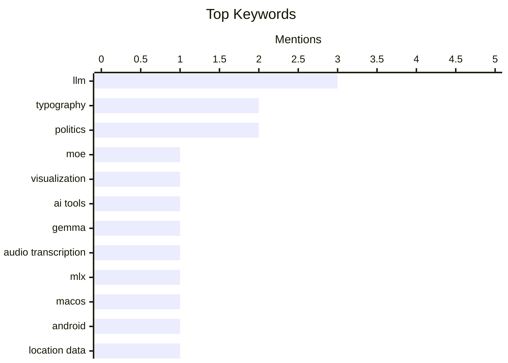

## Today's Highlights
AI is making waves with new tools to visualize complex models and practical applications like audio transcription, while neurosymbolic approaches gain traction. However, the industry continues to grapple with critical discussions around LLM limitations and user experience challenges. In a win for privacy, Android is now automatically stripping location data from shared photos.
---
## Must Read Today
1. **A little tool to visualise MoE expert routing**
[A little tool to visualise MoE expert routing](https://martinalderson.com/posts/moe-expert-routing-visualization/?utm_source=rss&amp;utm_medium=rss&amp;utm_campaign=feed) — martinalderson.com · 14h ago · 🤖 AI / ML
> This article introduces a small tool designed to visualize how Mixture of Experts (MoE) models route tokens through different experts. The author built this tool to observe the dynamic assignment of tokens to specific experts within the MoE architecture. Watching the routing process reveals fascinating insights into the internal workings of these complex models. This visualization can significantly aid researchers and developers in comprehending and debugging MoE model behavior.
💡 **Why read it**: It provides a practical visualization tool for understanding the complex internal workings and token routing mechanisms of Mixture of Experts models.
🏷️ MoE, Visualization, LLM, AI Tools
2. **Gemma 4 audio with MLX**
[Gemma 4 audio with MLX](https://simonwillison.net/2026/Apr/12/mlx-audio/#atom-everything) — simonwillison.net · 14h ago · 🤖 AI / ML
> This article provides a `uv run` recipe for transcribing audio files on macOS using the 10.28 GB Gemma 4 E2B model with MLX. The technical approach leverages `mlx-vlm`, `torchvision`, and `gradio` within a Python 3.13 environment. The specific command `uv run --python 3.13 --with mlx_vlm --with torchvision --with gradio mlx_vlm.generate --model google/gemma-4-e2b-it` demonstrates a straightforward setup. This method enables local audio transcription using a large language model like Gemma 4 on macOS.
💡 **Why read it**: It offers a concrete, reproducible command-line recipe for performing audio transcription with the large Gemma 4 model on macOS using MLX.
🏷️ Gemma, audio transcription, MLX, macOS
3. **Android now stops you sharing your location in photos**
[Android now stops you sharing your location in photos](https://shkspr.mobi/blog/2026/04/android-now-stops-you-sharing-your-location-in-photos/) — shkspr.mobi · 2h ago · 🔒 Security
> The article highlights a significant change in Android's photo sharing behavior, where the system now strips geolocation metadata from photos. This impacts applications like OpenBenches, which previously relied on embedded EXIF data from standard `<input type="file" accept="image/jpeg">` elements to map photo locations. Android's updated photo picker prevents access to this crucial metadata, breaking existing functionality for location-based photo applications. This change necessitates new approaches for developers needing to access photo metadata on Android.
💡 **Why read it**: It highlights a significant breaking change in Android's photo sharing behavior that impacts applications relying on image geolocation metadata.
🏷️ Android, location data, privacy, photo metadata
---
## Data Overview
| Sources Scanned | Articles Fetched | Time Window | Selected |
|:---:|:---:|:---:|:---:|
| 89/92 | 2540 -> 16 | 24h | **15** |
### Category Distribution

### Top Keywords

<details>
<summary>Plain Text Keyword Chart (Terminal Friendly)</summary>
```
llm                 │ ████████████████████ 3
typography          │ █████████████░░░░░░░ 2
politics            │ █████████████░░░░░░░ 2
moe                 │ ███████░░░░░░░░░░░░░ 1
visualization       │ ███████░░░░░░░░░░░░░ 1
ai tools            │ ███████░░░░░░░░░░░░░ 1
gemma               │ ███████░░░░░░░░░░░░░ 1
audio transcription │ ███████░░░░░░░░░░░░░ 1
mlx                 │ ███████░░░░░░░░░░░░░ 1
macos               │ ███████░░░░░░░░░░░░░ 1
```
</details>
### Topic Tags
**llm**(3) · **typography**(2) · **politics**(2) · moe(1) · visualization(1) · ai tools(1) · gemma(1) · audio transcription(1) · mlx(1) · macos(1) · android(1) · location data(1) · privacy(1) · photo metadata(1) · neurosymbolic ai(1) · ai research(1) · gary marcus(1) · apple ai(1) · ai(1) · ux(1)
---
## AI / ML
### 1. A little tool to visualise MoE expert routing
[A little tool to visualise MoE expert routing](https://martinalderson.com/posts/moe-expert-routing-visualization/?utm_source=rss&amp;utm_medium=rss&amp;utm_campaign=feed) — **martinalderson.com** · 14h ago · ⭐ 28/30
> This article introduces a small tool designed to visualize how Mixture of Experts (MoE) models route tokens through different experts. The author built this tool to observe the dynamic assignment of tokens to specific experts within the MoE architecture. Watching the routing process reveals fascinating insights into the internal workings of these complex models. This visualization can significantly aid researchers and developers in comprehending and debugging MoE model behavior.
🏷️ MoE, Visualization, LLM, AI Tools
---
### 2. Gemma 4 audio with MLX
[Gemma 4 audio with MLX](https://simonwillison.net/2026/Apr/12/mlx-audio/#atom-everything) — **simonwillison.net** · 14h ago · ⭐ 27/30
> This article provides a `uv run` recipe for transcribing audio files on macOS using the 10.28 GB Gemma 4 E2B model with MLX. The technical approach leverages `mlx-vlm`, `torchvision`, and `gradio` within a Python 3.13 environment. The specific command `uv run --python 3.13 --with mlx_vlm --with torchvision --with gradio mlx_vlm.generate --model google/gemma-4-e2b-it` demonstrates a straightforward setup. This method enables local audio transcription using a large language model like Gemma 4 on macOS.
🏷️ Gemma, audio transcription, MLX, macOS
---
### 3. Even more good news for the future of neurosymbolic AI
[Even more good news for the future of neurosymbolic AI](https://garymarcus.substack.com/p/even-more-good-news-for-the-future) — **garymarcus.substack.com** · 22h ago · ⭐ 27/30
> This article discusses the increasing validation and positive outlook for neurosymbolic AI approaches, which integrate neural networks with symbolic reasoning. It specifically vindicates Apple’s 2025 reasoning paper, suggesting its previously "unfairly maligned" ideas are now gaining significant traction. The growing body of evidence supports the efficacy of combining both paradigms. The main conclusion is that the future of AI appears to be moving towards robust hybrid neurosymbolic systems.
🏷️ Neurosymbolic AI, AI research, Gary Marcus, Apple AI
---
### 4. That’s a Skill Issue
[That’s a Skill Issue](https://blog.jim-nielsen.com/2026/skill-issue/) — **blog.jim-nielsen.com** · 19h ago · ⭐ 26/30
> This article critically examines the differing perspectives on user difficulties between AI proponents and human-centered UX designers. AI proponents often attribute user struggles with Large Language Models (LLMs) to a 'skill issue' on the user's part. In contrast, human-centered UX professionals typically view user difficulties as a 'skill issue on *us*, the people who made this,' implying a design flaw. This highlights a critical divergence in accountability and design philosophy, impacting how user experience challenges are addressed in AI development.
🏷️ AI, LLM, UX, Skill Issue
---
### 5. Quoting Bryan Cantrill
[Quoting Bryan Cantrill](https://simonwillison.net/2026/Apr/13/bryan-cantrill/#atom-everything) — **simonwillison.net** · 11h ago · ⭐ 24/30
> This article quotes Bryan Cantrill, who argues that Large Language Models (LLMs) inherently lack the "virtue of laziness," leading to potential system bloat and degradation. Cantrill posits that LLMs incur no cost for work and thus do not optimize for future time, happily adding layers of complexity. He finds that, left unchecked, LLMs tend to make systems larger rather than better, appealing to "perverse vanity metrics" at the cost of true quality. This suggests that the unconstrained application of LLMs can lead to inefficient, over-engineered systems, emphasizing the need for careful architectural oversight.
🏷️ LLM, AI critique, laziness, optimization
---
## Opinion / Essays
### 6. The ‘Everyone’s a Billionaire’ act
[The ‘Everyone’s a Billionaire’ act](https://geohot.github.io//blog/jekyll/update/2026/04/13/everyones-a-billionaire.html) — **geohot.github.io** · 22h ago · ⭐ 24/30
> This article signals a shift in the author's blog from merely diagnosing problems to proposing concrete solutions. The author states an intention to offer a solution that is broadly appealing and actionable, moving beyond previous posts that focused more on problem identification. This post serves as an introduction to a forthcoming proposal. The main takeaway is a commitment to providing practical, widely acceptable solutions to identified issues.
🏷️ GeoHot, Economics, Society, Solutions
---
### 7. Your AWS Certificate Makes You an AWS Salesman
[Your AWS Certificate Makes You an AWS Salesman](https://idiallo.com/byte-size/we-are-aws-salesmen?src=feed) — **idiallo.com** · 20h ago · ⭐ 22/30
> This article critiques the complexity and non-intuitive naming conventions of AWS services, which make it difficult for developers to find basic functionalities. The author recounts struggling to find "web hosting" in the AWS console, eventually discovering it's an "Elastic Cloud Compute instance" (EC2). This opaque naming forces developers to learn AWS-specific jargon, effectively turning them into "AWS salesmen" who must translate common needs into AWS terminology. The main conclusion is that AWS's interface and service naming create a steep learning curve and vendor lock-in through specialized vocabulary, rather than intuitive design.
🏷️ AWS, certification, vendor lock-in, cloud engineering
---
### 8. Sometimes powerful people just do dumb shit
[Sometimes powerful people just do dumb shit](https://www.joanwestenberg.com/sometimes-powerful-people-just-do-dumb-shit/) — **joanwestenberg.com** · 8h ago · ⭐ 21/30
> This article, despite its brevity, conveys the core message that individuals in positions of power are not immune to making poor decisions. It implicitly challenges the assumption that power equates to infallible judgment or competence. The title itself serves as the primary argument, suggesting that even influential figures can exhibit flawed decision-making. The main takeaway is a pragmatic reminder that status does not guarantee wisdom or prevent poor choices.
🏷️ Leadership, Industry, Commentary, Opinion
---
### 9. Pluralistic: Austerity creates fascism (13 Apr 2026)
[Pluralistic: Austerity creates fascism (13 Apr 2026)](https://pluralistic.net/2026/04/12/always-great/) — **pluralistic.net** · 8h ago · ⭐ 14/30
> This article is a link aggregation post, with its primary political argument centered on the idea that austerity policies contribute to the rise of fascism. It presents a collection of diverse links, including topics like the "Server of Amontillado," a Philippines electoral data breach, France's stance on password hashing, and algorithms described as "Central European folk-dances." These links touch on themes of digital rights, data security, and socio-political commentary, reflecting a broad range of contemporary issues. The post serves as a curated digest of current events and critical perspectives. It emphasizes the interconnectedness of political economy and technological issues.
🏷️ austerity, politics, data breach, Cory Doctorow
---
### 10. You paid for it, you should be comfortable in it
[You paid for it, you should be comfortable in it](https://idiallo.com/blog/you-paid-for-it-you-should-be-comfortable-in-it?src=feed) — **idiallo.com** · 2h ago · ⭐ 13/30
> The article describes the author's experience with a friend's early 2010s Tesla Roadster, highlighting a discrepancy between its six-figure price and an unexpected lack of interior comfort or quality. Upon seeing the "pristine" exterior, the author noted something "off" once the door was opened, implying a disconnect in design or user experience. This suggests that early luxury EVs, despite their high cost and rarity, might have overlooked fundamental aspects of user comfort. The piece implicitly argues that high-value products, especially vehicles, should prioritize the user's comfort and overall experience, not just external aesthetics or novelty. It underscores the importance of holistic design in premium products.
🏷️ Tesla, Roadster, personal experience, comfort
---
## Other
### 11. Zed — A Font Superfamily
[Zed — A Font Superfamily](https://www.typotheque.com/blog/zed-a-sans-for-the-needs-of-21century/?utm_source=df) — **daringfireball.net** · 16h ago · ⭐ 15/30
> This article introduces Zed, a new font superfamily developed by Typotheque with a focus on optimal readability for a wide range of readers, including those with visual impairments. The design approach prioritized functional reader needs over traditional aesthetic appeal in type specimens. Key findings from testing at a French ophthalmology hospital showed Zed Text significantly outperformed Helvetica in reading speed across all visually impaired patient groups. Zed represents a human-centered approach to typeface design, prioritizing functional readability and accessibility.
🏷️ font, typography, design, readability
---
### 12. Lunar period approximations
[Lunar period approximations](https://www.johndcook.com/blog/2026/04/12/lunations/) — **johndcook.com** · 14h ago · ⭐ 15/30
> The article discusses the historical challenge of fixing the date of Easter, which relies on lunar and solar cycles, within the Roman (Julian) calendar. This involves approximating lunar periods to align with the first Sunday after the first full moon following the Spring equinox. The complexity arises from reconciling the Jewish lunisolar calendar with the Julian calendar, requiring intricate astronomical and calendrical calculations. The process highlights the historical efforts to synchronize different calendar systems for religious observances. Ultimately, it demonstrates the deep connection between astronomy, mathematics, and cultural traditions in calendar design.
🏷️ Easter, Calendar, Lunar, Mathematics
---
### 13. Golden Tickets
[Golden Tickets](https://www.presentandcorrect.com/blogs/blog/golden-tickets) — **daringfireball.net** · 20h ago · ⭐ 12/30
> The article showcases a collection of vintage Milwaukee bus tickets from the late 1940s to early 1950s, celebrating their unexpected graphic design quality. Despite being mundane weekly passes, these tickets exhibit significant variety in colors and typography while maintaining a cohesive brand identity. The designer's dedication is evident, creating a new, "exuberant" design each week, demonstrating a passion for their craft. It highlights how thoughtful design and passion can elevate even everyday utilitarian objects into works of art and expressions of fun. The collection serves as an inspiration for designers to find creativity in all projects.
🏷️ vintage, graphic design, typography, history
---
### 14. Viktor Orban Loses Election in Hungary, Concedes Defeat, Congratulates Opposition Winners
[Viktor Orban Loses Election in Hungary, Concedes Defeat, Congratulates Opposition Winners](https://www.nytimes.com/2026/04/12/world/europe/hungary-election-orban-magyar.html) — **daringfireball.net** · 16h ago · ⭐ 11/30
> The article reports on Viktor Orban's unexpected defeat in the Hungarian election and his subsequent concession. Orban delivered an "early and gracious" concession speech in Budapest, acknowledging that "The responsibility and opportunity to govern were not given to us." Despite the concession, he also vowed, "We are not giving up. Never, never, never." This defeat paves the way for Peter Magyar, a former Orban loyalist and leader of the main opposition party, to become Hungary's next prime minister. This marks a significant political shift in Hungary, with the long-serving leader conceding power to the opposition.
🏷️ Hungary, election, politics, news
---
## Security
### 15. Android now stops you sharing your location in photos
[Android now stops you sharing your location in photos](https://shkspr.mobi/blog/2026/04/android-now-stops-you-sharing-your-location-in-photos/) — **shkspr.mobi** · 2h ago · ⭐ 27/30
> The article highlights a significant change in Android's photo sharing behavior, where the system now strips geolocation metadata from photos. This impacts applications like OpenBenches, which previously relied on embedded EXIF data from standard `<input type="file" accept="image/jpeg">` elements to map photo locations. Android's updated photo picker prevents access to this crucial metadata, breaking existing functionality for location-based photo applications. This change necessitates new approaches for developers needing to access photo metadata on Android.
🏷️ Android, location data, privacy, photo metadata
---
*Generated at 2026-04-13 14:01 | Scanned 89 sources -> 2540 articles -> selected 15*
*Based on the [Hacker News Popularity Contest 2025](https://refactoringenglish.com/tools/hn-popularity/) RSS source list recommended by [Andrej Karpathy](https://x.com/karpathy)*
*Produced by Dongdianr AI. Follow the same-name WeChat public account for more AI practical tips 💡*
