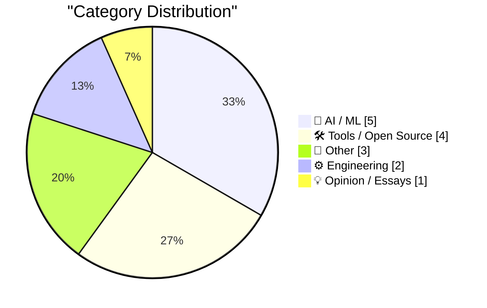
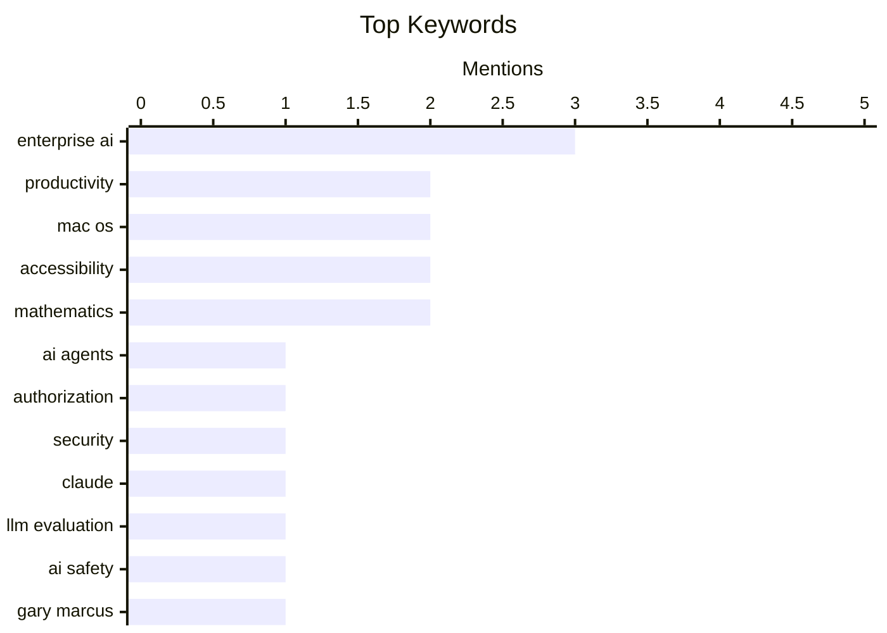

## Today's Highlights
AI adoption and deployment challenges are proving to be a significant hurdle for even leading tech companies, with authorization issues and internal integration often eclipsing model quality. Despite this, AI's utility is rapidly expanding into new internal applications, from staff interaction tools to more sophisticated assistant roles. Concurrently, the broader engineering landscape continues to focus on refining core technologies, improving web standards, and tackling persistent UI/UX and accessibility challenges in operating systems.
---
## Must Read Today
1. **[Sponsor] WorkOS FGA: The Authorization Layer for AI Agents**
[[Sponsor] WorkOS FGA: The Authorization Layer for AI Agents](https://workos.com/blog/agents-need-authorization-not-just-authentication?utm_source=daringfireball&amp;utm_medium=newsletter&amp;utm_campaign=q22026) — daringfireball.net · 16h ago · 🤖 AI / ML
> Enterprise AI agent deployment often fails due to authorization issues, not model quality or latency, as authorization defines an agent's operational scope. While authentication verifies identity, robust authorization is crucial for safely trusting AI agents in enterprise environments by controlling their "blast radius." WorkOS FGA addresses this by providing resource-level permissions to manage access and prevent unintended actions. Secure and trustworthy AI agent deployment in enterprises relies on robust authorization layers like WorkOS FGA to manage access and prevent unintended actions.
💡 **Why read it**: It highlights the critical, often overlooked, role of authorization in safely deploying AI agents in enterprise settings.
🏷️ AI agents, Authorization, Enterprise AI, Security
2. **Claude Mythos, evaluated**
[Claude Mythos, evaluated](https://garymarcus.substack.com/p/claude-mythos-evaluated) — garymarcus.substack.com · 19h ago · 🤖 AI / ML
> The article aims to evaluate the "Claude Mythos," likely concerning the perceived capabilities or safety implications of the Claude AI model. However, the provided content is too brief to extract specific arguments, technical approaches, or findings regarding this evaluation. It only poses the question, "How afraid should we be?" Consequently, a comprehensive summary and conclusion cannot be formed from the given snippet.
💡 **Why read it**: The provided content is insufficient to determine why this article is worth reading beyond its intriguing title.
🏷️ Claude, LLM evaluation, AI safety, Gary Marcus
3. **Steve Yegge**
[Steve Yegge](https://simonwillison.net/2026/Apr/13/steve-yegge/#atom-everything) — simonwillison.net · 17h ago · 🤖 AI / ML
> Google engineering, despite its technological leadership, exhibits surprisingly low internal AI adoption, mirroring that of a company like John Deere. A 20-year tech director at Google observed that the company's internal AI adoption curve shows only 20% agentic power users, 20% outright refusers, and 60% in a less engaged category. This pattern suggests a widespread industry trend rather than an isolated Google issue, indicating a significant portion of employees remain unengaged or resistant. The internal adoption of AI, even within leading tech companies like Google, is not as pervasive as external perceptions might suggest.
💡 **Why read it**: It offers a surprising insight into the actual internal AI adoption rates within major tech companies like Google, challenging common assumptions.
🏷️ Google AI, Enterprise AI, Industry trends
---
## Data Overview
| Sources Scanned | Articles Fetched | Time Window | Selected |
|:---:|:---:|:---:|:---:|
| 89/92 | 2541 -> 20 | 24h | **15** |
### Category Distribution

### Top Keywords

<details>
<summary>Plain Text Keyword Chart (Terminal Friendly)</summary>
```
enterprise ai  │ ████████████████████ 3
productivity   │ █████████████░░░░░░░ 2
mac os         │ █████████████░░░░░░░ 2
accessibility  │ █████████████░░░░░░░ 2
mathematics    │ █████████████░░░░░░░ 2
ai agents      │ ███████░░░░░░░░░░░░░ 1
authorization  │ ███████░░░░░░░░░░░░░ 1
security       │ ███████░░░░░░░░░░░░░ 1
claude         │ ███████░░░░░░░░░░░░░ 1
llm evaluation │ ███████░░░░░░░░░░░░░ 1
```
</details>
### Topic Tags
**enterprise ai**(3) · **productivity**(2) · **mac os**(2) · accessibility(2) · mathematics(2) · ai agents(1) · authorization(1) · security(1) · claude(1) · llm evaluation(1) · ai safety(1) · gary marcus(1) · google ai(1) · industry trends(1) · meta(1) · zuckerberg ai(1) · ai training(1) · servo(1) · rust(1) · crate(1)
---
## AI / ML
### 1. [Sponsor] WorkOS FGA: The Authorization Layer for AI Agents
[[Sponsor] WorkOS FGA: The Authorization Layer for AI Agents](https://workos.com/blog/agents-need-authorization-not-just-authentication?utm_source=daringfireball&amp;utm_medium=newsletter&amp;utm_campaign=q22026) — **daringfireball.net** · 16h ago · ⭐ 27/30
> Enterprise AI agent deployment often fails due to authorization issues, not model quality or latency, as authorization defines an agent's operational scope. While authentication verifies identity, robust authorization is crucial for safely trusting AI agents in enterprise environments by controlling their "blast radius." WorkOS FGA addresses this by providing resource-level permissions to manage access and prevent unintended actions. Secure and trustworthy AI agent deployment in enterprises relies on robust authorization layers like WorkOS FGA to manage access and prevent unintended actions.
🏷️ AI agents, Authorization, Enterprise AI, Security
---
### 2. Claude Mythos, evaluated
[Claude Mythos, evaluated](https://garymarcus.substack.com/p/claude-mythos-evaluated) — **garymarcus.substack.com** · 19h ago · ⭐ 27/30
> The article aims to evaluate the "Claude Mythos," likely concerning the perceived capabilities or safety implications of the Claude AI model. However, the provided content is too brief to extract specific arguments, technical approaches, or findings regarding this evaluation. It only poses the question, "How afraid should we be?" Consequently, a comprehensive summary and conclusion cannot be formed from the given snippet.
🏷️ Claude, LLM evaluation, AI safety, Gary Marcus
---
### 3. Steve Yegge
[Steve Yegge](https://simonwillison.net/2026/Apr/13/steve-yegge/#atom-everything) — **simonwillison.net** · 17h ago · ⭐ 26/30
> Google engineering, despite its technological leadership, exhibits surprisingly low internal AI adoption, mirroring that of a company like John Deere. A 20-year tech director at Google observed that the company's internal AI adoption curve shows only 20% agentic power users, 20% outright refusers, and 60% in a less engaged category. This pattern suggests a widespread industry trend rather than an isolated Google issue, indicating a significant portion of employees remain unengaged or resistant. The internal adoption of AI, even within leading tech companies like Google, is not as pervasive as external perceptions might suggest.
🏷️ Google AI, Enterprise AI, Industry trends
---
### 4. FT: ‘Meta Builds AI Version of Mark Zuckerberg to Interact With Staff’
[FT: ‘Meta Builds AI Version of Mark Zuckerberg to Interact With Staff’](https://www.ft.com/content/02107c23-6c7a-4c19-b8e2-b45f4bb9ce5f) — **daringfireball.net** · 21h ago · ⭐ 25/30
> Meta is developing an AI character based on Mark Zuckerberg to interact with its staff, aiming to provide conversation and feedback. The Meta chief is personally involved in training and testing this animated AI. The character is being trained on Zuckerberg’s mannerisms, tone, and publicly available statements to accurately reflect his persona. This initiative demonstrates Meta's unique internal application of advanced AI to create a personalized, interactive assistant for employee engagement.
🏷️ Meta, Zuckerberg AI, Enterprise AI, AI training
---
### 5. Weekly Update 499
[Weekly Update 499](https://www.troyhunt.com/weekly-update-499/) — **troyhunt.com** · 7h ago · ⭐ 23/30
> The article discusses the evolving utility of AI assistants, moving beyond solely autonomous ticket responses. The author expresses growing appreciation for an AI assistant named Bruce, highlighting its effectiveness not just in completely autonomous responses but also in assisting with human-supervised responses. This suggests a valuable hybrid model of AI interaction, where AI enhances efficiency beyond simple auto-response systems. AI assistants like Bruce are proving valuable in both autonomous and human-assisted capacities, enhancing efficiency beyond simple auto-response systems.
🏷️ AI assistant, Productivity, Troy Hunt, Weekly update
---
## Tools / Open Source
### 6. Exploring the new `servo` crate
[Exploring the new `servo` crate](https://simonwillison.net/2026/Apr/13/servo-crate-exploration/#atom-everything) — **simonwillison.net** · 22h ago · ⭐ 23/30
> The Servo team announced the initial release of the `servo` crate, packaging their browser engine as an embeddable library, prompting exploration of its capabilities. The article details research into this new `servo` crate, which is now available on crates.io. The author utilized Claude Code for web to assist in this practical, hands-on exploration of the library. The `servo` crate makes the Servo browser engine available as an embeddable Rust library, opening new possibilities for integrating browser functionalities into applications.
🏷️ Servo, Rust, Crate, Browser engine
---
### 7. Apple Frames 4
[Apple Frames 4](https://www.macstories.net/stories/introducing-apple-frames-4-a-revamped-shortcut-support-for-frame-colors-proportional-scaling-and-the-apple-frames-cli-for-developers/) — **daringfireball.net** · 14h ago · ⭐ 20/30
> The Apple Frames shortcut required a major update to support the latest Apple devices, offer more personalization, and improve performance for framing screenshots. Apple Frames 4 is a complete redesign, significantly faster, and updated to support all current Apple devices. It introduces new personalization options, including support for multiple device colors, and provides the Apple Frames CLI for developers. This comprehensive update enhances speed, device compatibility, and customization options for framing Apple device screenshots, including a new CLI for developers.
🏷️ Apple, Shortcuts, Screenshots, Utility
---
### 8. Standing on the shoulders of Homebrew
[Standing on the shoulders of Homebrew](https://nesbitt.io/2026/04/14/standing-on-the-shoulders-of-homebrew.html) — **nesbitt.io** · 4h ago · ⭐ 19/30
> The article discusses the process of "rewriting the easy parts of Homebrew," implying an effort to understand, simplify, or customize aspects of the popular package manager. However, the provided content is too brief to extract specific arguments, technical approaches, or findings regarding this process. Consequently, a comprehensive summary and conclusion cannot be formed from the given snippet.
🏷️ Homebrew, Package manager, macOS, System tools
---
### 9. MacOS Tip: Enable the Zoom ‘Peek’ Gesture
[MacOS Tip: Enable the Zoom ‘Peek’ Gesture](https://unsung.aresluna.org/testing-tip-enable-the-zoom-peek-gesture/) — **daringfireball.net** · 20h ago · ⭐ 17/30
> This article provides a macOS tip for enabling a built-in "peek" zoom gesture for quick screen magnification. Users can enable this feature by navigating to Settings > Accessibility > Zoom and turning on "Use scroll gesture with modifier keys to zoom." The gesture involves holding Control and swiping with two fingers (or using a scroll wheel) up or down. It's also recommended to disable "Smooth images" under "Advanced…" for better pixel visibility. This is a highly effective, built-in macOS feature that enhances accessibility and productivity without requiring third-party software.
🏷️ Mac OS, Zoom, Accessibility, User tip
---
## Other
### 10. Marcin Wichary Visits the Large Scale Systems Museum
[Marcin Wichary Visits the Large Scale Systems Museum](https://flickr.com/photos/mwichary/albums/72177720332956990/) — **daringfireball.net** · 18h ago · ⭐ 16/30
> This article highlights Marcin Wichary's visit to the Large Scale Systems Museum, showcasing his photographic album of vintage computer systems. The author expresses a desire to visit the museum after seeing Wichary's Flickr album (and Mastodon thread), which features numerous detailed shots, particularly of vintage keyboards. A specific "RE-START" key, broken across two lines, is singled out as an intriguing design detail. Wichary's photos offer a compelling glimpse into computing history, particularly for enthusiasts of vintage hardware and design.
🏷️ Computing history, Vintage hardware, Museum, Keyboards
---
### 11. Finding a parabola through two points with given slopes
[Finding a parabola through two points with given slopes](https://www.johndcook.com/blog/2026/04/14/artz-parabola/) — **johndcook.com** · 1h ago · ⭐ 16/30
> The article addresses the mathematical problem of finding a parabola that passes through two given points with specified slopes at those points, inspired by "Artz parabolas" in modern triangle geometry. While "Artz parabolas" are not well-documented, they are described as parabolas passing through pairs of vertices with tangents parallel to the sides. The article hints at using the general form of a conic section (ax² + bxy + cy² + …) as a starting point for the mathematical derivation. The post initiates an exploration into a specific geometric problem, suggesting a method to derive the equation of such a parabola using fundamental conic section principles.
🏷️ Parabola, Geometry, Mathematics, Slopes
---
### 12. Mathematical minimalism
[Mathematical minimalism](https://www.johndcook.com/blog/2026/04/13/the-smallest-math-library/) — **johndcook.com** · 23h ago · ⭐ 16/30
> This article discusses the concept of mathematical minimalism, specifically how all elementary functions can be derived from a minimal set of operations. It references Andrzej Odrzywolek's arXiv article, which demonstrates that all elementary functions can be obtained from just one specific function (referred to as "eml") and the constant 1. The article mentions that the paper's supplement illustrates how to bootstrap basic arithmetic operations like addition, subtraction, multiplication, and division from this "eml" function. The work highlights a profound mathematical principle that complex functions can be built from incredibly simple, fundamental components, showcasing the elegance of mathematical reductionism.
🏷️ Elementary functions, Mathematics, Foundations, Arithmetic
---
## Engineering
### 13. Back button hijacking is going away
[Back button hijacking is going away](https://idiallo.com/blog/back-button-hijacking-is-going-away-seo?src=feed) — **idiallo.com** · 2h ago · ⭐ 23/30
> "Back button hijacking," a deceptive web practice where websites manipulate browser history to prevent users from navigating back, constitutes a hostile user experience. This subtle form of hostile software, likened to the "boiling frog" analogy, traps users unknowingly. The article implies that changes are being implemented to mitigate or eliminate this practice, which will improve user control over browser navigation. Deceptive "back button hijacking" is being phased out, promising a better and less hostile browsing experience for users.
🏷️ Web standards, UX, Browser behavior, Hijacking
---
### 14. Tahoe Nitpick of the Day: ‘Reduce Transparency’ Makes Layers Harder to See, Not Easier
[Tahoe Nitpick of the Day: ‘Reduce Transparency’ Makes Layers Harder to See, Not Easier](https://mastodon.social/@tuomas_h/116397694769738857) — **daringfireball.net** · 17h ago · ⭐ 17/30
> macOS 26.4's "Reduce transparency" accessibility setting paradoxically reduces contrast and makes UI elements harder to see, rather than improving visibility. When this setting is enabled, buttons and sidebars acquire a grey cast, causing them to blend with drop shadows and diminish the contrast between background and UI elements. This design choice is criticized for failing its intended accessibility purpose, making the UI less readable. The "Reduce transparency" setting in macOS 26.4 is flawed, as it degrades UI contrast and visibility, contrary to its accessibility objective.
🏷️ Mac OS, Accessibility, UI/UX, Transparency
---
## Opinion / Essays
### 15. Pluralistic: In praise of (some) compartmentalization (14 Apr 2026)
[Pluralistic: In praise of (some) compartmentalization (14 Apr 2026)](https://pluralistic.net/2026/04/14/compartment/) — **pluralistic.net** · 5h ago · ⭐ 17/30
> This article from Pluralistic is a daily link aggregation, with a primary theme "In praise of (some) compartmentalization." The content is a collection of diverse links categorized under "Go with the flow (mostly)," "Delights to delectate," and "Object permanence." Topics range from "Multitasking teens" and "Copyrighted dirt" to "NZ internet disconnection x CHCH quake," "Hubble cake," "Churchill's booze Rx," and "Fraud-resistant election tech." It also includes updates on the author's upcoming and recent appearances and book releases. The article serves as a curated digest of interesting links and updates, highlighting various contemporary issues and the author's activities.
🏷️ Compartmentalization, Productivity, Cory Doctorow, Commentary
---
*Generated at 2026-04-14 14:01 | Scanned 89 sources -> 2541 articles -> selected 15*
*Based on the [Hacker News Popularity Contest 2025](https://refactoringenglish.com/tools/hn-popularity/) RSS source list recommended by [Andrej Karpathy](https://x.com/karpathy)*
*Produced by Dongdianr AI. Follow the same-name WeChat public account for more AI practical tips 💡*
